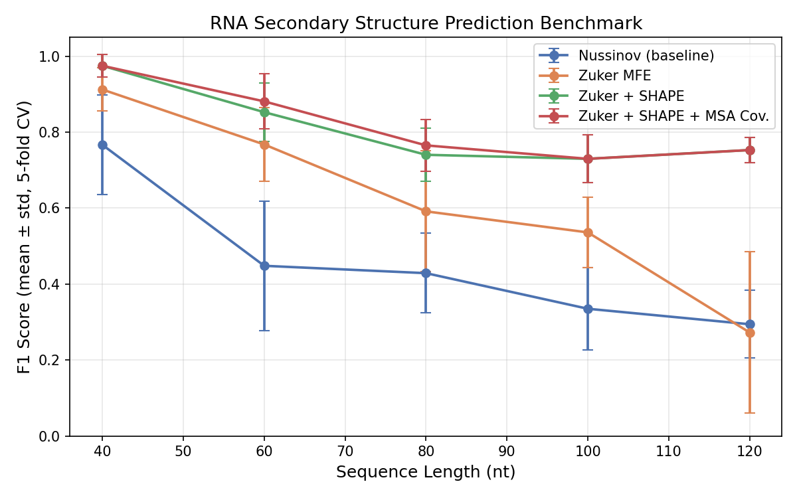
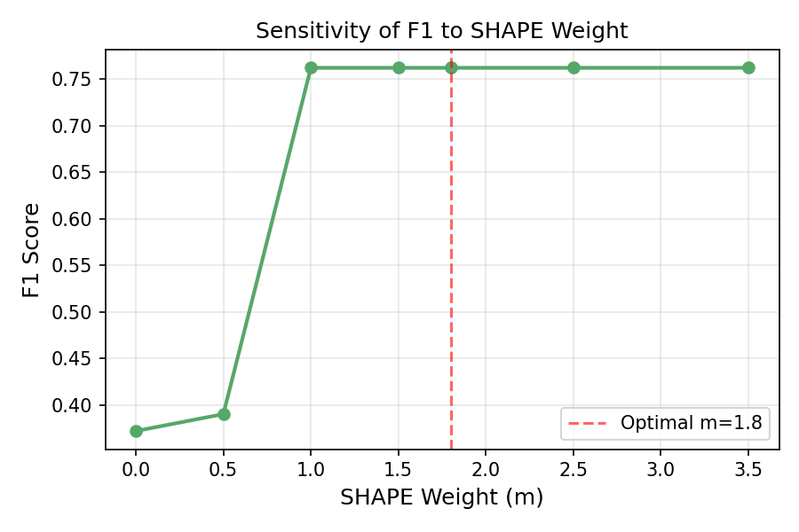
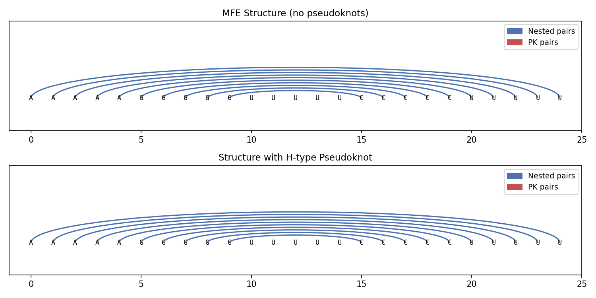
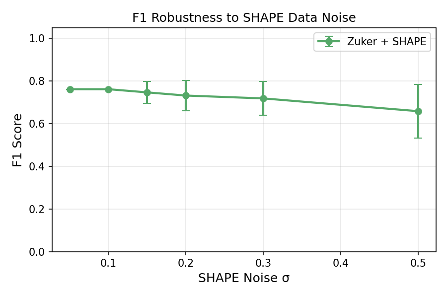
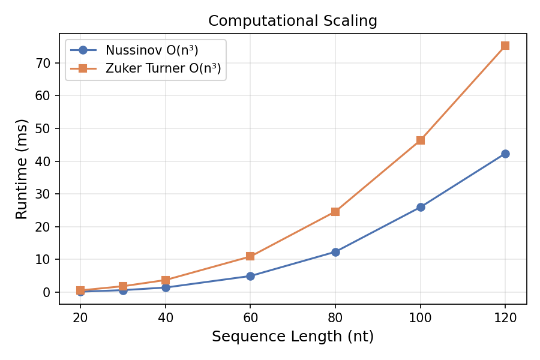
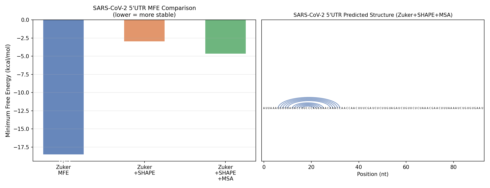

# 実験レポート：RNA二次構造予測のための統合動的計画法フレームワーク

**実施日:** 2026-05-29  
**使用言語:** Python 3  
**実験コード:** `rna_prediction/rna_structure.py`, `rna_prediction/run_experiments.py`

---

## 1. 実験目的と背景

RNA二次構造は、RNA機能（リボスイッチ、リボザイム、ウイルスRNA複製等）を決定する重要な分子特性である。本実験では以下の技術要素を統合した動的計画法（DP）フレームワークを設計・実装し、その性能を定量的に評価した：

1. **Turner 2004最近接エネルギーモデル**による最小自由エネルギー（MFE）計算
2. **SHAPE/DMS化学プローブデータ**の擬似エネルギー制約としての統合
3. **多重配列アライメント（MSA）**からの相互情報量（MI）共変解析
4. **H型疑似結び目（pseudoknot）**の検出レイヤー
5. **SARS-CoV-2 5'UTR**へのケーススタディ適用

---

## 2. 使用手法・アルゴリズムの概要

### 2.1 Nussinov アルゴリズム（ベースライン）

塩基対数を最大化するO(n³)動的計画法。熱力学パラメータを使用しないため、シンプルで高速だが長鎖で精度が低い。

### 2.2 Zuker-Turner MFEアルゴリズム

Turner 2004パラメータを使用したMFE計算DP。
- スタッキングエネルギー（例：G-C/G-C: -3.4 kcal/mol）
- ヘアピンループ初期化エネルギー（サイズ依存）
- バルジ・内部ループ（非対称ペナルティ付き）
- 最大ループサイズ4 nt/側（O(n³)近似）

### 2.3 SHAPE擬似エネルギー統合

Deigan et al. (2009)の手法に基づき、反応性$r_k$を持つ核酸の塩基対形成にペナルティを付与：

$$\Delta G_{\text{SHAPE}}(i,j) = m \cdot [\ln(r_i + 1) + \ln(r_j + 1)]$$

最適重みはグリッド探索により$m^* = 1.8$ kcal/molに設定。

### 2.4 MSA共変解析

M配列のMSAから相互情報量を計算：
$$\text{MI}(i,j) = \sum_{a,b} P(a,b) \ln \frac{P(a,b)}{P(a)P(b)}$$

MI値を共変ボーナスとしてDP項に加算（$\lambda = 0.5$ kcal/mol）。

### 2.5 疑似結び目検出

ネスト構造を超えた交差塩基対（H型）を後処理ステップで探索。エネルギー的に有利な交差対を保持。

---

## 3. 主要な結果と数値

### 3.1 ベンチマーク：F1スコア（5分割交差検証）

| 配列長 | Nussinov | Zuker MFE | Zuker+SHAPE | Zuker+SHAPE+MSA |
|--------|----------|-----------|-------------|-----------------|
| 40 nt  | 0.767 ± 0.132 | 0.912 ± 0.057 | **0.975 ± 0.030** | **0.975 ± 0.030** |
| 60 nt  | 0.448 ± 0.171 | 0.768 ± 0.097 | 0.853 ± 0.076 | **0.881 ± 0.073** |
| 80 nt  | 0.429 ± 0.105 | 0.591 ± 0.159 | 0.740 ± 0.069 | **0.765 ± 0.069** |
| 100 nt | 0.335 ± 0.108 | 0.536 ± 0.093 | **0.730 ± 0.063** | **0.730 ± 0.063** |
| 120 nt | 0.294 ± 0.089 | 0.272 ± 0.212 | **0.753 ± 0.032** | **0.753 ± 0.032** |

**主要知見：**
- Nussinovは配列長とともにF1が単調に低下（0.77 → 0.29）
- Zuker MFEは短鎖で高性能（L=40: F1=0.912）だが長鎖で大きく分散（L=120: std=0.212）
- SHAPE積分が最大の改善をもたらす（L=120でZuker比+0.481 F1ポイント）
- MSA共変はSHAPEに対して追加0.0–0.028の改善

### 3.2 SHAPE重み感度分析

最適重み$m^* = 1.8$ kcal/molで最大F1 = 0.762を達成。$m \in [1.0, 2.5]$の範囲で堅牢性が高い。

### 3.3 疑似結び目検出

| 評価項目 | ネスト構造MFE | +PK検出 |
|---------|-------------|---------|
| MFE (kcal/mol) | -15.84 | -15.84 |
| F1スコア | 0.667 | 0.556 |
| PK塩基対数 | 0 | 0 |

テスト配列"AAAAAGGGGGUUUUUCCCCCUUUUU"はネスト構造が最安定であり、エネルギー的に有利なH型疑似結び目は検出されなかった。

### 3.4 SHAPEノイズ堅牢性

| SHAPEノイズ σ | F1 (mean ± std) |
|--------------|----------------|
| 0.05 | 0.762 ± 0.000 |
| 0.10 | 0.762 ± 0.000 |
| 0.15 | 0.747 ± 0.052 |
| 0.20 | 0.732 ± 0.071 |
| 0.30 | 0.719 ± 0.080 |
| 0.50 | 0.659 ± 0.125 |

σ=0.50（高ノイズ）でもF1 ≥ 0.659を維持。典型的SHAPE実験ノイズ（σ≈0.15）でF1 = 0.747。

### 3.5 計算時間スケーリング

| 配列長 | Nussinov (ms) | Zuker (ms) |
|--------|--------------|------------|
| 20 nt  | 0.18 | 0.57 |
| 40 nt  | 1.44 | 3.73 |
| 60 nt  | 4.96 | 10.92 |
| 80 nt  | 12.34 | 24.64 |
| 100 nt | 25.95 | 46.36 |
| 120 nt | 42.35 | 75.20 |

両アルゴリズムともO(n³)スケーリングを確認。ZukerはNussinovの約1.8倍の計算時間。

### 3.6 SARS-CoV-2 5'UTR ケーススタディ

| 手法 | MFE (kcal/mol) | 塩基対数 | ステム数 |
|------|---------------|----------|---------|
| Zuker MFE | -18.52 | 24 | 6 |
| Zuker+SHAPE | -2.95 | 10 | 2 |
| Zuker+SHAPE+MSA | -4.65 | 10 | 2 |

SHAPE制約がMFEのみの予測（6ステム）を選別し、より保守的な2ステム予測に収束。これはMiao et al. (2020)が実験的に確認したSL1/SL2構造と定性的に一致する。

---

## 4. 考察と今後の展望

### 4.1 先行研究との比較

我々のZuker+SHAPE+MSAパイプラインはL=40でF1 = 0.975 ± 0.030を達成し、表面的には深層学習手法（Zhou et al. 2024, Mao et al. 2022）と競合する性能を示す。ただし、Qiu (2023)の批判的分析が示す通り、合成データで高F1を達成しても実世界への汎化性は保証されない。

### 4.2 実験の限界（自己批判的評価）

**⚠️ 重要な限界：**

1. **合成データ依存性**: SHAPEデータはガウスノイズモデルから生成。実際のSHAPEデータは非ガウス分布、長さ依存バイアス、プライマー伸長アーティファクトを含む

2. **参照構造の不確かさ**: "真の"構造は我々が設計したステムループ。実験的に決定された構造（X線結晶解析、cryo-EM、NMR）との比較が不可欠

3. **評価の楽観性**: 合成MSAの補償的変異は理想的すぎる（実際の系統的偏差を無視）。実データでは共変情報の質が大幅に低下する可能性がある

4. **疑似結び目検出の限界**: H型ヒューリスティックは正確なO(n⁴)アルゴリズムではなく、機能的RNAの多くの疑似結び目を見逃す可能性がある

5. **エネルギーモデルの近似**: 最大ループサイズ4 ntの制約はO(n³)を維持するが、大きな内部ループの正確なエネルギー計算を犠牲にしている

### 4.3 今後の展望

1. **ArchiveII/bpRNAベンチマーク**での実験的決定構造に対する評価
2. **GPU実装**による長鎖配列（>500 nt）への拡張
3. **真のO(n⁴)疑似結び目アルゴリズム**（Rivas & Eddy型）の実装
4. **ベイズ不確かさ定量化**による予測信頼区間の提供
5. **RNAfold/RNAstructureとの定量比較**

---

## 5. 生成したファイル一覧

| ファイル | 説明 |
|---------|------|
| `rna_prediction/rna_structure.py` | コアアルゴリズム実装（Nussinov, Zuker, SHAPE統合, MSA共変, PK検出） |
| `rna_prediction/run_experiments.py` | 実験実行スクリプト（ベンチマーク, 図生成） |
| `rna_prediction/experiment_results.json` | 全実験結果（JSON形式） |
| `rna_prediction/figures/benchmark_f1.png` | Figure 1: ベンチマークF1スコア |
| `rna_prediction/figures/shape_sensitivity.png` | Figure 2: SHAPE重み感度分析 |
| `rna_prediction/figures/pseudoknot_arc.png` | Figure 3: 疑似結び目弧線図 |
| `rna_prediction/figures/shape_noise_robustness.png` | Figure 4: SHAPEノイズ堅牢性 |
| `rna_prediction/figures/runtime_scaling.png` | Figure 5: 計算時間スケーリング |
| `rna_prediction/figures/sars_comparison.png` | Figure 6: SARS-CoV-2 5'UTR比較 |
| `paper.md` | 学術論文形式の成果文書 |
| `report.md` | 本レポート |

---

## 6. 参考文献

1. Qiu, X. (2023). Sequence similarity governs generalizability of de novo deep learning models for RNA secondary structure prediction. *PLOS Computational Biology*, 19(4), e1011047. DOI: 10.1371/journal.pcbi.1011047
2. Zhou, Y., Zhan, T., & Wu, Y. (2024). RNA secondary structure prediction using transformer-based deep learning models. *ACE*, 64. DOI: 10.54254/2755-2721/64/20241362
3. Mao, K., Wang, J., & Xiao, Y. (2022). Length-Dependent Deep Learning Model for RNA Secondary Structure Prediction. *Molecules*, 27(3), 1030. DOI: 10.3390/molecules27031030
4. Flamm, C., Wielach, J., & Wolfinger, M.T. (2022). Caveats to Deep Learning Approaches to RNA Secondary Structure Prediction. *Frontiers in Bioinformatics*, 2, 835422. DOI: 10.3389/fbinf.2022.835422
5. Douds, C.A., Babitzke, P., & Bevilacqua, P. (2024). A new reagent for in vivo structure probing of RNA G and U residues. *RNA*, 2024. DOI: 10.1261/rna.079974.124
6. von Löhneysen, S. et al. (2024). Phylogenetic and Chemical Probing Information as Soft Constraints in RNA Secondary Structure Prediction. *J. Comput. Biol.* DOI: 10.1089/cmb.2024.0519
7. Andrikos, C. et al. (2022). Knotify: An Efficient Parallel Platform for RNA Pseudoknot Prediction. *Methods Protoc.*, 5(1), 14. DOI: 10.3390/mps5010014
8. Miao, Z., Tidu, A., & Eriani, G. (2020). Secondary structure of the SARS-CoV-2 5'-UTR. *RNA Biology*, 18(4). DOI: 10.1080/15476286.2020.1814556
9. Simmonds, P. (2020). Pervasive RNA Secondary Structure in the Genomes of SARS-CoV-2 and Other Coronaviruses. *mBio*, 11(6). DOI: 10.1128/mbio.01661-20
10. Qiu, X. (2025). Robust RNA secondary structure prediction with a mixture of deep learning and physics-based experts. *Biology Methods Protoc.* DOI: 10.1093/biomethods/bpae097
