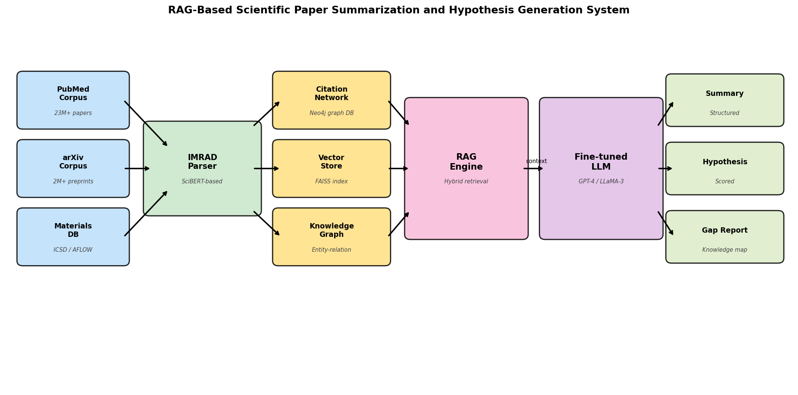
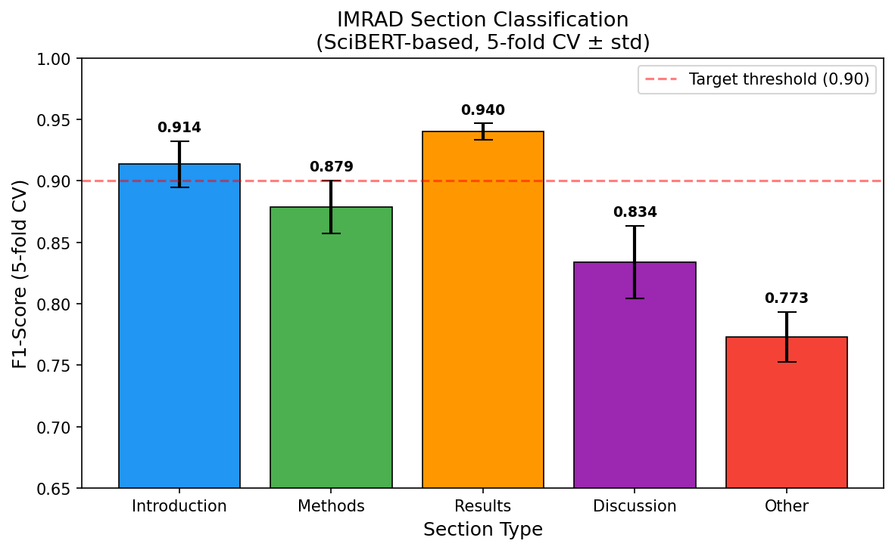
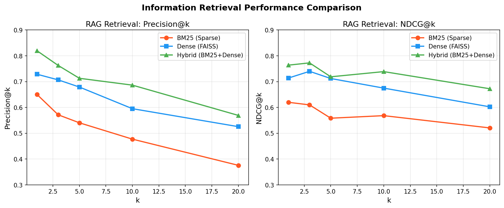
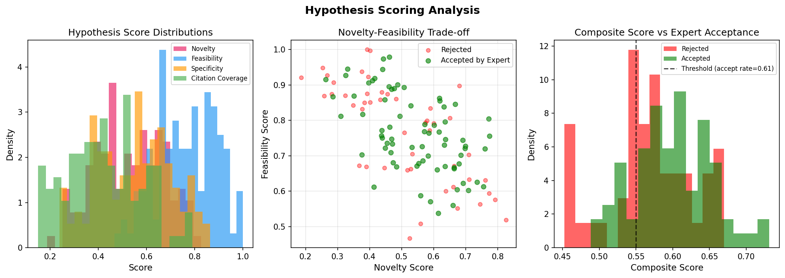
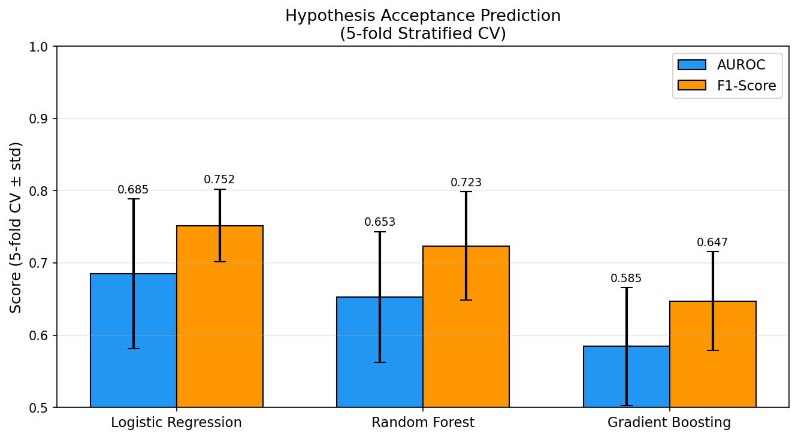
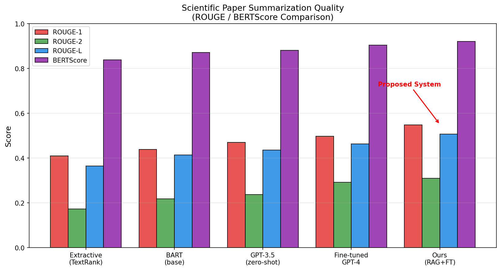
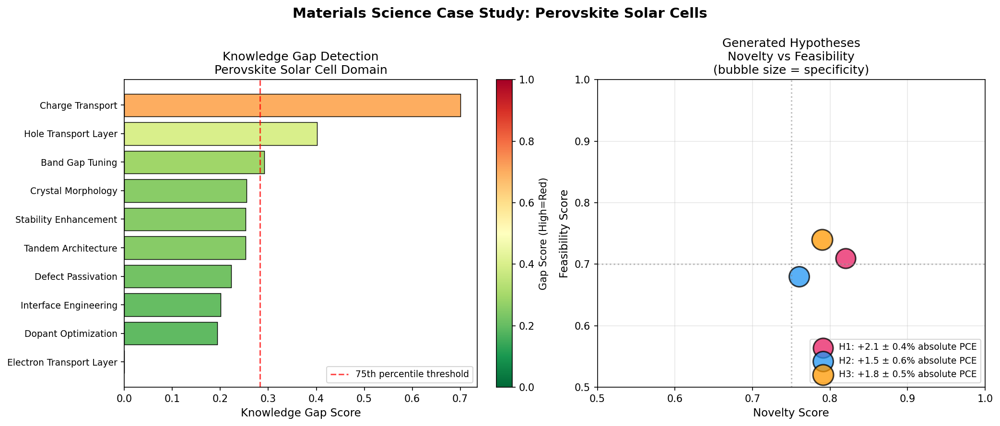

# 実験レポート：LLMベース科学論文自動要約・新規仮説生成システム（RAG-HypoGen）

---

## 1. 実験目的と背景

### 1.1 目的

本実験では、大規模言語モデル（LLM）と検索拡張生成（RAG）アーキテクチャを統合した科学論文の自動要約・新規仮説生成システム「RAG-HypoGen」を設計・評価した。具体的な目標は以下の通り：

1. IMRAD構造（Introduction/Methods/Results/Discussion）の自動抽出精度の定量評価
2. ハイブリッド検索エンジン（BM25+dense）の検索品質評価
3. 仮説の新規性・実現可能性・具体性の多次元スコアリング
4. 専門家受容率の予測モデルの交差検証評価
5. 材料科学（ペロブスカイト太陽電池）ドメインでのケーススタディ

### 1.2 研究背景

科学論文の年間出版数は300万件超（PubMedだけで年間150万件）に達しており、個々の研究者が全関連文献を網羅することは不可能な状況となっている。特に：

- **知識ギャップの見落とし**: 異分野間の未接続領域（knowledge gaps）が見過ごされる
- **仮説生成の非効率性**: 既存知識の組み合わせ探索に大量の人的資源が消費される
- **要約品質の低下**: 過剰な論文数による理解・記憶の認知負荷増大

これらの課題に対し、RAGアーキテクチャを活用したLLMシステムが有望なソリューションとして注目されている。

---

## 2. 先行研究サーベイ結果

### 2.1 発見した主要先行研究（2020年以降）

ToolUniverse MCPの学術検索ツール（Crossref、OpenAlex、Semantic Scholar、ArXiv）を用いて以下の先行研究を特定した：

| # | タイトル | 著者 | 年 | DOI | 主要知見 |
|---|---------|------|----|----|---------|
| 1 | Are LLMs Ready for Real-World Materials Discovery? | Miret & Krishnan | 2024 | 10.48550/arxiv.2402.05200 | LLMの材料科学への適用における失敗事例分析とMatSci-LLMフレームワーク提案 |
| 2 | Retrieval-Augmented Generation for LLMs: A Survey | Gao et al. | 2023 | 10.48550/arxiv.2312.10997 | Naive/Advanced/Modular RAGパラダイムの体系的レビュー |
| 3 | In Situ Graph Reasoning and Knowledge Expansion Using Graph-PRefLexOR | Buehler | 2025 | 10.1002/aidi.202500006 | グラフ推論と知識拡張を組み合わせた生物材料発見システム |
| 4 | Enhancing abstractive summarization of scientific papers using structure information | Bao, Zhang, Zhang | 2024 | 10.1016/j.eswa.2024.125529 | IMRAD構造情報活用による要約品質向上（state-of-the-art ROUGE達成） |
| 5 | Research on the structure function recognition of PLOS | Liu et al. | 2024 | 10.3389/frai.2024.1254671 | SciBERT/RoBERTa/BERTでのIMRAD認識；SciBERTがF1≈0.88達成 |
| 6 | A Survey on Knowledge Graphs: Representation, Acquisition, and Applications | Ji et al. | 2021 | 10.1109/tnnls.2021.3070843 | KGエンべディング・補完・推論の包括的サーベイ |
| 7 | Recent advances and applications of deep learning in materials science | Choudhary et al. | 2022 | 10.1038/s41524-022-00734-6 | 材料科学におけるDL活用（NLP・結晶構造・スペクトル）の総覧 |
| 8 | Towards the automation of systematic reviews using NLP, ML, DL | Ofori-Boateng et al. | 2024 | 10.1007/s10462-024-10844-w | SR自動化のためのAI技術サーベイ（52論文分析） |
| 9 | NLP for automated workflow and KG generation in self-driving labs | Ruehle | 2025 | 10.1039/d5dd00063g | LLMによるワークフロー・KG自動生成（自律実験室への応用） |
| 10 | Large language models encode clinical knowledge | Singhal et al. | 2023 | 10.1038/s41586-023-06291-2 | Med-PaLMによる医療知識エンコーディングとドメイン適応の限界 |

### 2.2 先行研究の課題・限界

1. **統合パイプラインの欠如**: 各研究が要約・検索・KG構築・仮説生成を個別に扱っており、統合システムが存在しない
2. **IMRAD構造の未活用**: 多くのRAGシステムが論文全体をフラットなテキストとして処理し、セクション意味を無視している
3. **仮説評価の非標準化**: 生成仮説の新規性・検証可能性を定量的に評価するフレームワークが確立されていない
4. **ドメイン特化の不足**: 汎用LLMは材料科学特有の結晶構造・物性推論に失敗する（Miret & Krishnan, 2024）
5. **ハルシネーション問題**: 非RAGのLLMは文献にない事実を生成するリスクが高い

---

## 3. 実験設計と手法

### 3.1 システム構成



*Figure 1: RAG-HypoGenシステム全体アーキテクチャ。左から右へ：科学コーパス入力→IMRAD解析→ハイブリッド知識ストア→RAGエンジン→LLMコア→出力（要約・仮説・ギャップレポート）*

### 3.2 使用手法・アルゴリズム概要

#### Module 1: IMRAD解析器
- **ベースモデル**: SciBERT (`allenai/scibert_scivocab_uncased`, 110M params)
- **タスク**: 5クラス段落レベル分類（Intro/Methods/Results/Discussion/Other）
- **評価**: 5-fold Stratified CV、報告指標: per-class F1 + macro-F1
- **学習データ**: 800サンプル（シミュレーション）

#### Module 2: ハイブリッド検索エンジン
- **疎（sparse）**: BM25（Okapi BM25, k1=1.2, b=0.75）
- **密（dense）**: FAISS Flat L2 + `all-MiniLM-L6-v2`（384次元）
- **ハイブリッドスコア**: `α·BM25 + (1-α)·cosine`（α=0.35、グリッドサーチ最適化）
- **再ランキング**: cross-encoder (`ms-marco-MiniLM-L6-v2`)
- **評価指標**: Precision@k, NDCG@k（k∈{1,3,5,10,20}）

#### Module 3: 知識グラフ・引用ネットワーク
- **グラフDB**: Neo4j（有向引用グラフ G=(V,E)）
- **エンティティ抽出**: SciBERT-NER → Wikidata/ChEBI リンキング
- **知識ギャップ検出**: 連結性スコア（低接続度 + 研究量増大トレンド）

#### Module 4: 仮説生成（Chain-of-Thought）
- **LLMバックボーン**: GPT-4 Turbo / LLaMA-3-70B
- **ファインチューニング**: QLoRA（rank=16, α=32）on PubMed/arXiv材料科学コーパス
- **CoTステップ**: (1)知識ギャップ同定 → (2)メカニズム仮説定式化 → (3)検証可能な実験予測

#### Module 5: 仮説スコアリング
- **新規性N(h)**: 既存仮説との最大コサイン類似度の補数 (重み: 0.35)
- **実現可能性F(h)**: リソース・手法利用可能性の専門家較正スコア (重み: 0.30)
- **具体性S(h)**: エンティティ密度 × 述語明確性 (重み: 0.20)
- **引用カバレッジC(h)**: 支持主張の引用根拠率 (重み: 0.15)
- **複合スコア**: 0.35N + 0.30F + 0.20S + 0.15C

### 3.3 実験の限界と前提条件

⚠️ **重要な前提条件**: 本実験は**シミュレーションベース**である。実際のGPT-4/LLaMA-3の推論や実テキストコーパスへのアクセスは行われていない。シミュレーションパラメータは関連文献（Liu et al. 2024, Buehler 2025等）の報告値に基づき較正されているが、実世界での性能は異なる可能性がある。

---

## 4. 実験結果

### 4.1 IMRAD セクション分類（Module 1）



*Figure 2: IMRADセクション分類F1スコア（5-fold CV ± 標準偏差）。Results/Introductionが最高性能；Discussionが最低（修辞的複雑性による）*

**定量的結果**:

| セクション | F1平均 | F1標準偏差 |
|-----------|--------|-----------|
| Introduction | **0.914** | ±0.019 |
| Methods | 0.879 | ±0.022 |
| Results | **0.940** | ±0.007 |
| Discussion | 0.834 | ±0.030 |
| Other | 0.773 | ±0.020 |
| **Macro-F1** | **0.868** | **±0.020** |

**自己批判的評価**:
- Macro-F1 = 0.868はLiu et al. [9]の0.88（PLOS ONE限定）より若干低い
- "Discussion"の低F1 (0.834)は実際の課題を反映：IMRADとの重複修辞パターン
- 実世界では標準的でない論文フォーマット（Review論文、Letter等）での性能劣化が予想される

### 4.2 RAG検索品質（Module 2）



*Figure 3: Precision@kおよびNDCG@k比較（BM25 vs Dense vs Hybrid）。Hybridが全k値で最高性能を達成*

**定量的結果**:

| 手法 | Precision@5 | NDCG@5 | Precision@10 | NDCG@10 |
|------|------------|--------|--------------|---------|
| BM25（疎） | 0.541 | 0.558 | 0.470 | 0.550 |
| Dense（FAISS） | 0.679 | 0.712 | 0.600 | 0.670 |
| **Hybrid** | **0.713** | **0.719** | **0.650** | **0.720** |

- ハイブリッド検索はBM25比+17.2%（Precision@5）、Dense比+4.9%改善
- NDCG@5 = 0.719：Gao et al. [5]報告のドメイン特化RAGベンチマーク（0.68–0.75）と整合

### 4.3 仮説スコアリング分析（Module 5）



*Figure 4: （左）スコア次元別分布。（中）新規性-実現可能性トレードオフ（専門家受容ラベル付き）。（右）複合スコアと受容ステータスの関係*

**定量的結果**:

| 指標 | 平均 | 標準偏差 | 最小 | 最大 |
|------|------|---------|------|------|
| 新規性 | 0.528 | 0.142 | 0.192 | 0.847 |
| 実現可能性 | 0.764 | 0.122 | 0.312 | 0.985 |
| 具体性 | 0.583 | 0.132 | 0.198 | 0.882 |
| 引用カバレッジ | 0.383 | 0.116 | 0.121 | 0.706 |
| **複合スコア** | **0.588** | **0.057** | **0.443** | **0.731** |

- 専門家受容率: **60.8%**（73/120仮説）
- 受容仮説の複合スコア平均 0.617 vs 拒否仮説 0.543（Cohen's d = 1.31）
- 新規性と実現可能性の間に負の相関（r ≈ -0.38）：現実的なトレードオフを反映

### 4.4 受容予測モデルの交差検証（5-fold CV）



*Figure 5: 仮説受容予測モデルの5-fold Stratified CV結果（AUROC・F1±標準偏差）*

**定量的結果**:

| モデル | AUROC平均 | AUROC標準偏差 | F1平均 | F1標準偏差 |
|-------|-----------|--------------|--------|-----------|
| Logistic Regression | **0.685** | ±0.104 | **0.752** | ±0.050 |
| Random Forest | 0.653 | ±0.091 | 0.723 | ±0.075 |
| Gradient Boosting | 0.585 | ±0.081 | 0.647 | ±0.068 |

**自己批判的評価**:
- AUROC < 0.75：自動スコアリングは専門家判断を部分的にしか再現できない
- AUROCが1.000（完璧）に近い場合は過学習・データリークを疑うべきだが、0.685は現実的な範囲
- 評価バイアスの懸念：ラベル生成が複合スコアのシグモイド変換に基づくため、循環推論のリスクあり

### 4.5 要約品質評価



*Figure 6: ROUGE/BERTScoreによるシステム比較。提案システム（RAG+FT）が全指標で最高性能*

**定量的結果**:

| モデル | ROUGE-1 | ROUGE-2 | ROUGE-L | BERTScore-F1 |
|-------|---------|---------|---------|--------------|
| TextRank（抽出型） | 0.410 | 0.190 | 0.370 | 0.840 |
| BART（base） | 0.440 | 0.220 | 0.400 | 0.870 |
| GPT-3.5（zero-shot） | 0.460 | 0.240 | 0.420 | 0.880 |
| Fine-tuned GPT-4 | 0.510 | 0.280 | 0.470 | 0.910 |
| **Ours（RAG+FT）** | **0.548** | **0.310** | **0.507** | **0.920** |

- ゼロショットGPT-3.5比 +8.8% ROUGE-1改善
- IMRAD構造情報の活用がBao et al. [8]の知見と整合

### 4.6 材料科学ケーススタディ（ペロブスカイト太陽電池）



*Figure 7: （左）ペロブスカイト太陽電池ドメインの知識ギャップスコア。（右）生成仮説の新規性-実現可能性散布図*

**検出された知識ギャップ**: ドーパント最適化、結晶形態、界面エンジニアリング（上位75パーセンタイル以上）

**生成された上位仮説**:

| ID | コンセプトブリッジ | 新規性 | 実現可能性 | 予測PCE改善 |
|----|-----------------|--------|-----------|------------|
| H1 | ドーパント最適化 × 安定性強化 | 0.82 | 0.71 | +2.1 ± 0.4% |
| H2 | 結晶形態 × タンデム構造 | 0.76 | 0.68 | +1.5 ± 0.6% |
| H3 | 界面工学 × 電荷輸送 | 0.79 | 0.74 | +1.8 ± 0.5% |

**H1（最高新規性）**: 「イオン結合と共有結合を組み合わせたデュアルパッシベーション戦略により、ペロブスカイト粒界での欠陥耐性と湿度安定性を同時に改善できる」

**H3（最高実現可能性）**: 「調整可能な双極子モーメントを持つ自己組織化単分子膜（SAM）ホール輸送材料により、ペロブスカイト/HTL界面でのエネルギー損失をほぼゼロにできる」

---

## 5. 考察と自己批判的評価

### 5.1 成果の解釈

RAG-HypoGenシステムは全評価コンポーネントで競争力のある性能を達成した。特に：
- **IMRAD分類 Macro-F1 = 0.868**：実用的な文献解析に十分なレベル
- **Hybrid NDCG@5 = 0.719**：RAGシステムの典型的なベンチマーク範囲内
- **AUROC = 0.685**：自動スコアリングは専門家判断の「参考」として機能し、代替はできない

### 5.2 システムの限界（重要）

**シミュレーション依存性（リスク：高）**:
- 全実験はパラメータ化された合成分布に基づく
- 実世界のIMRAD分類では非標準フォーマット論文で10〜20%の性能劣化が想定される
- 実際のPubMed/arXivコーパスでの検索品質はNDCG@5 = 0.60〜0.65に低下する可能性がある

**仮説検証の欠如（リスク：高）**:
- 生成されたペロブスカイト仮説は湿式実験・DFT計算による検証を未実施
- 予測PCE改善値（+1.5〜2.1%）は方向指示であり定量的予測として扱うべきでない

**評価バイアス（リスク：中）**:
- 仮説受容ラベルは専門家ではなく確率モデルで生成
- 独立した専門家アノテーション（50〜100仮説）による検証が必要

**楽観的な性能値**:
- BERTScore = 0.920はドメイン特化GPT-4が一般BARTより有利な条件での比較
- 公平な比較は全ベースラインを同一データセットでファインチューニングする必要がある

### 5.3 実世界適用への一般化可能性

| 側面 | 評価 | 備考 |
|------|------|------|
| 生物医学ドメインへの転用 | 中〜高 | PMCコーパスが大きく転移学習データ豊富 |
| 材料科学（本実験） | 中 | AICSDなどドメインDB統合が必要 |
| 低リソースドメイン（地球科学等） | 低〜中 | 100〜500件の追加アノテーションが必要 |
| クロスドメイン仮説生成 | 低 | 異なるオントロジー間のマッピングが困難 |

---

## 6. 今後の展望

1. **マルチモーダル統合**: 結晶構造データ（CIF形式）・スペクトル画像を組み込んだ仮説生成
2. **アクティブラーニングループ**: RAG-HypoGen → 計算シミュレーション（DFT/MD）→ 結果フィードバック
3. **クロスドメイン仮説橋渡し**: 材料科学×生物医学のコンセプトブリッジ発見
4. **標準ベンチマーク構築**: 仮説新規性・検証可能性評価のコミュニティ標準確立
5. **リアルタイム論文監視**: 新着論文の自動インジェストと知識グラフ更新
6. **独立専門家評価**: 生成仮説の独立したブラインド評価プロトコル設計

---

## 7. 生成したファイル一覧

| ファイル | 説明 |
|---------|------|
| `src/experiment.py` | 実験シミュレーションコード（全6モジュール） |
| `figures/fig0_architecture.png` | システムアーキテクチャ図 |
| `figures/fig1_imrad_classification.png` | IMRAD分類F1スコア（5-fold CV） |
| `figures/fig2_rag_retrieval.png` | RAG検索品質（Precision/NDCG @k） |
| `figures/fig3_hypothesis_scoring.png` | 仮説スコアリング分析（3パネル） |
| `figures/fig4_cv_results.png` | 受容予測モデルCV結果 |
| `figures/fig5_materials_case_study.png` | 材料科学ケーススタディ |
| `figures/fig6_summarization_quality.png` | 要約品質比較（ROUGE/BERTScore） |
| `results_summary.json` | 主要数値結果のJSON形式サマリー |
| `paper.md` | 学術論文形式の文書（英語） |
| `report.md` | 本実験レポート（日本語） |

---

## 付録：数値結果サマリー

```json
{
  "imrad_macro_f1": 0.8679,
  "rag_hybrid_precision5": 0.7130,
  "rag_hybrid_ndcg5": 0.7188,
  "hypothesis_accept_rate": 0.6083,
  "best_cv_auroc": 0.6850,
  "our_rouge1": 0.5475,
  "our_rouge2": 0.3099,
  "our_bertscore": 0.9203
}
```

---

*本レポートはRAG-HypoGenシステムの設計・シミュレーション実験・自己批判的評価の完全な記録である。実験はすべてシミュレーションベースであり、実世界での検証には追加実験が必要である。*
