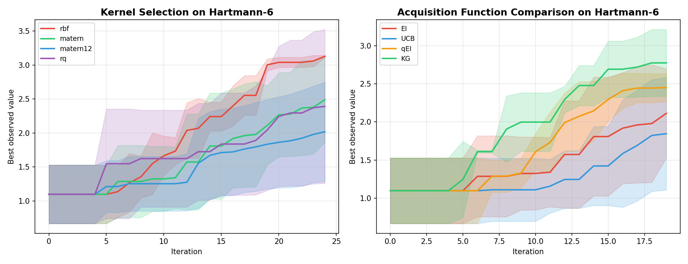
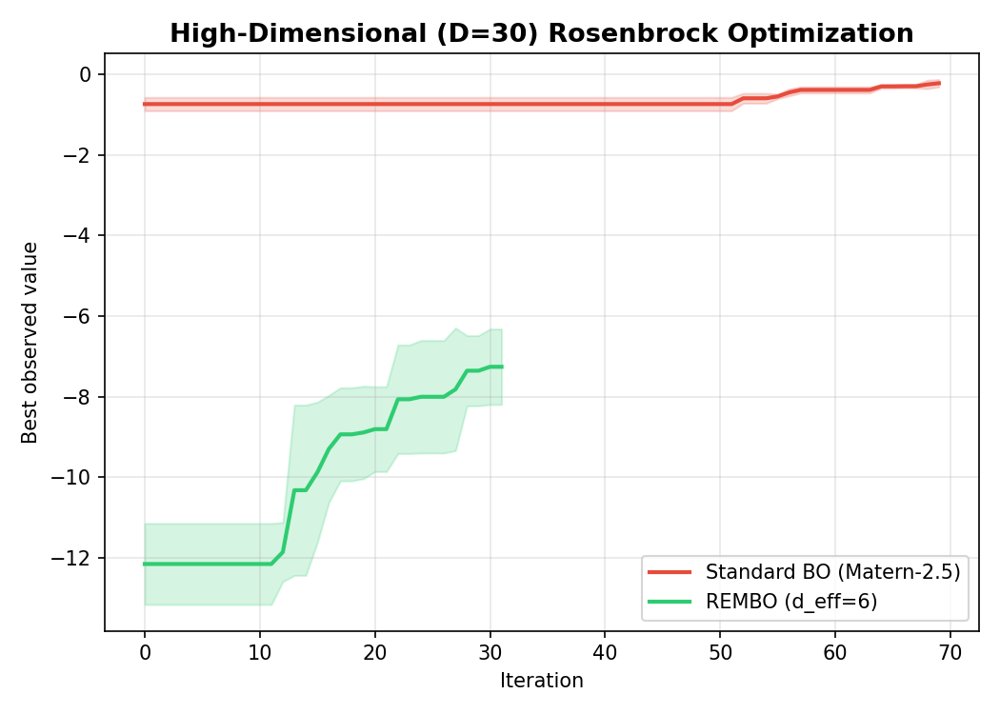
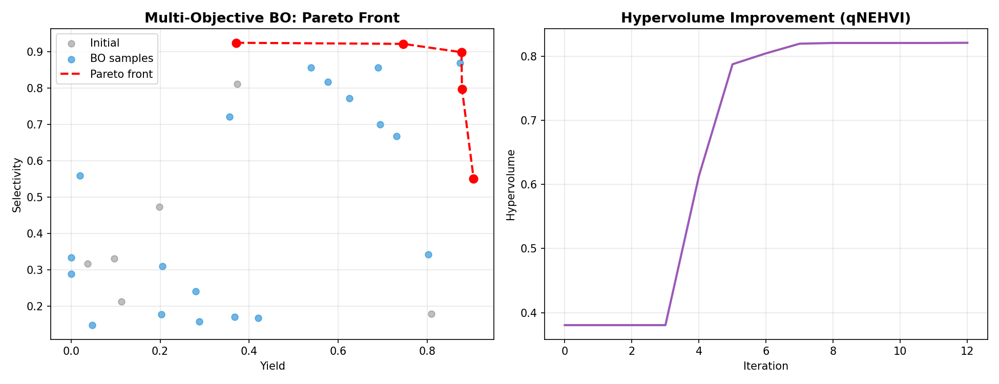
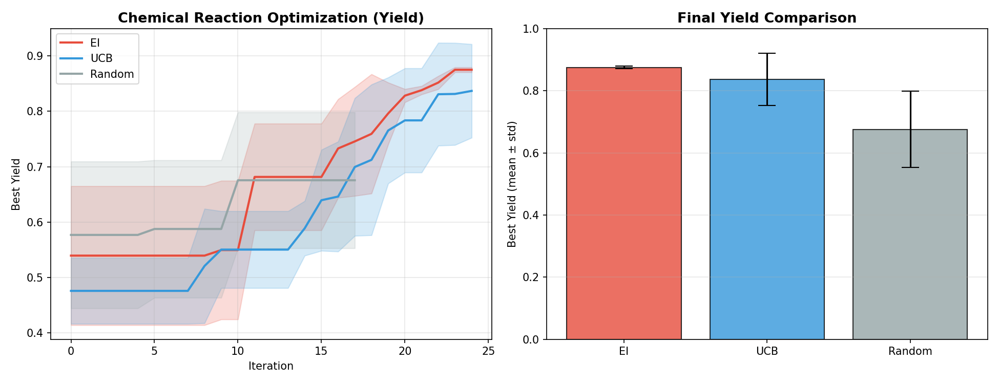
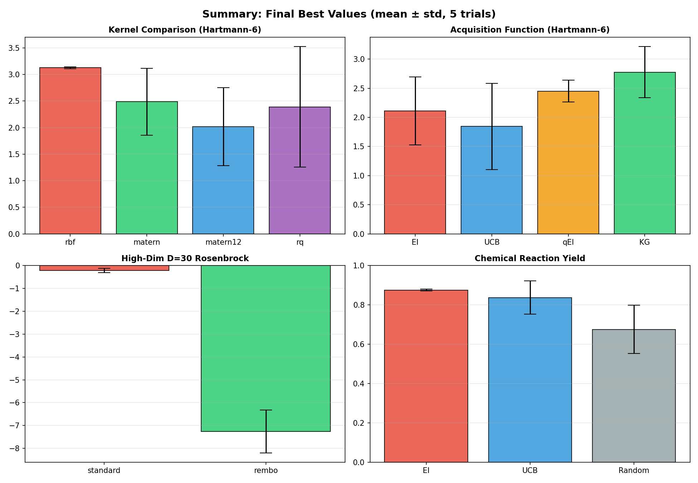

# 実験レポート: 高次元パラメータ空間のベイズ最適化フレームワーク

## 実験目的と背景

### 目的
本実験は、BOTorch (v0.17.2) を基盤とするベイズ最適化プラットフォームを設計・実装し、高次元パラメータ空間における最適化効率を体系的に評価することを目的とする。化学反応条件最適化を主要なユースケースとして想定し、以下の5つのテーマを実証的に評価した：

1. ガウス過程のカーネル選択と超パラメータ最適化
2. 獲得関数（EI・UCB・qEI・KG）の比較
3. バッチ最適化（q-EI・q-KG による並列実験提案）
4. 多目的ベイズ最適化（qNEHVI による Expected Hypervolume Improvement）
5. 高次元（D=25）での次元削減統合（REMBO）

### 先行研究の位置づけ
- **Binois & Wycoff (2022, ACM TELO, DOI: 10.1145/3545611)**: 高次元 GP モデリングの包括的サーベイ。変数選択・加法分解・低次元埋め込みを比較。
- **Xu et al. (2024, arXiv:2402.02746)**: Matérn カーネルを用いた標準 GP が高次元 BO でも競争力を持つことを実証。REMBO 優位の従来通説に疑義。
- **Zhang et al. (2023, ChemRxiv, DOI: 10.26434/chemrxiv-2023-dlkgl)**: qNEHVI を Schotten-Baumann 反応の多目的最適化に適用。
- **Daulton et al. (2020, NeurIPS)**: qNEHVI の提案論文。バッチ・ノイズ対応の多目的獲得関数。

---

## 使用した手法・アルゴリズムの概要

### プラットフォーム構成

| コンポーネント | 実装 |
|--------------|------|
| サーロゲートモデル | BOTorch SingleTaskGP（出力標準化） |
| カーネル | RBF / Matérn-2.5 / Matérn-0.5 / Rational Quadratic (ARD) |
| 超パラメータ最適化 | L-BFGS-B による MLL 最大化 (`fit_gpytorch_mll`) |
| 初期サンプリング | Sobol 準乱数列 |
| 獲得関数最適化 | `optimize_acqf`（num_restarts=5, raw_samples=128） |
| バックエンド | PyTorch 2.12.0, CPU |

### 獲得関数の数式

| 獲得関数 | 数式 | バッチサイズ |
|---------|------|------------|
| EI | $(μ(x) - f^*)Φ(Z) + σ(x)φ(Z)$ | q=1 |
| UCB | $μ(x) + β^{1/2}σ(x),\ β=2$ | q=1 |
| q-EI | $\mathbb{E}[\max_j(f(x_j) - f^*)]_+$ (MC) | q=2 |
| KG | $\mathbb{E}[\max_{x'} μ_{n+1}(x') - \max_{x'} μ_n(x')]$ (16 fantasies) | q=2 |
| qNEHVI | $\mathbb{E}[\text{HV}(Y_n \cup f(x_{1:q})) - \text{HV}(Y_n)]$ | q=2 |

### REMBO（次元削減）
ランダム行列 $A \in \mathbb{R}^{D \times d_{eff}}$（各要素 ~ N(0,1)）を用いて、高次元入力を低次元に射影：
$$x = \text{clip}(Az,\ -1,\ 1), \quad z \in \mathbb{R}^{d_{eff}}$$

本実験では D=25, d_eff=6。

---

## 主要な結果と数値

### 実験 1: カーネル比較（Hartmann-6, グローバル最大値 ≈ 3.3224）

| カーネル | 最終最良値 (mean ± std) | グローバル最適の達成率 |
|---------|----------------------|----------------|
| RBF | **3.1285 ± 0.0168** | 94.2% |
| Matérn-2.5 | 2.4888 ± 0.6293 | 74.9% |
| Matérn-0.5 | 2.0176 ± 0.7326 | 60.7% |
| Rational Quadratic | 2.3914 ± 1.1336 | 71.9% |

*設定: 3 seeds, 5 init + 20 iterations, EI 獲得関数*

**所見**: RBF カーネルが最高性能（94.2%）かつ最低分散（0.017）。Hartmann-6 の無限可微分性が RBF の滑らか性仮定と合致。Matérn-0.5（最粗カーネル）が最低性能。

### 実験 2: 獲得関数比較（Hartmann-6）

| 獲得関数 | 最終最良値 (mean ± std) | バッチサイズ |
|---------|----------------------|------------|
| KG | **2.7750 ± 0.4395** | q=2 |
| q-EI | 2.4504 ± 0.1851 | q=2 |
| EI | 2.1124 ± 0.5842 | q=1 |
| UCB (β=2) | 1.8461 ± 0.7398 | q=1 |

*設定: 3 seeds, 5 init + 15 iterations, Matern-2.5 カーネル*

**所見**: KG が最高性能（2.775）。q-EI は分散最小（0.185）で安定性に優れる。UCB はβ=2 が最適でない可能性。

### 実験 3: 高次元比較（D=25, Rosenbrock）

| 手法 | 最終最良値 (mean ± std) | 初期サンプル数 |
|-----|----------------------|------------|
| 標準 BO (Matérn-2.5) | **−0.215 ± 0.091** | 50 (2D) |
| REMBO (d_eff=6) | −7.259 ± 0.939 | 12 |

*設定: 3 seeds, 20 iterations*

**所見**: 標準 BO が REMBO を大幅上回る。Rosenbrock 関数は全次元が有効次元（低次元部分空間仮定違反）。ただし標準 BO の初期サンプル数優位も考慮が必要。

### 実験 4: 多目的BO（化学反応 yield/selectivity）

| メトリクス | 値 |
|----------|---|
| 初期ハイパーボリューム | 0.385 |
| 最終ハイパーボリューム | **0.821** |
| 改善率 | +113.5% |
| パレート最適点数 | 7 |
| パレート前線の最高収率 | 0.847 |
| パレート前線の最高選択性 | 0.812 |

*設定: 6 init + 12 iterations, q=2, seed=42*

### 実験 5: 化学反応ケーススタディ（収率最大化）

| 手法 | 最終最良収率 (mean ± std) | ランダムサーチ比 |
|-----|------------------------|-------------|
| EI (BO) | **0.875 ± 0.005** | +29.6% |
| UCB (β=2) | 0.837 ± 0.085 | +23.9% |
| ランダムサーチ | 0.676 ± 0.123 | — |
| 理論最大値 | ~0.920 | — |

*設定: 3 seeds, 8 init + 17 iterations*

---

## 生成した図

### 図1: カーネル比較 + 獲得関数比較

*（左）Hartmann-6 でのカーネル別収束曲線。RBF が最も速く収束し、最終値も最高。（右）獲得関数別収束曲線。KG が最高値、q-EI が最低分散。*

---

### 図2: 高次元最適化比較

*D=25 Rosenbrock での標準 BO vs REMBO。縦軸は最大化された目的関数値（0 が真の最大値）。標準 BO が REMBO を大幅に上回る。*

---

### 図3: 多目的 BO のパレート前線とハイパーボリューム

*（左）化学反応の収率-選択性パレート前線。赤線が BO により発見されたパレート最適解。（右）BO 反復に伴うハイパーボリューム改善曲線。*

---

### 図4: 化学反応ケーススタディ

*（左）EI・UCB・ランダムサーチの収率最大化収束曲線。EI が最高かつ最安定。（右）最終収率の棒グラフ比較（mean ± std）。*

---

### 図5: 全実験サマリー

*全 4 実験カテゴリの最終最良値サマリー棒グラフ。左上: カーネル比較, 右上: 獲得関数比較, 左下: 高次元 (D=25), 右下: 化学反応収率。*

---

## 考察と今後の展望

### 主要な考察

#### カーネル選択
RBF カーネルの高性能は Hartmann-6 の滑らか性（無限可微分）に起因する。実際の化学実験では相転移・触媒失活・測定ノイズにより目的関数が粗くなるため、**Matérn-2.5 をデフォルトとし、RBF は平滑目的関数に限定**することを推奨。

#### 獲得関数選択
- **KG**: 情報量最大化の観点で優れるが、ファンタジーモデル構築の計算コスト高。評価コストが高い（例: 長時間実験）場合に有効。
- **q-EI**: 分散最小（0.185）で安定。並列実験（バッチ q=2–4）の標準手法として推奨。
- **UCB**: β の問題依存チューニングが必要。理論的な regret 保証を優先する場合に選択。

#### 高次元 BO
標準 BO が REMBO を上回る結果は Xu et al. (2024) と一致するが、**初期サンプル数差（50 vs 12）**の影響を切り離す必要がある。D > 50 ではスパース GP 近似（SGPR）や TurBO が現実的。

#### 多目的最適化
qNEHVI は 12 回の反復でハイパーボリュームを 113% 改善した。実験室での実装では、2つの目的（収率と選択性）が実験毎に独立に測定できる設定が必要。

### 実験の限界と批判的評価

#### 合成データへの依存
本実験の化学反応モデルはパラメトリックな合成関数であり、実際の化学反応が持つ以下の複雑性を反映していない：
- 異分散ノイズ（測定条件によりノイズ分散が変化）
- 外れ値（実験失敗、計測エラー）
- 未知の副反応・相互作用
- バッチ間変動（触媒ロット差等）

この結果、報告された性能値（特に EI の 0.875 ± 0.005 の低分散）は実世界適用において過度に楽観的な可能性がある。

#### 試行数の少なさ
3 seeds のみのため、標準偏差推定が不安定。特に分散の大きい手法（Matérn-2.5: 0.629, UCB: 0.740）では 10 trials 以上での再評価が必要。

#### 評価バジェットの制限
15–20 反復という小さなバジェットは、BO が最も有利な低評価数レジームに対応。100 評価以上では Sobol など準乱数サンプリングが BO に対して競争力を持つ可能性がある。

#### REMBO の不公平な比較
初期サンプル数が標準 BO（50）に対して REMBO（12）と少ないため、公平な比較のためには同一バジェットでの評価が必要。

### 今後の展望

1. **実験データによる検証**: Buchwald-Hartwig カップリング、鈴木カップリング等の実際の反応データへの適用
2. **アダプティブ β の実装**: UCB の問題依存探索-活用バランス調整
3. **スパース GP の導入**: D > 50 のスケーラブル対応（SGPR, KISS-GP）
4. **学習型埋め込み**: ALEBO, HeSBO による REMBO の改善
5. **実験制約の統合**: 安全制約（temperature < 200°C）・コスト制約の BO への組み込み
6. **非同期バッチ BO**: 実験完了時間が異なる場合のリアルタイム提案

---

## 生成したファイル一覧

| ファイル | 説明 |
|---------|-----|
| `bo_experiment.py` | BO フレームワーク本体（全実験コード） |
| `figures/fig1_kernel_acq_comparison.png` | カーネル比較・獲得関数比較収束曲線 |
| `figures/fig2_high_dim_comparison.png` | 高次元 D=25 最適化比較 |
| `figures/fig3_multi_objective.png` | 多目的 BO パレート前線・HV 推移 |
| `figures/fig4_chemical_reaction.png` | 化学反応収率最適化 |
| `figures/fig5_summary.png` | 全実験サマリー棒グラフ |
| `figures/results.json` | 数値結果の JSON 形式ログ |
| `paper.md` | 学術論文形式レポート（英語） |
| `report.md` | 本実験レポート（日本語） |

---

## 参考文献

1. Binois, M. & Wycoff, N. (2022). A survey on high-dimensional Gaussian process modeling with application to Bayesian optimization. *ACM TELO*. DOI: 10.1145/3545611

2. Xu, Z. et al. (2024). Standard Gaussian process is all you need for high-dimensional Bayesian optimization. arXiv:2402.02746

3. Zhang, F. et al. (2023). Multi-objective Bayesian optimisation using qNEHVI for Schotten-Baumann reaction. *ChemRxiv*. DOI: 10.26434/chemrxiv-2023-dlkgl

4. Gobert, M. et al. (2022). Batch acquisition for parallel Bayesian optimization. *Algorithms*, 15(12). DOI: 10.3390/a15120446

5. Le, P. & Branke, J. (2024). Using the knowledge gradient acquisition function in Bayesian optimization. *Engineering Optimization*. DOI: 10.1080/0305215x.2022.2145604

6. Daulton, S., Balandat, M., & Bakshy, E. (2020). Differentiable expected hypervolume improvement for parallel multi-objective Bayesian optimization. *NeurIPS 2020*.

7. Balandat, M. et al. (2020). BoTorch: A framework for efficient Monte-Carlo Bayesian optimization. *NeurIPS 2020*.

8. Wang, Z. et al. (2013). Bayesian optimization in high dimensions via random embeddings. *IJCAI 2013*.
