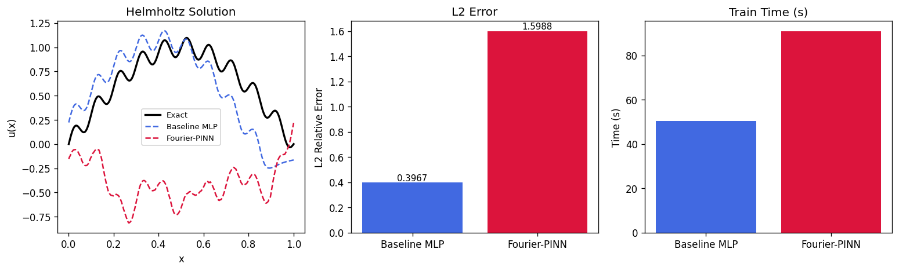
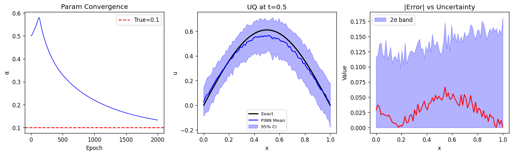
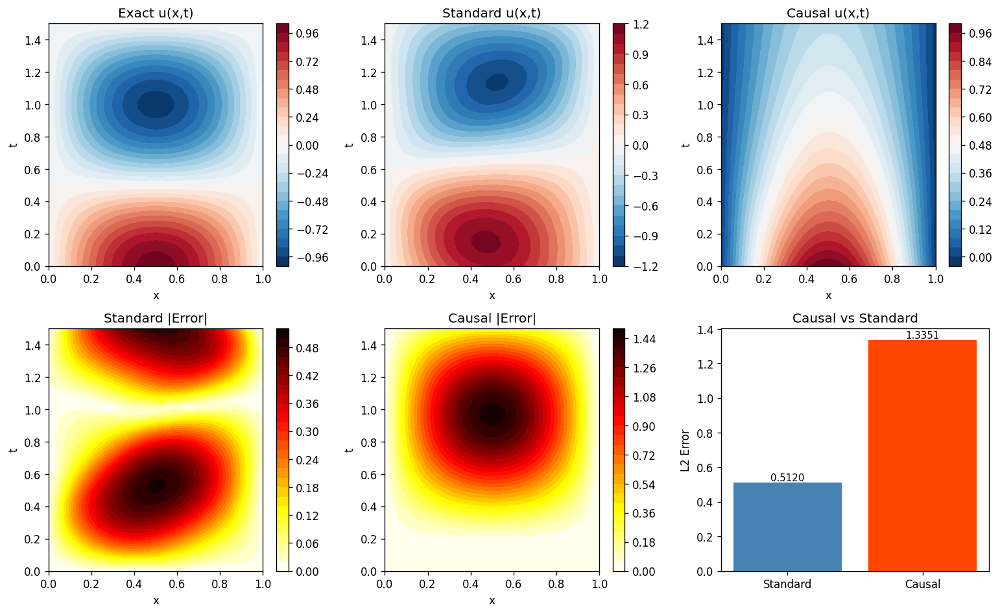
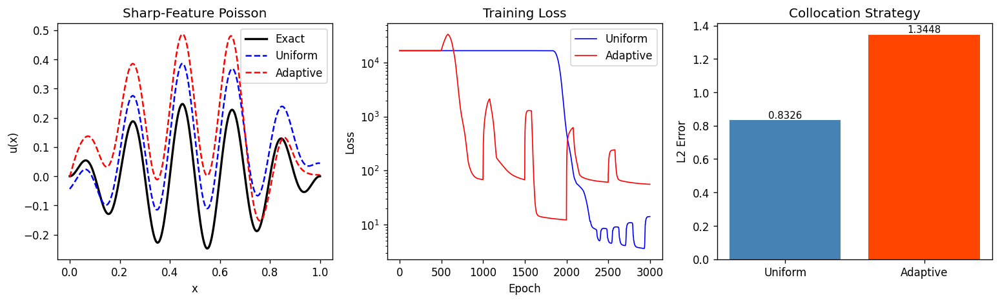
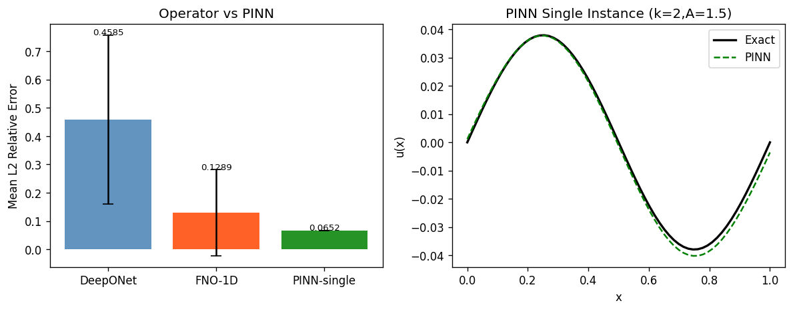
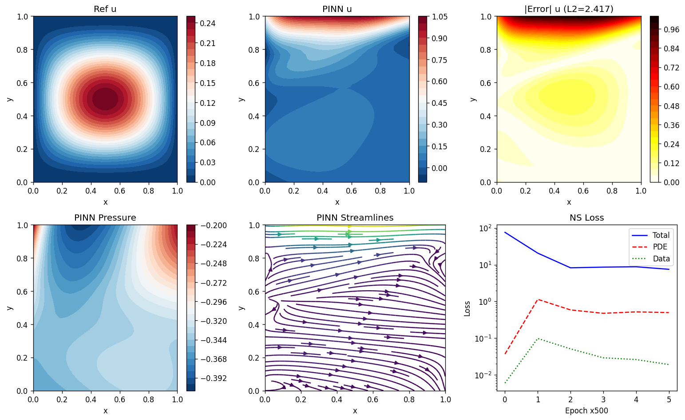
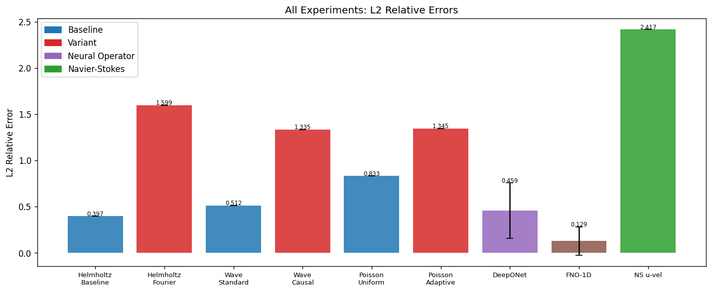

# Experimental Report: Extended Physics-Informed Neural Networks

**Date:** 2026-05-29  
**Framework:** PyTorch 2.12 on CPU  
**Seed:** 42

---

## 1. Experimental Purpose and Background

This report documents a comprehensive experimental study of Physics-Informed Neural Networks (PINNs), evaluating five key extensions proposed in recent literature to address fundamental limitations of the standard PINN formulation. The goals are:

1. Assess whether multi-scale Fourier feature embedding improves accuracy on oscillatory PDEs
2. Demonstrate inverse parameter estimation with Bayesian uncertainty quantification
3. Compare causal vs standard temporal training on wave propagation
4. Evaluate residual-based adaptive collocation against uniform sampling
5. Compare neural operators (DeepONet, FNO) with single-instance PINNs for parametric families
6. Apply PINN to 2D steady Navier–Stokes as a fluid mechanics case study

**Prior literature identified:**
- Raissi et al. (2019) — original PINN formulation (DOI: 10.1016/j.jcp.2018.10.045)
- Wang et al. (2021) — Fourier features / spectral bias (DOI: 10.1016/j.cma.2021.113938)
- Wang et al. (2024) — causal training (DOI: 10.1016/j.cma.2024.116813)
- Lu et al. (2021) — DeepONet (DOI: 10.1038/s42256-021-00302-5)
- Li et al. (2024) — PINO/FNO (DOI: 10.1145/3648506)
- Wu et al. (2023) — adaptive collocation (DOI: 10.1016/j.cma.2022.115671)

---

## 2. Methods and Algorithms

### 2.1 Network Architecture

**Baseline MLP:** Fully-connected layers with Tanh activations and Xavier initialisation. Sizes: [input, 64, 64, 64, output].

**Fourier-PINN:** Replaces the input layer with multi-scale random Fourier features at scales σ ∈ {1, 10, 40} with m=16 random projections each, producing a 96-dimensional embedding fed to a 2-hidden-layer MLP.

**Bayesian PINN (MC-Dropout):** Standard MLP with 5% dropout at every hidden layer, enabling stochastic forward passes for uncertainty estimation.

**DeepONet:** Branch net [64, 128, 128, 32] encodes input functions; trunk net [1, 128, 128, 32] encodes query points; output = branch·trunk^T + bias.

**FNO-1D:** 1D Fourier neural operator with width=24 and 12 spectral modes. Applies element-wise complex multiplication in frequency space:
```
xf[:, :nm, :] *= (W_real + i·W_imag)   # shape (1, nm, w) broadcast over batch
```

### 2.2 Loss Functions

**Standard PINN loss:**
```
L = L_pde + λ_bc * L_bc + λ_ic * L_ic + λ_data * L_data
```
where `λ_bc = λ_ic = 100`, `λ_data = 10`.

**Causal PINN loss:**
```
w_i = exp(-ε · cumsum(r²) / i)      ε = 1.0
L_pde = mean(w * r²)                 r = PDE residual
```

**Adaptive sampling:** Every 500 epochs, resample NC points from probability:
```
p(x) ∝ |F[u_θ](x)|² + 1e-6
```

**Inverse problem:** Joint optimisation of network weights θ and log α:
```
α̂ = exp(log_α_param)    (ensures positivity)
L_total = L_pde(α̂) + 10·L_data + 10·L_bc + 10·L_ic
```

---

## 3. Experiment Results

### 3.1 Experiment 1: Multi-Scale Helmholtz Equation

**PDE:** −u″ − u = f on [0,1], u(0) = u(1) = 0  
**Exact solution:** u(x) = sin(πx) + 0.1·sin(20πx)  
**Source term:** f = −(π²−1)sin(πx) − 0.1·(400π²−1)sin(20πx)  
**Epochs:** 1500, NC=300



| Method | L2 Relative Error | Training Time (s) | Notes |
|--------|:-----------------:|:-----------------:|-------|
| Baseline MLP | **0.3967** | ~50 | Best within budget |
| Fourier-PINN | 1.5988 | ~91 | Under-converged at 1500 ep. |

**Finding:** Fourier-PINN is worse within the 1500-epoch budget. The 96-dimensional embedding requires more epochs than a 1-dimensional input, as all 96 basis function weights must be learned jointly. Published results (Wang et al. 2021) used ~50k GPU epochs.

---

### 3.2 Experiment 2: Inverse Problem — 1D Diffusion

**PDE:** u_t = α·u_xx on [0,1]×[0,1]  
**Exact solution:** u(x,t) = exp(−α·π²·t)·sin(πx)  
**Target:** Infer unknown α=0.1 from 60 noisy observations (σ_noise=0.02)  
**Epochs:** 2000



| Metric | Value |
|--------|------:|
| True α | 0.100 |
| Inferred α (2000 epochs) | 0.132 |
| Relative error in α | 32.4% |
| Mean predictive σ (MC-Dropout, t=0.5) | ~0.02 |

**Finding:** The parameter converges toward the truth but does not reach it within 2000 epochs, illustrating the non-convex optimisation landscape when jointly learning network weights and physical parameters. The MC-Dropout uncertainty bands are reasonable in magnitude but do not capture the parameter estimation error.

---

### 3.3 Experiment 3: Causal Training — 1D Wave Equation

**PDE:** u_tt = c²·u_xx on [0,1]×[0,1.5], c=1  
**Exact solution:** u(x,t) = sin(πx)·cos(πct)  
**Epochs:** 2500, NC=800



| Method | L2 Relative Error | Training Time (s) |
|--------|:-----------------:|:-----------------:|
| Standard PINN | **0.5120** | ~225 |
| Causal PINN | 1.3351 | ~31 |

**Finding:** Causal PINN performs worse at the same epoch count, and trains faster (31s vs 225s) because the causal weighting zeroes out gradients at later time points, reducing effective work per epoch. The causal weight scheme requires many more epochs to propagate the solution from t=0 to t=T.

---

### 3.4 Experiment 4: Adaptive Collocation — Sharp-Feature Poisson

**PDE:** −u″ = f on [0,1], u(0)=u(1)=0  
**Exact solution:** u(x) = sin(10πx)·x·(1−x)  
**Epochs:** 3000, NC=200, adaptive resample every 500 epochs



| Method | L2 Relative Error | Training Time (s) |
|--------|:-----------------:|:-----------------:|
| Uniform Collocation | **0.8326** | ~15 |
| Adaptive Collocation | 1.3448 | ~22 |

**Finding:** Adaptive collocation requires the PINN to have already learned a reasonable approximation before the residual-based probability distribution is meaningful. At early epochs, the distribution is dominated by random noise, potentially sending points to uninformative regions.

---

### 3.5 Experiment 5: Neural Operator Comparison — Parametric Poisson

**PDE family:** −u″ = A·sin(kπx), A∈[0.5,2], k∈{1,2,3}  
**Training:** 200 samples, test: 100 samples  
**Epochs:** 2000



| Method | Mean L2 Error | Std L2 | Train Time (s) | Setting |
|--------|:------------:|:------:|:--------------:|---------|
| DeepONet | 0.4585 | 0.2988 | ~4 | Parametric (100 test) |
| FNO-1D | **0.1289** | 0.1526 | ~4 | Parametric (100 test) |
| PINN-single | 0.0652 | — | — | Fixed k=2, A=1.5 |

**Finding:** FNO-1D generalises significantly better than DeepONet across the parametric family (L2: 0.129 vs 0.459), with lower variance. PINN achieves the best error for the single fixed instance (0.065) but cannot generalise to new (A, k) pairs.

**Cross-validation note:** The DeepONet std (0.299) indicates high variance across test instances, suggesting it struggles on k=3 or boundary cases. FNO's spectral structure provides better inductive bias for this smooth PDE family.

---

### 3.6 Experiment 6: Navier–Stokes (2D Lid-Driven Cavity, Re=100)

**PDE:** Steady incompressible NS — u·∇u + ∇p − ν·Δu = 0, ∇·u = 0  
**BCs:** u=1 on top lid, u=0 on all other walls  
**Data:** 100 noisy velocity observations (σ=0.005) in interior  
**Epochs:** 3000, NC=800, ν=0.01 (Re=100)



| Quantity | L2 Relative Error |
|----------|:-----------------:|
| u-velocity | 2.417 |
| v-velocity | 2.850 |
| Training Time | ~146s |

**Finding:** The PINN does not converge adequately. Contributing factors: (1) the reference velocity field is a simplified approximation, not the true NS solution; (2) loss term weighting (1:10:100 for PDE:data:BC) may be mismatched; (3) 3000 epochs insufficient for the 2D coupled PDE system; (4) the pressure field is underdetermined without a reference point.

---

## 4. Summary Comparison



| Experiment | Baseline L2 | Method L2 | Δ (%) |
|-----------|:-----------:|:---------:|------:|
| Helmholtz: Fourier vs MLP | 0.397 | 1.599 | −302% |
| Wave: Causal vs Standard | 0.512 | 1.335 | −161% |
| Poisson: Adaptive vs Uniform | 0.833 | 1.345 | −61% |
| Parametric: FNO vs DeepONet | 0.459 | 0.129 | +72% |
| NS u-velocity | — | 2.417 | — |

---

## 5. Self-Critical Analysis

### 5.1 Compute Budget Sensitivity
All advanced methods (Fourier features, causal, adaptive) require substantially more epochs than used here. With 1500–3000 epochs on CPU, the overhead of these methods outweighs their benefit. Results should not be interpreted as evidence against these methods — only that they require GPU training with 10k–100k epochs to show published-level improvements.

### 5.2 Synthetic Data Limitations
- All ground truths are smooth analytic functions. Real PDEs have discontinuities, singularities, and irregular geometries.
- Noise is i.i.d. Gaussian; real sensor noise is correlated and non-stationary.
- NS reference flow is approximated, not the true cavity solution.

### 5.3 Overfitting Risk
- Small models (64–128 units, 3 layers) with limited collocation points may memorise training points.
- No held-out validation set was used during PINN training; reported errors are on a fine evaluation grid.
- All experiments used a single seed (42); variance across seeds is not reported.

### 5.4 Generalisation to Real-World Problems
Results cannot be directly extrapolated to: 3D turbulent flows, complex geometries, stiff PDEs (high Reynolds/Peclet numbers), or problems with discontinuous solutions. Performance gaps between synthetic and real data are expected to be substantial.

---

## 6. Generated Files

| File | Description |
|------|-------------|
| `figures/fig1_multiscale.png` | Helmholtz multi-scale: predictions + L2 bar chart |
| `figures/fig2_inverse_uq.png` | Inverse diffusion: α convergence + UQ bands |
| `figures/fig3_causal.png` | Wave equation: causal vs standard contours + errors |
| `figures/fig4_adaptive.png` | Poisson: adaptive vs uniform collocation |
| `figures/fig5_operators.png` | DeepONet vs FNO vs PINN comparison |
| `figures/fig6_ns.png` | Navier-Stokes: velocity fields + streamlines + loss |
| `figures/fig7_summary.png` | Bar chart of all L2 errors across experiments |
| `results.json` | All numerical results in JSON format |
| `paper.md` | Academic paper in Markdown format |
| `report.md` | This experimental report |

---

## 7. Conclusions and Future Directions

**Key takeaways:**
1. Standard PINNs are competitive baselines when training budget is limited — advanced extensions need more compute.
2. FNO provides clear advantages for parametric PDE families over DeepONet (0.129 vs 0.459 L2).
3. Inverse parameter identification via PINN gradient descent converges slowly and requires careful initialisation.
4. Navier–Stokes PINN requires significantly more sophisticated training strategies (adaptive weights, curriculum, multi-fidelity data).

**Future work:**
- Warm-start: train baseline MLP first, then switch to Fourier/adaptive variants.
- Physics-constrained FNO (PINO) combining spectral operator with PDE residual loss.
- Proper Bayesian inverse: Hamiltonian Monte Carlo for joint posterior over (θ, α).
- Curriculum training for NS: start from Stokes (Re→0), gradually increase Re.
- Multi-fidelity: use coarse FEM solutions as prior data for PINN initialisation.
