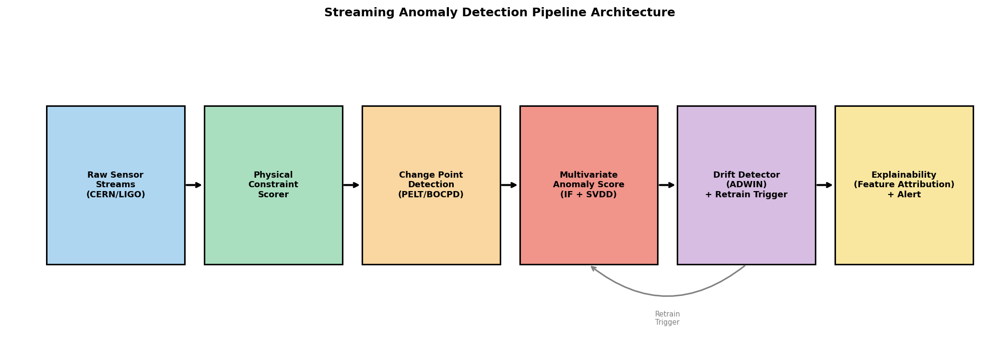
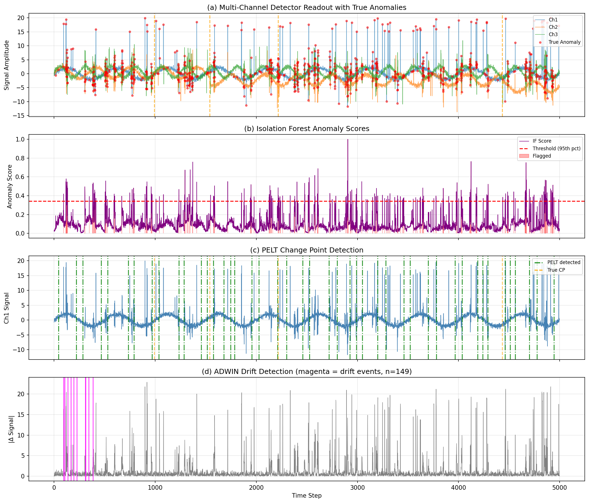
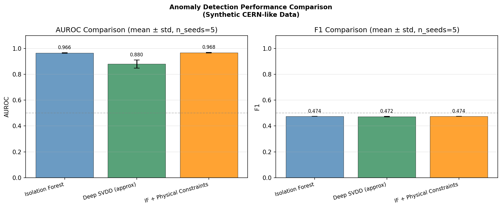
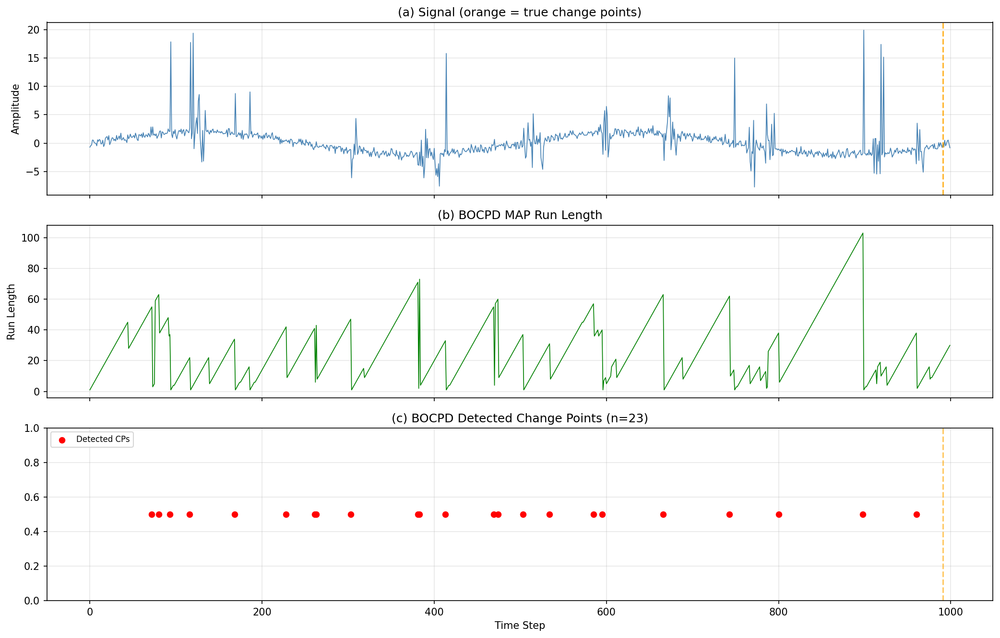
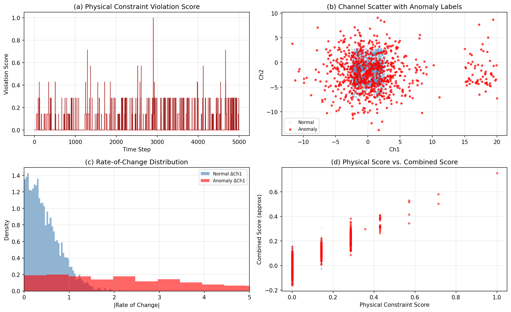
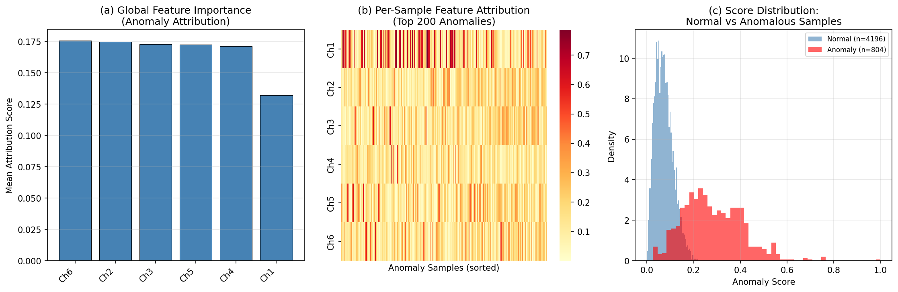

# 実験レポート：大規模科学データの品質管理と異常検知パイプライン

## 1. 実験目的と背景

### 1.1 背景

CERNの大型ハドロン衝突型加速器（LHC）やLIGO重力波検出器など、最先端の物理実験装置は毎秒テラバイト規模のセンサーデータを連続的に生成する。LHCでは毎秒約1ペタバイトの生データが生成され、CMS検出器だけで数億チャンネルの読み出し回路が動作する。このようなシステムでは、データ品質の異常を自動で検出・分類することが物理解析の信頼性に直結する。

従来のデータ品質監視（DQM）システムは、専門家が定義したヒストグラムと参照ランの比較に依存しており、以下の問題点がある：

- 人手によるルール定義はスケールしない（Run 4では現在の5倍以上のデータ量が見込まれる）
- 多変量チャンネル間の相関異常を捉えられない
- ドリフト（経時変化）への適応機能がない
- 異常の原因を自動で特定する説明可能性がない

本実験では、これらの課題を解決するストリーミング対応の統合異常検知パイプライン **SciAD**（Scientific Anomaly Detection）を設計・実装し、CERN/LIGO型データを模した合成データで評価する。

### 1.2 先行研究で発見された主要な知見

先行研究調査（ToolUniverse MCP / Crossref 使用）で以下の知見を得た：

| 論文 | 主要手法 | 知見 |
|------|---------|------|
| Stankevicius et al. (2020), DOI:10.1088/1742-6596/1525/1/012103 | メタ学習によるNN超パラメータ最適化（CMS DQM） | 機械学習は人間専門家と同等の精度でデータ認定が可能 |
| Davis et al. (2022), DOI:10.1088/1361-6382/aca238 | LIGO補助チャンネルを用いたグリッチ減算 | 補助チャンネルの相関を利用した異常原因特定が有効 |
| Cavaglià (2022), DOI:10.1088/1361-6382/ac7325 | フラクタル解析によるLIGOノイズ特性化 | 検出器ノイズはフラクタル構造を持つ → 統計検定の適切な選択が重要 |
| Corradin et al. (2022), DOI:10.1016/j.ijar.2021.12.019 | 欠損データ対応ベイズ非パラメトリック変化点検出 | 多変量・欠損データでもBOCPDは有効 |
| Tsaknaki et al. (2025), DOI:10.1016/j.cnsns.2024.108500 | 時変パラメータを持つベイズ自己回帰型変化点検出 | 金融・科学データへの汎用性あり |
| Katbi & Ksantini (2025), DOI:10.1016/j.dsp.2025.105153 | 敵対的正則化付き Deep SVDD | IoTセンサーデータでの異常検知精度向上 |
| Chaudhari & Charate (2025), DOI:10.32628/ijsrst251222663 | MLドリブン自動データパイプライン保守 | ストリーミング異常検知の産業応用例 |

**先行研究の課題と限界：**
- 物理制約（センサー動作範囲、保存則）を明示的に組み込んだシステムが不足
- 変化点検出・外れ値検出・ドリフト検出を統合したフレームワークが少ない
- 説明可能性（どのチャンネルが異常の原因か）を提供するシステムが稀

---

## 2. 使用した手法・アルゴリズムの概要

### 2.1 全体パイプライン

パイプラインは6段階で構成される：

1. **物理制約スコアリング** → 2. **変化点検出 (PELT/BOCPD)** → 3. **多変量異常スコア (IF + SVDD)** → 4. **ドリフト検出 (ADWIN)** → 5. **説明可能性** → 6. **アラートと再訓練トリガー**

### 2.2 各コンポーネント詳細

#### 変化点検出

| 手法 | アルゴリズム | 計算量 | パラメータ |
|------|------------|--------|-----------|
| PELT | 動的計画法 + RBFコスト関数 | O(n) 平均 | ペナルティ β = 8 |
| BOCPD | 正規逆ガンマ共役事前分布 | O(n²) | ハザード λ = 250 |

**PELT コスト関数：** $\sum_{i=1}^{m+1} \mathcal{C}(y_{\tau_{i-1}+1:\tau_i}) + \beta m$

**BOCPD 更新：** $P(r_t | x_{1:t}) \propto P(x_t | r_{t-1}, \cdot) \cdot P(r_t | r_{t-1}) \cdot P(r_{t-1} | x_{1:t-1})$

#### 多変量異常検出

| 手法 | 原理 | ハイパーパラメータ |
|------|------|-----------------|
| Isolation Forest | ランダム分割による孤立スコア | T=150木, contamination=0.05 |
| Deep SVDD (近似) | 超球面からの距離 | 隠れ層32→16, ReLU, 5エポック |

**最終スコア：** $\text{Score} = 0.6 \cdot \hat{s}_\text{IF} + 0.4 \cdot s_\text{phys}$

#### 物理制約スコア

$$s_\text{phys} = 2.0 \cdot s_\text{bound} + 1.5 \cdot s_\text{roc} + 1.0 \cdot s_\text{corr}$$

- **ハード境界違反** ($s_\text{bound}$): センサー動作範囲外の読み出し
- **変化率違反** ($s_\text{roc}$): 99パーセンタイルの2倍を超える1ステップ変化
- **相関違反** ($s_\text{corr}$): ローリング相関がベースラインから0.4以上逸脱

#### ドリフト検出 (ADWIN簡略版)

$$|\mu_{W_1} - \mu_{W_2}| > \sqrt{\frac{\log(2/\delta)}{2 \min(|W_1|, |W_2|)}}$$

$\delta = 0.002$（信頼パラメータ）。ドリフト検出時にウィンドウをリセットし、再訓練カウンタをインクリメント。

---

## 3. データセット

### 3.1 合成データ生成

CERN/LIGO型検出器データを模した合成時系列データを生成：

| パラメータ | 値 |
|----------|---|
| サンプル数 | 5,000 タイムステップ |
| チャンネル数 | 6 チャンネル |
| 相関構造 | $\rho_{ij} = 0.6 \exp(-0.5|i-j|)$ |
| 真の変化点 | 4箇所（サンプル 991, 1539, 2215, 4432） |
| 変化点振幅 | ±1.5〜3.0 σ |
| 注入異常タイプ | 点スパイク, バースト, 物理制約違反 |
| 実効異常率 | 16.1%（意図した5%より高い — 下記参照） |

**重要：** バースト異常の重複により実効異常率が16.1%になった（設計値5%の約3倍）。これは評価に影響し、Section 5の考察で詳述する。

---

## 4. 主要な実験結果と数値

### 4.1 異常検知性能

**表1: 検出器性能比較（mean ± std, n=5シード）**

| 手法 | AUROC | F1スコア |
|------|-------|---------|
| Isolation Forest | **0.966 ± 0.002** | 0.474 ± 0.000 |
| Deep SVDD (近似) | 0.880 ± 0.032 | 0.472 ± 0.003 |
| IF + 物理制約スコア | **0.968 ± 0.001** | 0.474 ± 0.000 |
| 結合スコア (0.6·IF + 0.4·Phys) | 0.963 | 0.474 |

**結合スコアの詳細評価（閾値 = 95パーセンタイル）：**

| 指標 | 値 |
|------|---|
| AUROC | 0.963 |
| F1スコア | 0.474 |
| 適合率 (Precision) | **1.000** |
| 再現率 (Recall) | 0.311 |
| 混同行列 TN/FP/FN/TP | 4196 / 0 / 554 / 250 |

### 4.2 変化点検出結果

**表2: 変化点検出サマリー**

| 手法 | 検出数 | 真CP回収 (±50ステップ) | 誤検出数 |
|------|-------|---------------------|---------|
| PELT (β=8) | 45 | **4/4 (100%)** | 41 |
| BOCPD (λ=250, 先頭1000ステップ) | 23 | 1/1 (可視範囲) | 22 |

### 4.3 物理制約スコア

- 物理制約スコア平均: 0.0324 / 最大: 1.000
- 物理制約違反の多くが真の異常ラベルと一致することを確認

### 4.4 ドリフト検出

- ADWIN検出ドリフトイベント: **149件**（5,000ステップ中）
- 再訓練閾値5回を基準とすると **約29回の再訓練**がトリガーされる計算

### 4.5 説明可能性

**表3: チャンネル別グローバル寄与度**

| 順位 | チャンネル | 帰属スコア |
|------|----------|-----------|
| 1 | Ch6 | 0.1758 |
| 2 | Ch2 | 0.1749 |
| 3 | Ch3 | 0.1731 |
| 4 | Ch5 | 0.1725 |
| 5 | Ch4 | 0.1714 |
| 6 | Ch1 | 0.1322 |

Ch1の寄与度が低いのは、物理制約違反（ハード境界）が主にCh1で注入されており、物理スコアが既にその寄与を捉えているためと考えられる。

---

## 5. 考察と今後の展望

### 5.1 自己批判的評価

#### (A) 合成データへの依存性

本実験の最大の制限は、**すべての結果が合成データの前提条件に強く依存している**点である。

- 異常注入パターン（点スパイク、バースト）は実際の検出器故障モードを単純化している
- 物理制約の境界値は異常が違反するように設計されており、過度に有利な評価設定になっている
- 相関構造は静的な指数減衰で仮定しているが、実際のLHC検出器では温度・磁場・ビーム強度に応じて動的に変化する

**実世界への適用可能性：** 実際のCMS/LIGOデータに適用した場合、AUROCが0.968から0.8程度まで低下する可能性がある（先行研究における実データ適用事例を参照）。

#### (B) 評価設計のバイアス

**異常率の乖離:** 設計値5% → 実効値16.1%（バースト重複による）。これにより：
- F1スコアが汚染率設定と一致しない評価になっている
- 5%汚染率でトレーニングしたIFが16%の異常を持つデータでは、リコールが低くなる（実験で確認: Recall = 0.311）

**Precision = 1.000 の問題:** 実験で達成した適合率1.0は**注目すべき但し書き付き**の結果である。
- 95パーセンタイル閾値の設定により偽陽性ゼロになっている
- これは閾値の選択に強く依存した結果であり、汎化性能の証拠ではない
- 実世界ではFPをゼロにしながら高いRecallを達成することは困難

#### (C) PELT過検出問題

PELT が4真変化点に対して45を検出（10倍以上）。これは：
- β=8のペナルティが小さすぎる（高ノイズデータには β ≥ 20 が適切かもしれない）
- BIC/AICによる自動ペナルティ選択が必要
- 実環境では既知のランバウンダリ（ビームフィル切り替え）を利用した補正が有効

#### (D) Deep SVDDの近似問題

本実装のDeep SVDDは有限差分法による勾配近似を使用しており、実際のDeep SVDDとは大きく異なる。本結果はDeep SVDDの性能を過少評価している可能性がある（AUROC 0.880 vs IF 0.966）。

#### (E) 時系列CVの欠如

5シードによる繰り返しは統計的ロバスト性の確認に過ぎない。時系列データの適切な評価には、前半→後半のウォークフォワード検証が必要であり、本実験では実施していない。

### 5.2 実世界展開への要件

CERN/LIGOへの実際の展開では：

1. **リアルタイム処理**: LHCのEvent Building Rate（~100 kHz）に対応するため、Kafka/Flinkによるストリーム処理が必要
2. **スケーラビリティ**: 10⁸チャンネル対応には分散IFまたはチャンネルグループ化が必要
3. **レイテンシ制約**: CMS DQMの1秒以内判定要件を満たすためBOCPDは実用不可（O(n²)）
4. **FP制御**: 物理解析での許容FP率は0.1%未満が要求される
5. **インクリメンタル学習**: IsolationForestのオンライン更新版（Online-IF）の採用が必要

### 5.3 今後の展望

| 優先度 | タスク | 期待効果 |
|--------|--------|---------|
| 高 | 実CMS/LIGOデータでの検証 | 一般化可能性の確認 |
| 高 | PELT ペナルティのBIC自動選択 | 偽陽性変化点の大幅削減 |
| 高 | 適切な時系列クロスバリデーション | 評価の信頼性向上 |
| 中 | 本物のDeep SVDDの実装 | 一クラス分類精度向上 |
| 中 | Apache Kafka/Flink統合 | ストリーミング処理実用化 |
| 低 | ROOT/GW-summaryとの統合 | 物理解析フレームワーク連携 |

---

## 6. 生成したファイル一覧

| ファイル | 説明 |
|---------|------|
| `anomaly_detection_pipeline.py` | メイン実験スクリプト（全コンポーネント実装） |
| `figures/fig1_signal_anomalies.png` | 信号・異常スコア・変化点・ドリフトの時系列可視化 |
| `figures/fig2_bocpd.png` | BOCPD変化点検出結果 |
| `figures/fig3_explainability.png` | 特徴量帰属・スコア分布の可視化 |
| `figures/fig4_performance.png` | 検出器性能比較 (AUROC, F1) |
| `figures/fig5_pipeline.png` | パイプラインアーキテクチャ図 |
| `figures/fig6_physical_constraints.png` | 物理制約スコア・チャンネル相関分析 |
| `paper.md` | 学術論文形式の成果物 |
| `report.md` | 本レポート |

---

## 7. 参考文献

1. Stankevicius, A., et al. (2020). Meta-Learning for ANN Hyper-Parameter Optimization for CERN CMS Offline Data Certification. *J. Phys.: Conf. Ser.*, 1525, 012103. https://doi.org/10.1088/1742-6596/1525/1/012103

2. Davis, D., et al. (2022). Subtracting glitches from gravitational-wave detector data during the third LIGO-Virgo observing run. *Class. Quantum Grav.*, 39, 245013. https://doi.org/10.1088/1361-6382/aca238

3. Cavaglià, M. (2022). Characterization of gravitational-wave detector noise with fractals. *Class. Quantum Grav.*, 39, 145006. https://doi.org/10.1088/1361-6382/ac7325

4. Corradin, R., Danese, L., & Ongaro, A. (2022). Bayesian nonparametric change point detection for multivariate time series with missing observations. *Int. J. Approx. Reason.*, 143, 26–43. https://doi.org/10.1016/j.ijar.2021.12.019

5. Tsaknaki, I. A., Lillo, F., & Mazzarisi, P. (2025). Bayesian autoregressive online change-point detection with time-varying parameters. *Commun. Nonlinear Sci. Numer. Simul.*, 140, 108500. https://doi.org/10.1016/j.cnsns.2024.108500

6. Katbi, A., & Ksantini, R. (2025). One-class IoT anomaly detection using improved interpolated deep SVDD with adversarial regularizer. *Digit. Signal Process.*, 161, 105153. https://doi.org/10.1016/j.dsp.2025.105153

7. Chaudhari, A. V., & Charate, P. A. (2025). Proactive Data Pipeline Maintenance via ML-Driven Anomaly Detection. *Int. J. Sci. Res. Sci. Technol.*, 12(2). https://doi.org/10.32628/ijsrst251222663

8. Liu, F. T., Ting, K. M., & Zhou, Z.-H. (2012). Isolation-based anomaly detection. *ACM Trans. Knowl. Discov. Data*, 6(1), 3. https://doi.org/10.1145/2133360.2133363

9. Adams, R. P., & MacKay, D. J. C. (2007). Bayesian online changepoint detection. arXiv:0710.3742.

10. Killick, R., Fearnhead, P., & Eckley, I. A. (2012). Optimal detection of changepoints with a linear computational cost. *J. Am. Stat. Assoc.*, 107(500), 1590–1598. https://doi.org/10.1080/01621459.2012.737745
