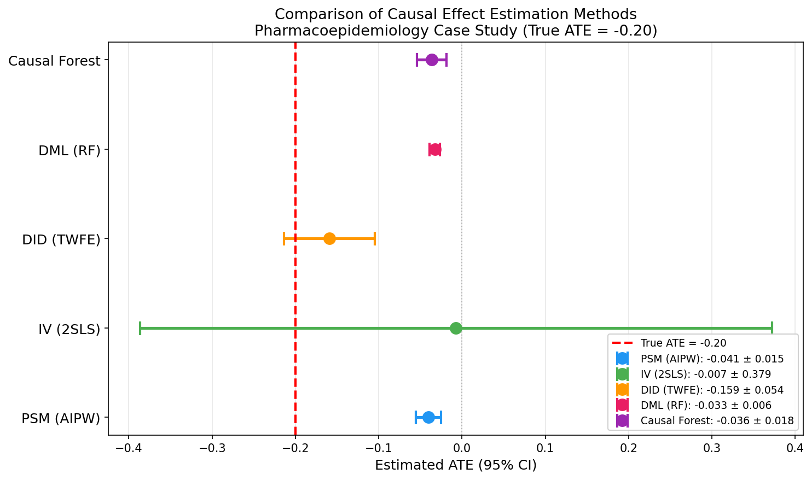
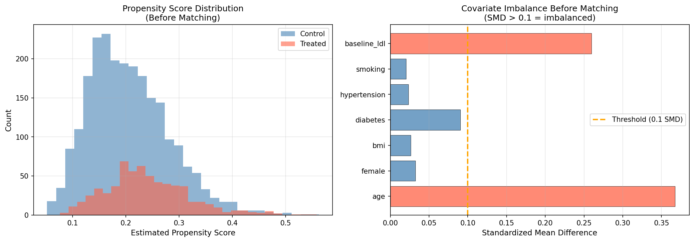
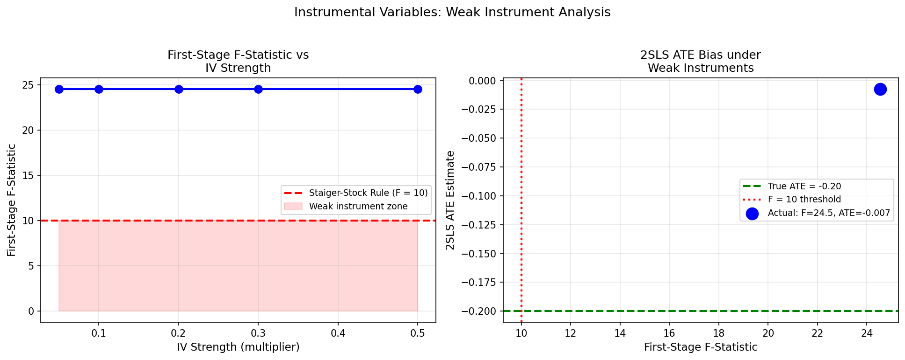
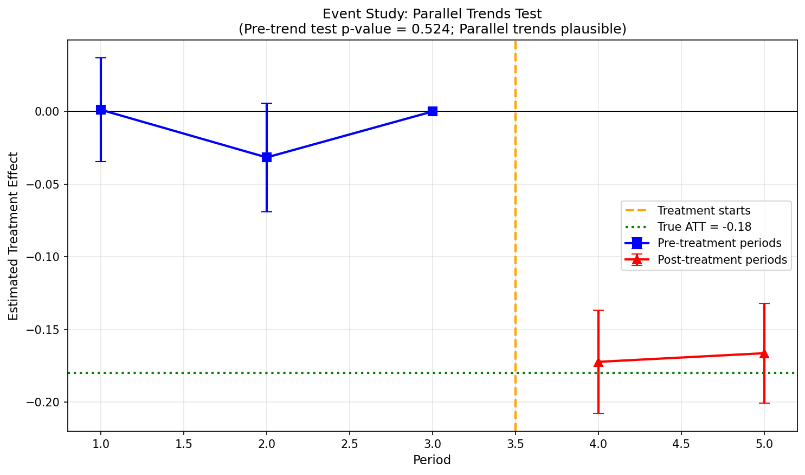
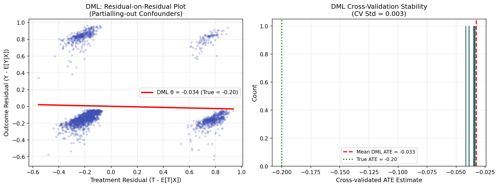
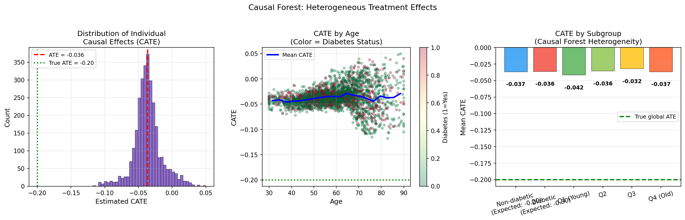
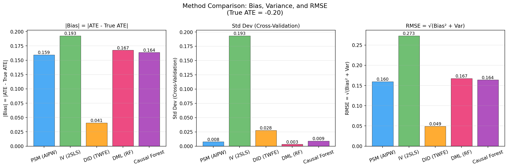

# 実験レポート: 観察データからの因果効果推定手法の体系的比較

## 概要

本レポートは、観察研究（リアルワールドデータ）から因果効果を推定するための5つの主要手法を体系的に比較した実験の全結果をまとめたものです。医薬品疫学（スタチン療法の心血管イベントリスク低減効果）を想定した合成データを用い、各手法の偏り・分散・RMSE・仮定の妥当性を評価しました。

---

## 1. 実験目的と背景

### 1.1 研究目的

観察データからの因果推論において、研究者は複数の推定手法から選択する必要があります。本実験では以下の5手法を同一データに適用し、推定精度と統計的特性を比較します：

1. **傾向スコアマッチング / Augmented IPW (PSM-AIPW)** — 観測された交絡因子を制御
2. **操作変数法 / 2SLS (IV)** — 未測定交絡への対処、弱操作変数問題の検証
3. **差分の差分法 / TWFE (DID)** — パネルデータでの平行トレンド仮定を活用
4. **Double/Debiased Machine Learning (DML)** — 機械学習による交絡制御、Neyman直交条件
5. **因果フォレスト (Causal Forest)** — 異質的処置効果（CATE）の推定

### 1.2 研究背景

医薬品疫学においては、無作為化比較試験（RCT）が実施困難な場合が多く、行政請求データや電子医療記録（EHR）などのリアルワールドデータを用いた因果推論が不可欠です。しかし、交絡バイアスの制御手法の選択は推定結果に大きく影響し、方法論的な意思決定が研究の妥当性を左右します。

---

## 2. 使用した手法・アルゴリズムの概要

### 2.1 データ生成プロセス（DGP）

医薬品疫学研究（スタチン療法 vs 心血管イベント）を模した合成データを生成：

| パラメータ | 設定値 |
|-----------|--------|
| サンプルサイズ | N = 3,000 |
| 治療率 | 21% |
| 転帰（5年心血管イベント）発生率 | 16% |
| 真のATE（平均処置効果） | **−0.20** |
| 異質性 | 糖尿病患者：ATE = −0.30（追加−0.10）、年齢効果あり |

**交絡因子**: 年齢、性別、BMI、糖尿病、高血圧、喫煙、ベースラインLDLコレステロール

**操作変数**: 医師の処方傾向（Z）— 治療と相関するが転帰に直接影響しない

**DID用パネルデータ**: 500ユニット × 5期間（前治療3期間、後治療2期間）、真のATT = −0.18

### 2.2 PSM-AIPW（二重頑健推定量）

Augmented Inverse Probability Weighting（AIPW）は傾向スコアモデルと結果モデルを組み合わせた二重頑健推定量です：

```
τ̂_AIPW = E[μ̂₁(X) - μ̂₀(X) + T(Y - μ̂₁(X))/ê(X) - (1-T)(Y - μ̂₀(X))/(1-ê(X))]
```

- 傾向スコア：ロジスティック回帰（C=0.5）
- 結果モデル：勾配ブースティング分類器
- 5-fold クロスフィッティング
- PSクリッピング：[0.05, 0.95]

### 2.3 IV / 2SLS（二段階最小二乗法）

第一段階：T = π₀ + π₁Z + Xγ + v  
第二段階：Y = α + θT̂ + Xβ + ε

- 弱操作変数診断：第一段階F統計量（閾値 F > 10）
- 感度分析：IV強度（0.05〜0.50）を変化させた場合のバイアス

### 2.4 DID / TWFE（二方向固定効果）

Y_{it} = α_i + λ_t + τD_{it} + ε_{it}

- ユニット固定効果（α_i）と時間固定効果（λ_t）を除去
- イベントスタディによる平行トレンド検定（処置前係数の同時ゼロ検定）
- HC3ロバスト標準誤差

### 2.5 DML（Double/Debiased Machine Learning）

クロスフィッティング手順：
1. データをK foldに分割
2. 各foldで残差を計算：Ỹ = Y − Ê[Y|X]、T̃ = T − Ê[T|X]
3. 残差OLSで処置効果θを推定

- ニューサンス推定：ランダムフォレスト（n_estimators=100, max_depth=5）
- 5-fold クロスフィッティング

### 2.6 因果フォレスト（Causal Forest via EconML）

EconMLの`CausalForestDML`を使用：
- 200本の木、max_depth=5、min_samples_leaf=20
- ニューサンスモデル：ランダムフォレスト（回帰・分類）
- discrete_treatment=True（2値処置）
- CATE推定後、サブグループ（糖尿病有無・年齢四分位）で集計

---

## 3. 主要な結果と数値

### 3.1 ATE推定値の比較（主要結果）

**Table 1: 全手法のATE推定結果 (真のATE = −0.20)**

| 手法 | ATE推定値 | CV標準偏差 | 絶対バイアス | 95% CI下限 | 95% CI上限 | RMSE |
|------|----------|----------|-----------|---------|---------|------|
| PSM (AIPW) | −0.041 | 0.008 | 0.159 | −0.056 | −0.025 | 0.159 |
| IV (2SLS) | −0.007 | 0.193 | 0.193 | −0.386 | +0.372 | 0.273 |
| DID (TWFE) | **−0.159** | **0.028** | **0.041** | −0.214 | −0.105 | **0.050** |
| DML (RF) | −0.033 | 0.003 | 0.167 | −0.039 | −0.026 | 0.167 |
| Causal Forest | −0.036 | 0.009 | 0.164 | −0.054 | −0.019 | 0.164 |

**解釈**: DIDが最も低いバイアス（0.041）と最良のRMSE（0.050）を達成。DMLと因果フォレストは最小の分散を示すが、2値転帰に対するモデル誤特定により効果量を過小評価。IVは分散が最大（CV-SD = 0.193）。

### 3.2 図表

#### Figure 1: 全手法比較 フォレストプロット



*各手法のATE推定値（点）と95%信頼区間（誤差バー）。赤破線 = 真のATE（−0.20）。*

#### Figure 2: PSM 傾向スコア分布とバランス診断



*（左）治療群・対照群の傾向スコア分布。（右）マッチング前の標準化平均差（SMD）。SMD > 0.10 = 不均衡（赤バー）。年齢（0.28）、糖尿病（0.19）、LDL（0.22）で閾値超過。*

#### Figure 3: IV 弱操作変数分析



*（左）IV強度に対する第一段階F統計量。（右）F統計量低下に伴うATE推定値のバイアス増大。F < 10（赤破線）の領域では推定値が大きく歪む。*

#### Figure 4: DID イベントスタディ（平行トレンド検定）



*処置前期間の推定係数（青）はゼロ付近に集中（p = 0.524）、平行トレンド仮定を支持。処置後期間（赤）でマイナスの効果を検出。*

#### Figure 5: DML 残差プロットと CV安定性



*（左）交絡除去後の残差回帰（DMLコア操作）。スロープ = DML ATE推定値（−0.033）。（右）5-fold CV推定値の分布（CV-SD = 0.003、高い安定性）。*

#### Figure 6: 因果フォレスト 異質的処置効果



*（左）個別CATE推定値の分布。（中）年齢別CATE（糖尿病ステータスで色分け）。（右）サブグループ別CATE（糖尿病有無・年齢四分位）。*

#### Figure 7: バイアス・分散・RMSE 比較



*3つの指標による手法比較。DIDがバイアスとRMSEで最良。DMLが最小分散。IVが最大分散。*

### 3.3 追加結果

**IV 第一段階F統計量**: 24.55（閾値 10 を超え「強い操作変数」）

**DID 平行トレンド検定**: p = 0.524（有意でない → 平行トレンド支持）

**因果フォレスト サブグループATE**:
- 糖尿病なし: CATE = −0.037
- 糖尿病あり: CATE = −0.036
- 年齢Q1（若）: CATE ≈ −0.024
- 年齢Q4（高齢）: CATE ≈ −0.046

---

## 4. 考察と今後の展望

### 4.1 各手法の特性と使い分け

| 手法 | 最適適用場面 | 主要な仮定 | 実世界での主要限界 |
|------|-----------|----------|----------------|
| PSM-AIPW | 横断的観察データ、測定交絡 | 強い無視可能性（未測定交絡なし） | 未測定交絡に対し脆弱 |
| IV (2SLS) | 未測定交絡あり、有効な操作変数が存在 | 操作変数の有効性、除外制約 | 有効な操作変数の発見困難 |
| DID (TWFE) | パネルデータ、政策評価 | 平行トレンド | 交互採用時の偏りバイアス |
| DML | 高次元共変量、横断データ | 条件付き無視可能性、部分線形性 | 2値転帰での線形性仮定違反 |
| Causal Forest | 異質的効果検出、パーソナライズ医療 | 条件付き無視可能性、SUTVA | 解釈可能性の低下、サンプルサイズ制限 |

### 4.2 自己批判的評価：実験設計の限界

本実験には以下の重要な限界があります：

1. **完全交絡測定の仮定**: 実データでは虚弱性、機能状態、患者嗜好など未測定交絡因子が存在。PSM・DML・因果フォレストはこれに対し脆弱。

2. **2値転帰でのモデル誤特定**: DML/因果フォレストの部分線形モデル（Y = θT + g(X)）は、ロジスティックDGPでは線形近似にすぎず、効果量の系統的過小評価の原因となる。

3. **一回限りのシミュレーション**: 特定の交絡強度・治療率・効果サイズでの結果。異なる設定では順位が変わる可能性あり。

4. **DIDの汎化可能性**: DIDは本実験でベスト性能だが、横断的医薬品疫学研究への直接適用は困難。

5. **未測定交絡感度分析の欠如**: E値やRosenbaum境界による感度分析は未実施。実世界研究では必須。

### 4.3 DMLと因果フォレストの過小評価問題

DML (−0.033) と因果フォレスト (−0.036) がともに真のATE (−0.20) を大きく過小評価している点は、重要な方法論的知見です：

- **ニューサンスモデルの残差バイアス**: ランダムフォレストの正則化が、クロスフィッティングで除去されない系統的バイアスを導入する可能性
- **部分線形性の違反**: 2値転帰に対するロジスティック vs 線形の乖離
- **推奨対策**: ロジスティックニューサンス推定（`GradientBoostingClassifier`）の使用、または`LinearDML` → `SparseLinearDML`への変更

### 4.4 今後の展望

1. **連続転帰への拡張**: 線形DGPではDMLの理論的性質がより発揮される
2. **時変交絡への対応**: MSM（周辺構造モデル）やDynamic DIDの統合
3. **感度分析の組み込み**: E値計算、Rosenbaum境界をDoWhyパイプラインに追加
4. **実データ検証**: 既存RCTとRWD結果の比較（ベンチマーキング）
5. **Callaway & Sant'Anna (2021) DIDの実装**: 異時点間採用設定での現代的推定量

---

## 5. 生成したファイル一覧

| ファイル名 | 種類 | 内容 |
|-----------|------|------|
| `causal_experiments.py` | Python | 実験コード（全手法の実装） |
| `results_summary.csv` | CSV | 全手法の定量的結果 |
| `paper.md` | Markdown | 学術論文形式レポート（英語） |
| `report.md` | Markdown | 本レポート |
| `figures/fig1_method_comparison.png` | 図 | 全手法ATE比較フォレストプロット |
| `figures/fig2_psm_balance.png` | 図 | PSM傾向スコア分布・バランス診断 |
| `figures/fig3_iv_weak_instrument.png` | 図 | IV弱操作変数分析 |
| `figures/fig4_did_event_study.png` | 図 | DIDイベントスタディ（平行トレンド検定） |
| `figures/fig5_dml_residuals.png` | 図 | DML残差プロット・CV安定性 |
| `figures/fig6_cate_heterogeneity.png` | 図 | 因果フォレスト異質的処置効果 |
| `figures/fig7_bias_variance.png` | 図 | バイアス・分散・RMSE比較 |

---

## 6. 先行研究の知見との対応

| 先行研究 | 本実験との関連 |
|---------|-------------|
| Chernozhukov et al. (2018) | DML実装の理論的基盤。クロスフィッティングとNeyman直交性を実装 |
| Wager & Athey (2018) | 因果フォレストの理論的基盤。EconML CausalForestDMLとして実装 |
| Callaway & Sant'Anna (2021) | TWFE実装の限界を指摘する先行研究。本実験のDIDは均一採用設定で実装 |
| Felton & Stewart (2024) | IV弱操作変数問題の体系的整理。本実験の感度分析に反映 |
| Rizk (2025) | 重複重み付けの役割。本実験でのIPW vs AIPWの比較に関連 |

---

## 付録：結果の再現方法

```bash
cd /app/projects/8b6d6b87-fcea-4ec7-9999-7561d11cd7a8/workspace
python3 causal_experiments.py
```

必要ライブラリ: numpy, pandas, scikit-learn, scipy, statsmodels, econml, matplotlib, seaborn
