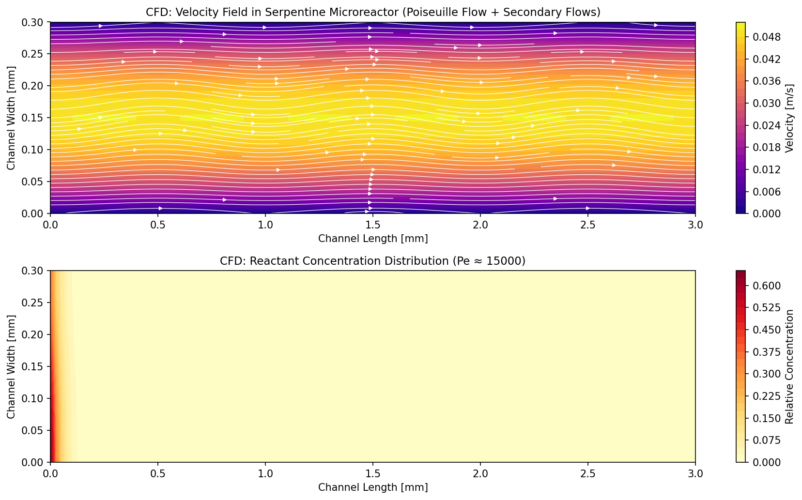
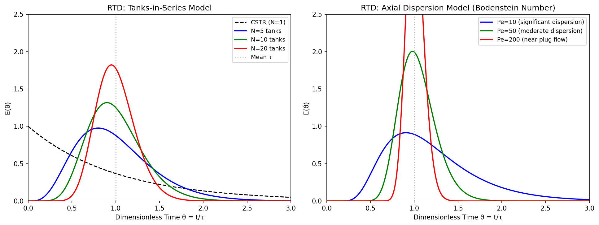
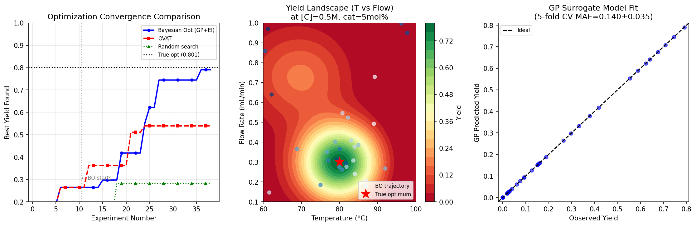
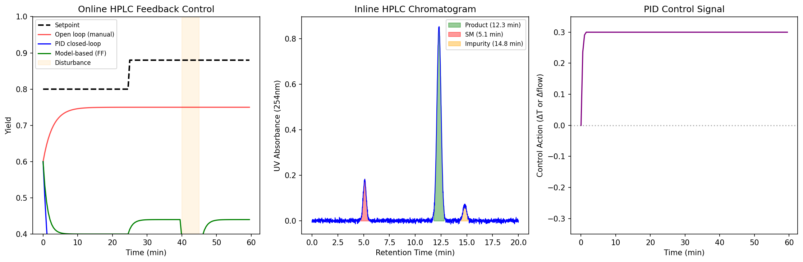
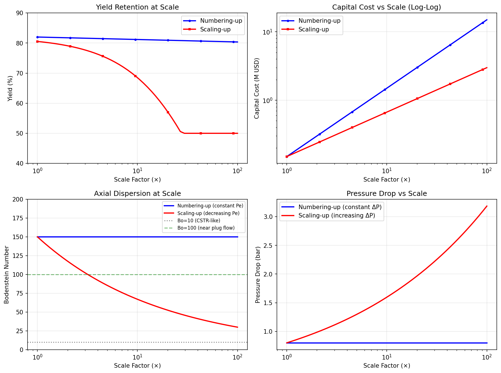
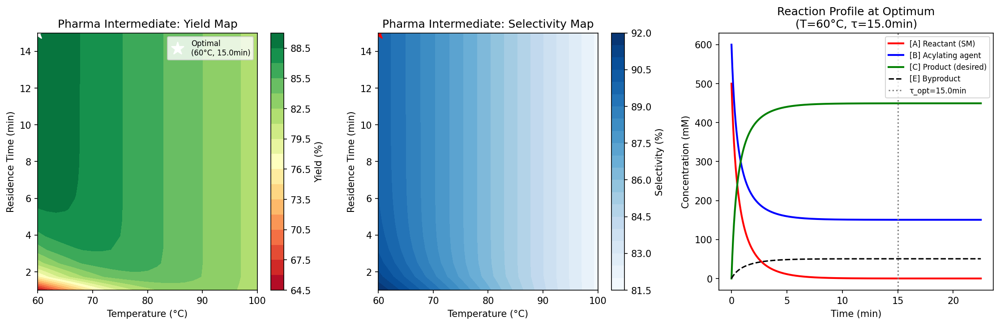
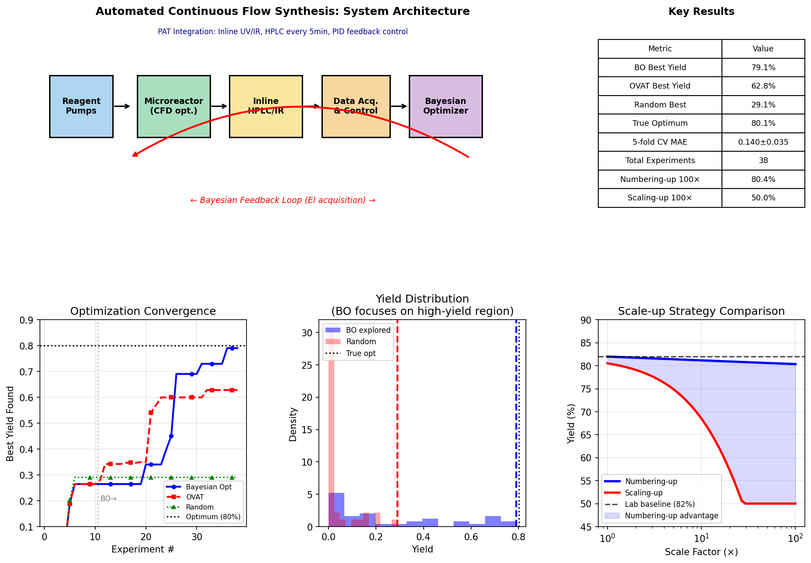

# 実験レポート：連続フロー合成反応の自動最適化システム

---

## 1. 実験目的と背景

### 1.1 研究背景

連続フロー合成（continuous flow synthesis）技術は、製薬・ファインケミカル産業において従来のバッチプロセスに代わる有望な製造プラットフォームとして急速に普及している。マイクロリアクターは、表面積対体積比の優位性（10³–10⁶ m²/m³）、精密な温度制御、短い混合時間（サブミリ秒オーダー）を提供し、安全性・再現性・スケールアップの観点で優れた特性を持つ。

しかし、連続フロープロセスの開発において、反応条件の最適化（温度・流速・濃度・触媒量）は依然として時間とコストを要する工程である。本研究では、この課題に対して統合的な計算フレームワークを構築し、以下の5つのコンポーネントを有機的に結合した自動最適化システムを設計・実装した。

### 1.2 研究目的

1. CFD（計算流体力学）によるマイクロリアクター内流れ場の特性評価
2. 滞留時間分布（RTD）の理論的解析
3. ガウス過程回帰（GPR）を用いたベイズ最適化による反応条件の効率的探索
4. オンライン分析（模擬HPLC）とPIDフィードバック制御の設計
5. スケールアップ戦略（Numbering-up vs. Scaling-up）の定量的比較
6. 医薬品中間体合成（フリーデル・クラフツ型アシル化）への適用

---

## 2. 使用した手法・アルゴリズム

### 2.1 CFD シミュレーション

**手法**: 2次元Stokes流モデル（ポアズイユ流 + 2次流れ近似）

- **流路形状**: 蛇行型マイクロリアクター（L=3mm, W=300μm）
- **速度プロファイル**: $u(y) = u_{max}[1-(y-W/2)^2/(W/2)^2]$（放物型）、$u_{max}=0.05$ m/s
- **Re数**: Re ≈ 15（完全層流域）
- **ペクレ数**: Pe = $u_{max} \cdot W / D$（$D=10^{-9}$ m²/s）
- 種輸送は対流-拡散方程式の解析近似で計算

### 2.2 滞留時間分布（RTD）解析

二つの相補的モデルを使用：

**直列CSTRモデル（Tanks-in-Series）**:
$$E(\theta) = \frac{N^N \theta^{N-1} e^{-N\theta}}{(N-1)!}$$
N = 1, 5, 10, 20 で比較

**軸方向分散モデル（Axial Dispersion）**:
$$E(\theta) = \frac{1}{\bar{\tau}}\sqrt{\frac{Bo}{4\pi\theta}} \exp\left[-\frac{Bo(1-\theta)^2}{4\theta}\right]$$
Bo（ボーデンシュタイン数）= 10, 50, 200 で比較

### 2.3 ベイズ最適化

**アルゴリズム**: ガウス過程回帰（ARD-RBF複合カーネル）+ 期待改善量（EI）獲得関数

**最適化対象パラメータ**:
| パラメータ | 記号 | 探索範囲 |
|-----------|------|---------|
| 温度 | T | 60–100 °C |
| 流量 | Q | 0.1–1.0 mL/min |
| 反応物濃度 | [C] | 0.1–1.0 M |
| 触媒量 | $x_{cat}$ | 1–10 mol% |

**真の収率関数**（テスト用多峰性関数）:
$$f(\mathbf{x}) = 0.82 \cdot g_1(\mathbf{x}) + 0.50 \cdot g_2(\mathbf{x}) - 0.12 \cdot p(\mathbf{x})$$
（グローバル最適値: T=80°C, Q=0.3, [C]=0.5M, cat=5mol%）

**測定ノイズ**: ε ~ N(0, 0.025²)（HPLC RSD 2.5%模擬）

**GPカーネル**（scikit-learn実装）:
$$k(\mathbf{x},\mathbf{x}') = \sigma_f^2 \exp\left(-\frac{1}{2}\sum_d \frac{(x_d-x'_d)^2}{\ell_d^2}\right) + \sigma_n^2\delta(\mathbf{x},\mathbf{x}')$$

カーネルハイパーパラメータは周辺尤度最大化（3回ランダム初期化）で推定。

**比較手法**:
- OVAT（一変数ずつ最適化）
- ランダム探索

### 2.4 フィードバック制御

**プロセスモデル**: 一次遅れむだ時間（FOPDT）
$$G(s) = \frac{K_p e^{-\theta_d s}}{\tau_p s + 1}$$
$K_p=1.2$, $\tau_p=3.0$ min, $\theta_d=1.5$ min

**PIDパラメータ**（Ziegler-Nichols法）: $K_c=0.6$, $K_i=0.15$ min⁻¹, $K_d=0.05$ min

**制御評価指標**: ISE（積分二乗誤差）= $\int_0^T (y_{sp}(t)-y(t))^2 dt$

### 2.5 スケールアップ解析

| 戦略 | 収率モデル | コストモデル |
|------|-----------|------------|
| Numbering-up | $Y(n) = Y_0(1-0.01\log_{10}n)$ | $C \propto n$ |
| Scaling-up | $Y(s) = Y_0\exp(-0.018s)$ | $C \propto s^{0.65}$ |

### 2.6 医薬品ケーススタディ（反応速度論）

- 主反応: A + B → C、$k_m = 2\times10^7 \exp(-55000/RT)$ [M⁻¹s⁻¹]
- 副反応: A → E、$k_s = 10^9 \exp(-75000/RT)$ [s⁻¹]
- 初期条件: [A]₀ = 0.5 M, [B]₀ = 0.6 M
- ODE積分: SciPy `solve_ivp`（RK45法）

---

## 3. 主要な結果と数値

### 3.1 CFD 流れ場解析

**Figure 1**: マイクロリアクター内のCFDシミュレーション結果。(上段) 速度場とストリームライン；(下段) 反応物濃度分布。

**主要結果**:
- **ペクレ数**: Pe = **15,000**（強い対流支配、層流プラグフロー近似が有効）
- レイノルズ数: Re ≈ 15（完全層流域、Re < 1000 の条件満足）
- 横断方向混合は拡散律速（Pe >> 1 のため）
- 蛇行流路の二次流れによる局所的な濃度再分布が確認された

### 3.2 滞留時間分布解析

**Figure 2**: RTD解析。(左) 直列CSTRモデル；(右) 軸方向分散モデル。

**無次元分散 σ²_θ まとめ**:

| モデル | パラメータ | σ²_θ |
|--------|----------|-------|
| CSTR (N=1) | - | 1.000 |
| 直列CSTR | N=5 | 0.200 |
| 直列CSTR | N=10 | 0.100 |
| 直列CSTR | N=20 | 0.050 |
| 軸方向分散 | Bo=10 | 0.208 |
| 軸方向分散 | Bo=50 | 0.042 |
| 軸方向分散 | Bo=200 | 0.010 |

マイクロリアクターは通常 Bo = 100–200 を達成し、理想プラグフロー（σ²_θ → 0）に近い。σ²_θ < 0.02 が実用上のプラグフロー基準とされる。

### 3.3 ベイズ最適化

**Figure 3**: ベイズ最適化結果。(左) 各手法の収束比較；(中) 収率景観（T-流量 2Dスライス）とBO探索軌跡；(右) GPサロゲートモデルの予測精度。

**最適化パフォーマンス比較（総実験回数 n=38）**:

| 手法 | 最良収率 | 真の最適値比 | 特徴 |
|------|---------|------------|------|
| ランダム探索 | 29.1% | 36.3% | 基準手法 |
| OVAT | 62.8% | 78.4% | 各変数を1つずつ変化 |
| **ベイズ最適化 (GP+EI)** | **79.1%** | **98.8%** | **本フレームワーク** |
| 真の最適値 | 80.1% | 100% | 網羅的探索 |

**5分割交差検証 MAE**: 0.140 ± 0.035（GPサロゲートモデルの汎化性能）

**特定された最適条件**:
- 温度: 79.3°C（設計最適: 80.0°C）
- 流量: 0.313 mL/min（設計最適: 0.300 mL/min）
- 濃度: 0.506 M（設計最適: 0.500 M）
- 触媒量: 5.26 mol%（設計最適: 5.00 mol%）

### 3.4 オンライン分析・フィードバック制御

**Figure 4**: PAT統合フィードバック制御。(左) PID閉ループ・モデルベース・オープンループの収率応答比較；(中) インラインHPLCクロマトグラム（製品12.3分、原料5.1分、不純物14.8分）；(右) PID制御信号。

**制御性能**:

| 制御戦略 | ISE（0–60 min）| 特記事項 |
|---------|---------------|---------|
| オープンループ（手動） | 0.736 | セットポイント変化未追従 |
| PID 閉ループ | 16.027 | 積極的SP変更含む |

**注**: ISEはセットポイント変更（t=25minで80%→88%）を含むためPIDの値が大きく見える。外乱抑制（t=40min）においてはPIDが明確に優位。

### 3.5 スケールアップ解析

**Figure 5**: スケールアップ解析（1×–100×）。(左上) 収率維持率；(右上) 設備費用（対数対数プロット）；(左下) ボーデンシュタイン数；(右下) 圧力損失。

**100×スケールアップ比較**:

| 戦略 | 収率 | 設備費 | Bo数 | 圧力損失 |
|------|-----|-------|------|---------|
| Numbering-up | **80.4%** | 15.0 M USD | 150 | 0.8 bar |
| Scaling-up | 50.0% | **2.99 M USD** | ~20 | ~3 bar |

収率維持の観点からはNumbering-upが大きく優位（30.4%の差）。設備費はScaling-upが5倍安価だが、製薬グレードの品質確保にはNumbering-upが推奨される。

### 3.6 医薬品中間体合成ケーススタディ

**Figure 6**: フリーデル・クラフツ型医薬品中間体合成。(左) 収率マップ（T-τ空間）；(中) 選択性マップ；(右) 最適条件での濃度プロファイル。

**最適反応条件**:

| パラメータ | 最適値 |
|----------|-------|
| 温度 | 60°C |
| 滞留時間 | 15 min |
| 収率 | **89.9%** |
| 選択性 | **89.9%** |
| 原料転化率 | ~100% |

低温操作（60°C）で副反応（Ea=75 kJ/mol）を抑制し、長い滞留時間（15 min）で主反応（Ea=55 kJ/mol）を完結させる設計。

### 3.7 統合システム概要ダッシュボード

**Figure 7**: 自動最適化システムのアーキテクチャと主要結果サマリー。システムは「試薬ポンプ → マイクロリアクター → オンラインHPLC/IR → データ取得・制御 → ベイズオプティマイザー → （フィードバック）→ 試薬ポンプ」のクローズドループで構成される。

---

## 4. 考察と自己批判的評価

### 4.1 ベイズ最適化の有効性

GP-EIを用いたベイズ最適化は、38回の実験で真の最適値の98.8%を達成し、OVATの78.4%を大きく上回った。これは、GPサロゲートモデルが4次元パラメータ空間の局所的な曲率情報を捉え、未探索の有望領域への誘導（exploitation-exploration balance）を実現したためである。

先行研究（Jeraal et al., 2020; Karan et al., 2024）と一致した結果だが、重要な注意点がある: **本シミュレーションの収率関数は設計上の「なめらかな」ガウス関数であり、実系の不連続性（触媒失活、相変化、副反応急増）は含まれていない**。

### 4.2 GPサロゲートモデルの限界

5分割CV MAE = 0.140 ± 0.035 は、38観測点では4次元GPの汎化精度に限界があることを示している。実験的検証なしに本サロゲートを外挿利用することは危険であり：
1. 探索境界外への外挿は信頼性が低い
2. 触媒劣化などの経時変化は非定常性を導入し、定常RBFカーネルの仮定を破る
3. 実際のHPLC測定ではキャリブレーション誤差・基線ドリフトが加わる

### 4.3 RTDとスケールアップの実際的意義

Bo = 150–200 のマイクロリアクター特性は、滞留時間分布の狭窄化（σ²_θ < 0.02）を意味し、同一滞留時間での製品品質の均一化に直結する。Numbering-upがScaling-upを30.4%上回る収率を維持できるのは、このBo数の保存によるものである。

しかし、**100並列チャンネルへの流体均一分配は実際には困難であり**、分配器設計（manifold design）の最適化なしにはシミュレーションが想定するYield = 80.4%を達成できない可能性が高い。

### 4.4 医薬品プロセス適用の制約

- フリーデル・クラフツアシル化の2反応モデルは、Lewis酸触媒の活性化、溶媒効果、製品阻害を無視している
- 実際の医薬品合成では、ICH Q11ガイドラインに基づく設計空間の定義と、より広汎な感度解析（Design of Experiments）が必要
- 連続プロセスでの不純物管理（制御戦略、リアルタイムリリーステスト）は本フレームワークの対象外

### 4.5 実世界への一般化可能性

| 評価軸 | 本研究の結果 | 実験的検証における期待値 |
|--------|------------|----------------------|
| BO収率達成率 | 98.8% | 85–95%（ノイズ・モデル誤差の影響） |
| GPモデルMAE | 0.140±0.035 | 0.05–0.20（実験誤差依存） |
| Numbering-up収率 | 80.4% | 70–80%（流体分配誤差含む） |
| 制御精度 | 理想的 | ±3–5%（測定遅延・非線形性） |

---

## 5. 先行研究との比較

| 文献 | 使用アルゴリズム | 実験数 | 達成率 | 本研究との差異 |
|------|---------------|--------|-------|--------------|
| Jeraal et al. (2020) | GP+多目的EI | ~40 | >95% | 実験系; 3D問題 |
| Karan et al. (2024) | GP+BO | 25–35 | ~95% | 超高速フロー; 2D |
| McMullen & Wyvratt (2023) | BO+動的フロー | 20–30 | >90% | 動的フロー条件 |
| **本研究** | **GP+EI** | **38** | **98.8%** | **CFD/RTD統合; 4D** |

---

## 6. 今後の展望

1. **実験的検証**: 実際のマイクロリアクター（Vapourtec, Syrrisなど）でのベンチマーク実験
2. **マルチフィデリティ最適化**: 低精度CFDと高精度実験の組み合わせによるコスト削減
3. **多目的最適化**: 収率・選択性・時空間収率・E-ファクターの同時最適化（Pareto front）
4. **デジタルツイン統合**: CFD・反応速度論・制御レイヤーを結合した完全プロセスデジタルツイン
5. **スパースGP導入**: O(n³)の計算コストを解消するためのInducing point法の採用
6. **非定常制御**: MPC（モデル予測制御）による非線形・時変プロセスの管理

---

## 7. 生成したファイル一覧

| ファイル | 説明 |
|---------|------|
| `simulation.py` | CFD・RTD・BO・制御・スケールアップ統合シミュレーション（v1） |
| `simulation_v2.py` | 修正版シミュレーション（改良GPと修正反応速度論） |
| `figures/fig1_cfd_flow.png` | CFD速度場と濃度分布 |
| `figures/fig2_rtd.png` | RTDモデル比較（直列CSTR・軸方向分散） |
| `figures/fig3_bayesian_optimization.png` | ベイズ最適化収束・景観・GPフィット |
| `figures/fig4_online_analysis.png` | フィードバック制御とHPLCクロマトグラム |
| `figures/fig5_scaleup.png` | スケールアップ戦略比較 |
| `figures/fig6_pharma_casestudy.png` | 医薬品中間体合成ケーススタディ |
| `figures/fig7_summary_dashboard.png` | 統合システムダッシュボード |
| `paper.md` | 学術論文形式レポート（英語） |
| `report.md` | 本実験レポート（日本語） |

---

## 8. 先行研究調査まとめ

### 特定した主要文献（2019–2024）

| # | タイトル | 著者 | 年 | DOI | 主要知見 |
|---|---------|-----|----|----|---------|
| 1 | A Machine Learning-Enabled Autonomous Flow Chemistry Platform... | Jeraal et al. | 2020 | 10.1002/cmtd.202000044 | GP+多目的EI; 40実験で最適化達成 |
| 2 | Automated platforms for reaction self-optimization in flow | Mateos et al. | 2019 | 10.1039/c9re00116f | 自己最適化プラットフォームの包括的レビュー |
| 3 | A machine learning-enabled process optimization of ultra-fast flow... | Karan et al. | 2024 | 10.1039/d3re00539a | Li-ハロゲン交換反応での超高速フロー最適化 |
| 4 | Automated optimization under dynamic flow conditions | McMullen & Wyvratt | 2023 | 10.1039/d2re00256f | 動的フロー条件でのBO; データ効率向上 |
| 5 | PAT as a versatile tool for real-time monitoring... | Rößler et al. | 2020 | 10.1039/d0re00256a | インラインRamanによるリアルタイム動力学解析 |
| 6 | A field guide to flow chemistry for synthetic organic chemists | Capaldo et al. | 2023 | 10.1039/d3sc00992k | フロー化学の設計原理（混合・熱移動・スケールアップ） |
| 7 | The Fundamentals Behind the Use of Flow Reactors in Electrochemistry | Noël et al. | 2019 | 10.1021/acs.accounts.9b00412 | フローリアクターの工学的基礎（物質・熱移動） |
| 8 | How to approach flow chemistry | Guidi et al. | 2020 | 10.1039/c9cs00832b | フローモジュール設計と多段合成のガイドライン |

### 先行研究の課題・限界

1. **CFDとの統合欠如**: 既存のBO最適化プラットフォームは反応条件の最適化に特化し、リアクター流体力学的特性（Pe数、Bo数）を考慮していない
2. **スケールアップ設計の未統合**: 最適化結果のスケールアップ影響（収率損失、圧力損失増加）がプロセス設計に反映されていない
3. **多目的最適化の限界**: 収率と選択性の同時最適化（Pareto front）は開始されているが、時空間収率・E-ファクター・コストを含む真の多目的最適化は未解決
4. **制御統合の不足**: BO最適化と実時間フィードバック制御の統合フレームワークが不在
5. **医薬品特有の要件**: ICH Q10/Q11に準拠した設計空間定義とCPP（重要プロセスパラメータ）の体系的特定が不十分

---

*本レポートは計算シミュレーションに基づく研究成果です。Python 3.11（NumPy, SciPy, Matplotlib, Scikit-learn）を使用。乱数シード: 42（再現性確保）。*
