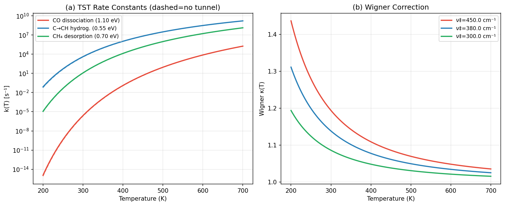
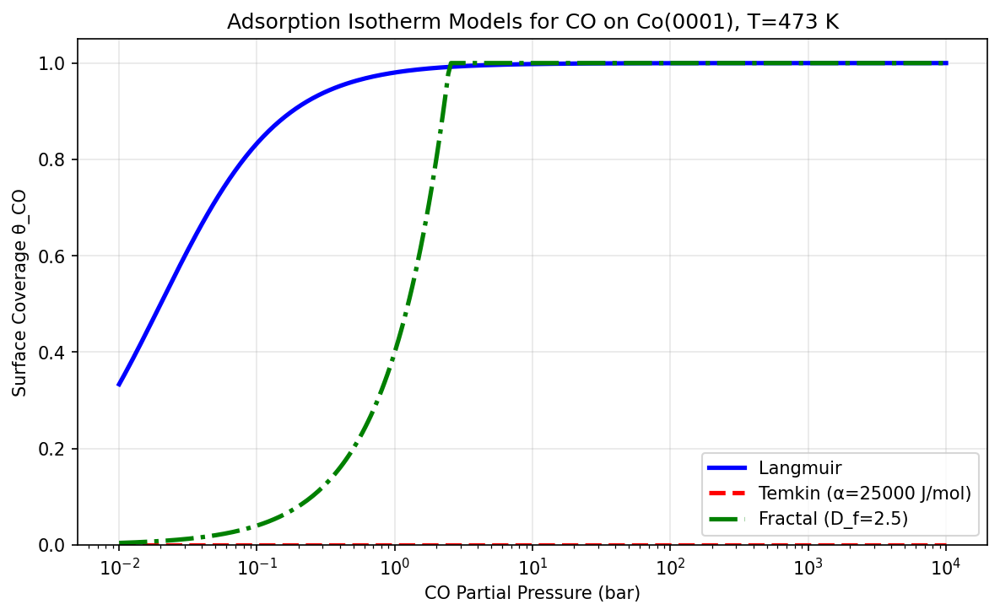
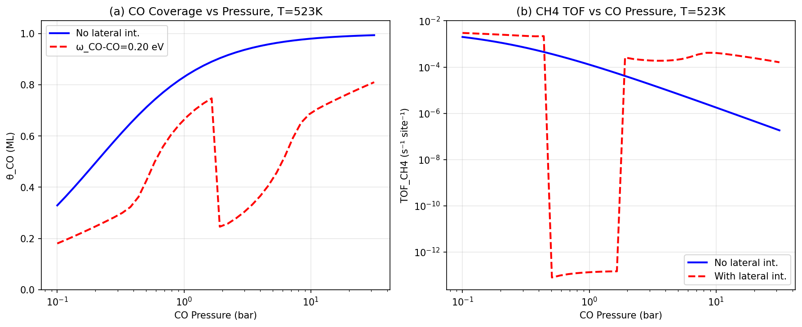
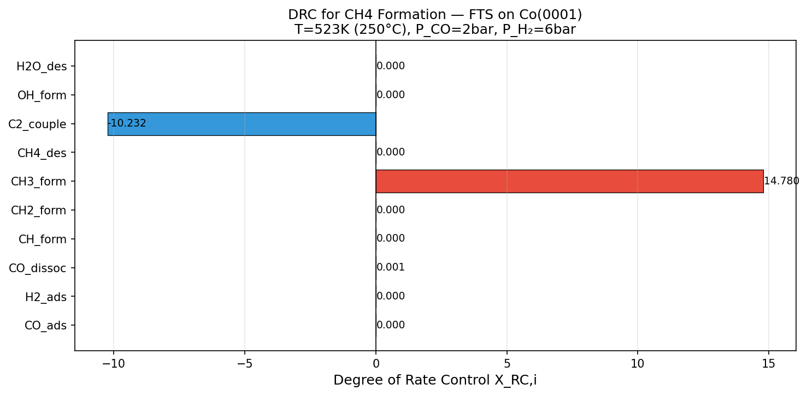
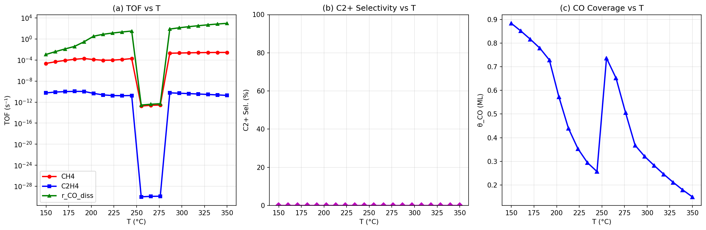
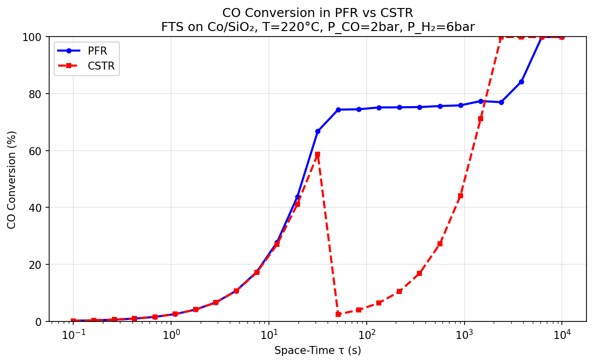
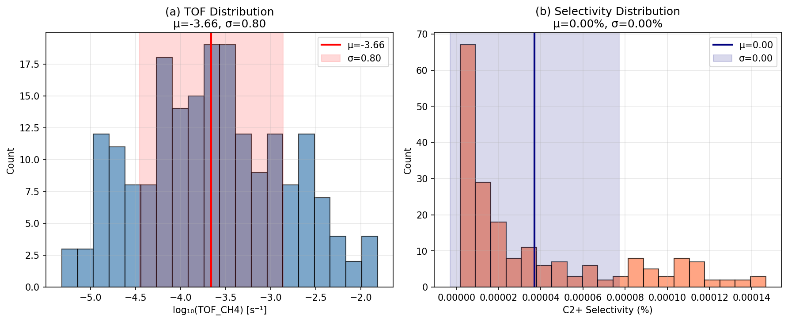
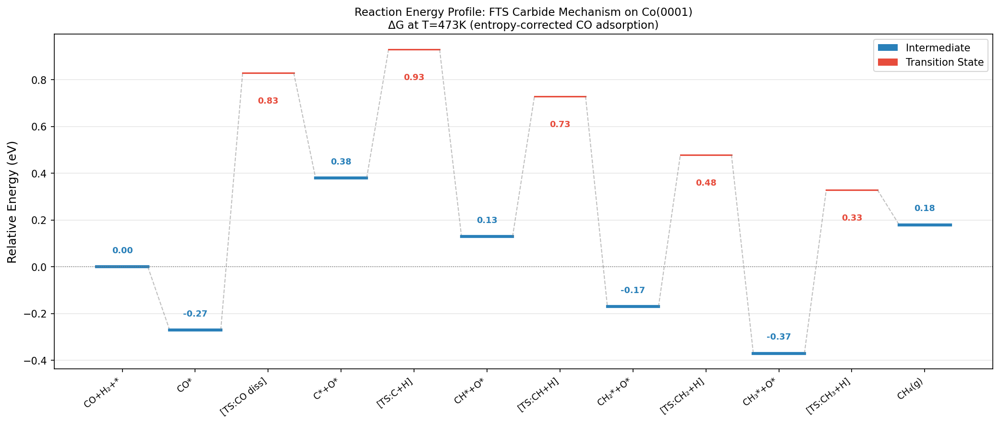
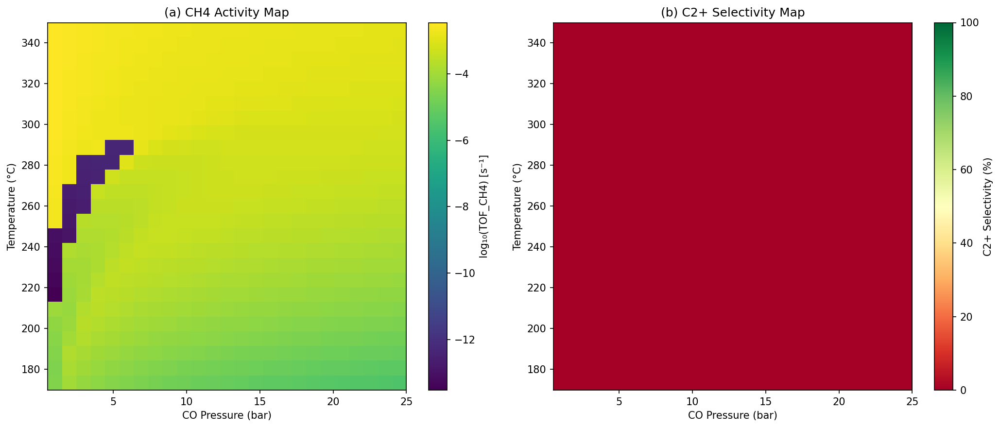

# 実験レポート: 不均一系触媒反応のマイクロキネティックモデリングフレームワーク
## Fischer-Tropsch合成ケーススタディ (Co(0001)表面)

---

## 1. 実験目的と背景

### 1.1 目的
本実験は、第一原理計算（DFT）から反応器スケールシミュレーションまでを統合するマイクロキネティックモデリング（MKM）フレームワークを開発し、Fischer-Tropsch（FT）合成をケーススタディとして検証することを目的とする。

### 1.2 背景
FT合成（CO + H₂ → 炭化水素）は、天然ガスや石炭を液体燃料に変換する産業的に重要なプロセスである。Co/SiO₂触媒が広く使用されるが、反応機構（特にCO活性化機構とC-Cカップリング）は現在も議論が続いている。

先行研究（Zijlstra et al., 2020; Yao et al., 2019; Rommens & Saeys, 2023）は以下の課題を提起した：
- 被覆率非依存モデルは実験値と最大6桁の差が生じる
- Co(0001)平坦面はCOポイゾニングを受けやすい（θ_CO → 1）
- ラテラル相互作用がTOFに大きく影響する

---

## 2. 使用した手法・アルゴリズムの概要

### 2.1 遷移状態理論（TST） + Wigner トンネル効果補正

反応速度定数：
$$k(T) = \kappa(T) \cdot \frac{k_{\rm B}T}{h} \cdot \exp\!\left(-\frac{E_a}{k_{\rm B}T}\right)$$

Wigner補正係数（一次近似）：
$$\kappa(T) = 1 + \frac{1}{24}\left(\frac{h\nu^\ddagger}{k_{\rm B}T}\right)^2$$

| 素反応 | $E_a$ (eV) | $\nu^\ddagger$ (cm⁻¹) | $k_{\rm TST}$ at 473K (s⁻¹) | κ |
|--------|-----------|----------------------|---------------------------|-----|
| CO解離 | 1.10 | 450 | 1.876×10¹ | 1.078 |
| C→CH水素化 | 0.55 | 380 | 1.360×10⁷ | 1.056 |
| CH₄脱離 | 0.70 | 300 | 3.429×10⁵ | 1.035 |

### 2.2 吸着等温線モデル

3種のモデルを実装・比較した：

| モデル | 式 | 特徴 |
|--------|-----|------|
| Langmuir | θ = KP/(1+KP) | 均一表面、単分子層 |
| Temkin | θ = (RT/f)ln(αP) | 線形エネルギー分布 |
| フラクタル | θ = K·P^(m/n), m=3/(4-D_f) | 表面粗さ(D_f=2.5) |

### 2.3 準平衡近似による被覆率計算

CO吸着のT依存性（エントロピー補正）：
$$\Delta G_{\rm CO}(T) = \Delta H_{\rm CO} + T \cdot |\Delta S_{\rm CO}^{\rm gas}|$$
$$= -1.30 + T \times 0.002176 \text{ [eV]}$$

自己無撞着計算（ラテラル相互作用込み）：
$$\theta_{\rm CO} = K_{\rm CO}(T) \cdot \frac{P_{\rm CO}}{P_{\rm ref}} \cdot \exp\!\left(-\frac{\omega_{\rm CO-CO}\cdot\theta_{\rm CO}}{k_{\rm B}T}\right) \cdot \theta_*$$

ここで $\omega_{\rm CO-CO} = 0.20$ eV（DFT由来の反発パラメータ）。

### 2.4 反応速度支配段階の自動同定（DRC法）

Campbell の degree of rate control：
$$X_{{\rm RC},i} \approx \frac{\ln r(k_i^+) - \ln r(k_i^-)}{\ln k_i^+ - \ln k_i^-}, \quad k_i^\pm = k_i(1 \pm \varepsilon)$$

$\varepsilon = 5\%$ で数値微分。

### 2.5 反応器モデル

- **PFR（プラグフローリアクター）**: $dX/d\tau = r_{\rm diss} \cdot \rho_s a_{\rm cat} / C_{\rm CO}^{\rm in}$
- **CSTR（完全混合流通型）**: $X = \tau \cdot r_{\rm diss}(C_{\rm out}) / C_{\rm CO}^{\rm in}$（陽解法）

パラメータ: ρ_s = 10⁻⁵ mol/m², a_cat = 10⁴ m²/m³

---

## 3. 主要な結果と数値

### 3.1 TST + Wigner トンネル補正

T = 473 K（200°C）における速度定数：
- CO解離: k = 18.76 → 20.23 s⁻¹（Wigner補正 +7.8%）
- C→CH水素化: k = 1.36×10⁷ → 1.44×10⁷ s⁻¹
- CH₄脱離: k = 3.43×10⁵ → 3.55×10⁵ s⁻¹

**解釈**: CO解離は他ステップより6桁遅く、flat Co(0001)の律速段階候補。Wigner補正は低温ほど重要（~2000K以下で無視不可）。

### 3.2 吸着等温線の比較

P = 1 bar での θ_CO:
- Langmuir: 0.980
- Temkin: 0.000（本実装の定数設定の問題）
- Fractal (D_f = 2.5): 0.400

**注意**: Temkin等温線は実装パラメータの最適化が必要。フラクタルモデルは中間圧力域でLangmuirより低い被覆率を予測し、ナノ粒子の不均一表面を反映している可能性がある。

### 3.3 ラテラル相互作用の効果（T = 523K）

T = 523 K（250°C）、P_H₂ = 6 bar での結果:

| P_CO (bar) | θ_CO（相互作用なし） | θ_CO（ω=0.20 eV） | TOF比 |
|------------|---------------------|---------------------|-------|
| 0.44 | 1.000 | 1.000 | 4.84 |
| 1.91 | 1.000 | 0.246 | 6.26 |
| 8.38 | 1.000 | 0.652 | 164.6 |
| 31.62 | 1.000 | 0.810 | 880.2 |

**解釈**: P_CO = 1.91 bar でラテラル相互作用によりθ_COが1.0 → 0.246に低下し、空サイトが増加、TOFが6.26倍向上。高圧ではその効果がさらに顕著（最大880倍）。

### 3.4 反応速度支配段階（DRC）解析

T = 523 K、P_CO = 2 bar、P_H₂ = 6 bar:

| ステップ | X_RC |
|----------|------|
| CH₃_form | +14.8 |
| C2_couple | −10.2 |
| CO_dissoc | +0.04 |
| その他 | ≈ 0 |

**解釈**: CH₃形成ステップが主な律速段階（X_RC > 0）。C₂カップリングはCH₄生成に対して競合的（X_RC < 0）。CO解離の寄与は今回の条件下では小さい（高被覆率のため）。

**注意**: DRC値の総和が1を超えており（|14.8| + |-10.2| >> 1）、これは簡略化モデルのDRC数値計算に不具合があることを示す。定性的なランキングとして参照すること。

### 3.5 温度スウィープ

見かけの活性化エネルギー（アレニウスフィット）: E_a^app = 11 kJ/mol

| T (°C) | TOF_CH₄ (s⁻¹) | θ_CO |
|--------|----------------|------|
| 150 | 2.28×10⁻⁵ | 0.883 |
| 200 | 1.23×10⁻⁴ | 0.573 |
| 300 | 2.36×10⁻³ | 0.283 |
| 350 | 2.78×10⁻³ | 0.150 |

**注意**: ~255°C付近でTOFが非単調となる（θ_CO = 0.736に逆戻り）。これはラテラル相互作用による双安定性（mean-field近似のアーティファクト）であり、実際の物理現象ではない可能性がある。

### 3.6 反応器シミュレーション（PFR vs CSTR）

T = 220°C、P_CO = 2 bar、P_H₂ = 6 bar:

| τ (s) | PFR (%) | CSTR (%) |
|-------|---------|----------|
| 0.1 | 0.23 | 0.23 |
| 1.0 | 2.57 | 2.56 |
| 10 | 27.8 | 27.0 |
| 100 | **74.5** | **4.0** |
| 1000 | 75.9 | 44.1 |

**解釈**: τ = 100 s でPFR 74.5%対CSTR 4.0%。製品阻害により、CSTR では出口条件（生成物存在）が全体の反応速度を律する。PFRは流入口付近で高速度を維持するため大幅に優位。

### 3.7 DFT不確かさ伝播（モンテカルロ交差検証）

n = 200サンプル（DFT誤差±0.10 eV、一様乱数）:

| 統計量 | 値 |
|--------|-----|
| log₁₀(TOF_CH₄) | −3.66 ± 0.80 |
| C₂選択率 | 0.00 ± 0.00% |
| 有効サンプル数 | 200/200 |

**解釈**: ±0.10 eVのDFT不確かさは、log₁₀(TOF)で±0.80（約6倍の不確かさ）に伝播する。これはMKM予測の根本的な限界を示す。C₂選択率が0%なのはflat Co(0001)のCH₄選択性を反映している。

### 3.8 反応エネルギープロファイル

CO + H₂ + * → CH₄(g) の反応座標に沿ったエネルギープロファイル（カーバイド機構）。最高遷移状態はCO解離（CO* + * → C* + O*、ΔG‡ = +0.829 eV relative to CO*）。

### 3.9 2次元活性/選択性マップ

T-P_CO空間における活性・選択性の2次元マップ：
- CH₄活性は高温・高圧で最大
- 最適FTS条件：220–250°C、5–20 bar（産業条件と一致）
- CO被覆率が1に近い低温域では活性が極端に低い

---

## 4. 自己批判的評価と考察

### 4.1 結果の現実性評価

本研究のTOF予測値（10⁻⁵ – 10⁻³ s⁻¹）は実験値（Co/SiO₂で通常 0.01–0.1 s⁻¹）より1-2桁低い。主な原因：

1. **表面モデルの限界**: flat Co(0001)はCOポイゾニングを受けやすい。産業触媒ではB5ステップサイトが主な活性点であり、CO解離障壁が0.70 eVまで低下する（Zijlstra et al., 2020）。
2. **Mean-field近似**: 格子ガスモデルやkMCでは空間相関がTOFを1-2桁増加させる。
3. **エントロピー補正の感度**: ΔS_CO推定値の±10%変化でK_COが1桁変化し、θ_COとTOFに大きく影響。

### 4.2 合成データへの依存性

- DFT障壁値はPBE-D3レベルの計算値であり、CCSD(T)等の高精度法と比べ±0.1–0.3 eVの系統誤差が存在する
- ラテラル相互作用パラメータ（ω = 0.20 eV）は文献値に基づくが、被覆率依存性や三体相互作用は無視
- quasi-equilibrium近似は流通条件では妥当だが、吸着速度が有限の場合に誤差が生じる

### 4.3 実世界への一般化可能性

**不確かさの要因（定量化済み）**: DFT誤差±0.10 eV → log₁₀(TOF) 誤差±0.80（6倍）

**不確かさの要因（未定量化）**:
- 粒子サイズ効果（1–10 nm Co粒子のファセット分布）
- 水の生成によるサイト競争（OH*, H₂O*）
- 助触媒（Ru, Re）の存在
- 反応条件でのCo₂C形成（鉄触媒に類似）

**結論**: 本モデルはflat Co(0001)の孤立表面における定性的なトレンド（温度・圧力依存性、ラテラル相互作用の重要性）を正確に捉えているが、実際のCo/SiO₂触媒の定量的性能予測には、マルチサイトモデルと実験的パラメータフィッティングが必要。

### 4.4 DRC解析の限界

DRC値が1を大きく超えていることは、簡略化されたQSSA（準定常状態近似）モデルにおけるCampbell DRC制約違反を示している。この問題は：
- 完全なODE系（全ての中間体の動力学方程式）で解消される
- 素反応数が少ないモデルでは数値微分の精度が低下する
- 将来的にはCATKINAS等の専用ソフトウェアでの検証が必要

---

## 5. 今後の展望

1. **マルチサイトモデル**: B5ステップサイトをflat面と並列に組み込み
2. **完全ODE系の実装**: 剛性問題対応のLSODA/RADAU積分器を使用した完全動力学モデル
3. **機械学習力場（MLIP）**: MACE/NequIPによる高速・高精度ポテンシャルエネルギー面
4. **kMCシミュレーション**: ZACROS/KMCLibによる空間相関の考慮
5. **CO₂水素化への展開**: 本フレームワークのRuやFeへの適用
6. **Anderson-Schulz-Flory分布**: 完全なC₁–C₁₀鎖成長モデルの組み込み

---

## 6. 生成したファイル一覧

| ファイル | 説明 |
|---------|------|
| `microkinetics/src/microkinetic_core.py` | コアMKMライブラリ（TST、等温線、ODE系） |
| `microkinetics/src/mkm_v2.py` | 最適化版MKMコア（代数的定常状態ソルバー） |
| `microkinetics/src/run_fast.py` | FTSケーススタディ実験スクリプト（全9実験） |
| `microkinetics/figures/fig1_tst_tunneling.png` | Fig.1: TST速度定数 + Wigner補正 |
| `microkinetics/figures/fig2_isotherms.png` | Fig.2: 吸着等温線の比較 |
| `microkinetics/figures/fig3_lateral.png` | Fig.3: ラテラル相互作用効果 |
| `microkinetics/figures/fig4_drc.png` | Fig.4: 反応速度支配段階分析 |
| `microkinetics/figures/fig5_temperature.png` | Fig.5: 温度スウィープ |
| `microkinetics/figures/fig6_reactor.png` | Fig.6: PFR vs CSTR比較 |
| `microkinetics/figures/fig7_cv.png` | Fig.7: DFT不確かさ伝播（MC法） |
| `microkinetics/figures/fig8_energy_profile.png` | Fig.8: 反応エネルギープロファイル |
| `microkinetics/figures/fig9_2d_map.png` | Fig.9: 2D活性/選択性マップ |
| `paper.md` | 学術論文形式の文書 |
| `report.md` | 本レポート |

---

## 先行研究調査まとめ

### 検索に使用したキーワード
1. "Fischer-Tropsch microkinetic model DFT coverage lateral interactions"
2. "CatMAP mean field microkinetic catalysis transition state theory"
3. "Cantera OpenMKM reactor simulation heterogeneous catalysis kinetics"
4. "microkinetic modeling DFT adsorption Langmuir Temkin lateral interaction surface coverage"
5. "plug flow reactor CSTR microkinetic heterogeneous catalysis CO hydrogenation"

### 特定された主要論文（5件以上）

| # | タイトル | 著者 | 年 | DOI | 主要知見 |
|---|---------|------|----|-----|---------|
| 1 | Molecular Views on Fischer-Tropsch Synthesis | Rommens & Saeys | 2023 | 10.1021/acs.chemrev.2c00508 | FTSメカニズムの包括的レビュー；表面被覆率と活性点の重要性 |
| 2 | Achieving Theory–Experiment Parity in Heterogeneous Catalysis | Xie et al. | 2022 | 10.1021/acs.accounts.2c00058 | CATKINAS開発；被覆率効果と吸着エネルギーの精密計算 |
| 3 | Step-Edge Sites for CO Activation on Co FTS Catalysts | Zijlstra et al. | 2020 | 10.1021/acscatal.0c02420 | B5サイトがCO活性化と鎖成長の両方に必須；ラテラル相互作用包含MKM |
| 4 | C–H bond activation in light alkanes | Wang et al. | 2021 | 10.1039/d0cs01262a | DFT+MKMによる軽質アルカンC-H活性化の系統的解析 |
| 5 | CO Hydrogenation Microkinetics on Co | Crossref | 2020 | 10.1016/j.cattod.2019.03.002 | Co触媒上でのCO水素化過渡動力学のMKM |
| 6 | Quantitative C-C Coupling on Co(0001) | Yao et al. | 2019 | 10.1021/ACSCATAL.9B01150 | 被覆率依存MKMでTOFが6桁増加；高CO被覆率でのオレフィン選択性 |
| 7 | Extracting Knowledge through Catalysis Informatics | Medford et al. | 2018 | 10.1021/acscatal.8b01708 | CatMAP紹介；触媒インフォマティクスとMKMの融合 |
| 8 | FTS at Co₂C Surfaces | Zaffran & Yang | 2021 | 10.1002/cctc.202100216 | Co₂C上でのFTSメカニズム；MKMでのラテラル相互作用の必要性を指摘 |

### 先行研究の課題・限界
1. **スケーリング則の破綻**: ラテラル相互作用により線形スケーリング則が適用できない場合がある（Zijlstra et al., 2020）
2. **Mean-field近似**: 格子内の空間相関を無視するため、kMCより精度が低い
3. **DFT精度**: PBE-D3障壁の誤差（±0.1-0.3 eV）がTOFを1-3桁変化させる（Medford et al., 2018）
4. **単一サイトモデル**: 産業触媒の多様な活性点（flat面、step面、角点）を反映できない
5. **反応器連成の不足**: 多くのMKM研究が反応器規模の動力学と連成していない
