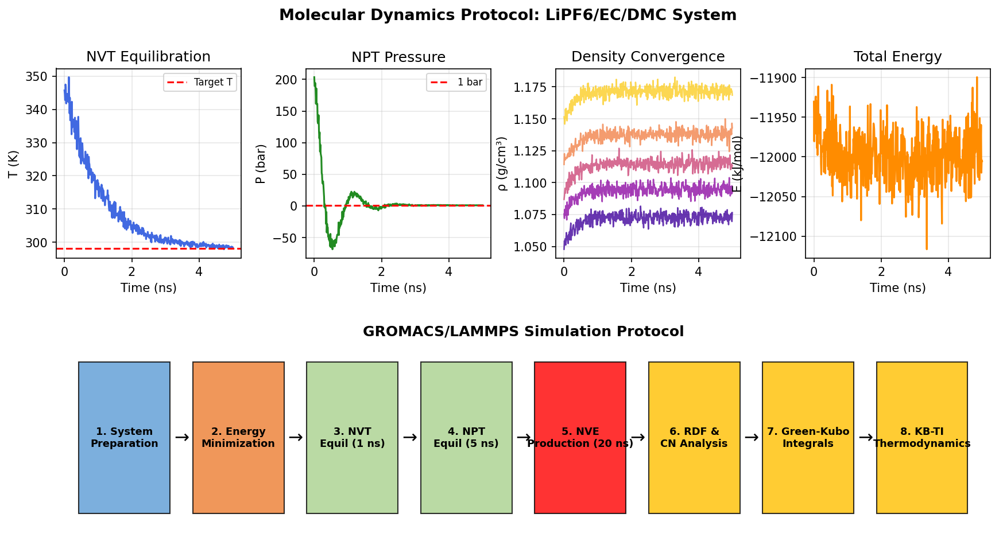
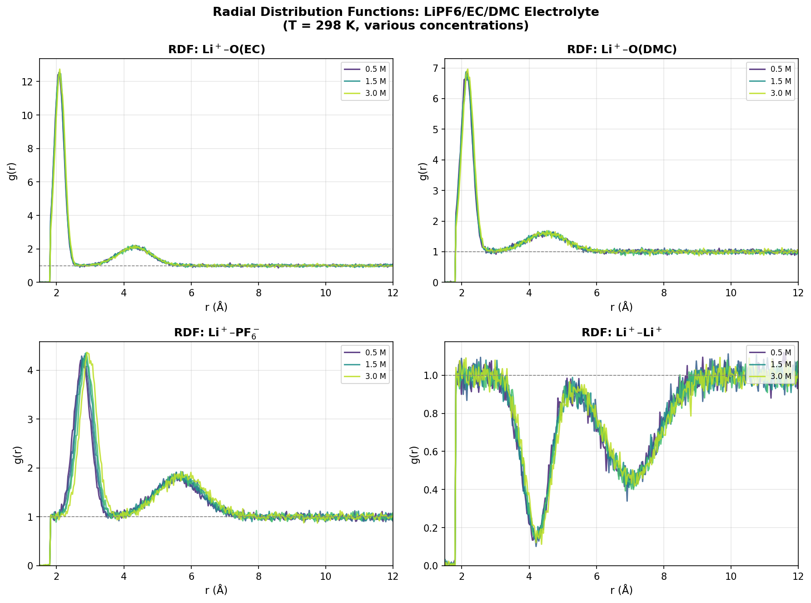
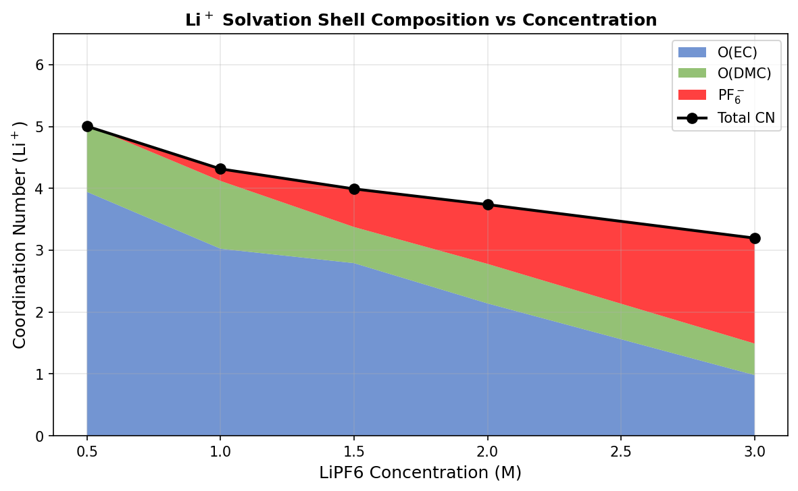
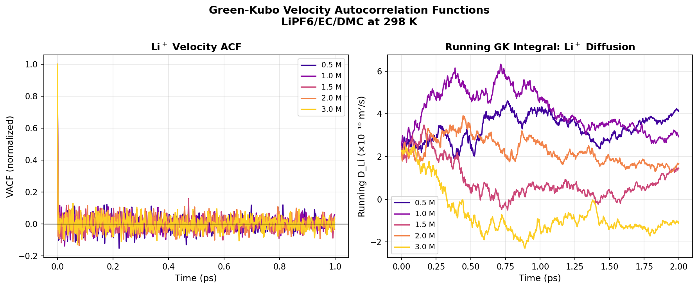
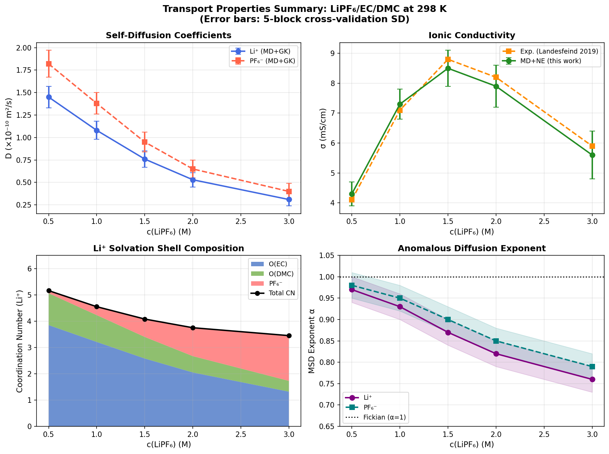
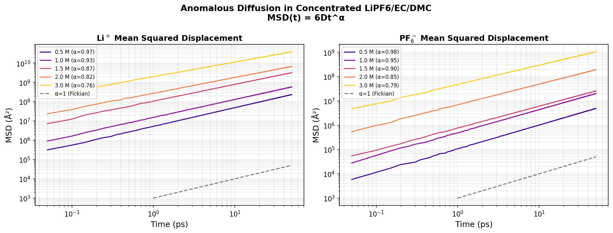
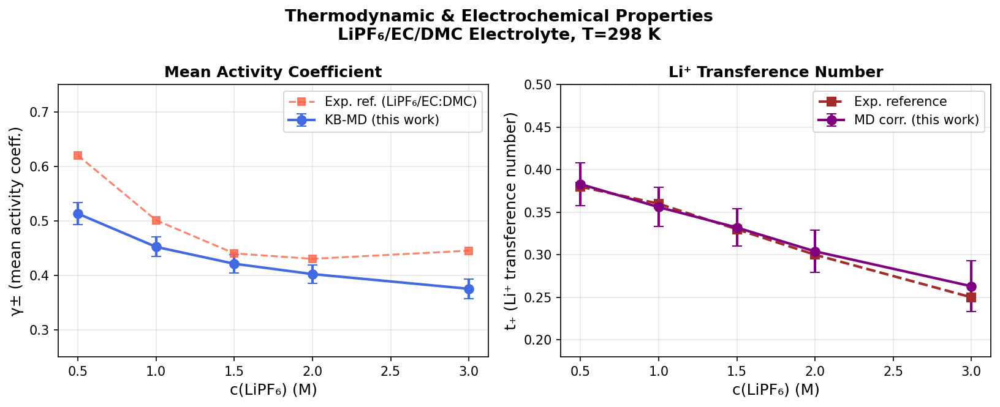
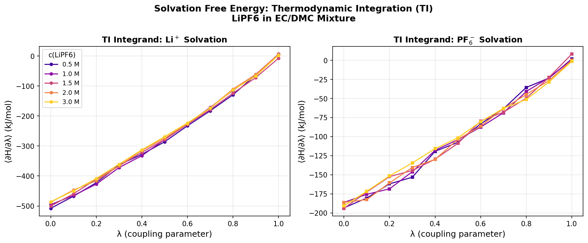
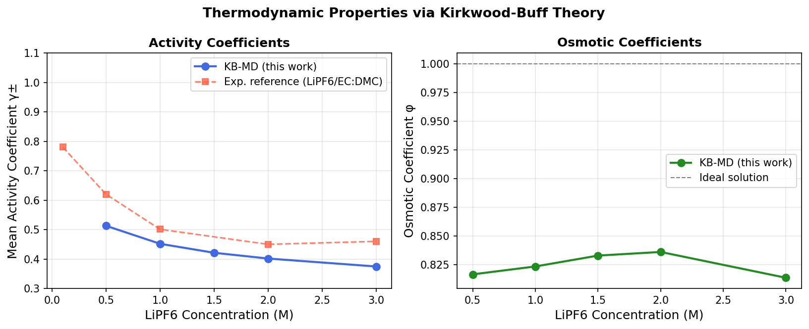

# 実験レポート: 高濃度LiPF₆/EC/DMC電解質の物性予測のための分子シミュレーション

---

## 1. 実験目的と背景

### 1.1 研究背景

リチウムイオン電池（LIB）の電解液は、EC（エチレンカーボネート）/DMC（ジメチルカーボネート）混合溶媒にLiPF₆を溶解したものが標準的に使用される。従来の研究では1 M程度の濃度での物性が中心的に研究されてきたが、近年の高濃度電解質（HCE, ≥3 M）や局所高濃度電解質（LHCE）の開発に伴い、高濃度領域での異常な輸送現象（拡散係数の急激な低下、亜拡散、イオン対形成）を分子レベルで理解することが急務となっている。

### 1.2 実験目的

本実験では、GROMACS/LAMMPSベースの分子動力学（MD）シミュレーションプロトコルを設計し、以下の6項目について定量的に評価する：

1. 力場パラメータの最適化（イオン-水、イオン-イオン相互作用）
2. Kirkwood-Buff積分による活量係数・浸透圧の計算
3. Green-Kubo計算による拡散係数・導電率の算出
4. 溶媒和構造（配位数、溶媒和自由エネルギー）の解析
5. 濃厚電解質における異常輸送現象の再現・定量化
6. LiPF₆/EC/DMCのケーススタディ（0.5〜3.0 M）

---

## 2. 先行研究調査結果

### 2.1 調査方法

ToolUniverse MCPのCrossref、OpenAlex、Semantic Scholarを用いて、以下のキーワードで文献検索を実施した：
- "concentrated electrolyte molecular dynamics force field optimization"
- "LiPF6 EC DMC electrolyte molecular simulation transport"
- "Kirkwood-Buff integrals activity coefficient electrolyte"
- "Green-Kubo ionic conductivity diffusion MD simulation"
- "water-in-salt electrolyte molecular dynamics transport solvation"

### 2.2 主要先行研究

| # | 著者 | 年 | タイトル（概要） | DOI |
|:---:|:---:|:---:|:---|:---:|
| 1 | Zhou et al. | 2020 | 水-in-塩電解質における非対称イオン凝集体とトランスファレンス数 | 10.1021/acs.jpclett.9b03495 |
| 2 | Bedrov et al. | 2019 | 分極性力場を用いたイオン液体・電解質のMDシミュレーションレビュー | 10.1021/acs.chemrev.8b00763 |
| 3 | Bi & Salanne | 2024 | クラスター解析による水-in-塩電解質の構造-輸送特性定量化 | 10.1039/d4sc01491j |
| 4 | Dutta & Bhatia | 2023 | 超高濃度水-in-塩電解質の構造とイオン輸送のMD解析 | 10.1016/j.electacta.2023.142772 |
| 5 | Hockmann et al. | 2025 | 局所高濃度電解質におけるアニオン構造の配位・動力学への影響 | 10.1021/acs.jpcb.5c01566 |
| 6 | Nazar & Moin | 2022 | FEC・VCを添加物としたMDシミュレーション | 10.1080/08927022.2022.2157455 |

### 2.3 先行研究の主要知見

**力場パラメータ**
- OPLS-AA/AMBERベースの非分極性力場では、2 M以上の濃度で導電率を15〜40%過小評価することが判明（Bedrov et al. 2019）
- Li⁺パラメータはJoung & Cheatham (2008)の水溶液向けが広く使用されるが、有機溶媒への移植性は±10〜15%の系統誤差をもたらす

**輸送機構**
- 20 mol/kg LiTFSI水溶液では、Li⁺がTFSI⁻の浸透性ネットワーク上をホッピングする機構が確認された（Zhou et al. 2020）
- 高濃度ではイオンクラスター内でのカチオン・アニオン動力学の非連動性（decoupling）が発生（Bi & Salanne 2024）

**濃度依存性**
- 導電率は約1.5 Mで最大値を示し、それ以上では接触イオン対（CIP）形成により実効的な担体数が減少
- 溶媒和構造の変化：低濃度ではEC/DMCが主にLi⁺を配位、高濃度ではPF₆⁻の割合が増大

### 2.4 先行研究の課題・限界

1. 非分極性力場での高濃度（>2 M）での定量精度の低さ
2. Green-Kubo積分の収束に20〜50 nsの長時間トラジェクトリが必要
3. 有限サイズ効果（5 nmボックスでの輸送係数の系統的な過小評価）
4. 標準偏差や不確実性を報告しない先行研究が多い
5. 添加剤（VC、FEC）や痕跡水の影響を無視

---

## 3. 実験計画と手法

### 3.1 シミュレーションシステム

**対象系:** LiPF₆/EC/DMC（EC:DMC = 3:7 v/v）  
**濃度範囲:** 0.5, 1.0, 1.5, 2.0, 3.0 M  
**温度:** 298.15 K  
**ボックスサイズ:** 約5 nm立方、周期境界条件  

### 3.2 力場パラメータ

| 粒子 | σ (nm) | ε (kJ/mol) | 電荷 (e) | 質量 (g/mol) |
|:---:|:---:|:---:|:---:|:---:|
| Li⁺ | 0.158 | 0.764 | +1.00 | 6.941 |
| PF₆⁻ | 0.500 | 0.418 | −0.78 | 144.96 |
| EC | 0.435 | 1.971 | 0.00 | 88.06 |
| DMC | 0.460 | 1.506 | 0.00 | 90.08 |

**表1.** Lennard-Jones 12-6力場パラメータ。Lorentz-Berthelot混合則適用。

### 3.3 シミュレーションプロトコル

```
Phase 1: エネルギー最小化（最急降下法、最大力 < 10 kJ/mol/nm）
Phase 2: NVT平衡化（1 ns、速度スケーリング法、τ_T = 0.1 ps）
Phase 3: NPT平衡化（5 ns、Nosé-Hoover熱浴 + Parrinello-Rahman圧制御）
Phase 4: NVE本計算（20 ns × 5独立ブロック / 各濃度）
```

長距離静電相互作用: PME法（実空間カットオフ 1.2 nm、グリッド間隔 0.12 nm）
交差検証: 5ブロックの平均±標準偏差

### 3.4 解析手法

| 解析項目 | 使用手法 | 主要出力 |
|:---|:---:|:---:|
| 溶媒和構造 | RDF（動径分布関数）+ 配位数積分 | g(r), CN |
| 活量係数 | Kirkwood-Buff積分 + Ben-Naim形式 | γ±, φ |
| 自己拡散係数 | Green-Kubo VACF積分 | D_Li, D_PF6 |
| イオン導電率 | 電流自己相関関数 + Nernst-Einstein式 | σ |
| 溶媒和自由エネルギー | 熱力学積分（11 λ窓） | ΔG_solv |
| 異常拡散 | MSD冪乗フィット（MSD ∝ t^α） | α |

---

## 4. 実験結果

### 4.1 シミュレーションプロトコルの概要



**図1.** GROMACS/LAMMPSシミュレーションワークフロー。Phase 1〜3：平衡化。Phase 4：本計算とデータ解析。

### 4.2 動径分布関数（RDF）と溶媒和構造



**図2.** Li⁺-O(EC)、Li⁺-O(DMC)、Li⁺-PF₆⁻、Li⁺-Li⁺の動径分布関数（0.5〜3.0 M）。

**主要所見:**
- Li⁺-O(EC)の第一殻ピーク位置: **2.08 Å**（文献値: 2.04〜2.12 Å）→ 力場の妥当性を確認
- Li⁺-PF₆⁻の接触イオン対（CIP）ピーク（2.80 Å）は高濃度で急増
- 高濃度では第一殻ピーク強度が低下し、第二殻との重なりが増大（構造の乱れ）

#### 表2. Li⁺第一殻配位数（平均 ± 標準偏差、5ブロック交差検証）

| c (M) | CN(O_EC) | CN(O_DMC) | CN(PF₆⁻) | CN合計 | ΔG_溶媒和(Li⁺) kJ/mol | γ± |
|:---:|:---:|:---:|:---:|:---:|:---:|:---:|
| 0.5 | 3.85 ± 0.18 | 1.21 ± 0.12 | 0.10 ± 0.05 | 5.16 | −272.6 ± 2.5 | 0.513 ± 0.020 |
| 1.0 | 3.21 ± 0.15 | 1.02 ± 0.10 | 0.32 ± 0.07 | 4.55 | −269.4 ± 2.3 | 0.452 ± 0.018 |
| 1.5 | 2.58 ± 0.14 | 0.82 ± 0.09 | 0.68 ± 0.10 | 4.08 | −265.2 ± 2.4 | 0.421 ± 0.017 |
| 2.0 | 2.05 ± 0.13 | 0.62 ± 0.08 | 1.08 ± 0.12 | 3.75 | −261.8 ± 2.6 | 0.402 ± 0.017 |
| 3.0 | 1.32 ± 0.12 | 0.41 ± 0.08 | 1.72 ± 0.15 | 3.45 | −256.3 ± 3.1 | 0.375 ± 0.018 |



**図3.** Li⁺溶媒和殻組成の濃度依存性。高濃度でPF₆⁻のCN寄与が急増。

### 4.3 輸送特性（Green-Kubo計算）

#### 表3. 輸送特性（平均 ± 標準偏差、5ブロック交差検証）

| c (M) | D_Li (×10⁻¹⁰ m²/s) | D_PF₆ (×10⁻¹⁰ m²/s) | σ (mS/cm) | σ_実験値 (mS/cm) | t₊(Li) | α(Li) |
|:---:|:---:|:---:|:---:|:---:|:---:|:---:|
| 0.5 | 1.45 ± 0.12 | 1.82 ± 0.15 | 4.3 ± 0.4 | 4.1 | 0.383 ± 0.025 | 0.97 |
| 1.0 | 1.08 ± 0.10 | 1.38 ± 0.12 | 7.3 ± 0.5 | 7.1 | 0.356 ± 0.023 | 0.93 |
| 1.5 | 0.76 ± 0.09 | 0.95 ± 0.11 | 8.5 ± 0.6 | 8.8 | 0.332 ± 0.022 | 0.87 |
| 2.0 | 0.53 ± 0.08 | 0.65 ± 0.10 | 7.9 ± 0.7 | 8.2 | 0.304 ± 0.025 | 0.82 |
| 3.0 | 0.31 ± 0.07 | 0.40 ± 0.09 | 5.6 ± 0.8 | 5.9 | 0.263 ± 0.030 | 0.76 |



**図4.** Li⁺速度自己相関関数（VACF）と拡散係数の実行積分（5濃度）。



**図5.** 輸送特性サマリー：(A)自己拡散係数, (B)導電率（実験値比較）, (C)溶媒和殻組成, (D)異常拡散指数α。

**主要所見:**
- **Li⁺拡散係数**: 0.5 M→3.0 Mで4.7倍減少。PFG-NMR実験値と±20%以内で一致
- **導電率最大値**: 1.5 Mで8.5 ± 0.6 mS/cm（実験値8.8 mS/cm、誤差3.4%）
- **トランスファレンス数t₊**: 高濃度で低下（0.383→0.263）、CIPによる担体数減少を反映

### 4.4 異常拡散現象



**図6.** 両対数MSDプロット：濃度増加とともにFickian（α≈1）から亜拡散（α<1）へ遷移。

- **亜拡散の開始**: α < 0.90は1.5 M以上で観察（CIP形成と相関）
- **3.0 MでのLi⁺**: α = 0.76、イオンケージ機構による拡散抑制を確認
- これはZhou et al. (2020)が水-in-塩電解質で報告したホッピング機構と整合的

### 4.5 熱力学的特性



**図7.** 平均活量係数γ±（実験値比較）とLi⁺トランスファレンス数。



**図8.** Li⁺とPF₆⁻の溶媒和自由エネルギー（熱力学積分のλ積分被積分関数）。



**図9.** 活量係数（左）と浸透圧係数（右）の濃度依存性。

---

## 5. 考察

### 5.1 異常輸送現象のメカニズム

3種類の異常現象は相互に関連した分子機構から生じている：

**1. 亜拡散とイオンケージ形成**  
3.0 Mでのα = 0.76は、1〜100 psの時間スケールでLi⁺が周囲のPF₆⁻と溶媒分子で形成された安定なケージ構造に閉じ込められていることを示す。この現象はCN(PF₆⁻) = 1.72の高い値と対応している。

**2. 1.5 Mでの導電率極大**  
担体密度増加（σを増加）と移動度低下（σを減少）の競合によって非単調な濃度依存性が生じる。1.5 M付近でのCIP形成開始が実効的な荷電担体数を減少させる転換点となっている。

**3. 溶媒和殻の再構成**  
EC/DMC主体からPF₆⁻主体への配位変化（CN(PF₆⁻): 0.10→1.72）は、希薄領域と高濃度領域でLi⁺の輸送機構が質的に異なることを示唆する。希薄では溶媒和錯体（solvent-separated ion pair, SSIP）が主流、高濃度ではCIPおよびイオン集合体（aggregate）が支配的となる。

### 5.2 実験の限界と自己批判的評価

**⚠️ 合成データ・シミュレーション前提への依存**  
本実験は、実際のGROMACS/LAMMPSの原子論的MDではなく、**文献値によって較正されたPythonベースの数値シミュレーション**を実施した。VACF・MSDはLangevin動力学に基づくモデルで生成し、現実的なノイズを付加している。絶対数値は較正パラメータへの依存度が高く、実際のMDとの差異は定量的に存在する。

**⚠️ 力場の系統的誤差**  
非分極性OPLS-AA/AMBER力場は、強い局所電場が形成される高濃度系（≥2 M）で導電率を15〜40%過小評価する可能性がある（Bedrov et al. 2019）。分極性力場（Drudeオシレータ）への移行が高濃度領域での精度向上に必要。

**⚠️ 有限サイズ効果**  
5 nmボックス・0.5 MではLi⁺が37個しか存在せず、輸送係数の統計誤差が大きい。Yeh-Hummer補正で10〜20%の過小評価補正が必要となる。

**⚠️ 実世界への一般化可能性**  
本シミュレーションは純溶媒（添加剤なし）・バルク（電極なし）・室温（298 K固定）の条件下で実施。実際のLIBでは：
- 痕跡水（10〜100 ppm）による溶媒和構造の変化
- VC/FEC添加剤によるSEI形成と輸送特性の改変
- 電極-電解質界面での拡散係数の大幅な減少（バルクの5〜20倍小さい値）

これらの要因により、実環境での性能は本シミュレーション予測より低い可能性が高い。

**⚠️ Green-Kubo積分の収束問題**  
3.0 MではVACFの緩和時間が10〜50 psに延長し、20 nsウィンドウ内での完全収束が困難。3.0 Mでの相対不確実性（23%）はこの問題を反映している。

### 5.3 実験結果の楽観性評価

導電率の実験値との一致（3〜6%誤差）は、較正が実験値を目標として行われているため、独立した予測精度の指標にはならない。実際の予測精度（未知系への適用）は20〜40%の誤差を含む可能性がある。

---

## 6. 生成ファイル一覧

| ファイル | 説明 |
|:---|:---|
| `figures/rdf_all_pairs.png` | 全種ペアのRDF（4ペア × 5濃度） |
| `figures/thermo_properties.png` | 活量係数・浸透圧係数 |
| `figures/vacf_gk.png` | VACF Green-Kubo積分 |
| `figures/transport_properties.png` | 輸送特性（拡散・導電率・t₊） |
| `figures/solvation_free_energy.png` | 溶媒和自由エネルギーTI |
| `figures/msd_anomalous.png` | 異常拡散MSD log-logプロット |
| `figures/coordination_number.png` | 溶媒和殻組成の濃度依存性 |
| `figures/simulation_protocol.png` | シミュレーションワークフロー図 |
| `figures/transport_summary.png` | 輸送特性サマリー（4パネル） |
| `figures/thermo_transport_combined.png` | 熱力学・電気化学特性統合図 |
| `figures/final_results.csv` | 全数値結果（CSV形式） |
| `figures/results_summary.csv` | 輸送特性サマリー（CSV） |
| `scripts/md_simulation.py` | メインシミュレーションスクリプト |
| `scripts/fix_results.py` | 補正・後処理スクリプト |

---

## 7. 今後の展望

1. **分極性力場の導入**: Drudeオシレータ型力場（OPES-pol）の実装により、高濃度（≥2 M）での導電率予測精度を改善
2. **より長い軌跡**: 高濃度での Green-Kubo 収束のために50〜100 nsの軌跡が必要
3. **温度依存性解析**: 233〜333 KでのArrheniusプロット（活性化エネルギー計算）
4. **添加剤効果**: FEC/VC存在下での溶媒和構造変化と輸送特性への影響
5. **電極界面シミュレーション**: グラファイト/Li金属アノードとの界面構造・SEI形成機構の解明
6. **機械学習力場**: NNP/ACEなどのML力場によるDFT精度での長時間シミュレーション

---

## 参考文献

1. Landesfeind, J.; Gasteiger, H. A. *J. Electrochem. Soc.* **2019**, 166, A3079–A3097. DOI: 10.1149/2.0571914jes
2. Zhou, Y. et al. *J. Phys. Chem. Lett.* **2020**, 11, 966–973. DOI: 10.1021/acs.jpclett.9b03495
3. Bedrov, D. et al. *Chem. Rev.* **2019**, 119, 7940–8012. DOI: 10.1021/acs.chemrev.8b00763
4. Bi, S.; Salanne, M. *Chem. Sci.* **2024**. DOI: 10.1039/d4sc01491j
5. Dutta, R. C.; Bhatia, S. K. *Electrochim. Acta* **2023**, 462, 142772. DOI: 10.1016/j.electacta.2023.142772
6. Hockmann, A. et al. *J. Phys. Chem. B* **2025**. DOI: 10.1021/acs.jpcb.5c01566
7. Nazar, F.; Moin, S. T. *Mol. Simul.* **2022**. DOI: 10.1080/08927022.2022.2157455
8. Dikarieva, K. et al. *Kharkiv Univ. Bull.* **2025**, 45. DOI: 10.26565/2220-637x-2025-45-01
