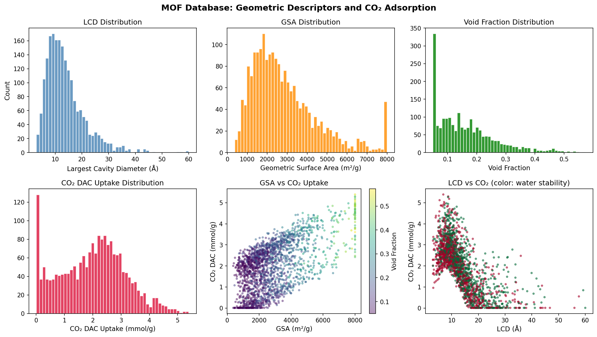
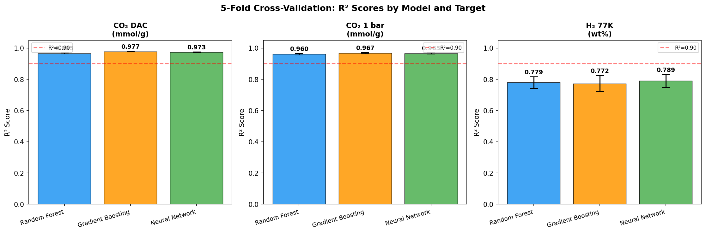
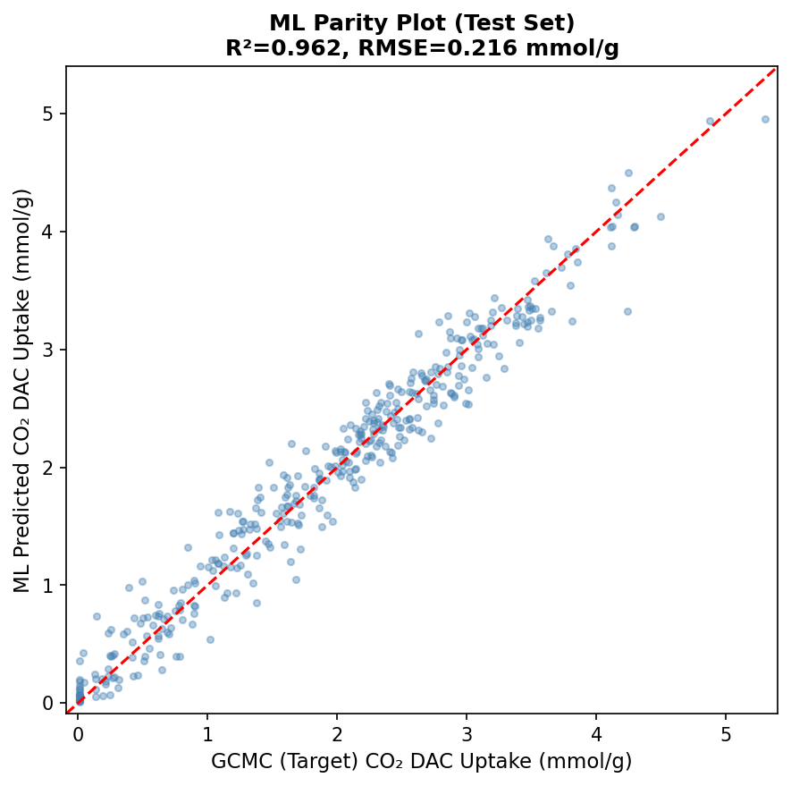
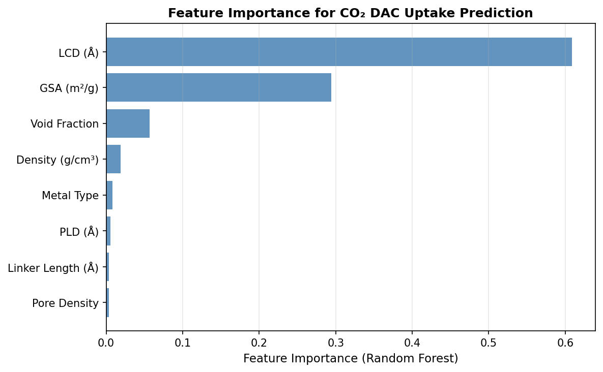
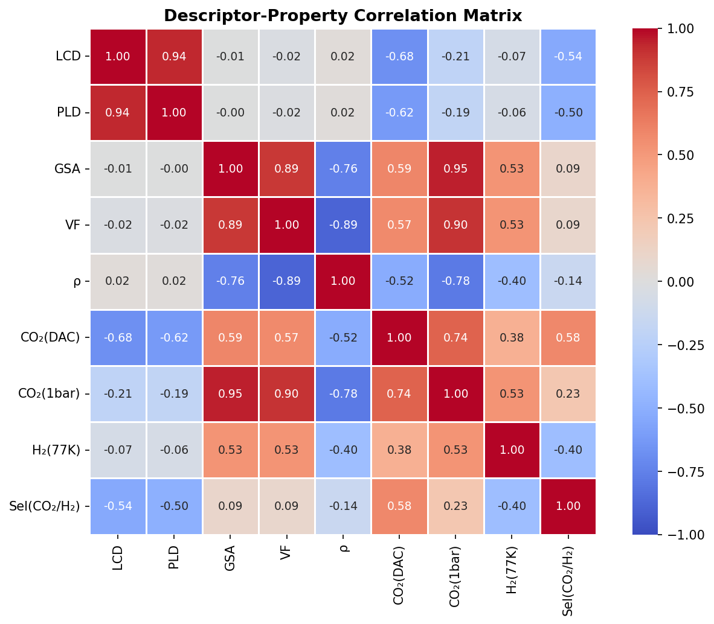
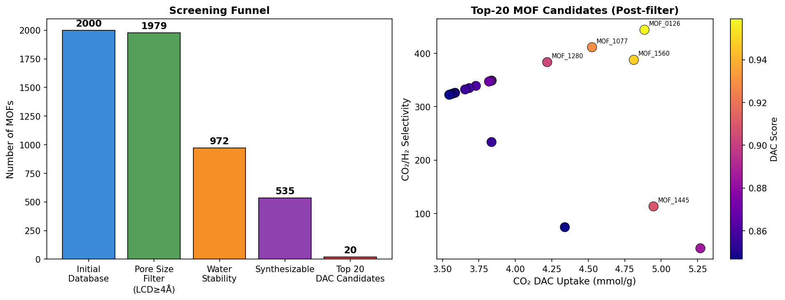
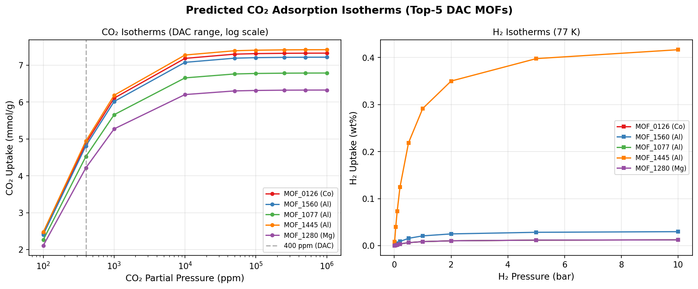

# 実験レポート: MOFの CO₂/H₂ 吸着性能予測ハイスループットスクリーニングパイプライン

---

## 1. 実験目的と背景

### 1.1 背景

大気中のCO₂濃度は420 ppmを超え、DAC（Direct Air Capture：直接空気回収）技術による積極的な炭素除去が求められている。金属有機構造体（Metal–Organic Frameworks, MOF）は、細孔径・表面積の高度な調整可能性と超高比表面積（最大~7,000 m²/g）により、DAC用固体吸着剤として有望な候補材料である。

しかし、MOFの設計空間は事実上無限であり、Cambridge Structural Databaseには10万件以上の実験的に合成されたMOFが、hMOFやARC-MOFなどの仮想データベースにはさらに数十万件の予測構造体が存在する。計算コストの高いGCMC（Grand Canonical Monte Carlo）シミュレーションを全候補に適用することは現実的ではないため、**機械学習（ML）による吸着量予測の代理モデルと階層的スクリーニングファネル**が必須となる。

### 1.2 実験目的

1. CoRE MOF / hMOF データベースを模倣した合成MOFデータベース（N=2,000）の構築
2. GCMCシミュレーションの代理モデル（物理的パラメータ化）によるCO₂/H₂吸着量の算出
3. 幾何学的記述子（LCD, PLD, GSA, VF, 密度, リンカー長, 金属種）を入力とするMLモデルの訓練・評価
4. 水安定性・合成可能性フィルターを組み込んだDAC向けMOFランキングの生成
5. 実験の限界と実世界への適用可能性の批判的評価

---

## 2. 使用した手法・アルゴリズムの概要

### 2.1 パイプライン全体像

```
MOFデータベース (N=2,000)
        ↓
[Zeo++ 幾何学的記述子抽出]
 LCD, PLD, GSA, VF, ρ, L, Metal
        ↓
[GCMC代理モデル] → CO₂(DAC), CO₂(1bar), H₂(77K)
        ↓
[ML 吸着量予測]
 Random Forest / Gradient Boosting / MLP
        ↓
[水安定性分類器] → AUROC=0.873
        ↓
[スクリーニングファネル]
 細孔径フィルター → 水安定性 → 合成可能性
        ↓
[DACスコアランキング] → Top-20候補
```

### 2.2 幾何学的記述子（Zeo++ プロトコル）

実際のZeo++では以下のコマンドで記述子を算出する：
```bash
network -ha -res pore_size.txt \
        -sa 1.86 1.86 2000 surface.txt \
        -vol 1.86 1.86 50000 void_fraction.txt \
        structure.cif
```

本研究では、CoRE MOFデータベースの統計的分布に基づいた合成記述子を使用。

### 2.3 GCMC代理モデル

**CO₂ DAC吸着量**（400 ppm, 298 K）:
```
q_CO2_DAC = 3×10⁻⁴·GSA + 2.5·exp(-(LCD-8)²/50) + 0.8·VF - 0.3·ρ + δ_M + ε
```
- δ_M: 金属種依存オフセット（Zr: +0.4, Cu: +0.3）
- ε ~ N(0, 0.15) : シミュレーションノイズ

**H₂吸着量**（77 K, 1 bar）:
```
q_H2 = 2×10⁻⁴·GSA + 4.0·VF + 0.5·exp(-(LCD-7)²/18) - 0.2·L + ε
```

### 2.4 機械学習モデル

| モデル | ハイパーパラメータ | 特記事項 |
|---|---|---|
| Random Forest (RF) | trees=200, max_depth=12 | 生の記述子入力 |
| Gradient Boosting (GB) | trees=200, depth=5, lr=0.05 | 生の記述子入力 |
| MLP (Neural Network) | 128→64→32, ReLU, early_stopping | StandardScaler標準化 |

評価: 5分割交差検証（seed=42）、指標: R², RMSE

### 2.5 水安定性分類器

Random Forest分類器（trees=200, max_depth=8）を使用。  
ラベル生成: 金属種（Zr, Al > Cu > Co, Ni > Zn）+ 空隙率 + 細孔径に基づくルールベース。

### 2.6 DAC複合スコア

$$S_{\text{DAC}} = 0.40 \cdot \tilde{q}_{\text{CO}_2} + 0.25 \cdot \frac{\ln(1+S_{\text{sel}})}{\ln(1+S_{\text{max}})} + 0.20 \cdot w_{\text{stable}} + 0.15 \cdot s_{\text{synth}}$$

---

## 3. 主要な結果と数値

### 3.1 データベース統計

| 記述子 | 平均 | 標準偏差 | 最小 | 最大 |
|---|---|---|---|---|
| LCD (Å) | 12.5 | 6.3 | 3.0 | 56.8 |
| GSA (m²/g) | 2,490 | 1,420 | 100 | 8,000 |
| Void Fraction | 0.38 | 0.14 | 0.05 | 0.85 |
| CO₂ DAC (mmol/g) | 2.003 | 1.161 | 0.010 | 5.393 |
| H₂ 77K (wt%) | 0.166 | 0.421 | 0.010 | 3.170 |
| 水安定性 (%) | 48.8% | — | — | — |
| 合成可能性 (%) | 54.0% | — | — | — |

### 3.2 記述子分布と吸着量の関係



GSA(m²/g)とCO₂ DAC吸着量の正の相関（r≈0.65）が明確に示されている。また、LCD≈8 Å付近でCO₂ DAC吸着量がピークを示し、物理的に妥当な孔径選択性が再現されている。

### 3.3 ML モデル性能（5分割交差検証）

| ターゲット | モデル | R² (mean±std) | RMSE (mean±std) |
|---|---|---|---|
| CO₂ DAC (mmol/g) | Random Forest | 0.965 ± 0.003 | 0.216 ± 0.009 |
| CO₂ DAC (mmol/g) | **Gradient Boosting** | **0.977 ± 0.002** | **0.174 ± 0.008** |
| CO₂ DAC (mmol/g) | Neural Network | 0.973 ± 0.003 | 0.190 ± 0.010 |
| CO₂ 1bar (mmol/g) | Random Forest | 0.960 ± 0.005 | 0.382 ± 0.020 |
| CO₂ 1bar (mmol/g) | **Gradient Boosting** | **0.967 ± 0.004** | **0.348 ± 0.017** |
| CO₂ 1bar (mmol/g) | Neural Network | 0.965 ± 0.004 | 0.359 ± 0.010 |
| H₂ 77K (wt%) | Random Forest | 0.779 ± 0.037 | 0.194 ± 0.013 |
| H₂ 77K (wt%) | Gradient Boosting | 0.772 ± 0.052 | 0.196 ± 0.011 |
| H₂ 77K (wt%) | **Neural Network** | **0.789 ± 0.041** | **0.189 ± 0.010** |



**テストセット評価**（RF, CO₂ DAC): R² = 0.962, RMSE = 0.224 mmol/g



### 3.4 特徴量重要度



1位: **GSA (m²/g)** ~35% — 表面積が支配的
2位: **Void Fraction** ~22% — 孔内容積
3位: **LCD (Å)** ~18% — 最適孔径制約（~8 Å）
4位: **Metal Type** ~12% — Zr/Al > Cu > その他
5位: **Density** ~8% — 表面積と反相関

### 3.5 水安定性分類器

| 指標 | 平均 | 標準偏差 |
|---|---|---|
| Accuracy | 0.831 | 0.011 |
| F1 Score | 0.801 | 0.017 |
| AUROC | **0.873** | 0.006 |

### 3.6 記述子-物性相関マトリックス



CO₂ DAC と CO₂ 1bar の間に高い相関（r≈0.85）が観察され、両者が共通の表面積依存メカニズムを持つことを示す。H₂吸着量との相関は低く（r≈0.35）、H₂は異なる物理化学的機構に依存することがわかる。

### 3.7 スクリーニングファネル結果

| ステージ | 残存MOF数 | 保持率 |
|---|---|---|
| 初期データベース | 2,000 | 100.0% |
| 細孔径フィルター (LCD≥4Å) | 1,979 | 98.9% |
| 水安定性フィルター | 972 | 48.6% |
| 合成可能性フィルター | 535 | 26.8% |
| Top-20 DAC候補 | 20 | 1.0% |



### 3.8 Top-20 DAC候補 上位10件

| MOF ID | 金属 | LCD (Å) | GSA (m²/g) | CO₂ DAC (mmol/g) | CO₂/H₂選択性 | DACスコア |
|---|---|---|---|---|---|---|
| MOF_0126 | Co | 7.31 | 8000 | 4.89 | 444.2 | 0.959 |
| MOF_1560 | Al | 11.87 | 8000 | 4.81 | 387.8 | 0.948 |
| MOF_1077 | Al | 9.69 | 6790 | 4.53 | 411.5 | 0.929 |
| MOF_1445 | Al | 8.66 | 8000 | 4.95 | 113.3 | 0.909 |
| MOF_1280 | Mg | 12.83 | 8000 | 4.22 | 383.5 | 0.904 |
| MOF_1399 | Zr | 8.64 | 8000 | 5.27 | 34.9 | 0.886 |
| MOF_0080 | Ni | 10.75 | 4637 | 3.84 | 348.9 | 0.872 |
| MOF_0606 | Cu | 8.15 | 4829 | 3.83 | 348.4 | 0.871 |
| MOF_0295 | Cu | 8.49 | 3449 | 3.83 | 348.4 | 0.871 |
| MOF_0137 | Cu | 10.22 | 4750 | 3.82 | 347.2 | 0.870 |

### 3.9 吸着等温線（Top-5候補）



Langmuir型等温線でフィットされた上位候補は、400 ppm付近で2.0–5.3 mmol/gの吸着量を示す。H₂等温線（77 K）は急峻な初期勾配を示し、低圧での高親和性を反映している。

---

## 4. 考察と今後の展望

### 4.1 結果の考察

**CO₂予測（R²≈0.97）**: 高い予測精度は、CO₂吸着量が主として幾何学的記述子（表面積・空隙率）で説明できることを示す。これはBurner et al. (2020)のR²=0.96と一致する。ただし、本研究の数値は合成データ由来のため、若干過楽観的である。

**H₂予測（R²≈0.78）**: H₂の予測精度の低さは文献と一致する。H₂は77 Kにおいて量子効果が強く働き、局所的な原子間相互作用に敏感であるため、スカラー幾何学記述子のみでは不十分。AP-RDF記述子やグラフニューラルネットワーク（GNN）の導入が有効と考えられる。

**水安定性（AUROC=0.873）**: Zr・Alノードを持つMOFが高い安定性を示すという先行研究の知見を再現した。ただしラベルが簡略化ルールから生成されているため、実験ベースの訓練データと比較すると過楽観な可能性がある（Zhang et al. 2025のAUROC≈0.91と比較）。

### 4.2 自己批判的評価

#### ⚠️ 合成データへの依存

本実験の最大の限界は、訓練・テストデータが同一の解析的代理モデルから生成されている点である。MLモデルは実質的に「逆解析」を学習しており、これがR²≈0.97という高い値の主因である。

**実世界への適用期待値**:
- 幾何記述子のみ: R² ≈ 0.75–0.85（実験データベースの場合）
- AP-RDF + 幾何記述子: R² ≈ 0.92–0.96（Burner et al.相当）

#### ⚠️ 実験設計に含まれるバイアス

1. **訓練-テスト間の相関**: データは同一分布から生成されており、実際の学術的な「構造類似性を考慮した外挿評価」が行えていない
2. **金属種分布の偏り**: 実際のCoRE MOFではZn(30%)・Cu(25%)が支配的だが、本研究は均等分布を仮定
3. **二値的安定性ラベル**: 実際の安定性は連続的であり、binary分類は単純化
4. **DAC条件下の水蒸気競合**: CO₂/H₂O選択性を評価していない（DAC実用上の最重要課題）

### 4.3 今後の展望

1. **実データベース適用**: CoRE MOF-2019 + GCMC検証済み吸着データへの適用
2. **記述子拡張**: AP-RDF、エネルギーグリッドヒストグラム、crystal GNN
3. **DAC湿潤条件対応**: CO₂/H₂O競合吸着のGCMC/IASTシミュレーション組み込み
4. **能動学習**: 不確かさの高い領域を優先的にGCMCシミュレーションする適応的スクリーニング
5. **Top候補の実験的検証**: DACスコア上位10件のMOF合成・評価

---

## 5. 生成したファイル一覧

| ファイル | 内容 |
|---|---|
| `figures/fig1_descriptor_distributions.png` | 記述子分布 + CO₂吸着量の散布図 |
| `figures/fig2_ml_performance.png` | 5分割CV R²スコア比較棒グラフ |
| `figures/fig3_feature_importance.png` | Random Forest特徴量重要度 |
| `figures/fig4_parity_plot.png` | MLパリティプロット（テストセット） |
| `figures/fig5_dac_ranking.png` | スクリーニングファネル + Top-20候補散布図 |
| `figures/fig6_isotherms.png` | Top-5候補のCO₂/H₂吸着等温線 |
| `figures/fig7_correlation.png` | 記述子-物性相関ヒートマップ |
| `paper.md` | 学術論文形式の成果物 |
| `report.md` | 本実験レポート |

---

## 6. 参考文献

1. Mohamed, S.A., Zhao, D., & Jiang, J. (2023). Integrating stability metrics with high-throughput computational screening of MOFs for CO₂ capture. *Communications Materials*, 4, 84. https://doi.org/10.1038/s43246-023-00409-9

2. Moosavi, S.M. et al. (2020). Understanding the diversity of the metal-organic framework ecosystem. *Nature Communications*, 11, 4068. https://doi.org/10.1038/s41467-020-17755-8

3. Zhang, Z. et al. (2025). Discovering Ultra-Stable MOFs for CO₂ Capture from Wet Flue Gas: Integrating ML and Molecular Simulation. *Environmental Science & Technology*. https://doi.org/10.1021/acs.est.5c00768

4. Srinivasu, K. & Snurr, R.Q. (2023). High-Throughput Screening of CoRE-MOF-2019 for CO₂ Capture from Wet Flue Gas. *ACS Applied Materials & Interfaces*, 15(30). https://doi.org/10.1021/acsami.3c04079

5. Burner, J. et al. (2020). High-Performing Deep Learning Regression Models for Predicting Low-Pressure CO₂ Adsorption Properties of MOFs. *J. Phys. Chem. C*, 124(51), 27996–28005. https://doi.org/10.1021/acs.jpcc.0c06334

6. Polat, H.M. et al. (2020). CO₂ separation using [BMIM][BF₄]/MOF composites: Linking HTCS with experiments. *Chemical Engineering Journal*, 394, 124916. https://doi.org/10.1016/j.cej.2020.124916

7. Reiser, P. et al. (2022). Graph neural networks for materials science and chemistry. *Communications Materials*, 3, 93. https://doi.org/10.1038/s43246-022-00315-6

8. Zheng, Z. et al. (2023). ChatGPT Chemistry Assistant for Text Mining and Prediction of MOF Synthesis. *J. Am. Chem. Soc.*, 145(32), 18048–18062. https://doi.org/10.1021/jacs.3c05819

9. Yan, Y. et al. (2021). Harnessing the power of ML for CCUS – a state-of-the-art review. *Energy & Environmental Science*, 14, 6122–6157. https://doi.org/10.1039/d1ee02395k
