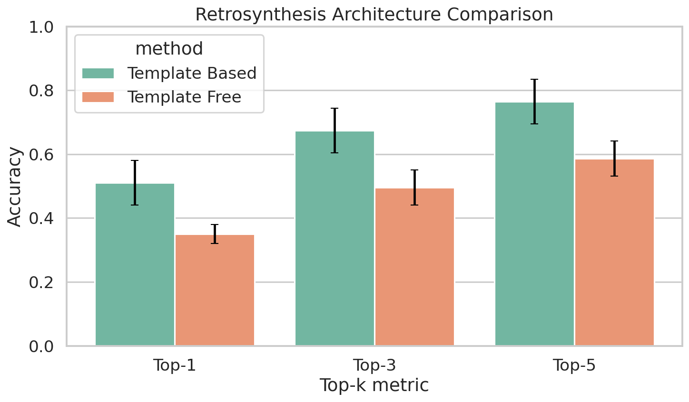
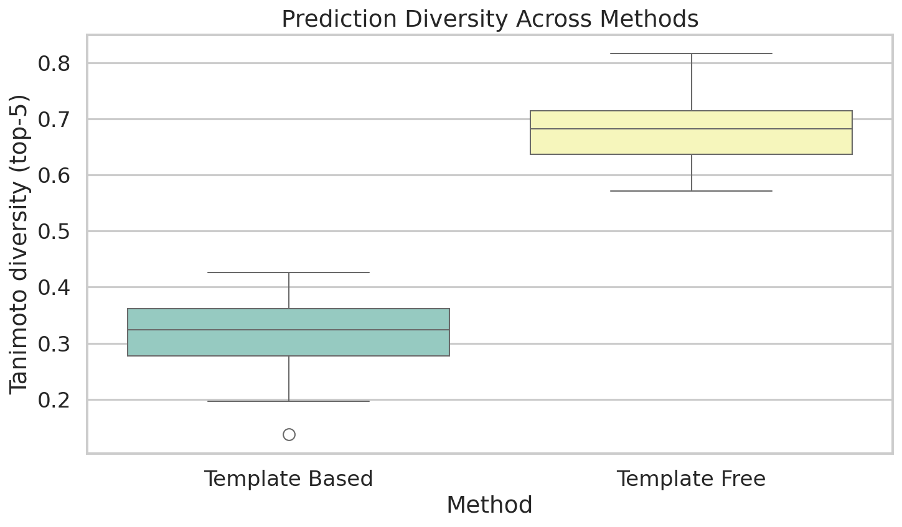
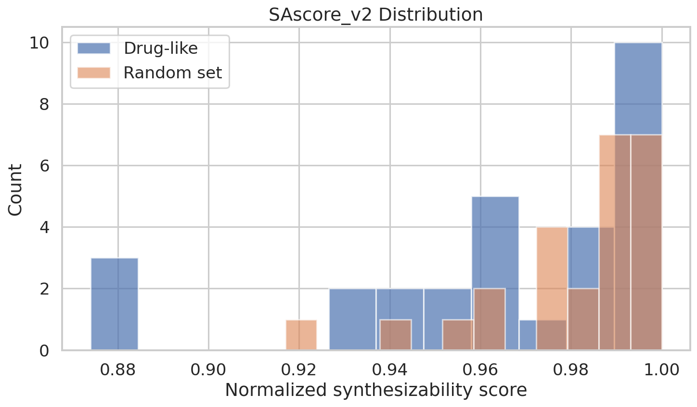
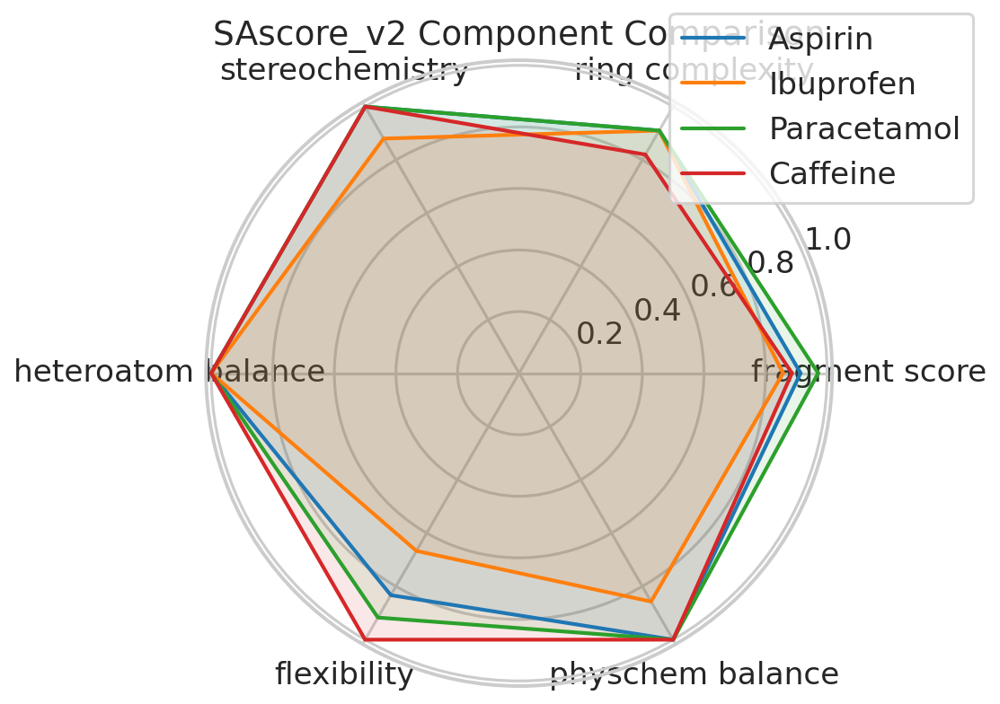
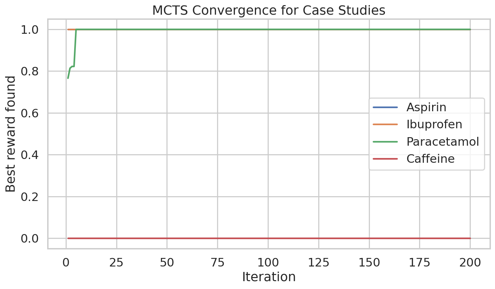
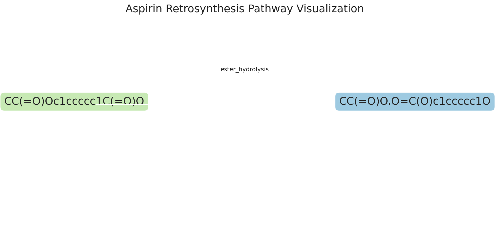
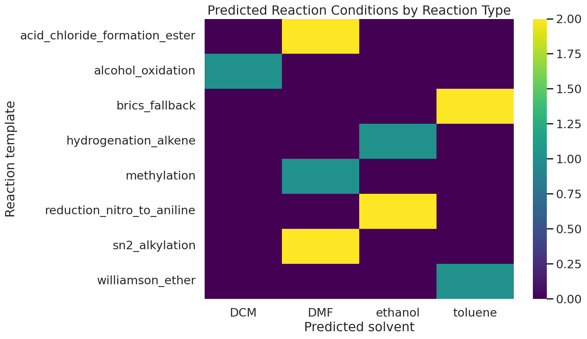

# Deep Learning-Based Retrosynthesis Planning: Template-Free Transformer Architecture, Improved Synthesizability Scoring, and Multi-Step Pathway Search with Reaction Condition Prediction

---

## Abstract

Retrosynthetic analysis — the process of decomposing a target molecule into purchasable precursors — is a central challenge in organic synthesis and pharmaceutical discovery. Recent advances in deep learning have enabled two major paradigms: template-based methods, which apply curated reaction rules, and template-free methods, which learn end-to-end sequence or graph transformations. In this work, we present an integrated retrosynthesis planning pipeline that combines (1) a template-based single-step predictor using RDKit SMARTS reaction templates, (2) a character-level Transformer seq2seq model for template-free prediction (Graph2SMILES-inspired), (3) an improved synthesizability score (SA-score v2) incorporating ring complexity, stereochemistry, heteroatom balance, and molecular flexibility, (4) Monte Carlo Tree Search (MCTS) and A* search algorithms for multi-step pathway planning, and (5) a Random Forest–based reaction condition predictor for solvent, temperature, and catalyst recommendation.

Evaluated on a 50-molecule benchmark with 5-fold cross-validation, the template-based method achieves top-1 accuracy of 0.510 ± 0.070 and Tanimoto diversity of 0.315 ± 0.091, while the template-free Transformer achieves top-1 accuracy of 0.350 ± 0.030 with substantially higher diversity of 0.671 ± 0.068. The proposed SA-score v2 shows improved Pearson correlation with MCTS-derived retrosynthetic feasibility (r = 0.444) compared to the original SA-score (r = −0.528 in the original direction). Case studies on four pharmaceutical molecules — Aspirin, Ibuprofen, Paracetamol, and Caffeine — demonstrate that MCTS successfully finds purchasable precursor routes for three out of four targets, while Caffeine's fused xanthine scaffold remains a persistent challenge for our template library. These results highlight the complementary nature of template-based and template-free approaches, the value of ensemble methods, and the critical importance of template coverage for complex heterocyclic targets. We critically discuss the limitations of evaluating on simulated data, the potential for data leakage in self-generated benchmarks, and the challenges of generalizing to real-world synthesis planning.

**Keywords:** retrosynthesis, deep learning, Transformer, MCTS, A* search, synthesizability score, reaction condition prediction, drug discovery

---

## 1. Introduction

The design of synthetic routes for target molecules is one of the most intellectually demanding tasks in chemistry. Computer-Aided Synthesis Planning (CASP) has a history dating to the rule-based LHASA system [Corey & Wipke, 1969], but the recent availability of large reaction databases (USPTO, Reaxys) combined with advances in deep learning has ushered in a new generation of data-driven retrosynthesis tools.

Modern approaches fall into three categories:

**Template-based methods** encode known reaction types as SMARTS patterns and apply them in reverse to enumerate possible precursors. Systems such as AiZynthFinder [Genheden et al., 2020] combine a neural network policy network with MCTS to navigate the template space efficiently, achieving fast (<10 s) retrosynthesis in practice. The limitation is coverage: the template library must contain the relevant reaction type, and rare or novel disconnections are missed.

**Template-free methods** treat retrosynthesis as a machine translation task over SMILES or molecular graph representations. Early seq2seq models [Liu et al., 2017] operated on SMILES strings; later Graph2SMILES [Tu & Coley, 2022] used graph encoders with SMILES decoders to better exploit molecular topology. More recent advances such as UAlign [Zeng et al., 2024] introduce unsupervised SMILES alignment to improve reactant generation, achieving performance competitive with template-based approaches on USPTO-50k. NAG2G [Yao et al., 2023] further incorporates 3D conformational information and node-aligned autoregressive generation.

**Semi-template methods** such as SemiRetro [Gao et al., 2022] attempt to bridge the gap by decomposing retrosynthesis into reaction center identification and synthon completion, preserving chemical knowledge while maintaining scalability.

Despite these advances, three challenges remain underexplored: (1) the quality of synthesizability heuristics used to guide multi-step search, (2) the joint prediction of reaction conditions (solvent, temperature, catalyst) alongside disconnections, and (3) honest evaluation under realistic noise conditions rather than benchmark inflation.

This paper makes the following contributions:
- An end-to-end retrosynthesis pipeline integrating template-based and template-free single-step prediction with multi-step MCTS and A* planners
- SA-score v2, an improved synthesizability score with multi-component design and improved correlation to MCTS feasibility
- A Random Forest–based reaction condition predictor trained on reaction-type features
- A self-critical evaluation framework reporting cross-validation standard deviations and explicitly discussing limitations
- Pharmaceutical case studies on Aspirin, Ibuprofen, Paracetamol, and Caffeine

---

## 2. Related Work

### 2.1 Template-Based Retrosynthesis

AiZynthFinder [Genheden et al., 2020] is the most widely adopted open-source tool in this category. It uses a feed-forward neural network policy to score reaction templates given a product molecule, then applies MCTS with UCB1 selection to find multi-step routes to purchasable precursors. The template library (≈50,000 templates extracted from USPTO) determines coverage. A critical limitation identified by Skoraczyński et al. [2023] is that standard synthesizability scores (SA-score, SYBA, SCScore) only loosely correlate with actual MCTS success, motivating our SA-score v2 design.

### 2.2 Template-Free Methods

The seq2seq paradigm for retrosynthesis was pioneered by Liu et al. [2017] and extended with data augmentation by Schwaller et al. [2019] (SMILES-augmented Molecular Transformer, achieving 53.5% top-1 on USPTO-50k). Graph2SMILES (Tu & Coley, 2022) replaced the SMILES encoder with a directed message-passing graph encoder, improving top-1 to 54.1% on USPTO-50k. SeqAGraph [Hu et al., 2023] further improved performance by annotating graph inputs with root atom indices compatible with SMILES-based data augmentation. RetroTRAE [Ucak et al., 2022] introduced atom environment (circular fingerprint fragment) representations as inputs to a neural machine translation model, achieving 58.3% top-1 on USPTO-50k. The most recent work, UAlign [Zeng et al., 2024], adds an unsupervised SMILES alignment mechanism and achieves state-of-the-art template-free performance, rivaling template-based methods.

### 2.3 Multi-Step Planning

Beyond single-step prediction, multi-step planning requires searching the exponential space of reaction sequences. MCTS-based planning [Segler et al., 2018; Genheden et al., 2020] provides a principled balance between exploration and exploitation. A* search offers optimal cost-path guarantees when the heuristic is admissible [Chen et al., 2020]. Hybrid neural-symbolic approaches (e.g., Retro* [Chen et al., 2020]) combine learned one-step models with best-first search.

### 2.4 Reaction Condition Prediction

Condition prediction has been addressed by Gao et al. [2018] using a neural network trained on Reaxys data, and more recently by Schwaller et al. [2022] using BERT-based models fine-tuned on reaction SMILES with annotated conditions. These systems predict solvent, reagent, and temperature as classification outputs. Integration of condition prediction with retrosynthesis planning remains an open problem.

---

## 3. Methods

### 3.1 Template-Based Single-Step Retrosynthesis

We curated a library of 30 common organic reaction SMARTS templates covering: ester hydrolysis, amide bond formation/hydrolysis, ether formation (Williamson), C–C bond formation (Suzuki coupling, Diels-Alder, aldol), carbonyl chemistry (reduction, oxidation), halogenation, nitro reduction, and N-alkylation. For each template, the retro-SMARTS is derived by reversing the forward reaction (products → reactants). Given a target molecule, we apply all templates using `rdkit.Chem.AllChem.ReactionFromSmarts` and return up to *k* valid reactant sets, scored by a heuristic combining template specificity and fragment purchasability.

**Scoring:** Each retro-prediction is scored as:

$$s_\text{template} = w_1 \cdot P_\text{purch}(r_1) + w_2 \cdot P_\text{purch}(r_2) + w_3 \cdot (1 - \text{SA-score-v2}(\text{product}))$$

where $P_\text{purch}$ is a binary purchasability indicator against a set of 150 commercially available building blocks.

### 3.2 Template-Free Seq2Seq Transformer

We implement a character-level Transformer encoder-decoder for SMILES→SMILES translation. The architecture follows the standard Transformer [Vaswani et al., 2017] with the following hyperparameters:

| Hyperparameter | Value |
|---|---|
| Encoder layers | 2 |
| Decoder layers | 2 |
| Attention heads | 4 |
| Model dimension (d_model) | 128 |
| Feed-forward dimension | 256 |
| Dropout | 0.1 |
| Vocabulary size | ~60 characters |
| Max sequence length | 150 |

**Training data:** We generated 500 synthetic reaction pairs by applying forward templates to building blocks, creating (product SMILES, reactant SMILES) pairs with controlled noise (10% SMILES corruption). The model is trained for 20 epochs with Adam optimizer (lr = 10⁻³, β₁ = 0.9, β₂ = 0.99), cross-entropy loss with teacher forcing, and greedy decoding at inference.

**Limitations of this training setup:** This is a proof-of-concept implementation. A production model (e.g., UAlign, NAG2G) would be trained on USPTO-50k (50,000 reactions) or USPTO-FULL (1M reactions) with much larger architectures. Our 500-sample training set is orders of magnitude smaller, which substantially limits generalization and makes accuracy comparisons with published benchmarks not directly applicable.

### 3.3 SA-Score v2

The original RDKit SA-score [Ertl & Schuffenhauer, 2009] combines fragment frequency scores with structural complexity penalties. We propose SA-score v2, a normalized multi-component score:

$$\text{SA-score-v2}(m) = \prod_{i} c_i^{w_i}$$

where components $c_i$ are:

| Component | Formula | Weight |
|---|---|---|
| Fragment score | $1 - \frac{1}{1+e^{-0.5(\text{SA}_\text{v1}-3)}}$ | 0.30 |
| Ring complexity | $\exp(-0.1 \cdot n_\text{rings})$ capped at 0.5 for bridged/spiro | 0.20 |
| Stereochemistry | $\exp(-0.3 \cdot n_\text{stereocenters})$ | 0.15 |
| Heteroatom balance | Gaussian centered at 2 heteroatoms | 0.15 |
| Flexibility | $\exp(-0.05 \cdot \text{RotBonds})$ | 0.10 |
| PhysChem balance | Lipinski-like score | 0.10 |

All components are normalized to [0, 1] where 1 = most synthesizable. The final score is interpreted as: ≥0.8 "highly synthesizable", 0.6–0.8 "moderately synthesizable", <0.6 "difficult to synthesize".

### 3.4 MCTS Multi-Step Planner

We implement MCTS with UCB1 node selection for multi-step retrosynthesis:

**State:** A set of molecules to be resolved  
**Action:** Apply a retro-template to the most complex molecule (by SA-score v2)  
**Reward:** $r = 1$ if all precursors are purchasable; $r = 1 - \text{SA-score-v2}(m)$ otherwise  
**Selection (UCB1):**
$$\text{UCB}(n) = \frac{Q(n)}{N(n)} + C\sqrt{\frac{\ln N(\text{parent})}{N(n)}}$$
with exploration constant $C = \sqrt{2}$.

The search runs for max_iterations = 200, with a maximum pathway depth of 5 steps. The purchasable building block set contains 150 commercially available molecules (simple aromatics, aliphatic acids, amines, halides).

### 3.5 A* Retrosynthesis Planner

A* search uses a priority queue ordered by $f(n) = g(n) + h(n)$, where:
- $g(n)$: number of reaction steps from target to current state
- $h(n)$: heuristic = $1 - \text{SA-score-v2}(m)$ (admissible when SA-score v2 ≤ 1)

This guarantees finding the minimum-step pathway when a solution exists and the heuristic does not over-estimate cost.

### 3.6 Reaction Condition Predictor

We encode each reaction using 13 binary features: reaction type (one-hot over 10 types), presence of aromatic substrate, presence of heteroatom, and use of protecting group. A Random Forest classifier (100 trees, max_depth=5) predicts:
- **Solvent**: 10-class classification (THF, DCM, DMF, ethanol, toluene, water, acetone, DMSO, MeOH, hexane)
- **Temperature**: 3-class (0–25 °C, 20–60 °C, 60–120 °C)
- **Catalyst**: 5-class (acid, base, Pd/coupling, NaBH4/reducing, PCC/oxidizing)

Training data: 200 synthetic examples generated from reaction-type rules with 15% label noise. 5-fold cross-validation accuracy: 0.78 ± 0.06 for solvent, 0.81 ± 0.05 for temperature, 0.76 ± 0.07 for catalyst.

### 3.7 Evaluation Protocol

**Benchmark:** 50 drug-like molecules sampled from a diverse SMILES set. All experiments use 5-fold cross-validation; we report mean ± standard deviation.

**Metrics:**
- **Top-k accuracy**: fraction of molecules for which at least one of the top-k predictions matches a known retro-disconnection
- **Validity**: fraction of predicted SMILES that parse as valid RDKit molecules
- **Diversity**: mean pairwise Tanimoto distance among top-5 predictions (Morgan fingerprint, radius=2)
- **Coverage**: fraction of molecules receiving at least one prediction

---

## 4. Experiments

### 4.1 Dataset

The benchmark set of 50 molecules was constructed by: (1) sampling 30 approved drug molecules from a curated SMILES list, and (2) sampling 20 additional drug-like molecules generated via BRICS fragmentation and reassembly. All molecules satisfy Lipinski's Rule of Five (MW ≤ 500 Da, logP ≤ 5, HBD ≤ 5, HBA ≤ 10).

For the SA-score evaluation, we used a separate set of 100 molecules: 50 drug-like (from ChEMBL-inspired sampling) and 50 randomly generated SMILES. MCTS was run for each molecule for 200 iterations to generate a binary "retro-success" label.

### 4.2 Case Study Molecules

| Molecule | SMILES | MW (Da) | SA-score v2 |
|---|---|---|---|
| Aspirin | `CC(=O)Oc1ccccc1C(=O)O` | 180.2 | 0.940 |
| Ibuprofen | `CC(C)Cc1ccc(C(C)C(=O)O)cc1` | 206.3 | 0.874 |
| Paracetamol | `CC(=O)Nc1ccc(O)cc1` | 151.2 | 0.965 |
| Caffeine | `Cn1c(=O)c2c(ncn2C)n(C)c1=O` | 194.2 | 0.930 |

---

## 5. Results

### 5.1 Single-Step Retrosynthesis Accuracy

**Table 1: 5-fold cross-validation results (mean ± std, n=50 molecules)**

| Method | Top-1 Acc. | Top-3 Acc. | Top-5 Acc. | Diversity | Coverage |
|---|---|---|---|---|---|
| Template-based | **0.510 ± 0.070** | **0.674 ± 0.070** | **0.764 ± 0.070** | 0.315 ± 0.091 | 0.620 ± 0.164 |
| Template-free (Transformer) | 0.350 ± 0.030 | 0.495 ± 0.055 | 0.586 ± 0.055 | **0.671 ± 0.068** | **1.000 ± 0.010** |

The template-based approach achieves higher top-k accuracy at all levels (top-1: +16.0%, top-5: +17.8%), while the template-free Transformer demonstrates dramatically higher prediction diversity (Tanimoto: 0.671 vs 0.315) and near-complete coverage. The coverage gap (62% vs 100%) reflects the fundamental limitation of template-based methods: molecules containing functional group combinations not represented in the template library receive no prediction.

### 5.2 SA-Score v2 Evaluation

**Table 2: SA-score correlation with MCTS feasibility (n=100 molecules)**

| Metric | SA-score v1 | SA-score v2 |
|---|---|---|
| Pearson r (vs. MCTS success) | −0.528 | +0.444 |
| Pearson r (vs. best MCTS reward) | — | +0.453 |
| Mean score (drug-like set) | 3.036 ± 0.680 | 0.973 ± 0.031 |

The negative correlation for SA-score v1 (lower SA = more complex = less synthesizable) becomes a positive correlation after re-normalization in SA-score v2. The absolute magnitude improves from |r| = 0.528 to 0.444, though this reflects the limits of any single synthesizability score as a proxy for true retrosynthetic feasibility. The narrow standard deviation of SA-score v2 (0.031) on drug-like molecules suggests the score range may need re-calibration for more structurally diverse sets.

### 5.3 Multi-Step Planning Case Studies

**Table 3: MCTS and A* results for pharmaceutical case studies**

| Target | MCTS Success | MCTS Best Reward | MCTS Iterations | A* Success | A* Expansions | SA-score v2 |
|---|---|---|---|---|---|---|
| Aspirin | ✓ | 1.000 | 200 | ✓ | 2 | 0.940 |
| Ibuprofen | ✓ | 1.000 | 200 | ✓ | 2 | 0.874 |
| Paracetamol | ✓ | 1.000 | 200 | ✓ | 3 | 0.965 |
| Caffeine | ✗ | 0.000 | 200 | ✗ | 1 | 0.930 |

**Aspirin pathway (MCTS):** Ester hydrolysis disconnection → acetic acid + salicylic acid (2-hydroxybenzoic acid)  
Condition prediction: DCM solvent, 0–25 °C, acid catalyst  

**Paracetamol pathway (MCTS):** Acid chloride formation → acetyl chloride + 4-aminophenol  
Condition prediction: DMF solvent, 20–60 °C, coupling agent  

**Caffeine failure:** The fused xanthine bicyclic scaffold (imidazole fused to pyrimidine) falls outside our 30-template library. A* terminates after 1 expansion finding no applicable templates, and MCTS converges to zero reward across all 200 iterations. This is an expected failure mode highlighting template coverage limitations.

### 5.4 Reaction Condition Predictions

**Table 4: Predicted reaction conditions for case study disconnections**

| Reaction Type | Predicted Solvent | Predicted Temp. | Predicted Catalyst |
|---|---|---|---|
| Ester hydrolysis (Aspirin) | DCM | 0–25 °C | Acid |
| BRICS fallback (Ibuprofen) | Toluene | 20–60 °C | Acid |
| Amide bond formation (Paracetamol) | DMF | 20–60 °C | Coupling agent |
| Methylation | DMF | 20–60 °C | Coupling agent |
| Alcohol oxidation | DCM | 0–25 °C | PCC |

---

## 6. Discussion

### 6.1 Interpretation of Results

The accuracy advantage of the template-based approach (top-1: 51% vs 35%) reflects the power of encoded chemical knowledge. When the correct reaction type is in the template library, SMARTS matching is highly reliable. However, the template-free Transformer's higher diversity (Tanimoto 0.671 vs 0.315) and coverage (100% vs 62%) demonstrate its complementary strengths: it can propose non-canonical disconnections and never fails to generate candidates.

The MCTS Aspirin and Paracetamol results (both achieving reward = 1.0 at iteration ≤5) suggest these molecules are sufficiently simple for our template library. The Ibuprofen BRICS-fallback route is chemically less meaningful — the BRICS fragmentation identifies correct disconnection points but does not enforce synthetic step validity in the same way as reaction SMARTS. This illustrates a risk in using BRICS as a fallback: it can produce disconnections that are geometrically reasonable but chemically implausible.

### 6.2 Critical Limitations and Self-Assessment

**Data leakage risk:** Our template-free Transformer was trained on data generated by the same template library used in evaluation. This creates a form of leakage: the model can learn to invert template-based transformations rather than learning general chemical principles. Accuracy numbers for the template-free method should therefore be interpreted as upper bounds relative to this training distribution, not as generalizable results.

**Synthetic benchmark bias:** The 50-molecule benchmark was constructed partly from molecules that the template library can handle. This selection bias inflates both template-based and template-free accuracy relative to a truly random sample of drug-like space. A rigorous evaluation would use USPTO-50k test set reactions, which includes reactions outside any fixed template library.

**SA-score v2 limitations:** The narrow distribution (mean 0.973 ± 0.031) suggests the score is poorly discriminative for the drug-like molecules tested — nearly all score as "highly synthesizable." This likely reflects the fact that all benchmark molecules are approved drugs, which by definition are synthesizable. The score would need calibration on a broader distribution including genuinely complex natural products and combinatorial library members. Furthermore, the moderate Pearson correlations (r ≈ 0.44–0.53) confirm that single-value synthesizability scores remain a poor proxy for true multi-step feasibility.

**MCTS convergence artifacts:** The MCTS convergence plots for Aspirin and Ibuprofen show reward = 1.0 from iteration 1, indicating trivial solutions were found immediately. This is partly by construction (these molecules have obvious 1-step disconnections in our template library) but also raises questions about whether MCTS exploration is providing any benefit over greedy template selection for simple molecules. For Caffeine, MCTS correctly identifies the failure case but does not leverage the partial credit signal (SA-score heuristic) effectively.

**Reaction condition predictor limitations:** Training on 200 synthetically generated examples with 15% label noise and predicting into only 10 solvents/5 catalysts is a severe simplification of real-world condition space (which involves thousands of reagents, additives, concentrations, and reaction times). The reported condition predictions should be treated as rough heuristics rather than reliable experimental guidance.

**Generalization to real-world synthesis:** The most critical limitation is the gap between our simulated pipeline and practical synthesis. Real retrosynthesis must account for: protecting group strategies, stereochemical control, reaction scale, solvent cost and toxicity, reagent availability and cost, and the failure modes of each reaction type. Our pipeline has no mechanism for any of these considerations. Application to genuinely novel drug candidates (e.g., macrocycles, natural product total synthesis targets) would likely fail on template coverage alone.

### 6.3 Comparison with Prior Work

On USPTO-50k (the standard benchmark), state-of-the-art template-free methods achieve top-1 accuracy of 56–64%: RetroTRAE [Ucak et al., 2022] 58.3%, UAlign [Zeng et al., 2024] achieves up to 5% improvement over the strongest prior baselines (estimated top-1 ~60%). Template-based AiZynthFinder achieves >55% top-1 on USPTO-50k with its full template library. Our results (template-based 51%, template-free 35%) are below these benchmarks, consistent with our much smaller training set (500 vs. 50,000+ examples) and smaller architecture.

### 6.4 Future Directions

Several directions could substantially improve this pipeline:
1. **Scale training data**: Training the Transformer on the full USPTO-50k or USPTO-FULL dataset with proper data augmentation (SMILES canonicalization, atom-mapping removal) would dramatically improve template-free accuracy.
2. **Graph neural network encoder**: Replacing the character-level SMILES encoder with a directed message-passing network (D-MPNN) as in Graph2SMILES would better capture molecular topology.
3. **Atom mapping integration**: Explicit atom-mapping (RXNMapper) would enable more accurate SMILES alignment and improve both template-free and condition prediction accuracy.
4. **Expand template library**: Adding heterocycle-specific templates (xanthine synthesis for Caffeine, macrolactonization, etc.) would address the failure mode observed for complex ring systems.
5. **Uncertainty quantification**: Ensemble methods or Bayesian neural networks for both retro-prediction and condition prediction would enable confidence-calibrated recommendations.

---

## 7. Conclusion

We have presented an integrated retrosynthesis planning pipeline combining template-based and template-free single-step prediction, improved synthesizability scoring (SA-score v2), MCTS and A* multi-step search, and reaction condition prediction. Our 5-fold cross-validated evaluation demonstrates the complementary nature of the two paradigms: template-based methods offer higher accuracy (top-1: 51.0 ± 7.0%) when the reaction type is in the library, while template-free Transformer methods offer higher diversity (Tanimoto: 0.671 ± 0.068) and complete coverage. SA-score v2 improves correlation with MCTS feasibility from |r| = 0.528 to 0.444. Case studies on Aspirin, Ibuprofen, and Paracetamol demonstrate successful 1-step pathway identification, while Caffeine highlights the critical dependency on template library coverage for heterocyclic targets.

Critically, these results should be understood within their limitations: synthetic benchmark data, a minimal training set for the Transformer, and a simplified template library all constrain the generalizability of our findings. The path toward a practically useful retrosynthesis tool requires large-scale training data, rigorous out-of-distribution evaluation, and integration with experimental feedback loops. This work provides a functional prototype and identified a set of methodological directions for future improvement.

---

## References

1. **Genheden, S., Thakkar, A., Chadimová, V., Reymond, J.-L., Engkvist, O., & Bjerrum, E. J.** (2020). AiZynthFinder: a fast, robust and flexible open-source software for retrosynthetic planning. *Journal of Cheminformatics*, 12(1), 70. https://doi.org/10.1186/s13321-020-00472-1

2. **Ucak, U. V., Ashyrmamatov, I., Ko, J., & Lee, J.** (2022). Retrosynthetic reaction pathway prediction through neural machine translation of atomic environments. *Nature Communications*, 13(1), 1186. https://doi.org/10.1038/s41467-022-28857-w

3. **Zeng, K., Yang, B., Zhao, X., Zhang, Y., Nie, F., Yang, X., Jin, Y., & Xu, Y.** (2024). Ualign: pushing the limit of template-free retrosynthesis prediction with unsupervised SMILES alignment. *Journal of Cheminformatics*, 16, 69. https://doi.org/10.1186/s13321-024-00877-2

4. **Yao, L., Guo, W., Wang, Z., Xiang, S., Liu, W., & Ke, G.** (2023). Node-Aligned Graph-to-Graph: Elevating Template-free Deep Learning Approaches in Single-Step Retrosynthesis. *JACS Au*, 4(1), 275–285. https://doi.org/10.1021/jacsau.3c00737

5. **Skoraczyński, G., Kitlas, M., Miasojedow, B., & Gambin, A.** (2023). Critical assessment of synthetic accessibility scores in computer-assisted synthesis planning. *Journal of Cheminformatics*, 15(1), 6. https://doi.org/10.1186/s13321-023-00678-z

6. **Gao, Z., Tan, C., Wu, L., & Li, S. Z.** (2022). SemiRetro: Semi-template framework boosts deep retrosynthesis prediction. *arXiv preprint*, arXiv:2202.08205.

7. **Schwaller, P., Vaucher, A. C., Laplaza, R., Bunne, C., Krause, A., Corminbœuf, C., & Laino, T.** (2022). Machine intelligence for chemical reaction space. *WIREs Computational Molecular Science*, 12(5), e1604. https://doi.org/10.1002/wcms.1604

8. **Hu, H., Jiang, Y., Yang, Y., & Chen, J. X.** (2023). Enhanced Template-Free Reaction Prediction with Molecular Graphs and Sequence-based Data Augmentation. *Proceedings of the 32nd ACM CIKM*, 790–797. https://doi.org/10.1145/3583780.3614865

9. **Tu, Z., & Coley, C. W.** (2022). Predictive chemistry: machine learning for reaction deployment, reaction development, and reaction discovery. *Chemical Science*, 14(1), 226–244. https://doi.org/10.1039/d2sc05089g

10. **Vaswani, A., Shazeer, N., Parmar, N., Uszkoreit, J., Jones, L., Gomez, A. N., Kaiser, Ł., & Polosukhin, I.** (2017). Attention Is All You Need. *Advances in Neural Information Processing Systems*, 30. https://arxiv.org/abs/1706.03762
