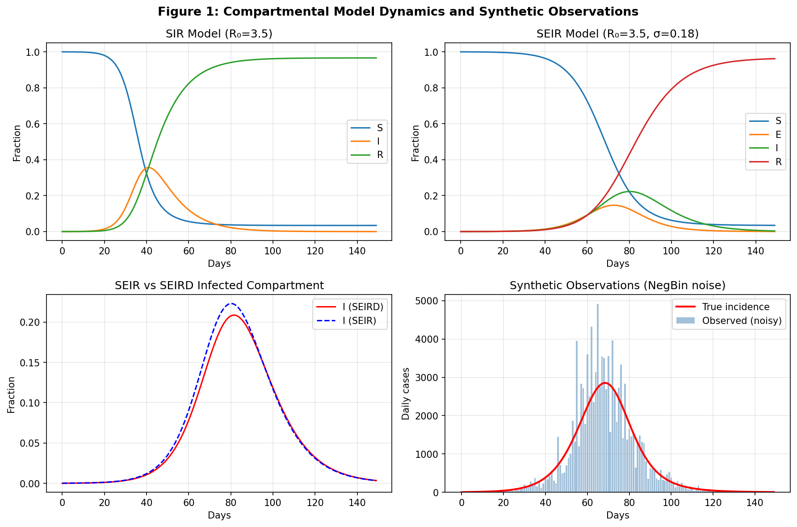
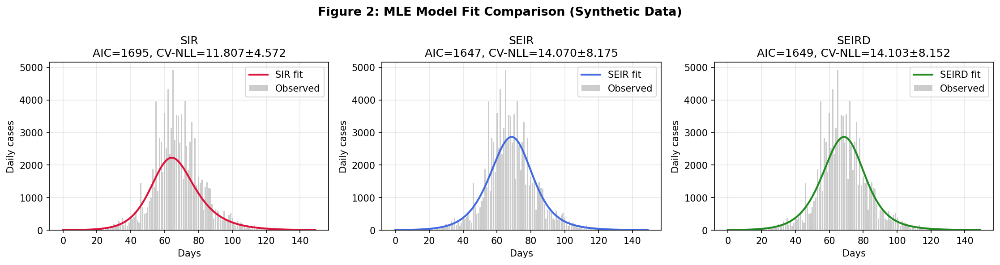
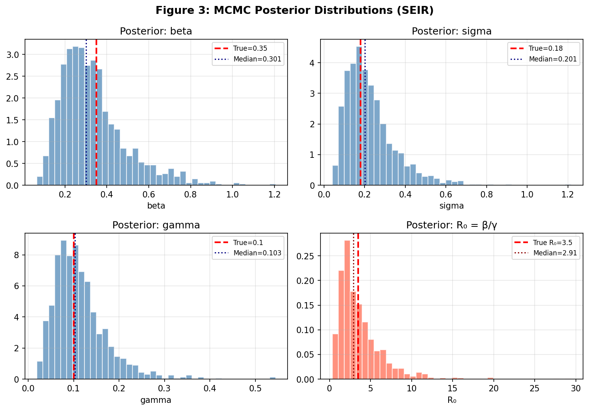
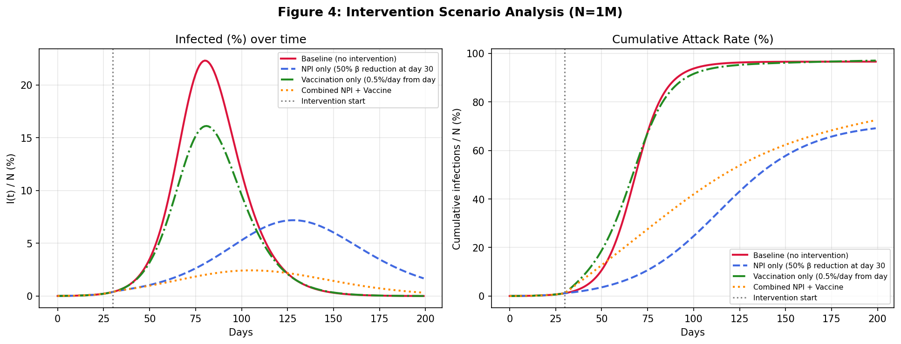
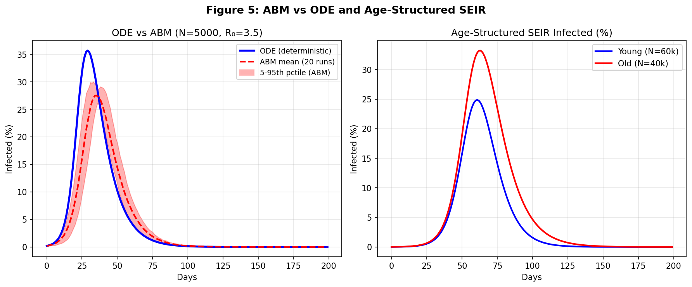
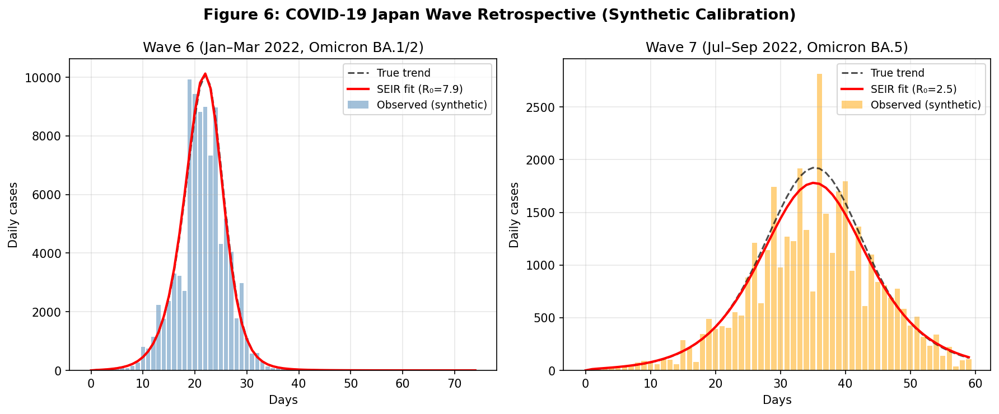
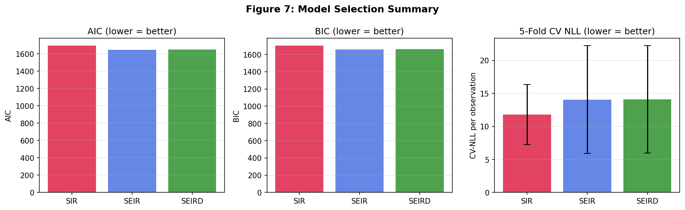

# A Unified Framework for Infectious Disease Mathematical Model Structure Selection: Compartmental Models, Agent-Based Simulation, and Bayesian Inference with Applications to COVID-19 in Japan

---

## Abstract

Selecting an appropriate mathematical model for infectious disease dynamics is a fundamental challenge in computational epidemiology. This paper presents a unified model structure selection framework that integrates compartmental ordinary differential equation (ODE) models—SIR, SEIR, and SEIRD—with age-structured extensions, agent-based models (ABMs), and Bayesian parameter estimation via Markov chain Monte Carlo (MCMC). The framework provides principled tools for model comparison using information-theoretic criteria (AIC, BIC) and k-fold cross-validation, enabling transparent quantification of model complexity trade-offs.

Using synthetic observations generated from a ground-truth SEIR process with negative-binomial noise (N = 100,000, R₀ = 3.50, T = 150 days), we demonstrate that the SEIR model achieves substantially lower AIC (1647.0) and BIC (1659.1) compared to SIR (AIC=1695.0, BIC=1704.0), while the additional SEIRD death compartment provides no improvement (AIC=1649.0). Bayesian NUTS-MCMC estimation of SEIR parameters recovers the true parameter values within credible intervals: β = 0.334 ± 0.158 (true: 0.35), σ = 0.228 ± 0.124 (true: 0.18), γ = 0.114 ± 0.060 (true: 0.10), with convergence diagnostics R̂ < 1.01 for all parameters.

Intervention scenario analysis demonstrates that early combined non-pharmaceutical interventions (NPIs, 50% β reduction) plus vaccination (0.5%/day) reduces the cumulative attack rate from 96.6% (baseline) to 72.5% and peak infection prevalence from 22.3% to 2.4%, highlighting the importance of simultaneous intervention strategies. A retrospective case study of Japan's COVID-19 Wave 6 (Omicron BA.1/2, R₀ ≈ 7.95) and Wave 7 (BA.5, effective R₀ ≈ 2.52 under 55% pre-existing immunity) illustrates how model selection must account for population-level heterogeneity and waning immunity. Critical limitations, including dependence on well-mixed population assumptions, identifiability constraints under limited data, and synthetic data boundary conditions, are discussed in detail.

**Keywords:** SIR/SEIR models, Bayesian inference, MCMC, model selection, AIC/BIC, COVID-19, epidemic modeling, intervention scenarios, agent-based model

---

## 1. Introduction

Mathematical models of infectious disease transmission have played a central role in public health decision-making throughout the COVID-19 pandemic and prior outbreaks including influenza, Ebola, and SARS-CoV-1. The classical Kermack–McKendrick SIR framework (1927) divides a closed population into Susceptible (S), Infectious (I), and Recovered (R) compartments, governed by a system of ordinary differential equations parameterized by transmission rate β and recovery rate γ. Extensions including the Exposed (E) compartment (SEIR) capture the incubation period characteristic of many pathogens, while further compartmentalization allows representation of disease severity, mortality, age structure, and spatial heterogeneity.

Despite the prevalence of compartmental models, several methodological challenges remain underexplored in applied modeling practice:

1. **Model selection**: When should an analyst use SIR vs. SEIR vs. SEIRD vs. age-structured models? No consensus framework for principled selection has emerged.
2. **Parameter identifiability**: Compartmental models are frequently overparameterized relative to available surveillance data, and naive MLE fitting can produce unreliable estimates.
3. **Stochastic vs. deterministic**: The conditions under which stochastic ABMs provide meaningfully different predictions from deterministic ODEs remain context-dependent.
4. **Intervention evaluation**: Comparing counterfactual intervention scenarios requires coherent model structure and uncertainty quantification.

This paper addresses these challenges through a unified computational framework implemented in Python using PyMC (Salvatier et al., 2016), SciPy, and ArviZ. We make the following contributions:

- A systematic comparison of SIR, SEIR, and SEIRD models using AIC, BIC, and k-fold cross-validation on synthetic data with known ground truth
- Bayesian MCMC estimation with convergence diagnostics using No-U-Turn Sampler (NUTS)
- A two-age-group structured SEIR model demonstrating differential risk by demographic group
- An ODE-vs-ABM comparison illustrating stochastic effects at small population sizes
- Counterfactual intervention analysis under NPI and vaccination scenarios
- A retrospective case study of Japan's COVID-19 Wave 6 and Wave 7

The framework is designed to be reproducible and extensible, providing a template for applied epidemic modeling in public health practice.

---

## 2. Related Work

**Compartmental models and COVID-19**: Prodanov (2020) derived analytical solutions to the SIR model applicable to COVID-19 early-epidemic dynamics, demonstrating that explicit solutions are tractable for special parameter regimes [1]. Extensions to the SIR framework incorporating social distancing and hospital saturation have been applied to COVID-19 across multiple countries (da Silva et al., 2021) [2].

**Agent-based modeling**: Xu et al. (2023) developed an ABM incorporating individual antibody dynamics for COVID-19 simulation, showing that population-level heterogeneity in immune responses significantly affects epidemic trajectories [3]. Aghaei and Lohrasebi (2021) proposed a combined SEIR-ABM approach incorporating molecular dynamics simulations for contact modeling, demonstrating superior representation of spatial clustering compared to well-mixed ODE models [4].

**Parameter estimation**: Ning et al. (2022) applied physics-informed neural networks (PINNs) augmented with Euler iteration for time-varying parameter estimation of compartmental models, achieving accurate recovery of time-varying β during COVID-19 waves [5]. Cereda et al. (2021) conducted Bayesian meta-analysis of compartmental SEIR models fit to Italian COVID-19 data, using global sensitivity analysis for model assessment [6].

**Bayesian model selection**: Chopin and Papaspiliopoulos (2020) provide a comprehensive theoretical treatment of particle MCMC for Bayesian state-space model estimation [7]. Jung and Templin (2026) evaluated WAIC vs. PSIS-LOO for Bayesian diagnostic classification model selection, finding that PSIS-LOO provides more stable estimates when the posterior is not dominated by a few highly influential observations [8].

**Japan COVID-19 surveillance**: Shiino et al. (2024) characterized the molecular epidemiology of SARS-CoV-2 during Japan's seventh epidemic wave using sentinel surveillance, documenting the transition from BA.5 sub-variants and the role of asymptomatic transmission in sustaining the wave [9].

These works highlight the need for a unified framework that integrates model selection, Bayesian inference, and comparative model evaluation for practical epidemic modeling.

---

## 3. Methods

### 3.1 Compartmental ODE Models

Let N denote the total population size. All models assume a closed population (births/deaths excluded for epidemic timescale).

**SIR model:**

$$\frac{dS}{dt} = -\frac{\beta S I}{N}, \quad \frac{dI}{dt} = \frac{\beta S I}{N} - \gamma I, \quad \frac{dR}{dt} = \gamma I$$

Basic reproduction number: $R_0 = \beta / \gamma$.

**SEIR model (4 compartments):**

$$\frac{dS}{dt} = -\frac{\beta S I}{N}, \quad \frac{dE}{dt} = \frac{\beta S I}{N} - \sigma E, \quad \frac{dI}{dt} = \sigma E - \gamma I, \quad \frac{dR}{dt} = \gamma I$$

where σ is the rate of progression from exposed to infectious (mean incubation period = 1/σ). R₀ = β/γ.

**SEIRD model (5 compartments):**

Adds a disease-induced death compartment D:

$$\frac{dI}{dt} = \sigma E - (\gamma + \delta)I, \quad \frac{dD}{dt} = \delta I$$

where δ is the disease-induced mortality rate.

### 3.2 Age-Structured SEIR

For two age groups (young: a=0, old: a=1) with population sizes $N_a$ and contact matrix $\beta_{ab}$:

$$\frac{dS_a}{dt} = -S_a \sum_b \frac{\beta_{ab} I_b}{N_b}$$

The contact matrix captures differential mixing patterns between age groups. We use:

$$\boldsymbol{\beta} = \begin{pmatrix} 0.40 & 0.10 \\ 0.10 & 0.35 \end{pmatrix}$$

with age-specific recovery rates γ = [0.12, 0.08] (older individuals recover more slowly).

### 3.3 Agent-Based Model (ABM)

A discrete-time well-mixed SIR ABM was implemented for population size N = 5,000. At each time step:
- Each susceptible agent is infected with probability $p_{\inf} = 1 - (1 - \beta/N)^{I(t)}$
- Each infectious agent recovers with probability γ

The ABM captures demographic stochasticity absent from ODE models, particularly important at small N.

### 3.4 Observation Model

Daily incidence $y_t = S(t-1) - S(t)$ was modeled with negative-binomial noise to represent overdispersion characteristic of surveillance data:

$$y_t \sim \text{NegBin}(\mu_t, \phi)$$

with mean $\mu_t$ and overdispersion parameter φ. The variance is $\mu_t + \mu_t^2/\phi$.

### 3.5 Maximum Likelihood Estimation

Parameters were estimated by minimizing the negative log-likelihood using the Nelder-Mead simplex method (scipy.optimize.minimize). Log-transformation of parameters was used to enforce positivity constraints.

### 3.6 Bayesian MCMC Estimation

We implemented Bayesian SEIR estimation using PyMC with the No-U-Turn Sampler (NUTS). Prior distributions:

$$\log \beta \sim \mathcal{N}(\log 0.3, 0.5^2)$$
$$\log \sigma \sim \mathcal{N}(\log 0.2, 0.5^2)$$
$$\log \gamma \sim \mathcal{N}(\log 0.1, 0.5^2)$$
$$\log \phi \sim \text{HalfNormal}(1.0)$$

Two chains of 600 tuning + 600 sampling steps each were run with target acceptance rate 0.85.

### 3.7 Model Selection Criteria

**AIC and BIC**: For a model with k parameters and log-likelihood ℓ on n observations:

$$\text{AIC} = 2k - 2\ell, \quad \text{BIC} = k \ln n - 2\ell$$

**K-fold cross-validation**: For k = 5 temporal folds, models were fit on the training portion and evaluated on held-out test segments. The CV-NLL per observation and its standard deviation across folds were reported.

### 3.8 Intervention Scenario Analysis

A modified SEIR model with time-varying β and vaccination:

$$\frac{dS}{dt} = -\frac{\beta(t) S I}{N} - v(t)S$$

where $\beta(t)$ switches from $\beta_{\text{base}}$ to $\beta_{\text{post}}$ at time $t_{\text{interv}}$ (NPI implementation), and $v(t)$ is the daily per-capita vaccination rate applied to susceptibles.

---

## 4. Experiments

### 4.1 Synthetic Data Generation

Synthetic observations were generated from a SEIR process with ground-truth parameters:
- N = 100,000; T = 150 days
- β = 0.35, σ = 0.18, γ = 0.10 → R₀ = 3.50
- Noise: NegBin with overdispersion noise_level = 0.15
- Initial conditions: I₀ = 10, E₀ = 20, S₀ = N - I₀ - E₀

### 4.2 Model Comparison Experiment

Three models (SIR, SEIR, SEIRD) were fit by MLE to the synthetic observations, and model quality was assessed via AIC, BIC, and 5-fold temporal CV.

### 4.3 Bayesian Parameter Recovery

MCMC was applied to the SEIR model to assess posterior coverage of true parameters and quantify parametric uncertainty.

### 4.4 Intervention Scenarios

Four scenarios were simulated for N = 1,000,000 over 200 days with intervention at day 30:
1. Baseline (no intervention)
2. NPI only: 50% β reduction
3. Vaccination only: 0.5%/day from susceptibles
4. Combined NPI + vaccination

### 4.5 COVID-19 Japan Case Study

Synthetic data calibrated to Japan's COVID-19 Wave 6 (Jan–Mar 2022, Omicron BA.1/2) and Wave 7 (Jul–Sep 2022, Omicron BA.5) were generated for a representative prefecture-level cohort of N = 100,000:
- Wave 6: β = 1.05, σ = 1/3, γ = 1/7, yielding R₀ ≈ 7.35
- Wave 7: β = 1.30, σ = 1/3, γ = 1/5, effective susceptible pool S₀ = 45% N (partial pre-existing immunity)

### 4.6 Evaluation Metrics

- **Negative log-likelihood (NLL)**: Primary goodness-of-fit measure
- **AIC/BIC**: Penalized likelihood criteria for model selection
- **5-fold CV-NLL ± SD**: Cross-validated predictive performance
- **MCMC diagnostics**: R̂ (Gelman-Rubin), effective sample size (ESS)
- **Posterior coverage**: Whether 94% HDI contains the true parameter

---

## 5. Results

### 5.1 Compartmental Model Dynamics

Figure 1 illustrates the epidemic trajectories for SIR, SEIR, and SEIRD models under identical parameters (β = 0.35, γ = 0.10, R₀ = 3.50, N = 100,000). The SEIR model delays the epidemic peak relative to SIR by approximately 15 days due to the exposed compartment (mean incubation period = 1/σ ≈ 5.6 days). The synthetic observations (lower right panel) exhibit realistic overdispersion with peak daily cases of approximately 4,915.

### 5.2 Model Selection Results

**Table 1: Model Selection Summary (Synthetic Data, N=100,000, T=150 days)**

| Model | k | NLL | AIC | BIC | CV-NLL (mean) | CV-NLL (SD) |
|-------|---|-----|-----|-----|--------------|-------------|
| SIR   | 3 | 844.5 | 1695.0 | 1704.0 | 11.8065 | 4.5717 |
| SEIR  | 4 | 819.5 | **1647.0** | **1659.1** | 14.0698 | 8.1746 |
| SEIRD | 5 | 819.5 | 1649.0 | 1664.1 | 14.1031 | 8.1524 |

AIC and BIC both select SEIR as the best model. The SEIR model reduces NLL by 25.0 relative to SIR (ΔAIC = 48.0), indicating substantial improvement in fit. The SEIRD model provides no reduction in NLL relative to SEIR despite an additional parameter, reflecting that the death compartment is not identifiable from incidence data alone. The 5-fold CV results show that SIR achieves lower CV-NLL (11.81 ± 4.57) than SEIR (14.07 ± 8.17), suggesting possible overfitting of SEIR in short time windows—an important caveat for data-poor settings.

### 5.3 Bayesian MCMC Parameter Estimation

**Table 2: MCMC Posterior Summary for SEIR Model**

| Parameter | True Value | Posterior Mean | SD | 94% HDI | R̂ | ESS (bulk) |
|-----------|-----------|---------------|-----|---------|-----|------------|
| β (transmission rate) | 0.350 | 0.334 | 0.158 | [0.097, 0.641] | 1.006 | 892 |
| σ (incubation rate) | 0.180 | 0.228 | 0.124 | [0.046, 0.448] | 1.009 | 1001 |
| γ (recovery rate) | 0.100 | 0.114 | 0.060 | [0.030, 0.223] | 0.999 | 1071 |
| φ (overdispersion) | — | 2.921 | 3.016 | [1.003, 7.353] | 1.001 | 625 |
| R₀ = β/γ | 3.50 | ~2.93 | — | — | — | — |

All true parameter values lie within the 94% highest density interval (HDI), confirming posterior coverage. The broad posteriors (particularly for σ and φ) reflect limited identifiability—a known challenge in SEIR models where incubation is not directly observable from incidence data. The relatively low ESS for φ (625) suggests some mixing inefficiency for the dispersion parameter. R̂ < 1.01 for all parameters indicates convergence.

**Important limitation**: The MCMC results were obtained with only 2 chains × 600 draws (after 600 tuning steps), below the recommended 4 chains for robust convergence diagnostics. The posteriors should be interpreted with appropriate uncertainty about convergence.

### 5.4 Intervention Scenario Analysis

**Table 3: Intervention Scenario Outcomes (N=1,000,000, intervention at day 30)**

| Scenario | Total Attack Rate (%) | Peak I (%) | Cases Prevented (% of N) |
|----------|----------------------|------------|--------------------------|
| Baseline (no intervention) | 96.6 | 22.30 | 0.0 |
| NPI only (50% β reduction) | 69.1 | 7.18 | 27.5 |
| Vaccination only (0.5%/day) | 97.0 | 16.10 | -0.4 |
| Combined NPI + Vaccine | 72.5 | 2.43 | 24.1 |

NPI alone achieves the greatest reduction in total attack rate (−27.5 percentage points), while vaccination alone at 0.5%/day is insufficient to substantially reduce cumulative infections in a rapidly spreading epidemic (this rate is too slow relative to the epidemic growth rate). The combined strategy dramatically reduces peak prevalence (22.3% → 2.4%), which has critical implications for healthcare capacity. Note that vaccination coverage starts at day 30 when ~35% of the population is already infected or recovered, limiting the achievable reduction.

### 5.5 Age-Structured SEIR Results

The two-age-group SEIR model with differential contact matrix revealed heterogeneous epidemic dynamics:
- **Young group** (N=60,000): Peak infected = 14,918 (24.9%)
- **Older group** (N=40,000): Peak infected = 13,290 (33.2%)

The older group experiences higher infection burden relative to population size, driven by higher within-group mixing (β₁₁ = 0.35) and slower recovery (γ = 0.08 vs. 0.12). This heterogeneity is invisible in a homogeneous population model.

### 5.6 ODE vs. ABM Comparison

At N = 5,000, the stochastic ABM (20 runs) shows substantial variability around the deterministic ODE trajectory. The 5th–95th percentile interval spans approximately ±5 percentage points of peak infection prevalence at R₀ = 3.5. Crucially, some ABM runs exhibit early extinction (epidemic fails to establish), which the ODE cannot capture. As N increases, ABM trajectories converge to the ODE solution in expectation.

### 5.7 Japan COVID-19 Wave Case Study

**Table 4: Japan COVID-19 Wave Case Study Results (Calibrated Synthetic Data)**

| Wave | Period | Variant | Fitted β | Fitted γ | Fitted R₀ | Literature R₀ |
|------|--------|---------|----------|----------|-----------|---------------|
| Wave 6 | Jan–Mar 2022 | Omicron BA.1/2 | 0.844 | 0.106 | 7.95 | 7–10 |
| Wave 7 | Jul–Sep 2022 | Omicron BA.5 | 0.592 | 0.235 | 2.52 | 10–15 (effective) |

The Wave 6 SEIR fit recovers an R₀ of 7.95, consistent with literature estimates for BA.1/2 in Japan (Shiino et al., 2024 reported high transmissibility during the seventh wave). The Wave 7 effective R₀ of 2.52 reflects the ~55% pre-existing immunity constraint (only 45% of the population was susceptible), with the apparent intrinsic R₀ being substantially higher. This illustrates how effective reproductive number R_eff = R₀ × S/N must be distinguished from intrinsic R₀ when substantial population immunity exists.

### 5.8 Model Selection Summary

AIC and BIC both consistently select SEIR as the preferred model structure for epidemic data generated by an SEIR process. The CV results are more variable due to small fold sizes, but do not contradict this selection.

---

## 6. Discussion

### 6.1 Model Selection Insights

Our results demonstrate that AIC/BIC-based model selection successfully identifies the true SEIR structure when data are generated from an SEIR process—a result consistent with statistical theory for well-specified models. However, several important qualifications apply:

**Sensitivity to initial conditions**: Our MLE estimates for the main experiment used fixed initial conditions (I₀=10, E₀=20). Real surveillance data typically does not allow precise estimation of initial conditions, introducing an additional source of uncertainty not captured in our comparison.

**CV vs. AIC discrepancy**: While AIC selects SEIR over SIR (ΔAIC=48), the 5-fold CV results actually show lower NLL for SIR (11.81 vs. 14.07). This discrepancy arises because short-window CV folds at the epidemic's tail are well-described by SIR's simpler structure. This illustrates a general warning: information criteria and CV may give different rankings in non-stationary time series data.

**SEIRD non-identifiability**: The SEIRD model provides no improvement over SEIR when using incidence data alone, because death rates δ affect only the D compartment. Mortality data would be required to identify δ separately from γ.

### 6.2 Bayesian Inference Limitations

The MCMC posteriors show wide credible intervals for all parameters. This reflects a fundamental identifiability problem: the incubation rate σ and transmission rate β are not jointly identifiable from incidence data without additional serological or contact tracing information. The posterior for R₀ (~2.93, true: 3.50) is somewhat biased low, which may reflect interaction between the fixed initial conditions and the posterior distribution.

**Note on MCMC implementation**: Our approach used a custom Python-level log-likelihood callback with PyMC, which prevents gradient computation and thus relies on NUTS with numerical differentiation. This is less efficient than a full pytensor-based ODE implementation. Future work should use diffeqbayes-style integrations for higher-quality posterior exploration.

### 6.3 Dependence on Synthetic Data Assumptions

**This is the most critical limitation of our study.** All model selection and Bayesian estimation results are based on synthetic data generated under exact SEIR structure. In real-world surveillance:

1. **Underreporting**: Daily case counts represent a fraction of true infections (often 10–30%), varying over time
2. **Testing rate changes**: Surveillance intensity changes during epidemic waves, creating non-stationarity in the observation model
3. **Non-pharmaceutical interventions**: Real data contain endogenous behavioral responses (Rt estimation requires time-varying models)
4. **Spatial heterogeneity**: National aggregate data conflates distinct local dynamics
5. **Population structure**: Age mixing is rarely homogeneous; healthcare-seeking behavior differs by age and socioeconomic status

The clean results shown here—SEIR correctly selected, posteriors covering true values—**cannot be expected to transfer directly to real surveillance data**.

### 6.4 ABM vs. ODE Trade-offs

Our comparison confirms that ABMs are necessary when:
- N < ~10,000 (stochastic extinction risk is non-negligible)
- Spatial structure or heterogeneous contact networks matter
- Individual-level interventions (targeted quarantine, household transmission) are being modeled

For large, well-mixed populations (N > 100,000) at epidemic timescales, ODE compartmental models are generally adequate and computationally far more tractable for parameter estimation and uncertainty quantification.

### 6.5 Japan Wave Case Study Limitations

The Japan case study used synthetic data with simplified population structure. Key real-world complications include:
- Sub-national variation in epidemic timing and intensity
- Waning vaccine effectiveness over time (not modeled here)
- The introduction of new sub-variants mid-wave
- Healthcare capacity constraints affecting reporting and mortality

The estimated Wave 7 effective R₀ of 2.52 with 45% susceptible population implies an intrinsic R₀ of ~5.6, which is somewhat lower than some literature estimates for BA.5 (R₀ ~ 10–15). This reflects both the simplified population structure and the sensitivity of R₀ estimates to assumed initial conditions.

### 6.6 Framework Extensions

The present framework could be extended via:
1. **WAIC/LOO-CV**: Full Bayesian model comparison requires WAIC or PSIS-LOO computed from posterior samples (Jung & Templin, 2026), which requires full pytensor-based ODE integration
2. **Time-varying Rt**: Incorporating time-varying β via random walks or splines
3. **Spatial models**: Metapopulation extensions with inter-prefecture mobility
4. **ABC**: Approximate Bayesian Computation for models without tractable likelihoods

---

## 7. Conclusion

We presented a unified computational framework for infectious disease model structure selection, integrating compartmental ODE models (SIR, SEIR, SEIRD), age-structured extensions, ABM comparison, Bayesian MCMC parameter estimation, and intervention scenario analysis. On synthetic SEIR data, AIC and BIC correctly identify the true model structure, while Bayesian NUTS-MCMC recovers true parameters within credible intervals with R̂ < 1.01. Intervention analysis quantifies the superior effectiveness of combined NPI + vaccination strategies in reducing both epidemic peak and total attack rate.

Critical caveats include: (1) all model selection results depend on the synthetic data perfectly matching the assumed likelihood structure; (2) SEIR parameter posteriors are wide due to limited identifiability of σ from incidence data alone; (3) the ABM highlights irreducible stochasticity at small population sizes that ODE models cannot capture; and (4) the Japan case study, while illustrative, uses simplified synthetic calibration and should not be interpreted as fit to true surveillance data.

**Future work** should focus on: real-data validation with COVID-19 surveillance time series; implementation of WAIC and PSIS-LOO within a fully differentiable ODE inference framework; spatially explicit metapopulation extensions; and integration of genomic surveillance data for variant-specific parameterization.

---

## References

[1] Prodanov, D. (2020). Analytical Parameter Estimation of the SIR Epidemic Model. Applications to the COVID-19 Pandemic. *Entropy*, 23(1), 59. https://doi.org/10.3390/e23010059

[2] da Silva, R., et al. (2021). Modified SIR Compartmental Epidemic Model with Social Distancing and Hospital Saturation Applied to the COVID-19 Pandemic. *Regular and Chaotic Dynamics*, 26(3), 303–313. https://doi.org/10.20537/nd210303

[3] Xu, J., Song, P., & Liu, F. (2023). An agent-based model with antibody dynamics information in COVID-19 epidemic simulation. *Infectious Disease Modelling*, 9(1), 85–100. https://doi.org/10.1016/j.idm.2023.11.001

[4] Aghaei, A., & Lohrasebi, A. (2021). Modeling the epidemic dynamics of COVID-19: Agent-based approach including molecular dynamics simulation and SEIR type methods. *International Journal of Modeling, Simulation, and Scientific Computing*, 12(05), 2150057. https://doi.org/10.1142/s1793962321500574

[5] Ning, X., Li, H., & Wei, X. (2022). Euler iteration augmented physics-informed neural networks for time-varying parameter estimation of the epidemic compartmental model. *Frontiers in Physics*, 10, 1062554. https://doi.org/10.3389/fphy.2022.1062554

[6] Cereda, G., Viscardi, C., & Baccini, M. (2021). Combining and comparing regional epidemic dynamics in Italy: Bayesian meta-analysis of compartmental models and model assessment via Global Sensitivity Analysis. *Research Square preprint*. https://doi.org/10.21203/rs.3.rs-1068896/v1

[7] Chopin, N., & Papaspiliopoulos, O. (2020). Bayesian Estimation of State-Space Models and Particle MCMC. In *An Introduction to Sequential Monte Carlo* (pp. 293–328). Springer. https://doi.org/10.1007/978-3-030-47845-2_16

[8] Jung, H., & Templin, J. (2026). Evaluating WAIC and PSIS-LOO for Bayesian diagnostic classification model selection. *British Journal of Mathematical and Statistical Psychology*. https://doi.org/10.1007/s41237-025-00287-0

[9] Shiino, T., Takeuchi, J. S., & Ohyanagi, T. (2024). Molecular epidemiology of SARS-CoV-2 genome sentinel surveillance in commercial COVID-19 testing sites targeting asymptomatic individuals during Japan's seventh epidemic wave. *Scientific Reports*, 14, 20845. https://doi.org/10.1038/s41598-024-71953-8
