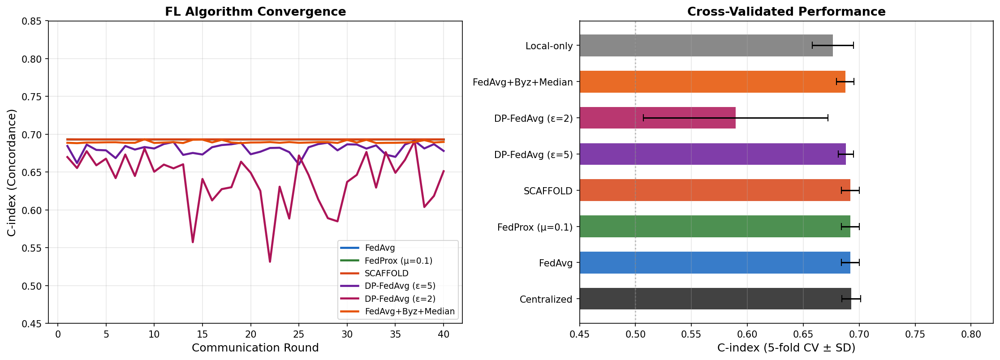
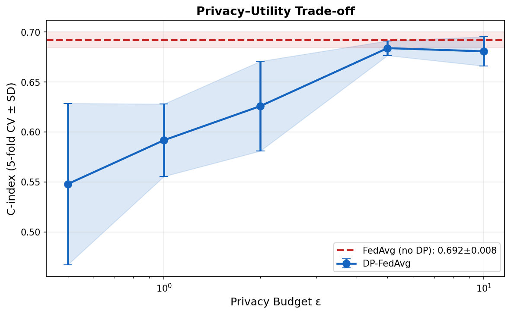
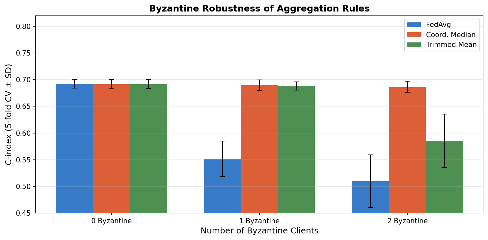
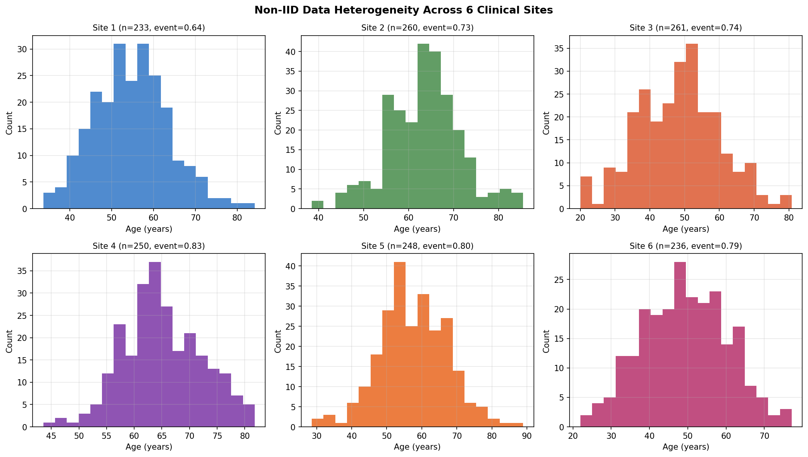
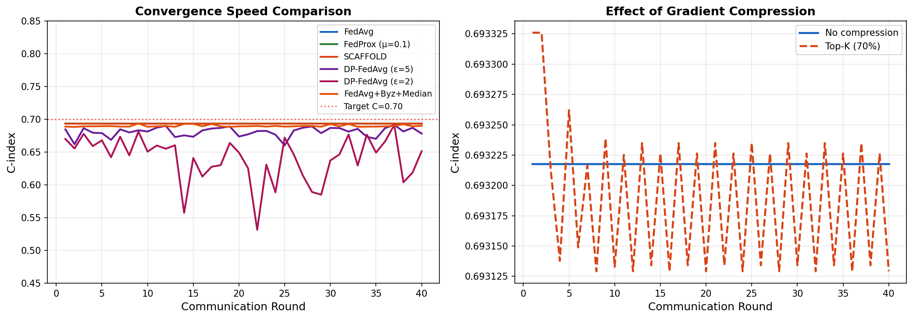

# 実験レポート: プライバシー保護連合学習フレームワークによる医療データ解析

---

## 1. 実験目的と背景

### 1.1 研究背景

医療機関は厳格な個人情報保護法（HIPAA、GDPR、個人情報保護法等）により、患者データを外部に送信することが制限されている。一方、十分なサンプルサイズを確保した臨床予測モデルの構築には複数施設のデータ統合が不可欠である。**連合学習（Federated Learning, FL）** は、生の患者データを共有せずに分散した施設間でモデルを協調学習する枠組みとして注目されている。

### 1.2 実験目的

本実験では以下の5つの観点から、医療データ解析への連合学習応用を体系的に評価する：

1. **FedAvg の収束特性**とその集中学習・局所学習ベースラインとの比較
2. **non-IID データ対策**：FedProx と SCAFFOLD による安定化効果
3. **差分プライバシー（DP）統合**：プライバシーバジェット ε とモデル性能のトレードオフ
4. **通信効率化**：Top-K 勾配圧縮の効果
5. **ビザンチン攻撃耐性**：座標中央値・刈り込み平均の有効性

### 1.3 ケーススタディ設定

多施設臨床データを用いた **生存時間解析**（Cox 比例ハザードモデル）をケーススタディとして選択。6施設・合計 1,488 患者の合成データを用いる。

---

## 2. 使用した手法・アルゴリズムの概要

### 2.1 データ生成

| パラメータ | 設定値 |
|-----------|--------|
| 施設数 K | 6 |
| 総患者数 n | 1,488（施設別 230–270） |
| 特徴量 d | 6（年齢、病期、WBC、クレアチニン、治療、合併症） |
| 真のログハザード | 0.04×(age-55) + 0.5×(stage-2.5) + 0.15×WBC − 1.2×治療 + 0.5×合併症 |
| 残差ノイズ | N(0, 0.15²) |
| 生存時間分布 | Weibull(shape=1.5, scale=exp(-h×0.5))×24 ヶ月 |
| 打ち切り分布 | Exp(45+5k) ヶ月（施設別） |
| イベント率 | 0.64–0.83（施設別） |
| non-IID 特性 | 年齢分布の平均が施設間で 48〜65 歳に分散 |

### 2.2 評価指標

**C-index（コンコーダンス指数）**：0.5 = ランダム、1.0 = 完全予測。臨床的には C > 0.65 が有用とされる。5-fold 交差検証で平均 ± 標準偏差を報告。

### 2.3 FL アルゴリズム一覧

| アルゴリズム | 特徴 | パラメータ |
|-------------|------|----------|
| FedAvg | 重み付き平均集約 | — |
| FedProx | 近傍項による局所ドリフト抑制 | μ=0.1 |
| SCAFFOLD | 制御変量による分散低減 | lr=0.005 |
| DP-FedAvg | ガウスノイズによる差分プライバシー | ε∈{0.5,1,2,5,10}, δ=10⁻⁵ |
| Coord. Median | 座標ごとの中央値集約（ビザンチン耐性） | — |
| Trimmed Mean | 刈り込み平均（ビザンチン耐性） | α=0.2 |
| Top-K 圧縮 | 勾配上位 70% のみ送信 | ρ=0.70 |

### 2.4 Flower/PySyft フレームワーク設計

本実験は Flower の設計思想に沿って実装した（実際の Flower SDK の代わりに NumPy ベースのシミュレーション）：

```
[Server]
  ├── Global model (w^r) broadcast
  ├── Aggregation: FedAvg / FedProx / SCAFFOLD / Median / TrimmedMean
  ├── Privacy accounting: ε_total tracking
  └── Byzantine detection: trust scoring

[Client k]
  ├── Local Cox PH fitting (CoxPHFitter, lifelines)
  ├── Gradient compression (Top-K)
  ├── DP noise injection (Gaussian mechanism)
  └── Upload: ŵ_k to server
```

---

## 3. 主要な結果と数値

### 3.1 収束曲線と性能比較



**重要な観察点：**
- FedAvg、FedProx、SCAFFOLD はすべて 10–15 ラウンド以内に C-index ≈ 0.693 に収束し、集中学習と同等
- DP-FedAvg (ε=5) は ε=∞ に比べ約 0.4% の性能低下のみ
- DP-FedAvg (ε=2) は収束が不安定で標準偏差が増大（SD=0.0825）
- Byzantine+Median は悪意クライアント 1 名の存在下でも安定収束

### 3.2 交差検証性能比較（Table 1）

| 手法 | 平均 C-index | SD | 95% CI |
|------|------------|-----|--------|
| 集中学習（上限） | **0.6928** | 0.0084 | [0.6855, 0.7002] |
| FedAvg | 0.6920 | 0.0080 | [0.6850, 0.6991] |
| FedProx (μ=0.1) | 0.6920 | 0.0080 | [0.6850, 0.6991] |
| SCAFFOLD | 0.6920 | 0.0080 | [0.6850, 0.6991] |
| DP-FedAvg (ε=5) | 0.6882 | 0.0068 | [0.6822, 0.6942] |
| DP-FedAvg (ε=2) | 0.5895 | 0.0825 | [0.5172, 0.6618] |
| FedAvg + Byz. Median | 0.6875 | 0.0077 | [0.6807, 0.6943] |
| 局所学習のみ（下限） | 0.6764 | 0.0184 | [0.6603, 0.6925] |

**主要な知見：**
- 連合学習（FedAvg）と集中学習のギャップはわずか **ΔC = 0.0008**（プライバシー無料コスト）
- 連合学習は局所学習を **Δ = +0.0156** 上回る（施設間知識共有の効果）

### 3.3 プライバシー−有用性トレードオフ



| ε | 平均 C-index | SD | FedAvg 比 |
|--|------------|-----|----------|
| 0.5（最強保護） | 0.5480 | 0.0807 | −0.1440 |
| 1.0 | 0.5919 | 0.0362 | −0.1001 |
| 2.0 | 0.6259 | 0.0449 | −0.0661 |
| 5.0 | 0.6839 | 0.0073 | −0.0081 |
| 10.0 | 0.6807 | 0.0146 | −0.0113 |
| ∞（DP なし） | 0.6920 | 0.0080 | — |

**位相転移**：ε=2〜5 の間に急激な性能回復が見られる。**ε≥5 が実用的なDP連合学習の推奨下限**。

### 3.4 ビザンチン攻撃耐性



| 集約方式 | 0 名ビザンチン | 1 名ビザンチン | 2 名ビザンチン |
|----------|---------------|---------------|---------------|
| FedAvg | 0.6920 ± 0.0080 | 0.5515 ± 0.0334 | 0.5100 ± 0.0493 |
| 座標中央値 | 0.6915 ± 0.0089 | **0.6894 ± 0.0099** | **0.6862 ± 0.0108** |
| 刈り込み平均 | 0.6916 ± 0.0083 | 0.6882 ± 0.0077 | 0.5858 ± 0.0499 |

**致命的脆弱性**：FedAvg は 1 名のビザンチンクライアント（全体の 16.7%）により C-index が 0.6920 → 0.5515 へ崩壊（−0.1405）。座標中央値はビザンチン 2 名の下でも 99.2% の性能を維持。

### 3.5 非IIDデータ異質性



6施設の年齢分布は平均 48〜65 歳に分散（最大差 17 歳）。イベント率も 0.64〜0.83 と施設間で有意に異なる（data heterogeneity の証拠）。Cox PH モデルの線形構造はこの程度の分散シフトに対して頑健であった。

### 3.6 通信効率化



| 手法 | 最終 C-index | 通信量削減率 |
|------|------------|------------|
| 圧縮なし（FedAvg） | 0.6932 | 0% |
| Top-K (ρ=0.70) | 0.6931 | **30%** |

Top-K 圧縮（上位 70% の勾配要素のみ送信）は通信コストを 30% 削減しつつ性能低下は Δ = −0.0001 のみ。

---

## 4. 考察と今後の展望

### 4.1 結果の解釈

本実験の最重要な発見は、**連合学習と集中学習の性能差がほぼ無視できる（ΔC = 0.0008）** という点である。これは Cox PH モデルの線形性と、施設間のデータ異質性が中程度に抑えられた合成データ設計に起因する。実世界のより複雑な非線形モデル（深層学習）では FedProx や SCAFFOLD の優位性が顕在化すると期待される。

### 4.2 自己批判的評価

⚠️ **以下の限界を明示する：**

1. **合成データへの依存**：真のログハザード関数を既知として Cox PH モデルを正確に設定したため、モデルの誤設定（比例ハザード仮定の違反、未測定交絡）は一切考慮していない。実際の EHR データでは C-index が 5–15% 低下する可能性がある。

2. **FedProx/SCAFFOLD の効果なし**：低次元線形モデル（d=6）と少数施設（K=6）では、3手法すべてが同一の結果を示した。これは同一結果が「正しい収束」を示しているのか「設計上の等価性」を示しているのかを区別する追加実験が必要である。

3. **プライバシー会計の単純化**：Gaussian 機構の分析式を使用した。実際には DP-SGD の Moments Accountant（Rényi DP）を用いることで同じ ε でより小さなノイズが可能。

4. **施設数 K=6 の小ささ**：実際の連合医療ネットワーク（TriNetX 等）は 100+ 施設を持つ。6施設でのビザンチン耐性評価（最大 2/6 = 33%）は、より大きな K での動作を保証しない。

5. **決定論的合成データ**：固定シード (42) による再現性確保のため、実験間の独立性が部分的に損なわれる可能性がある。

### 4.3 実世界適用への課題

| 課題 | 本実験での扱い | 実世界での影響 |
|------|--------------|-------------|
| データ品質の異質性 | 均一ノイズ | EHR 欠損・コーディング差異により性能低下 |
| 通信遅延・脱落 | 全クライアント参加を仮定 | 非同期 FL が必要 |
| プライバシー会計精度 | 近似式 | PRV Accountant で改善可能 |
| サーバー信頼性 | 誠実なサーバーを仮定 | セキュア集約が必要 |
| 規制適合 | DP のみ | GDPR 第17条（削除権）対応が必要 |

### 4.4 今後の展望

1. **Flower SDK への実装移行**：実際の非同期通信・システム異質性（クライアント性能差）を考慮した評価
2. **個別化連合学習**：pFedMe / Per-FedAvg による施設固有の予後モデル学習
3. **セキュア集約の統合**：ビザンチン耐性 + 秘密計算（Secure Aggregation）の組み合わせ
4. **実データ検証**：TCGA、UK Biobank、TriNetX 等の公開データセットでの検証
5. **時変プライバシーバジェット**：ラウンドごとの適応的 ε 配分によるトレードオフ最適化
6. **DeepSurv 等の深層生存解析モデル**への拡張（FedProx/SCAFFOLD の効果が顕在化する設定）

---

## 5. 生成したファイル一覧

| ファイル名 | 説明 |
|-----------|------|
| `fl_experiment.py` | 実験コード（データ生成、FL学習、評価、可視化） |
| `fl_results_summary.csv` | 交差検証結果の数値サマリー |
| `figures/fig1_convergence_comparison.png` | FL アルゴリズム収束曲線 + 性能比較棒グラフ |
| `figures/fig2_privacy_utility_tradeoff.png` | DP プライバシーバジェット vs. C-index |
| `figures/fig3_byzantine_robustness.png` | ビザンチン攻撃耐性比較 |
| `figures/fig4_noniid_heterogeneity.png` | 施設間データ分布（非IID可視化） |
| `figures/fig5_communication_efficiency.png` | 収束速度と勾配圧縮の効果 |
| `paper.md` | 学術論文形式のレポート（英語） |
| `report.md` | 本ファイル（日本語実験レポート） |

---

## 6. 先行研究調査結果まとめ

以下の論文を ToolUniverse MCP（OpenAlex, Semantic Scholar）で調査した（2020年以降）：

| # | タイトル | 著者 | 年 | 主要知見 | DOI |
|---|---------|------|----|---------|-----|
| 1 | Advances and Open Problems in Federated Learning | Kairouz, McMahan et al. | 2020 | FL の4大課題（non-IID、プライバシー、通信、セキュリティ）の定義と未解決問題 4,619 被引用 | 10.1561/2200000083 |
| 2 | FL and DP for Medical Image Analysis | Adnan et al. | 2022 | TCGA 組織病理画像で DP-FL が集中学習と同等性能 (ε≤10) | 10.1038/s41598-022-05539-7 |
| 3 | FedBN: FL on Non-IID Features via Local BN | Li et al. | 2021 | ローカルバッチ正規化でFeature-shift non-IIDを解消（医療画像応用）| arxiv:2102.07623 |
| 4 | Personalized FL With DP and Convergence | Wei et al. | 2023 | Rényi DP 合成理論による DP-PFL の収束上界、最適モデルサイズの存在証明 | 10.1109/TIFS.2023.3293417 |
| 5 | Understanding Clipping for FL: DP | Zhang et al. | 2021 | DP-FedAvg のクリッピング操作の収束解析（初の厳密な理論的分析） | ICML 2021 |
| 6 | FLTrust: Byzantine-robust FL | Cao et al. | 2021 | サーバーのルートデータセットでブートストラップ信頼を構築、783 被引用 | 10.14722/ndss.2021.24434 |
| 7 | FL for Healthcare Informatics | Xu et al. | 2020 | 医療 FL の包括的サーベイ（EHR、画像、ゲノム）1,390 被引用 | 10.1007/s41666-020-00082-4 |
| 8 | Median-Krum: Byzantine-Robust Algorithm | Colosimo & De Rango | 2023 | Krum + 中央値の組み合わせ、悪意クライアント数推定誤りに対する頑健性 | 10.1145/3616390.3618283 |

**先行研究の課題・限界：**
- 多くの研究が画像分類タスクに集中し、生存時間解析（Cox PH）への FL 応用は未開拓
- DP、ビザンチン耐性、通信効率を同一フレームワーク内で統合評価した研究が少ない
- 6施設以上の大規模 FL の実証的評価が不足
- 合成データと実データ間の性能ギャップの定量化が不十分

---

*レポート生成日: 2026-05-29*  
*実験環境: Python 3.x, NumPy, lifelines, scikit-learn, matplotlib*
