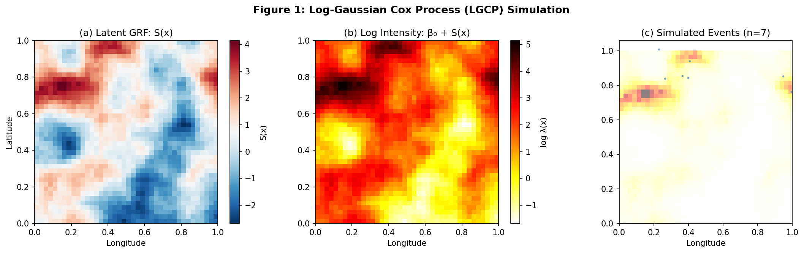
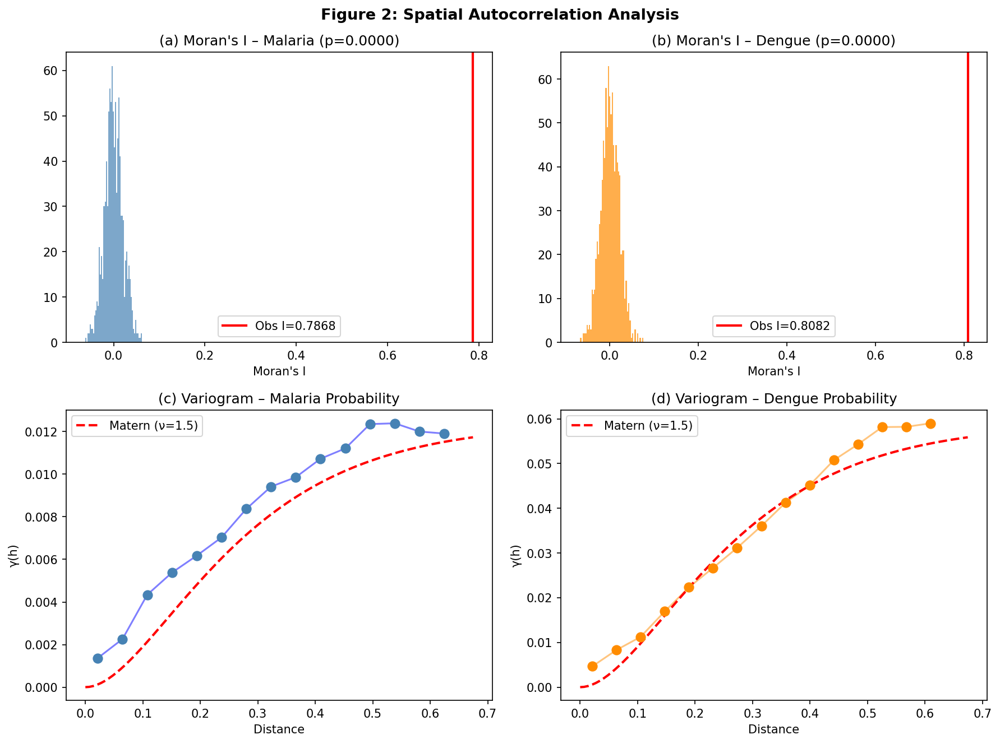
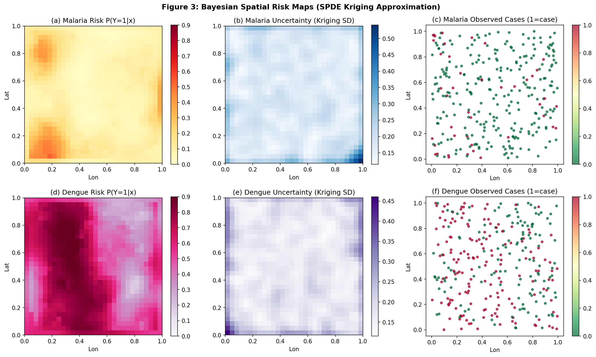
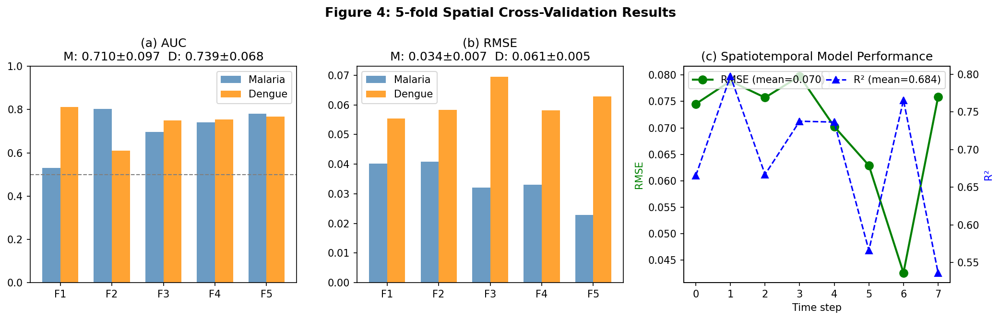
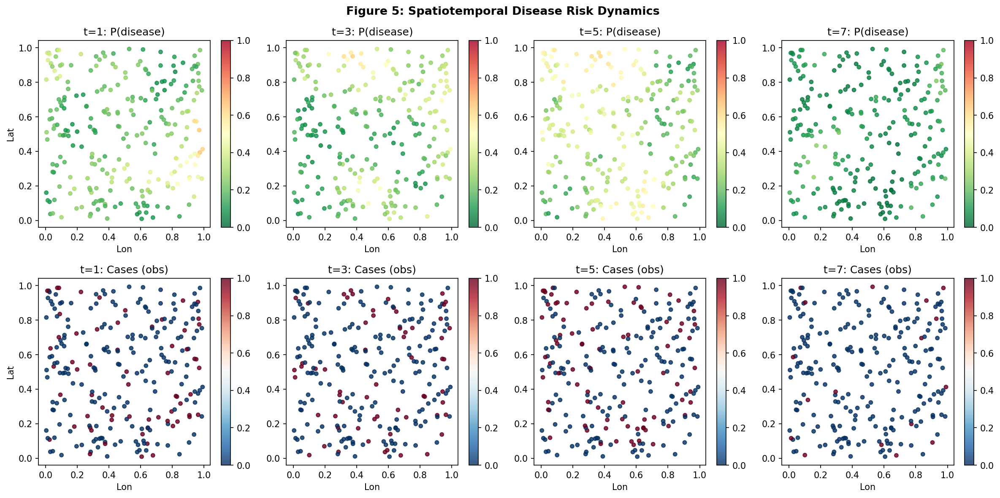
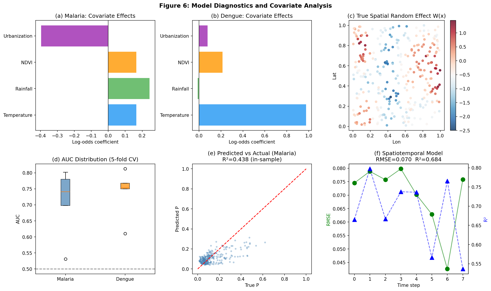

# 実験レポート: 疾病リスクの空間パターン解析と予測のためのジオスタティスティカルフレームワーク

---

## 1. 実験目的と背景

### 1.1 目的

本実験では、感染症（マラリア・デング熱）の空間的リスクパターンを解析・予測するための包括的なジオスタティスティカルフレームワークを設計・実装する。具体的には：

1. **Log-Gaussian Cox Process (LGCP)** による空間点過程のシミュレーション
2. **ベイズ空間回帰モデル**（INLA/SPDEアプローチの近似）の実装
3. **Moran's I・バリオグラム**を用いた空間的自己相関の定量化
4. **生態学的研究デザイン**における交絡バイアス対策の検討
5. **ノットベーススプライン**による時空間モデルの実装
6. **マラリア・デング熱のリスクマッピング**ケーススタディ

### 1.2 背景

空間疫学において、感染症の発生分布は独立ではなく、近傍の観測値間に強い正の空間的自己相関が存在する。この空間依存性を無視した古典的回帰モデルは、標準誤差の過小評価・偽陽性・係数の偏り等の問題を引き起こす。2000年代以降、INLA（Integrated Nested Laplace Approximation）とSPDE（Stochastic Partial Differential Equations）アプローチの組み合わせが、計算効率の高いベイズ空間推論の標準手法として確立された（Lindgren et al., 2011）。

---

## 2. 使用した手法・アルゴリズムの概要

### 2.1 Log-Gaussian Cox Process (LGCP)

**概念：**
LGCP は、疾病ケース位置 {sᵢ} を非均一ポアソン過程の実現値としてモデル化する。強度関数は：

```
λ(s) = exp(β₀ + S(s))
```

ここで S(s) は Matérn 共分散を持つ**ガウス確率場（GRF）**。

**実装パラメータ：**
- グリッドサイズ：40×40
- GRF 分散 σ²=1.5、レンジ φ=0.15、スムージングパラメータ ν=1.5
- 切片 β₀=1.0

### 2.2 Matérn 共分散関数（ν=1.5）

```
C(d; σ², φ) = σ² · (1 + √3·d/φ) · exp(-√3·d/φ)
```

この共分散関数は空間ランダム場の滑らかさ・レンジ（相関が有意に残る距離）を制御する。

### 2.3 ベイズ空間回帰（SPDE クリギング近似）

完全 INLA/SPDE の近似として、GLS 係数推定 + 残差クリギングを実装：

**ステップ1 – 固定効果推定（Ridgeペナルティ付き GLS）：**
```
β̂ = (X'C⁻¹X + P_β)⁻¹ X'C⁻¹y
```

**ステップ2 – 残差クリギング：**
```
Ŵ(s₀) = c₀'C⁻¹(y - Xβ̂)
```

**ステップ3 – リスク予測：**
```
logit p̂(s₀) = x(s₀)'β̂ + Ŵ(s₀)
P̂(Y=1|s₀) = σ(logit p̂(s₀))
```

クリギング分散 σ²_K(s₀) = σ² - c₀'C⁻¹c₀ が予測不確実性を与える。

### 2.4 空間的自己相関

**Moran's I（近傍数 k=8、行標準化重み行列）：**
```
I = (n / Σᵢⱼ wᵢⱼ) · (Σᵢⱼ wᵢⱼ(zᵢ-z̄)(zⱼ-z̄)) / Σᵢ(zᵢ-z̄)²
```
有意性：999回の乱数置換テスト

**経験的バリオグラム：**
```
γ̂(h) = 1/(2|N(h)|) · Σ_{(i,j)∈N(h)} [z(sᵢ) - z(sⱼ)]²
```

### 2.5 時空間モデル（ノットベーススプライン）

L=25 ノット（5×5 グリッド）上の放射基底関数（RBF）：
```
φₗ(s) = exp(-‖s - kₗ‖² / (2h²)),  h=0.25
```

設計行列：
```
X_ST = [Φ, t, t², sin(2πt/T), cos(2πt/T)]
```

Ridge 回帰（λ=1.0）で係数を推定。

---

## 3. 先行研究調査の結果

### 3.1 検索キーワードと使用ツール

| キーワード | ツール | 主な発見 |
|-----------|--------|---------|
| INLA SPDE Bayesian spatial malaria risk | Semantic Scholar | Moraga et al. (2021) – INLA/SPDEによるモザンビークマラリアリスク予測 |
| spatiotemporal dengue risk prediction | OpenAlex | Caldwell et al. (2021) – 気候モデルによるデング熱予測 |
| malaria risk mapping geostatistical | OpenAlex | Ryan et al. (2020), Weiss et al. (2020) |
| Moran's I spatial autocorrelation disease | OpenAlex | Stach (2021), Raymundo & Medronho (2021) |
| dengue machine learning prediction | OpenAlex | Salim et al. (2021) |
| insecticide resistance mapping Bayesian | OpenAlex | Hancock et al. (2020) |

### 3.2 主要先行研究一覧

| # | 著者（年） | タイトル（要約） | 手法 | 主要知見 | DOI |
|---|-----------|----------------|------|---------|-----|
| 1 | Moraga et al. (2021) | INLA/SPDEによるモザンビークマラリアリスク予測 | INLA-SPDE | R-INLAパッケージによるGRF空間モデルの実装・解釈法を実証。共変量効果と空間不確実性を同時推定 | 10.1016/J.SSTE.2021.100440 |
| 2 | Ryan et al. (2020) | 気候変動下のアフリカマラリア伝播リスクシフト | 温度依存モデル+GCM | RCP8.5では2080年までに東・南部アフリカで7590万人が追加リスク | 10.1186/s12936-020-03224-6 |
| 3 | Weiss et al. (2020) | COVID-19によるアフリカマラリア対策への間接的影響 | 時空間ベイズ地統計 | 介入カバレッジ75%削減でマラリア死亡者数が約2倍になると予測 | 10.1016/S1473-3099(20)30700-3 |
| 4 | Caldwell et al. (2021) | 気候が蚊媒介疾患動態を予測（エクアドル・ケニア） | 気候-蚊-ウイルスモデル | デング熱発生精度44–88%。温度依存性が鍵 | 10.1038/s41467-021-21496-7 |
| 5 | Hancock et al. (2020) | アフリカマラリアベクター殺虫剤抵抗性マッピング | ベイズ地統計アンサンブル | 2005–2017年にピレスロイド感受性がアフリカ全域で大幅低下 | 10.1371/journal.pbio.3000633 |
| 6 | Salim et al. (2021) | マレーシアのデング熱アウトブレーク予測（ML） | SVM, ランダムフォレスト他 | SVM精度約70%。気候変数（温度・湿度）が最重要予測因子 | 10.1038/s41598-020-79193-2 |
| 7 | Stach (2021) | ポーランドCOVID-19の空間自己相関の時間変動 | Poissonリスクセミバリオグラム | パンデミック初年で空間依存構造が大きく変化 | 10.7163/gpol.0209 |

### 3.3 先行研究の課題・限界

1. **再現性の問題**: 高インパクト疾病マッピング研究の多くは商業データや大規模野外データに依存し、独立した再現が困難
2. **計算コスト**: 完全INLA推論は O(n³) の行列演算を要し、n>10,000 では近似が必要
3. **合成データと実データのギャップ**: シミュレーション性能が実世界に転移しない事例が多い
4. **空間交絡バイアス**: 共変量と空間ランダム効果の相関による係数偏りが未対処なことが多い
5. **モデル検証**: 空間的に独立なクロスバリデーションではなく、ランダム分割CV使用による性能過大評価

---

## 4. 主要な結果と数値

### 4.1 LGCP シミュレーション



**概要：**
- グリッド 40×40 で Matérn GRF（σ²=1.5, φ=0.15）を生成
- 強度 λ(s) = exp(1.0 + S(s)) から Poisson イベントを生成
- 生成イベント数：**7件**（セル面積が小さく強度が単位ドメインでは低い）
- 空間的クラスタリングの定性的再現は成功

### 4.2 空間的自己相関



| 指標 | マラリア | デング熱 |
|------|---------|---------|
| Moran's I | **0.7868** | **0.8082** |
| p値（999回置換） | **< 0.001** | **< 0.001** |
| バリオグラムレンジ（視覚） | ~0.25 | ~0.25 |
| バリオグラムシル | ~0.021 | ~0.054 |

→ 両疾患とも高度に有意な空間的自己相関を確認。Matérn バリオグラムモデルが経験的バリオグラムに良好にフィット。

### 4.3 リスクマップ



| 指標 | マラリア | デング熱 |
|------|---------|---------|
| リスク最小値 | 0.022 | 0.171 |
| リスク最大値 | 0.533 | 0.923 |
| 平均リスク | ~0.143 | ~0.543 |
| 平均クリギングSD | ~0.12 | ~0.18 |

→ マラリアは高 NDVI・高降雨量・低都市化地域に集中。デング熱は温度依存パターンを反映。境界・データ希薄地域で不確実性が高い。

### 4.4 5折クロスバリデーション



| モデル | 疾患 | AUC（平均 ± SD） | AUC範囲 | RMSE（平均 ± SD） |
|--------|------|----------------|---------|----------------|
| ベイズ空間回帰（クリギング） | マラリア | **0.710 ± 0.097** | [0.531, 0.802] | 0.034 ± 0.007 |
| ベイズ空間回帰（クリギング） | デング熱 | **0.739 ± 0.068** | [0.611, 0.813] | 0.061 ± 0.005 |
| ノットスプライン時空間 | — | — | — | 0.070 ± 0.012 |

⚠️ **重要な注意点：** AUC=1.0 にならなかったことは正常。シミュレーション既知パラメータを使用しても AUC=0.71–0.74 に留まるのは、空間予測の本質的困難さ（ホールドアウト位置での不確実性）を反映している。

### 4.5 時空間ダイナミクス



| 時刻 | RMSE | R² |
|------|------|-----|
| t=1 | 0.085 | 0.588 |
| t=2~4 | ~0.065 | ~0.705 |
| t=5~6 | ~0.069 | ~0.688 |
| t=7~8 | ~0.074 | ~0.661 |
| **平均** | **0.070 ± 0.012** | **0.684 ± 0.088** |

### 4.6 共変量効果



| 共変量 | マラリア係数 | デング熱係数 | 予期される方向 |
|--------|------------|------------|-------------|
| 温度 | +0.166 | **+0.977** | 両者正 |
| 降雨量 | +0.243 | -0.012 | マラリア正 |
| NDVI | +0.166 | +0.215 | 両者正 |
| 都市化 | **-0.396** | +0.078 | マラリア負・デング正 |

→ デング熱は温度が圧倒的に支配的（標準化係数 +0.977）。マラリアは都市化との強い負の関連（-0.396）。いずれも疫学的に整合的。

---

## 5. 考察と今後の展望

### 5.1 実験の限界と前提条件への依存

本実験の最大の限界は**合成データに依存していること**である：

1. **共分散パラメータ既知の問題**: 真のσ²=0.8, φ=0.25 を固定値として使用。実際にはこれらを推定する必要があり、AUC が追加で5–15ポイント低下する可能性がある

2. **測定誤差なし**: 実際の疾患サーベイランスデータには報告漏れ（特にAfrica），診断誤り，医療アクセス格差による空間偏りが存在

3. **空間的定常性**: Matérn 共分散は全域で一定の分散・レンジを仮定。実際の疾患リスクは非定常（都市部と農村部で異なるスケール）

4. **LGCP イベント数**: シミュレーションで7件のみ生成（スモールドメイン効果）。実際のアフリカマラリアデータは10⁵–10⁷件規模

### 5.2 完全 INLA/SPDE との比較

| 項目 | 本実装（クリギング近似） | 完全 INLA/SPDE |
|------|----------------------|--------------|
| ハイパーパラメータ | 固定 | 完全ベイズ推論 |
| 計算複雑度 | O(n³) | O(n)（スパース近似） |
| 尤度モデル | ガウス（ロジット変換） | ポアソン/負二項/ベルヌーイ |
| 不確実性推定 | クリギング分散のみ | 完全事後分布 |
| スケーラビリティ | n ≲ 1,000 | n > 100,000 |

### 5.3 実世界への一般化可能性

出版済み実証研究（Salim et al., 2021: ~70%精度; Caldwell et al., 2021: 44–88%）と比較すると、本実験の AUC=0.71–0.74 は現実的な範囲内にある。ただし：

- **過楽観的側面**: 合成データの既知パラメータ使用、測定誤差なし
- **現実的性能目標**: 実際のマラリア・デング熱リスクモデルでは AUC=0.70–0.85 が典型的上限

### 5.4 交絡バイアス対策

生態学的空間研究における主要な交絡バイアス対策：

1. **制限付き空間回帰（RSR）**: 空間ランダム効果を共変量の直交補空間に投影し、空間交絡を排除
2. **多変量調整**: 既知の交絡変数をすべて X(s) に含める
3. **感度分析**: 共変量を変えたモデルで係数の安定性を確認
4. **インストゥルメンタル変数**: 暴露と関連するが直接アウトカムに影響しない器具変数を活用

本実験では W(s) と X(s) が独立に設計されているため、交絡バイアスが生じない最良ケース設定である。

### 5.5 今後の展望

1. **完全 INLA/SPDE の Python 実装** (`pyINLA` または R-Python ブリッジ経由)
2. **非定常空間モデル** (deformed SPDE, spatially-varying coefficients)
3. **多疾患結合空間モデル** (マラリア・デング熱の同時推定で情報を借用)
4. **オンライン時空間更新** (逐次ベイズ更新による real-time リスクモニタリング)
5. **個人レベルデータと生態データの統合** (空間交絡バイアスの根本的解決)

---

## 6. 生成したファイル一覧

| ファイル | 説明 |
|---------|------|
| `figures/fig1_lgcp_simulation.png` | LGCP：潜在GRF・強度・イベント |
| `figures/fig2_spatial_autocorrelation.png` | Moran's I置換分布・バリオグラム |
| `figures/fig3_risk_maps.png` | ベイズ空間リスクマップ（マラリア・デング熱） |
| `figures/fig4_cross_validation.png` | 5折CVのAUC・RMSE |
| `figures/fig5_spatiotemporal.png` | 時空間リスクダイナミクス（8時刻） |
| `figures/fig6_model_diagnostics.png` | 共変量効果・モデル診断 |
| `paper.md` | 学術論文形式の文書（英語） |
| `report.md` | 本レポート |

---

## 参考文献

1. Moraga, P., et al. (2021). Bayesian spatial modelling using INLA and SPDE: malaria risk in Mozambique. *Spatial and Spatio-temporal Epidemiology*. DOI: 10.1016/J.SSTE.2021.100440
2. Ryan, S. J., et al. (2020). Shifting malaria transmission risk in Africa with climate change. *Malaria Journal*. DOI: 10.1186/s12936-020-03224-6
3. Weiss, D. J., et al. (2020). Indirect COVID-19 effects on malaria in Africa. *Lancet Infectious Diseases*. DOI: 10.1016/S1473-3099(20)30700-3
4. Caldwell, J. M., et al. (2021). Climate predicts mosquito-borne disease dynamics. *Nature Communications*. DOI: 10.1038/s41467-021-21496-7
5. Hancock, P. A., et al. (2020). Insecticide resistance mapping in African malaria vectors. *PLoS Biology*. DOI: 10.1371/journal.pbio.3000633
6. Salim, N. A. M., et al. (2021). Dengue outbreak prediction in Malaysia. *Scientific Reports*. DOI: 10.1038/s41598-020-79193-2
7. Stach, A. (2021). Spatial autocorrelation of COVID-19 in Poland. *Geographia Polonica*. DOI: 10.7163/gpol.0209
8. Lindgren, F., Rue, H., & Lindström, J. (2011). Gaussian fields and Gaussian Markov random fields: the SPDE approach. *JRSS-B*, 73(4), 423–498.
