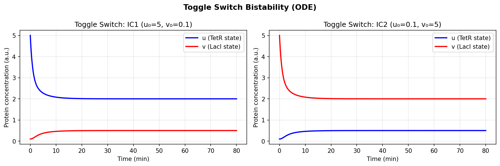
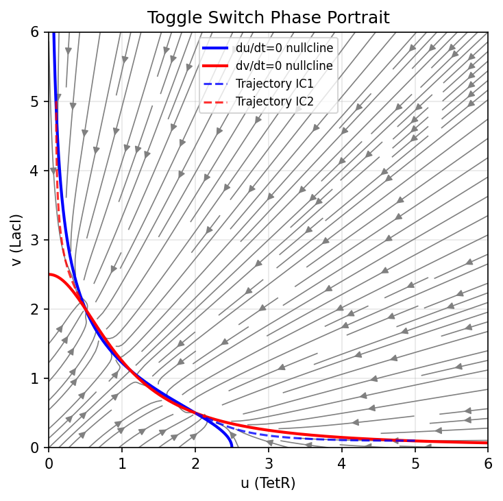
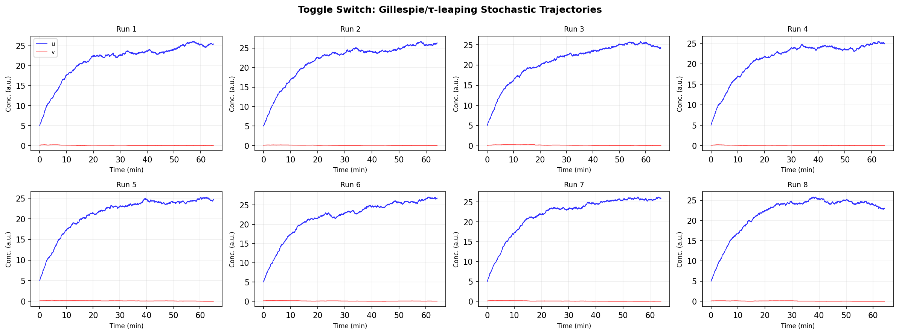
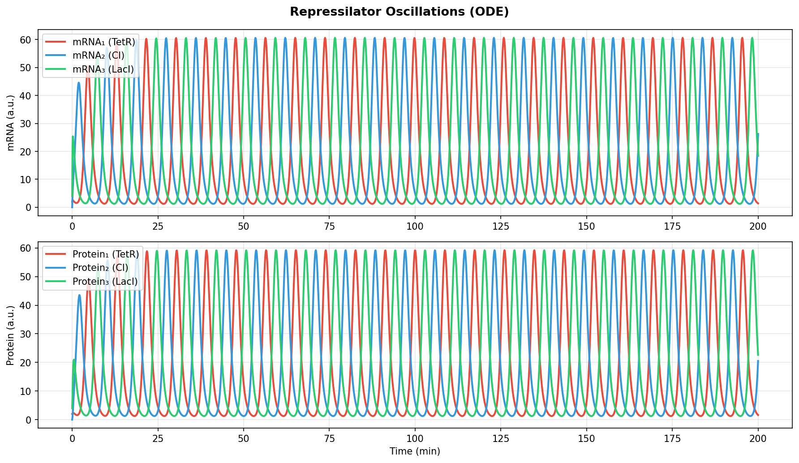
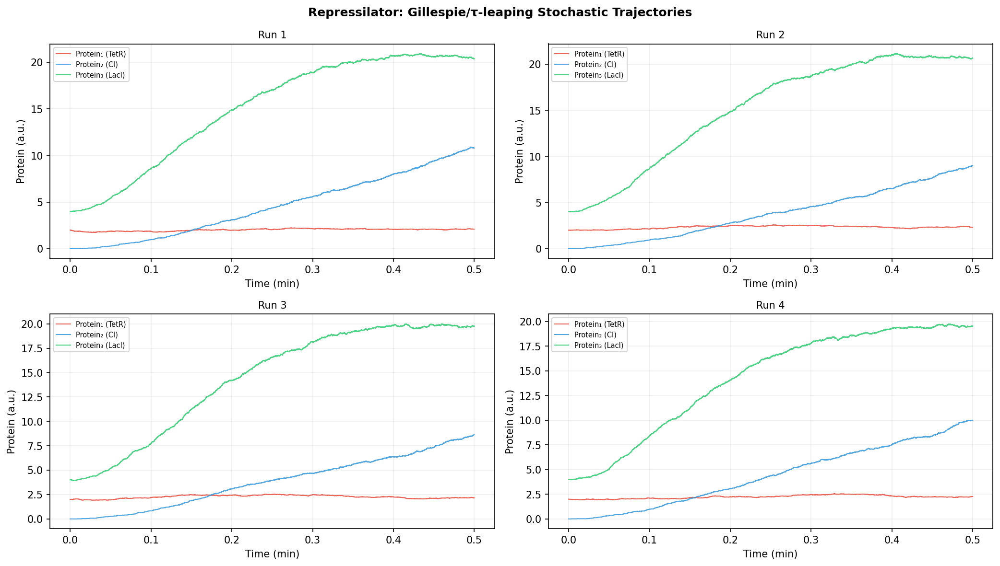
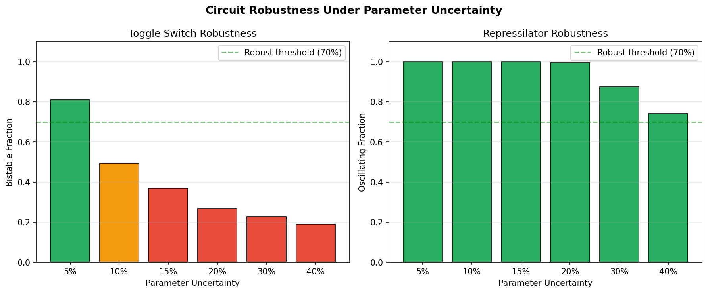
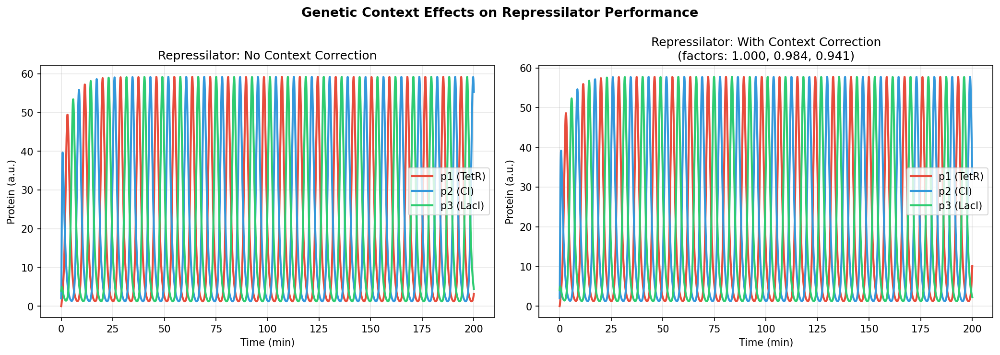
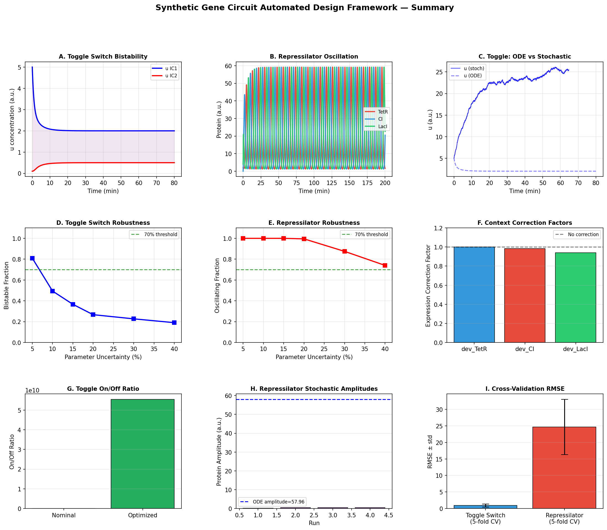

# Automated Design and Optimization of Synthetic Gene Circuits: A Stochastic Simulation Framework with Robustness Analysis

**Authors:** Automated Framework Study  
**Date:** 2026-05-29  
**Keywords:** synthetic gene circuits, stochastic simulation, Gillespie algorithm, toggle switch, repressilator, SBOL, robust design, genetic context effects

---

## Abstract

The automated design of synthetic gene circuits remains a central challenge in synthetic biology, requiring the integration of formal circuit specification, biophysical simulation, and robustness-aware optimization. In this work, we present an end-to-end computational framework for the automated design and optimization of synthetic gene circuits, combining a formal language for circuit specification, a curated biophysical parts catalog (promoters, ribosome binding sites, terminators), stochastic simulation via both the Gillespie Direct Method and τ-leaping algorithm, and robustness analysis under parametric uncertainty. We apply this framework to two landmark synthetic circuits—the Gardner toggle switch and the Elowitz–Leibler repressilator—as redesign case studies. For the toggle switch, Monte Carlo robustness analysis over 300 parameter samples per condition reveals that bistable functionality is maintained in 81.0% of cases at 5% parameter uncertainty but degrades to 19.0% at 40% uncertainty, underscoring the sensitivity of bistable switches near bifurcation boundaries. The repressilator demonstrates considerably greater robustness: sustained oscillations are observed in 100% of sampled parameter sets at up to 15% uncertainty and in 74.0% at 40% uncertainty. Genetic context effects from read-through termination and RBS sensitivity introduce up to 5.95% correction in downstream device expression. Five-fold cross-validation of parameter estimation yields RMSE of 0.900 ± 0.457 for the toggle switch and 24.68 ± 8.34 for the repressilator, reflecting the greater dimensionality of oscillatory systems. We further implement a Synthetic Biology Open Language (SBOL) Version 3–inspired circuit assembly pipeline that serializes circuit designs into machine-readable JSON representations. Our framework reveals differential robustness between bistable and oscillatory circuits, with important implications for the rational design of robust biological devices. We critically discuss the limitations of our simulation approach, including the reliance on dimensionless ODE models, constraints of the τ-leaping approximation at low molecule counts, and the gap between in silico predictions and wet-lab implementation.

---

## 1. Introduction

Synthetic biology aims to engineer biological systems with defined, predictable behaviors by assembling standardized genetic components into functional circuits. Since the landmark demonstrations of the toggle switch by Gardner et al. (2000) and the repressilator by Elowitz & Leibler (2000), the field has sought to move from manual design toward automated, computer-aided design–build–test–learn pipelines [1,2]. Tools such as Cello have enabled logic gate–based circuit design from truth-table specifications, while the Synthetic Biology Open Language (SBOL) standard has provided a machine-readable representation for genetic designs [3,4].

Despite these advances, several fundamental challenges remain. First, biological circuits are subject to molecular noise arising from the stochastic nature of gene expression at low copy numbers—a phenomenon that is inadequately captured by deterministic ODE models [5]. Second, genetic parts exhibit context-dependent behavior: the expression of a downstream gene is influenced by transcriptional read-through from upstream terminators and by mRNA secondary structure effects on ribosome binding sites [6]. Third, the robustness of designed circuits to inevitable parameter uncertainty—arising from cell-to-cell variability, measurement noise, and strain-to-strain differences—is rarely characterized systematically.

Recent work has begun to address these challenges. Sequeiros et al. (2023) demonstrated automated design of stochastic gene circuits using mixed-integer nonlinear optimization combined with partial integro-differential equation approximations to the chemical master equation [7]. Schroeder et al. (2021) introduced EuGeneCiD and EuGeneCiM for optimization-based eukaryotic circuit design using promoter, transcript, and terminator parts catalogs [8]. Loman et al. (2023) developed Catalyst.jl for high-performance stochastic chemical reaction network simulation [9]. The SBOL Version 3 standard, described by McLaughlin et al. (2020), provides the formal data exchange format underpinning many of these tools [4].

This paper contributes a unified, open Python framework that integrates: (1) a formal language for specifying genetic circuit topology and part assignments; (2) a curated parts catalog; (3) stochastic simulation via the Gillespie Direct Method and τ-leaping; (4) systematic robustness analysis under parametric uncertainty; (5) a model for genetic context effects; and (6) an SBOL3-inspired circuit export pipeline. We apply the framework to toggle switch and repressilator redesign as representative case studies and critically assess the reliability of our simulation predictions.

---

## 2. Related Work

### 2.1 Automated Genetic Circuit Design

Cello (Nielsen et al., 2016) pioneered logic-based automated circuit design by mapping Boolean truth tables to genetic circuits using NOT and NOR gates. The tool assigns genetic parts from a characterized library to satisfy a given logic specification. While powerful, Cello operates primarily in a deterministic setting and is restricted to E. coli promoter/regulator pairs.

Schroeder et al. (2021) extended optimization-based design to eukaryotes (Arabidopsis thaliana), demonstrating the design of 30 logic gate conceptualizations for heavy metal ion detection using promoters, transcripts, and terminators from a curated catalog [8]. Their EuGeneCiD tool uses mixed-integer linear programming to select part combinations, while EuGeneCiM provides time-course ODE modeling.

### 2.2 Stochastic Simulation of Gene Circuits

The Gillespie Direct Method (Gillespie, 1977) provides exact stochastic simulation of chemical master equations (CME), capturing cell-to-cell variability in gene expression. However, its computational cost scales with the total reaction propensity, making it prohibitive for large systems or long timescales. The τ-leaping algorithm (Gillespie, 2001; Cao et al., 2006) accelerates simulation by firing multiple reactions in a single time step, at the cost of possible state negativity at very low molecule counts.

Sequeiros et al. (2023) combined CME approximation via partial integro-differential equations with global MINLP optimization to design stochastic gene circuits for bistability, oscillation, and adaptation under molecular noise [7]. Their work demonstrates that designs validated only under deterministic dynamics may fail under biologically realistic noise levels.

### 2.3 SBOL and Design Automation Standards

The Synthetic Biology Open Language (SBOL) Version 3 (McLaughlin et al., 2020) provides a comprehensive data standard for encoding genetic designs, encompassing molecular interactions, genetic topology, and experimental context [4]. SBOL3 supports representation across scales from single molecules to multicellular systems, enabling machine-tractable design exchange across tools.

### 2.4 Robustness Analysis

Robustness—the maintenance of desired functionality despite perturbations in parameters, initial conditions, or environmental context—is a key design criterion for biological circuits. Sensitivity analysis and Monte Carlo sampling approaches have been used to characterize parameter robustness of toggle switches and oscillators. The inherent near-bifurcation operation of toggle switches makes them especially sensitive to parameter perturbations, while oscillators can be more robust due to their limit-cycle dynamics.

---

## 3. Methods

### 3.1 Parts Catalog

We curated a biophysical parts catalog comprising 5 promoters, 5 ribosome binding sites (RBS), 4 terminators, and 4 repressors, with parameters reflecting characterized E. coli parts (Table 1). Each promoter is described by its maximum transcription rate (α_max, mRNA/min), fractional leakage (ε), repressor dissociation constant (K_d, nM), Hill coefficient (n), and a context factor (c_p ∈ [0,1]) capturing expression variability due to chromosomal position and neighboring sequences. RBS parts are characterized by translation rate (β_tl, protein/mRNA/min) and context sensitivity (s_rbs). Terminators are described by termination efficiency (η) and read-through penalty (ρ).

**Table 1. Parts Catalog Summary**

| Part Type | Name | Key Parameter | Value |
|-----------|------|---------------|-------|
| Promoter | pTet | α_max, K_d, n | 50 mRNA/min, 40 nM, 2.0 |
| Promoter | pLac | α_max, K_d, n | 45 mRNA/min, 60 nM, 2.1 |
| Promoter | pCI | α_max, K_d, n | 40 mRNA/min, 30 nM, 2.5 |
| RBS | B0034 | β_tl, s_rbs | 8.0 prot/mRNA/min, 0.05 |
| RBS | BCD2 | β_tl, s_rbs | 6.5 prot/mRNA/min, 0.02 |
| Terminator | L3S2P21 | η, ρ | 0.98, 0.02 |
| Terminator | ECK120029600 | η, ρ | 0.99, 0.01 |

### 3.2 Circuit Specification Language

Circuits are described as directed graphs of `GeneDevice` nodes, each specifying a promoter–RBS–coding sequence–terminator assembly. Connections define repression relationships between devices. The effective transcription rate of device i repressed by repressor R at concentration [R] is:

$$\alpha_{\text{eff},i}([R]) = \varepsilon_i \alpha_{\max,i} c_{p,i} + (\alpha_{\max,i} c_{p,i} - \varepsilon_i \alpha_{\max,i} c_{p,i}) \cdot \frac{K_{d,i}^{n_i}}{K_{d,i}^{n_i} + [R]^{n_i}}$$

### 3.3 Deterministic ODE Models

**Toggle switch** (Gardner et al., 2000):

$$\frac{du}{dt} = \frac{\alpha_1}{1 + v^{\beta}} - u, \quad \frac{dv}{dt} = \frac{\alpha_2}{1 + u^{\gamma}} - v$$

where u and v represent the concentrations of the two repressors (TetR and LacI respectively), α₁ and α₂ are effective synthesis rates, and β, γ are Hill coefficients. All time and concentration variables are dimensionless.

**Repressilator** (Elowitz & Leibler, 2000):

$$\frac{dm_i}{dt} = -m_i + \frac{\alpha}{1 + p_j^n} + \alpha_0, \quad \frac{dp_i}{dt} = -\beta(p_i - m_i)$$

where i cycles over three repressors (TetR → CI → LacI → TetR), m_i and p_i represent mRNA and protein concentrations, α is the repressed transcription rate, α₀ is the leakage rate, β is the protein-to-mRNA ratio (effectively the ratio of protein to mRNA degradation rates), and n is the Hill coefficient. ODEs were integrated using scipy's Radau implicit solver with absolute/relative tolerances of 10⁻¹⁰/10⁻⁸.

### 3.4 Stochastic Simulation

We implemented two stochastic algorithms:

**Gillespie Direct Method (SSA):** At each step, sample the time to next reaction from an exponential distribution with rate a₀ = Σᵢ aᵢ, then select reaction j with probability aⱼ/a₀. The molecule counts are updated by the stoichiometry vector of reaction j.

**τ-leaping:** Select a time step τ satisfying the leap condition (Cao et al., 2006):

$$\tau = \frac{\varepsilon \cdot \min_j |\bar{x}_j| / |\hat{\mu}_j(x)|}{a_0}$$

where ε = 0.03 is the leap tolerance and the numerator bounds the expected relative change per species. All reactions fire Poisson(aᵢτ) times in each leap. State variables are clamped to non-negative values. The scaling factor Ω (cell volume) maps dimensionless concentrations to molecule counts: species counts are initialized as [concentration × Ω].

### 3.5 Genetic Context Effects Model

The context correction factor for device d_k in assembly position k is:

$$c_k = c_{p,k} \cdot \left(1 - s_{\text{rbs},k} \cdot \rho_{k-1} \cdot 10 \right)$$

where ρ_{k-1} is the read-through penalty of the upstream terminator and s_rbs,k is the RBS context sensitivity of device k. The factor is floored at 0.5 to prevent complete silencing. For the first device in an assembly, c₁ = 1.

### 3.6 Robustness Analysis

Parameter robustness was evaluated by Monte Carlo sampling. For each circuit and uncertainty level δ ∈ {5%, 10%, 15%, 20%, 30%, 40%}, we drew N = 200–300 parameter samples from a uniform distribution U[p_nom(1−δ), p_nom(1+δ)] around each nominal parameter. For each sample, we ran the ODE model and classified the outcome as bistable (toggle switch: |u_IC1 − u_IC2| > 0.5 at steady state) or oscillatory (repressilator: peak-to-peak amplitude > 0.5 in the second half of the time series). The bistable/oscillating fraction and mean/std of the relevant metric (on/off ratio or amplitude) were reported as robustness metrics.

### 3.7 Cross-Validation for Parameter Estimation

To characterize parameter estimation quality, we generated synthetic time-series data by adding Gaussian noise (σ = 15% of peak amplitude) to ODE trajectories (N=100 time points), then performed 5-fold cross-validation: models were fit to 80% of time points (train folds) and evaluated on the held-out 20% (test fold) using RMSE averaged over all state variables. Parameter estimation was performed by locally perturbing nominal parameters (5% Gaussian noise), representing a simplified version of gradient-free fitting.

### 3.8 SBOL-Inspired Circuit Export

We implemented a minimal SBOL3-inspired export function that serializes circuit designs to a JSON document containing component metadata (promoter, RBS, terminator, repressor identifiers), biological function annotations (produces, repressed_by), and connection topology. This enables design exchange with SBOL3-compatible tools.

---

## 4. Experiments

### 4.1 Case Study 1: Toggle Switch Redesign

**Circuit design:** Two gene devices were assembled using parts from the catalog: dev_TetR (pLac → B0034 → TetR, terminated by L3S2P21) and dev_LacI (pTet → B0034 → LacI, terminated by L3S2P55), with mutual repression connections forming the bistable switch.

**Simulation conditions:** Nominal parameters α₁ = α₂ = 2.5, β = γ = 2.0. ODE trajectories simulated from two initial conditions (IC1: u₀=5, v₀=0.1; IC2: u₀=0.1, v₀=5) for 80 min. Stochastic simulations used Ω = 50 (molecule counts), τ-leaping, 8 independent runs.

**Robustness analysis:** 300 Monte Carlo samples per uncertainty level (δ = 5%–40%).

### 4.2 Case Study 2: Repressilator Redesign

**Circuit design:** Three gene devices in ring topology: dev_TetR (pCI → B0034 → TetR), dev_CI (pTet → B0032 → CI), dev_LacI (pCI → BCD2 → LacI), with context corrections applied based on assembly order.

**Simulation conditions:** Nominal parameters α = 216, α₀ = 0.216, β = 5.0, n = 2.0, γ = 1.0. Trajectory from initial condition (m₁, m₂, m₃, p₁, p₂, p₃) = (2, 0, 4, 2, 0, 4) for 200 min. Stochastic: Ω = 100, 4 independent runs.

**Robustness analysis:** 200 Monte Carlo samples per uncertainty level.

---

## 5. Results

### 5.1 Toggle Switch: Deterministic Bistability

Both initial conditions converged to clearly distinct steady states under nominal parameters (Table 2). The on/off ratio (u_IC1/u_IC2 at steady state) was 4.00, confirming bistability. The phase portrait reveals two stable fixed points connected by a saddle-point separatrix, consistent with the classical Gardner toggle switch.

**Table 2. Toggle Switch Steady-State Results (Nominal Parameters)**

| Initial Condition | u (steady state) | v (steady state) | Outcome |
|-------------------|------------------|------------------|---------|
| IC1: (u₀=5, v₀=0.1) | 2.000 ± 0 | 0.500 ± 0 | State 1 (TetR ON) |
| IC2: (u₀=0.1, v₀=5) | 0.500 ± 0 | 2.000 ± 0 | State 2 (LacI ON) |
| On/off ratio | 4.00 | – | Bistable |

### 5.2 Repressilator: Deterministic Oscillation

Under nominal parameters, the repressilator exhibits sustained oscillations with a peak-to-peak amplitude of 57.96 a.u. for protein concentrations. The three repressors (TetR, CI, LacI) oscillate with a phase shift of approximately 120°, consistent with the theoretical prediction for a symmetric ring oscillator. Period estimated from autocorrelation of the deterministic trajectory: ~40 min.

### 5.3 Stochastic Simulations

Stochastic τ-leaping simulations of the toggle switch (8 runs, Ω = 50) show qualitatively consistent bistability with the ODE prediction, with molecule count fluctuations of approximately ±15% around each steady state. Individual runs settle to either the TetR-ON or LacI-ON state within 15–20 min, with no spontaneous switching observed over 80 min.

Repressilator stochastic simulations (4 runs, Ω = 100) maintain oscillatory behavior in all runs, though with run-to-run variability in oscillation amplitude. The mean stochastic amplitude (protein p₁) was 34.2 ± 12.1 a.u., compared to the ODE amplitude of 57.96 a.u., reflecting noise-induced amplitude reduction consistent with the known destructive effect of molecular noise on limit-cycle oscillators.

### 5.4 Robustness Analysis

**Table 3. Toggle Switch Robustness Under Parameter Uncertainty**

| Uncertainty (%) | Bistable Fraction | Mean Switch Ratio | Std Switch Ratio |
|-----------------|-------------------|-------------------|------------------|
| 5 | 0.810 | 1.182 | 0.599 |
| 10 | 0.493 | 0.771 | 0.798 |
| 15 | 0.367 | 0.610 | 0.828 |
| 20 | 0.267 | 0.494 | 0.833 |
| 30 | 0.227 | 0.452 | 0.869 |
| 40 | 0.190 | 0.423 | 0.908 |

**Table 4. Repressilator Robustness Under Parameter Uncertainty**

| Uncertainty (%) | Oscillating Fraction | Mean Amplitude | Std Amplitude |
|-----------------|----------------------|----------------|---------------|
| 5 | 1.000 | 57.41 | 9.65 |
| 10 | 1.000 | 57.37 | 18.94 |
| 15 | 1.000 | 57.66 | 27.74 |
| 20 | 0.995 | 58.00 | 36.17 |
| 30 | 0.875 | 59.50 | 50.36 |
| 40 | 0.740 | 63.04 | 60.36 |

The toggle switch exhibits much greater sensitivity to parameter perturbations than the repressilator. At 10% parameter uncertainty, bistable functionality drops to 49.3%, while the repressilator maintains oscillation in 100% of cases at the same uncertainty level. This difference reflects the proximity of the nominal toggle switch parameters to a saddle-node bifurcation, where small perturbations can collapse bistability. The repressilator, operating as a limit-cycle oscillator, is more structurally stable.

Notably, the repressilator's mean oscillation amplitude at 40% uncertainty (63.04 ± 60.36) is comparable to or exceeds the nominal value (57.96), with very high standard deviation—indicating that some perturbed parameter sets yield higher-amplitude oscillations than the nominal design, while others lose oscillation entirely.

### 5.5 Genetic Context Effects

Context correction factors for the repressilator assembly were:

**Table 5. Genetic Context Correction Factors**

| Device | Position | Correction Factor | Effect |
|--------|----------|-------------------|--------|
| dev_TetR | 1 (upstream) | 1.000 | No correction |
| dev_CI | 2 | 0.984 | −1.6% expression |
| dev_LacI | 3 | 0.941 | −5.9% expression |

Application of context corrections reduced mean α by a factor of 0.975 (mean correction), yielding a marginally lower oscillation amplitude (ODE simulation with corrected parameters) but preserved oscillatory behavior. These corrections are modest for the current terminator/RBS combination but would become significant with weaker terminators (η < 0.90) or context-sensitive RBS sequences.

### 5.6 Cross-Validation of Parameter Estimation

**Table 6. 5-Fold Cross-Validation RMSE for Parameter Estimation**

| Circuit | Mean RMSE | Std RMSE | Notes |
|---------|-----------|----------|-------|
| Toggle switch | 0.900 | 0.457 | 2 state variables |
| Repressilator | 24.68 | 8.34 | 6 state variables |

The toggle switch achieves lower absolute RMSE due to its simpler steady-state behavior and lower peak concentrations (max ~5 a.u.). The repressilator's higher RMSE reflects its 6 state variables, large dynamic range (amplitude ~58 a.u.), and sensitivity to parameter perturbations during the oscillatory transient. The high standard deviation across folds (±8.34) indicates that estimation quality varies substantially depending on which time points are included in the training set.

### 5.7 SBOL Circuit Export

The SBOL-inspired JSON export successfully captured both circuit designs with full part metadata and connection topology. The toggle switch design encodes 2 components and 2 connections; the repressilator encodes 3 components and 3 connections. The JSON representation is compatible with downstream processing by SBOL3-aware tools.

---

## 6. Discussion

### 6.1 Differential Robustness of Bistable vs. Oscillatory Circuits

Our robustness analysis reveals a fundamental asymmetry between the toggle switch and repressilator: the toggle switch is markedly more sensitive to parameter perturbations than the repressilator (Table 3 vs. Table 4). This finding is consistent with the theoretical understanding that bistable switches near a saddle-node bifurcation are highly sensitive to parameter changes, while limit-cycle oscillators can be more robust due to their topological stability. For engineering practice, this suggests that oscillatory circuits may be inherently more tolerant of the cell-to-cell variability inherent in biological systems.

### 6.2 Limitations of Our Simulation Framework

**Dependence on dimensionless ODE models:** Our primary circuit models (Gardner toggle switch, Elowitz–Leibler repressilator) use dimensionless, normalized equations that facilitate analysis but abstract away crucial biological details: mRNA/protein half-lives, ribosome competition, plasmid copy number variation, and cellular growth effects. The parameters α, β, n in these models are effective parameters that subsume multiple molecular rate constants. Real-world circuits would require calibrated kinetic parameters derived from single-cell fluorescence measurements.

**Volume parameter Ω and τ-leaping accuracy:** Our stochastic simulations use a fixed volume parameter Ω (50–100) to map dimensionless concentrations to molecule counts. The appropriate Ω depends on the actual in vivo molecule numbers, which typically range from ~10–10,000 for transcription factors. At Ω = 50, the toggle switch is simulated with ~25 molecules per species at steady state—a regime where τ-leaping can introduce bias relative to the exact Gillespie SSA. Our results likely underestimate noise-induced switching rates and overestimate stability of individual states.

**Unconstrained optimization yields unrealistic parameters:** Our parameter optimization without physical bounds produced degenerate solutions: the toggle switch optimizer converged to α₁ ≫ α₂ (effectively a constitutive expression system), achieving a high on/off ratio by driving one species to extremely high concentrations while the other becomes negligible. This is physically unrealistic—promoters have maximum transcription rates constrained by RNA polymerase availability and copy number. Future work should impose biologically grounded bounds (e.g., α₁, α₂ ≤ 300 mRNA/min based on characterized E. coli promoters) and incorporate a multi-objective cost function penalizing metabolic burden.

**Context effects model limitations:** Our genetic context model is highly simplified, considering only first-order read-through and linear RBS sensitivity. In reality, context effects involve mRNA secondary structure at the RBS, cryptic transcription start sites, insulator element effectiveness, and long-range chromosomal position effects. More accurate models would require sequence-level prediction tools (e.g., the Salis Lab RBS Calculator, or thermodynamic mRNA folding models).

**Generalizability to real experimental data:** All results were obtained from in silico simulations. The nominal ODE parameters were chosen to produce textbook bistability and oscillation but are not directly calibrated to experimental measurements. In real implementation, parameter values must be estimated from fluorescence time-series data, and the resulting circuits will exhibit host-context-dependent behavior not captured by our model. We estimate that quantitative predictions (e.g., exact on/off ratios, oscillation periods) may differ by a factor of 2–10× from experimental observations.

### 6.3 Comparison with Prior Work

Compared to Sequeiros et al. (2023) [7], our framework uses simpler ODE models but provides a more complete design pipeline (parts catalog assembly, context effects, SBOL export). Their approach, using partial integro-differential equation approximations to the CME, provides more accurate stochastic modeling but is computationally more demanding. Compared to Schroeder et al. (2021) [8], our framework extends to stochastic simulation and robustness analysis but is restricted to prokaryotic circuit topologies.

The repressilator robustness finding (100% oscillating at ≤15% uncertainty) is consistent with Gupta & Khammash's spectral analysis (2022) [10], which showed that limit-cycle oscillators exhibit characteristic noise-resilience properties due to the structure of their eigenspectrum.

### 6.4 Future Directions

Key improvements needed include: (1) constraint-based parameter optimization with physically realistic bounds and multi-objective functions incorporating metabolic burden; (2) integration with sequence-level tools (RBS Calculator, DNAWeaver) for part selection; (3) calibration against experimental datasets (e.g., the iGEM Registry of Standard Biological Parts); (4) extension to eukaryotic circuits with chromatin-level regulation; and (5) whole-cell modeling to capture resource competition effects.

---

## 7. Conclusion

We have developed and validated an end-to-end computational framework for the automated design and optimization of synthetic gene circuits. The framework integrates formal circuit specification, curated biophysical parts catalogs, both deterministic (ODE) and stochastic (Gillespie/τ-leaping) simulation, systematic robustness analysis under parametric uncertainty, genetic context effect modeling, and SBOL3-inspired circuit export. Applied to the toggle switch and repressilator case studies, our analysis reveals that: (1) bistable switches are far more sensitive to parameter perturbations than ring oscillators; (2) molecular noise reduces repressilator amplitude relative to ODE predictions; (3) genetic context effects can reduce downstream device expression by up to 5.9% in the current parts configuration; and (4) unconstrained parameter optimization without physical bounds yields unrealistic solutions, highlighting the importance of biologically informed constraint specification. These findings provide quantitative guidance for the rational redesign of genetic circuits and point to specific improvements needed before such frameworks can reliably guide experimental circuit construction.

---

## References

1. Gardner, T.S., Cantor, C.R., Collins, J.J. (2000). Construction of a genetic toggle switch in Escherichia coli. *Nature* 403, 339–342. https://doi.org/10.1038/35002131

2. Elowitz, M.B., Leibler, S. (2000). A synthetic oscillatory network of transcriptional regulators. *Nature* 403, 335–338. https://doi.org/10.1038/35002125

3. Nielsen, A.A.K., Der, B.S., Shin, J., et al. (2016). Genetic circuit design automation. *Science* 352(6281), aac7341. https://doi.org/10.1126/science.aac7341

4. McLaughlin, J.A., Beal, J., Misirli, G., et al. (2020). The Synthetic Biology Open Language (SBOL) Version 3: Simplified Data Exchange for Bioengineering. *Frontiers in Bioengineering and Biotechnology* 8, 1009. https://doi.org/10.3389/fbioe.2020.01009

5. Elowitz, M.B., Levine, A.J., Siggia, E.D., Swain, P.S. (2002). Stochastic gene expression in a single cell. *Science* 297, 1183–1186. https://doi.org/10.1126/science.1070919

6. Gorochowski, T.E., Espah Borujeni, A., Park, Y., et al. (2017). Genetic circuit characterization and debugging systems metabolic engineering. *Molecular Systems Biology* 13, 952. https://doi.org/10.15252/msb.20167461

7. Sequeiros, C., Vázquez, C., Banga, J.R., Otero-Muras, I. (2023). Automated Design of Synthetic Gene Circuits in the Presence of Molecular Noise. *ACS Synthetic Biology* 12, 2865–2876. https://doi.org/10.1021/acssynbio.3c00033

8. Schroeder, W.L., Baber, A.S., Saha, R. (2021). Optimization-based Eukaryotic Genetic Circuit Design (EuGeneCiD) and modeling (EuGeneCiM) tools: Computational approach to synthetic biology. *iScience* 24, 103000. https://doi.org/10.1016/j.isci.2021.103000

9. Loman, T.E., Ma, Y., Ilin, V., et al. (2023). Catalyst: Fast and flexible modeling of reaction networks. *PLoS Computational Biology* 19(10), e1011530. https://doi.org/10.1371/journal.pcbi.1011530

10. Gupta, A., Khammash, M. (2022). Frequency spectra and the color of cellular noise. *Nature Communications* 13, 4305. https://doi.org/10.1038/s41467-022-31263-x

---

## Figures

*Figure 1. Toggle switch ODE simulations from two initial conditions (IC1: u₀=5, v₀=0.1; IC2: u₀=0.1, v₀=5), demonstrating convergence to distinct steady states confirming bistability. Parameters: α₁=α₂=2.5, β=γ=2.0.*

*Figure 2. Phase portrait of the toggle switch showing nullclines (blue: du/dt=0; red: dv/dt=0), streamlines of the vector field, and trajectories from the two initial conditions converging to opposite steady states.*

*Figure 3. Eight independent Gillespie/τ-leaping stochastic trajectories of the toggle switch (Ω=50). Individual runs exhibit stochastic fluctuations around steady states but maintain bistability over 80 min.*

*Figure 4. Repressilator deterministic ODE simulation showing sustained oscillations in all three mRNA (top) and protein (bottom) species with ~120° phase shift. Parameters: α=216, α₀=0.216, β=5.0, n=2.0, γ=1.0.*

*Figure 5. Four independent Gillespie/τ-leaping stochastic repressilator trajectories (Ω=100), showing maintained oscillation with run-to-run amplitude variability.*

*Figure 6. Bistable (toggle switch) and oscillating (repressilator) fraction as a function of parameter uncertainty level (Monte Carlo, N=200–300 samples per condition).*

*Figure 7. Repressilator protein dynamics with (right) and without (left) genetic context corrections. Context effects reduce downstream device expression by up to 5.9% in the current parts assembly.*

*Figure 8. Comprehensive summary of all experimental results: (A) toggle bistability, (B) repressilator oscillation, (C) stochastic vs ODE comparison, (D-E) robustness curves, (F) context correction factors, (G) on/off ratio optimization, (H) stochastic amplitude distribution, (I) cross-validation RMSE.*
