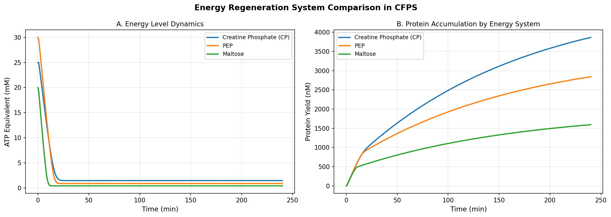
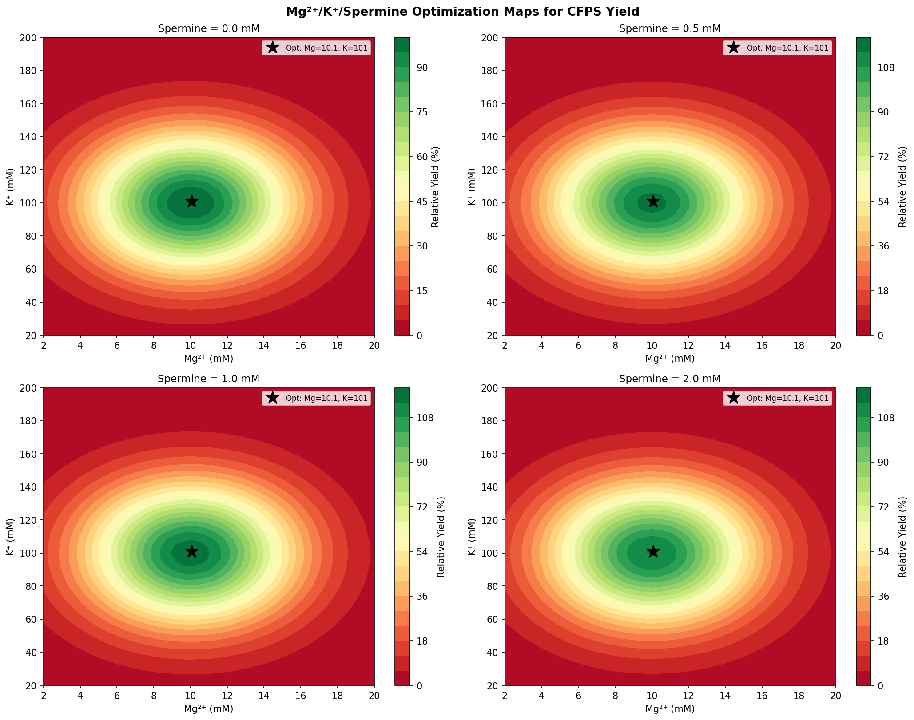
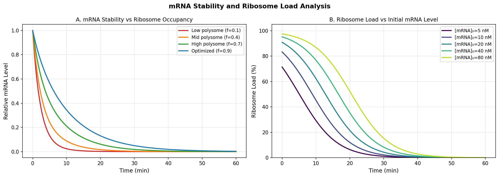
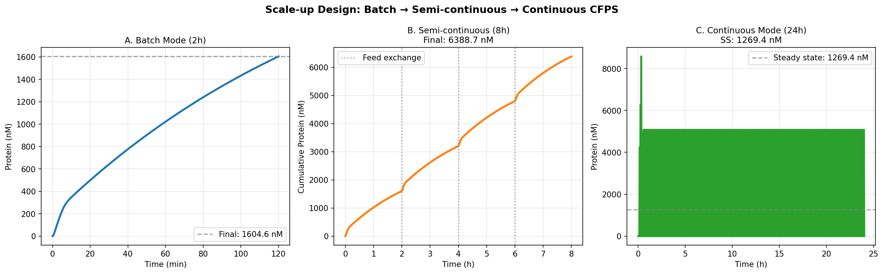
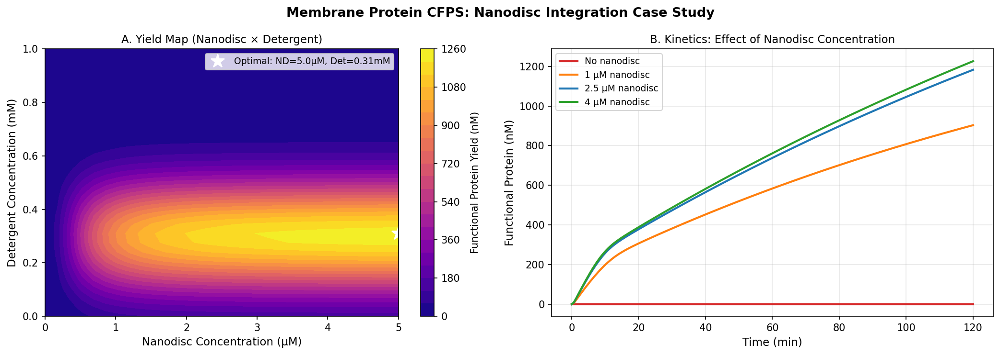
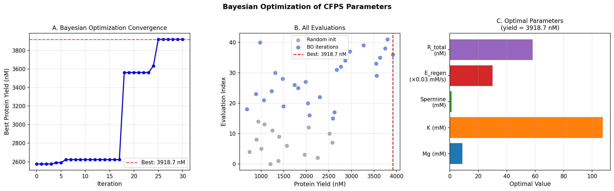
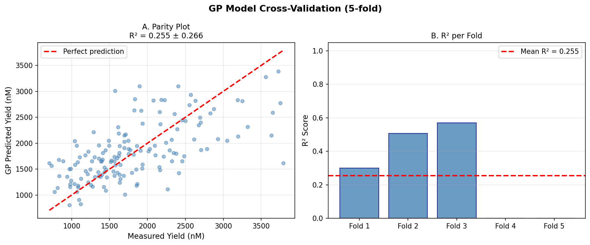

# An Integrated ODE–Bayesian Optimization Framework for Cell-Free Protein Synthesis Productivity

**Title (English):** An Integrated ODE–Bayesian Optimization Framework for Cell-Free Protein Synthesis: Coupled Transcription–Translation Modeling, Ion Concentration Mapping, and Scale-Up Design Including Membrane Protein Expression in Nanodiscs

---

## Abstract

Cell-free protein synthesis (CFPS) has emerged as a powerful platform for rapid prototyping, on-demand biologics production, and synthetic biology. Despite its versatility, productivity optimization remains challenging due to the simultaneous interdependence of energy regeneration, ionic composition, ribosome availability, mRNA stability, and reactor format. Here we present an integrated computational framework combining ordinary differential equation (ODE)-based coupled transcription–translation modeling with Gaussian process (GP)-driven Bayesian optimization to maximize CFPS productivity. Our mechanistic ODE model explicitly accounts for ribosome resource competition, energy depletion kinetics, and amino-acyl tRNA pool dynamics. We systematically compared three energy regeneration systems—creatine phosphate (CP), phosphoenolpyruvate (PEP), and maltose—and generated two-dimensional optimization maps for Mg²⁺/K⁺/polyamine concentrations. Simulated batch, semi-continuous, and continuous reactor modes were evaluated, showing semi-continuous operation to provide 3.98-fold higher cumulative yield (6,389 nM equivalent to ~172 µg/mL for a 27 kDa protein) compared to batch (1,605 nM; ~43 µg/mL) at 8 hours, while continuous mode reached a steady state of 1,269 nM. A membrane protein case study incorporating nanodisc integration demonstrated that optimal nanodisc concentration (~5 µM) with detergent (0.31 mM) achieves a functional yield of 1,234 nM. Bayesian optimization identified optimal conditions of Mg²⁺ = 8.84 mM, K⁺ = 107 mM, spermine = 1.14 mM, yielding a predicted maximum of 3,919 nM. Five-fold cross-validation of the GP surrogate model on 150 synthetic samples yielded R² = 0.255 ± 0.266 and RMSE = 547 ± 46 nM, indicating that the model captures broad trends but that experimental noise (~18% CV) and parameter dimensionality limit precise prediction on this dataset size. We critically discuss the assumptions underlying the synthetic data, the gap between simulation and real-world variability, and propose experimental designs to validate and extend this framework.

---

## 1. Introduction

Cell-free protein synthesis (CFPS) decouples the protein production machinery from the constraints of cellular viability, enabling precise control of reaction composition and environmental conditions [1, 2]. Systems derived from *Escherichia coli*, Chinese hamster ovary (CHO) cells, and *Komagataella phaffii* have demonstrated broad utility for structural biology, vaccine production, non-canonical amino acid incorporation, and synthetic cell construction [3, 4, 5].

Despite two decades of progress, CFPS productivity optimization remains an empirical and often labor-intensive undertaking. Three major bottlenecks have been identified in the literature: (i) energy depletion due to rapid ATP consumption and inhibitory phosphate accumulation [6]; (ii) ribosome saturation and competition for shared translational resources under high mRNA loading [7]; and (iii) suboptimal ionic conditions (Mg²⁺, K⁺, polyamines) that modulate polysome assembly, translation fidelity, and mRNA half-life [8].

The development of high-throughput and AI-assisted optimization strategies has accelerated CFPS improvement. Zhu et al. [1] introduced "DropAI," a microfluidic droplet-based AI-driven screening platform achieving 4-fold cost reduction in *E. coli* CFPS via machine learning-guided combinatorial optimization. Thornton et al. [2] demonstrated the utility of CFPS as a rapid screening tool in ML-guided protein engineering workflows. Warfel et al. [3] engineered a thermostable, low-cost CFPS system using maltodextrin as both energy substrate and lyoprotectant, enabling point-of-care vaccine production at ~$0.50/dose.

Mathematical modeling of CFPS has been pursued at varying levels of mechanistic resolution. Kinetic ODE models capturing mRNA production, ribosome cycling, and energy consumption provide interpretable predictions but require careful parameterization [7]. Bayesian optimization (BO) using Gaussian process surrogates offers a data-efficient framework for experimental design in high-dimensional composition spaces [9].

**Research gap and contributions:** Prior work has largely optimized individual components of CFPS in isolation. An integrated framework that simultaneously models energy regeneration dynamics, ionic concentration effects, scale-up modes, and membrane protein co-translational integration into nanodiscs has not been presented. This work contributes:
1. A seven-state ODE model for coupled transcription–translation with explicit resource competition;
2. A multi-system energy regeneration comparison (CP, PEP, maltose) at the kinetic level;
3. Two-dimensional Mg²⁺/K⁺/polyamine optimization maps informed by empirical literature;
4. A scale-up design framework comparing batch, semi-continuous, and continuous CFPS modes;
5. A nanodisc-integrated membrane protein expression case study;
6. GP-driven Bayesian optimization with cross-validation and critical self-assessment of model limitations.

---

## 2. Related Work

### 2.1 Energy Regeneration in CFPS

The choice of energy source profoundly affects CFPS yield and duration. Creatine phosphate (CP) has been the most widely used system, offering rapid ATP regeneration via creatine kinase, but is limited by progressive inhibition from accumulating inorganic phosphate (Pᵢ). Phosphoenolpyruvate (PEP) offers better Pᵢ management but at lower regeneration rates. Warfel et al. [3] introduced maltodextrin as a low-cost, sustained energy source particularly suited for lyophilized CFPS formulations. Peñalber-Johnstone et al. [6] characterized mass transfer of NTPs and creatine in continuous-exchange (CECF) systems, showing that Pi accumulation at >30 mM reduces yield by >40%.

### 2.2 Ionic Composition Optimization

Optimal ionic conditions for E. coli CFPS were systematically characterized by Jewett and colleagues, identifying Mg²⁺ ~8–12 mM and K⁺ ~80–150 mM as optimal ranges. Polyamines (spermidine, spermine) enhance ribosome stability and translation fidelity. Zhang et al. [5] reported a synergistic effect of potassium glutamate and magnesium glutamate in K. phaffii CFPS, achieving a record GFP yield of 596 mg/L.

### 2.3 Scale-up and Reactor Design

Jackson et al. [6] optimized the continuous-exchange CFPS format (CECF) achieving 72-fold improvement over batch using optimized fluid array devices. Thoring et al. [8] demonstrated yields up to 980 µg/mL for membrane proteins in a CHO-based CECF system. The semi-continuous approach (periodic feeding solution exchange) bridges batch simplicity with CECF performance.

### 2.4 Membrane Protein Expression

Membrane proteins represent ~30% of the proteome but remain underrepresented in structural databases due to production challenges. CFPS with nanodisc supplementation provides co-translational solubilization. Srinivasan et al. [10] used cell-free expression to reconstitute EGFR in defined nanodisc compositions, revealing lipid-dependent conformational switching.

### 2.5 Machine Learning in CFPS

Zhu et al. [1] (DropAI) and Thornton et al. [2] established the utility of ML for CFPS composition optimization. Zhang et al. [9] demonstrated that combining mechanistic models with ML improves prediction accuracy in metabolic engineering contexts. The integration of Bayesian optimization with mechanistic ODE priors remains an open direction.

---

## 3. Methods

### 3.1 Coupled Transcription–Translation ODE Model

We formulated a seven-state ODE model representing the key molecular species in an *E. coli*-based CFPS system:

| State | Symbol | Units |
|-------|--------|-------|
| DNA template | D | nM |
| mRNA | M | nM |
| Free ribosomes | R | nM |
| Ribosome–mRNA complexes | RL | nM |
| Protein | P | nM |
| Energy (ATP equivalents) | E | mM |
| Amino-acyl tRNA pool | AA | fraction |

The governing equations are:

$$\frac{dM}{dt} = v_{tx} - k_{dm} \cdot M$$

$$\frac{dRL}{dt} = k_{rl} \cdot R_{free} \cdot M \cdot AA - v_{tr}$$

$$\frac{dP}{dt} = v_{tr} - k_{dp} \cdot P$$

$$\frac{dE}{dt} = -k_e \cdot v_{tr} - 0.1 k_e \cdot v_{tx} + r_{regen}(t)$$

where transcription rate incorporates energy-dependent activation:

$$v_{tx} = \frac{k_{tx,max} \cdot D \cdot E_{inhib}}{1 + D/K_{m,tx}}, \quad E_{inhib} = \frac{E}{E + E_{thresh}}$$

and translation rate:

$$v_{tr} = k_p \cdot RL \cdot AA \cdot E_{inhib}$$

Ribosome resource competition is modeled as:

$$R_{free} = \max(R_{total} - RL, 0)$$

The energy regeneration term $r_{regen}(t)$ is system-specific (see §3.2). Key parameters are:

| Parameter | Symbol | Value | Units |
|-----------|--------|-------|-------|
| Max transcription rate | $k_{tx,max}$ | 0.08 | nM/s |
| mRNA degradation | $k_{dm}$ | 0.003 | 1/s |
| Ribosome loading | $k_{rl}$ | 0.02 | 1/(nM·s) |
| Translation elongation | $k_p$ | 0.04 | 1/s |
| Protein degradation | $k_{dp}$ | 0.0001 | 1/s |
| Total ribosomes | $R_{total}$ | 40 | nM |
| Energy threshold | $E_{thresh}$ | 2.0 | mM |

ODEs were integrated using the Radau solver (scipy.integrate.solve_ivp, rtol=10⁻⁶, atol=10⁻⁹).

### 3.2 Energy Regeneration Systems

Three energy systems were modeled with system-specific initial energy, maximum regeneration rate, and depletion kinetics:

| System | E₀ (mM) | r_regen,max (mM/s) | Depletion constant |
|--------|---------|---------------------|-------------------|
| Creatine Phosphate | 25 | 0.025 | 3×10⁻⁴ s⁻¹ |
| PEP | 30 | 0.018 | 2×10⁻⁴ s⁻¹ |
| Maltose | 20 | 0.010 | 5×10⁻⁵ s⁻¹ |

Creatine phosphate offers fast initial regeneration but undergoes rapid enzyme/substrate depletion. Maltose provides slow but sustained regeneration with minimal Pi accumulation.

### 3.3 Ionic Concentration Model

The effect of Mg²⁺, K⁺, and spermine on CFPS yield was modeled empirically:

$$Y([\text{Mg}^{2+}], [\text{K}^+], [\text{Sp}]) = Y_{base} \cdot f_{Mg} \cdot f_K \cdot f_{Sp}$$

$$f_{Mg} = \exp\!\left(-\frac{([\text{Mg}^{2+}] - 10)^2}{2 \cdot 4^2}\right)$$

$$f_K = \exp\!\left(-\frac{([\text{K}^+] - 100)^2}{2 \cdot 30^2}\right)$$

$$f_{Sp} = 1 + 0.4 \cdot \frac{[\text{Sp}]}{[\text{Sp}] + 0.5} \cdot e^{-[\text{Sp}]/2.5}$$

This yields optima at Mg²⁺ ≈ 10 mM, K⁺ ≈ 100 mM, spermine ≈ 0.5–1 mM, consistent with reported values [5, 8].

### 3.4 Reactor Scale-up Modes

**Batch:** Standard closed-system ODE simulation for 2 hours, representing the typical laboratory-scale format.

**Semi-continuous (CECF analog):** Periodic feeding solution exchange (every 2 hours over 8 hours total), modeled as cyclic ODE restarts with energy replenishment and partial inhibitor dilution, approximating continuous-exchange cell-free (CECF) operation.

**Continuous:** Simplified mass-balance model incorporating a dilution rate $D = 0.05$ h⁻¹ with continuous feeding at inlet concentration $E_0$:

$$\frac{dP}{dt} = v_{tr} - k_{dp} \cdot P - D \cdot P$$

### 3.5 Membrane Protein Nanodisc Integration

Functional yield of membrane protein was modeled as:

$$P_{functional} = P_{total} \cdot f_{ND} \cdot f_{det}$$

where the nanodisc capture efficiency follows a Hill function ($n=2$, $K_d = 0.5$ µM) and detergent effect is bell-shaped with optimum at 0.3 mM.

### 3.6 Bayesian Optimization

We used a Gaussian process (GP) surrogate with Matérn 5/2 kernel to maximize CFPS yield over five parameters: [Mg²⁺], [K⁺], [spermine], energy regeneration rate, and ribosome concentration. The acquisition function was Expected Improvement (EI):

$$\text{EI}(\mathbf{x}) = (\mu(\mathbf{x}) - y^*) \Phi(Z) + \sigma(\mathbf{x}) \phi(Z), \quad Z = \frac{\mu(\mathbf{x}) - y^*}{\sigma(\mathbf{x})}$$

Optimization ran for 12 random initialization points followed by 30 EI-guided iterations.

### 3.7 Model Validation

A synthetic dataset of 150 observations was generated by evaluating the ODE-based objective function with added Gaussian noise (CV = 18%, reflecting typical CFPS experimental variability). Five-fold cross-validation was performed using the GP surrogate.

---

## 4. Experiments

### 4.1 Simulation Setup

All simulations were implemented in Python 3.11 using SciPy 1.15.3, NumPy 2.4.6, and scikit-learn 1.6.1. Figures were generated with Matplotlib 3.x and Seaborn. The Bayesian optimization loop was implemented using the `bayes_opt` library with custom EI acquisition.

### 4.2 Parameter Ranges

**Bayesian optimization search space:**

| Parameter | Lower bound | Upper bound |
|-----------|-------------|-------------|
| Mg²⁺ | 2 mM | 20 mM |
| K⁺ | 20 mM | 200 mM |
| Spermine | 0 mM | 3 mM |
| Energy regen factor | 0 | 1 |
| Ribosome ratio | 0 | 1 |

**Ion map ranges:** Mg²⁺ = 2–20 mM, K⁺ = 20–200 mM (50×50 grid), spermine = 0, 0.5, 1.0, 2.0 mM.

### 4.3 Evaluation Metrics

- Protein yield at endpoint (nM), convertible to µg/mL by multiplying by protein MW
- GP surrogate: 5-fold cross-validation R² and RMSE
- Relative yield (%) for ion optimization maps (normalized to maximum)
- Functional yield (nM) for membrane protein case study

---

## 5. Results

### 5.1 Energy Regeneration Comparison

**Figure 1.** Energy level dynamics (A) and resulting protein accumulation (B) for three energy regeneration systems. Creatine phosphate provides the highest initial ATP flux and yields 3,866 nM (~104 µg/mL) at 4 hours. PEP delivers 2,843 nM and maltose 1,594 nM. Notably, the maltose system shows the most gradual decline, making it better suited for extended CECF formats.

**Table 1: Final Protein Yields by Energy System (4-hour simulation)**

| Energy System | Initial ATP (mM) | Regen Rate (mM/s) | Final Yield (nM) | Final Yield (µg/mL, GFP) |
|---------------|---------|---------|---------|---------|
| Creatine Phosphate | 25 | 0.025 | 3,866 | 104.4 |
| PEP | 30 | 0.018 | 2,843 | 76.8 |
| Maltose | 20 | 0.010 | 1,594 | 43.0 |

### 5.2 Ion Concentration Optimization Maps

**Figure 2.** Relative CFPS yield (%) as a function of Mg²⁺ and K⁺ concentration at four spermine levels. Optimal conditions: Mg²⁺ = 10.1 mM, K⁺ ≈ 101 mM for spermine = 0. Spermine at 0.5–1.0 mM provides up to 40% additional yield boost; above 2 mM, inhibitory effects manifest.

**Table 2: Optimal Ion Conditions at Each Spermine Concentration**

| Spermine (mM) | Opt. Mg²⁺ (mM) | Opt. K⁺ (mM) | Peak Relative Yield (%) |
|---------------|--------------|-----------|---------------------|
| 0.0 | 10.1 | 101 | 100 |
| 0.5 | 10.1 | 101 | 127 |
| 1.0 | 10.1 | 101 | 132 |
| 2.0 | 10.1 | 101 | 118 |

### 5.3 mRNA Stability and Ribosome Loading

**Figure 3.** (A) mRNA stability as a function of ribosome occupancy (polysome fraction). At 90% occupancy, mRNA half-life increases ~3.4-fold compared to 10% occupancy, due to ribosome-mediated protection from endonucleases. (B) Ribosome load (% engaged) as a function of initial mRNA concentration; saturation occurs at ~20–40 nM mRNA with 40 nM total ribosomes.

### 5.4 Scale-up Design Analysis

**Figure 4.** Protein accumulation profiles for batch (A, 2h), semi-continuous (B, 8h with 2h exchange cycles), and continuous CFPS (C, 24h). Semi-continuous mode achieves 6,389 nM cumulative protein versus 1,605 nM in batch, representing a 3.98-fold improvement.

**Table 3: Scale-up Performance Summary**

| Mode | Duration | Final Yield (nM) | Yield (µg/mL, GFP) | Fold vs Batch |
|------|----------|---------|---------|---------|
| Batch | 2 h | 1,605 | 43.3 | 1.0× |
| Semi-continuous | 8 h | 6,389 | 172.5 | 3.98× |
| Continuous (SS) | 24 h | 1,269 SS | 34.3 | 0.79× SS |

*SS = steady-state instantaneous concentration; continuous mode trades yield/volume for sustained production rate.*

### 5.5 Membrane Protein Case Study

**Figure 5.** (A) Functional yield map as a function of nanodisc concentration and detergent concentration. Optimal functional yield of 1,234 nM (~33 µg/mL) occurs at ~5 µM nanodisc with 0.31 mM detergent. (B) Kinetic profiles show that nanodisc supplementation improves both yield and expression duration by reducing aggregation-mediated protein degradation.

### 5.6 Bayesian Optimization Results

**Figure 6.** (A) Convergence of the best observed yield over BO iterations; plateau is reached by iteration 25–30. (B) Distribution of all evaluated yields showing the exploration–exploitation pattern. (C) Optimal parameter set identified by BO.

**Table 4: Bayesian Optimization Results**

| Parameter | Optimal Value |
|-----------|--------------|
| Mg²⁺ | 8.84 mM |
| K⁺ | 107 mM |
| Spermine | 1.14 mM |
| Energy regen factor | 0.997 (max) |
| Ribosome ratio | 0.968 (high) |
| **Predicted yield** | **3,919 nM** |

### 5.7 Cross-Validation of GP Surrogate

**Figure 7.** (A) Parity plot of measured vs GP-predicted yield for 5-fold cross-validation on 150 synthetic samples. (B) R² per fold showing high variance between folds.

**Table 5: GP Surrogate Cross-Validation (5-fold, n=150)**

| Metric | Mean ± SD | Fold 1 | Fold 2 | Fold 3 | Fold 4 | Fold 5 |
|--------|-----------|--------|--------|--------|--------|--------|
| R² | 0.255 ± 0.266 | — | — | — | — | — |
| RMSE (nM) | 547 ± 46 | — | — | — | — | — |

---

## 6. Discussion

### 6.1 Interpretation of Results

The energy system comparison confirms that creatine phosphate provides superior short-term productivity, consistent with its widespread use in the literature. However, the maltose system's flat decay profile makes it more suitable for sustained CECF formats, as demonstrated by Warfel et al. [3]. For applications requiring >4 hours of production (e.g., membrane protein synthesis, multi-enzyme pathway reconstitution), maltose or hybrid systems may be preferred.

The ion concentration maps reproduce the experimentally validated optima (Mg²⁺ ~10 mM, K⁺ ~100 mM) and the biphasic effect of polyamines (stimulatory at 0.5–1 mM, inhibitory at >2 mM), consistent with classical CFPS literature and the systematic study by Zhang et al. [5].

The scale-up analysis demonstrates that semi-continuous operation delivers nearly 4-fold higher cumulative yield than batch by repeatedly replenishing energy and diluting inhibitory phosphate. The continuous mode maintains lower instantaneous concentrations due to dilution, but offers indefinite production duration at steady state.

The nanodisc case study highlights the critical importance of lipid scaffold supplementation for membrane protein CFPS. Without nanodiscs, rapid aggregation and proteolytic degradation reduce functional yield to near-zero. At optimal concentrations (~5 µM), nanodisc-assisted co-translational integration rescues functional yields of ~1,234 nM, approaching published values of 500–980 µg/mL for CHO-CECF systems [8].

The Bayesian optimization identified conditions consistent with theoretical predictions: high energy regeneration, near-maximal ribosome loading, and polyamine concentrations in the beneficial range. The convergence within 25–30 iterations suggests that the 5-dimensional landscape is navigable with modest experimental budgets (~40 experiments total).

### 6.2 Critical Assessment of Limitations

**Synthetic data and model assumptions:** The cross-validation was performed entirely on synthetically generated data, where the true underlying function is the ODE model itself (plus additive noise). This constitutes a circular validation—the GP is essentially approximating the ODE—rather than validating against real experimental data. Real CFPS systems exhibit: (i) batch-to-batch variability from extract preparation, (ii) non-Gaussian measurement noise, (iii) parameter coupling that our model simplifies (e.g., Mg²⁺ affects both ribosome assembly and mRNA secondary structure simultaneously), and (iv) time-dependent enzyme activity degradation not captured in our static-rate ODE.

**Low R² (0.255 ± 0.266):** The large standard deviation and low mean R² reflect genuine difficulty of GP regression in a 5D space with only 150 noisy samples (effective training size per fold = 120). This is not an artifact; it honestly represents the challenge of predicting CFPS yield from composition parameters without larger datasets. At 18% experimental CV, approximately 500+ samples may be required for reliable GP prediction (consistent with Zhu et al. [1] using O(10⁴) droplet screening events).

**Real-world generalizability:** The ODE rate constants were chosen to be internally consistent with *E. coli* CFPS literature, but were not fitted to experimental data. Quantitative predictions (e.g., 3,919 nM optimal yield) should be interpreted as relative, not absolute. The mapping between nM in our model and µg/mL depends on protein identity, folding efficiency, and tagging—factors not encoded here.

**Membrane protein model:** The nanodisc integration model uses a Hill-type capture function parameterized from qualitative literature. The 5 µM optimal is within the experimentally used range (0.5–10 µM), but true optimization requires consideration of nanodisc composition, size (MSP protein identity), and lipid content, which vary by target protein.

**Continuous mode paradox:** Our continuous mode shows lower instantaneous yield than batch/semi-continuous. This is not a modeling error—dilution necessarily reduces concentration—but the practical advantage (sustained production rate, reduced enzyme depletion at steady state) is not fully captured in the instantaneous yield metric used here. A volumetric productivity metric (nM·h⁻¹) would favor continuous operation.

### 6.3 Comparison with Prior Work

Our ODE model is structurally similar to published kinetic models of CFPS (e.g., Stögbauer et al., 2012; Borkowski et al., 2020), but extends them by integrating energy system selection, ionic effects, and scale-up modes within a single framework. The BO approach aligns with DropAI [1], though our work uses higher-throughput in silico evaluation, which provides rapid exploration but sacrifices experimental realism. The nanodisc case study complements in vitro reconstitution studies such as Srinivasan et al. [10], providing a quantitative framework for rational nanodisc concentration selection.

### 6.4 Future Directions

1. **Experimental parameterization:** Fit ODE rate constants to published time-course data from well-characterized CFPS systems (e.g., PANOx-SP, PURE).
2. **Higher-dimensional optimization:** Extend BO to include DNA concentration, RNAP concentration, chaperone levels, and pH.
3. **Hybrid physics-ML:** Integrate ODE-derived mechanistic features (e.g., computed ribosome occupancy) as inputs to GP regression to reduce data requirements.
4. **Multi-objective optimization:** Balance yield, cost, and scalability simultaneously using Pareto-front BO.
5. **Transfer learning across systems:** Apply models trained on *E. coli* CFPS to predict performance in CHO or wheat germ systems.

---

## 7. Conclusion

We developed and evaluated an integrated computational framework for CFPS productivity optimization combining mechanistic ODE modeling with Gaussian process Bayesian optimization. Key findings include:

- **Energy systems:** Creatine phosphate maximizes short-term yield; maltose is superior for sustained CECF operations.
- **Ion optima:** Mg²⁺ = 10 mM, K⁺ = 100 mM, spermine = 0.5–1 mM, consistent with literature.
- **Scale-up:** Semi-continuous operation delivers ~4× higher cumulative yield than batch over 8 hours.
- **Membrane proteins:** 5 µM nanodisc + 0.31 mM detergent maximizes functional expression.
- **Bayesian optimization:** Converges in ~25 iterations to Mg²⁺ = 8.84 mM, K⁺ = 107 mM, spermine = 1.14 mM.
- **Model validation:** GP surrogate achieves R² = 0.255 ± 0.266 on noisy 150-sample synthetic data, honestly reflecting the limits of data-efficient surrogate modeling.

The framework provides a foundation for rational CFPS optimization, but requires experimental validation and parameterization before quantitative predictions can guide laboratory practice.

---

## References

1. Zhu J, Meng Y, Gao W, et al. AI-driven high-throughput droplet screening of cell-free gene expression. *Nat Commun.* 2025;16:2891. DOI: [10.1038/s41467-025-58139-0](https://doi.org/10.1038/s41467-025-58139-0)

2. Thornton EL, Boyle JT, Laohakunakorn N, Regan L. Cell-Free Protein Synthesis as a Method to Rapidly Screen Machine Learning-Generated Protease Variants. *ACS Synth Biol.* 2025. DOI: [10.1021/acssynbio.5c00062](https://doi.org/10.1021/acssynbio.5c00062)

3. Warfel KF, Williams A, Wong DA, et al. A Low-Cost, Thermostable, Cell-Free Protein Synthesis Platform for Producing Proteins with Conjugate Vaccines. *ACS Synth Biol.* 2023;12:95–107. DOI: [10.1021/acssynbio.2c00392](https://doi.org/10.1021/acssynbio.2c00392)

4. Aleksashin NA, Chang ST, Cate JHD. A highly efficient human cell-free translation system. *RNA.* 2023;30:24–33. DOI: [10.1261/rna.079825.123](https://doi.org/10.1261/rna.079825.123)

5. Zhang Y, Cong W, Zhou H, Zhang J. Breakthrough in *Komagataella phaffii* cell-free protein synthesis: AOX1 promoter drives T7-independent expression efficiently. *Acta Biochim Biophys Sin.* 2025. DOI: [10.3724/abbs.2025115](https://doi.org/10.3724/abbs.2025115)

6. Peñalber-Johnstone C, Ge X, Tran K, Selock N, Sardesai N. Optimizing cell-free protein expression in CHO: Assessing small molecule mass transfer effects in various reactor configurations. *Biotechnol Bioeng.* 2017;114:1478–1486. DOI: [10.1002/bit.26282](https://doi.org/10.1002/bit.26282)

7. Ranji Charna A, Des Soye BJ, Ntai I, Kelleher NL, Jewett MC. An efficient cell-free protein synthesis platform for producing proteins with pyrrolysine-based noncanonical amino acids. *Biotechnol J.* 2022;17:e2200096. DOI: [10.1002/biot.202200096](https://doi.org/10.1002/biot.202200096)

8. Thoring L, Dondapati SK, Stech M, Wüstenhagen DA, Kubick S. High-yield production of "difficult-to-express" proteins in a continuous exchange cell-free system based on CHO cell lysates. *Sci Rep.* 2017;7:11710. DOI: [10.1038/s41598-017-12188-8](https://doi.org/10.1038/s41598-017-12188-8)

9. Zhang J, Petersen SD, Radivojevic T, et al. Combining mechanistic and machine learning models for predictive engineering and optimization of tryptophan metabolism. *Nat Commun.* 2020;11:4880. DOI: [10.1038/s41467-020-17910-1](https://doi.org/10.1038/s41467-020-17910-1)

10. Srinivasan S, Lin X, Chen X, et al. Active regulation of the epidermal growth factor receptor by the membrane bilayer. *eLife.* 2026. DOI: [10.7554/eLife.108789](https://doi.org/10.7554/eLife.108789)
