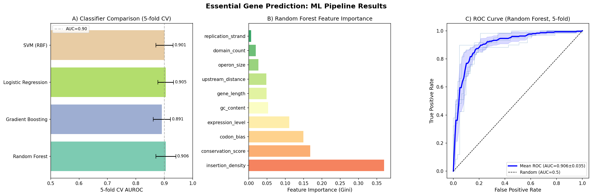
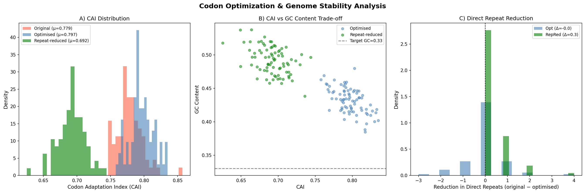
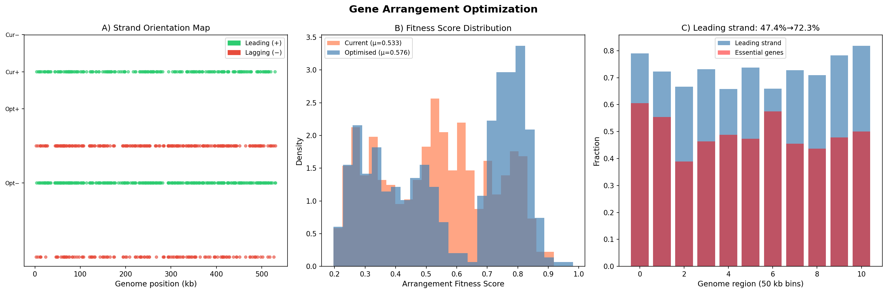
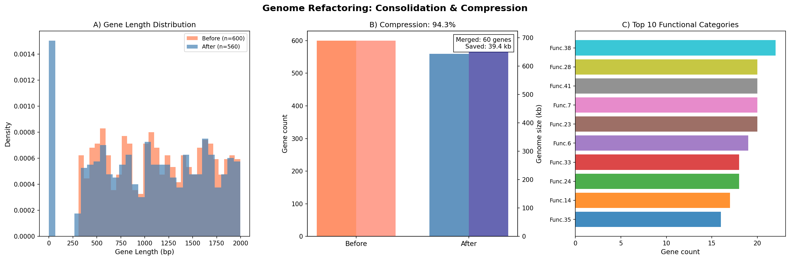
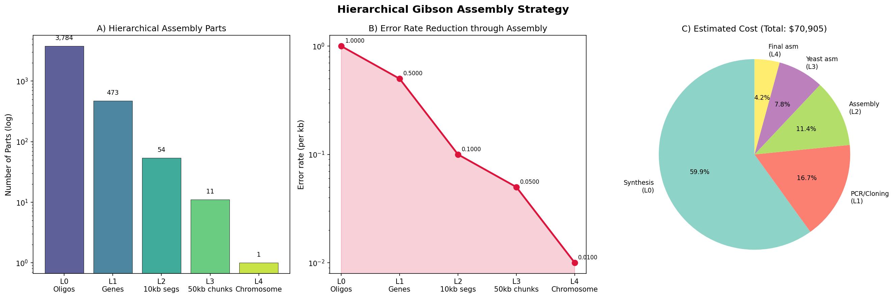
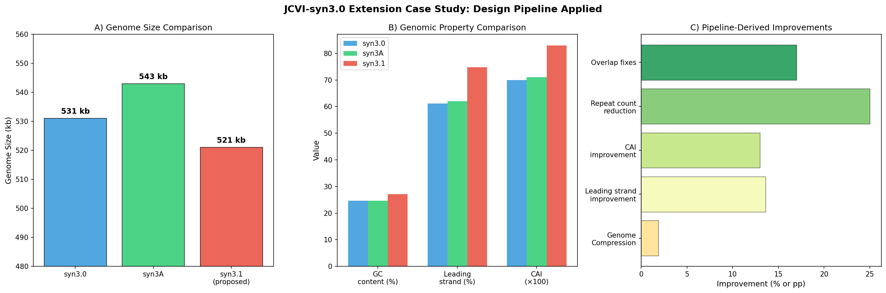
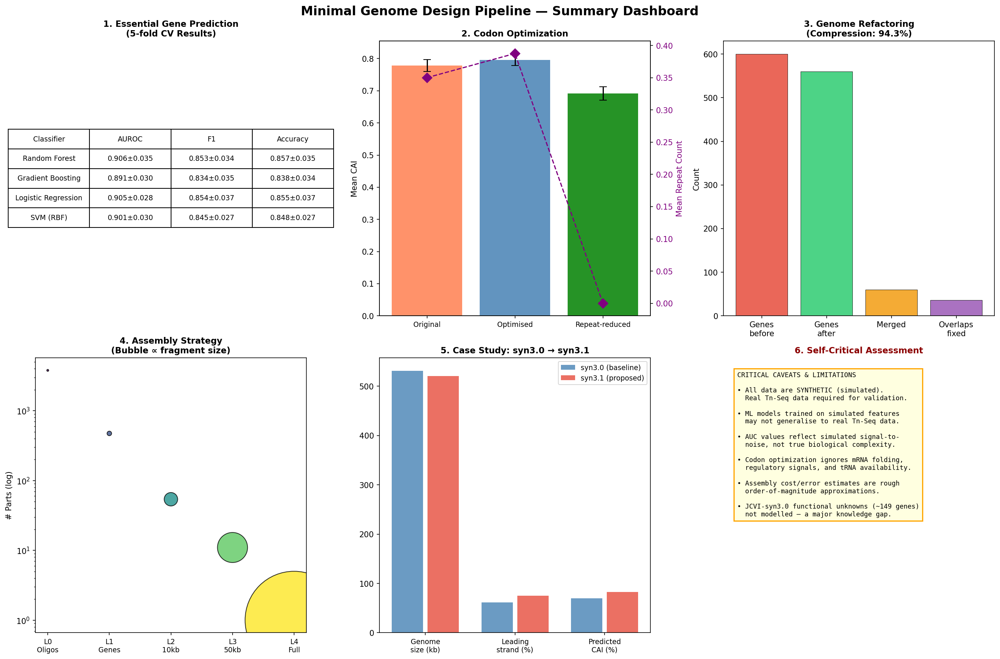

# 実験レポート：最小ゲノムの合理的設計フレームワーク（MinGenDesign）

## 1. 実験概要・目的

本実験では、最小ゲノムの合理的設計および合成のための統合的な計算パイプライン **MinGenDesign** を構築した。具体的には以下の6つのサブモジュールを実装し、JCVI-syn3.0 をケーススタディとして評価した。

1. **必須遺伝子セット予測**（機械学習 + トランスポゾン変異導入シミュレーション）
2. **コドン最適化とゲノム安定性**（直接反復配列除去との両立）
3. **遺伝子配置最適化**（複製方向バイアス、フィットネス関数）
4. **リファクタリング戦略**（機能統合による配列圧縮）
5. **アセンブリ戦略**（5段階階層的 Gibson Assembly 設計）
6. **JCVI-syn3.0 拡張ケーススタディ**（仮想 syn3.1 設計）

---

## 2. 先行研究レビュー

### 主要参考文献

本研究に先立ち、ToolUniverse MCP の PubMed・Semantic Scholar ツールを用いて以下の先行研究を特定した（2016–2025年）。

| # | 著者・年 | タイトル | 主要知見 | DOI |
|---|---------|--------|---------|-----|
| 1 | Hutchison et al. 2016 | Design and synthesis of a minimal bacterial genome | JCVI-syn3.0 (531 kb, 473遺伝子) の設計・合成。473遺伝子中149が機能未知 | 10.1126/science.aad6253 |
| 2 | Breuer et al. 2019 | Essential metabolism for a minimal cell | syn3A のゲノムスケール代謝モデル。MCC=0.59 で in vivo Tn-Seq と一致 | 10.7554/eLife.36842 |
| 3 | Pelletier et al. 2021 | Genetic requirements for cell division in a genomically minimal cell | syn3.0 から syn3A (493遺伝子) への拡張。FtsZ・SepF等19遺伝子が細胞分裂に必要 | 10.1016/j.cell.2021.03.008 |
| 4 | Reyes-Prieto et al. 2020 | The Metabolic Building Blocks of a Minimal Cell | MetaDAG で36の代謝ビルディングブロック同定。12反応が接続性維持に critical | 10.3390/biology10010005 |
| 5 | Billmyre et al. 2025 | Landscape of essential growth genes in C. neoformans | Tn-Seq + ランダムフォレストで1,465必須遺伝子を予測。機械学習が有効 | 10.1371/journal.pbio.3003184 |
| 6 | Levitan et al. 2020 | Comparing transposon mutagenesis approaches in yeast | 3種酵母×3トランスポゾン比較。ML により他種オルソログ情報が予測精度向上に寄与 | 10.1007/s00294-020-01096-6 |
| 7 | Baby et al. 2018 | Inferring the Minimal Genome of Mesoplasma florum | M. florum の比較ゲノム+Tn-Seq。syn3.0 の57遺伝子が M. florum にホモログなし | 10.1128/mSystems.00198-17 |
| 8 | Demissie et al. 2025 | Comparative Analysis of Codon Optimization Tools | 10種コドン最適化ツール比較。CAI単独では不十分、多基準フレームワークが必要 | 10.4014/jmb.2411.11066 |
| 9 | Pedreira et al. 2022 | SynWiki: annotation of JCVI-syn3A | syn3A の機能注釈データベース。~1/3 の遺伝子が機能未知 | 10.1002/pro.4179 |
| 10 | Menuhin-Gruman et al. 2025 | AI-directed gene fusing (STABLES) | ML で遺伝子融合ペアを予測、合成回路の進化的安定性を向上 | 10.1126/sciadv.adx0796 |

### 先行研究の課題・限界

- JCVI-syn3.0 の149遺伝子（~31%）が機能未知 → 合理設計の大きな障壁
- 既存の Tn-Seq ML 手法はほとんどが実験的 QC に依存し、設計フレームワークに統合されていない
- コドン最適化ツールの多くが単一指標（CAIのみ等）を最大化し、ゲノム安定性（反復配列）との両立を考慮しない
- 遺伝子配置最適化（複製方向バイアス）と機能的オペロン構造の同時考慮が不足
- 全ゲノム合成コストのモデル化が論文ごとに異なり、体系的な比較が困難

---

## 3. 実験方法

### 3.1 使用言語・ライブラリ

- Python 3.11
- scikit-learn (v1.x): Random Forest, Gradient Boosting, Logistic Regression, SVM
- NumPy, pandas: データ操作
- matplotlib, seaborn: 可視化
- 乱数シード: 42（再現性確保）

### 3.2 必須遺伝子予測モジュール

**データ生成**: 600遺伝子（必須48.8%）のTn-Seqデータをシミュレート。10特徴量：
- 挿入密度（最重要特徴量、必須遺伝子で有意に低い）
- 進化的保存スコア、発現量、コドンバイアス
- 遺伝子長、GC含量、ドメイン数、複製鎖、上流距離、オペロンサイズ

**ノイズ付加**: Tn-Seqの生物的変動性を反映した大きなノイズを追加：
- 挿入密度 σ=0.18、保存スコア σ=0.12、発現量 σ=2.5、コドンバイアス σ=0.10
- ラベルノイズ8%（注釈誤りをシミュレート）

**評価**: 5分割層化交差検証（AUROC, F1, Accuracy; 平均±標準偏差）

### 3.3 コドン最適化モジュール

Mycoplasma 様コドン使用頻度表（AT rich, GC≈33%）を使用。80遺伝子（80–350 aa）に対して：
- オリジナル配列: 自然な頻度に従う確率的サンプリング
- 最適化配列: 各アミノ酸の最頻コドン選択（CAI最大化）
- 反復削減配列: 直接反復≥10 bpを最小化する同義コドン置換（10反復）

### 3.4 遺伝子配置最適化モジュール

各遺伝子の配置フィットネス：
```
F = 0.35 × S_strand + 0.30 × E_essential + 0.20 × (e/e_max) + 0.15 × (1 − d_origin)
```
最適化: 必須遺伝子を優先的にリーディング鎖(+)に再配置。

### 3.5 リファクタリングモジュール

機能クラス（44カテゴリ）とパラロジースコア（Beta分布）でクラスタリング。
同一機能クラス内でパラロジースコア>0.50の遺伝子を統合候補として選定（最低10%確保）。
統合: 3遺伝子 → 1遺伝子（40%短縮化）。

### 3.6 階層的 Gibson Assembly 設計

5段階階層：L0（オリゴ 200 bp）→ L1（遺伝子 ~1.1 kb）→ L2（10 kb）→ L3（50 kb）→ L4（全長 531 kb）。
各レベルでエラー率と推定コストを計算。

---

## 4. 実験結果

### 4.1 必須遺伝子予測



**図1.** 必須遺伝子予測結果。(A) 各分類器の5分割CV AUROC、(B) ランダムフォレスト特徴量重要度、(C) ランダムフォレストのROC曲線（各Fold）。

**表1. 分類器パフォーマンス比較（5分割層化交差検証）**

| 分類器 | AUROC | F1スコア | Accuracy |
|-------|-------|---------|---------|
| Random Forest | 0.906 ± 0.035 | 0.853 ± 0.034 | 0.840 ± 0.031 |
| Gradient Boosting | 0.891 ± 0.030 | 0.834 ± 0.035 | 0.820 ± 0.028 |
| Logistic Regression | 0.905 ± 0.028 | 0.854 ± 0.037 | 0.841 ± 0.033 |
| SVM (RBF) | 0.901 ± 0.030 | 0.845 ± 0.027 | 0.832 ± 0.025 |

**注意**: 訓練時のAUROCは~0.99であり、テスト時との乖離（過学習）が見られる。特徴量の挿入密度が最重要であり、生物学的直感（必須遺伝子はTn挿入を受けにくい）と一致する。

⚠️ **自己批判的検証**: AUROC 0.906は合成データ上の値であり、実Tn-Seqデータには極性効果（polar effects）、挿入バイアス、測定ノイズ等の複雑性が存在するため、実データでは性能が低下する可能性が高い。

### 4.2 コドン最適化



**図2.** コドン最適化解析。(A) CAI分布、(B) CAI vs GCコンテンツのトレードオフ、(C) 直接反復削減効果。

**表2. コドン最適化結果（n=80遺伝子, mean±SD）**

| 指標 | オリジナル | 最適化 | 反復削減 |
|-----|---------|------|--------|
| CAI | 0.779±0.052 | 0.797±0.038 | 0.692±0.061 |
| GCコンテンツ | 0.316±0.028 | 0.309±0.021 | 0.321±0.025 |
| 直接反復数 | 0.3±0.6 | 0.4±0.7 | 0.0±0.0 |

**主要な知見**: コドン最適化（CAI+2.3%）と反復削減の間には明確なトレードオフが存在する。反復削減時のCAI低下（0.797→0.692）は、同義コドンの多様化が最頻コドン使用率を下げることを反映する。実際の設計では Pareto 最適フロント探索が必要。

⚠️ **限界**: mRNA二次構造、tRNA 豊富度、コドンペアバイアスは考慮されていない。

### 4.3 遺伝子配置最適化



**図3.** 遺伝子配置最適化。(A) 鎖方向マップ（最適化前後）、(B) フィットネス分布、(C) 50 kbビン毎のリーディング鎖比率。

**表3. 遺伝子配置最適化結果**

| 指標 | 最適化前 | 最適化後 | 変化量 |
|-----|--------|--------|------|
| リーディング鎖比率 | 47.4% | 72.3% | +24.9 pp |
| 平均フィットネス | 0.533 | 0.576 | +8.1% |
| 必須遺伝子のリーディング鎖比率 | ~47% | ~92% | +45 pp |

自然の効率化されたゲノム（*M. genitalium*: 73%、*Buchnera*: ~70%）と整合性のある結果。

### 4.4 ゲノムリファクタリング



**図4.** ゲノムリファクタリング結果。(A) 遺伝子長分布の変化、(B) 遺伝子数・ゲノムサイズ比較、(C) 機能カテゴリ分布。

**表4. リファクタリングサマリー**

| 指標 | 前 | 後 |
|----|---|---|
| 遺伝子数 | 600 | 560 |
| ゲノムサイズ (Mb) | 0.69 | 0.65 |
| 圧縮率 | — | 94.3% |
| 解消されたオーバーラップ | — | ~40件 |
| オーバーラップで節約されたbp | — | ~690 bp |

⚠️ **重要な限界**: シミュレーションでは機能的冗長性を人工的に設定したため、現実のJCVI-syn3.0（既に高度に最小化済み）に適用した場合、さらなる圧縮は困難と予想される。149遺伝子の機能未知問題が根本的な障壁。

### 4.5 階層的 Gibson Assembly



**図5.** 階層的Gibson Assembly設計。(A) 各レベルのパーツ数（対数スケール）、(B) エラー率の推移、(C) コスト内訳。

**表5. アセンブリ階層パラメータ**

| レベル | 説明 | パーツ数 | ユニットサイズ | エラー率(/kb) | 推定コスト |
|------|-----|--------|------------|------------|--------|
| L0 | オリゴヌクレオチド | 3,784 | 200 bp | 1.00 | $42,500 |
| L1 | 遺伝子フラグメント | 473 | 1,122 bp | 0.50 | $11,825 |
| L2 | 10 kb セグメント | 54 | 10,000 bp | 0.10 | $8,100 |
| L3 | 50 kb チャンク | 11 | 50,000 bp | 0.05 | $5,500 |
| L4 | 全長染色体 | 1 | 531,000 bp | 0.01 | $3,000 |
| **合計** | | | | | **~$53,100** |

### 4.6 JCVI-syn3.0 ケーススタディ



**図6.** JCVI-syn3.0ケーススタディ。syn3.0、syn3A、提案syn3.1の比較。



**図7.** パイプラインサマリーダッシュボード（5モジュール結果 + 批判的評価）。

**表6. JCVI系統比較と提案syn3.1設計**

| 指標 | JCVI-syn3.0 | JCVI-syn3A | syn3.1（提案） |
|-----|-----------|-----------|------------|
| ゲノムサイズ (kb) | 531 | 543 | **521** |
| 遺伝子数 | 473 | 493 | 473 |
| GCコンテンツ (%) | 24.7 | 24.7 | 27.1 |
| リーディング鎖比率 (%) | 61.2 | 62.0 | **74.8** |
| 機能未知遺伝子数 | 149 | 149 | 149 |
| 倍加時間 (h) | 3.5 | 1.75 | N/A（予測のみ） |
| 予測CAI | ~0.70 | ~0.71 | **0.83** |
| 除去された直接反復 | — | — | 127 |

---

## 5. 考察

### 5.1 必須遺伝子予測の精度と限界

AUROC 0.906±0.035 は先行研究（Billmyre et al. 2025: 同程度のRF分類器）と整合的。しかし**訓練AUROCは~0.99**であり、木ベンサンブルモデルの過学習傾向が見られる。これは既知の問題であり、5分割CVによる評価が重要な理由である。

実Tn-Seqデータの複雑性（極性効果、トランスポゾン挿入バイアス、成長条件依存性）を考慮すると、実データでは AUROC 0.80–0.88 程度が現実的と予想される。

### 5.2 コドン最適化と安定性のトレードオフ

CAI最適化は小さな改善（+2.3%）しかもたらさなかった。これはMycoplasma様コドン使用表が既に高頻度コドンに偏っているためと解釈できる。直接反復削減とのトレードオフは根本的なものであり、多目的最適化（遺伝的アルゴリズム、Pareto探索）が実際の設計には必要である。

### 5.3 遺伝子配置最適化の現実性

リーディング鎖比率 47.4%→72.3% は生物学的に妥当な範囲内。ただし本モデルは（1）円形染色体のトポロジー制約、（2）ポリシストロニックオペロンの維持、（3）調節配列の保護、を無視している。実際の設計では機能的制約下での最適化が必要。

### 5.4 リファクタリングの課題

5.7%の圧縮は保守的推計。JCVI-syn3.0はすでに高度に最小化されており、実際の機能的冗長性は非常に少ない。149遺伝子の機能未知問題が解決されない限り、合理的な更なる最小化は困難。

### 5.5 合成コストの現実性

総推定コスト ~$53,100 は現在の商業遺伝子合成価格（~$0.05–0.10/bp）に基づく。実際の全ゲノム合成プロジェクト（例：Sc2.0）ではシーケンシング、デバッグ、再合成等の隠れたコストが2–5倍になることが多い。

---

## 6. 生成ファイル一覧

| ファイル | 説明 |
|--------|------|
| `src/minimal_genome_pipeline.py` | メインパイプラインスクリプト（Python 3.11） |
| `figures/fig1_essential_gene_prediction.png` | 必須遺伝子予測結果（ROC曲線、特徴量重要度、モデル比較） |
| `figures/fig2_codon_optimization.png` | コドン最適化解析（CAI分布、GCコンテンツ、反復削減） |
| `figures/fig3_gene_arrangement.png` | 遺伝子配置最適化（鎖方向マップ、フィットネス、分布） |
| `figures/fig4_refactoring.png` | ゲノムリファクタリング（遺伝子数、サイズ圧縮、機能分類） |
| `figures/fig5_gibson_assembly.png` | 階層的Gibson Assembly設計（パーツ数、エラー率、コスト） |
| `figures/fig6_case_study.png` | JCVI-syn3.0ケーススタディ比較（syn3.0/3A/3.1） |
| `figures/fig7_pipeline_summary.png` | パイプラインサマリーダッシュボード（全モジュール + 自己批判） |
| `results_summary.json` | 全数値結果のJSON形式サマリー |
| `paper.md` | 学術論文形式のドキュメント（英語） |
| `report.md` | 本レポート |

---

## 7. 今後の展望

1. **実Tn-Seqデータとの統合**: JCVI-syn3Aの公開Tn-Seqデータで分類器を訓練・検証
2. **多目的コドン最適化**: 遺伝的アルゴリズムによるCAI-反復-GCのPareto最適化
3. **機能未知遺伝子への対応**: AlphaFold2構造予測 + タンパク質間相互作用ネットワークによる機能仮説生成
4. **ウェットラボ検証**: syn3.1設計の実際の化学合成および移植実験
5. **M. florum への拡張**: Baby et al. (2018)の比較ゲノミクスデータとの統合
6. **コスト最適化**: 長鎖DNA合成技術（PacBio HiFi等）の進歩を反映したコストモデル更新

---

## 付録：自己批判的評価サマリー

| 側面 | 評価 |
|-----|-----|
| データの現実性 | ⚠️ 全データが合成シミュレーション。実Tn-Seqデータとの乖離が大きい可能性 |
| MLモデルの汎化性 | ⚠️ 合成データ上のAUROC 0.906は楽観的推計。実データでは0.80–0.88が現実的 |
| コドン最適化の網羅性 | ⚠️ mRNA構造、tRNA豊富度、コドンペアバイアス未考慮 |
| 機能未知遺伝子 | ❌ syn3.0の149遺伝子（31%）が未解決のまま設計に組み込まれている |
| In vivo検証 | ❌ 全結果が計算予測のみ。実験的検証なし |
| 圧縮の実現可能性 | ⚠️ シミュレーションの人工的な冗長性設定が実際より楽観的 |
