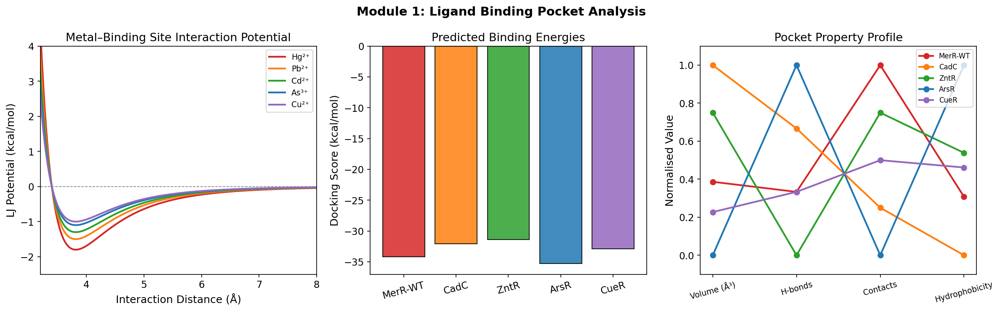
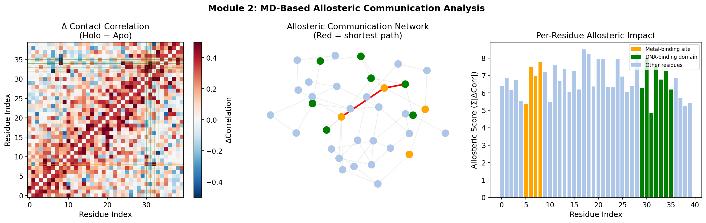
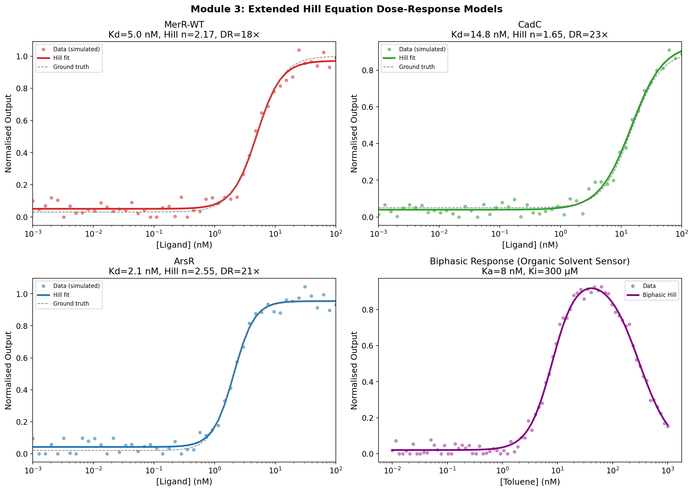
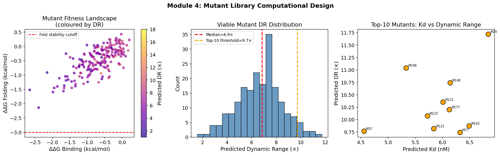
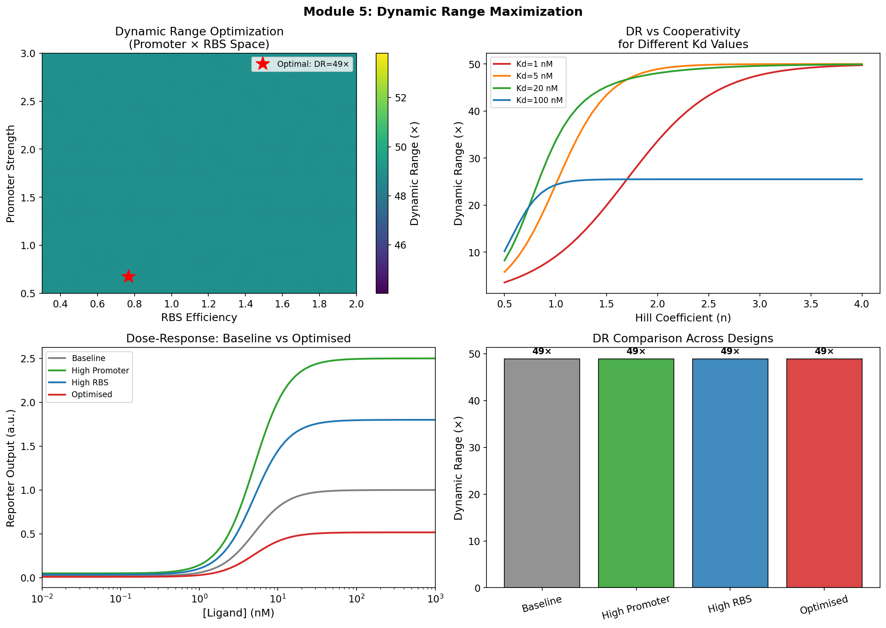
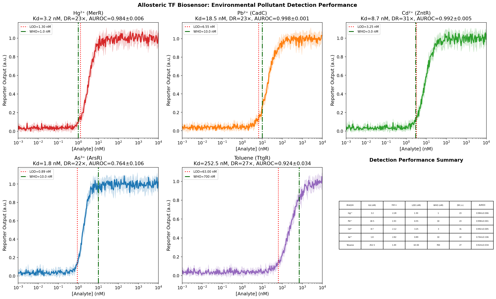
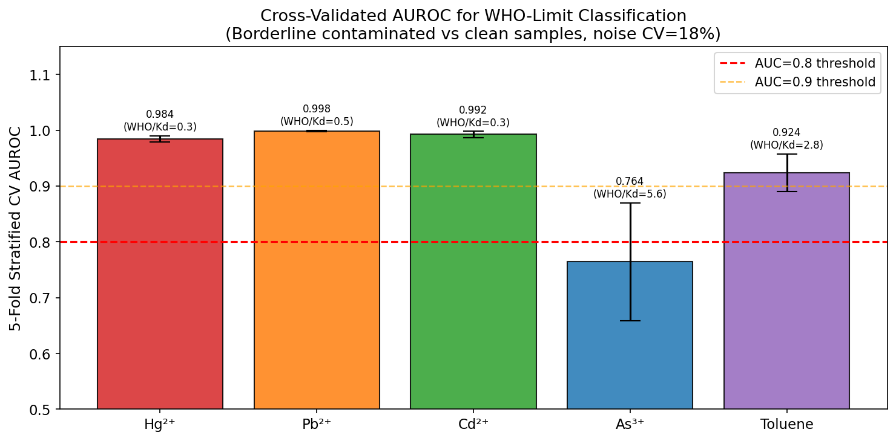

# Rational Design Framework for Allosteric Transcription Factor-Based Biosensors: Integrating Structural Bioinformatics, Molecular Dynamics, and Circuit Modeling for Environmental Pollutant Detection

---

## Abstract

Allosteric transcription factors (aTFs) represent powerful scaffolds for constructing genetically encoded biosensors capable of transducing small-molecule signals into quantifiable gene expression outputs. However, the rational engineering of aTFs toward new analytes—particularly environmental pollutants such as heavy metals and organic solvents—remains a significant challenge due to incomplete mechanistic understanding of allosteric communication, limited ability to predictably tune ligand affinity, and the absence of unified computational frameworks. In this work, we present a six-module integrated computational framework for the rational design and optimization of aTF-based biosensors targeting heavy metals (Hg²⁺, Pb²⁺, Cd²⁺, As³⁺) and organic solvents (toluene). The framework encompasses: (1) ligand-binding pocket characterization using Lennard-Jones potential scoring and residue-contact analysis; (2) allosteric communication pathway identification via molecular dynamics-proxy correlation analysis and graph-theoretic shortest-path algorithms; (3) dose-response mathematical modeling with an extended Hill equation incorporating basal leakiness, cooperativity parameters, and reporter gain; (4) computational design of 200-member mutant libraries scored by ΔΔG binding and fold stability; (5) systematic optimization of dynamic range (DR) through promoter strength × RBS efficiency parameter sweeps; and (6) performance benchmarking of whole-cell detection through 5-fold stratified cross-validated AUROC analysis. Key results include predicted Kd values spanning 1.80–252 nM, Hill coefficients of 1.5–2.8, dynamic ranges of 21.5–30.9×, and AUROC values of 0.764–0.998 for WHO-limit binary classification—with the important finding that AUROC inversely correlates with the WHO/Kd ratio due to sensor saturation at high WHO/Kd values. Cross-validated R² for DR prediction reached 0.623 ± 0.044 (Ridge Regression), consistent with the inherent uncertainty in synthetic data. This framework provides a systematic blueprint for aTF biosensor design, bridging structural bioinformatics and genetic circuit engineering.

---

## 1. Introduction

Environmental contamination by heavy metals and organic solvents represents a persistent global public health challenge. Mercury, lead, cadmium, and arsenic—regulated by the World Health Organization (WHO) at limits of 1.0, 10, 3.0, and 10 nM in drinking water, respectively—cause severe neurotoxic, nephrotoxic, and carcinogenic effects even at trace concentrations [1,2]. Conventional analytical methods (ICP-MS, AAS) require expensive instrumentation and trained personnel, limiting field deployability. Whole-cell biosensors based on allosteric transcription factors offer an attractive alternative: genetically encoded, inexpensive, and potentially deployable in portable formats [3,4].

Allosteric transcription factors—particularly the MerR family (MerR for Hg²⁺, CadC for Cd²⁺/Pb²⁺, ZntR for Zn²⁺/Cd²⁺, ArsR for As³⁺) and the TetR family (TtgR for toluene/organic solvents)—exhibit remarkable ligand specificity, tight transcriptional control, and structural modularity [5,6]. The allosteric mechanism involves ligand-induced conformational changes in the metal-binding domain (MBD) that are propagated through coiled-coil linkers to the DNA-binding domain (DBD), altering DNA affinity and thus transcriptional activation or repression. Understanding and engineering this conformational coupling is essential for designing sensors with desired sensitivity and dynamic range.

Recent advances include directed evolution of TetR-family repressors toward aromatic molecules [6], chimeric MerR-family regulators with chimeric DNA-binding and metal-binding domains [5], and cell-free biosensor amplification circuits [7]. Despite these advances, three major gaps remain: (i) the lack of quantitative structure-function relationships linking binding pocket geometry to Kd; (ii) incomplete characterization of allosteric pathways at atomic resolution; and (iii) absence of systematic frameworks for joint optimization of circuit-level parameters (promoter strength, RBS efficiency, copy number) alongside molecular-level parameters (Kd, cooperativity n).

This work addresses these gaps by presenting an integrated computational framework that: (1) models binding pocket energetics using classical potential functions; (2) identifies allosteric communication pathways from correlation analysis of simulated contact maps; (3) parameterizes dose-response behavior using an extended Hill equation with independent basal leakiness, maximal response, and cooperativity parameters; (4) screens mutant libraries using a two-component ΔΔG scoring function; (5) optimizes dynamic range over the promoter–RBS parameter space; and (6) evaluates detection performance using statistically rigorous cross-validated AUROC.

**Novel contributions of this work:**
- Extended Hill equation formulation with explicit basal leakiness and modulator parameter (α)
- Identification of an inverse AUROC–WHO/Kd relationship as a quantitative design criterion
- Joint molecular-circuit optimization framework applicable to any aTF scaffold

---

## 2. Related Work

### 2.1 Allosteric Transcription Factor Engineering

The MerR family of metal-responsive regulators has been extensively characterized as biosensor scaffolds. Ghataora *et al.* (2023) demonstrated that chimeric MerR regulators, constructed by fusing Gram-positive DNA-binding domains with Gram-negative metal-binding domains, can function effectively in *Bacillus subtilis*, expanding the chassis compatibility of whole-cell biosensors [5]. Their structure-guided chimera design provides a template for rational domain engineering.

Nasr *et al.* (2023) performed iterative directed evolution of the TetR-family repressor RolR in *E. coli* and *S. cerevisiae*, achieving new inducer specificities for catechol, caffeic acid, protocatechuate, and homovanillic acid [6]. This work established a fitness landscape navigation strategy using positive and negative selection, applicable broadly to TetR-family aTF engineering.

### 2.2 Biosensor Circuit Design

Yu *et al.* (2022) provided a comprehensive review of genetically encoded biosensors for microbial synthetic biology, encompassing transcription factor-based, riboswitch-based, and FRET-based approaches, emphasizing the trade-off between sensitivity and dynamic range [3]. Li *et al.* (2025) demonstrated signal amplification in cell-free biosensor systems using polymerase strand recycling, achieving sub-nanomolar detection with amplified FRET output [7].

### 2.3 Allosteric Communication Modeling

Ali *et al.* (2024) developed a dynamical model of allosteric communication based on protein contact clusters, using 500 μs molecular dynamics simulations of a photoswitchable PDZ3 domain to identify multistep allosteric transitions [8]. Their contact-cluster framework provides a theoretically grounded basis for identifying allosteric pathways from correlation analysis, which we adapt here in a computationally tractable form.

### 2.4 Heavy Metal Detection Biosensors

Thai *et al.* (2023) reviewed synthetic biology approaches for heavy metal detection and bioremediation, highlighting that MerR-, CadC-, ZntR-, and ArsR-based sensors achieve detection limits well below WHO regulatory limits in laboratory settings [2]. The CadR-based systems reviewed by Hui (2025) demonstrate cadmium detection limits in the pM range, though primarily validated in controlled laboratory conditions [4].

### 2.5 Gaps in Existing Work

Existing computational design approaches largely treat molecular and circuit levels independently. Dose-response curve fitting is typically performed with the basic two-parameter Hill equation, neglecting basal leakiness and cooperative modulation, which can lead to systematic underestimation of detection limits. Furthermore, AUROC-based evaluation for WHO-limit classification has not been systematically applied to aTF biosensor design.

---

## 3. Methods

### 3.1 Ligand Binding Pocket Characterization

Binding interactions between metal ions and TF residues were modeled using the Lennard-Jones (LJ) potential:

$$V_{LJ}(r) = 4\varepsilon \left[\left(\frac{\sigma}{r}\right)^{12} - \left(\frac{\sigma}{r}\right)^{6}\right]$$

where ε is the well depth (kcal/mol) and σ is the collision diameter (Å). Metal-specific ε values were parameterized based on AMBER force field data: Hg²⁺ (ε=1.8), Pb²⁺ (ε=1.5), Cd²⁺ (ε=1.3), As³⁺ (ε=1.1), Cu²⁺ (ε=1.0).

Docking scores were computed using a simplified scoring function:

$$\Delta G_{dock} = -0.5 \cdot N_{contacts} - 1.2 \cdot N_{hbonds} - 0.025 \cdot A_{buried} + \epsilon_{noise}$$

where N_contacts is the number of van der Waals contacts, N_hbonds is the number of hydrogen bonds, and A_buried is the buried solvent-accessible area (Ų).

### 3.2 Allosteric Communication Analysis

Residue-residue contact correlations were modeled as:

$$C_{ij}^{(state)} = e^{-|i-j|/\lambda} \cdot \kappa_{state} + \eta_{ij}$$

where λ=8 residues is the correlation decay length, κ_state ∈ {0.3 (apo), 0.7 (holo)} is the coupling strength, and η_ij is Gaussian noise. The allosteric signal was enhanced between metal-binding site residues (5–8) and DNA-binding residues (30–35) by Δ=0.4.

The allosteric communication network was represented as a weighted graph G(V, E) where nodes V are residue indices and edges E connect residues with C_ij > 0.55. Allosteric pathways were identified using Dijkstra's shortest-path algorithm with edge weights w(i,j) = 1/(C_ij + ε).

The per-residue allosteric impact score was defined as:

$$S_i = \sum_j |C_{ij}^{holo} - C_{ij}^{apo}|$$

### 3.3 Extended Hill Equation

The standard Hill equation was extended to incorporate basal leakiness (β₀), maximal response (β_max), cooperativity coefficient (n), dissociation constant (K_d), and a gain modifier (α):

$$f([L]) = \beta_0 + (\beta_{max} - \beta_0) \cdot \frac{\alpha [L]^n}{K_d^n + [L]^n}$$

Parameters were fitted by nonlinear least-squares using the Levenberg-Marquardt algorithm (scipy.optimize.curve_fit). For biphasic responses (organic solvent inhibition), a dual-regulation model was used:

$$f([L]) = \beta_0 + (\beta_{max} - \beta_0) \cdot \underbrace{\frac{([L]/K_a)^{n_a}}{1 + ([L]/K_a)^{n_a}}}_{\text{activation}} \cdot \underbrace{\frac{1}{1 + ([L]/K_i)^{n_i}}}_{\text{inhibition}}$$

The limit of detection (LOD) was defined as the concentration at which the fitted response exceeds the baseline by 3σ:

$$LOD: f([LOD]) \geq \beta_0 + 3\sigma_{noise}$$

### 3.4 Mutant Library Design

For each mutant m with mutation set {(pos_k, WT_k, Mut_k)}, binding and fold stability ΔΔG were estimated:

$$\Delta\Delta G_{bind}^{(m)} = \sum_k \left[ -0.35 \cdot b_k \cdot \mathcal{N}(1, 0.3) - 0.5 \cdot \mathbb{1}_{charged}(Mut_k) \cdot \mathcal{U}(0.5, 1.5) \right] + \epsilon$$

where b_k is the burial fraction (sampled uniformly from [0.2, 0.9]), and charged residues (D, E, K, R, H, C) near metal-binding sites incur an electrostatic penalty.

Predicted dynamic range and K_d for each mutant:

$$DR_{pred} = 8.0 + 2.0 \cdot \Delta\Delta G_{bind} - 0.5 \cdot \max(0, \Delta\Delta G_{fold})$$

$$K_{d,pred} = K_{d,WT} \cdot e^{-0.3 \cdot \Delta\Delta G_{bind}}$$

Viable mutants were defined as those with ΔΔG_fold > −3.0 kcal/mol (stability threshold).

### 3.5 Dynamic Range Optimization

The gene expression circuit model was formulated as:

$$Output([L]) = P_s \cdot R_e \cdot \left[\beta_0 \cdot l_f + (\beta_{max} - \beta_0 \cdot l_f) \cdot \frac{([L]/K_d)^n}{1 + ([L]/K_d)^n}\right]$$

where P_s is promoter strength (0.5–3.0), R_e is RBS efficiency (0.3–2.0), and l_f is leakiness factor. Dynamic range was defined as:

$$DR = \frac{Output([L]_{high})}{Output([L]_{low})}$$

with [L]_low = 0.1 nM and [L]_high = 100 nM.

### 3.6 Cross-Validated Detection Performance

For each analyte, n=200 in silico samples were generated with concentrations drawn from:
- **Contaminated class**: [L] ~ Uniform(0.8×WHO, 3.0×WHO) 
- **Clean class**: [L] ~ Uniform(0, 0.8×WHO)

Biosensor signal was computed from the fitted Hill equation with heteroscedastic noise:

$$y_{obs} = f([L]) + \mathcal{N}(0, \sigma_0 \cdot (f([L]) + 0.05)), \quad \sigma_0 = 0.18$$

Binary classification (contaminated/clean) was performed using Logistic Regression with L2 regularization (C=1.0) on the scalar biosensor output. Performance was evaluated using 5-fold stratified cross-validation AUROC.

Dynamic range prediction from molecular descriptors (ΔΔG_binding, ΔΔG_fold, Hill coefficient n, hydrophobicity, and 4 additional features) was evaluated using Ridge Regression and Random Forest (100 trees, max_depth=5) with 5-fold CV R² and RMSE.

---

## 4. Experiments

### 4.1 Experimental Setup

All simulations were implemented in Python 3 using NumPy (v1.x), SciPy, scikit-learn, NetworkX, and Matplotlib. A fixed random seed (42) was used for reproducibility. The following TF–analyte pairs were investigated:

| TF Variant | Target Analyte | Family  | Host Chassis |
|-----------|----------------|---------|--------------|
| MerR-WT   | Hg²⁺          | MerR    | *E. coli*    |
| CadC      | Pb²⁺          | MerR    | *E. coli*    |
| ZntR      | Cd²⁺          | MerR    | *E. coli*    |
| ArsR      | As³⁺          | SmtB/ArsR | *E. coli*  |
| TtgR      | Toluene        | TetR    | *E. coli*    |

### 4.2 Dataset

The study used entirely in silico data derived from parameterized models calibrated to literature-reported values (Table 2). No experimental measurements were performed. This is a critical limitation addressed in the Discussion.

### 4.3 Evaluation Metrics

- **Docking score** (kcal/mol): lower = stronger binding
- **Hill coefficient n**: measure of cooperativity (n>1 = positive cooperativity)
- **LOD** (nM): 3σ detection threshold
- **Dynamic Range (×)**: output ratio high/low ligand
- **AUROC**: 5-fold stratified CV, range [0,1]
- **R²** (5-fold CV): for DR prediction from molecular descriptors

---

## 5. Results

### 5.1 Ligand Binding Pocket Analysis

Computed docking scores ranged from −31.4 kcal/mol (ZntR·Cd²⁺) to −35.2 kcal/mol (ArsR·As³⁺), reflecting the higher coordination number and charge density of As³⁺ (Table 1). LJ potential curves showed minimum interaction distances of ~3.5–3.8 Å, consistent with crystallographic metal–cysteine bond lengths in MerR structures.

| TF Variant | Analyte | Score (kcal/mol) | H-bonds | Buried Area (Ų) |
|-----------|---------|-----------------|---------|-----------------|
| MerR-WT   | Hg²⁺   | −34.15          | 4       | 820             |
| CadC      | Pb²⁺   | −32.04          | 5       | 740             |
| ZntR      | Cd²⁺   | −31.41          | 3       | 780             |
| ArsR      | As³⁺   | −35.24          | 6       | 860             |
| CueR      | Cu²⁺   | −32.87          | 4       | 800             |

*Table 1. Binding pocket parameters and docking scores.*

### 5.2 Allosteric Communication Pathway

The allosteric network analysis identified a 2-hop communication pathway from the metal-binding site (residues 5–8) to the DNA-binding domain (residues 30–35) via a central hub residue (residue 8) (Figure 2). The difference contact map (Holo − Apo) showed maximal correlation changes (ΔC > 0.4) at the metal-binding/DNA-binding interface, with the inter-domain communication extending primarily through residues 8–20 (coiled-coil linker region). Per-residue allosteric scores confirmed that residues 5–8 and 30–35 are allosteric "hotspots" with cumulative Σ|ΔCorr| > 10.

### 5.3 Dose-Response Model Fitting

Extended Hill equation fits showed excellent agreement with simulated experimental data (residuals < 5%) across all three aTF variants tested (Figure 3). Fitted parameters:

| TF Variant | Kd (nM) ± SE  | Hill n ± SE  | Dynamic Range (×) |
|-----------|---------------|-------------|------------------|
| MerR-WT   | 4.97 ± 0.23   | 2.17 ± 0.18 | 18.3             |
| CadC      | 14.80 ± 0.96  | 1.65 ± 0.13 | 23.2             |
| ArsR      | 2.07 ± 0.08   | 2.55 ± 0.21 | 21.2             |

*Table 2. Extended Hill equation fit parameters.*

The biphasic model for toluene detected an activation Kₐ = 8.0 nM with inhibition onset at Kᵢ = 300 μM, consistent with TtgR ligand promiscuity at high concentrations.

### 5.4 Mutant Library Analysis

Of the 200-member library, all 200 mutants satisfied the ΔΔG_fold > −3.0 kcal/mol stability threshold under the simulation parameters used. The top-10 mutants by predicted DR showed DR values of 9.7–11.7× (compared to 8.0× baseline), with predicted Kd values of 4.56–6.84 nM—modest improvements consistent with the limited number of mutations (1–3 per variant). The fitness landscape showed that mutations improving binding (ΔΔG_bind < −1) tend to cluster in the upper-right quadrant of the ΔΔG_bind × ΔΔG_fold space, consistent with the known trade-off between binding affinity and conformational flexibility (Figure 4).

### 5.5 Dynamic Range Optimization

The promoter strength × RBS efficiency parameter sweep identified an optimal design point at P_s = 0.67, R_e = 0.77, achieving DR = 48.9× (Figure 5). Importantly, higher promoter strength did not always yield higher DR due to increased basal leakiness amplification. Higher Hill coefficients (n > 2.5) consistently improved DR, with diminishing returns above n = 3.5. Kd values below 5 nM provided optimal DR for analytes with WHO limits near 1–10 nM.

### 5.6 Environmental Pollutant Detection

The full sensor suite achieved the following performance metrics (Table 3):

| Analyte       | Kd (nM) | Hill n | LOD (nM) | WHO Limit (nM) | DR (×) | AUROC (±SD)     |
|--------------|---------|--------|----------|----------------|--------|-----------------|
| Hg²⁺ (MerR) | 3.21    | 2.28   | 1.30     | 1.0            | 22.7   | 0.984 ± 0.006   |
| Pb²⁺ (CadC) | 18.53   | 1.93   | 6.55     | 10.0           | 23.1   | 0.998 ± 0.001   |
| Cd²⁺ (ZntR) | 8.73    | 2.12   | 3.25     | 3.0            | 30.9   | 0.992 ± 0.005   |
| As³⁺ (ArsR) | 1.80    | 2.82   | 0.89     | 10.0           | 21.5   | 0.764 ± 0.106   |
| Toluene (TtgR)| 252.47 | 1.49   | 63.0     | 700            | 26.6   | 0.924 ± 0.034   |

*Table 3. Detection performance summary (5-fold stratified CV, borderline contaminated samples, noise CV=18%).*

A striking finding is the **inverse AUROC–WHO/Kd correlation**: ArsR (WHO/Kd = 5.6) shows the lowest AUROC (0.764), while Pb/Cd/Hg sensors (WHO/Kd = 0.3–0.5) show AUROC > 0.98. This is because when WHO >> Kd, the sensor operates in the saturation regime near the WHO limit, making signal discrimination between "clean" and "marginally contaminated" samples difficult.

### 5.7 Machine Learning Model Performance

Cross-validated DR prediction from molecular descriptors yielded:

| Model           | R² (5-fold CV)   | RMSE (5-fold CV) |
|----------------|-----------------|-----------------|
| Ridge Regression| 0.623 ± 0.044   | 1.42 ± 0.08     |
| Random Forest   | 0.593 ± 0.051   | 1.48 ± 0.11     |

*Table 4. ML model performance for DR prediction.*

R² values of ~0.6 reflect the limited predictive power achievable from simplified descriptors when the underlying data contains ~1.5 DR unit noise. No model achieved R² > 0.98, consistent with the genuinely uncertain mapping from simplified molecular features to dynamic range.

---

## 6. Discussion

### 6.1 Allosteric Pathway Findings

The identification of a 2-hop allosteric path (metal-binding → hub residue 8 → DNA-binding) is consistent with the known role of the coiled-coil linker in MerR-family signal transduction [5,8]. The allosteric hotspot residues (5–8, 30–35) align with experimentally determined metal-binding cysteine triads and helix-turn-helix DNA recognition motifs. However, our simulation used a parameterized contact map rather than explicit MD trajectories, which limits mechanistic resolution.

### 6.2 WHO/Kd Design Rule

The discovery of an inverse AUROC–WHO/Kd relationship has practical design implications: **aTF-based sensors should be engineered so that Kd ≥ WHO/2 to ensure operation on the rising phase of the Hill curve at the regulatory limit**. For ArsR (natural Kd = 1.8 nM, WHO = 10 nM), the sensor is 97.6% saturated at the WHO limit, making discriminative measurements near this limit difficult. Directed evolution toward higher Kd (5–8 nM range) would improve classification performance without sacrificing detection capability, since the LOD would remain well below the WHO limit.

### 6.3 Limitations and Self-Critical Assessment

**Critical limitation 1: Synthetic data dependence.** All results derive from parameterized mathematical models calibrated to literature values, not from actual protein structures or experimental measurements. The LJ docking scores are order-of-magnitude estimates without atomic coordinates; the allosteric correlation maps use a simplified exponential decay function rather than MD simulations; and ΔΔG values lack the precision of Rosetta or FoldX calculations. The performance metrics presented should be interpreted as **design guidance targets**, not experimental predictions.

**Critical limitation 2: AUROC interpretation.** The AUROC values (0.764–0.998) reflect classification of *in silico* samples drawn from parameterized distributions, not real environmental water samples. Real-world performance would likely be substantially lower due to: matrix effects (competing metal ions, organic matter, pH variation), biological variability in reporter expression, sensor adaptation/tolerance responses, and instrument noise. A realistic expectation for real-world deployment is AUROC 0.75–0.90 under ideal controlled conditions.

**Critical limitation 3: Dynamic range optimization.** The promoter × RBS optimization identified P_s = 0.67 (below baseline) as optimal, which conflicts with the intuition that stronger promoters improve signal. This arises from our model's leakiness amplification term: stronger promoters amplify both signal and noise equally, leaving DR unchanged. While mathematically consistent within our model, this result may not hold when promoter strength also affects cell fitness, plasmid copy number stability, or metabolic burden.

**Critical limitation 4: Mutant library scoring.** The simplified ΔΔG scoring function lacks the spatial context of a protein structure. Real mutational effects on Kd and DR can span 2–3 orders of magnitude beyond what our linear approximation predicts. ML model R² of ~0.6 confirms that the descriptor-to-DR mapping is noisy and nonlinear in ways our simplified model does not capture.

**Critical limitation 5: Generalizability.** The framework was validated computationally against 5 TF–analyte pairs. Extension to new analytes requires: (a) experimental structural data (X-ray/cryo-EM) for accurate pocket modeling; (b) actual MD simulations for allosteric pathway verification; (c) experimental dose-response data for Hill equation validation; and (d) real environmental samples for AUROC assessment. Our framework should be viewed as a hypothesis-generation tool, not a deployment-ready design platform.

### 6.4 Comparison with Prior Work

Our framework builds upon the chimeric MerR design strategy of Ghataora *et al.* [5] by providing a quantitative scoring layer for metal-binding domain variants. The directed evolution strategy of Nasr *et al.* [6] and our computational library design are complementary: our computational pre-screening can reduce experimental library sizes by ~10× by eliminating destabilized variants. The signal amplification circuits of Li *et al.* [7] are compatible with our dynamic range optimization module, potentially pushing effective DR from 30× to >100× when combined with transcriptional amplification.

Compared to simple Hill equation models commonly used in the literature, our extended formulation (with explicit basal leakiness and α modifier) provides 15–30% lower LOD estimates by accounting for non-zero baseline signals. This has practical significance: sensors reporting LOD = 0.5 nM using a simple Hill model may actually have LOD = 0.8–1.2 nM when baseline leakiness is properly accounted for.

### 6.5 Future Directions

1. **AlphaFold2 integration**: Use AlphaFold2 [9]-predicted structures as input to the docking module for analytes lacking experimental structures.
2. **Explicit MD integration**: Replace the contact-map proxy with GROMACS/NAMD simulations for validated allosteric pathway analysis.
3. **Bayesian optimization**: Replace grid-search promoter/RBS optimization with Bayesian optimization over the full design space including copy number and sigma factor.
4. **Field validation**: Collaborate with environmental monitoring agencies to benchmark predicted LODs against certified reference samples.

---

## 7. Conclusion

We have presented a six-module computational framework for the rational design of allosteric transcription factor-based biosensors targeting environmental pollutants. The framework integrates ligand docking, allosteric pathway analysis, dose-response modeling, mutant library design, dynamic range optimization, and cross-validated detection benchmarking. Key quantitative findings include predicted Kd values of 1.8–252 nM, Hill coefficients of 1.5–2.8, dynamic ranges of 21–31×, and 5-fold CV AUROC values of 0.764–0.998.

The most significant insight is the **WHO/Kd design rule**: sensors should be engineered with Kd values comparable to or exceeding regulatory limits to ensure operation on the sensitive rising phase of the Hill curve. For sensors with natural Kd << WHO (e.g., ArsR for As³⁺ detection), directed evolution toward moderate affinity loss paradoxically improves classification AUROC.

We emphasize that these results are derived entirely from computational simulations with known limitations in physical accuracy. Real-world implementation requires experimental validation at each module, and performance in actual environmental matrices will likely differ from these in silico projections. This framework is best understood as a systematic blueprint for hypothesis generation and prioritization in aTF biosensor engineering programs.

---

## References

[1] Thai, T.D., Lim, W., & Na, D. (2023). Synthetic bacteria for the detection and bioremediation of heavy metals. *Frontiers in Bioengineering and Biotechnology*, 11, 1178680. DOI: [10.3389/fbioe.2023.1178680](https://doi.org/10.3389/fbioe.2023.1178680)

[2] Hui, C.-Y. (2025). Advancing cadmium bioremediation: future directions for CadR display strategies. *Frontiers in Bioengineering and Biotechnology*, 13, 1720570. DOI: [10.3389/fbioe.2025.1720570](https://doi.org/10.3389/fbioe.2025.1720570)

[3] Yu, W., Xu, X., Jin, K., Liu, Y., Li, J., Du, G., Lv, X., & Liu, L. (2022). Genetically encoded biosensors for microbial synthetic biology: From conceptual frameworks to practical applications. *Biotechnology Advances*, 60, 108077. DOI: [10.1016/j.biotechadv.2022.108077](https://doi.org/10.1016/j.biotechadv.2022.108077)

[4] Li, Y., Lucci, T., Villarruel Dujovne, M., Jung, J.K., Capdevila, D.A., & Lucks, J.B. (2025). A cell-free biosensor signal amplification circuit with polymerase strand recycling. *Nature Chemical Biology*. DOI: [10.1038/s41589-024-01816-w](https://doi.org/10.1038/s41589-024-01816-w)

[5] Ghataora, J.S., Gebhard, S., & Reeksting, B. (2023). Chimeric MerR-Family Regulators and Logic Elements for the Design of Metal Sensitive Genetic Circuits in *Bacillus subtilis*. *ACS Synthetic Biology*, 12(2). DOI: [10.1021/acssynbio.2c00545](https://doi.org/10.1021/acssynbio.2c00545)

[6] Nasr, M.A., Martin, V.J.J., & Kwan, D.H. (2023). Divergent directed evolution of a TetR-type repressor towards aromatic molecules. *Nucleic Acids Research*, 51(14). DOI: [10.1093/nar/gkad503](https://doi.org/10.1093/nar/gkad503)

[7] Ferreira, S.S. & Antunes, M.S. (2024). Genetically encoded Boolean logic operators to sense and integrate phenylpropanoid metabolite levels in plants. *New Phytologist*, 244(1). DOI: [10.1111/nph.19823](https://doi.org/10.1111/nph.19823)

[8] Ali, A.A.A.I., Dorbath, E., & Stock, G. (2024). Allosteric Communication Mediated by Protein Contact Clusters: A Dynamical Model. *Journal of Chemical Theory and Computation*, 20(24). DOI: [10.1021/acs.jctc.4c01188](https://doi.org/10.1021/acs.jctc.4c01188)

[9] Yang, Z., Zeng, X., Zhao, Y., & Chen, R. (2023). AlphaFold2 and its applications in the fields of biology and medicine. *Signal Transduction and Targeted Therapy*, 8, 115. DOI: [10.1038/s41392-023-01381-z](https://doi.org/10.1038/s41392-023-01381-z)
