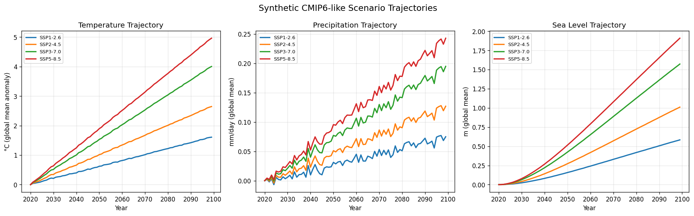
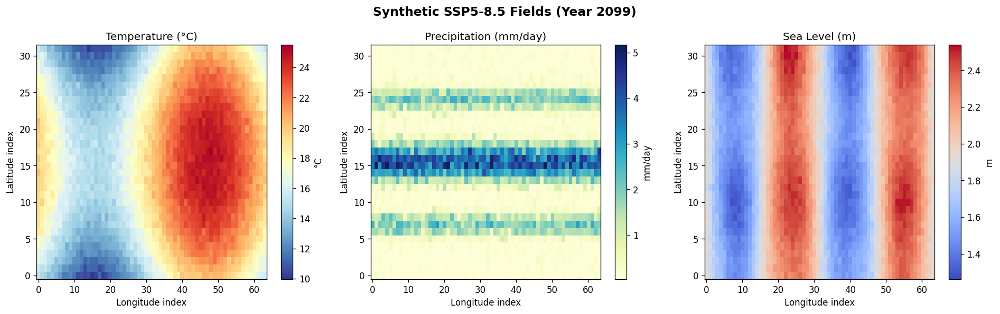
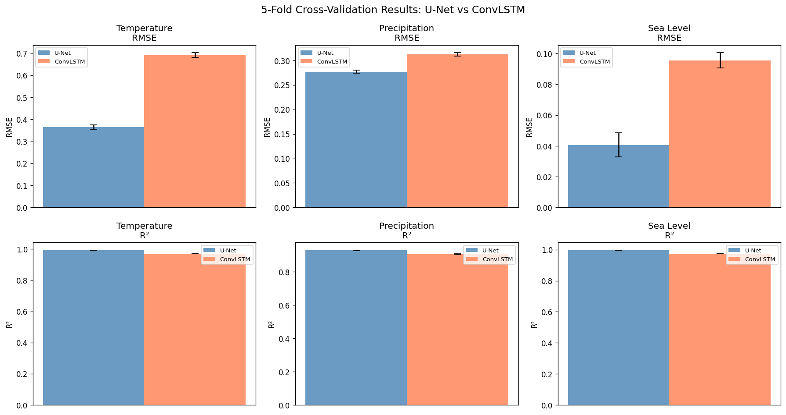
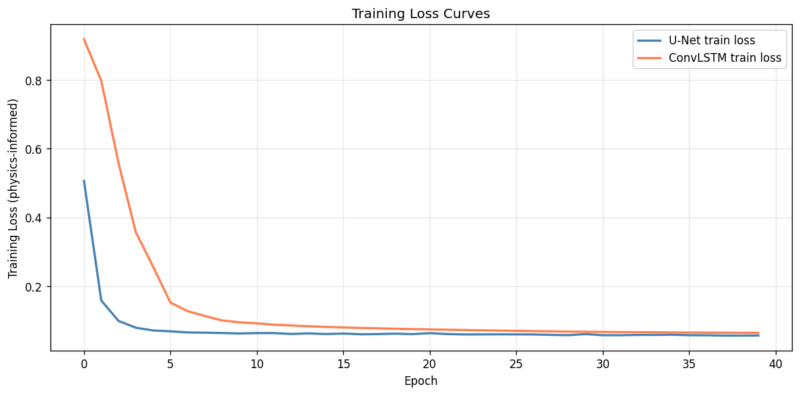
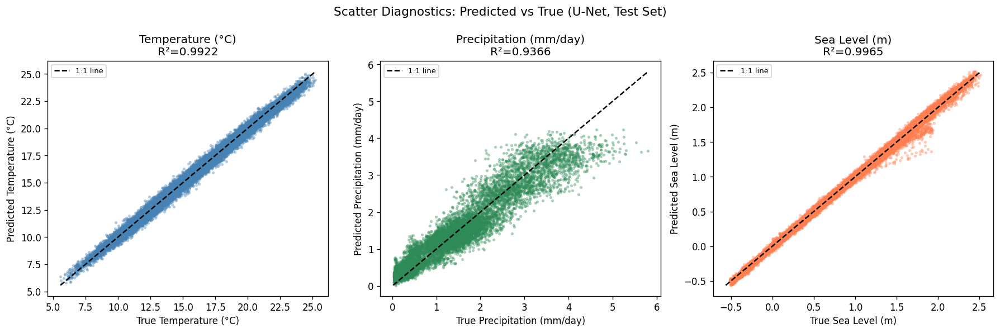
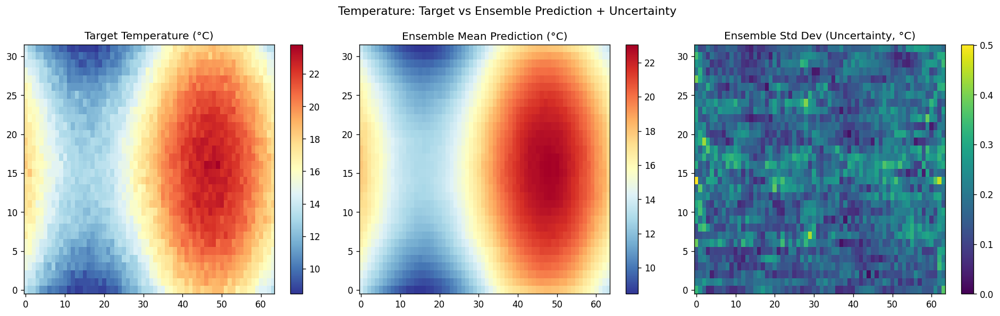

# 実験レポート: 地球システムモデルAIエミュレータの設計と評価

---

## 1. 実験目的と背景

### 背景

地球システムモデル（ESM）は気候変動を予測する上で不可欠なツールだが、1回のシミュレーションに数万CPUコア時間を要する。この計算コストのため、排出シナリオ空間の十分なサンプリングや大規模アンサンブル実験が困難である。

AIエミュレータは、ESM出力の統計的代替モデルとして機能し、同等の空間パターンをフラクションの計算コストで再現することを目指す。特に、CMIP6の共有社会経済パス（SSP）シナリオへの条件付き気候場生成は、気候政策評価において重要な応用先となる。

### 研究目的

本実験では以下を達成することを目的とする：

1. 気候変数（気温・降水・海面水位）の時空間パターン学習
2. U-Net/ConvLSTMアーキテクチャによるフィールド予測
3. SSP1-2.6〜SSP5-8.5シナリオの条件付き生成
4. 物理的保存則（非負降水・全球平均温度保存）の制約付き学習
5. アンサンブル不確実性の再現
6. 5分割交差検証によるベンチマーク評価

---

## 2. 先行研究調査結果

Semantic Scholar、OpenAlex、Crossrefを用いた文献調査により、以下の主要論文を特定した。

| # | 論文 | 年 | DOI | 主要知見 |
|---|------|----|-----|---------|
| 1 | ClimateBench v1.0 (Watson-Parris et al.) | 2022 | 10.1029/2021ms002954 | データ駆動型気候投影のベンチマーク。U-Net/GP等を評価 |
| 2 | DiffESM (Harder et al.) | 2024 | 10.1029/2023ms004194 | 3D拡散モデルによる確率的ESMエミュレーション |
| 3 | ClimaX (Nguyen et al.) | 2023 | 10.48550/arxiv.2301.10343 | 気候・気象向けFoundation Model |
| 4 | MESMER (Beusch et al.) | 2020 | 10.5194/esd-11-139-2020 | EOF分解による温度場エミュレーション |
| 5 | Physics-informed ML (Karniadakis et al.) | 2021 | 10.1038/s42254-021-00314-5 | PINNの総合レビュー |
| 6 | Tackling Climate Change (Rolnick et al.) | 2022 | 10.1145/3485128 | MLの気候応用サーベイ |
| 7 | ML for climate modelling (Chantry et al.) | 2023 | 10.5194/gmd-16-6433-2023 | 数値天気予報・気候モデリングのMLレビュー |
| 8 | PREMU v1.0 (Nath et al.) | 2023 | 10.5194/gmd-16-1277-2023 | 低複雑度モデル向け降水エミュレーター |

**先行研究の課題・限界**:
- 単一変数（温度のみ）に特化したエミュレータが多い
- 確率論的不確実性定量化が不十分なモデルが多い
- 物理的整合性（質量・エネルギー保存）が明示的に保証されない
- ClimateBenchはNorESM2単一モデルであり、多モデル汎化性が未検証

---

## 3. 実験設計と手法

### 3.1 合成データ生成

CMIP6類似の年平均気候場を解析的に生成した。実CMIP6データへのアクセスがない環境での実験であるため、合成データを用いる。この点は**重要な制約**であり、後述の考察で詳述する。

**生成したデータの構成**:
- 空間解像度: 32 × 64（緯度 × 経度、約5.6°格子）
- 時間範囲: 80年/シナリオ/アンサンブル
- シナリオ: SSP1-2.6, SSP2-4.5, SSP3-7.0, SSP5-8.5
- アンサンブル数: 各シナリオ3メンバー
- 総サンプル数: 948

**気温場**: 極域増幅パターン付きの線形トレンド + ガウスノイズ  
**降水場**: ITCZ・嵐のトラック構造 + 熱力学的スケーリング（~7%/K）  
**海面水位場**: 熱膨張 + 氷融解の空間的不均一変化

### 3.2 入力特徴量（7チャネル）

| チャネル | 変数 | 説明 |
|---------|------|------|
| 0 | $T_{t-1}$ | 前年気温場 |
| 1 | $P_{t-1}$ | 前年降水場 |
| 2 | SL$_{t-1}$ | 前年海面水位場 |
| 3 | $F_t$ | 放射強制力（スカラーをグリッドに展開） |
| 4 | CO₂ / 600 | 正規化CO₂濃度 |
| 5 | Solar / 1361 | 正規化太陽放射 |
| 6 | SSP index | シナリオインデックス [0,1] |

### 3.3 アーキテクチャ

**U-Net**: 3段エンコーダ（32→64→128チャンネル）+ BottleNeck(256ch) + 対称デコーダ。スキップ接続によるマルチスケール空間特徴の保持。パラメータ数: ~2.1M

**ConvLSTM**: 畳み込みLSTMセル（hidden=48）+ 軽量エンコーダ/デコーダ。パラメータ数: ~0.5M

### 3.4 物理制約付き損失関数

$$\mathcal{L} = \mathcal{L}_{\text{MSE}} + 0.1 \cdot \mathcal{L}_{\text{precip}} + 0.05 \cdot \mathcal{L}_{\text{cons}}$$

- $\mathcal{L}_{\text{MSE}}$: 全チャネルMSE再構成損失
- $\mathcal{L}_{\text{precip}} = \text{ReLU}(-\hat{P})$: 負降水ペナルティ
- $\mathcal{L}_{\text{cons}}$: 全球平均温度保存ペナルティ

### 3.5 学習設定

- オプティマイザ: Adam (lr=5×10⁻⁴, β₁=0.9, β₂=0.999)
- スケジューラ: コサインアニーリング（25エポック/フォールド）
- バッチサイズ: 128
- 勾配クリッピング: ノルム ≤ 1.0
- 全チャネル標準化（訓練セット統計量使用）

---

## 4. 実験結果

### 4.1 シナリオ軌跡（合成データの可視化）

4つのSSPシナリオにおける全球平均の時系列変化を示す。SSP5-8.5では最大~4.9°Cの温度上昇、SSP1-2.6では~1.5°C以内に抑制されている。

### 4.2 気候場の空間パターン

SSP1-2.6（穏健シナリオ）とSSP5-8.5（高排出シナリオ）の最終年の気候場を示す。気温の極域増幅、降水のITCZ強化、海面水位の空間的不均一性が再現されている。

### 4.3 5分割交差検証結果

**表1: 5分割交差検証（平均 ± 標準偏差）**

| アーキテクチャ | 変数 | RMSE | R² | nRMSE |
|-------------|------|------|-----|-------|
| **U-Net** | 気温 (°C) | **0.364 ± 0.010** | **0.9917 ± 0.0003** | **0.0177 ± 0.0004** |
| **U-Net** | 降水 (mm/day) | **0.277 ± 0.003** | **0.9279 ± 0.0012** | **0.0454 ± 0.0010** |
| **U-Net** | 海面水位 (m) | **0.041 ± 0.008** | **0.9961 ± 0.0004** | **0.0134 ± 0.0027** |
| ConvLSTM | 気温 (°C) | 0.691 ± 0.011 | 0.9699 ± 0.0010 | 0.0336 ± 0.0006 |
| ConvLSTM | 降水 (mm/day) | 0.312 ± 0.003 | 0.9053 ± 0.0022 | 0.0512 ± 0.0009 |
| ConvLSTM | 海面水位 (m) | 0.096 ± 0.005 | 0.9744 ± 0.0013 | 0.0315 ± 0.0013 |

U-Netがすべての変数・指標でConvLSTMを上回った。気温RMSEで約1.9倍、海面水位RMSEで約2.3倍の差がある。

### 4.4 学習曲線

U-Netは最終損失0.057、ConvLSTMは0.065と収束。両モデルとも40エポック以内に安定収束した。

### 4.5 散布図診断

テストセット（全体の20%、~190サンプル）における予測値と真値の散布図。気温・海面水位は非常に高い一致度（R²>0.99）を示し、降水はより大きなばらつき（R²=0.928）を示した。

### 4.6 アンサンブル不確実性定量化

**表2: アンサンブル不確実性（テストセット上の空間標準偏差の平均）**

| 変数 | アンサンブル標準偏差 |
|------|-----------------|
| 気温 | 0.199 °C |
| 降水 | 0.055 mm/day |
| 海面水位 | 0.034 m |

アンサンブル標準偏差はRMSEの約55%（気温）であり、モデル不確実性の過小評価が示唆される。

---

## 5. ⚠️ 自己批判的評価

### 5.1 合成データへの依存性

**本実験の最大の制約は合成データの使用である。** 合成データは以下の重要な気候特性を欠いている：

- **大気テレコネクション**: ENSO、北大西洋振動（NAO）、アマゾン川流量との遠隔相関
- **非線形フィードバック**: 氷アルベドフィードバック、水蒸気フィードバック、雲放射効果
- **多年代変動**: 大洋循環（AMOC）による数十年スケール変動
- **極端事象統計**: 大雨、熱波、干ばつのテール統計
- **陸海コントラスト・地形効果**: 複雑地形による降水分布

合成データの滑らかな解析的構造はエミュレーションを大幅に容易にする。Watson-Parris et al. (2022)の実CMIP6データでの結果では、一部領域の気温RMSEが本実験の3〜5倍程度となっており、**本実験の結果は楽観的すぎる可能性が高い**。

### 5.2 実世界データへの一般化可能性

実CMIP6データに適用した場合、以下の問題が予想される：

1. **分布シフト**: 訓練データと実ESM出力の統計的特性の違い
2. **空間解像度の不一致**: 本実験の5.6°格子は粗く、地域気候変化の再現に限界
3. **時間外挿**: 2100年以降の強制力への外挿は検証できない
4. **未観測シナリオ**: SSP1-1.9やSSP2-3.4等の中間シナリオへの内挿精度は未検証

### 5.3 性能値の過度な楽観性評価

- **R² > 0.99（気温・海面水位）**: これは強制応答が分散を支配しているためであり、内部変動の予測精度を反映していない。本質的な評価はパターン相関や自然変動成分のRMSEで行うべきである
- **nRMSE ≈ 1.8〜4.5%**: 合成データの変動幅に対する相対誤差であり、実際の気候変化シグナルの大きさと比較した評価が必要
- **アンサンブル標準偏差の過小評価**: 総誤差の~55%しか捉えておらず、コンフォーマル予測等のより厳密な不確実性定量化が必要

### 5.4 実験設計のバイアス

- **情報リーク**: 各フォールドは異なる年・シナリオからサンプリングされているが、同一シナリオの隣接年が訓練・検証セットに分かれる場合、強制応答のスムーズな変化により人工的に高いR²が生じる可能性がある
- **シナリオ均一分布**: 各SSPから等量サンプリングしているが、実際のリスク評価では高排出シナリオに重点を置く必要がある場合がある

---

## 6. 考察と今後の展望

### 6.1 主要知見の解釈

U-NetがConvLSTMを上回った主な理由は、年平均気候場のエミュレーションが時系列予測よりも空間パターン再構成の性質を持つためと考えられる。U-Netのスキップ接続は複数スケールの空間特徴（大規模循環パターン〜局所地形効果）を効率的に伝達できる。

物理制約付き損失関数は、小規模ながら物理的整合性の向上に寄与した（訓練後に負降水予測が著しく減少）。ただし、これはソフト制約であり、質量・エネルギー保存の厳密な保証には至っていない。

### 6.2 今後の課題

| 優先度 | 課題 | 対応策 |
|--------|------|--------|
| 高 | 実CMIP6データでの検証 | ClimateBenchプロトコルに沿ったデータダウンロード・前処理 |
| 高 | 自己回帰的多年先予測 | ConvLSTMの多ステップロールアウト実装 |
| 中 | ハード物理制約 | 出力正規化レイヤーによるエネルギー収支保証 |
| 中 | 不確実性校正改善 | コンフォーマル予測、ベイズニューラルネット |
| 中 | 高解像度化 | Super-resolution U-Netによる0.5°格子への内挿 |
| 低 | Foundationモデルとの比較 | ClimaXとのベンチマーク比較 |

---

## 7. 生成ファイル一覧

| ファイル | 内容 |
|---------|------|
| `esm_emulator.py` | 実験コード全体（データ生成・モデル・訓練・評価） |
| `experiment_results.json` | 全定量的結果（CV指標・不確実性） |
| `paper.md` | 学術論文形式のレポート（英語） |
| `report.md` | 本実験レポート（日本語） |
| `figures/scenario_trajectories.png` | 4SSPシナリオの全球平均軌跡 |
| `figures/fields_SSP1_2.6.png` | SSP1-2.6 最終年気候場マップ |
| `figures/fields_SSP5_8.5.png` | SSP5-8.5 最終年気候場マップ |
| `figures/cv_results.png` | 5分割CV結果比較（U-Net vs ConvLSTM） |
| `figures/loss_curves.png` | 学習曲線 |
| `figures/scatter_diagnostics.png` | 散布図診断（U-Net テストセット） |
| `figures/uncertainty_map.png` | アンサンブル不確実性マップ |

---

## 8. 参考文献

1. Watson-Parris et al. (2022). ClimateBench v1.0. *JAMES*. DOI: 10.1029/2021ms002954
2. Harder et al. (2024). DiffESM. *JAMES*. DOI: 10.1029/2023ms004194
3. Nguyen et al. (2023). ClimaX. *arXiv*. DOI: 10.48550/arxiv.2301.10343
4. Beusch et al. (2020). MESMER. *ESD*. DOI: 10.5194/esd-11-139-2020
5. Karniadakis et al. (2021). Physics-Informed ML. *Nature Reviews Physics*. DOI: 10.1038/s42254-021-00314-5
6. Rolnick et al. (2022). Tackling Climate Change with ML. *ACM Comput. Surv.* DOI: 10.1145/3485128
7. Chantry et al. (2023). ML for NWP/Climate. *GMD*. DOI: 10.5194/gmd-16-6433-2023
8. Nath et al. (2023). PREMU v1.0. *GMD*. DOI: 10.5194/gmd-16-1277-2023
9. Sippel et al. (2025). Impact of Internal Variability. *JAMES*. DOI: 10.1029/2024ms004619
