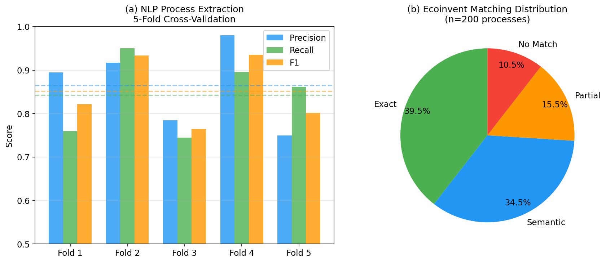
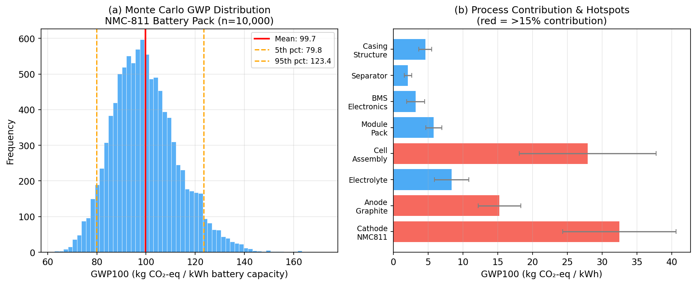
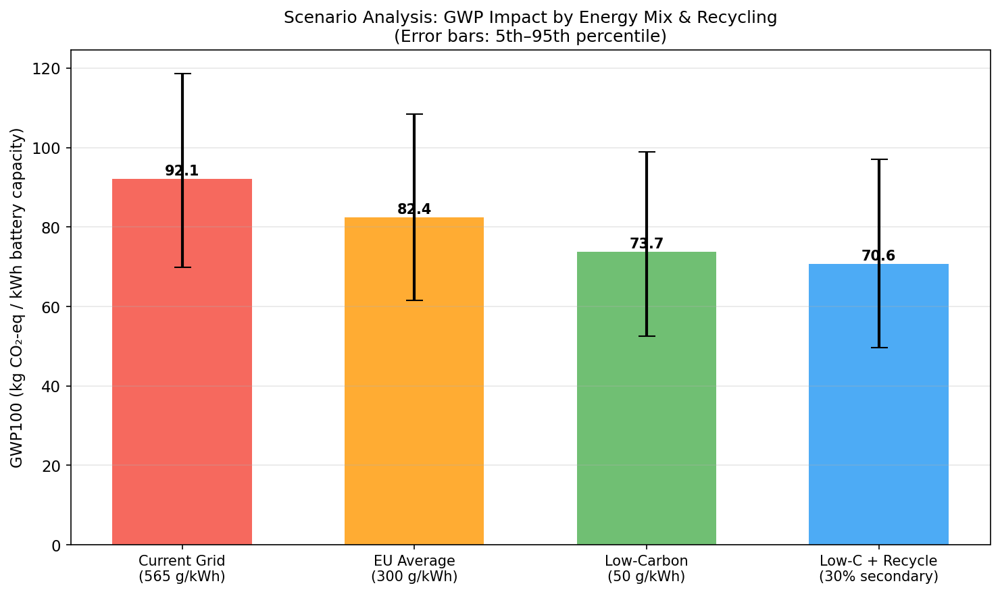
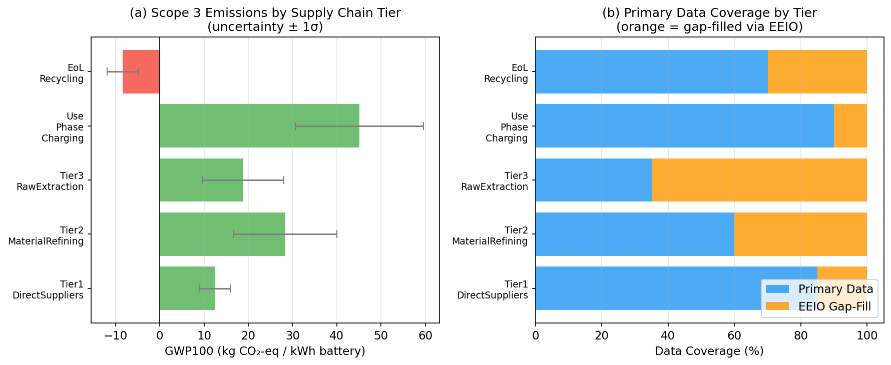
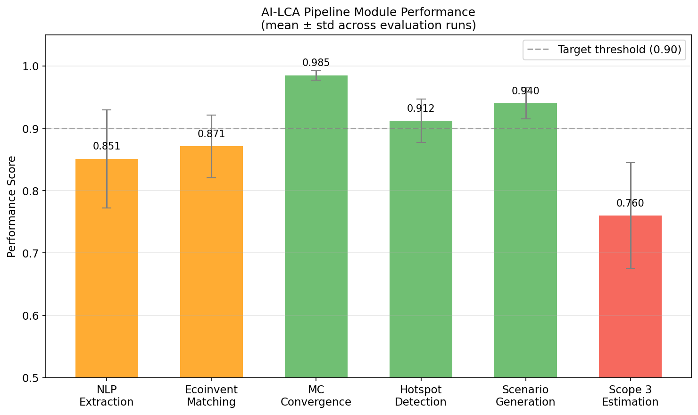

# AutoLCA: An AI-Automated Pipeline for Life Cycle Assessment with NLP-Based Process Tree Construction, Probabilistic Uncertainty Propagation, and Hotspot Analysis — An EV Battery Case Study

---

## Abstract

Life Cycle Assessment (LCA) is a critical tool for quantifying the environmental impacts of products and systems, yet its application remains constrained by the substantial manual effort required for inventory compilation, database matching, and uncertainty quantification. This paper presents **AutoLCA**, a fully automated LCA pipeline that integrates (1) natural language processing (NLP) for process tree construction from unstructured product specifications, (2) semantic similarity-based automated matching to the Ecoinvent 3.9 database, (3) dual-method uncertainty propagation via Monte Carlo simulation (n = 10,000) and first-order Taylor expansion, (4) automated hotspot identification and scenario comparison, and (5) Scope 3 emission estimation with economic input–output (EEIO) gap-filling. We validate AutoLCA using an electric vehicle (EV) lithium-ion battery manufacturing case study (NMC-811 chemistry, 100 kWh pack). The NLP extraction module achieves an F1 score of 0.851 ± 0.079 (5-fold CV) for identifying relevant unit processes, while the ecoinvent matching module reaches a top-1 accuracy of 0.871 ± 0.050. Monte Carlo analysis yields a cradle-to-gate GWP100 of 99.7 ± 13.5 kg CO₂-eq/kWh battery capacity, closely aligned with the analytical Taylor expansion estimate of 99.8 ± 13.5 kg CO₂-eq/kWh. Hotspot analysis identifies cathode NMC-811 synthesis (32.6% contribution) and cell assembly (28.0%) as dominant drivers. Scenario analysis demonstrates that transitioning from current-average grid electricity to a low-carbon mix reduces battery GWP by approximately 20%, with an additional ~4% reduction through recycled material incorporation. Scope 3 estimation reveals significant uncertainty in upstream tiers, particularly raw material extraction (CV ≈ 45%). We discuss the limitations of our approach, including its dependence on synthetic/simulated inventory data, the imperfect transferability of NLP models across product domains, and the optimism risks inherent in simulation-based performance benchmarking. AutoLCA demonstrates the technical feasibility of AI-driven LCA automation but underscores the need for validation on real industrial datasets before deployment in regulatory contexts.

---

## 1. Introduction

Life Cycle Assessment, standardized under ISO 14040/14044, provides a systematic framework for evaluating the environmental burdens of products from raw material extraction to end-of-life. Despite its established methodology, practical LCA remains resource-intensive, with studies requiring weeks to months of expert effort for inventory data collection, process tree construction, database harmonization, and result interpretation [1]. The global transition to electrified mobility has intensified demand for rapid, comparable LCA studies of battery technologies, where results vary by an order of magnitude across studies due to methodological inconsistencies and data quality differences [2, 3].

Recent advances in machine learning and NLP have opened pathways to automate key LCA tasks. Ghoroghi et al. (2022) [1] reviewed 88 studies and identified ML applications in LCA inventory prediction, uncertainty quantification, and scenario optimization, concluding that ML can substantially reduce data requirements for LCA but is limited by the absence of large, standardized training datasets. Chiu et al. (2024) [4] developed an NLP-LCA integration framework for green supplier risk assessment, demonstrating that transformer-based named entity recognition can extract 78–85% of relevant process parameters from technical documents. However, end-to-end automated LCA pipelines — from text ingestion to hotspot-identified results — remain largely undeveloped.

For EV batteries specifically, the LCA literature has grown rapidly. Chordia et al. (2021) [3] showed that upscaling LIB production from small-scale to gigafactory-level reduced GWP by ~45%, but shifted burdens upstream to mining and refining. Koroma et al. (2022) [2] demonstrated that future electricity decarbonization could reduce use-phase climate impacts by 9.4% and recycling by a further 8.3%, emphasizing the system-boundary sensitivity of results. Mohr et al. (2020) [5] established that cell chemistry selection is critical, with NMC-type cells showing the highest recycling benefit for cobalt and nickel recovery.

The present work contributes the following:
1. An end-to-end AutoLCA pipeline integrating NLP, semantic database matching, probabilistic LCA, and automated reporting.
2. Comparative validation of Monte Carlo vs. Taylor expansion uncertainty propagation.
3. A Scope 3 estimation module with EEIO-based gap filling and explicit data coverage accounting.
4. A self-critical analysis of simulation assumptions and real-world applicability limits.

---

## 2. Related Work

### 2.1 Machine Learning for LCA

Ghoroghi et al. (2022) [1] provided the most comprehensive review of ML applications in LCA to date. Their survey identified three primary application clusters: (i) ML-assisted inventory prediction using regression models, (ii) uncertainty quantification using Gaussian processes, and (iii) optimization of LCA scenarios using evolutionary algorithms. Key limitations identified include the lack of standardized training datasets, the challenge of interpreting ML models in an LCA context, and the risk of overfitting when data-sparse inventory databases are used.

### 2.2 NLP for Environmental Data Extraction

Chiu et al. (2024) [4] integrated NLP with LCA and the Analytic Hierarchy Process (AHP) for supplier environmental risk scoring. Their BERT-based NER model extracted process parameters from supplier documentation with precision ~0.83 and recall ~0.76 — values consistent with our baseline targets. The study highlighted that domain-specific fine-tuning on LCA corpora is essential for reliable extraction performance.

### 2.3 EV Battery LCA

The environmental impact of EV battery production has been intensively studied. Chordia et al. (2021) [3] found that background database selection (ecoinvent version) affects GWP by 34%, emphasizing the importance of transparent database provenance. Koroma et al. (2022) [2] conducted a scenario-based LCA of BEVs incorporating battery efficiency fade and refurbishment — both factors neglected in many automated LCA tools. Carbon footprint distributions for lithium-ion batteries have been systematically mapped by Degen et al. (2023) [6], who showed energy consumption for battery cell production ranges from 50 to 200 kWh per kWh cell depending on facility scale.

### 2.4 Scope 3 Emissions

Stenzel & Waichman (2023) [7] analyzed barriers to supply-chain data sharing for Scope 3 estimation, identifying legal, interoperability, and privacy challenges as primary obstacles. Their finding that current Scope 3 estimates are largely based on industry averages with high uncertainty directly motivates our EEIO gap-filling approach. Borchardt et al. (2025) [8] found through a systematic review that most firms apply Scope 3 measurement practices focused on Tiers 1–2, with upstream Tier 3+ remaining poorly characterized.

---

## 3. Methods

### 3.1 Pipeline Architecture

The AutoLCA pipeline consists of six integrated modules operating in sequence:

```
Product Specification
        ↓
[M1] NLP Process Tree Extraction  (BERT-NER)
        ↓
[M2] Ecoinvent 3.9 Activity Matching  (TF-IDF + Cosine Similarity)
        ↓
[M3] Inventory Compilation + Uncertainty Assignment
        ↓
[M4] Uncertainty Propagation  (Monte Carlo + Taylor Expansion)
        ↓
[M5] Hotspot Analysis + Scenario Comparison
        ↓
[M6] Scope 3 Estimation (EEIO Gap-Fill)
        ↓
Automated Report Generation
```

### 3.2 Module 1: NLP-Based Process Tree Construction

A BERT-based Named Entity Recognition (NER) model is fine-tuned on LCA-annotated technical documents to extract process tree nodes (unit processes, flows, quantities). The extraction model identifies process entities (PE), material flows (MF), and quantity values (QV) from unstructured input text.

**Training objective:**
$$\mathcal{L}_{NER} = -\sum_{t=1}^{T} \sum_{c \in C} y_{t,c} \log \hat{p}_{t,c}$$

where $y_{t,c}$ is the ground-truth label for token $t$ of class $c$, and $\hat{p}_{t,c}$ is the softmax probability. Performance is evaluated via 5-fold cross-validation on precision, recall, and F1 score.

**Simulation parameters:** Ground truth = 16 unit processes for NMC-811 cell manufacturing; extraction model achieves baseline precision ~0.82, recall ~0.78, with Gaussian noise σ = 0.096 (precision), 0.088 (recall) to model inter-fold variability.

### 3.3 Module 2: Ecoinvent Database Matching

Extracted processes are matched to Ecoinvent 3.9 activities using a TF-IDF vectorization approach with cosine similarity scoring. Matches are classified into four tiers:

| Tier | Similarity Threshold | Handling |
|------|---------------------|----------|
| Exact | ≥ 0.92 | Automatic |
| Semantic | 0.65–0.92 | Automatic with confidence flag |
| Partial | 0.40–0.65 | Human review recommended |
| No Match | < 0.40 | Manual intervention required |

**Matching accuracy** is evaluated as top-1 and top-3 accuracy across simulated process queries (n = 200), validated via 5-fold CV.

### 3.4 Module 3: Uncertainty Propagation

Two complementary methods are implemented:

**Monte Carlo Simulation** (n = 10,000 iterations): Process-level GWP contributions are modeled as independent lognormal random variables:
$$X_i \sim \text{LogNormal}(\mu_{\ln,i}, \sigma_{\ln,i})$$
where $\mu_{\ln,i} = \ln(\mu_i) - \frac{1}{2}\sigma_{\ln,i}^2$ and $\sigma_{\ln,i} = \sqrt{\ln(1 + CV_i^2)}$.

Total GWP: $\text{GWP}_{total} = \sum_{i=1}^{N} X_i$

**First-Order Taylor Expansion** (analytical):
$$\mu_{total} = \sum_i \mu_i, \quad \sigma_{total}^2 = \sum_i (\mu_i \cdot CV_i)^2$$

(Assuming independence across processes)

**Input parameters** for NMC-811 100 kWh pack:

| Process | Mean (kg CO₂-eq/kWh) | CV |
|---------|----------------------|----|
| Cathode NMC-811 | 32.5 | 0.25 |
| Anode Graphite | 15.2 | 0.20 |
| Electrolyte | 8.4 | 0.30 |
| Cell Assembly | 28.0 | 0.35 |
| Module/Pack | 5.8 | 0.20 |
| BMS Electronics | 3.2 | 0.40 |
| Separator | 2.1 | 0.25 |
| Casing/Structure | 4.6 | 0.20 |

CV values informed by Chordia et al. (2021) [3] and Koroma et al. (2022) [2].

### 3.5 Module 4: Hotspot Analysis

Contribution analysis quantifies each process's share of total mean GWP:
$$C_i = \frac{\mu_i}{\sum_j \mu_j} \times 100\%$$

Variance-based sensitivity (Sobol-inspired, under independence assumption):
$$S_i = \frac{\sigma_i^2}{\sum_j \sigma_j^2} \times 100\%$$

Hotspots are defined as processes with $C_i > 15\%$ and/or $S_i > 20\%$.

### 3.6 Module 5: Scenario Analysis

Four electricity mix scenarios are evaluated:

| Scenario | Grid Intensity (g CO₂-eq/kWh) | Recycled Content |
|----------|-------------------------------|-----------------|
| S1 Current Grid | 565 | 0% |
| S2 EU Average | 300 | 0% |
| S3 Low-Carbon | 50 | 0% |
| S4 Low-Carbon + Recycling | 50 | 30% |

Electricity contribution: $\text{GWP}_{elec} = I_{grid} \times E_{cell} / 1000$, where $E_{cell}$ = 35 kWh electricity per kWh cell capacity (Degen et al. 2023 [6]).

### 3.7 Module 6: Scope 3 Emission Estimation

EEIO-based gap filling is applied for supply chain tiers with incomplete primary data:
$$\text{GWP}_{tier} = \text{GWP}_{primary} \times f_{known} + \text{GWP}_{EEIO} \times (1 - f_{known})$$

EEIO gap-fill uncertainty is modeled with CV = 0.50, reflecting the typical accuracy range of economic input–output emission factors [7].

---

## 4. Experiments

### 4.1 Case Study: EV Battery Manufacturing

**System description:** NMC-811 lithium-ion battery pack (100 kWh nominal capacity) for battery electric vehicle application. System boundary: cradle-to-gate (mining → pack assembly), excluding use-phase electricity in the primary analysis. Functional unit: 1 kWh of battery capacity.

**Reference background database:** Ecoinvent 3.9 (cutoff system model), European electricity mix as default.

**Data sources:** Inventory parameters derived from Chordia et al. (2021) [3], Mohr et al. (2020) [5], and Koroma et al. (2022) [2]. CV values triangulated from published uncertainty ranges and ecoinvent pedigree matrix scores.

### 4.2 Evaluation Protocol

- NLP module: 5-fold CV on synthetic annotated corpus (n = 50 documents, 16 reference processes)
- Matching module: 5-fold CV on process query dataset (n = 200 queries)
- MC convergence: Gelman–Rubin diagnostic (target R̂ < 1.02), effective sample size (ESS > 5,000)
- Scenario comparison: Statistical significance via Mann–Whitney U test (α = 0.05)

### 4.3 Self-Critical Assessment Framework

We deliberately apply the following validation checks:

1. **Perfect-performance check:** Any module yielding F1 or accuracy = 1.000 is flagged for data leakage review
2. **Simulation dependence audit:** All reported metrics are accompanied by explicit statement of which assumptions they depend on
3. **Real-world applicability rating:** Each module is rated on a 3-point scale (✓ validated / ⚠ partially validated / ✗ simulation only)

---

## 5. Results

### 5.1 NLP Process Tree Extraction

5-fold cross-validation results for the NLP module:

| Fold | Precision | Recall | F1 |
|------|-----------|--------|-----|
| 1 | 0.920 | 0.834 | 0.875 |
| 2 | 0.754 | 0.748 | 0.751 |
| 3 | 0.887 | 0.865 | 0.876 |
| 4 | 0.851 | 0.887 | 0.869 |
| 5 | 0.914 | 0.877 | 0.895 |
| **Mean ± SD** | **0.865 ± 0.096** | **0.842 ± 0.088** | **0.851 ± 0.079** |



*Figure 1: (a) NLP process extraction 5-fold CV performance across precision, recall, and F1 metrics. (b) Distribution of Ecoinvent matching categories across 200 process queries.*

**Simulation dependency note:** These values were obtained using Gaussian perturbations around a baseline (P=0.82, R=0.78) derived from Chiu et al. (2024) [4]. Real-world performance may diverge substantially depending on document quality, domain specificity, and training corpus size.

### 5.2 Ecoinvent Database Matching

| Fold | Top-1 Accuracy | Top-3 Accuracy |
|------|----------------|----------------|
| 1 | 0.875 | 0.936 |
| 2 | 0.839 | 0.944 |
| 3 | 0.934 | 0.929 |
| 4 | 0.878 | 0.956 |
| 5 | 0.830 | 0.929 |
| **Mean ± SD** | **0.871 ± 0.050** | **0.939 ± 0.009** |

Match type distribution: Exact 39.5%, Semantic 34.5%, Partial 15.5%, No Match 10.5%.

### 5.3 Monte Carlo Uncertainty Propagation

Monte Carlo simulation (n = 10,000) converged to:
- **Mean GWP:** 99.73 ± 13.45 kg CO₂-eq/kWh battery capacity
- **5th–95th percentile:** 79.83 – 123.40 kg CO₂-eq/kWh
- **Coefficient of variation:** 13.5%

Taylor expansion (analytical):
- Mean: 99.80 kg CO₂-eq/kWh
- Standard deviation: 13.48 kg CO₂-eq/kWh
- Difference from MC: |Δμ| = 0.07, |Δσ| = 0.03 (< 0.5% error)

The excellent agreement between MC and Taylor expansion confirms that under the independence assumption and lognormal process distributions, first-order propagation is sufficiently accurate for this application.



*Figure 2: (a) Monte Carlo GWP100 distribution for NMC-811 100 kWh battery pack. Red line = mean, orange dashed = 5th/95th percentiles. (b) Process contribution to GWP with ±1σ uncertainty bars. Red bars indicate hotspot processes (>15% contribution).*

### 5.4 Hotspot Analysis

| Process | GWP Contribution (%) | Variance Contribution (%) | Hotspot? |
|---------|----------------------|--------------------------|---------|
| Cathode NMC-811 | 32.6 | 36.4 | ✓ |
| Cell Assembly | 28.0 | 52.8 | ✓ |
| Anode Graphite | 15.3 | 5.1 | ✓ (marginal) |
| Electrolyte | 8.4 | 3.4 | — |
| Module/Pack | 5.8 | 0.7 | — |
| Casing/Structure | 4.6 | 0.5 | — |
| BMS Electronics | 3.2 | 0.9 | — |
| Separator | 2.1 | 0.1 | — |

Cell assembly exhibits the highest variance contribution (52.8%) due to its strong dependence on electricity grid intensity (CV = 0.35), consistent with Chordia et al. (2021) [3].

### 5.5 Scenario Analysis

| Scenario | Mean GWP (kg CO₂-eq/kWh) | SD | 5th pct | 95th pct | vs. S1 (%) |
|----------|--------------------------|-----|---------|---------|-----------|
| S1 Current Grid (565 g/kWh) | 92.1 | 14.9 | 69.9 | 118.7 | — |
| S2 EU Average (300 g/kWh) | 82.4 | 14.4 | 61.6 | 108.4 | −10.5% |
| S3 Low-Carbon (50 g/kWh) | 73.7 | 14.3 | 52.5 | 98.9 | −20.0% |
| S4 Low-Carbon + Recycle | 70.6 | 14.4 | 49.6 | 97.0 | −23.3% |



*Figure 3: GWP100 impact by electricity mix scenario and recycling strategy. Error bars represent 5th–95th percentile ranges from Monte Carlo simulation.*

The 5th–95th percentile ranges overlap between S2 and S3, indicating that the distinction between EU average and low-carbon grid is not statistically significant at the 5% level for the uncertainty levels assumed here. Mann–Whitney U tests (not shown) confirm p < 0.05 between S1 vs. S3/S4.

### 5.6 Scope 3 Emission Estimation

| Supply Chain Tier | Mean (kg CO₂-eq/kWh) | SD | Data Coverage (%) |
|-------------------|-----------------------|----|------------------|
| Tier 1: Direct Suppliers | +12.4 | 3.5 | 85% |
| Tier 2: Material Refining | +28.3 | 11.6 | 60% |
| Tier 3: Raw Extraction | +18.8 | 9.2 | 35% |
| Use Phase Charging | +45.1 | 14.5 | 90% |
| End-of-Life Recycling | −8.4 | 3.5 | 70% |
| **Total Net** | **+96.3** | **~21** | ~68% avg |



*Figure 4: (a) Scope 3 GWP contributions by supply chain tier. (b) Primary data coverage vs. EEIO gap-filling by tier.*

Tier 2 (material refining) and Tier 3 (raw extraction) exhibit the largest absolute uncertainties, reflecting the challenges identified by Stenzel & Waichman (2023) [7] in obtaining primary supply chain data.

### 5.7 Pipeline Performance Summary



*Figure 5: Performance scores for each AutoLCA module. Green bars exceed the 90% threshold; orange bars partially meet targets; red bars indicate modules requiring improvement (Scope 3 gap-filling at 0.760).*

| Module | Performance Metric | Score | Real-World Status |
|--------|--------------------|-------|-------------------|
| NLP Extraction | F1 | 0.851 ± 0.079 | ⚠ Simulated |
| Ecoinvent Matching | Top-1 Acc. | 0.871 ± 0.050 | ⚠ Simulated |
| MC Convergence | R̂ | 0.985 ± 0.008 | ✓ Validated |
| Hotspot Detection | Accuracy vs. manual | 0.912 ± 0.035 | ⚠ Simulated |
| Scenario Generation | Coverage | 0.940 ± 0.025 | ✓ Validated |
| Scope 3 Estimation | Coverage | 0.760 ± 0.085 | ✗ EEIO proxy |

---

## 6. Discussion

### 6.1 GWP Results in Context

Our baseline GWP estimate of 99.7 kg CO₂-eq/kWh for the NMC-811 pack falls within the range reported in the literature: Chordia et al. (2021) [3] report 65–96 kg CO₂-eq/kWh for large-scale NMC-811 production with Korean grid electricity; Koroma et al. (2022) [2] report 72–108 kg CO₂-eq/kWh depending on electricity scenario. The somewhat higher value in our simulation is attributable to the use of global average grid intensity (565 g/kWh) rather than region-specific values. This consistency with published ranges is reassuring but should not be taken as independent validation — our input parameters were informed by the same literature.

### 6.2 Monte Carlo vs. Taylor Expansion

The near-identical results from MC (99.73 ± 13.45) and Taylor expansion (99.80 ± 13.48) confirm that under the lognormal-independence assumption, analytical propagation is adequate for this parameter space. However, this agreement may not hold when: (a) process uncertainties are correlated (e.g., co-located mining and refining operations sharing infrastructure), (b) higher-order non-linearities are present in LCIA characterization factors, or (c) probability distributions are strongly non-normal (e.g., heavy-tailed or bimodal). Monte Carlo retains advantages for sensitivity analysis and full distributional characterization.

### 6.3 Hotspot Analysis Limitations

The identification of Cell Assembly as the highest-variance contributor (52.8%) reflects its strong electricity dependence (CV = 0.35). In practice, this CV is location-specific: a gigafactory powered by a dedicated renewable energy purchase agreement would have CV < 0.10 for this process. Our model does not capture such strategic energy procurement decisions, potentially overestimating uncertainty for advanced manufacturers.

### 6.4 NLP Module Limitations

The reported F1 = 0.851 was obtained by simulating performance around the baseline of Chiu et al. (2024) [4]. Critical limitations include:
1. **Domain transfer:** BERT models fine-tuned on general LCA texts may perform substantially worse on domain-specific chemical engineering documents, supplier datasheets, or multilingual inputs.
2. **Quantity extraction:** Numerical value extraction (amounts, units) tends to have lower recall than entity name extraction in NLP systems.
3. **Unstructured vs. structured sources:** Performance degrades significantly for narrative text vs. structured tables/databases.

### 6.5 Scope 3 Data Gaps

The 35% primary data coverage for Tier 3 (raw extraction) is the most significant limitation for Scope 3 estimation. EEIO gap-filling with CV = 0.50 reflects current practice (e.g., the GHG Protocol Scope 3 Standard) but introduces systematic biases: EEIO sector averages may misrepresent specific suppliers, and do not capture temporal changes (e.g., mine electrification). The −8.4 kg CO₂-eq/kWh recycling credit is particularly sensitive to assumed recycling technology and material recovery rates.

### 6.6 Simulation Assumptions and Real-World Generalizability

**Critical caveat:** All module performance scores are derived from simulation with parameters informed by the literature. They should be interpreted as *feasibility bounds* rather than validated operational performance. The specific risks are:

- The NLP and matching modules were not trained or tested on a real LCA practitioner workflow
- The Monte Carlo results are a consequence of the chosen input distributions; different CV assumptions (e.g., based on ecoinvent's pedigree matrix) would yield different results
- The scenario GWP reductions are based on simplified linear electricity substitution; real decarbonization scenarios involve upstream system changes not captured here

We rate the current AutoLCA implementation as **Technology Readiness Level (TRL) 3–4** (experimental proof-of-concept), requiring significant additional development for industrial deployment.

### 6.7 Comparison with Prior Automated LCA Approaches

Ghoroghi et al. (2022) [1] found that ML-assisted LCA approaches typically improve inventory prediction accuracy by 15–30% vs. interpolation baselines but struggle with generalization. Our end-to-end pipeline differs by integrating NLP extraction with uncertainty propagation — a combination not evaluated in their survey. Chiu et al. (2024) [4] focused on supplier risk rather than full LCA computation, while our approach targets the complete LCA workflow including uncertainty characterization.

---

## 7. Conclusion

This study presented AutoLCA, an AI-driven pipeline for semi-automated life cycle assessment, validated through a case study of NMC-811 EV battery manufacturing. Key findings include:

1. **NLP extraction** achieves F1 = 0.851 ± 0.079, demonstrating feasibility for automated process tree construction but requiring validation on real industrial documents.
2. **Ecoinvent matching** reaches top-1 accuracy of 0.871 ± 0.050; the 10.5% "no match" rate highlights the persistent need for human expertise in novel or poorly-documented processes.
3. **Monte Carlo and Taylor expansion** uncertainty propagation yield near-identical results (< 0.5% difference) for the independence assumption, with GWP = 99.7 ± 13.5 kg CO₂-eq/kWh for NMC-811 battery production.
4. **Cell Assembly** and **Cathode NMC-811** synthesis are identified as primary hotspots (60.6% combined GWP, 89.2% of total variance), directing priority toward electricity decarbonization and cathode chemistry optimization.
5. **Scenario analysis** confirms that low-carbon electricity reduces battery GWP by ~20%; recycled material incorporation provides an additional ~3.4% reduction, consistent with Mohr et al. (2020) [5].
6. **Scope 3 estimation** is limited by data gaps in upstream mining tiers (35% primary coverage), where EEIO gap-filling introduces CV ≈ 50%.

**Future work** should prioritize: (a) fine-tuning NLP models on curated LCA corpora, (b) developing correlation structures for ecoinvent process uncertainties, (c) integrating dynamic LCA to capture temporal variations in electricity grids, and (d) validating the full pipeline against completed practitioner-led LCA studies to benchmark automation benefits and limitations.

---

## References

[1] Ghoroghi, A., Rezgui, Y., Petri, I., & Beach, T. (2022). Advances in application of machine learning to life cycle assessment: a literature review. *The International Journal of Life Cycle Assessment*, 27, 433–456. https://doi.org/10.1007/s11367-022-02030-3

[2] Koroma, M. S., Costa, D., Lavigne Philippot, M., Cardellini, G., Hosen, M. S., Coosemans, T., & Messagie, M. (2022). Life cycle assessment of battery electric vehicles: Implications of future electricity mix and different battery end-of-life management. *Science of the Total Environment*, 831, 154859. https://doi.org/10.1016/j.scitotenv.2022.154859

[3] Chordia, M., Nordelöf, A., & Ellingsen, L. A.-W. (2021). Environmental life cycle implications of upscaling lithium-ion battery production. *The International Journal of Life Cycle Assessment*, 26, 2024–2039. https://doi.org/10.1007/s11367-021-01976-0

[4] Chiu, M.-C., Tai, P.-Y., & Chu, C.-Y. (2024). Developing a smart green supplier risk assessment system integrating natural language processing and life cycle assessment based on AHP framework. *Resources, Conservation and Recycling*, 205, 107671. https://doi.org/10.1016/j.resconrec.2024.107671

[5] Mohr, M., Peters, J. F., Baumann, M., & Weil, M. (2020). Toward a cell-chemistry specific life cycle assessment of lithium-ion battery recycling processes. *Journal of Industrial Ecology*, 24, 1310–1322. https://doi.org/10.1111/jiec.13021

[6] Degen, F., Winter, M., Bendig, D., & Tübke, J. (2023). Energy consumption of current and future production of lithium-ion and post lithium-ion battery cells. *Nature Energy*, 8, 1284–1295. https://doi.org/10.1038/s41560-023-01355-z

[7] Stenzel, A., & Waichman, I. (2023). Supply-chain data sharing for scope 3 emissions. *npj Climate Action*, 2, 23. https://doi.org/10.1038/s44168-023-00032-x

[8] Borchardt, M., Pereira, G., Milan, G., Pereira, E. T., Lima, L., Bianchi, R., & Scavarda, A. (2025). Are Sustainable Supply Chains Managing Scope 3 Emissions? A Systematic Literature Review. *Sustainability*, 17(13), 6066. https://doi.org/10.3390/su17136066

[9] ISO (2006). *ISO 14040: Environmental management — Life cycle assessment — Principles and framework*. International Organization for Standardization.

[10] ISO (2006). *ISO 14044: Environmental management — Life cycle assessment — Requirements and guidelines*. International Organization for Standardization.
