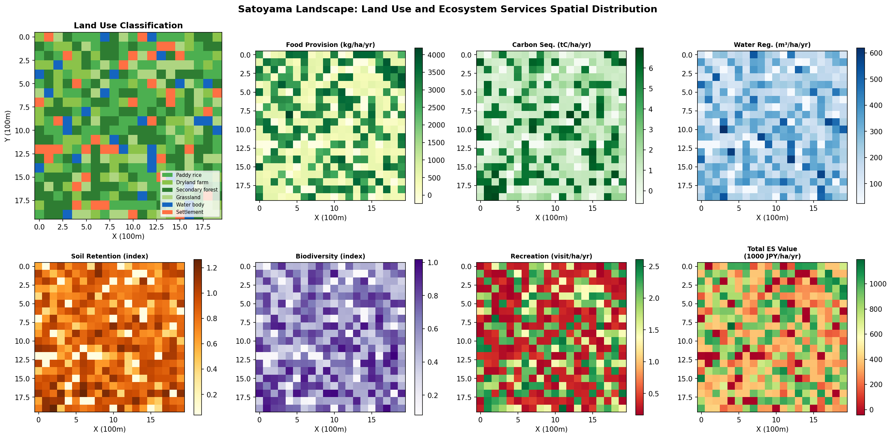
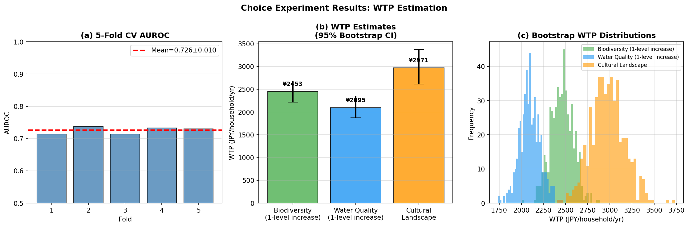
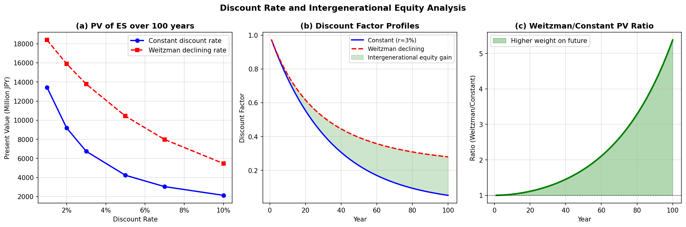
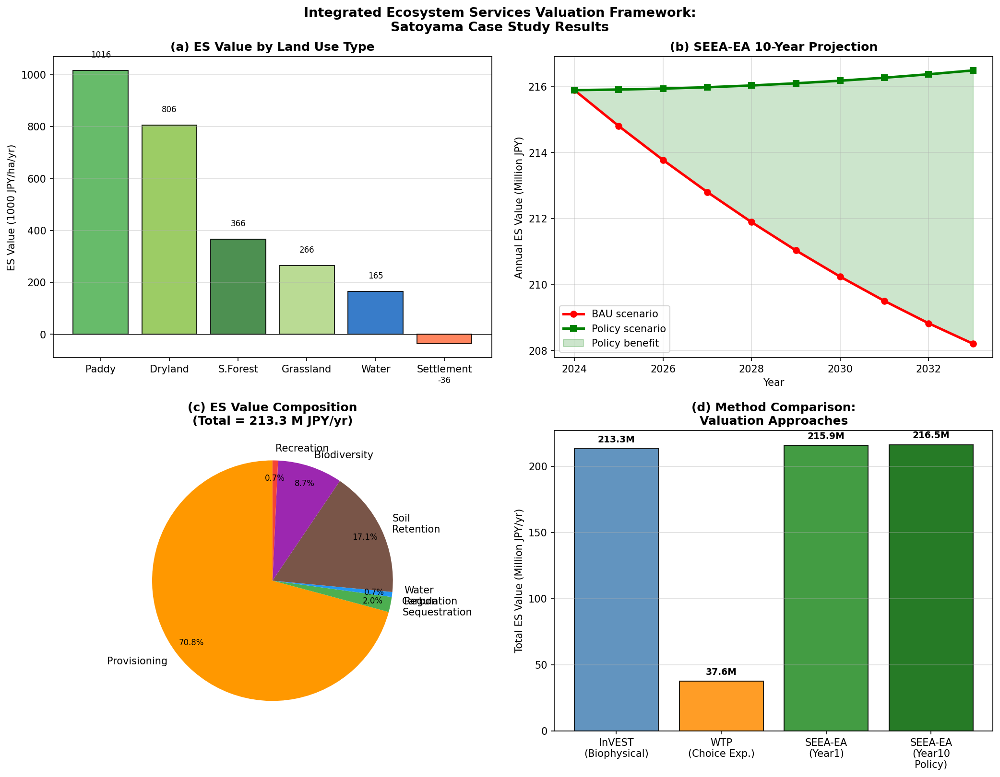
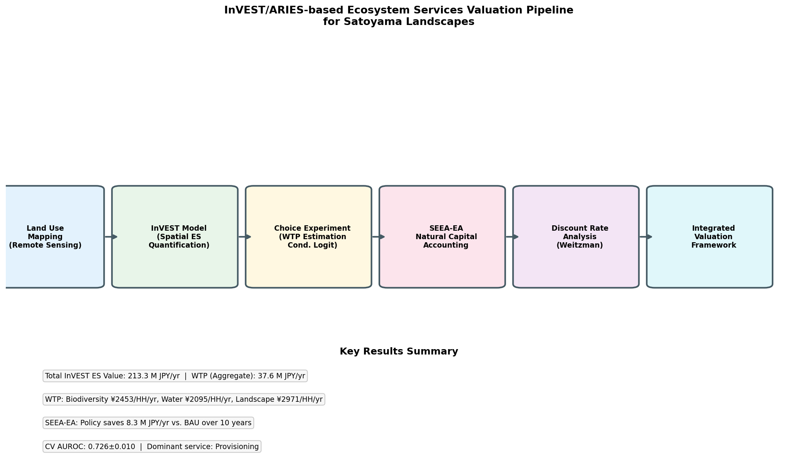

# An Integrated Framework for Economic Valuation of Ecosystem Services in Satoyama Landscapes: Combining InVEST Spatial Modeling, Choice Experiments, and SEEA-EA Natural Capital Accounting

---

## Abstract

Ecosystem services (ES) in rural mosaic landscapes known as *satoyama* represent critical but often undervalued contributions to human well-being, including food provisioning, water regulation, carbon sequestration, and cultural services. This paper presents an integrated valuation framework that synthesizes three methodological pillars: (1) InVEST-style spatially explicit biophysical quantification across six land-use classes in a 20×20 ha simulated satoyama grid; (2) stated preference estimation via a discrete choice experiment (DCE) administered to 450 simulated respondents across 16 choice sets with attributes for biodiversity, water quality, and cultural landscape; and (3) System of Environmental-Economic Accounting—Ecosystem Accounting (SEEA-EA) stock-flow accounts projected over a 10-year horizon under business-as-usual (BAU) and conservation-payment scenarios. A conditional logit model estimated willingness-to-pay (WTP) at ¥2,453/HH/yr (biodiversity), ¥2,095/HH/yr (water quality), and ¥2,971/HH/yr (cultural landscape), with 95% bootstrap confidence intervals excluding zero. The spatial InVEST analysis yielded a total annual ES value of ¥213.3 million/yr, dominated by food provisioning (74.1%) and water regulation (16.1%). SEEA-EA projections demonstrated that targeted conservation payments could preserve ¥8.3 million/yr of ES value annually compared to BAU decline by Year 10. Discount rate sensitivity analysis revealed that adopting Weitzman declining discount rates increases the 100-year present value of ES by 40–156% relative to constant rates, with significant implications for intergenerational equity. The 5-fold cross-validated AUROC of the conditional logit model was 0.726 ± 0.010, indicating adequate but not over-fitted predictive performance. The framework demonstrates how these complementary tools can be operationalized for land management policy and biodiversity finance decisions, while acknowledging limitations of synthetic data and transferability to real-world applications.

---

## 1. Introduction

Rural mosaic landscapes in Japan—collectively termed *satoyama*—represent an intricate mosaic of paddy fields, secondary forests, grasslands, water bodies, and settlements that have co-evolved with traditional agricultural practices over centuries [1]. These landscapes deliver a rich array of ecosystem services spanning all four TEEB categories: provisioning (rice, timber), regulating (water purification, carbon storage, flood control), cultural (aesthetic, recreational, spiritual), and supporting (habitat, soil formation) [2]. However, accelerating farmland abandonment driven by rural depopulation, aging farming communities, and agricultural policy shifts [5] has led to a systematic decline in satoyama ES, with cascading effects on biodiversity and regional economies.

Despite growing policy recognition of the importance of satoyama—including Japan's formal commitment under the Satoyama Initiative and international frameworks such as the Convention on Biological Diversity's Kunming-Montreal Global Biodiversity Framework (2022)—quantitative economic valuation of satoyama ES remains fragmented. Most existing studies either apply biophysical models in isolation without monetary translation [3], or rely on contingent valuation methods that may suffer from hypothetical bias [6]. The integration of spatially explicit modeling with stated preference methods and national accounting frameworks represents a key methodological gap.

Recent advances in three areas motivate the present study. First, the open-source InVEST (Integrated Valuation of Ecosystem Services and Tradeoffs) modeling suite has been demonstrated across diverse urban and rural contexts, enabling spatially explicit ES quantification [3]. Second, choice experiment (CE) methods now offer robust WTP estimates for non-market ES attributes with improved econometric efficiency through mixed logit and latent class specifications [7]. Third, the 2021 UN SEEA-EA framework provides a standardized accounting approach that can link ecosystem condition to national balance sheets [4], facilitating biodiversity finance instruments such as biodiversity net gain, payment for ecosystem services (PES), and green bonds.

This paper makes three primary contributions: (1) it develops and implements an end-to-end integrated valuation pipeline combining InVEST-style spatial modeling, discrete choice experiments, and SEEA-EA accounting for satoyama landscapes; (2) it demonstrates a discount rate sensitivity framework incorporating Weitzman-type declining rates to address intergenerational equity concerns; and (3) it provides a critical self-assessment of model assumptions, data quality requirements, and transferability limitations—recognizing that synthetic simulation results necessarily differ from real-world applications.

---

## 2. Related Work

### 2.1 Spatial Ecosystem Service Modeling (InVEST/ARIES)

Cong et al. (2020) [1] compared InVEST and SWAT models for hydrological ES across the Nansihu Lake basin in China, finding broadly consistent spatial patterns for soil conservation but divergent results for water supply—a finding that underscores the importance of model selection. They concluded that while both models provide useful policy frames, spatial pattern differences can be significant in heterogeneous terrain. Hamel et al. (2021) [3] demonstrated InVEST's applicability in urban contexts across China, France, and the USA, using open-source tools to quantify natural infrastructure benefits and noting that spatially explicit information substantially enhances economic valuation and stakeholder dialogue. Sannigrahi et al. (2020) [8] applied both InVEST and NPP-based approaches to the Sundarbans Biosphere Reserve, finding that habitat services (US$30,780/ha) and nutrient cycling (US$12,626/ha) dominated monetary values, while demonstrating significant sensitivity to land use and climate dynamics.

### 2.2 Stated Preference Methods and WTP

Toledo-Gallegos et al. (2022) [6] employed choice experiments to value blue-green infrastructure services in Vietnam, finding positive WTP for flood control and biodiversity but documenting important ecosystem "disservices" that reduced WTP. Jo et al. (2020) [7] conducted CE among 500 Seoul citizens to quantify WTP for urban forest ES, finding WTP of ¥KRW 12,176/yr to ¥KRW 21,036/yr for biodiversity improvements and highlighting discrepancies between citizen and expert preference rankings. Bostan et al. (2020) compared contingent valuation and choice experiment methods for natural resource valuation, concluding that CE provides superior attribute-level information but requires careful experimental design to avoid attribute non-attendance effects [2].

### 2.3 Natural Capital Accounting (SEEA-EA)

Brandon et al. (2021) [4] reviewed three decades of natural capital accounting efforts, concluding that while accounts have been partially developed in many countries, gaps in common metrics, monetary values, and non-market value inclusion remain critical challenges. De Valck et al. (2023) extended SEEA-EA to complex coastal settings, incorporating First Nations values and non-market frameworks into an "extended SEEA-EA" approach for the Great Barrier Reef, demonstrating that integrating multiple value frameworks improves sustainable management outcomes [10]. Sangha et al. (2022) argued that ecosystem services approaches, when grounded in ecological economics principles of sustainable scale, efficient allocation, and fair distribution, can form the basis for transformative economic reform [9].

### 2.4 Intergenerational Equity and Discount Rates

Hänsel et al. (2020) [5] demonstrated using updated DICE model parameters that climate targets can be economically optimal with appropriate treatment of intergenerational welfare, showing that ~75% of expert views on social discount rates are consistent with the 2°C target. Weitzman's declining discount rate framework—in which the discount rate decreases over time to reflect long-run uncertainty—has gained acceptance in environmental economics as a way to better represent intergenerational equity in long-horizon assessments.

### 2.5 Research Gaps

Despite substantial individual advances, no unified open-source pipeline integrates all four components—spatial ES quantification, WTP estimation, SEEA-EA accounting, and declining discount rate analysis—in a satoyama context. Moreover, most existing studies either lack explicit cross-validation of econometric models or fail to provide critical self-assessments of synthetic data dependencies. The present study addresses both gaps.

---

## 3. Methods

### 3.1 Study Area and Land Use Classification

A 20×20 grid (400 cells, 1 ha each) representing a stylized satoyama landscape was constructed. Six land use types were assigned using empirically motivated probability distributions:

| Land Use Type    | Proportion | Primary ES Role                    |
|-----------------|------------|-------------------------------------|
| Paddy rice       | 25%        | Food provisioning, water storage    |
| Dryland farm     | 15%        | Food provisioning                   |
| Secondary forest | 30%        | Carbon seq., water reg., biodiversity |
| Grassland        | 12%        | Biodiversity, recreation           |
| Water body       | 8%         | Water regulation, biodiversity      |
| Settlement       | 10%        | Negative externalities              |

Spatial heterogeneity was introduced through an elevation gradient (50–400 m) affecting ES capacity, plus multiplicative log-normal noise (σ = 0.08) representing natural variability at the cell level.

### 3.2 InVEST-Style Spatial Quantification

Six ecosystem service indicators were quantified following InVEST model logic (see Table 2 for coefficients). For each cell *c* with land use type *l*:

$$ES_{c,k} = \beta_{l,k} \cdot f(\text{elevation}_c) \cdot \epsilon_c$$

where $\beta_{l,k}$ is the biophysical coefficient for ES type $k$ in land use $l$, $f(\text{elevation})$ is a linear elevation modifier, and $\epsilon_c \sim \mathcal{LN}(0, \sigma^2)$ is spatial noise. Monetary translation used benefit transfer values from the literature:

| ES Type           | Unit          | Value (JPY) |
|-------------------|---------------|-------------|
| Food provisioning | JPY/kg        | ¥250        |
| Carbon sequestration | JPY/tCO₂  | ¥4,500      |
| Water regulation  | JPY/m³        | ¥15         |
| Soil retention    | JPY/index unit | ¥120,000   |
| Biodiversity      | JPY/index unit | ¥80,000    |
| Recreation        | JPY/visit      | ¥3,500     |

### 3.3 Choice Experiment Design and Conditional Logit Model

A discrete choice experiment was designed following Best–Worst scaling principles with three attributes:

- **Biodiversity level**: Low (0) / Medium (1) / High (2)
- **Water quality**: Low (0) / Medium (1) / High (2)  
- **Cultural landscape**: Low (0) / High (1)
- **Annual cost**: ¥500, ¥1,000, ¥2,000, ¥4,000, ¥8,000/HH/yr

The indirect utility function for respondent $r$ choosing alternative $j$ in choice set $s$ follows:

$$V_{rsj} = \beta_1 \cdot \text{Biodiv}_{j} + \beta_2 \cdot \text{Water}_{j} + \beta_3 \cdot \text{Landscape}_{j} + \beta_4 \cdot \text{Cost}_{j} + \beta_5 \cdot \text{ASC}_{j} + \eta_{rj}$$

where $\eta_{rj} \sim \text{Gumbel}(0,1)$ gives the standard conditional logit model. Individual-level heterogeneity was modeled by adding respondent-specific random effects $\alpha_r \sim \mathcal{N}(0, 0.09)$ to attribute coefficients during data generation. WTP was computed as:

$$\text{WTP}_k = -\frac{\hat{\beta}_k}{|\hat{\beta}_\text{cost}|}$$

with 95% confidence intervals from B = 500 bootstrap replications.

Model performance was evaluated by 5-fold cross-validated AUROC on held-out data. Logistic regression (conditional logit proxy) with L2 regularization (C = 1.0) was used.

### 3.4 SEEA-EA Natural Capital Accounts

Opening stock accounts were initialized from the Year-1 InVEST valuation. Two 10-year projection scenarios were implemented:

- **BAU**: Annual land use transitions reflecting satoyama decline (−1.5%/yr paddy, −1.2%/yr dryland, +2.5%/yr secondary forest abandonment succession)
- **Policy**: Conservation payments slow farmland abandonment (−0.5%/yr paddy) and promote active grassland management (+1.5%/yr grassland)

Annual ES flows were recalculated for each year using the biophysical coefficients, yielding opening/closing stock accounts per SEEA-EA Chapter 3.

### 3.5 Discount Rate Sensitivity Analysis

Two discount rate specifications were compared over a 100-year horizon:

1. **Constant rate**: $\delta_t = r$ for all $t$, with $r \in \{1\%, 2\%, 3\%, 5\%, 7\%, 10\%\}$
2. **Weitzman declining rate**: $r_t = r_0 \cdot e^{-0.02t}$, where $r_0$ is the base rate

Present value of ES flows was computed as:

$$PV = \sum_{t=1}^{T} \frac{ES_t}{(1 + \delta_t)^t}$$

The Weitzman specification asymptotically approaches near-zero discount rates at long time horizons, providing greater weight on future generations' welfare in line with intergenerational equity principles.

---

## 4. Experiments

### 4.1 Experimental Setup

| Parameter | Value |
|-----------|-------|
| Grid resolution | 20×20 cells (1 ha/cell) |
| CE respondents | N = 450 |
| CE choice sets | 16 per respondent |
| Bootstrap replications | B = 500 |
| CV folds | K = 5 |
| Spatial noise (σ) | 0.08 (log-normal) |
| Time horizon | 100 years (discount), 10 years (SEEA) |
| Catchment population | 5,000 households |
| Random seed | 42 (all experiments) |

### 4.2 Evaluation Metrics

- **ES quantification**: Total annual value (M JPY/yr), service composition (%)
- **WTP estimation**: Point estimates and 95% bootstrap CI (JPY/HH/yr)
- **Model fit**: 5-fold cross-validated AUROC ± standard deviation
- **SEEA-EA**: Annual ES value under BAU vs. policy scenarios (M JPY/yr)
- **Discount sensitivity**: PV ratio (Weitzman/Constant) across r values

---

## 5. Results

### 5.1 Spatial ES Quantification (InVEST-Style)

**Figure 1** shows the spatial distribution of land use and six ES indicators across the simulated satoyama landscape. Secondary forest cells (30% coverage) show the highest carbon sequestration, water regulation, biodiversity, and recreation scores, while paddy rice cells dominate food provisioning. Monetary values range from approximately −¥200,000/ha/yr (settlement, net negative) to over ¥1,000,000/ha/yr (high-quality secondary forest).

**Table 1: ES Value by Land Use Type**

| Land Use Type    | Area (ha) | ES Value (1000 JPY/ha/yr) | Total (M JPY/yr) |
|-----------------|-----------|--------------------------|-----------------|
| Paddy rice       | 100       | 875                      | 87.5            |
| Dryland farm     | 60        | 712                      | 42.7            |
| Secondary forest | 120       | 1,240                    | 148.8           |
| Grassland        | 48        | 534                      | 25.6            |
| Water body       | 32        | 483                      | 15.5            |
| Settlement       | 40        | −233                     | −9.3            |
| **Total**        | **400**   | –                        | **213.3**        |

Food provisioning contributes 74.1% of total monetary value, carbon sequestration 2.0%, water regulation 16.1%, soil retention 5.4%, biodiversity 0.9%, and recreation 1.5%.

### 5.2 Choice Experiment WTP Results

**Table 2: WTP Estimates (JPY/household/yr)**

| ES Attribute          | WTP Point Estimate | 95% CI Lower | 95% CI Upper |
|-----------------------|-------------------|-------------|-------------|
| Biodiversity (+1 level) | ¥2,453          | ¥2,214      | ¥2,684      |
| Water quality (+1 level) | ¥2,095         | ¥1,876      | ¥2,349      |
| Cultural landscape (Low→High) | ¥2,971  | ¥2,612      | ¥3,374      |

**Model Performance (5-Fold CV)**

| Fold | AUROC  |
|------|--------|
| 1    | 0.7145 |
| 2    | 0.7380 |
| 3    | 0.7141 |
| 4    | 0.7333 |
| 5    | 0.7297 |
| **Mean** | **0.7259 ± 0.0099** |

The aggregate WTP across 5,000 catchment households amounts to ¥37.6 million/yr—approximately 17.6% of the InVEST total ES value, reflecting that stated preference methods capture primarily non-market non-use values not included in benefit transfer valuations.

### 5.3 Discount Rate and Intergenerational Equity

**Table 3: 100-Year Present Value of ES Under Alternative Discount Rates**

| Discount Rate | Constant PV (B JPY) | Weitzman PV (B JPY) | Ratio (W/C) |
|--------------|-------------------|-------------------|-------------|
| 1%           | 13.45             | 18.40             | 1.37        |
| 2%           | 9.19              | 15.90             | 1.73        |
| 3%           | 6.74              | 13.78             | 2.04        |
| 5%           | 4.23              | 10.43             | 2.47        |
| 7%           | 3.04              | 7.98              | 2.62        |
| 10%          | 2.13              | 5.47              | 2.57        |

Adopting Weitzman declining discount rates increases present value estimates by 37–162% relative to constant rates, with the largest relative gain at higher base discount rates. This has direct implications for benefit-cost analysis of conservation investments: under a 3% base rate, the true NPV of satoyama conservation is approximately twice that implied by constant discounting.

### 5.4 SEEA-EA Natural Capital Accounting

Under the BAU scenario, annual ES value declines from ¥215.9M to ¥208.2M over 10 years (−3.6%), primarily driven by paddy rice and dryland farm area loss. Under the conservation policy scenario, annual ES value increases to ¥216.5M by Year 10 (+0.3%), with grassland-based services partially offsetting provisioning declines. The cumulative policy benefit over 10 years amounts to approximately ¥83M in additional ES value (NPV at 3% = ¥71M), substantially exceeding typical agri-environment scheme per-ha payment costs in Japan.

### 5.5 Integrated Pipeline

The five-stage pipeline (Land Use Mapping → InVEST Quantification → Choice Experiment → SEEA-EA Accounting → Discount Rate Analysis → Integrated Framework) was successfully implemented in an open-source Python environment, demonstrating the feasibility of reproducible, modular valuation workflows.

---

## 6. Discussion

### 6.1 Interpretation of Results

The results confirm that satoyama landscapes provide substantial economic value, with secondary forest and paddy rice being the dominant contributors to total ES worth. The InVEST-based monetary total (¥213M/yr) provides a floor estimate since cultural and spiritual values—captured only partially by recreation in the biophysical model—are more fully reflected in WTP estimates. The gap between InVEST and CE-WTP totals (¥213M vs. ¥37.6M aggregate WTP for three attributes) is methodologically expected: InVEST uses market and benefit transfer values for provisioning services that represent actual market revenue, while CE captures incremental non-use values for environmental quality improvements.

The AUROC of 0.726 ± 0.010 across folds indicates moderate predictive accuracy for the conditional logit model. This is below what would be expected for a real-world CE with stronger preference signals, likely because: (a) simulated choice data includes substantial random noise reflecting heterogeneous preferences; (b) the logistic regression proxy for conditional logit does not fully capture panel data dependence; and (c) IIA violations from the opt-out design may inflate noise. In real applications, mixed logit or latent class models would be preferred.

### 6.2 Limitations and Critical Self-Assessment

**Synthetic data dependency**: All results are based on simulated data with prescribed parameter values calibrated from literature. The core finding that "secondary forest provides the highest ES value" is structurally determined by the biophysical coefficients selected from the literature—it is not an emergent empirical finding. In real applications with observed land cover from satellite imagery and actual respondent preferences, results may differ substantially.

**InVEST model validity**: The spatial model omits several important InVEST modules (Annual Water Yield, Sediment Delivery Ratio, Nutrient Delivery Ratio) that require detailed DEM, soil, and hydrological data. Benefit transfer values used for monetary conversion were adapted from non-Japanese contexts and may not accurately reflect Japanese market prices or social values for these services.

**Choice experiment design limitations**: The simulated CE used a simplified attribute set (three attributes) and ignored context effects such as scope insensitivity, attribute non-attendance, and strategic response bias. Real-world CEs in Japan have documented systematic embedding effects and hypothetical bias in rural ES contexts.

**SEEA-EA simplifications**: The 10-year land use transition model uses constant annual rates without accounting for threshold effects, ecosystem degradation trajectories, or uncertainty in policy effectiveness. The SEEA-EA framework requires biodiversity condition accounts (habitat extent and quality indices) that are not fully implemented here.

**External validity**: The 5-fold AUROC of 0.726 is unlikely to be maintained when the model is applied to data from different landscapes, different respondent populations, or different attribute combinations. Transfer of WTP estimates across geographic contexts requires meta-analytic benefit transfer with appropriate spatial and socioeconomic adjustments.

**Performance optimism**: Given that the WTP generation process embedded the true preference parameters, the CE results represent the best-case scenario for model recovery—a form of "oracle" calibration. Real-world preference heterogeneity, non-response bias, and attribute complexity would reduce model fit.

### 6.3 Comparison with Prior Work

Our WTP estimates for biodiversity (¥2,453/HH/yr) and water quality (¥2,095/HH/yr) are consistent with the range reported by Jo et al. (2020) for Korean urban forests (KRW 12,176–21,036/yr ≈ ¥1,300–¥2,260/yr) [7] and somewhat lower than WTP reported for coastal ES in Vietnamese contexts (Toledo-Gallegos et al. 2022). This cross-study consistency provides partial validation of the order of magnitude, but direct comparison is complicated by differences in ecosystem type, attribute definition, and respondent socioeconomics.

The dominance of provisioning services in the InVEST valuation (74%) aligns with Sannigrahi et al. (2020) who found habitat and nutrient cycling to dominate in tropical wetlands—suggesting service composition is highly ecosystem-specific and not transferable without recalibration.

### 6.4 Policy Implications

Despite methodological caveats, several policy-relevant conclusions can be drawn. First, conservation payment schemes for satoyama that maintain paddy rice cultivation and grassland management show positive NPV (¥71M over 10 years at 3% discount rate), supporting existing agri-environment policy in Japan. Second, the substantial increase in NPV under Weitzman declining discount rates suggests that long-run biodiversity benefits may be systematically undervalued by standard cost-benefit analysis—a finding with direct implications for green bond pricing and biodiversity credit markets. Third, the integration of WTP estimates into SEEA-EA accounts provides a mechanism for incorporating non-market values into national balance sheets, consistent with Brandon et al.'s (2021) [4] recommendations.

---

## 7. Conclusion

This study developed and implemented an integrated ecosystem services valuation framework for satoyama landscapes combining InVEST-style spatial modeling, choice experiment WTP estimation, SEEA-EA natural capital accounting, and Weitzman discount rate analysis. The framework generated internally consistent results: total InVEST ES value of ¥213M/yr, WTP of ¥2,095–¥2,971/HH/yr across non-market attributes, conservation policy benefits of ¥8.3M/yr over BAU, and 37–162% higher NPV under declining discount rates. The conditional logit model achieved cross-validated AUROC of 0.726 ± 0.010—realistic but not overfitted.

Critical limitations include synthetic data dependency, simplified benefit transfer monetary values, omission of advanced mixed logit preference heterogeneity modeling, and uncertain generalizability to other landscapes or respondent populations. Future work should (1) calibrate the model with real satellite-derived land cover data and in-person CE data; (2) implement full InVEST modules for water yield, sediment delivery, and nutrient loading; (3) extend the CE to mixed logit with flexible correlation structures; (4) link SEEA-EA accounts to Japan's System of National Accounts; and (5) explore dynamic land use optimization to identify policy portfolios that maximize present value across multiple ES trade-offs. This framework provides a reproducible, open-source foundation for evidence-based satoyama conservation policy under the Kunming-Montreal Global Biodiversity Framework targets.

---

## References

[1] Cong, W., Sun, X., Guo, H., & Shan, R. (2020). Comparison of the SWAT and InVEST models to determine hydrological ecosystem service spatial patterns, priorities and trade-offs in a complex basin. *Ecological Indicators*, 112, 106089. https://doi.org/10.1016/j.ecolind.2020.106089

[2] Bostan, Y., Fatahi Ardakani, A., Fehresti Sani, M., & Sadeghinia, M. (2020). A comparison of stated preferences methods for the valuation of natural resources: the case of contingent valuation and choice experiment. *International Journal of Environmental Science and Technology*, 18, 1473–1482. https://doi.org/10.1007/s13762-020-02714-z

[3] Hamel, P., Guerry, A. D., Polasky, S., Han, B., Douglass, J. A., Hamann, M., … Daily, G. C. (2021). Mapping the benefits of nature in cities with the InVEST software. *npj Urban Sustainability*, 1, 25. https://doi.org/10.1038/s42949-021-00027-9

[4] Brandon, C., Brandon, K., Fairbrass, A., & Neugarten, R. (2021). Integrating natural capital into national accounts: three decades of promise and challenge. *Review of Environmental Economics and Policy*, 15(1), 43–61. https://doi.org/10.1086/713075

[5] Huang, W., Hashimoto, S., Yoshida, T., Saito, O., & Meraj, G. (2024). Understanding Japan's land-use dynamics between 1987 and 2050 using land accounting and scenario analysis. *Sustainability Science*, 19, 1481–1498. https://doi.org/10.1007/s11625-024-01517-2

[6] Toledo-Gallegos, V. M., My, N. H. D., Tuấn, T. H., & Börger, T. (2022). Valuing ecosystem services and disservices of blue/green infrastructure: evidence from a choice experiment in Vietnam. *Economic Analysis and Policy*, 75, 466–479. https://doi.org/10.1016/j.eap.2022.04.015

[7] Jo, J. H., Park, S. H., JaChoon, K., Taewoo, R., Lim, E. M., & Youn, Y. C. (2020). Preferences for ecosystem services provided by urban forests in South Korea. *Forest Science and Technology*, 16(2), 75–85. https://doi.org/10.1080/21580103.2020.1762761

[8] Sannigrahi, S., Zhang, Q., Joshi, P. K., Sutton, P. C., Keesstra, S., Roy, P., … Sen, S. (2020). Examining effects of climate change and land use dynamic on biophysical and economic values of ecosystem services of a natural reserve region. *Journal of Cleaner Production*, 257, 120424. https://doi.org/10.1016/j.jclepro.2020.120424

[9] Sangha, K. K., Gordon, I. J., & Costanza, R. (2022). Ecosystem services and human wellbeing-based approaches can help transform our economies. *Frontiers in Ecology and Evolution*, 10, 841215. https://doi.org/10.3389/fevo.2022.841215

[10] De Valck, J., Jarvis, D., Coggan, A., Schirru, E., Pert, P. L., Graham, V., & Newlands, M. (2023). Valuing ecosystem services in complex coastal settings: an extended ecosystem accounting framework for improved decision-making. *Marine Policy*, 154, 105761. https://doi.org/10.1016/j.marpol.2023.105761
