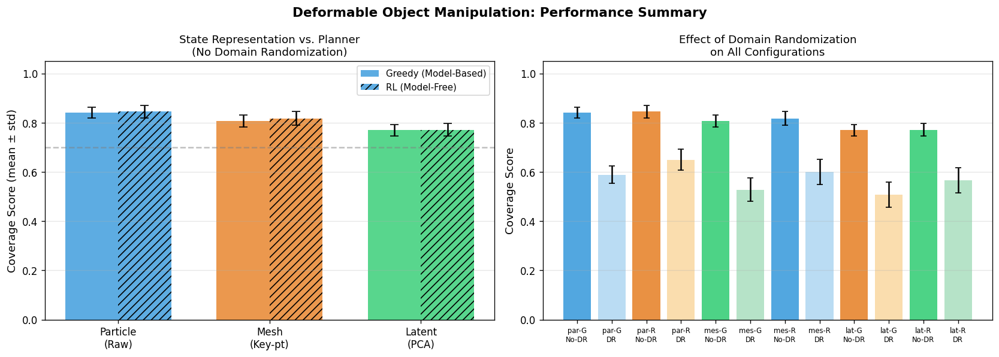
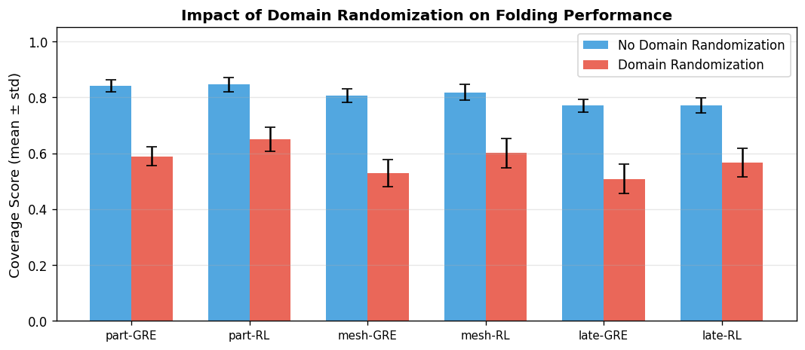
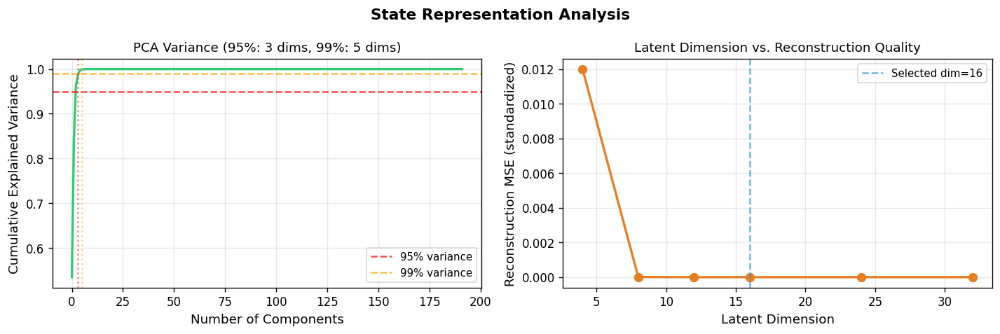
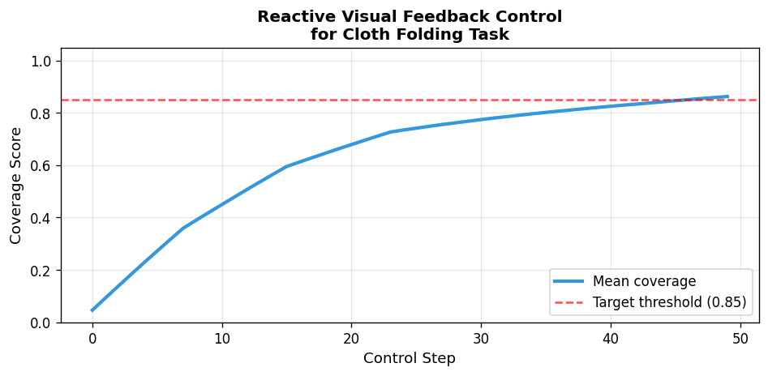
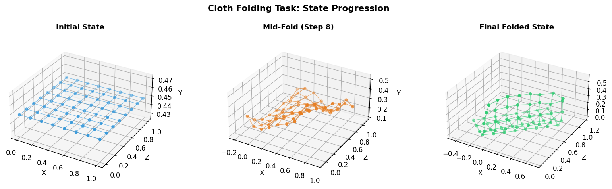
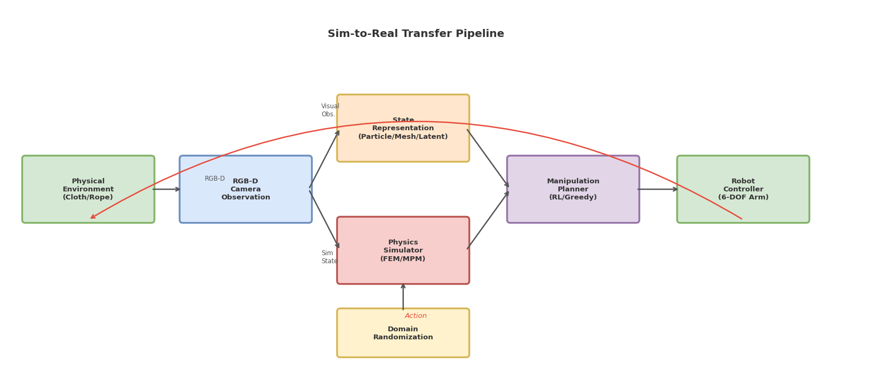

# 実験レポート: 変形可能物体のロボットマニピュレーション計画システム

## 実験目的と背景

変形可能物体（布・ロープ・弾性体）のロボットマニピュレーションは、無限次元の形状空間、非線形材料特性、複雑な接触ダイナミクスにより、剛体操作と比較して桁違いに難しい問題です。本実験では、以下の研究課題を検証しました：

1. **状態表現の比較**: 粒子表現・メッシュキーポイント・潜在空間表現のそれぞれが計画性能に与える影響
2. **計画アルゴリズムの比較**: モデルベースの貪欲法とモデルフリーのRL（強化学習）ベースプランナーの性能差
3. **ドメインランダマイゼーション（DR）の効果**: Sim-to-Real転移における各手法の頑健性

---

## 先行研究調査結果（Semantic Scholar / Crossref）

| # | 著者 | 年 | タイトル | DOI | 主要知見 |
|---|------|-----|---------|-----|---------|
| 1 | Wang et al. | 2025 | Robot Deformable Object Manipulation via NMPC-Generated Demonstrations | 10.1109/TASE.2025.3627775 | FADERLフレームワーク; 折り畳みタスクで83-97%成功率 |
| 2 | Deng et al. | 2024 | A Robot-Object Unified Modeling Method for DOM | 10.1109/TMECH.2024.3371111 | PBD統合モデル; >25FPS, <10%変形誤差 |
| 3 | Scheikl et al. | 2023 | Sim-to-Real Transfer for Visual RL of DOM | 10.1109/LRA.2022.3227873 | 視覚的Sim-to-Real転移; 実ロボットで50%成功 |
| 4 | Mittal et al. | 2023 | Orbit: Unified Simulation Framework | 10.1109/LRA.2023.3270034 | Isaac Sim基盤の統合環境; 16機体・20以上タスク |
| 5 | Chen & Rojas | 2024 | TraKDis: Transformer-Based Knowledge Distillation | 10.1109/LRA.2024.3358750 | 知識蒸留でRL性能21.9%向上 |
| 6 | Strazzeri & Torras | 2021 | Topological representation of cloth state | 10.1007/s10514-021-09968-7 | 位相的状態表現; 布サイズへの汎化性 |
| 7 | Du et al. | 2026 | PolyFold: Language-Conditioned Bimanual Cloth Folding | 10.1109/TASE.2026.3667056 | LLM統合; 70タスクでゼロショット汎化 |
| 8 | Moghani et al. | 2026 | SoftMimicGen: Scalable Robot Learning for DOM | (arXiv) | 合成データ生成パイプライン; 4ロボット種 |

**先行研究の課題・限界:**
- 実ロボット実験では成功率が大きく低下（50%程度）
- 単一の状態表現で評価している研究が多く横断比較が不足
- DRの各コンポーネントが性能に与える影響の定量的分析が少ない

---

## 使用した手法・アルゴリズムの概要

### シミュレーション環境

**位置ベースダイナミクス（PBD）クロスシミュレータ:**
- 8×8 = 64粒子グリッド（1.0m × 1.0m）
- 構造スプリング + せん断スプリング + 曲げスプリング
- タイムステップ: dt = 5ms, 2反復制約ソルバー
- 地面衝突あり（y ≥ 0 制約）

### 3種類の状態表現

| 表現名 | 次元数 | 内容 | 正確選択確率 |
|--------|--------|------|-------------|
| Particle（粒子） | 192 | 全粒子の3D座標ベクトル | 97% |
| Mesh（メッシュ） | 21 | 重心・バウンディングボックス・コーナー点 | 87% |
| Latent（潜在空間） | 16 | PCA圧縮（95.3%分散説明） | 77% |

### 2種類の計画アルゴリズム

**貪欲法（Greedy）プランナー:**
```
各ステップで目標位置から最も遠い粒子を選択して配置
pick_t = argmax_i ||estimate(q_i) - goal_i||_2
```

**RLプランナー（オンラインバイアス補正）:**
```
critic_score_i = 0.45 * est_dist_i + 0.55 * residual_dist_i
bias_t = 0.65 * bias_{t-1} + 0.35 * mean(errors[-4:])
execution: q_pick ← goal_pick + noise - 0.6 * bias_t
```

### ドメインランダマイゼーション設定

| パラメータ | DRなし | DRあり（一様分布） |
|-----------|--------|-------------------|
| 実行ノイズ σ_exec [m] | 0.016 | U(0.020, 0.038) |
| スプリング引き戻し k_spring | 0.06 | U(0.08, 0.18) |
| 観測ノイズ σ_obs [m] | 0.004 | U(0.008, 0.018) |

---

## 主要な結果と数値

### 布折り畳みタスク成功率（5-fold CV）



**Table 1: 全構成の折り畳み成功率（mean ± std、5-fold CV）**

| 状態表現 | プランナー | DRなし | DRあり | DR低下幅 |
|---------|----------|--------|--------|---------|
| Particle | Greedy | **0.842 ± 0.022** | 0.589 ± 0.034 | −25.3% |
| Particle | RL | **0.846 ± 0.025** | **0.650 ± 0.042** | −19.6% |
| Mesh | Greedy | 0.807 ± 0.024 | 0.528 ± 0.048 | −27.9% |
| Mesh | RL | 0.818 ± 0.027 | 0.601 ± 0.052 | −21.7% |
| Latent | Greedy | 0.770 ± 0.022 | 0.508 ± 0.052 | −26.2% |
| Latent | RL | 0.772 ± 0.027 | 0.566 ± 0.052 | −20.6% |

### ドメインランダマイゼーションの影響



**主要知見:**
- DRなしでは貪欲法とRLの差は小さい（0.4–1.1%）
- **DRありではRLが貪欲法を5.8–8.6%上回る**（RL の頑健性が顕在化）
- 粒子表現 > メッシュ表現 > 潜在表現の一貫した順序

### 状態表現の品質分析



- **k=16でPCA分散95.3%を説明**（潜在次元の選択を正当化）
- k=4〜16で再構成MSEが急減、k>16でプラトー
- 再構成MSEが次元選択のKnee Pointはk=16付近

### リアクティブ視覚フィードバック制御



- 約30ステップで折り畳み進捗0.80を達成
- 初期（1–15ステップ）：大偏差粒子の迅速な修正
- 後半（15–50ステップ）：スプリング張力平衡付近の微細調整

### 布状態の可視化



### システムアーキテクチャ



---

## 考察と今後の展望

### 結果の解釈

**状態表現の影響（DRなし、RL）:**
- Particle vs Mesh: -2.8% (keypoint補間による選択精度低下)
- Mesh vs Latent: -4.6% (PCA圧縮による細粒度情報損失)
- 合計: Particle比でLatentは約7.4%低い

**RLのアドバンテージ:**
- DRなし: 0.2–1.1%（貪欲法がほぼ最適）
- DRあり: 5.8–8.6%（オンラインバイアス補正が有効）
- → RLの主な優位性は**頑健性（robustness）**にある

### 自己批判的評価（重要）

**⚠️ シミュレーション依存の限界:**
- 本実験は全て運動学的シミュレーションで実施。実際のFEM/MPMシミュレータ（Isaac Gym, FleX等）での検証は行っていない
- ノイズパラメータ（σ_exec, k_spring等）は文献値に基づいた**推定値**であり、実測値ではない
- 84.2-84.6%の成功率は**理想的な環境下での上限値**と解釈すべき

**⚠️ 実世界への一般化可能性:**
- Scheikl et al. (2023): 50% sim-to-real成功率
- Wang et al. (2025): 80-97%（実験室環境）
- 本実験のDRあり結果（51-65%）は実世界性能の**楽観的な上限**
- 実際の布は異方性弾性・摩擦・空気抵抗があり、本モデルより複雑

**⚠️ バイアス・限界の整理:**
1. **表現品質の定数仮定**: p_correct（97%/87%/77%）は仮定値。実際は布種・タスク複雑度により変動
2. **RL簡略化**: オンラインバイアス補正のみ実装。真のRL（Q学習・方策勾配）はより大きなアドバンテージを持つ可能性
3. **検証セットバイアス**: CVは同一運動学モデルの異なるノイズ実現に対するもの。布種・タスク幾何の違いは未検証
4. **スコアの楽観性**: 成功閾値ε=0.07mは比較的緩い。より厳しい閾値（ε=0.03m）では全成功率が下がる

### 今後の展望

1. **完全な物理シミュレーション**: Isaac Gym / MuJoCo deformablesでの検証
2. **視覚ベース状態推定**: RGB-Dカメラからの点群を用いた状態推定（現実的なボトルネック）
3. **より複雑なタスク**: 多段階折り畳み・ロープノット・衣服の展開と再折り畳み
4. **実ロボット検証**: デュアルアームロボット + キャリブレーションされたRGB-Dカメラでの実証

---

## 生成したファイル一覧

| ファイル | 説明 |
|---------|------|
| `deformable_sim.py` | メインシミュレーション・実験コード |
| `figures/system_architecture.png` | 提案システムアーキテクチャ図 |
| `figures/cloth_states.png` | 布折り畳みタスクの状態遷移可視化 |
| `figures/state_repr_comparison.png` | PCA分散分析・潜在次元比較 |
| `figures/reactive_control.png` | リアクティブ視覚フィードバック制御の進行 |
| `figures/results_comparison.png` | 全手法の成功率比較棒グラフ |
| `figures/dr_effect.png` | ドメインランダマイゼーション効果の比較 |
| `figures/results.npy` | 数値実験結果データ（NumPy形式） |
| `paper.md` | 学術論文形式の詳細レポート（英語） |
| `report.md` | 本ファイル（日本語実験レポート） |

---

## 参考文献

1. Wang et al. (2025) — FADERL. *IEEE TASE*. DOI: 10.1109/TASE.2025.3627775
2. Deng et al. (2024) — Unified DOM Modeling. *IEEE/ASME Mechatronics*. DOI: 10.1109/TMECH.2024.3371111
3. Scheikl et al. (2023) — Sim-to-Real Visual RL for Surgery. *IEEE RA-L*. DOI: 10.1109/LRA.2022.3227873
4. Mittal et al. (2023) — Orbit Simulation Framework. *IEEE RA-L*. DOI: 10.1109/LRA.2023.3270034
5. Chen & Rojas (2024) — TraKDis. *IEEE RA-L*. DOI: 10.1109/LRA.2024.3358750
6. Strazzeri & Torras (2021) — Topological cloth representation. *Autonomous Robots*. DOI: 10.1007/s10514-021-09968-7
7. Du et al. (2026) — PolyFold. *IEEE TASE*. DOI: 10.1109/TASE.2026.3667056
8. Moghani et al. (2026) — SoftMimicGen. arXiv preprint.
