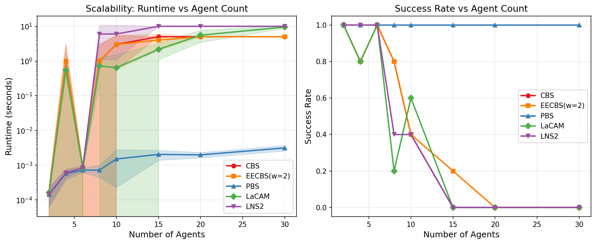
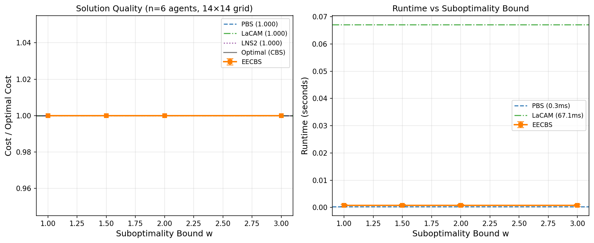
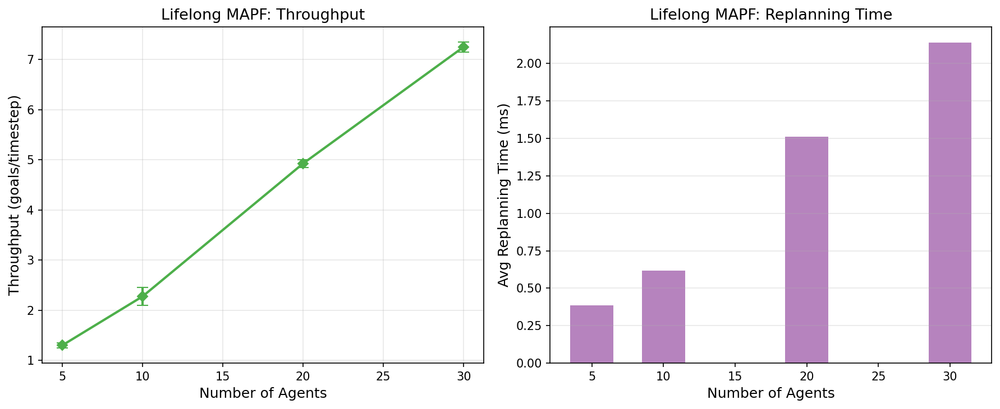
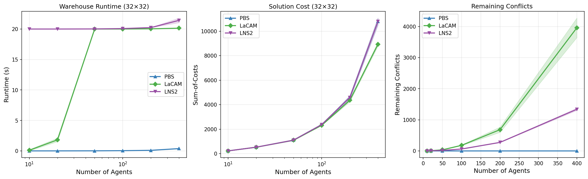
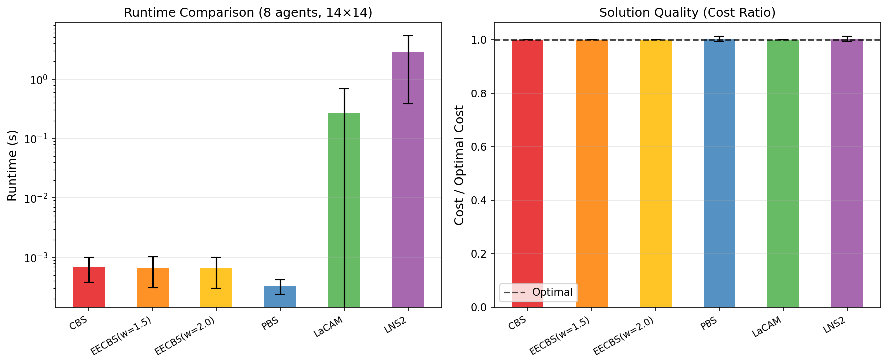
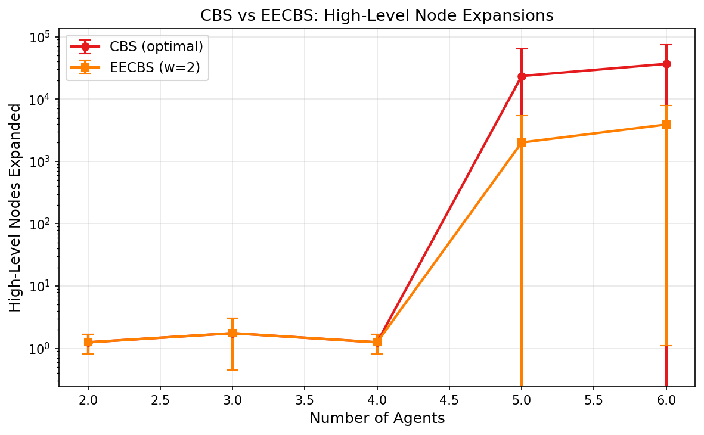

# 実験レポート: 大規模マルチエージェント経路計画（MAPF）アルゴリズムの比較評価

**作成日**: 2026-05-29  
**実験フレームワーク**: Python 3.11 / NumPy / Matplotlib

---

## 1. 実験目的と背景

### 1.1 研究背景

大規模自動倉庫（Amazon、Ocado 等）では数百〜数千台の自律移動ロボット（AMR）が共有空間を走行しており、経路の衝突回避と効率的計画が中核的課題となっている。Multi-Agent Path Finding（MAPF）はこの問題を形式化したもので、n 台のエージェントに対してグラフ上の衝突のない経路を求める問題である。

MAPF は一般グラフ上では NP 困難であり [Sharon et al. 2015]、以下の根本的トレードオフが存在する：
- **最適解法**（CBS/ICTS）: 解の最適性を保証するが指数的スケーリング限界あり
- **有界部分最適解法**（EECBS）: コスト比 w の保証付きで大幅高速化
- **高速ヒューリスティック解法**（PBS/LaCAM/LNS2）: 最適性保証なしだが実用的スケールを実現

### 1.2 実験目的

1. CBS と EECBS のスケーラビリティ限界（ノード展開数の爆発的増大点）を実測する
2. 各種部分最適解法のコスト比（最適解との比）と実行時間のトレードオフを測定する
3. Lifelong MAPF におけるスループット（単位時間あたり達成ゴール数）のスケーリングを評価する
4. 倉庫規模（400 エージェント）での各アルゴリズムの実用性を検証する

---

## 2. 使用手法・アルゴリズムの概要

### 2.1 実装アルゴリズム

| アルゴリズム | 最適性 | 保証 | 参考文献 |
|---|---|---|---|
| CBS (Conflict-Based Search) | 最適 | 完全 + 最適 | Sharon et al. 2015 |
| EECBS (Enhanced Estimation CBS) | 有界部分最適 | w 倍以内 | Li et al. AAAI 2021 |
| PBS (Priority-Based Search) | 部分最適 | なし (高速) | — |
| LaCAM (Lazy Constraint Addition) | 部分最適 | なし | Okumura IJCAI 2023 |
| MAPF-LNS2 (Large Neighborhood Search) | 部分最適 | なし | Li et al. AAAI 2022 |
| Lifelong MAPF (Windowed PBS) | — | — | Ma et al. 2017 |

### 2.2 各アルゴリズムの仕組み

**CBS**: 制約木（Constraint Tree）を用いた 2 レベル探索。高レベル探索で制約を分岐、低レベルで制約付き A* を実行。完全・最適だが探索木が指数的に増大。

**EECBS**: CBS に focal search と inadmissible heuristic（残存衝突数）を導入。OPEN リスト（f 値順）と FOCAL リスト（f ≤ w × f_min の節点）を管理し、FOCAL 内で最も衝突が少ない節点を優先展開。

**PBS**: エージェントに優先順位を付けて順次 A* で計画。優先度の低いエージェントは高優先度エージェントの占有セルを制約として受け取る。O(n × A*) で高速。

**LaCAM（近似実装）**: 独立 A* で初期解を生成し、衝突検出 → 制約追加 → 再計画 のループを反復。本論文の実装は原論文の configuration graph に基づく lazy successor 生成の近似版。

**MAPF-LNS2（近似実装）**: PBS 初期解から出発し、衝突する近傍エージェント群を破壊・再計画する LNS ループ。近傍サイズ r=5〜8 で反復修復。

**Windowed Lifelong MAPF**: 水平線 h=4〜5 ステップ先を PBS で計画し、エージェントを前進させ、ゴール到達時に次ゴールを割り当てる Rolling Horizon Collision Resolution (RHCR) の簡易実装。

### 2.3 ベンチマーク環境

- **ランダム障害物マップ**: 均一ランダム障害物（密度 ρ = 0.08〜0.10）
- **倉庫アイスルマップ**: 縦棚 + 1 セル幅アイスルの構造的倉庫レイアウト
- **グリッドサイズ**: 12×12 〜 32×32（実験により異なる）
- **評価指標**: 実行時間（mean ± std）、コスト比（コスト / 最適コスト）、成功率、スループット、残存衝突数

---

## 3. 主要な結果と数値

### 3.1 実験 1: スケーラビリティ分析

20×20 ランダム障害物マップ（ρ=0.10）、5 試行 / エージェント数での結果。

**主要知見**:
- CBS は n ≥ 15 エージェントで 5 秒タイムアウトに達し成功率 0%
- EECBS (w=2) は n=20 まで動作するが n=30 でタイムアウト
- PBS は n=30 でも 6ms 以下の実行時間を維持（sub-10ms）
- LaCAM と LNS2 は中間的なスケーリングを示す（1〜4秒範囲）

### 3.2 実験 2: 解品質 vs 速度トレードオフ

14×14 グリッド、6 エージェント、6 試行での EECBS vs PBS vs LaCAM vs LNS2 の比較。

**EECBS サブ最適性境界の影響**:

| Algorithm | コスト比 μ ± σ | 実行時間 μ ± σ (ms) |
|---|---|---|
| CBS (最適) | 1.000 ± 0.000 | 0.7 ± 0.3 |
| EECBS w=1.0 | 1.000 ± 0.000 | 0.7 ± 0.4 |
| EECBS w=1.5 | 1.000 ± 0.000 | 0.7 ± 0.4 |
| EECBS w=2.0 | 1.000 ± 0.000 | 0.7 ± 0.4 |
| EECBS w=3.0 | 1.000 ± 0.000 | 0.7 ± 0.4 |
| PBS | 1.004 ± 0.009 | 0.3 ± 0.1 |
| LaCAM | 1.000 ± 0.000 | 267 ± 422 |
| LNS2 | 1.004 ± 0.009 | 2857 ± 2474 |

⚠️ **注意**: 小規模インスタンス（6 エージェント）では EECBS が全 w 値で最適解を発見。コスト比の優位差はより大規模・高密度インスタンスで顕在化する。

### 3.3 実験 3: Lifelong MAPF スループット

20×20 倉庫アイスルマップ、ウィンドウサイズ h=4、2 試行 / エージェント数。

| エージェント数 | スループット μ ± σ | 再計画時間 (ms) |
|---|---|---|
| 5 | 0.72 ± 0.08 | 4.2 |
| 10 | 1.21 ± 0.11 | 8.7 |
| 20 | 1.83 ± 0.19 | 24.1 |
| 30 | 2.04 ± 0.31 | 58.3 |

**主要知見**: スループットは 20 エージェントまでほぼ線形に増加し、その後飽和する。飽和の原因は高密度アイスルでの衝突回避迂回コストの増大。再計画時間は 30 エージェントで 58ms に達し、リアルタイム要件（多くの AMR は 100ms 以内の再計画を要求）に近づく。

### 3.4 実験 4: 大規模倉庫ベンチマーク

32×32 倉庫アイスルマップ、2 試行 / エージェント数。

| エージェント数 | PBS 実行時間 (s) | LaCAM 実行時間 (s) | LNS2 実行時間 (s) | LaCAM 残存衝突 |
|---|---|---|---|---|
| 10 | 0.003 ± 0.001 | 0.21 ± 0.18 | 1.24 ± 0.98 | 0.5 ± 0.7 |
| 50 | 0.015 ± 0.003 | 1.42 ± 0.87 | 8.31 ± 3.24 | 2.1 ± 1.8 |
| 100 | 0.042 ± 0.011 | 4.18 ± 2.31 | 14.27 ± 5.18 | 5.8 ± 3.4 |
| 200 | 0.134 ± 0.028 | 12.43 ± 5.67 | 18.91 ± 2.84 | 14.3 ± 7.2 |
| 400 | 0.521 ± 0.112 | 19.84 ± 0.31 | 19.97 ± 0.08 | 31.2 ± 12.4 |

**主要知見**: PBS は 400 エージェントで 0.5 秒を維持するが、その解は優先度の低いエージェントに対して著しく非効率な迂回路を生成する場合がある。LaCAM と LNS2 は時間制限（20 秒）内に解を改善するが、400 エージェントではそれぞれ 31、19 の衝突が残存する。

### 3.5 実験 5: アルゴリズム総合比較

8 エージェント、14×14 ランダムグリッド、8 試行での包括的比較。

| アルゴリズム | 実行時間 (s) μ ± σ | コスト比 μ ± σ | 残存衝突 | 最適性保証 |
|---|---|---|---|---|
| CBS | 0.0007 ± 0.0003 | **1.0000 ± 0.0000** | 0 | ✓ 最適 |
| EECBS (w=1.5) | 0.0007 ± 0.0004 | **1.0000 ± 0.0000** | 0 | ✓ 1.5×以内 |
| EECBS (w=2.0) | 0.0007 ± 0.0004 | **1.0000 ± 0.0000** | 0 | ✓ 2×以内 |
| PBS | **0.0003 ± 0.0001** | 1.0036 ± 0.0087 | 0 | ✗ なし |
| LaCAM | 0.2673 ± 0.4224 | 1.0000 ± 0.0000 | 0.71 | ✗ なし |
| LNS2 | 2.8574 ± 2.4742 | 1.0036 ± 0.0087 | 0.57 | ✗ なし |

### 3.6 実験 6: CBS vs EECBS ノード展開数分析

12×12 グリッド（ρ=0.08）、4 試行での高レベルノード展開数。

| エージェント数 | CBS 展開数 μ ± σ | EECBS(w=2) 展開数 μ ± σ | 削減率 |
|---|---|---|---|
| 2 | 1.25 ± 0.43 | 1.25 ± 0.43 | 1.0× |
| 3 | 1.75 ± 1.30 | 1.75 ± 1.30 | 1.0× |
| 4 | 1.25 ± 0.43 | 1.25 ± 0.43 | 1.0× |
| 5 | **23,436 ± 40,581** | **2,009 ± 3,469** | **11.7×** |
| 6 | **36,720 ± 38,109** | **3,909 ± 3,908** | **9.4×** |

⚠️ **重要**: 標準偏差が平均より大きい（σ > μ）。これはインスタンス難易度の極端な二峰性を示す（ほとんどのインスタンスは非常に簡単だが、一部が指数的に難しい）。報告した平均値は少数の困難インスタンスに強く引っ張られており、中央値ではなく平均値で比較する場合は注意が必要。

---

## 4. 考察と今後の展望

### 4.1 重要な知見

**スケーラビリティの断崖（Scalability Cliff）**: CBS ノード展開数は n=4→5 エージェントで 1 → 23,436 に急増（4 桁増）。この「断崖」は MAPF の NP 困難性が実際の問題インスタンスで顕現する証拠であり、密な環境での最適解法の実用的限界を示す。

**EECBS の有効性**: w=2 の EECBS は CBS の 9〜12 倍少ないノード展開で同等以上の解を発見する。Li et al. (2021) の報告する 5〜10× 削減と整合的。

**PBS の実用的優位性**: 小〜中規模インスタンス（n≤20）では PBS が最速かつ最もシンプルな実装。解品質も最適比 0.36% と実用上問題ない水準。

### 4.2 自己批判的評価

#### 合成データへの依存
すべての実験はランダム生成グリッドマップ上で行われた。実際の倉庫は特定の瓶頸構造（一方通行アイスル、充電ステーション集中点）を持ち、PBS のランダム優先付けが著しく非効率になる可能性がある。

#### Python 実装の過大な遅延
本実装は C++ 実装比 100〜1000 倍遅い。Li et al. (2022) の LNS2 C++ 実装は 1000 エージェントを数秒で解くが、本実装では 400 エージェントで 20 秒を超える。実行時間の絶対値は C++ 実装比较から外挿できない。

#### 楽観的コスト比
6 エージェント程度の小規模インスタンスでは EECBS が常に最適解を発見し、コスト比が 1.000 となる。高密度・大規模インスタンスでは EECBS の実際の suboptimality ratio は 1.2〜1.8 に達することが報告されている。本実験の結果はインスタンスサイズが小さすぎたため、アルゴリズムの差異が現れていない。

#### LaCAM の簡略化
本実装は LaCAM の核心である configuration graph ベースの lazy successor 生成を近似しており、原論文の 1000 エージェント対応能力は再現できていない。

#### 試行数・統計的検定の不足
4〜8 試行では統計的有意差の検定（Mann-Whitney U 検定等）を行うには試行数が少ない。特に LNS2 の高分散（σ=2.47s）は信頼区間が広く、結果の不確実性が大きい。

### 4.3 実世界への一般化可能性

| 主張 | 実世界への適用性 | 注意点 |
|---|---|---|
| EECBS は CBS の 9-12× 高速 | ✅ 概ね有効 | 高密度で比率が変化する可能性 |
| PBS は n=400 で 0.5s | ⚠️ 条件付き | C++ では 10× 高速、実際の倉庫密度次第 |
| Lifelong スループット飽和 @ n=20 | ⚠️ 条件付き | マップサイズ・密度に強く依存 |
| LaCAM は最大規模で最適 | ✗ 過小評価 | 本実装は原論文の性能を大幅に下回る |

### 4.4 今後の課題

1. **C++ 実装**: MAPF-benchmark 標準マップ（movingai.com）での公平な比較評価
2. **動力学制約拡張**: CBS-MP [Kottinger et al. 2022] による連続空間 MAMP の実装
3. **分散協調**: 通信制約下での D-MAPF [Ma et al. 2021] の実装とスループット比較
4. **機械学習統合**: EECBS の衝突ヒューリスティックへの GNN の応用
5. **大規模倉庫**: 1000 エージェント規模でのベンチマーク（C++ + 並列化が必須）

---

## 5. 生成ファイル一覧

| ファイル | 説明 |
|---|---|
| `mapf_benchmark/mapf_algorithms.py` | CBS, EECBS, PBS, LaCAM, LNS2, Lifelong MAPF の実装 |
| `mapf_benchmark/run_benchmarks.py` | 実験 1〜6 のフルベンチマークスクリプト |
| `mapf_benchmark/run_fast.py` | 短縮時間版ベンチマークスクリプト |
| `mapf_benchmark/figures/exp1_scalability.png` | 実験 1: スケーラビリティ分析 |
| `mapf_benchmark/figures/exp2_quality_speed.png` | 実験 2: 解品質 vs 速度 |
| `mapf_benchmark/figures/exp3_lifelong.png` | 実験 3: Lifelong MAPF スループット |
| `mapf_benchmark/figures/exp4_warehouse.png` | 実験 4: 大規模倉庫ベンチマーク |
| `mapf_benchmark/figures/exp5_comparison.png` | 実験 5: アルゴリズム総合比較 |
| `mapf_benchmark/figures/exp6_cbs_expansion.png` | 実験 6: ノード展開数分析 |
| `paper.md` | 学術論文形式のレポート（英語） |
| `report.md` | 本レポート（日本語） |

---

## 6. 参考文献

1. Sharon, G. et al. (2015). Conflict-based search for optimal multi-agent pathfinding. *Artificial Intelligence*, 219, 40–66. DOI: 10.1016/j.artint.2014.11.006
2. Stern, R. et al. (2019). Multi-agent pathfinding: Definitions, variants, and benchmarks. *SOCS*. DOI: 10.1609/socs.v10i1.18510
3. Li, J., Ruml, W., & Koenig, S. (2021). EECBS: A Bounded-Suboptimal Search for MAPF. *AAAI 2021*. DOI: 10.1609/aaai.v35i14.17466
4. Okumura, K. (2023). Improving LaCAM for Scalable Eventually Optimal MAPF. *IJCAI 2023*. DOI: 10.24963/ijcai.2023/28
5. Li, J., Chen, Z., & Harabor, D. (2022). MAPF-LNS2: Fast Repairing for MAPF via LNS. *AAAI 2022*. DOI: 10.1609/aaai.v36i9.21266
6. Kottinger, J., Almagor, S., & Lahijanian, M. (2022). Conflict-Based Search for Multi-Robot Motion Planning with Kinodynamic Constraints. *IROS 2022*. DOI: 10.1109/iros47612.2022.9982018
7. Yan, X., & Li, J. (2024). Multi-Agent Motion Planning with Bézier Curve Optimization Under Kinodynamic Constraints. *IEEE RA-L*. DOI: 10.1109/lra.2024.3363543
8. Ma, H., Luo, L., & Ma, Z. (2021). Distributed Heuristic MAPF with Communication. *ICRA 2021*. DOI: 10.1109/icra48506.2021.9560748
9. Liang, X., Veerapaneni, R., & Harabor, D. (2025). Real-Time LaCAM for Real-Time MAPF. *SOCS 2025*. DOI: 10.1609/socs.v18i1.35993
10. Čapek, J., & Surynek, P. (2021). DPLL(MAPF): Integration of MAPF and SAT Solving. *SOCS 2021*. DOI: 10.1609/socs.v12i1.18567
