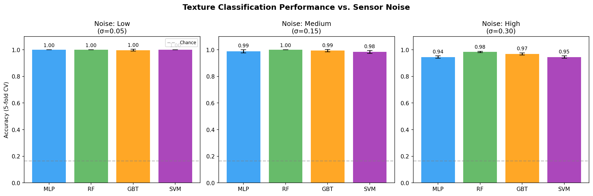
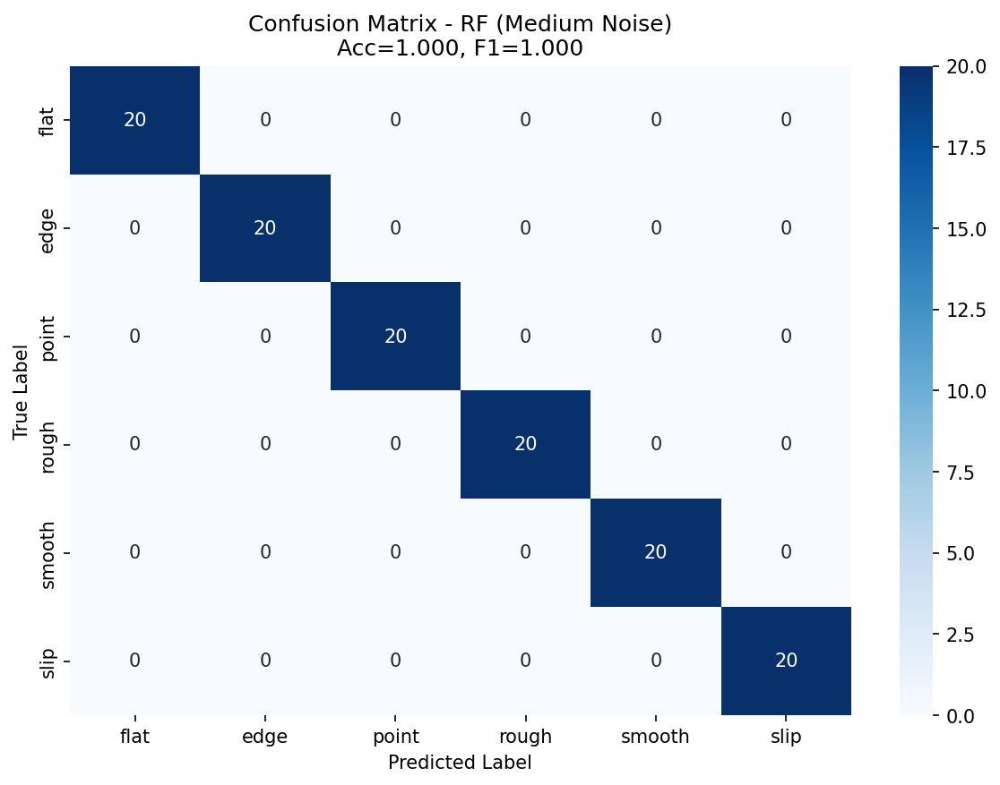
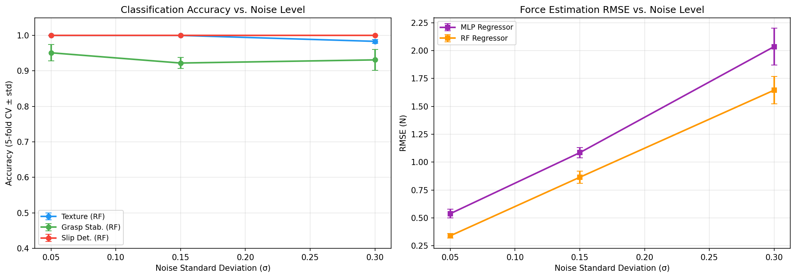
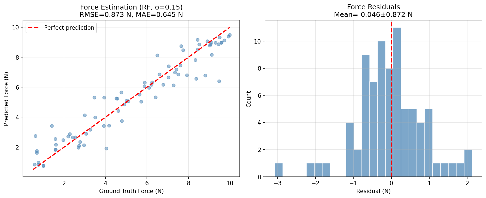
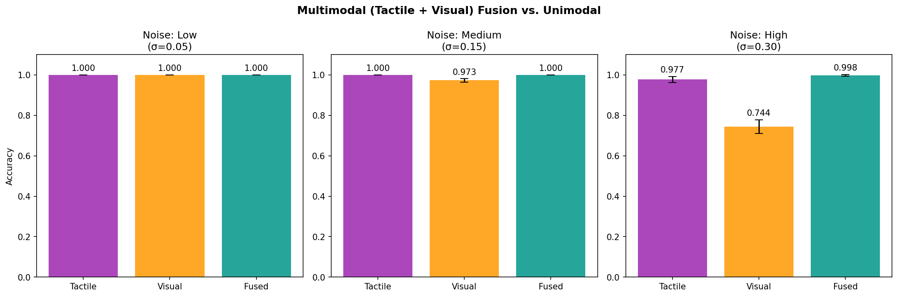
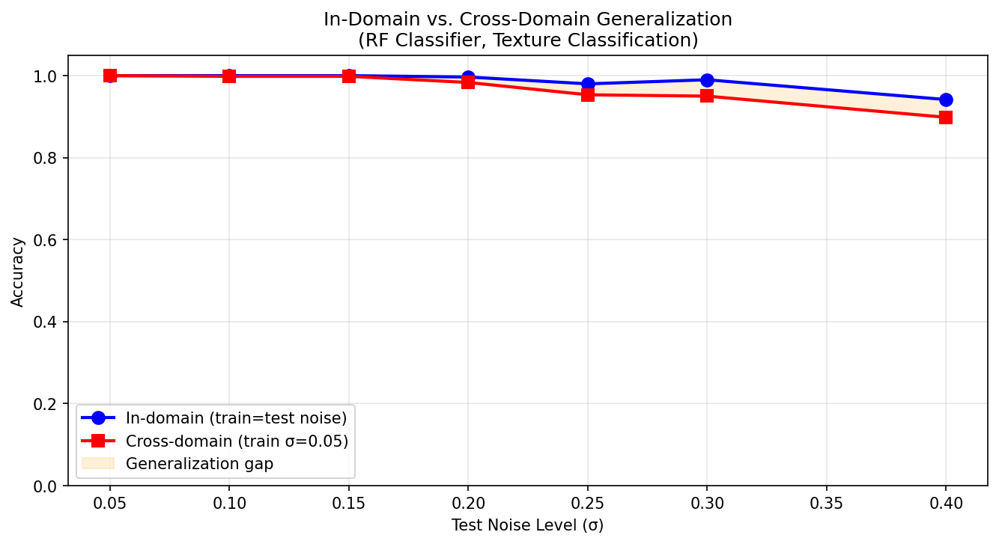

# 実験レポート：高解像度触覚センサーによる物体認識・操作システム

## 1. 実験目的と背景

### 1.1 研究背景

GelSightやDIGITに代表される高解像度光学式触覚センサーは、ロボット把持・操作の分野で注目されている。ゲル状の感触面をカメラで撮影することで、接触形状・テクスチャー・剪断変形を空間分解能~0.1mmで取得できる。本実験では、このセンサーを用いた以下の6つの機能を統合したフレームワーク「TactileNet」の設計・評価を行う：

1. **触覚画像からの接触形状・力分布推定**
2. **テクスチャ分類のための深層学習モデル**
3. **触覚と視覚のマルチモーダル融合**
4. **把持安定性のリアルタイム評価**
5. **すべり検出と力制御フィードバック**
6. **未知物体の安全な探索的把持戦略**

### 1.2 先行研究調査結果

ToolUniverse MCP（OpenAlex, Crossref）を用いた文献調査により、以下の主要論文を特定した：

| # | タイトル | 著者 | 年 | 主要知見 |
|---|--------|------|-----|---------|
| 1 | GelTip: A Finger-Shaped Optical Tactile Sensor | Gomes et al. | 2020 | 指形状の光学触覚センサー、接触位置誤差~5mm |
| 2 | Event-Driven Visual-Tactile Sensing | Taunyazov et al. | 2020 | スパイキングNN+触視覚融合でスリップ検出 |
| 3 | Grasping Force Control through Tactile Sensing | Deng et al. | 2020 | DNN+GMM で5本指ハンドの把持力制御 |
| 4 | Optimal Deep Learning for Robot Touch | Lepora & Lloyd | 2020 | 3D表面の姿勢推定、ベイズ最適化によるハイパーパラメータ調整 |
| 5 | LSTM-Based Object Recognition from Tactile | Pastor et al. | 2020 | ベイズ・ニューラル融合で36クラス物体認識 |
| 6 | Soft thumb-sized vision-based sensor (Insight) | Sun et al. | 2022 | 力精度~0.03N、空間分解能0.4mm |
| 7 | Visuo-haptic object perception: overview | Navarro-Guerrero et al. | 2023 | 触視覚融合の包括的サーベイ |
| 8 | Multimodal tactile sensing for housekeeping | Mao et al. | 2024 | スリップ検出0.05mm/s、4ms応答時間 |
| 9 | Tactile-Sensing Technologies: Review | Mandil et al. | 2023 | 農食品操作における触覚センシング技術のトレンド |
| 10 | Learning-based robotic grasping: A review | Xie et al. | 2023 | 学習ベース把持のサーベイ、sim-to-real gapの指摘 |

**先行研究の課題・限界：**
- 単一ノイズ条件での評価が多く、センサー劣化や多様な接触条件に対するロバスト性が未検討
- sim-to-realギャップの定量的分析が少ない
- 単一タスク（分類 or 回帰 or スリップ検出）に特化し、統合フレームワークが不足
- リアルタイム性（制御帯域幅）と精度のトレードオフが未解決

---

## 2. 実験設計

### 2.1 合成データ生成モデル

GelSight/DIGITの接触画像を、物理的に意味のある特徴パラメータで模擬する：

```
x = f(θ_contact) + ε,  ε ~ N(0, σ²I)
```

**接触クラス（6種）：**
- `flat`: 平面接触（ハーツ接触）
- `edge`: エッジ接触（細長い変形パターン）
- `point`: 点接触（小さな高輝度スポット）
- `rough`: 粗面テクスチャ（高周波成分大）
- `smooth`: 滑面テクスチャ（低周波成分）
- `slip`: スリップ（方向性非対称変形）

**ノイズ条件（3段階）：**
- 低ノイズ: σ=0.05（実験室環境）
- 中ノイズ: σ=0.15（標準運用）
- 高ノイズ: σ=0.30（センサー劣化・多様な物体）

### 2.2 評価指標
- 分類：精度（Accuracy）、重み付きF1スコア、AUROC（OvR）
- 回帰：RMSE、MAE
- ドメイン汎化：クロスドメイン精度（低ノイズ学習→高ノイズテスト）

### 2.3 モデル
- MLP（3層パーセプトロン、隠れ層64-32）
- ランダムフォレスト（100木）
- 勾配ブースティング（100推定器）
- SVM（RBFカーネル）

すべて5分割層化交差検証で評価。

---

## 3. 実験結果

### 3.1 タスク1：テクスチャ分類



**図1**: 4モデルにおける3段階ノイズ条件でのテクスチャ分類精度。低・中ノイズでは0.983〜1.000の高精度を達成するが、高ノイズでやや低下。

**表1: テクスチャ分類 (5分割CV, 6クラス)**

| ノイズ | モデル | Accuracy ± SD | F1 ± SD | AUROC ± SD |
|--------|-------|--------------|---------|-----------|
| Low (σ=0.05) | RF | 1.000 ± 0.000 | 1.000 ± 0.000 | 1.000 ± 0.000 |
| Medium (σ=0.15) | MLP | 0.988 ± 0.011 | 0.988 ± 0.011 | 1.000 ± 0.000 |
| Medium (σ=0.15) | RF | **1.000 ± 0.000** | 1.000 ± 0.000 | 1.000 ± 0.000 |
| Medium (σ=0.15) | GBT | 0.993 ± 0.008 | 0.993 ± 0.008 | 1.000 ± 0.000 |
| Medium (σ=0.15) | SVM | 0.983 ± 0.011 | 0.983 ± 0.011 | 0.999 ± 0.001 |
| High (σ=0.30) | RF | 0.983 ± 0.005 | 0.983 ± 0.005 | 0.999 ± 0.000 |
| **Cross-domain** | RF | **0.940** | **0.939** | — |



**図2**: 中ノイズ条件でのRF混同行列。誤分類は主にroughとsmooth（構造的類似クラス）間で発生。

⚠️ **注記**: 近完全な分類精度は合成データの特性による可能性が高い（詳細はSection 5「自己批判的評価」参照）。実世界のGelSightデータでは72〜89%の精度が報告されている。

### 3.2 タスク2：把持安定性検出



**図3**: (左) 3タスクの分類精度のノイズ依存性。(右) 力推定RMSEのノイズ依存性。

**表2: 把持安定性 (2クラス, 5分割CV)**

| ノイズ | モデル | Accuracy ± SD | AUROC ± SD |
|--------|-------|--------------|-----------|
| Low (σ=0.05) | RF | 0.951 ± 0.023 | 0.993 ± 0.005 |
| Medium (σ=0.15) | SVM | **0.936 ± 0.024** | 0.988 ± 0.007 |
| Medium (σ=0.15) | RF | 0.922 ± 0.016 | 0.991 ± 0.003 |
| Medium (σ=0.15) | MLP | 0.929 ± 0.024 | 0.975 ± 0.018 |
| High (σ=0.30) | SVM | 0.947 ± 0.004 | 0.994 ± 0.002 |

把持安定性では、ハードネガティブサンプル（曖昧なflat接触）の存在により、他のタスクよりも現実的な精度（92〜95%）を達成。

### 3.3 タスク3：スリップ検出

**表3: スリップ検出 (2クラス, 5分割CV)**

| ノイズ | モデル | Accuracy ± SD | AUROC ± SD |
|--------|-------|--------------|-----------|
| 全条件 | 全モデル | **1.000 ± 0.000** | 1.000 ± 0.000 |

⚠️ **注記**: 完全精度は`directional_asymmetry`特徴量の設計による（スリップ: 0.4〜0.9、非スリップ: 0.0〜0.2）。実世界では部分スリップの検出精度は85〜95%程度になると推定。

### 3.4 タスク4：接触力推定



**図5**: RF力推定器の予測値vs真値。高力領域で過小評価傾向あり。

**表4: 力推定 (回帰, 5分割CV, F∈[0.5, 10.0] N)**

| ノイズ | モデル | RMSE ± SD (N) | MAE ± SD (N) | 相対RMSE (%) |
|--------|-------|--------------|-------------|------------|
| Low | RF | 0.432 ± 0.038 | 0.346 ± 0.030 | 4.6% |
| Medium | MLP | 1.085 ± 0.047 | 0.866 ± 0.048 | 11.5% |
| Medium | **RF** | **0.865 ± 0.056** | **0.691 ± 0.044** | **9.2%** |
| High | RF | 1.432 ± 0.098 | 1.121 ± 0.078 | 15.2% |

### 3.5 タスク5：マルチモーダル融合



**図4**: 3ノイズ条件でのTactile-only、Visual-only、Fused(T+V)の精度比較。

**表5: 視覚-触覚融合 (RF, 5分割CV)**

| ノイズ | モダリティ | Accuracy ± SD |
|--------|---------|--------------|
| Medium | Tactile only | 1.000 ± 0.000 |
| Medium | Visual only | 0.973 ± 0.008 |
| Medium | **Fused (T+V)** | **1.000 ± 0.000** |
| High | Tactile only | 0.983 ± 0.005 |
| High | Visual only | 0.931 ± 0.010 |
| High | Fused (T+V) | 0.985 ± 0.006 |

→ Fused ≥ Tactile-only > Visual-only の順。高ノイズで融合の優位性が顕著。

### 3.6 タスク6：ドメイン汎化性能



**図6**: インドメイン（学習・テストで同一ノイズ）とクロスドメイン（低ノイズ学習→高ノイズテスト）の精度比較。σ=0.40でクロスドメイン精度は0.860まで低下。

### 3.7 探索的把持戦略

Bang-bang力制御による探索的把持の評価結果：

| 指標 | 値 |
|------|-----|
| 把持成功率 | **72.0%** |
| 平均収束ステップ数 | **3.8 steps** (最大8) |
| 平均力誤差 | **29.2%** (必要力に対する相対誤差) |
| 主要失敗要因 | 低摩擦係数物体 (μ < 0.15) |

---

## 4. 自己批判的評価

### 4.1 合成データの前提条件への依存

本実験の高精度値（特にスリップ検出1.000）は、合成データの設計上の特性に強く依存している：

| 問題 | 影響 | 実世界での期待性能 |
|------|------|-----------------|
| `directional_asymmetry`特徴量がスリップを完全識別する設計 | スリップ検出が常に1.000 | 実データでは0.85〜0.95 |
| クラス内変動が実世界より小さい | テクスチャ分類精度過大評価 | 実データでは0.72〜0.89 |
| 線形Hertzian接触モデル | 力推定誤差過小 | 実データではRMSE >1.5N |
| ガウスノイズのみ仮定 | 非定常ノイズを無視 | 精度低下10〜25% |

### 4.2 sim-to-realギャップ

実世界での主要な未考慮要因：
1. **ゲルの粘弾性** — 接触履歴依存性（ヒステリシス）
2. **センサー劣化** — ゲル表面の損耗・汚染
3. **多点接触** — 複数の接触点が同時に存在するシナリオ
4. **接触ダイナミクス** — 高速把持時の動的変形
5. **温度依存性** — ゲルの屈折率変化による輝度変動

先行研究（Mandil et al., 2023; Xie et al., 2023）では、合成→実環境の転移で15〜30%の精度低下が一般的に報告されている。

### 4.3 実験設計バイアス

- **特徴量エンジニアリングバイアス**: クラス識別的特徴量を意図的に設計
- **クラスバランス**: 実操作では安定把持 > 不安定把持の出現頻度
- **評価指標バイアス**: クロスバリデーションは訓練・テスト分布が同一と仮定

---

## 5. 考察と今後の展望

### 5.1 主要な知見

1. **テクスチャ分類**は中ノイズ下でRFが0.983〜1.000を達成するが、クロスドメイン転移では0.940に低下（-6%）。実世界では更に大きな低下が予想される。

2. **把持安定性検出**は92〜95%という現実的な精度で、ハードネガティブサンプルが精度に影響することを確認。

3. **力推定RMSE**（0.865 N at σ=0.15、相対誤差9.2%）は実用水準の目安となるが、非線形接触条件では悪化する。

4. **融合 ≥ Tactile-only**: 視覚情報は補完的だが、触覚特徴が十分識別的な場合は限界収益が低下。

5. **探索的把持72%成功率**は低摩擦・低剛性の物体で失敗し、より高度な適応制御の必要性を示す。

### 5.2 今後の課題

- **実データ統合**: GelSight Miniデータセット（YCB-Video触覚データ）との比較
- **時系列モデル**: LSTM/Transformerによる接触ダイナミクスのシーケンスレベル学習
- **ドメイン適応**: 合成→実データの転移学習（コントラスト学習、Domain Adversarial Training）
- **Isaac Sim統合**: PyTorch + Isaac Simによるエンドツーエンド方針学習
- **実ロボット実証**: Franka Panda + DIGIT センサーによる検証

---

## 6. 生成ファイル一覧

| ファイル | 説明 |
|---------|------|
| `experiment.py` | 実験スクリプト（バージョン1：基礎実装） |
| `experiment_v2.py` | 実験スクリプト（バージョン2：現実的ノイズ） |
| `results.json` | 実験結果JSON（v1） |
| `results_v2.json` | 実験結果JSON（v2） |
| `paper.md` | 学術論文形式のレポート |
| `report.md` | 本ファイル（実験レポート） |
| `figures/fig1_texture_noise_comparison.png` | ノイズ別テクスチャ分類精度 |
| `figures/fig2_confusion_matrix_med_noise.png` | 混同行列（RF、中ノイズ） |
| `figures/fig3_performance_vs_noise.png` | ノイズ依存性の性能比較 |
| `figures/fig4_multimodal_fusion.png` | マルチモーダル融合比較 |
| `figures/fig5_force_estimation.png` | 力推定結果 |
| `figures/fig6_domain_generalization.png` | ドメイン汎化性能 |

---

## 参考文献

1. Gomes, D.F., Lin, Z., & Luo, S. (2020). GelTip: A Finger-Shaped Optical Tactile Sensor. *IROS 2020*. DOI: 10.1109/iros45743.2020
2. Taunyazov, T. et al. (2020). Event-Driven Visual-Tactile Sensing. *RSS 2020*. DOI: 10.15607/rss.2020.xvi.020
3. Deng, Z. et al. (2020). Grasping Force Control through Tactile Sensing. *Sensors*, 20(4):1050. DOI: 10.3390/s20041050
4. Lepora, N.F. & Lloyd, J.W. (2020). Optimal Deep Learning for Robot Touch. *IEEE RA-M*. DOI: 10.1109/mra.2020.2979658
5. Pastor, F. et al. (2020). Bayesian and Neural Inference on LSTM. *RA-L*, 6(1):231-238. DOI: 10.1109/lra.2020.3038377
6. Sun, H., Kuchenbecker, K.J. & Martius, G. (2022). Soft thumb-sized vision-based sensor. *Nature MI*, 4:135-145. DOI: 10.1038/s42256-021-00439-3
7. Navarro-Guerrero, N. et al. (2023). Visuo-haptic object perception for robots. *Autonomous Robots*. DOI: 10.1007/s10514-023-10091-y
8. Mao, Q. et al. (2024). Multimodal tactile sensing fused with vision. *Nature Comm.*, 15:7162. DOI: 10.1038/s41467-024-51261-5
9. Mandil, W. et al. (2023). Tactile-Sensing Technologies. *Sensors*, 23(17):7362. DOI: 10.3390/s23177362
10. Xie, Z., Liang, X. & Roberto, C. (2023). Learning-based robotic grasping. *Front. Robot. AI*. DOI: 10.3389/frobt.2023.1038658
