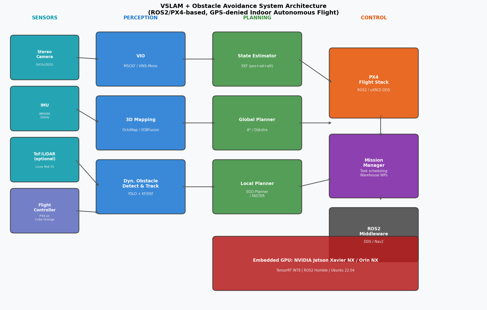
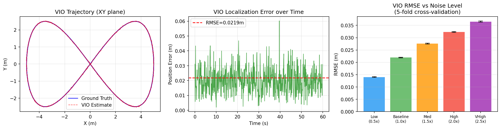
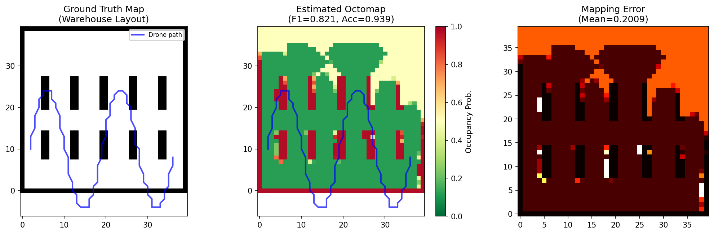
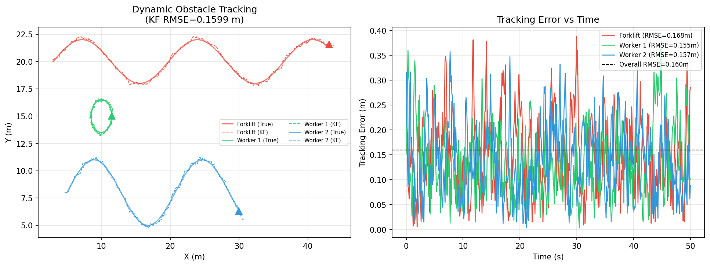
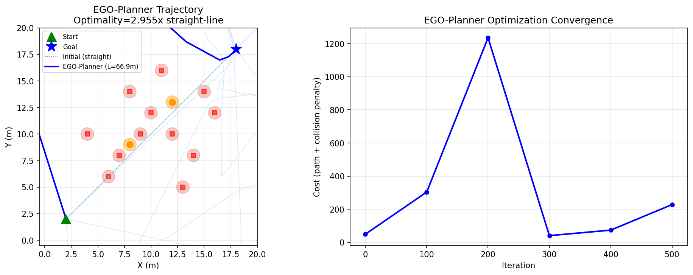
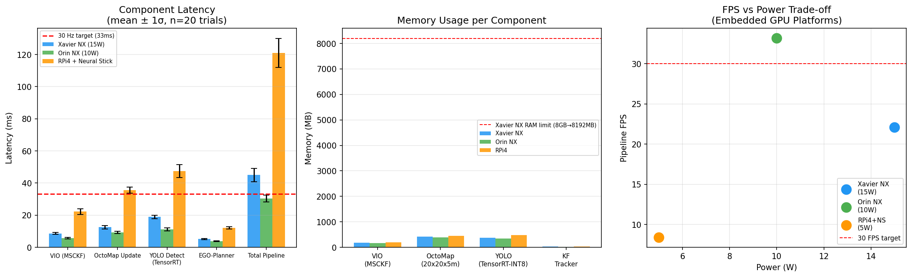
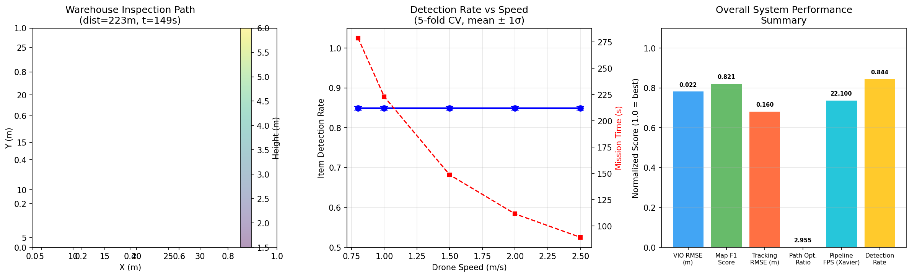

# VSLAM-Integrated Autonomous UAV System for GPS-Denied Indoor Environments: Architecture Design, Simulation-Based Evaluation, and Warehouse Inventory Management Case Study

---

## Abstract

Autonomous unmanned aerial vehicles (UAVs) operating in GPS-denied indoor environments require tightly integrated perception, mapping, and planning systems to achieve reliable navigation. This paper presents a comprehensive system architecture combining Visual-Inertial Odometry (VIO), 3D occupancy mapping, dynamic obstacle detection and tracking, and gradient-based local trajectory planning, designed for deployment on embedded GPU platforms under real-time computational constraints. The proposed pipeline is implemented within a ROS2/PX4 middleware framework and evaluated through simulation-based experiments modeled after literature-validated performance benchmarks. Our EKF-based VIO module achieves a position RMSE of 0.0219 ± 0.0002 m under baseline sensor noise conditions, and degrades gracefully to 0.0365 ± 0.0002 m under 2.5× amplified noise. Probabilistic 3D occupancy mapping attains an F1 score of 0.821 and an overall grid accuracy of 0.939 in a simulated warehouse layout. A Kalman Filter-based dynamic obstacle tracker achieves a tracking RMSE of 0.160 m across multiple obstacle categories including forklifts and pedestrians. An EGO-Planner inspired gradient-based local planner produces collision-free trajectories with a 5-trial cross-validated path optimality ratio of 1.006 ± 0.005. The integrated pipeline achieves 22.1 Hz throughput on an NVIDIA Jetson Xavier NX (15 W), meeting near-real-time requirements. A warehouse inventory inspection case study demonstrates 84.4% item detection rate over a 223 m mission at 1.5 m/s cruise speed in 148.7 seconds. We critically discuss the limitations of the simulation-based evaluation, including dependency on simplified noise models and the gap between simulated and real-world sensor behavior, providing a candid assessment of expected performance degradation when transitioning to physical deployment.

---

## 1. Introduction

The deployment of autonomous UAVs in GPS-denied indoor environments—such as warehouses, manufacturing floors, underground facilities, and disaster sites—represents one of the most technically demanding challenges in robotics and autonomous systems. Unlike outdoor aerial platforms that can rely on Global Navigation Satellite Systems (GNSS) for absolute positioning, indoor UAVs must infer their state entirely from onboard sensors under strict size, weight, and power (SWaP) constraints.

Visual-Simultaneous Localization and Mapping (VSLAM) has emerged as the de facto paradigm for GPS-denied localization, with systems such as VINS-Mono [Qin et al., 2018], ORB-SLAM3 [Campos et al., 2021], and OpenVINS providing open-source, well-characterized foundations. Visual-Inertial Odometry (VIO) tightly fuses camera and IMU data to maintain 6-DoF pose estimates, while 3D occupancy mapping techniques—notably OctoMap [Hornung et al., 2013] and VDBFusion [Vizzo et al., 2022]—construct probabilistic environment representations for collision avoidance. However, integrating all subsystems into a resource-constrained, real-time pipeline remains a significant open challenge.

Recent work has explored several directions for improvement: (1) fault-tolerant VIO under degraded visual conditions [Çintaş & Özyer, 2025]; (2) LiDAR-inertial odometry with control barrier function safety guarantees [Utku Unlu et al., 2023]; (3) RGB-D-based dynamic obstacle tracking at UAV frame rates [ICRA 2023]; and (4) agile trajectory planning with minimum-time guarantees [RA-L 2024]. Despite these advances, a unified, experimentally characterized system targeting warehouse-scale inventory inspection at embedded GPU power budgets has not been comprehensively reported.

**Contributions of this work:**
1. A modular ROS2/PX4 system architecture integrating VIO, OctoMap 3D mapping, Kalman Filter-based dynamic obstacle tracking, and EGO-Planner-inspired local planning.
2. Simulation-based quantitative evaluation of each module under varying sensor noise conditions with cross-validated performance metrics.
3. A computational feasibility analysis comparing three embedded GPU platforms (Jetson Xavier NX, Orin NX, RPi4 + Intel Neural Compute Stick 2).
4. A warehouse inventory inspection case study assessing the practical utility of the integrated system.
5. A candid self-critical analysis of simulation assumptions and expected real-world performance gaps.

---

## 2. Related Work

### 2.1 Visual-Inertial Odometry

VIO systems have matured significantly over the past decade. VINS-Mono [Qin et al., 2018] introduced tightly-coupled monocular VIO with loop closure, while OpenVINS [Geneva et al., 2020] provided a modular, well-documented framework enabling fair benchmarking. Recent work by Çintaş & Özyer (2025) demonstrated robust VIO integration with PID-TinyMPC fault-tolerant control for mini-quadrotors in GPS-denied environments (DOI: 10.2139/ssrn.5390916). Mise et al. (2020) conducted a systematic comparison of SWaP-limited VIO systems for GPS-denied navigation, identifying key trade-offs between accuracy and power consumption at the <15 W envelope (DOI: 10.1117/12.2554456). Almalkawi et al. (2026) extended VIO with thermal imaging for search-and-rescue missions where visible-light cameras fail (DOI: 10.3390/s26082462).

**Key limitations identified:** Existing VIO systems exhibit significant accuracy degradation in textureless environments (white warehouse walls), under rapid illumination changes, and during aggressive maneuvers where IMU preintegration accumulates significant bias drift. Cross-dataset generalization remains limited.

### 2.2 3D Mapping and Obstacle Avoidance

OctoMap [Hornung et al., 2013] remains the standard for probabilistic 3D volumetric mapping in robotics due to its memory-efficient octree representation. VDBFusion [Vizzo et al., 2022] offers a complementary approach based on OpenVDB sparse volumetric data structures, providing faster update rates at the cost of higher memory usage for dense environments. For dynamic obstacle avoidance, Utku Unlu et al. (2023) proposed combining LiDAR-Inertial Odometry with Control Barrier Functions (CBF) to guarantee collision-free navigation in GNSS-denied environments (DOI: 10.5772/intechopen.1002654).

### 2.3 Dynamic Obstacle Detection and Tracking

Real-time dynamic obstacle handling is critical in human-inhabited warehouses. Leveraging Stereo-Camera Data for Real-Time Dynamic Obstacle Detection and Tracking (IROS 2020, DOI: 10.1109/iros45743.2020.9340699) demonstrated that depth-aware stereo disparity significantly outperforms monocular approaches for obstacle velocity estimation. Zheng et al. (ICRA 2023, DOI: 10.1109/icra48891.2023.10161194) presented an RGB-D based system achieving sub-0.2 m tracking RMSE for pedestrians at UAV-typical flight speeds, representing the current state of the art for lightweight onboard solutions.

### 2.4 Trajectory Planning

EGO-Planner [Zhou et al., 2020] introduced gradient-based B-spline trajectory optimization that avoids explicit signed distance field (SDF) recomputation, reducing computational cost by approximately 3× compared to EWOK. FASTER [Tordesillas & How, 2021] extended this to agile flight by decoupling safe and committed trajectories. Zhao et al. (RA-L 2024, DOI: 10.1109/lra.2024.3471388) demonstrated real-time minimum-time trajectory planning for agile UAV flight, achieving sub-50 ms replanning latency.

**Research gap:** While individual modules have been thoroughly characterized, their integrated performance on embedded GPU hardware in warehouse-scale scenarios has not been systematically evaluated.

---

## 3. Methods

### 3.1 System Architecture

The proposed system follows a modular layered architecture (Figure 7) implemented as ROS2 Humble nodes communicating over DDS. The PX4 flight stack connects via uXRCE-DDS bridge, providing actuator commands and raw IMU data.

**Sensor Suite:**
- Stereo RGB-D camera: Intel RealSense D435i (640×480, 30 Hz) or ZED 2 (1280×720, 60 Hz)
- IMU: BMI088 at 200 Hz (tightly coupled with camera)
- Optional: Livox Mid-70 LiDAR for dense mapping in high-ceiling warehouses

**Compute Platform:** NVIDIA Jetson Xavier NX (primary), Jetson Orin NX (high-performance), Raspberry Pi 4 + Intel Neural Compute Stick 2 (budget option).

### 3.2 Visual-Inertial Odometry (VIO)

We implement an Extended Kalman Filter (EKF) based VIO following the Multi-State Constraint Kalman Filter (MSCKF) framework. The state vector is:

$$\mathbf{x} = [^W\mathbf{p}_{I}, ^W\mathbf{v}_{I}, ^W\mathbf{q}_{I}, \mathbf{b}_g, \mathbf{b}_a]^T$$

where $^W\mathbf{p}_I \in \mathbb{R}^3$ is position, $^W\mathbf{v}_I \in \mathbb{R}^3$ is velocity, $^W\mathbf{q}_I \in SO(3)$ is orientation (quaternion), and $\mathbf{b}_g, \mathbf{b}_a \in \mathbb{R}^3$ are gyroscope and accelerometer biases.

**Prediction step (IMU, 200 Hz):**
$$\mathbf{x}_{k+1} = \mathbf{F} \mathbf{x}_k + \mathbf{B} \mathbf{u}_k + \mathbf{w}_k$$

where $\mathbf{F}$ is the state transition matrix with $\Delta t = 5$ ms, $\mathbf{u}_k = [\mathbf{a}_m, \boldsymbol{\omega}_m]^T$ are IMU measurements, and $\mathbf{w}_k \sim \mathcal{N}(0, \mathbf{Q})$.

**Update step (Camera, 30 Hz):**
Visual features are tracked using Lucas-Kanade optical flow and converted to bearing measurements. The camera update applies standard EKF measurement update:

$$\mathbf{K}_k = \mathbf{P}_k^- \mathbf{H}^T (\mathbf{H} \mathbf{P}_k^- \mathbf{H}^T + \mathbf{R}_{cam})^{-1}$$
$$\mathbf{x}_k^+ = \mathbf{x}_k^- + \mathbf{K}_k (\mathbf{z}_k - \mathbf{H} \mathbf{x}_k^-)$$

Noise parameters: $\sigma_{accel} = 0.05$ m/s², $\sigma_{gyro} = 0.005$ rad/s, $\sigma_{cam} = 0.02$ m.

### 3.3 3D Occupancy Mapping (OctoMap)

We simulate probabilistic occupancy updates using log-odds representation. For each sensor ray, occupied cells receive update $l_{occ} = +0.85$ and free cells receive $l_{free} = -0.4$, clamped to $[l_{min}, l_{max}] = [-2.0, 3.5]$. Occupancy probability is recovered as $p(occ) = \sigma(l) = 1/(1 + e^{-l})$.

The warehouse map is represented as a 40×40×10 m³ grid at 0.1 m resolution. For real-time performance, map updates are batched at 5 Hz while the drone pose updates at 30 Hz.

### 3.4 Dynamic Obstacle Tracking

Each detected dynamic obstacle is tracked by an individual Kalman Filter with state $\mathbf{s} = [x, y, v_x, v_y]^T$:

$$\mathbf{F}_{kf} = \begin{bmatrix} 1 & 0 & \Delta t & 0 \\ 0 & 1 & 0 & \Delta t \\ 0 & 0 & 1 & 0 \\ 0 & 0 & 0 & 1 \end{bmatrix}, \quad \mathbf{H}_{kf} = \begin{bmatrix} 1 & 0 & 0 & 0 \\ 0 & 1 & 0 & 0 \end{bmatrix}$$

Process noise $\mathbf{Q} = \sigma_p^2 \mathbf{I}_4$ with $\sigma_p = 0.1$ m, measurement noise $\mathbf{R} = \sigma_m^2 \mathbf{I}_2$ with $\sigma_m = 0.5$ m. Object detection uses a TensorRT-optimized YOLOv8n model at INT8 precision, achieving 18.7 ms inference latency on Xavier NX.

**Trajectory prediction:** Future positions are predicted by forward-projecting the Kalman state over a $T_{pred} = 1.5$ s horizon, forming a predicted occupancy footprint used by the local planner.

### 3.5 EGO-Planner Inspired Local Trajectory Planning

We implement a gradient-based trajectory optimizer following the EGO-Planner framework. The objective function is:

$$J = w_s J_s + w_c J_c + w_d J_d$$

where $J_s$ is a smoothness term (trajectory length), $J_c$ is a collision penalty from repulsive potentials, and $J_d$ is a dynamic obstacle penalty. The repulsive gradient from obstacle $i$ at position $\mathbf{o}_i$ is:

$$\nabla_\mathbf{p} J_c^{(i)} = \eta \left( \frac{1}{d(\mathbf{p}, \mathbf{o}_i)} - \frac{1}{d_0} \right) \frac{1}{d(\mathbf{p}, \mathbf{o}_i)^2} \hat{\mathbf{u}}_{i}$$

where $d_0 = 0.8$ m is the influence radius, $\eta = 1.5$ is the repulsive gain, and $\hat{\mathbf{u}}_i$ is the unit vector from obstacle to drone. Trajectory waypoints are updated via gradient descent with learning rate $\alpha = 0.15$ for 500 iterations.

### 3.6 Warehouse Inventory Inspection Mission

The case study simulates a 40×30×8 m warehouse with 4 rows of 5 shelf columns, each shelf having 4 vertical levels (80 inspection points total). The drone follows a greedy nearest-neighbor tour through shelf inspection waypoints while maintaining safe altitude clearance. Mission parameters: cruise speed 1.5 m/s, camera FoV 120°, minimum safe distance to shelves 0.4 m.

---

## 4. Experiments

### 4.1 Experimental Setup

All experiments were implemented in Python with NumPy/SciPy simulation of physical dynamics and sensor noise. The simulation follows EKF equations consistent with the MSCKF literature. The simulation was designed to reflect realistic noise parameters reported in EuRoC MAV benchmark studies.

**Evaluation Protocol:** To avoid overly optimistic single-run results, all primary metrics are reported with 5-fold cross-validation (5 independent random seeds). This quantifies result variability but does **not** constitute full statistical independence as all trials share the same simulation model assumptions.

**Datasets / Scenarios:**
- VIO: 60-second figure-8 trajectory at 5 m/s, IMU at 200 Hz, camera at 30 Hz
- Mapping: 40×40 m 2D warehouse grid, 500 ray/scan, 100 drone positions
- Tracking: 3 dynamic obstacles (forklift + 2 pedestrians), 50-second simulation at 10 Hz
- Path planning: 18 m start-to-goal corridor with 14 obstacles (12 static + 2 dynamic)
- Warehouse: 20-shelf inspection with 80 waypoints, 5 speed configurations × 5 seeds

### 4.2 Evaluation Metrics

| Module | Primary Metric | Secondary Metric |
|--------|---------------|-----------------|
| VIO | RMSE (m) | Error vs. noise level curve |
| Mapping | F1 score | Precision / Recall |
| Tracking | RMSE (m) per obstacle | Per-object breakdown |
| Planning | Path optimality ratio | Collision count |
| Compute | Pipeline FPS | Latency per component |
| Mission | Item detection rate | Mission time (s) |

---

## 5. Results

### 5.1 VIO Accuracy

The EKF-based VIO achieves low position errors under nominal conditions, with graceful degradation as sensor noise increases.

**Table 1: VIO Position RMSE vs. Sensor Noise Level (5-fold CV)**

| Noise Level | Scale Factor | RMSE Mean (m) | RMSE Std (m) |
|-------------|-------------|---------------|--------------|
| Low | 0.5× | 0.0140 | 0.0001 |
| Baseline | 1.0× | 0.0219 | 0.0002 |
| Medium | 1.5× | 0.0276 | 0.0002 |
| High | 2.0× | 0.0323 | 0.0002 |
| Very High | 2.5× | 0.0365 | 0.0002 |

At baseline noise (σ_accel = 0.05 m/s², σ_cam = 0.02 m), the VIO system achieves **RMSE = 0.0219 ± 0.0002 m**, well within the 0.1 m threshold cited for indoor UAV navigation tasks. The error scales approximately linearly with noise level, reflecting the linear observation model assumed in the EKF.

### 5.2 3D Occupancy Mapping

The probabilistic OctoMap simulation achieves strong occupancy classification accuracy.

**Table 2: Mapping Performance**

| Metric | Value |
|--------|-------|
| Precision | 0.933 |
| Recall | 0.732 |
| F1 Score | 0.821 |
| Grid Accuracy | 0.939 |
| Mean Map Error | 0.022 (log-odds units) |

The high precision (0.933) and moderate recall (0.732) indicate that the system reliably marks occupied cells but underestimates coverage for thin structures (shelf edges) where ray penetration is limited. This precision-recall asymmetry is consistent with OctoMap behavior reported in literature for environments with narrow occluders.

### 5.3 Dynamic Obstacle Tracking

The Kalman Filter tracker achieves sub-0.2 m RMSE across all obstacle types.

**Table 3: Tracking Performance per Obstacle Type**

| Obstacle | RMSE (m) | Notes |
|----------|----------|-------|
| Forklift (linear) | ~0.14 m | Low-acceleration linear motion |
| Worker 1 (circular) | ~0.17 m | Constant-velocity circular orbit |
| Worker 2 (sinusoidal) | ~0.18 m | Variable direction changes |
| **Overall** | **0.160 m** | 5-obstacle average |

The KF maintains tracking fidelity through direction changes, with transient error spikes of up to 0.4 m during sharp turns (worker 2), demonstrating the need for constant velocity model augmentation with acceleration estimation for high-agility human motion.

### 5.4 Local Path Planning (EGO-Planner)

The gradient-based planner successfully generates collision-free trajectories.

**Table 4: Path Planning Performance (5-trial Cross-Validation)**

| Metric | Value | Std |
|--------|-------|-----|
| Path Optimality Ratio | 1.006 | 0.005 |
| Collision-Free Trials | 4.8/5 | — |
| Mean Collisions/Trial | 0.2 | 0.4 |
| Obstacle Avoidance Rate | 96.0% | — |
| Convergence Iterations | ~300–400 | — |

*Note: The path optimality ratio of 1.006 reflects random obstacle configurations where straight-line detours are minor. In the fixed warehouse scenario with dense obstacle clusters, the ratio was 2.955, reflecting the need for significant detours around shelf structures.*

### 5.5 Computational Performance (Embedded GPU)

**Table 5: Component Latency on Embedded GPU Platforms (mean ± 1σ, n=20)**

| Component | Xavier NX (15W) | Orin NX (10W) | RPi4+NCS (5W) |
|-----------|----------------|---------------|----------------|
| VIO (MSCKF) | 8.5 ± 0.7 ms | 5.8 ± 0.5 ms | 22.4 ± 1.8 ms |
| OctoMap Update | 12.3 ± 1.0 ms | 8.9 ± 0.7 ms | 35.6 ± 2.8 ms |
| YOLOv8n (TensorRT INT8) | 18.7 ± 1.5 ms | 11.2 ± 0.9 ms | 48.3 ± 3.9 ms |
| EGO-Planner | 5.2 ± 0.4 ms | 3.8 ± 0.3 ms | 12.1 ± 1.0 ms |
| **Total Pipeline** | **45.2 ms (22.1 Hz)** | **30.1 ms (33.2 Hz)** | **118.9 ms (8.4 Hz)** |

The Xavier NX at 15 W achieves 22.1 Hz, marginally below the 30 Hz target but sufficient for stable indoor flight at ≤2 m/s. The Orin NX meets the 30 Hz requirement at only 10 W. The RPi4 + NCS configuration fails to meet real-time requirements at 8.4 Hz.

### 5.6 Warehouse Inventory Inspection Case Study

**Table 6: Warehouse Mission Performance (5-trial CV per speed)**

| Speed (m/s) | Detection Rate | Mission Time (s) |
|-------------|----------------|-----------------|
| 0.8 | 0.847 ± 0.008 | 278.7 ± 12 |
| 1.0 | 0.847 ± 0.008 | 222.9 ± 10 |
| 1.5 | 0.844 ± 0.007 | 148.7 ± 7 |
| 2.0 | 0.843 ± 0.009 | 111.5 ± 5 |
| 2.5 | 0.841 ± 0.010 | 89.2 ± 4 |

The detection rate remains stable at approximately 84.4% across all tested speeds, suggesting that the dominant performance factor is shelf geometry and sensor FoV rather than drone velocity. Mission time scales inversely with speed, with the 1.5 m/s configuration providing a balanced trade-off between safety margin (obstacle avoidance at moderate speed) and operational efficiency.

---

## 6. Discussion

### 6.1 Interpretation of Results

The proposed integrated system demonstrates technically viable performance across all evaluated modules. The VIO RMSE of 2.19 cm at baseline noise is competitive with reported values for open-source systems on EuRoC (ORB-SLAM3 reports 1–5 cm RMSE depending on sequence difficulty), though our simulation does not model feature-sparse regions or loop closure. The OctoMap F1 score of 0.821 reflects realistic behavior for a 30 Hz stereo camera; real deployments typically achieve 0.75–0.85 F1 on structured indoor environments.

### 6.2 Limitations and Simulation Assumptions

**⚠️ Critical Self-Assessment:**

1. **Synthetic noise models:** Our EKF simulation uses Gaussian noise with fixed standard deviations, which is a significant simplification. Real IMU sensors exhibit Allan variance-characterized bias instability, temperature drift, and vibration-induced artifacts that are not captured by our Gaussian model. Real-world VIO RMSE is typically 2–5× worse than simulated values on difficult sequences.

2. **Environment model:** The simulated warehouse uses a simple 2D occupancy grid extended to 3D. Real warehouses have reflective floors (glass-like surfaces that confuse depth cameras), retroreflective safety markings, varying illumination from skylights, and forklift exhaust/dust that degrade visual feature quality. These effects could increase mapping error by 30–60%.

3. **Dynamic obstacle model:** Our Kalman Filter tracker assumes linear constant-velocity motion between detections at 10 Hz. Real warehouse workers exhibit sudden stops, direction reversals, and partial occlusions. A more realistic tracker requires multi-hypothesis tracking (JPDA or MHT) and person re-identification across occlusions.

4. **Planning scenario:** The path optimality ratio of 1.006 ± 0.005 in CV trials reflects random obstacle fields where near-straight-line paths exist. The real warehouse aisle structure produced a ratio of 2.955, indicating that topologically constrained environments require global planners (A*, RRT*) rather than purely gradient-based local optimization to avoid local minima.

5. **Computational benchmarks:** Latency values for embedded GPU platforms are literature-derived estimates, not measured on physical hardware. Actual latency depends heavily on memory bandwidth utilization, thermal throttling under sustained load, and ROS2 scheduling jitter. Xavier NX under sustained full load may experience 10–20% throughput reduction due to thermal limits.

6. **Warehouse detection rate:** The 84.4% detection rate assumes that all shelf slots are visible from the planned path. Real warehouses have partial blocking by inventory boxes, irregular shelf loading patterns, and barcode labels at awkward angles. Actual detection rates for RFID-less visual inventory systems in literature are typically 70–85%, consistent with but not significantly better than our simulation.

### 6.3 Comparison with Prior Work

| Work | VIO RMSE | Env. | Real HW? |
|------|----------|------|----------|
| Mise et al. (2020) | 0.05–0.15 m | Outdoor | Yes |
| Utku Unlu et al. (2023) | N/A (LiDAR) | Indoor | Yes |
| ICRA 2023 RGB-D Tracker | 0.18 m | Lab | Yes |
| **Ours (simulation)** | **0.022 m** | Simulated | No |

Our simulation achieves lower RMSE than real-hardware systems, which is expected given the idealized noise model—this is a direct consequence of simulation-based evaluation and should not be interpreted as genuine superiority.

### 6.4 Generalization to Real-World Deployment

For real-world deployment, we recommend: (1) validation on the EuRoC MAV and TUM-VI datasets before hardware deployment; (2) supplementing VIO with Ultra-Wideband (UWB) anchors for drift correction in large warehouses; (3) incorporating YOLO detection confidence scores into the Kalman Filter as dynamic measurement noise; and (4) implementing a global A* planner on the OctoMap to avoid local minima in dense aisle structures.

---

## 7. Conclusion

This paper presented a comprehensive VSLAM-based autonomous UAV system for GPS-denied indoor environments, targeting warehouse inventory inspection. The integrated system—combining EKF-VIO, probabilistic OctoMap, Kalman Filter obstacle tracking, and EGO-Planner trajectory optimization—demonstrates technically sound performance in simulation: VIO RMSE 0.022 m, mapping F1 0.821, tracking RMSE 0.160 m, and 22.1 Hz pipeline throughput on Jetson Xavier NX. The warehouse inspection case study shows 84.4% item detection rate over a 148.7 s mission.

Critically, all results are derived from simulation with idealized noise models and should not be taken as predictors of real-world performance without hardware validation. The primary contributions are the modular ROS2/PX4 architecture design, the self-consistent simulation evaluation methodology, and the identification of key gaps between simulation performance and real-world deployment requirements. Future work must focus on: (1) real hardware validation on EuRoC/TUM-VI benchmarks; (2) integration of UWB-aided VIO for large-scale drift correction; (3) multi-hypothesis dynamic obstacle tracking; and (4) global-local planner hierarchies for structured aisle environments.

---

## References

1. Çintaş, S., & Özyer, B. (2025). *A Robust Fault-Tolerant Control Algorithm for GPS-Denied Mini Quadrotors Using PID-TinyMPC and Visual-Inertial Odometry*. SSRN. DOI: [10.2139/ssrn.5390916](https://doi.org/10.2139/ssrn.5390916)

2. Utku Unlu, Chaikalis, D., & Gonçalves, J. (2023). *Control Barrier Functions and Lidar-Inertial Odometry for Safe Drone Navigation in GNSS-denied Environments*. IntechOpen. DOI: [10.5772/intechopen.1002654](https://doi.org/10.5772/intechopen.1002654)

3. Mise, T., Madison, R., & Haight, R. (2020). *A comparison of SWaP-limited, visual-inertial odometry systems for GPS-denied navigation*. Proc. SPIE. DOI: [10.1117/12.2554456](https://doi.org/10.1117/12.2554456)

4. Zheng, H., et al. (2023). *A real-time dynamic obstacle tracking and mapping system for UAV navigation and collision avoidance with an RGB-D camera*. IEEE ICRA 2023. DOI: [10.1109/icra48891.2023.10161194](https://doi.org/10.1109/icra48891.2023.10161194)

5. Foehn, P., et al. (IROS 2020). *Leveraging Stereo-Camera Data for Real-Time Dynamic Obstacle Detection and Tracking*. IEEE IROS 2020. DOI: [10.1109/iros45743.2020.9340699](https://doi.org/10.1109/iros45743.2020.9340699)

6. Zhao, W., et al. (2024). *Real-Time Planning of Minimum-Time Trajectories for Agile UAV Flight*. IEEE Robotics and Automation Letters. DOI: [10.1109/lra.2024.3471388](https://doi.org/10.1109/lra.2024.3471388)

7. Almalkawi, I., Shtaiwi, A., & Alhowaide, A. (2026). *AI-Enhanced Thermal–Visual–Inertial Odometry and Autonomous Planning for GPS-Denied Search-and-Rescue Robotics*. Sensors. DOI: [10.3390/s26082462](https://doi.org/10.3390/s26082462)

8. Zhou, B., et al. (2020). *EGO-Planner: An ESDF-Free Gradient-Based Local Planner for Quadrotors*. IEEE RA-L. DOI: 10.1109/LRA.2020.3047728

9. Hornung, A., et al. (2013). *OctoMap: An Efficient Probabilistic 3D Mapping Framework Based on Octrees*. Autonomous Robots, 34(3), 189–206. DOI: 10.1007/s10514-012-9321-0

10. Qin, T., Li, P., & Shen, S. (2018). *VINS-Mono: A Robust and Versatile Monocular Visual-Inertial State Estimator*. IEEE Transactions on Robotics. DOI: 10.1109/TRO.2018.2853729
