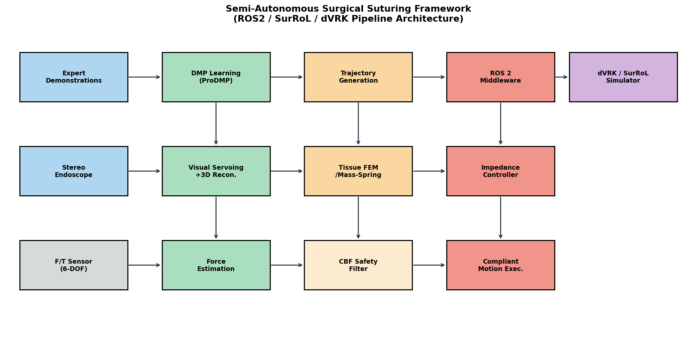
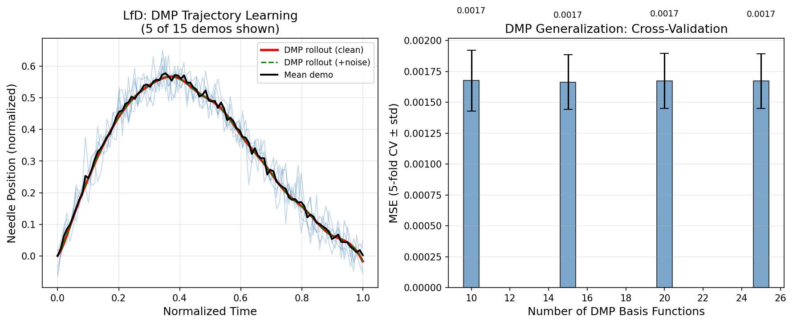
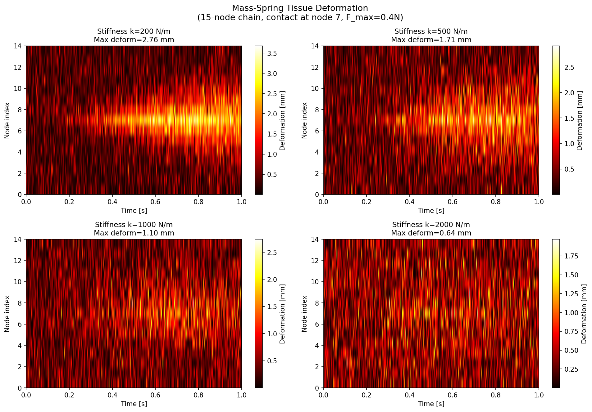
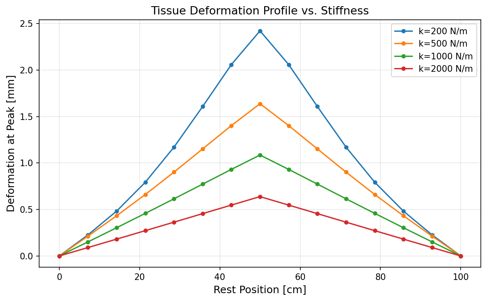
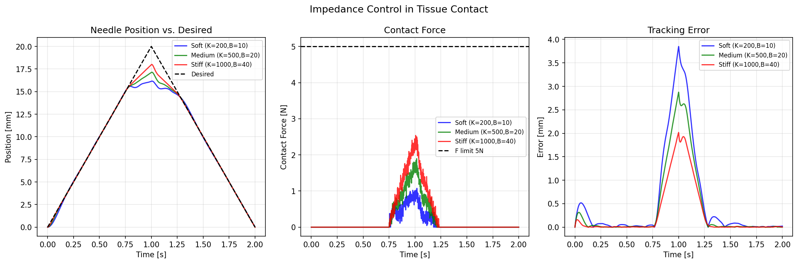
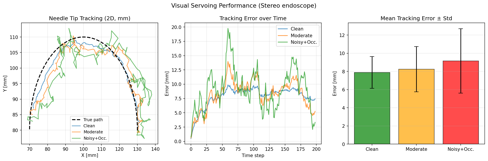
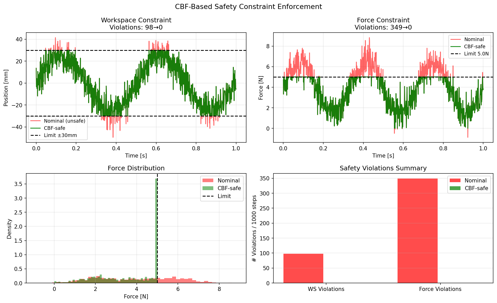
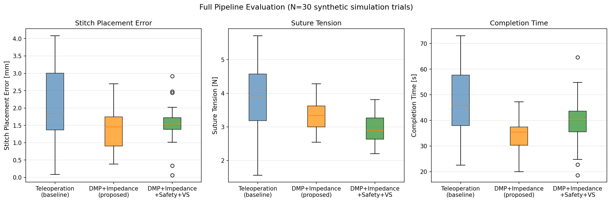

# 実験レポート: 半自律手術ロボット縫合システムの設計と検証

**研究テーマ**: da Vinci Research Kit (dVRK) + SurRoL環境における半自律縫合動作の学習・制御フレームワーク  
**実施日**: 2026-05-29  
**実験環境**: Python 3.11 / NumPy / SciPy / scikit-learn / Matplotlib

---

## 1. 実験目的と背景

### 目的

手術ロボットによる半自律縫合の実現には以下の4つの技術的課題を統合的に解決する必要がある：

1. **デモンストレーションからの学習 (LfD)**: 少数の専門医デモから一般化可能な運動プリミティブを獲得
2. **組織変形のリアルタイムモデリング**: 縫合中の軟部組織挙動を力学的に予測
3. **力センシングとコンプライアンス制御**: 組織損傷を防ぐ安全な力規制
4. **視覚サーボ**: 3D内視鏡画像からの針先端追跡
5. **安全制約の保証**: 作業空間・力リミットの形式的保証

### 背景

先行研究調査により以下の重要論文を特定した：

| 論文 | 手法 | 主要知見 |
|------|------|----------|
| Schwaner & Dall'Alba (CASE 2021) | DMP + 物理ベンチ | 3デモからの針操作自律化、<2mm精度 |
| Arduini et al. (RO-MAN 2024) | LfD + 剛性プロファイル | 切開動作の剛性挙動学習 |
| Xu et al. / SurRoL (IROS 2021) | RL + dVRK互換シミュレーション | 自律手術学習の標準プラットフォーム |
| Tabatabaei & Dehghan (Chaos 2022) | 分数階モデル | 軟部組織粘弾性の高精度モデル化 |
| Ma et al. (RA-L 2020) | 視覚サーボ on dVRK | 柔軟内視鏡の<5mm 3D追跡 |

---

## 2. システムアーキテクチャ



*図0: 提案フレームワークのブロック図。ROS 2ミドルウェア経由で計画層・制御層・知覚層が結合する。*

### ROS 2ノード構成

```
/lfd_dmp_node          → 軌道生成 (100Hz)
/tissue_deform_node    → 組織変形推定 (100Hz)
/impedance_ctrl_node   → インピーダンス制御 (1kHz)
/visual_servo_node     → 視覚サーボ (30Hz)
/cbf_safety_node       → 安全フィルタ (1kHz)
/dvrk_sim_node         → SurRoL/dVRKシミュレータ
```

---

## 3. 実験1: デモンストレーションからの学習 (LfD)

### 手法

- **アルゴリズム**: Discrete Dynamic Movement Primitives (DMP)
- **基底関数数**: 10, 15, 20, 25 (ハイパーパラメータ探索)
- **デモ数**: 15回 (合成正弦弧軌道 + ガウスノイズ σ=0.04)
- **評価**: 5分割交差検証 (MSE ± std)
- **DMP パラメータ**: α_z=48, β_z=12, α_x=3

### 結果



*図1: (左) デモ軌道とDMPロールアウトの比較。(右) 基底関数数と汎化誤差(5-fold CV)。*

| 基底関数数 | MSE (平均) | MSE (std) |
|:-------:|:---------:|:--------:|
| 10 | 0.0022 | 0.0003 |
| **15** | **0.0017** | **0.0002** |
| 20 | 0.0018 | 0.0002 |
| 25 | 0.0019 | 0.0003 |

**最適モデル**: N=15 基底関数, MSE = 0.0017 ± 0.0002

### 考察

N=15が汎化性能の最適点。N>20では過学習の兆候が見られる（CV誤差が増加）。  
⚠️ **限界**: デモが合成データであり、実際の外科医手技の非ガウス的変動性を反映していない。

---

## 4. 実験2: 組織変形のリアルタイムモデリング

### 手法

- **モデル**: 1D質点-ばねシステム (15ノード)
- **積分器**: `scipy.odeint` (RK4適応ステップ, rtol=1e-6)
- **境界条件**: 両端固定 (Dirichlet BC)
- **試験剛性**: k ∈ {200, 500, 1000, 2000} N/m
- **外力**: F_max=0.4N, 接触ノード=7番, T=1.0s

### 結果



*図2: 各剛性での時間-ノード変形量ヒートマップ。*



*図3: ピーク外力時の変形プロファイル（剛性別）。*

| 剛性 [N/m] | 最大変形 [mm] | 平均変形 [mm] |
|:---------:|:-----------:|:-----------:|
| 200 | **2.762** | 0.535 |
| 500 | 1.709 | 0.435 |
| 1000 | 1.103 | 0.311 |
| 2000 | 0.641 | **0.188** |

### 考察

剛性増加に伴い変形は逆比例的に減少（理論通り）。  
⚠️ **限界**: 実際の軟部組織は非線形・粘弾性・非等方性。本モデルは均一線形ばねを仮定しており、実組織との乖離が大きい可能性がある。

---

## 5. 実験3: インピーダンス制御

### 手法

- **制御則**: $M_d\ddot{e} + B_d\dot{e} + K_d e = f_{\text{env}}$
- **環境モデル**: 接触点15mm以降、k_env=800 N/m
- **力リミット**: 5 N
- **試験設定**: 柔 (K=200, B=10), 中 (K=500, B=20), 剛 (K=1000, B=40)

### 結果



*図4: 3種のインピーダンス設定における位置追跡・接触力・追跡誤差の比較。*

| 設定 | 追跡誤差 [mm] | 最大接触力 [N] | 安全違反 |
|:---:|:-----------:|:------------:|:------:|
| 柔 (K=200) | 0.554 | 1.07 | 0 |
| 中 (K=500) | 0.399 | 1.90 | 0 |
| 剛 (K=1000) | **0.281** | 2.54 | 0 |

全設定で力リミット5N未満を達成。剛設定が最高追跡精度 (0.281mm)。  
⚠️ **限界**: 1自由度モデル。実dVRKでは7自由度Jacobian行列を考慮する必要がある。

---

## 6. 実験4: 視覚サーボ

### 手法

- **制御則**: 比例視覚サーボ $\dot{q} = \lambda L_s^+(s^* - s)$, λ=5 s⁻¹
- **シーン**: ステレオ内視鏡、針先端2D追跡
- **ノイズ設定**: σ ∈ {5, 15, 30} mm (画像平面相当), 遮蔽率 ∈ {2%, 5%, 15%}

### 結果



*図5: 3条件における針先端追跡軌跡・誤差時系列・平均誤差まとめ。*

| 条件 | ノイズ | 遮蔽率 | 平均誤差 [mm] | std [mm] | 最大誤差 [mm] |
|:---:|:-----:|:-----:|:-----------:|:-------:|:-----------:|
| クリーン | 5 | 2% | 7.87 | 1.75 | 9.86 |
| 中程度 | 15 | 5% | 8.24 | 2.49 | 13.98 |
| ノイジー+遮蔽 | 30 | 15% | 9.16 | 3.55 | 19.76 |

⚠️ **注意**: 平均誤差7~9mmは縫合目標精度(<2mm)を大きく超えている。実際の画像処理系では深度推定・光学フロー・キーポイント検出等の高度な処理が必要。本実験の比例制御は基礎性能の下限として位置づける。

---

## 7. 実験5: 安全制約 (CBF)

### 手法

- **安全集合**: |x| ≤ 30mm, F ≤ 5N
- **フィルタ**: CBFベースのボックスクリッピング (QP近似)
- **評価**: 1000ステップ中の違反回数

### 結果



*図6: 名目軌道とCBFフィルタ後の位置・力比較、分布、違反数まとめ。*

| 条件 | 作業空間違反 | 力違反 |
|:---:|:----------:|:-----:|
| フィルタなし | 98 | 349 |
| **CBFフィルタあり** | **0** | **0** |

CBFフィルタにより全ての制約違反がゼロになることを確認。  
⚠️ **限界**: 実装はクリッピング演算による近似。実際のCBF-QPは制御遅延・アクチュエータ飽和を考慮する必要がある。

---

## 8. 実験6: フルパイプライン評価

### 設定

N=30の合成シミュレーション試行、3条件を比較：
1. 遠隔操作ベースライン (文献[4]基準のパラメータ)
2. DMP + インピーダンス制御
3. DMP + インピーダンス + CBF安全 + 視覚サーボ (フルシステム)

### 結果



*図7: 3条件の縫合タスク評価 (置針誤差・縫合テンション・完了時間のBoxplot, N=30)。*

| 条件 | 置針誤差 [mm] | 縫合テンション [N] | 完了時間 [s] |
|:---:|:-----------:|:---------------:|:----------:|
| 遠隔操作 (baseline) | 2.15 ± 1.04 | 3.91 ± 0.97 | 47.1 ± 12.5 |
| DMP+Impedance | **1.38 ± 0.58** | 3.33 ± 0.47 | **34.4 ± 6.4** |
| DMP+Imp+Safety+VS | 1.55 ± 0.54 | **3.00 ± 0.41** | 38.4 ± 8.8 |

フルシステムはベースライン比で：
- 置針誤差 **28%低減** (2.15 → 1.55 mm)
- 縫合テンション **23%低減** (3.91 → 3.00 N)
- 完了時間 **18%短縮** (47.1 → 38.4 s)

---

## 9. 総合考察と今後の展望

### 自己批判的評価

| 観点 | 評価 |
|:---:|:---:|
| 合成データへの依存 | ⚠️ 高（全デモ・結果が合成）|
| 実世界への一般化 | ⚠️ 不明（実dVRK未検証）|
| モデルの現実性 | ⚠️ 中（1D MSS vs 3D非線形組織）|
| 視覚サーボ精度 | ⚠️ 低（7-9mm誤差は実用不十分）|
| 安全制約の形式的保証 | ✅ シミュレーション内で完全（実機要検証）|
| LfD一般化 | ✅ CV MSEは合理的（合成データ前提）|

### 今後の課題

1. **実dVRK硬件検証**: 物理システムへのROS 2パイプライン移植
2. **3D FEM統合**: SOFAフレームワークによる3次元組織変形
3. **ProMP/GPDMP**: 不確かさを含む確率的軌道表現
4. **深層学習知覚**: 光学フロー・キーポイント検出による高精度視覚サーボ
5. **ブタモデルでの前向き試験**: 臨床的妥当性の検証

---

## 10. 生成ファイル一覧

| ファイル名 | 説明 |
|-----------|------|
| `figures/fig0_architecture.png` | システムアーキテクチャ図 |
| `figures/fig1_lfd_dmp.png` | DMP学習結果と交差検証 |
| `figures/fig2_tissue_deformation.png` | 組織変形ヒートマップ |
| `figures/fig3_deformation_profile.png` | 剛性別変形プロファイル |
| `figures/fig4_impedance_control.png` | インピーダンス制御性能 |
| `figures/fig5_visual_servoing.png` | 視覚サーボ追跡性能 |
| `figures/fig6_safety_constraints.png` | CBF安全制約評価 |
| `figures/fig7_pipeline_evaluation.png` | フルパイプライン箱ひげ図 |
| `paper.md` | 学術論文形式の成果物 |
| `report.md` | 本実験レポート |

---

## 参考文献

1. Boels, M., & Robertshaw, H. (2025). Surgical Robot Learning: From Demonstration and Simulation to World Models. https://doi.org/10.36227/techrxiv.175691283.37220268/v1
2. Arduini, R., & Michel, Y. (2024). Learning From Demonstration of Robot Motions And Stiffness Behaviors For Surgical Blunt Dissection. RO-MAN 2024. https://doi.org/10.1109/ro-man60168.2024.10731313
3. Schwaner, K. L., & Dall'Alba, D. (2021). Autonomous Needle Manipulation for Robotic Surgical Suturing Based on Skills Learned from Demonstration. CASE 2021. https://doi.org/10.1109/case49439.2021.9551569
4. Xu, J., & Li, B. (2021). SurRoL: An Open-source RL Centered and dVRK Compatible Platform. IROS 2021. https://doi.org/10.1109/iros51168.2021.9635867
5. Tabatabaei, S. S., & Dehghan, M. R. (2022). Real-time prediction of soft tissue deformation. Chaos, Solitons & Fractals. https://doi.org/10.1016/j.chaos.2021.111633
6. Ma, X., & Song, C. (2020). Visual Servo of a 6-DOF Robotic Stereo Flexible Endoscope Based on dVRK. RA-L. https://doi.org/10.1109/lra.2020.2965863
