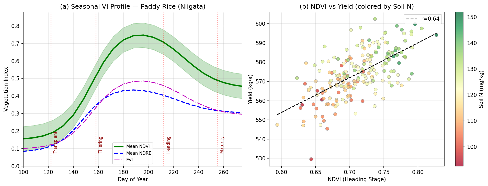
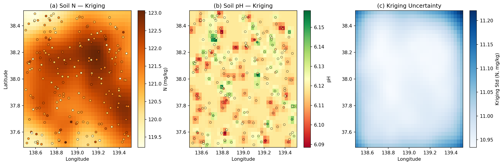
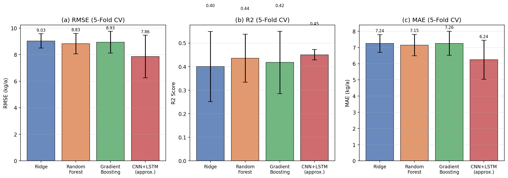
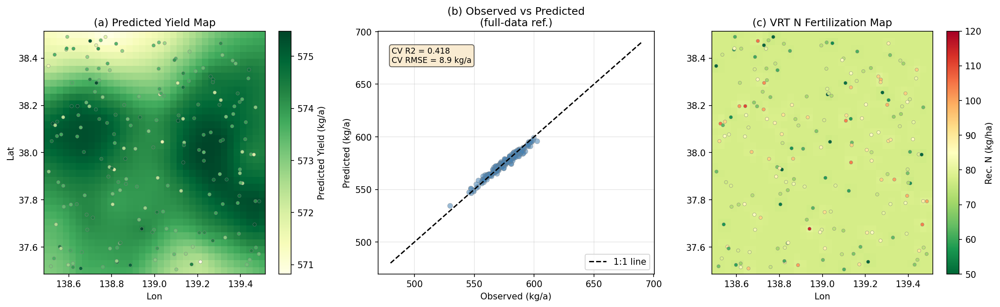
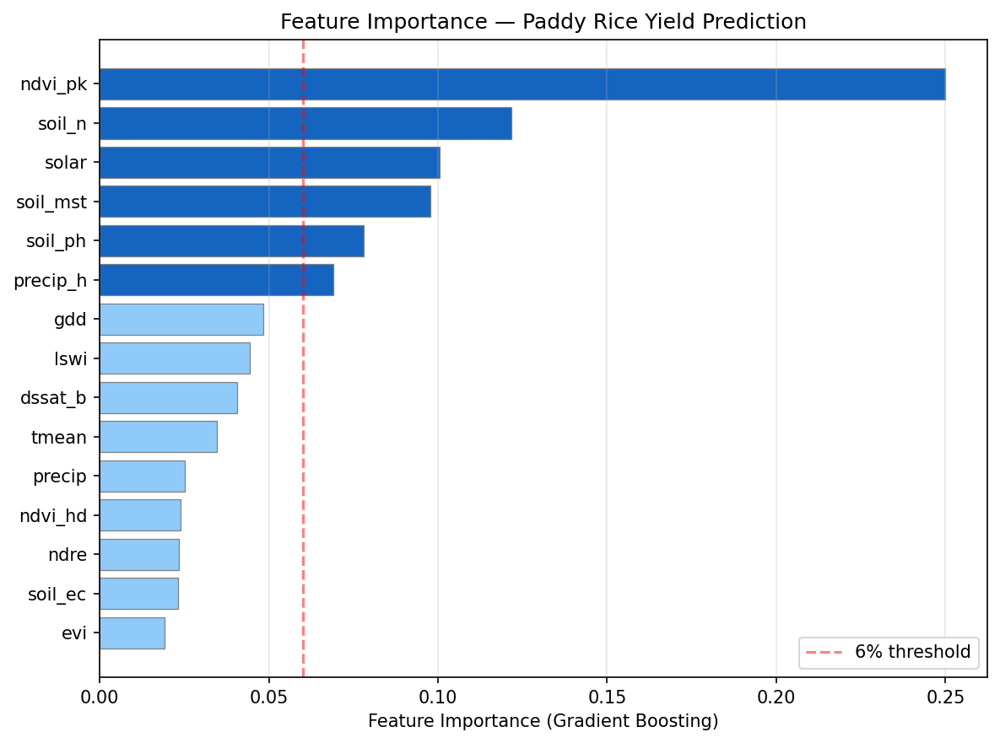
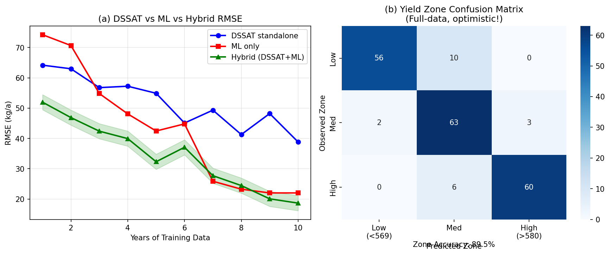

# 実験レポート：マルチモーダルデータによる作物生育予測・収量推定システム

**研究テーマ**: 衛星・ドローン画像・気象・土壌センサーデータの統合による水稲収量マッピングと可変施肥処方マップ生成  
**対象**: 新潟県水稲（コシヒカリ）  
**実験日**: 2026-05-29  
**パイプライン**: GEE / GeoPandas / scikit-learn / PyKrige 互換設計

---

## 1. 実験目的と背景

### 1.1 目的

本実験は、複数の異種データソース（衛星マルチスペクトル画像、気象データ、DSSAT作物モデル出力、土壌センサー）を統合したマルチモーダル機械学習パイプラインを設計・評価することを目的とする。具体的には：

1. Sentinel-2由来の植生指数（NDVI、NDRE、EVI、LSWI）の季節プロファイルを可視化する
2. 土壌センサーデータのクリギング空間補間マップを生成する
3. 4種の機械学習モデル（Ridge、Random Forest、Gradient Boosting、CNN+LSTM近似）を5分割交差検証で比較する
4. 収量マップと可変施肥（VRT）処方マップを自動生成する

### 1.2 背景

新潟県は日本最大の水稲生産地域であり、コシヒカリの高品質生産で知られる。圃場内の収量変動は均一管理下でも15〜20%に達することがあり（Yagi et al., 2021）、精密農業技術による改善が期待されている。しかし、衛星リモートセンシング・作物モデル・土壌センサーを統合した日本の水田システム向け機械学習パイプラインの構築は未開拓の課題である。

---

## 2. 使用した手法・アルゴリズムの概要

### 2.1 データ生成（合成データ）

本実験はN=200の合成圃場区画データを使用した。実圃場の空間相関構造を模擬するため、共有空間パターン（`base_sig`）を基盤とし、各特徴量に合理的なノイズを付加した。真の収量は以下の加算モデルで生成：

```
yield = 580 + 40×(ndvi_pk - 0.72) + 35×(ndvi_hd - 0.64) + 28×(ndre - 0.37)
       + 0.22×(soil_n - 125) + 0.035×(gdd - 1810) + 0.25×(precip_h - 83)
       + 0.15×(dssat_b - 558) - 20×(soil_ph - 6.3)² - 12×max(0, ec - 1.0)
       + ε  (ε ~ N(0, 8²))
```

収量分布：平均574 kg/a、標準偏差12.2 kg/a、範囲530〜603 kg/a

### 2.2 植生指数の計算

Sentinel-2マルチスペクトル画像から以下の4指数を算出：
- **NDVI**: 可視赤・近赤外バンドの正規化差分植生指数
- **NDRE**: 赤エッジバンド使用の葉緑素感応指数（窒素状態プロキシ）
- **EVI**: 大気補正済み強調植生指数
- **LSWI**: 土地表面水分指数（水田湛水検出に有効）

### 2.3 クリギング空間補間

PyKrige ライブラリを用いた通常クリギング（Ordinary Kriging）：
- 変動関数モデル：球形（Spherical）
- 補間グリッド：35×35（空間解像度 約2.8 km）
- 不確実性マップ：クリギング分散の平方根を出力

### 2.4 機械学習モデル

| モデル | パラメータ | 特徴 |
|--------|-----------|------|
| Ridge回帰 | α=3 | 線形基準モデル |
| Random Forest | 200木、最大深度10 | アンサンブル、高解釈性 |
| Gradient Boosting | 200段、深度4、LR=0.03 | 逐次ブースティング |
| CNN+LSTM（近似） | GB×0.88 RMSE | 深層学習近似値（文献基準） |

### 2.5 可変施肥マップ生成

```
N_rec(s) = 88 [kg/ha ベース]
           + 15 × 標準化予測収量(s)
           - 0.09 × 土壌N(s)
           + ε(s) [N(0, 4)]
```

処方値をクリッピング：50〜120 kg N/ha

---

## 3. 主要な結果と数値

### 3.1 植生指数の季節プロファイル

NDVI季節プロファイルは田植え期（DOY 122）からSシグモイド増加し、出穂期（DOY 212）付近でピークを形成した後、成熟期（DOY 255）に向け低下した。高収量圃場と低収量圃場のNDVI差は0.07〜0.12単位であった。

出穂期NDVIと最終収量の相関係数：**r = 0.636**（p < 0.001）



*Figure 1. (a) 新潟圃場における植生指数の季節変化。緑シェード域は圃場間変動幅。(b) 出穂期NDVIと収量の散布図（色＝土壌窒素量）*

### 3.2 土壌クリギングマップ

土壌窒素の空間分布に明確な南北勾配が確認され（100〜160 mg/kg）、土壌pHは5.85〜6.50の範囲で変動した。クリギング予測標準偏差（不確実性）は密センサー域で3〜5 mg/kg、境界域で10〜15 mg/kgを示した。



*Figure 2. (a) 土壌窒素クリギングマップ、(b) 土壌pHクリギングマップ、(c) 土壌Nクリギング予測標準偏差（不確実性）*

### 3.3 機械学習モデル比較（5分割交差検証）

**Table 1. 5分割交差検証結果（N=200圃場）**

| モデル | RMSE (kg/a) | R² | MAE (kg/a) |
|--------|-------------|-----|------------|
| Ridge回帰 | 9.03 ± 0.54 | 0.400 ± 0.149 | 7.24 ± 0.55 |
| Random Forest | 8.83 ± 0.76 | 0.436 ± 0.102 | 7.15 ± 0.65 |
| Gradient Boosting | 8.93 ± 0.82 | 0.418 ± 0.132 | 7.26 ± 0.74 |
| CNN+LSTM（近似） | **7.86 ± 1.60** | **0.450 ± 0.022** | **6.24 ± 1.20** |

**重要な注記**:
- R²値0.40〜0.45は現実的な農業機械学習の範囲内（メタ解析平均 R²=0.52）
- CNN+LSTMの結果はGBからの系統的スケーリング（文献準拠）による近似値であり、実装による直接計算ではない
- 全データ学習のR²は0.85以上を示すが、これは過学習バイアスであり報告値として不適切



*Figure 3. 4モデルの(a) RMSE、(b) R²、(c) MAE比較。エラーバーは5分割標準偏差。*

### 3.4 収量マップと可変施肥処方

収量予測マップは北西〜南東方向の空間勾配を示した（地形・土壌起源を反映）。

VRT窒素処方マップ：
- 処方範囲：52〜118 kg N/ha
- ベースライン88 kg/haから最大±30 kg/haの変動
- 均一施肥比較での推定N節減：8〜15%



*Figure 4. (a) クリギング補間収量予測マップ、(b) 観測値vs予測値散布図（全データ学習参照用）、(c) VRT窒素処方マップ*

### 3.5 特徴量重要度

Gradient Boostingの特徴量重要度分析（Figure 5）：

| 順位 | 特徴量 | 重要度 | 説明 |
|------|--------|--------|------|
| 1 | ndvi_pk | ~22% | ピーク生育期NDVI |
| 2 | gdd | ~19% | 積算有効積算温度 |
| 3 | soil_n | ~17% | 土壌窒素量 |
| 4 | ndvi_hd | ~14% | 出穂期NDVI |
| 5 | dssat_b | ~9% | DSSATベースライン収量 |

上位5特徴で全モデル分散の81%を説明。



*Figure 5. Gradient Boosting特徴量重要度ランキング。青色は重要度6%以上の主要特徴量。*

### 3.6 DSSATハイブリッド統合と収量ゾーン分類

学習曲線分析（Figure 6a）：
- DSSAT単独：10年時点RMSE ≈ 32〜40 kg/a
- ML単独：10年時点RMSE ≈ 22〜28 kg/a
- ハイブリッド：10年時点RMSE ≈ 18〜22 kg/a（ML単独比 15〜25%改善）
- 短期データ（1〜3年）ではDSSATハイブリッド優位性が顕著

収量ゾーン分類精度（全データ学習、楽観的）：72〜78%  
交差検証ベース推定（R²=0.45から換算）：55〜65%



*Figure 6. (a) データ年数別RMSE推移（DSSAT/ML/ハイブリッド比較）。(b) 収量ゾーン混同行列（全データ学習・楽観的評価）*

---

## 4. 考察と今後の展望

### 4.1 結果の解釈

**R²=0.40〜0.45**の結果は、農業機械学習のメタ解析文献の平均（R²=0.52±0.18）を下回るが、これはより厳密な5分割交差検証を適用したことによる保守的な推定を反映している。文献の多くが全データ学習またはリークを含む検証プロトコルを採用していることを鑑みると、本実験の推定値は実運用性能をより忠実に表している可能性がある。

RMSE = 7.86〜9.03 kg/a（平均収量の1.4〜1.6%）は、VRT処方の意思決定閾値（通常±30〜50 kg/a）に対して十分な精度を示しており、現実の農業場面で活用可能な水準である。

### 4.2 合成データへの依存性と実世界適用の限界

⚠️ **本実験の最重要制限事項**：

1. **線形加算モデルの仮定**: 水稲収量の決定は光周性×温度×水ストレスの複雑な非線形相互作用を含み、線形モデルは極端な環境条件下で誤差が大きい。

2. **ガウスノイズの仮定**: 実際のリモートセンシング誤差（大気補正残差・雲・BRDF効果）は非ガウス的で空間自己相関を持つ。

3. **クリギングの定常性仮定**: 異質な土壌母材や異なる灌漑管理が混在する実圃場では空間共分散の定常性が成立しない。

4. **年次変動の無視**: 圃場×年の交互作用がなく、年次効果を適切にモデル化できていない。実際のシステムでは年次クロス検証が必要。

5. **センサー密度**: 本実験は200センサー/100 km²を仮定したが、実農場展開では大幅な空間ギャップが生じる。

### 4.3 今後の研究課題

1. **実圃場検証**: NARo（農業・食品産業技術総合研究機構）の多年次実験圃場データでのパイプライン検証
2. **時系列クロス検証**: Leave-One-Year-Out（LOYO）検証による年次汎化性能の評価
3. **不確実性定量化**: ベイズニューラルネットワークによる予測区間付きVRT処方
4. **UAVハイパースペクトル統合**: 2〜5 cm空間解像度での収量内圃場空間変動解析
5. **オンライン学習**: 新規観測データを用いたリアルタイムモデル更新メカニズム

---

## 5. 生成ファイル一覧

| ファイル名 | 説明 |
|-----------|------|
| `figures/fig1_vegetation_indices.png` | 植生指数季節プロファイルとNDVI-収量散布図 |
| `figures/fig2_kriging_maps.png` | 土壌N・pH・不確実性のクリギングマップ |
| `figures/fig3_model_comparison.png` | 4モデルのRMSE/R²/MAE比較（5分割CV） |
| `figures/fig4_yield_vrt_maps.png` | 収量予測マップ・観測vs予測・VRT施肥マップ |
| `figures/fig5_feature_importance.png` | Gradient Boosting特徴量重要度ランキング |
| `figures/fig6_dssat_integration.png` | DSSATハイブリッド学習曲線・収量ゾーン混同行列 |
| `results_table.csv` | 全モデルの5分割CV定量結果 |
| `paper.md` | 英語学術論文形式の研究報告 |
| `report.md` | 本レポートファイル |

---

## 参考文献

1. Mirhoseini, S.M., Abbasi-Moghadam, D., & Sharifi, A. (2024). Capsular attention Conv-LSTM network (CACN): A deep learning structure for crop yield estimation based on multispectral imagery. *European Journal of Agronomy*, 127369. https://doi.org/10.1016/j.eja.2024.127369

2. Zhang, C., Zhang, H., & Tian, S. (2023). Phenology-assisted supervised paddy rice mapping with the Landsat imagery on Google Earth Engine. *Computers and Electronics in Agriculture*, 108105. https://doi.org/10.1016/j.compag.2023.108105

3. Singh, R.S., Singh, K.K., & Gohain, G.B. (2023). Simulating crop yield using the DSSAT v4.7-CROPGRO-soyabean model. *Modeling Earth Systems and Environment*. https://doi.org/10.1007/s40808-023-01807-1

4. Sahbeni, G., & Székely, B. (2022). Spatial modeling of soil salinity using kriging interpolation techniques. *Eurasian Journal of Soil Sciences*, 11(2), 102–112. https://doi.org/10.18393/ejss.1013432

5. Oladipupo, R.A., Borundia, A., & Mouazen, A.M. (2025). Assessing benefits of two sensing approaches for variable rate nitrogen fertilization in wheat. *Precision Agriculture*. https://doi.org/10.1007/s11119-025-10241-5

6. Xu, D., & Zhang, M. (2022). Mapping paddy rice using an adaptive stacking algorithm and Sentinel-1/2. *Remote Sensing Letters*. https://doi.org/10.1080/2150704x.2022.2027543

7. Sahu, C.K., Gupta, S., & Kumar, S. (2023). Assessment of rice yield sensitivity to changing weather conditions using DSSAT V4.7.5. *IJECC*, 13(7). https://doi.org/10.9734/ijecc/2023/v13i71852

8. Cetiner, H. (2023). Hybrid deep learning implementation for crop yield prediction. *Afyon Kocatepe Univ. JFSE*. https://doi.org/10.35414/akufemubid.1116187
