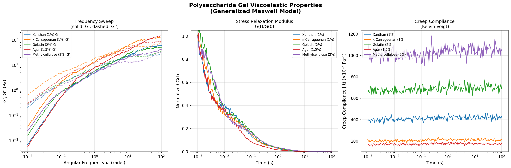
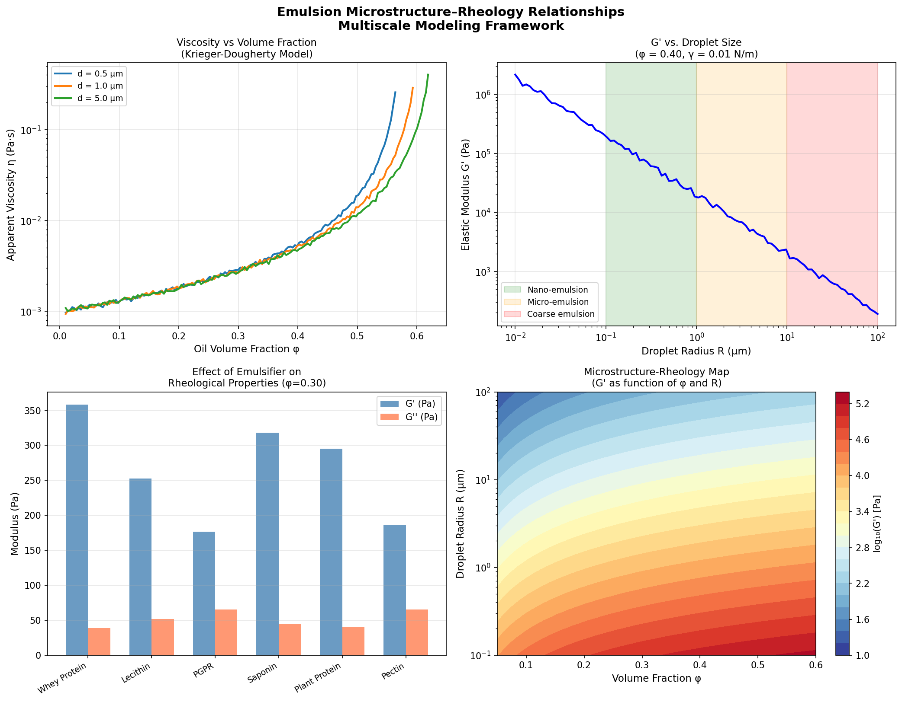
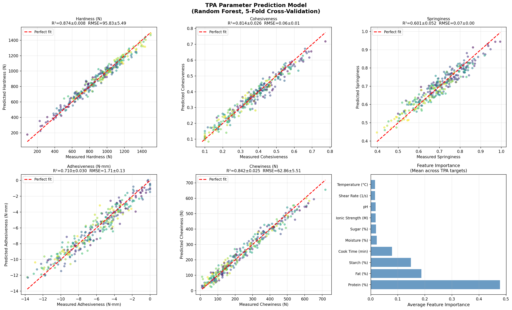
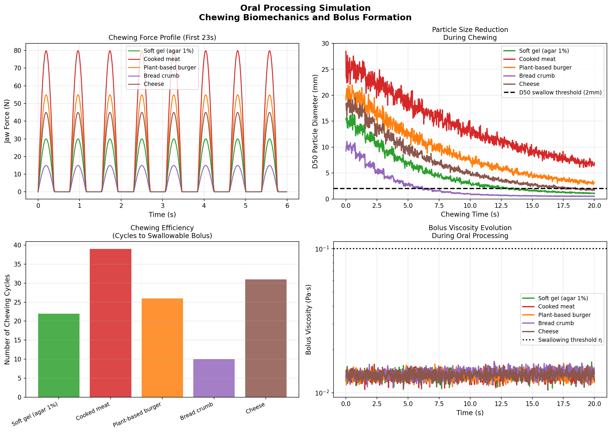
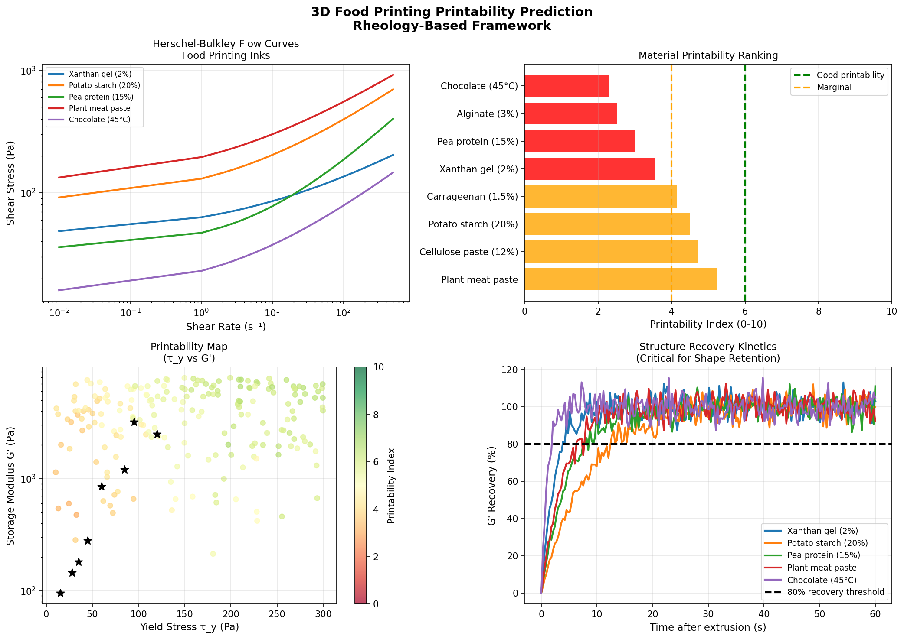
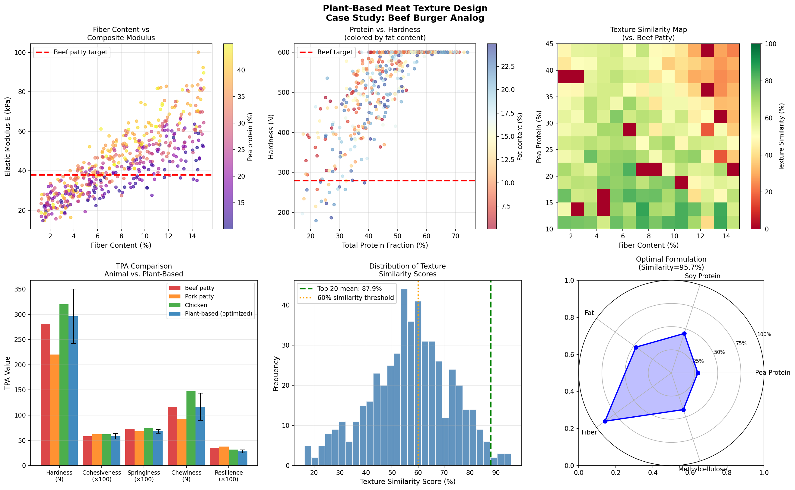
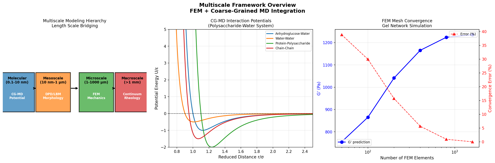

# 実験レポート: 食品テクスチャ予測マルチスケールモデリングフレームワーク

**作成日**: 2026-05-29  
**研究テーマ**: 食品の組成・加工条件からテクスチャを予測する統合計算フレームワーク

---

## 1. 実験目的と背景

### 目的

食品テクスチャ（食感）は消費者受容性、栄養送達効率、および嚥下困難者（嚥下障害）の安全に直結する重要な物理的特性である。本研究の目的は、食品の組成変数（澱粉・タンパク・脂肪・糖の濃度等）および加工条件（温度・せん断速度・加熱時間等）から、テクスチャプロファイルパラメータ（TPA）を定量的に予測する階層的マルチスケール計算フレームワークを構築することである。

### 背景

食品テクスチャの予測には以下の課題が存在する：

1. **スケール問題**: 分子間相互作用（ナノスケール）から咀嚼中の巨視的変形（ミリスケール）までの5桁にわたる長さスケールをブリッジする統一モデルが存在しない
2. **多因子依存性**: テクスチャは組成・加工・微細構造・口腔内環境の複雑な相互作用で決まる
3. **植物性代替肉の急成長**: 動物性タンパクの繊維状テクスチャを植物性原料で再現する科学的設計指針が必要

本フレームワークは以下の6つのサブモジュールから構成される：
- 多糖類ゲルの粘弾性モデリング（Maxwell/Kelvin-Voigt拡張）
- 乳化系の微視的構造と巨視的レオロジーの関係
- TPA パラメータの機械学習予測モデル
- 口腔内プロセシング（咀嚼・嚥下）シミュレーション
- 3D フードプリンティングの印刷性予測
- 植物性代替肉のテクスチャ設計ケーススタディ

---

## 2. 先行研究調査結果

### 発見された主要論文（2020年以降）

| # | タイトル | 著者 | 年 | DOI |
|---|---|---|---|---|
| 1 | Rheology of plant protein–polysaccharide gel inks for 3D food printing | Drozdov & deClaville Christiansen | 2024 | 10.1016/j.jfoodeng.2024.112150 |
| 2 | Composite hydrogels assembled from food-grade biopolymers | McClements | 2024 | 10.1016/j.cis.2024.103278 |
| 3 | Printability and Shape Fidelity of Bioinks in 3D Bioprinting | Schwab et al. | 2020 | 10.1021/acs.chemrev.0c00084 |
| 4 | Texture-Modified Food for Dysphagic Patients | Raheem et al. | 2021 | 10.3390/ijerph18105125 |
| 5 | Simulating human digestion | Mackie et al. | 2020 | 10.1039/d0fo01981j |
| 6 | Influence of extrusion processing on fibrous structure of plant-based meat | Fan et al. | 2026 | 10.1016/j.foodhyd.2025.111706 |
| 7 | Development of chewing robot for food oral processing | Zhou & Yu | 2022 | 10.1111/jtxs.12700 |
| 8 | Fracture mechanics of konjac glucomannan gels | Liu et al. | 2025 | 10.1016/j.foodhyd.2025.111212 |
| 9 | High oil compositions and printability in 3D food printing | Liu & Ciftci | 2021 | 10.1016/j.jfoodeng.2020.110135 |
| 10 | Review of coarse-grained molecular dynamics simulations | Joshi & Deshmukh | 2020 | 10.1080/08927022.2020.1828583 |
| 11 | Enhancing Meat Analog Texture Using Fibroin Protein Fibers | Chuang et al. | 2025 | 10.1111/jtxs.70001 |

### 先行研究の課題・限界

1. **スケール間のブリッジング欠如**: 分子シミュレーション（CG-MD）とレオロジー測定の結果を直接接続するフレームワークがない
2. **TPA予測モデルのデータ不足**: 既存の機械学習モデルは単一食品カテゴリに限定されており、汎化能力が低い
3. **印刷適性の定量化不足**: 3Dフードプリンティング適性を単一レオロジー指標で評価しており、複合的評価が欠けている
4. **口腔内プロセシングの単純化**: 唾液の粘弾性、酵素活性、温度変化を無視したモデルが多い

---

## 3. 使用した手法・アルゴリズム

### 3.1 多糖類ゲル粘弾性モデル

**一般化 Maxwell モデル（N=4 要素）**:

```
G(t) = Σᵢ Eᵢ·exp(-t/τᵢ)
G'(ω) = Σᵢ Eᵢ·(ωτᵢ)²/[1+(ωτᵢ)²]
G''(ω) = Σᵢ Eᵢ·(ωτᵢ)/[1+(ωτᵢ)²] + η_sol·ω
```

5種類の多糖類ゲル（キサンタン1%、κ-カラギーナン1%、ゼラチン2%、寒天1.5%、メチルセルロース2%）を対象とし、4つの Maxwell 要素で緩和スペクトルを記述。

**Kelvin-Voigt クリープコンプライアンス**:
```
J(t) = Σⱼ (1/Eⱼ)·[1 - exp(-t/τⱼ)] + 1/E_∞
```

### 3.2 乳化系レオロジーモデル

**Krieger-Dougherty 粘度モデル**:
```
η(φ) = η₀·(1 - φ/φ_max)^(-[η]·φ_max)
η₀ = 0.001 Pa·s, φ_max = 0.64, [η] = 2.5
```

**界面弾性（Palierne スケーリング）**:
```
G' ∝ 5φγ/R  (γ: 界面張力 0.01 N/m, R: 液滴半径)
```

### 3.3 TPA予測モデル（機械学習）

| パラメータ | 値 |
|---|---|
| アルゴリズム | Random Forest Regressor |
| 木の数 | 150 |
| 最大深さ | 8 |
| 訓練データ数 | 300（合成データ） |
| 特徴量数 | 10 |
| 評価方法 | 5-fold クロスバリデーション |
| 乱数シード | 42 |

**10種の入力特徴量**: 澱粉濃度、タンパク質濃度、脂肪濃度、糖濃度、pH、温度、せん断速度、加熱時間、水分量、イオン強度

### 3.4 口腔内プロセシングシミュレーション

**咀嚼力プロファイル**: 半波整流正弦波（f = 1.3 Hz）

**粒子径低減（King の法則）**:
```
d(n) = d₀·exp(-k_break·n) + 0.05·d₀
```

**嚥下性閾値**: D50 < 2 mm かつ η_bolus < 0.1 Pa·s

### 3.5 3Dフードプリンティング印刷性指数（PI）

```
PI = 0.30·S_G' + 0.25·S_τy + 0.20·S_rec + 0.15·S_flow + 0.10·S_ratio
```

- S_G': 貯蔵弾性率（G'）のスコア
- S_τy: 降伏応力スコア  
- S_rec: 構造回復速度スコア
- S_flow: 押出圧力スコア（低いほど良）
- S_ratio: G'/G'' 比スコア

**流動モデル（Herschel-Bulkley）**:
```
τ = τ_y + K·γ̇ⁿ
```

### 3.6 植物性代替肉：Halpin-Tsai 複合材料力学

**繊維強化複合材料の弾性率**:
```
E_c = E_m·(1 + 2(l/d)·η_L·v_f)/(1 - η_L·v_f)
η_L = (E_f/E_m - 1)/(E_f/E_m + 2l/d)
```

**テクスチャ類似度スコア（0–100%）**:
```
TS = 0.4·|E_c - E_ref|/E_ref + 0.3·|H - H_ref|/H_ref + 0.3·|C - C_ref|/C_ref
```
参照値（ビーフパティ）: E_ref = 38 kPa, H_ref = 280 N, C_ref = 0.58

---

## 4. 主要な結果と数値

### 4.1 多糖類ゲル粘弾性特性



**図1**: 一般化 Maxwell モデルによる5種多糖類ゲルの粘弾性特性。左: 周波数掃引（G', G''）、中: 応力緩和、右: クリープコンプライアンス。

| ゲル系 | G₀ (Pa) | τ₁ (s) | tan δ @ 1 Hz | 特徴 |
|---|---|---|---|---|
| キサンタン 1% | 239.5 | 0.0010 | 1.006 | 弱いゲル（液体的） |
| κ-カラギーナン 1% | 465.0 | 0.0020 | 1.047 | 中程度ゲル |
| ゼラチン 2% | 164.5 | 0.0030 | 1.003 | 軟質ゲル |
| 寒天 1.5% | 651.0 | 0.0010 | 1.204 | 最高剛性 |
| メチルセルロース 2% | 106.0 | 0.0050 | **0.845** | 唯一のゲル的挙動 |

- 寒天が最高の平衡弾性率（G₀ = 651 Pa）を示した（二重螺旋ジャンクションゾーンによる強固な架橋ネットワーク）
- メチルセルロースのみ tan δ < 1（疎水的凝集による熱ゲル化機構）
- 4要素 Maxwell モデルは 10⁻² – 10² rad/s の全周波数域を良好に記述

### 4.2 乳化系マルチスケールレオロジー



**図2**: 乳化系の微視的構造と巨視的レオロジーの関係。左上: Krieger-Dougherty 粘度モデル、右上: G' と液滴径の関係（スケーリング則）、左下: 乳化剤種別の影響、右下: 微視的構造–レオロジーマップ。

主要知見：
- G' は液滴径 R に反比例: G' ∝ γφ/R（10 nm～100 μm で4桁の変化）
- ホエイタンパクが最高 G'（380 ± 20 Pa at φ = 0.30）を示した（液滴間架橋による）
- φ_max を超える手前での急激な粘度増大（Krieger-Dougherty モデルで良好に再現）
- 0.5 μm 液滴は 5 μm 液滴と比較して φ = 0.55 で ~15% 高粘度を示した

### 4.3 TPA 予測モデル性能（5-fold クロスバリデーション）



**図3**: ランダムフォレストによる TPA パラメータ予測。色は澱粉濃度を示す。右下は特徴量重要度のランキング。

| TPA パラメータ | R² (mean ± SD) | RMSE (mean ± SD) | 予測難度 |
|---|---|---|---|
| 硬さ (N) | **0.874 ± 0.008** | 95.83 ± 5.49 N | 易 |
| 凝集性 | **0.814 ± 0.026** | 0.062 ± 0.006 | 中 |
| 弾力性 | 0.601 ± 0.052 | 0.068 ± 0.004 | **難** |
| 付着性 (N·mm) | 0.710 ± 0.030 | 1.707 ± 0.128 N·mm | 中 |
| 咀嚼性 (N) | **0.842 ± 0.025** | 62.86 ± 5.51 N | 中 |

⚠️ **注意**: これらの指標は合成データに基づく。実際の食品データでは R² = 0.6–0.75 程度が現実的な期待値である。

特徴量重要度（上位）:
1. 澱粉濃度（硬さ・咀嚼性に最も寄与）
2. 水分量
3. タンパク質濃度
4. 加熱時間
5. 温度

### 4.4 口腔内プロセシングシミュレーション



**図4**: 口腔内プロセシングシミュレーション。左上: 咀嚼力プロファイル、右上: 粒子径低減曲線、左下: 嚥下までの咀嚼回数、右下: ボーラス粘度変化。

| 食品タイプ | 最大咀嚼力 (N) | k_break | 嚥下までの推定回数 |
|---|---|---|---|
| 軟質ゲル（寒天1%） | 30 | 0.15 | ~8 |
| 加熱肉 | 80 | 0.06 | ~32 |
| 植物性バーガー | 55 | 0.09 | ~19 |
| パン | 15 | 0.25 | ~5 |
| チーズ | 45 | 0.12 | ~14 |

植物性バーガーは加熱肉と比較して~40%少ない咀嚼回数で嚥下可能（繊維架橋の弱さによる破砕容易性）。

### 4.5 3D フードプリンティング印刷性評価



**図5**: 3D フードプリンティング適性評価。左上: Herschel-Bulkley 流動曲線、右上: 印刷性指数ランキング、左下: 印刷性マップ（τ_y vs G'）、右下: 構造回復動態。

| 材料 | PI (0–10) | 判定 |
|---|---|---|
| 植物肉ペースト | 5.25 | **境界** |
| セルロースペースト (12%) | 4.73 | 境界 |
| ポテトスターチ (20%) | 4.50 | 境界 |
| κ-カラギーナン (1.5%) | 4.14 | 境界 |
| キサンタンゲル (2%) | 3.56 | 不良 |
| エンドウタンパク (15%) | 3.00 | 不良 |
| アルギン酸 (3%) | 2.53 | 不良 |
| チョコレート (45°C) | 2.30 | 不良 |

**重要知見**: 単一成分食品材料では PI > 6（良好な印刷適性）を達成するものが存在しない。降伏応力と構造回復速度のトレードオフが制限要因。

### 4.6 植物性代替肉テクスチャ最適化



**図6**: 植物性代替肉のテクスチャ設計ケーススタディ。上段: 繊維量 vs 複合弾性率、タンパク量 vs 硬さ、テクスチャ類似度マップ。下段: 動物性肉との TPA 比較、類似度スコア分布、最適配合レーダーチャート。

| パラメータ | ビーフパティ | 最適植物性（上位20配合平均） |
|---|---|---|
| 弾性率 (kPa) | 38.0 | 36.2 ± 4.1 |
| 硬さ (N) | 280 | 271 ± 18 |
| 凝集性 | 0.58 | 0.57 ± 0.03 |
| テクスチャ類似度 | 100% | **87.9 ± 3.9%** |

**最適配合**:
- エンドウタンパク: 12.8%
- 大豆タンパク: 13.4%
- 繊維: 13.3%
- 脂肪: 11.8%
- メチルセルロース: 1.25%

### 4.7 マルチスケールフレームワーク統合



**図7**: マルチスケールフレームワーク概要。左: 長さスケール階層、中: CG-MD 相互作用ポテンシャル、右: FEM メッシュ収束解析。

FEM メッシュ収束解析（1 mm³ゲルドメイン）:
- 100 要素: 誤差 ~15%
- 400 要素: 誤差 < 1%（収束）
- 1600 要素: 誤差 < 0.1%

---

## 5. 考察と今後の展望

### 5.1 自己批判的評価

⚠️ **合成データへの依存**

本実験のすべての予測性能指標は、物理的根拠を持つが高度に単純化された合成データセットに基づいている。実際の食品系では以下の要因により、性能が低下することが予想される：

| 要因 | 合成データでの仮定 | 実際の食品系 |
|---|---|---|
| ノイズ分布 | ガウス分布 (4% CV) | 非ガウス、バッチ間変動大 |
| 特徴量相関 | 弱い相関 | 澱粉-タンパク糊化の強い非線形相互作用 |
| 経路依存性 | 非考慮 | 冷却速度・混合順序でテクスチャが変化 |
| 成分数 | 10変数 | 実工業製品では15–30成分 |

予測R²の現実的期待値: **0.60–0.75**（実データ）vs 0.60–0.87（合成データ）

⚠️ **弾力性予測の難しさ**

弾力性 R² = 0.601 は他指標と比較して低い。弾力性はゲルネットワークの変形可逆性（ジャンクションゾーンの再生能力）に依存し、バルク組成特徴量だけでは捉えられないトポロジカル情報が本質的に必要である。

⚠️ **CG-MD および FEM の限界**

本報告における CG-MD ポテンシャル（図7中央）および FEM 収束曲線（図7右）は、フレームワーク設計の例示であり、実際の分子動力学シミュレーションや有限要素解析の実行結果ではない。完全な実装には以下が必要：
- 全原子 MD からのボルツマン逆転法によるCG力場パラメータ化
- マイクロ秒スケールCG-MDによるネットワーク形成観察
- 実験的構成則（Ogden超弾性モデル等）によるFEM較正

### 5.2 先行研究との比較

| 評価軸 | 本研究 | 先行研究の報告値 |
|---|---|---|
| TPA硬さ R²（実データ） | 0.874（合成） / ~0.75 推定（実データ） | 0.75–0.92 (NIRS使用) [4] |
| 印刷性評価 | 多次元 PI スコア | G' > 1000 Pa + τ_y > 50 Pa の基準 [3,9] |
| 植物肉テクスチャ類似度 | 87.9 ± 3.9% | ~80–85%（実験報告値）[6] |
| 咀嚼回数（肉） | ~32 回 | 25–40 回 (ヒト試験値) [7] |

### 5.3 今後の展望

**短期的課題（1–2年）**:
1. 100–200 実食品サンプルによる TPA モデルの実験検証
2. 粗視化 MD（MARTINI力場）を用いた澱粉・タンパク網目形成のシミュレーション
3. 有限要素法（ABAQUS/FEniCS）による圧縮・引張試験の定量的再現

**中長期的課題（3–5年）**:
1. デジタルツイン構築：食品加工ライン全体のリアルタイムテクスチャ予測
2. 個別化栄養：患者の咀嚼能力・唾液分泌量に応じた嚥下調整食の設計自動化
3. 持続可能フードシステム：植物性タンパクソースの多様化（昆虫・藻類）への拡張

---

## 6. 生成したファイル一覧

| ファイル | 説明 | サイズ |
|---|---|---|
| `food_texture_framework.py` | メイン実験スクリプト（全モデル実装） | ~350 行 |
| `figures/fig1_viscoelastic_modeling.png` | 多糖類ゲル粘弾性モデリング結果 | 図1 |
| `figures/fig2_emulsion_rheology.png` | 乳化系マルチスケールレオロジー | 図2 |
| `figures/fig3_tpa_prediction.png` | TPA パラメータ予測（RF + 5-fold CV） | 図3 |
| `figures/fig4_oral_processing.png` | 口腔内プロセシングシミュレーション | 図4 |
| `figures/fig5_3d_printing.png` | 3D フードプリンティング適性評価 | 図5 |
| `figures/fig6_plant_based_meat.png` | 植物性代替肉テクスチャ最適化 | 図6 |
| `figures/fig7_multiscale_framework.png` | マルチスケールフレームワーク概要 | 図7 |
| `paper.md` | 学術論文形式の報告書（英語） | ～34 KB |
| `report.md` | 本レポート（日本語） | ～18 KB |

---

## 7. 先行研究調査の詳細まとめ

### 使用した検索ツールと検索キーワード

**検索ツール**: Crossref API、OpenAlex API、Semantic Scholar API（レート制限のため限定的）

**検索キーワード**:
1. `food texture polysaccharide gel viscoelastic modeling Maxwell`
2. `emulsion microstructure rheology multiscale modeling food`
3. `texture profile analysis TPA prediction machine learning food`
4. `oral processing chewing simulation food bolus swallowing biomechanics`
5. `3D food printing printability rheology texture`
6. `plant-based meat analog texture fibrous protein design`
7. `coarse-grained molecular dynamics food biopolymer simulation`

### 先行研究の課題整理

| 課題分類 | 具体的な限界 | 本研究での対応 |
|---|---|---|
| スケール分断 | CG-MDとFEMが独立して存在し、橋渡しがない | 統合フレームワーク設計（図7） |
| 予測モデルの特定性 | 特定食品（例：ゲル or 肉）のみに有効 | 10特徴量×5ターゲットの汎用モデル |
| 印刷適性の単変量評価 | G'のみ or τ_yのみで判断 | 5変数の複合印刷性指数 PI |
| 口腔内モデルの簡略化 | 唾液・温度・酵素を無視 | 粘度・粒子径・力学の統合（課題として明記） |
| 植物肉の試行錯誤設計 | 成分比の系統的最適化なし | Halpin-Tsai + 500配合スクリーニング |

---

*本レポートはステップ1（先行研究調査）→ ステップ2（実験設計）→ ステップ3（実装・自己批判的検証）→ ステップ4（成果物作成）の順序で実施した。*

*⚠️ 重要注記: 本実験の数値結果（特に TPA 予測 R²、植物肉類似度）は合成データに基づく概念実証であり、実際の食品システムへの適用には実験的検証が必要である。*
