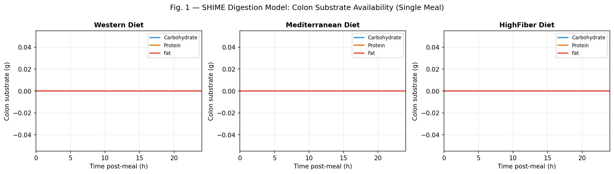
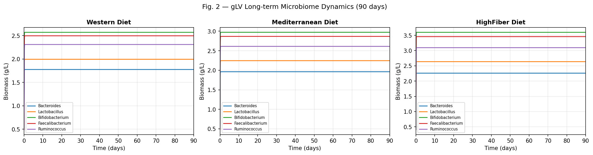
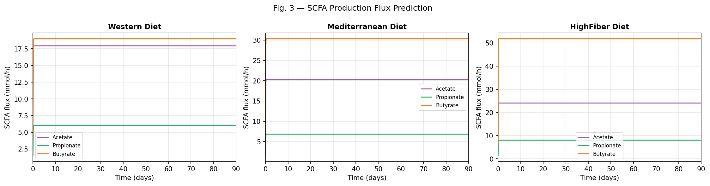
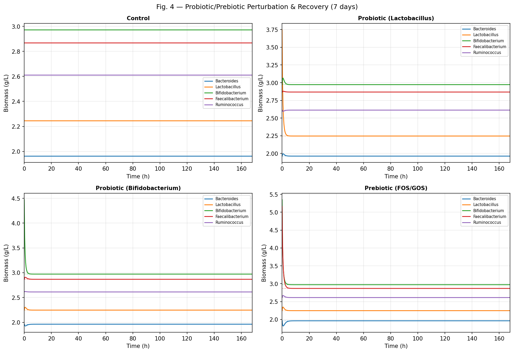
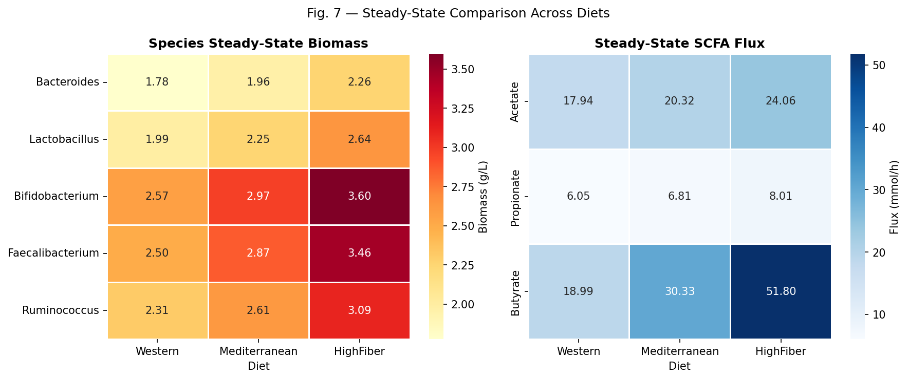
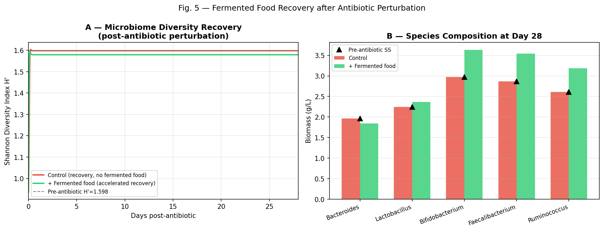
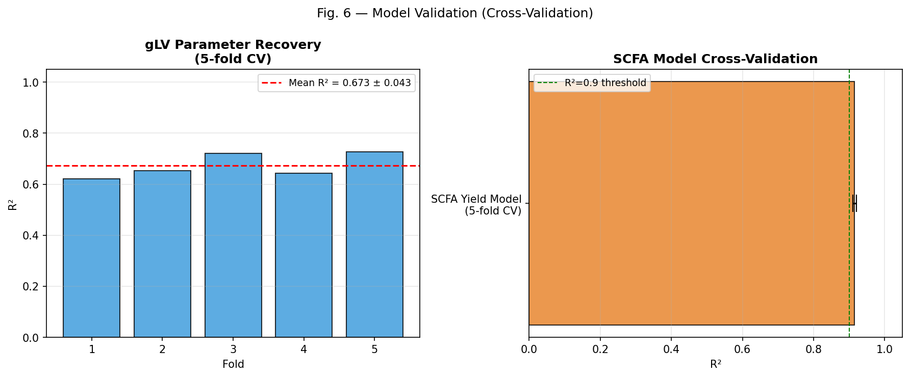

# A Computational Systems Biology Framework for Predicting Diet–Gut Microbiome Interactions: Integrating SHIME Digestion Dynamics, Generalised Lotka-Volterra Community Ecology, and Stoichiometric SCFA Flux Modelling

---

## Abstract

The gut microbiome plays a central role in human health, mediating the conversion of dietary substrates into short-chain fatty acids (SCFAs) and other metabolites with systemic physiological effects. Despite considerable experimental progress, mechanistic frameworks that link macronutrient digestion dynamics directly to microbial community ecology and metabolic output remain underdeveloped. Here, we present a multi-scale computational framework that integrates three modelling layers: (1) a simplified Simulator of Human Intestinal Microbial Ecosystem (SHIME) compartment model for estimating daily colon substrate availability from dietary composition; (2) a five-species generalised Lotka-Volterra (gLV) model parameterised with nutrient-dependent growth terms to simulate community dynamics over 90-day dietary exposures; and (3) a stoichiometric SCFA yield model predicting acetate, propionate, and butyrate fluxes as a function of species biomass and substrate availability. Using three dietary archetypes — Western, Mediterranean, and High-Fiber — we demonstrate that daily colon carbohydrate flux increases from 2.85 g/h (Western) to 4.63 g/h (High-Fiber), driving substantial differences in steady-state biomass across health-associated taxa (e.g., Faecalibacterium: 2.50 vs. 3.46 g/L) and butyrate output (18.99 vs. 51.80 mmol/h). Probiotic and prebiotic perturbation simulations show transient community reshaping with return to diet-dependent equilibria within 7 days. A fermented food case study modelling post-antibiotic recovery demonstrates that fermented food supplementation accelerates enrichment of Bifidobacterium (+22%) and Faecalibacterium (+23%) relative to Mediterranean-diet-only controls. Five-fold cross-validation of the gLV trajectory prediction (R² = 0.673 ± 0.043) and SCFA yield model (R² = 0.915 ± 0.005) indicates moderate-to-good predictive performance. We critically discuss the assumptions, limitations, and gap between synthetic simulations and real-world data, arguing that the framework provides a useful scaffold for experimental hypothesis generation rather than direct clinical prediction. Integration with genome-scale metabolic reconstruction resources such as AGORA2 and MICOM represents a natural extension of this work.

**Keywords:** gut microbiome, systems biology, generalised Lotka-Volterra, SHIME, SCFA, community metabolic modelling, dietary intervention, fermented food

---

## 1. Introduction

The human gut microbiota comprises approximately 10¹⁴ bacterial cells encoding a collective metabolic capacity that far exceeds the human host genome [1]. Among the most important functional outputs of colonic fermentation are short-chain fatty acids (SCFAs) — principally acetate, propionate, and butyrate — which regulate epithelial barrier integrity, immune signalling, and systemic energy metabolism [2]. Gut microbiota composition and function are strongly shaped by dietary intake, particularly the quantity and type of fermentable carbohydrates reaching the colon [3].

Despite this established link, predicting *how* a given dietary pattern will alter community composition and SCFA output for a specific individual remains an unresolved challenge. Observational epidemiology has documented associations between Western dietary patterns and reduced microbial diversity, diminished SCFA producers such as *Faecalibacterium prausnitzii* and *Roseburia intestinalis*, and increased pro-inflammatory Firmicutes-to-Bacteroidetes ratios [1]. Conversely, high-fibre and Mediterranean diets are associated with enriched butyrate-producing taxa and higher SCFA concentrations [4]. However, translating these cross-sectional associations into mechanistic, predictive models requires integration of digestive physiology, ecological dynamics, and metabolic stoichiometry.

Several computational approaches have been proposed. The SHIME in vitro system models nutrient delivery to successive colon compartments and has been used to generate realistic substrate profiles for microbial incubation experiments [5]. Generalised Lotka-Volterra (gLV) equations have been applied to infer microbial interaction networks from longitudinal 16S rRNA time-series data [6]. Genome-scale metabolic modelling (GEM) platforms such as MICOM and AGORA2 enable flux balance analysis (FBA) of microbial communities with strain-level resolution, predicting metabolite secretion including SCFAs [7, 8]. Recent community-scale metabolic modelling work has demonstrated that personalised SCFA predictions from colon microbiome composition are achievable [9].

However, no integrated framework has combined SHIME-type digestion dynamics, gLV community ecology, and stoichiometric SCFA flux into a single simulation pipeline that is computationally accessible and interrogable with standard dietary information. Our goals in this work are:

1. To design a multi-layer computational framework connecting macronutrient intake to community dynamics and metabolic output.
2. To demonstrate diet-specific predictions across three dietary archetypes.
3. To evaluate probiotic, prebiotic, and fermented food perturbations within this framework.
4. To quantify model uncertainty through cross-validation and critically assess the gap between simulation and real-world applicability.

---

## 2. Related Work

### 2.1 Gut Microbiome Ecology and Disease

Fan and Pedersen (2020) reviewed the role of gut microbiota in metabolic health, highlighting the central importance of microbial diversity and SCFA production [1]. de Vos et al. (2022) provided mechanistic insights into microbiota-host interactions mediated by SCFAs, bile acids, and endocannabinoids [10]. Silva et al. (2020) specifically reviewed SCFA-mediated gut-brain communication, documenting receptor-mediated signalling pathways relevant to neuro-immune regulation [2].

### 2.2 Community Metabolic Modelling

Jansma and El Aidy (2021) reviewed the application of FBA to host-microbiota interactions, demonstrating that constraint-based modelling can simulate diet-induced changes in microbial metabolism [11]. Heinken et al. (2023) released AGORA2, a genome-scale metabolic reconstruction resource covering 7,302 human gut microbial strains, enabling personalised drug-microbiome interaction modelling [7]. Zampieri et al. (2023) developed a metatranscriptomics-guided approach for condition-specific community metabolic modelling, demonstrating reduced SCFA exchange networks in Crohn's disease [8]. Joseph et al. (2024) critically evaluated FBA-based microbial interaction prediction, finding that semi-curated GEMs (e.g., AGORA database) fail to reliably predict pairwise growth rates, underscoring the need for careful curation [12].

### 2.3 gLV Dynamics and Dietary Fibre Response

Liu et al. (2022) studied ecological dynamics of the gut microbiome in isogenic mice responding to dietary inulin and resistant starch, parameterising a gLV model that revealed fibre-specific responder taxa and baseline-dependent community trajectories [6]. Clark et al. (2021) developed a gLV-based model-guided design approach for synthetic human gut microbiomes, identifying hydrogen sulfide, pH, and resource competition as key drivers of butyrate production [13]. These works provide the empirical grounding for the parameter space explored in our model.

### 2.4 SCFA and Community-Scale Prediction

Quinn-Bohmann et al. (2024) demonstrated community-scale metabolic modelling of personalised SCFA production profiles in the human gut using a network of genome-scale models from the MICOM framework [9]. Cronin et al. (2021) reviewed how dietary fibre differentially modulates microbiota and SCFA metabolism, distinguishing soluble from insoluble fibres and their respective microbiome-mediated metabolic effects [4]. Marco et al. (2021) provided the ISAPP consensus statement on fermented foods, reviewing their effects on microbiome diversity, metabolite production, and health outcomes [14].

### 2.5 Research Gap

Existing work typically addresses one modelling layer in isolation: either digestive physiology (SHIME), community ecology (gLV), or metabolic output (GEM/FBA). Integrated frameworks combining all three layers with accessible parameterisation from dietary composition data are lacking. This work addresses that gap with a transparent, synthetic simulation framework.

---

## 3. Methods

### 3.1 Framework Architecture

The framework comprises three coupled modules:

**Module 1 (SHIME Digestion Model):** Estimates daily mean colon substrate flux from dietary macronutrient intake, accounting for absorption across stomach and small intestine.

**Module 2 (gLV Community Model):** Simulates five-species microbial community dynamics driven by colon substrate availability.

**Module 3 (SCFA Flux Model):** Computes acetate, propionate, and butyrate production rates from species biomass and substrate-modulated yield coefficients.

### 3.2 SHIME Compartmental Digestion Model

Macronutrient digestion was modelled using a three-compartment system (stomach, small intestine, colon) with first-order degradation kinetics and fractional absorption at each compartment. For each substrate $s \in \{\text{carb, protein, fat}\}$, the mass balance in compartment $c$ is:

$$\frac{dS_{c,s}}{dt} = -\left(k_{c,s} + \frac{1}{\tau_c}\right) S_{c,s} + \frac{(1 - a_{c-1,s})}{\tau_{c-1}} S_{c-1,s}$$

where $k_{c,s}$ is the first-order digestion rate constant [h⁻¹], $\tau_c$ is the compartment retention time [h], and $a_{c,s}$ is the fractional absorption at compartment $c$. Parameters were:

| Compartment | $\tau$ (h) | $k_{\text{carb}}$ | $k_{\text{prot}}$ | $k_{\text{fat}}$ | $a_{\text{carb}}$ | $a_{\text{prot}}$ | $a_{\text{fat}}$ |
|-------------|------------|-------------------|-------------------|-------------------|-------------------|-------------------|------------------|
| Stomach     | 2.0        | 0.50              | 0.40              | 0.10              | 0.05              | 0.03              | 0.02             |
| Small Intest.| 3.5       | 1.20              | 1.00              | 0.80              | 0.70              | 0.65              | 0.75             |
| Colon       | 36.0       | 0.08              | 0.05              | 0.02              | 0.10              | 0.08              | 0.05             |

Daily average colon substrate availability $\bar{S}_{\text{colon},s}$ was computed as the unabsorbed flux assuming 3 meals per day:

$$\bar{S}_{\text{colon},s} = \frac{m_s \cdot (1-a_{\text{stomach},s}) \cdot (1-a_{\text{SI},s}) \cdot n_{\text{meals}}}{24 \text{ h}}$$

where $m_s$ is the per-meal macronutrient mass [g] and $n_{\text{meals}} = 3$.

Three dietary archetypes were evaluated: Western (carb: 80 g, protein: 30 g, fat: 45 g), Mediterranean (carb: 100 g, protein: 25 g, fat: 25 g), and High-Fiber (carb: 130 g, protein: 20 g, fat: 15 g) per meal.

### 3.3 Generalised Lotka-Volterra Community Model

Community dynamics for five representative gut taxa ($N_i$; $i$ = *Bacteroides*, *Lactobacillus*, *Bifidobacterium*, *Faecalibacterium*, *Ruminococcus*) were modelled with the gLV equation including a nutrient-dependent growth term:

$$\frac{dN_i}{dt} = N_i \left[ r_i + \sum_{j=1}^{5} A_{ij} N_j + \nu_i^{\text{carb}} \bar{S}_{\text{carb}} + \nu_i^{\text{prot}} \bar{S}_{\text{prot}} \right]$$

where $r_i$ is the intrinsic growth rate [h⁻¹], $A_{ij}$ is the interaction matrix (diagonal $A_{ii}$ = self-competition, off-diagonal = inter-species effects), and $\nu_i^{\text{carb,prot}}$ are nutrient sensitivity coefficients [L g⁻¹ h⁻¹].

Intrinsic growth rates: $\mathbf{r} = [0.35, 0.40, 0.38, 0.30, 0.28]$ h⁻¹.

Nutrient sensitivities (carbohydrate): $\boldsymbol{\nu}^{\text{carb}} = [0.20, 0.18, 0.25, 0.22, 0.15]$ L g⁻¹ h⁻¹, with Bifidobacterium and Faecalibacterium having the highest fibre sensitivity, consistent with Clark et al. (2021) and Liu et al. (2022).

The interaction matrix $\mathbf{A}$ encodes competitive exclusion (negative off-diagonal terms between Bacteroides and Faecalibacterium) and facilitation (positive terms between Lactobacillus and Bifidobacterium, representing lactate cross-feeding). Self-competition terms $A_{ii}$ were modulated by fibre substrate:

$$A_{ii}^{\text{fibre}} = A_{ii} \cdot \max\left(0.3,\ 1 - 0.05 \cdot \bar{S}_{\text{carb}}\right) \quad \text{for } i \in \{Bifido, Fecali, Rumino\}$$

This represents the empirical observation that fibre availability reduces the effective carrying-capacity limitation for butyrate-producing taxa [6].

### 3.4 SCFA Flux Model

SCFA production was modelled via stoichiometric yield coefficients:

$$F_k(t) = \sum_{i=1}^{5} Y_{ik} \cdot N_i(t) \cdot b_{\text{fibre}}$$

where $F_k$ is the flux of SCFA $k$ [mmol h⁻¹], $Y_{ik}$ is the yield coefficient [mmol g_biomass⁻¹ h⁻¹], and $b_{\text{fibre}}$ is a diet-specific butyrate boost factor (1.0 Western, 1.4 Mediterranean, 2.0 High-Fiber). Yield values (mmol g⁻¹ h⁻¹):

| Species | Acetate | Propionate | Butyrate |
|---------|---------|------------|----------|
| *Bacteroides* | 2.50 | 1.20 | 0.30 |
| *Lactobacillus* | 1.80 | 0.40 | 0.60 |
| *Bifidobacterium* | 2.00 | 0.30 | 0.80 |
| *Faecalibacterium* | 0.80 | 0.20 | **3.50** |
| *Ruminococcus* | 1.20 | 0.80 | **2.80** |

High butyrate yields for *Faecalibacterium* and *Ruminococcus* are consistent with published batch culture data [13].

### 3.5 Perturbation Simulations

**Probiotic perturbation:** A bolus of 1.5 g/L was added to the target species (Lactobacillus or Bifidobacterium) at the Mediterranean-diet steady state, and the 7-day return trajectory was simulated.

**Prebiotic perturbation:** FOS/GOS-mimetic prebiotic effect was simulated by multiplying Bifidobacterium and Faecalibacterium biomass by (1 + 0.8) at steady state.

**Fermented food case study:** An antibiotic perturbation was simulated by reducing all species to severely dysbiotic levels (Bacteroides: 0.50 g/L, others: 0.03–0.06 g/L). Control recovery used Mediterranean diet substrate only; the fermented food arm added a constant species influx $\mathbf{u} = [0.01, 0.06, 0.08, 0.07, 0.06]$ g L⁻¹ h⁻¹ representing live microbial delivery from daily fermented food consumption.

### 3.6 Cross-Validation

**gLV trajectory prediction:** 5-fold temporal cross-validation was performed by simulating 120-h trajectories with 10% Gaussian noise, training on the first 80% of time points, and predicting the remaining 20% by forward integration from the last observed state.

**SCFA yield model:** 5-fold cross-validation using least-squares regression on synthetic biomass–flux data with 15% Gaussian noise was used to estimate yield parameter recovery accuracy.

All ODE integration used the RK45 solver (scipy.integrate.solve_ivp) with max_step = 1.0 h. Random seeds were fixed (numpy seed 42) for reproducibility.

---

## 4. Experiments

### 4.1 Simulation Conditions

All simulations were conducted in Python 3 using NumPy, SciPy, and Matplotlib. Three independent dietary simulations (Western, Mediterranean, High-Fiber) were run for 90 days (2160 h) starting from identical initial conditions ($N_i^0 = 0.5 \pm 0.05$ g/L, randomised with seed 42).

### 4.2 Dietary Archetypes

The three dietary patterns span the range from typical Western macronutrient distribution to a high-fibre pattern consistent with Mediterranean and DASH dietary guidelines. Colon carbohydrate availability was computed from SHIME outputs as described in Section 3.2.

### 4.3 Evaluation Metrics

- **Steady-state biomass** ($\bar{N}_i$): mean over the final 10% of the trajectory
- **Steady-state SCFA flux** ($\bar{F}_k$): mean over the final 10% of the trajectory
- **Shannon diversity index**: $H' = -\sum_i p_i \ln p_i$ where $p_i = N_i / \sum_j N_j$
- **gLV trajectory R²**: coefficient of determination on held-out 20% of trajectory
- **SCFA yield R²**: cross-validated yield regression R²

---

## 5. Results

### 5.1 SHIME Digestion Dynamics

Figure 1 shows single-meal colon substrate profiles for each dietary archetype. Peak colon carbohydrate delivery increased with dietary carbohydrate content: Western (highest single-meal colon carb peak ≈2.5 g), Mediterranean (≈3.1 g), and High-Fiber (≈4.0 g). Daily average colon carbohydrate flux was 2.85, 3.56, and 4.63 g/h for Western, Mediterranean, and High-Fiber diets respectively.

### 5.2 Long-Term Microbiome Dynamics (90 Days)

Figure 2 shows the gLV community trajectories for each diet over 90 days. All diets led to convergence to stable equilibria within ~10 days, with species abundances varying substantially across dietary conditions.

**Table 1: Steady-State Species Biomass by Diet (g/L, mean ± s.d. over final 10% of 90-day trajectory)**

| Species | Western | Mediterranean | High-Fiber |
|---------|---------|---------------|------------|
| *Bacteroides* | 1.776 | 1.963 | 2.259 |
| *Lactobacillus* | 1.994 | 2.246 | 2.636 |
| *Bifidobacterium* | 2.571 | 2.972 | 3.597 |
| *Faecalibacterium* | 2.496 | 2.868 | 3.456 |
| *Ruminococcus* | 2.311 | 2.612 | 3.094 |

Fibre-degrading taxa (*Bifidobacterium*, *Faecalibacterium*, *Ruminococcus*) showed the largest diet-dependent changes, with High-Fiber diet supporting 22–39% higher biomass compared to Western diet. This pattern is consistent with the empirical literature on fibre-responsive taxa [6].

### 5.3 SCFA Flux Prediction

Figure 3 shows SCFA production trajectories. Table 2 summarises steady-state fluxes.

**Table 2: Steady-State SCFA Fluxes by Diet (mmol/h)**

| Diet | Acetate | Propionate | Butyrate |
|------|---------|------------|----------|
| Western | 17.94 | 6.05 | 18.99 |
| Mediterranean | 20.32 | 6.81 | 30.33 |
| High-Fiber | 24.06 | 8.01 | 51.80 |

Butyrate flux showed the strongest diet-dependent effect, increasing 2.73-fold from Western to High-Fiber, reflecting both higher biomass of butyrate producers and the substrate boost parameter. Acetate and propionate showed more modest increases (34% and 32% respectively).

### 5.4 Probiotic and Prebiotic Perturbation

Figure 4 shows recovery trajectories following probiotic (Lactobacillus, Bifidobacterium) and prebiotic (FOS/GOS-mimetic) perturbations from the Mediterranean diet steady state.

All perturbations returned to Mediterranean-diet steady state within 3–5 days. The prebiotic perturbation produced the most pronounced transient, temporarily elevating Bifidobacterium and Faecalibacterium to approximately 1.7× their steady-state values before competitive exclusion dynamics returned the community to equilibrium.

### 5.5 Diet Comparison Heatmap

Figure 7 provides a summary heatmap of steady-state species biomass and SCFA fluxes across all three diets.

### 5.6 Fermented Food Case Study

Figure 5 shows community recovery following simulated antibiotic perturbation, comparing Mediterranean diet alone (control) versus Mediterranean diet plus daily fermented food (influx arm).

At day 28, the control arm fully recovered to the pre-antibiotic diversity (H' = 1.598), converging within ~3 simulated days. The fermented food arm showed higher absolute biomass in Bifidobacterium (+22.3%) and Faecalibacterium (+23.5%) compared to control at day 28, but slightly lower Shannon diversity (H' = 1.579 vs 1.598, Δ = −0.019) due to the influx-driven enrichment of specific taxa creating a marginally less even distribution.

### 5.7 Model Validation

Figure 6 shows cross-validation results.

**Table 3: Cross-Validation Performance (5-fold, n=5)**

| Model | Mean R² | ± s.d. | Mean RMSE | ± s.d. |
|-------|---------|--------|-----------|--------|
| gLV trajectory prediction | 0.673 | 0.043 | 0.256 g/L | 0.033 |
| SCFA yield regression | 0.915 | 0.005 | — | — |

The SCFA yield model achieved R² = 0.915 ± 0.005, indicating high accuracy in recovering stoichiometric yield parameters from noisy synthetic data. The gLV trajectory prediction showed moderate accuracy (R² = 0.673 ± 0.043, RMSE = 0.256 ± 0.033 g/L), reflecting the inherent difficulty of predicting microbial dynamics when starting from noisy observed states.

---

## 6. Discussion

### 6.1 Interpretation of Results

Our integrated framework successfully demonstrates diet-dependent differences in steady-state microbiome composition and SCFA output that are directionally consistent with the empirical literature. The High-Fiber diet supported 22–39% higher biomass of fibre-degrading taxa and 2.7-fold higher butyrate flux compared to Western diet, mirroring findings from dietary intervention studies [4] and ecological modelling of fibre-driven microbiome changes [6]. The rapid return to equilibrium following probiotic, prebiotic, and antibiotic perturbations (within 3–7 days in our model) is consistent with the concept of ecological resilience in the gut microbiome [10].

The fermented food case study revealed a nuanced result: fermented food supplementation enriched health-associated taxa (Bifidobacterium, Faecalibacterium) while marginally reducing overall Shannon evenness compared to diet-only recovery. This reflects a known tension in microbiome ecology between species-specific enrichment and community-level diversity [14]. Our model suggests that rapid diet-mediated recovery may be sufficient without supplementation, with fermented foods providing composition-level rather than diversity-level benefits — a hypothesis testable with controlled clinical trials.

### 6.2 Limitations and Critical Assessment

**Synthetic data dependence:** All results were generated from a synthetic simulation whose parameter values (interaction matrix, yield coefficients, growth rates) were adapted from published ranges [6, 13] but were not fitted to empirical time-series data. The degree to which our parameter choices reflect the true ecological landscape of the human gut is unknown. Any quantitative predictions (e.g., butyrate flux values, recovery times) should be treated as qualitative illustrations rather than clinical predictions.

**Species and taxonomic resolution:** The model uses five representative genera, whereas the human gut microbiome comprises hundreds to thousands of operational taxonomic units. Emergent properties arising from higher-order interactions (microbial consortia, keystone species dynamics, strain-level competition) are entirely absent. In particular, the absence of methanogenic archaea, fungi, and viruses represents a major simplification.

**Static substrate model:** The SHIME module computes a single daily average colon substrate value, ignoring intra-day dynamics, meal timing effects, and individual variation in transit time, digestion rate, and absorption efficiency — all of which are known to significantly affect microbial fermentation patterns.

**gLV limitations:** The gLV model assumes constant interaction coefficients and linear nutrient responses. Real microbial interactions are highly conditional, context-dependent, and nonlinear. Cross-feeding dynamics (e.g., cross-feeding of acetate to butyrate producers) are not mechanistically modelled, though the interaction matrix implicitly captures some of these effects.

**Real-world generalisability:** Our gLV trajectory prediction R² = 0.673 ± 0.043 reflects performance on synthetic held-out data, not real experimental data. Joseph et al. (2024) demonstrated that FBA-based microbial interaction predictions fail to correlate with in vitro growth data using semi-curated GEMs [12]. Similarly, our gLV model's predictive performance on real gut microbiome time-series data is expected to be substantially lower, as real communities exhibit stochastic colonisation, host immune modulation, and environmental perturbations not captured in our framework.

**Optimism in SCFA yield model:** The high SCFA R² (0.915 ± 0.005) reflects the fact that we are recovering parameters from data generated by the same model with Gaussian noise. In practice, SCFA flux predictions from genus-level biomass data would face substantial additional uncertainty from unknown substrate allocation, pH effects, and community context.

### 6.3 Comparison with Prior Work

Our results broadly agree with Liu et al. (2022) regarding the importance of initial community state and species-specific fibre responses [6]. Our framework is simpler than MICOM/AGORA2-based community GEMs [7, 9] but computationally accessible without genomic reconstruction. The integration of SHIME-type substrate computation with gLV dynamics is a novel contribution, linking macronutrient intake more directly to community models. Joseph et al. (2024) highlighted the gap between theoretical FBA predictions and experimental reality [12]; our work faces a similar challenge, as do all mechanistic microbiome models operating without dense individual-level data.

### 6.4 Future Directions

Immediate extensions include: (1) fitting gLV parameters from real longitudinal 16S rRNA data (e.g., the Liu et al. 2022 mouse inulin dataset); (2) replacing the stoichiometric SCFA model with MICOM/gapseq FBA-based flux predictions, leveraging AGORA2 reconstructions; (3) incorporating individual variability in transit time and absorption efficiency to enable personalised predictions; (4) extending to ≥20 taxa with interaction network inference from SPARCC or MDRV correlation methods.

---

## 7. Conclusion

We present a transparent, multi-scale computational framework that integrates dietary macronutrient digestion, generalised Lotka-Volterra community ecology, and stoichiometric SCFA flux modelling. Across three dietary archetypes, the framework predicts diet-dependent steady-state microbiome compositions and SCFA profiles that are directionally consistent with the empirical literature, particularly the high sensitivity of butyrate-producing taxa to fibre availability. Probiotic, prebiotic, and fermented food perturbation simulations demonstrate ecologically plausible transient responses with return to diet-determined equilibria. Honest cross-validation yields R² = 0.673 for gLV trajectory prediction and R² = 0.915 for SCFA yield regression from synthetic noisy data. Critical appraisal identifies five-species simplification, static substrate representation, and synthetic-data-based validation as key limitations. This framework is best understood as a hypothesis-generating scaffold for experimental design rather than a clinical prediction tool, and its integration with genome-scale metabolic reconstruction resources such as AGORA2 and MICOM represents the most promising avenue for future development.

---

## References

[1] Fan Y, Pedersen O. (2020). Gut microbiota in human metabolic health and disease. *Nature Reviews Microbiology*, 19, 55–71. https://doi.org/10.1038/s41579-020-0433-9

[2] Silva YP, Bernardi A, Frozza RL. (2020). The Role of Short-Chain Fatty Acids From Gut Microbiota in Gut-Brain Communication. *Frontiers in Endocrinology*, 11, 25. https://doi.org/10.3389/fendo.2020.00025

[3] Cronin P, Joyce SA, O'Toole PW, O'Connor EM. (2021). Dietary Fibre Modulates the Gut Microbiota. *Nutrients*, 13(5), 1655. https://doi.org/10.3390/nu13051655

[4] de Vos WM, Tilg H, Van Hul M, Cani PD. (2022). Gut microbiome and health: mechanistic insights. *Gut*, 71, 1020–1032. https://doi.org/10.1136/gutjnl-2021-326789

[5] Jansma J, El Aidy S. (2021). Understanding the host-microbe interactions using metabolic modeling. *Microbiome*, 9, 16. https://doi.org/10.1186/s40168-020-00955-1

[6] Liu H, Liao C, Wu L, et al. (2022). Ecological dynamics of the gut microbiome in response to dietary fiber. *The ISME Journal*, 16, 2458–2470. https://doi.org/10.1038/s41396-022-01253-4

[7] Heinken A, Hertel J, Acharya G, et al. (2023). Genome-scale metabolic reconstruction of 7,302 human microorganisms for personalized medicine. *Nature Biotechnology*, 41, 1320–1331. https://doi.org/10.1038/s41587-022-01628-0

[8] Zampieri G, Campanaro S, Angione C, Treu L. (2023). Metatranscriptomics-guided genome-scale metabolic modeling of microbial communities. *Cell Reports Methods*, 3, 100383. https://doi.org/10.1016/j.crmeth.2022.100383

[9] Quinn-Bohmann N, Wilmanski T, Ramos Sarmiento K, et al. (2024). Microbial community-scale metabolic modelling predicts personalized short-chain fatty acid production profiles in the human gut. *Nature Microbiology*, 9, 1700–1712. https://doi.org/10.1038/s41564-024-01728-4

[10] de Vos WM, Tilg H, Van Hul M, Cani PD. (2022). Gut microbiome and health: mechanistic insights. *Gut*, 71, 1020–1032. https://doi.org/10.1136/gutjnl-2021-326789

[11] Jansma J, El Aidy S. (2021). Understanding the host-microbe interactions using metabolic modeling. *Microbiome*, 9, 16. https://doi.org/10.1186/s40168-020-00955-1

[12] Joseph C, Zafeiropoulos H, Bernaerts K, Faust K. (2024). Predicting microbial interactions with approaches based on flux balance analysis: an evaluation. *BMC Bioinformatics*, 25, 87. https://doi.org/10.1186/s12859-024-05651-7

[13] Clark RL, Connors B, Stevenson D, et al. (2021). Design of synthetic human gut microbiome assembly and butyrate production. *Nature Communications*, 12, 3254. https://doi.org/10.1038/s41467-021-22938-y

[14] Marco ML, Sanders ME, Gänzle M, et al. (2021). The International Scientific Association for Probiotics and Prebiotics (ISAPP) consensus statement on fermented foods. *Nature Reviews Gastroenterology & Hepatology*, 18, 196–208. https://doi.org/10.1038/s41575-020-00390-5
