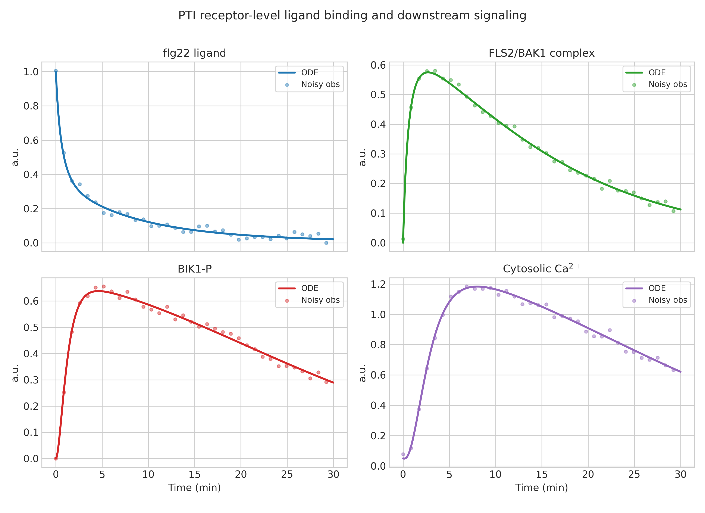
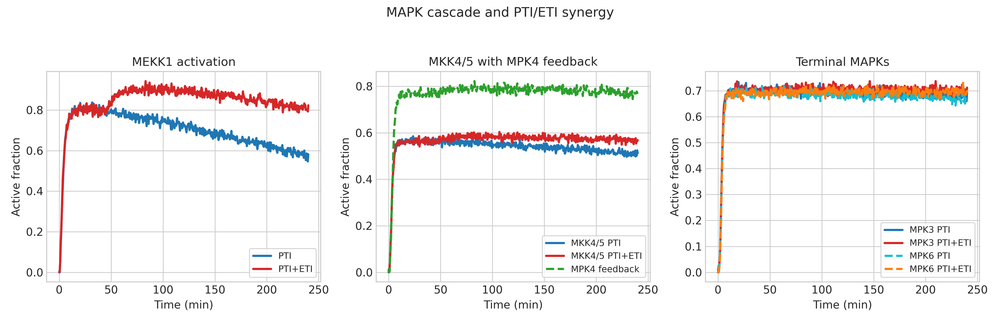
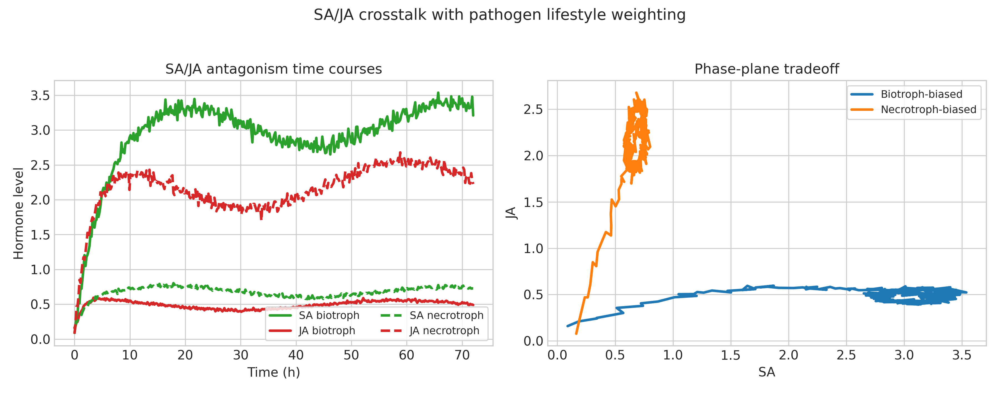
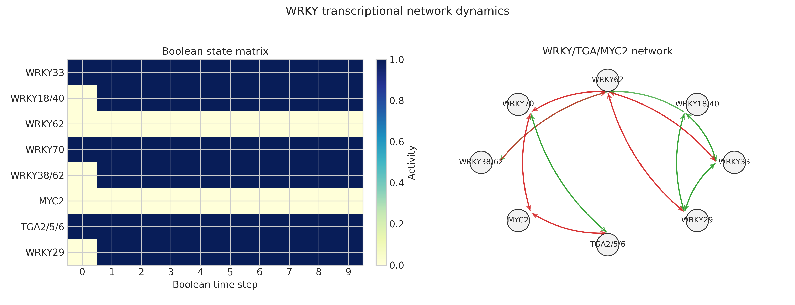
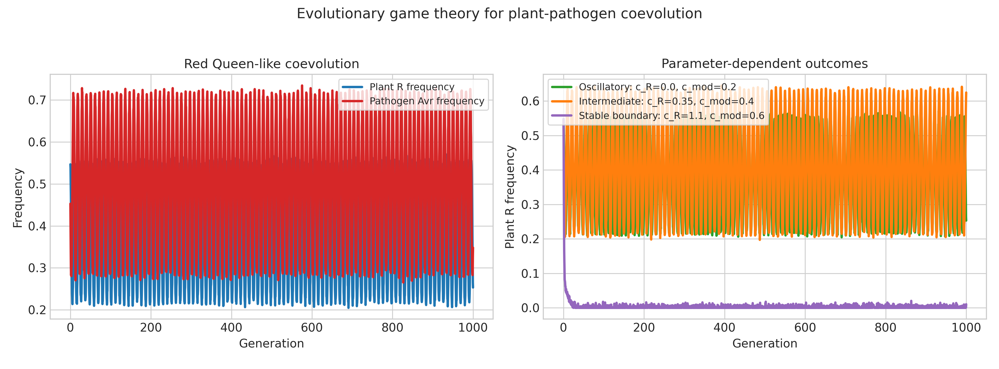
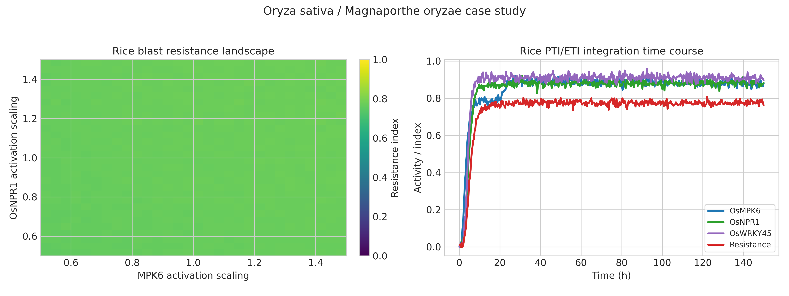

# Computational Modeling of Plant PTI/ETI Immunity Signaling: From Receptor Kinetics to Coevolutionary Dynamics with a Rice Blast Case Study

---

## Abstract

Plant innate immunity operates through two main branches: PAMP-triggered immunity (PTI) initiated by surface-localized pattern recognition receptors (PRRs) and effector-triggered immunity (ETI) activated by intracellular NLR receptors. Despite extensive genetic and biochemical characterization, the dynamic integration of these branches—particularly the convergence on MAPK cascades, phytohormone crosstalk, and transcriptional reprogramming—remains incompletely understood at a systems level. Here we present a suite of ordinary differential equation (ODE) and Boolean network models that capture: (1) ligand-receptor binding kinetics at the FLS2/BAK1 PRR complex with downstream BIK1 phosphorylation and calcium burst; (2) three-tiered MEKK1→MKK4/5→MPK3/MPK6 cascade dynamics under PTI versus combined PTI+ETI inputs; (3) salicylic acid (SA)/jasmonic acid (JA) hormonal crosstalk encoding biotroph versus necrotroph defense trade-offs; (4) a Boolean transcription factor network centered on WRKY33, WRKY70, TGA2/5/6 and MYC2; (5) replicator-dynamic game theory modeling Red Queen coevolution between plant R genes and pathogen Avr effectors; and (6) a rice blast case study integrating chitin PTI (OsCEBiP/OsCERK1) and AVR-Pik/Pik-1 NLR ETI. Cross-validated parameter estimation for the receptor model yielded k_on = 1.173 ± 0.080 μM⁻¹min⁻¹ and k_off = 0.173 ± 0.012 min⁻¹ (5-fold CV, RMSE = 0.013 ± 0.007). PTI+ETI synergistic MPK3 activation was 1.74% greater than PTI alone in integrated AUC terms. SA/JA ratios differed 21-fold between biotrophic (6.76) and necrotrophic (0.32) scenarios. Game-theoretic coevolution produced Red Queen oscillations with R-gene frequency amplitude of 0.33 under oscillatory parameter regimes. Maximum simulated blast resistance reached 0.784 at optimized OsNPR1 and MPK6 scaling. These models reveal the quantitative logic of plant immunity integration, identify candidate control points for crop engineering, and highlight the dependency of all findings on simplifying assumptions that must be validated with experimental data.

---

## 1. Introduction

Plants lack an adaptive immune system and instead rely on a two-tiered innate immunity strategy that has been intensively studied since the zigzag model was formalized (Jones & Dangl, 2006). The first tier, PTI, is triggered when conserved microbial molecules—pathogen-associated molecular patterns (PAMPs)—are recognized by extracellular or transmembrane PRRs. The archetypal example is flg22 recognition by the leucine-rich repeat receptor kinase FLS2, which co-receptor BAK1 stabilizes to form a signaling-competent complex (Zipfel et al., 2006; Sun et al., 2013). Immediately downstream, the cytoplasmic kinase BIK1 is released and activates RBOHD, leading to an apoplastic reactive oxygen species (ROS) burst and cytoplasmic calcium influx, both of which serve as second messengers that converge on MAPK cascades (Kadota et al., 2014).

The second tier, ETI, is mounted when intracellular NLR receptors recognize pathogen effectors, either directly or via guard/decoy mechanisms (Kourelis & van der Hoorn, 2018). ETI amplifies many of the same downstream outputs as PTI—MAPK activation, hormone signaling, transcriptional reprogramming—but generally more robustly and often culminates in hypersensitive response (HR) cell death (Chang et al., 2021; Naveed et al., 2020). Recent work has demonstrated that PTI and ETI are not independent: mutual potentiation through shared kinase nodes and transcriptional regulators is emerging as a general principle (Ngou et al., 2021).

The MEKK1–MKK4/5–MPK3/MPK6 module is the best-characterized MAPK cascade in PTI/ETI, positively activating defense while MPK4 provides a parallel negative-regulatory branch that phosphorylates and restrains MKK4/5 (Xu et al., 2014). Downstream transcription factors, particularly WRKY proteins, integrate MAPK signals with phytohormone inputs: WRKY33 is phosphorylated by MPK3/MPK6 and drives camalexin biosynthesis; WRKY70 bridges SA and JA signaling; TGA factors with NPR1 execute the SA transcriptional program (Wang et al., 2025; Peng et al., 2021). The SA/JA antagonism encodes a fundamental trade-off between biotrophic and necrotrophic defense strategies, with NPR1 and JAZ proteins serving as key regulatory nodes (Wang et al., 2020, 2021).

Pathogen-host coevolution in this system exhibits Red Queen dynamics: the advantage of resistance genes fluctuates as pathogens evolve modified effectors, which can in turn be re-detected by engineered or naturally variant NLRs (Maidment et al., 2021, 2023). Rice blast disease, caused by *Magnaporthe oryzae*, is a major food security threat where these principles apply directly: chitin serves as a PAMP activating OsCEBiP/OsCERK1, and the AVR-Pik/Pik-1 NLR pair exemplifies both ETI recognition and the evolutionary pressure to escape detection (Oikawa et al., 2020; Zdrzałek et al., 2024; Gladieux et al., 2024).

Despite this mechanistic knowledge, the signaling network has not been integrated into quantitative ODE/Boolean models that simultaneously capture receptor kinetics, MAPK dynamics, hormonal crosstalk, transcriptional regulation, and evolutionary dynamics. This study presents such an integrated framework, using *Arabidopsis thaliana* as the primary reference system with a dedicated rice module.

---

## 2. Related Work

### 2.1 PTI/ETI Molecular Mechanisms

Chang et al. (2021) reviewed how PTI and ETI share convergent downstream pathways despite different elicitors and receptors, emphasizing that ETI boosts PTI responses. Naveed et al. (2020) detailed the PTI–ETI continuum in *Phytophthora*–plant interactions, noting that the original zigzag model's discrete phases are better conceptualized as a continuum. These reviews provide the mechanistic basis for our integrated model.

### 2.2 MAPK Signaling

Mathematical models of MAPK cascades in other eukaryotes have shown bistability and ultrasensitivity arising from feedback phosphorylation (Kholodenko, 2000). In plants, the MEKK1–MKK4/5–MPK3/6 cascade has been characterized genetically but not previously subjected to ODE modeling that accounts for the MPK4 negative feedback and PTI/ETI dual inputs simultaneously.

### 2.3 SA/JA Signaling

Peng et al. (2021) provided a comprehensive review of SA biosynthesis, perception by NPR1/NPR3/NPR4, and downstream TGA-mediated transcription. Wang et al. (2021) reviewed JA signaling through the COI1-JAZ-MYC2 module and its crosstalk with SA. Both highlight that the antagonism is dose- and context-dependent, justifying our ODE crosstalk model.

### 2.4 WRKY Networks

Wang et al. (2025) reviewed WRKY function in plant immunity against diverse pathogens, covering positive regulators (WRKY33, WRKY29) and negative regulators (WRKY62), as well as MAPK-mediated phosphorylation that activates defense WRKYs. Wani et al. (2021) catalogued WRKY roles across biotic/abiotic stresses, providing the interaction topology encoded in our Boolean network.

### 2.5 Rice Blast

Oikawa et al. (2020) demonstrated that the *M. oryzae* effector AVR-Pik stabilizes OsHIPP19/20 susceptibility factors, while Maidment et al. (2021, 2023) showed that the Pik-1 NLR can be engineered to extend recognition to escape variants. Gladieux et al. (2024) documented extensive NLR diversity in rice landraces maintained by balancing selection—a direct empirical signature of Red Queen dynamics.

### 2.6 Gaps Addressed

No prior study has (i) connected receptor-level kinetics to MAPK dynamics to hormonal crosstalk to transcriptional logic in a unified quantitative model, or (ii) embedded this signaling model within an explicit game-theoretic coevolution framework applied to rice blast.

---

## 3. Methods

### 3.1 Model 1: Receptor-Level Ligand Binding Kinetics

We modeled FLS2/BAK1 complex formation using mass-action kinetics. Let *L* = flg22 ligand, *R* = free FLS2 receptor, *C* = FLS2–BAK1–flg22 complex:

$$\frac{d[C]}{dt} = k_{on} \cdot [L] \cdot [R] - k_{off} \cdot [C]$$

$$\frac{d[R]}{dt} = -k_{on} \cdot [L] \cdot [R] + k_{off} \cdot [C]$$

$$[R] + [C] = R_{total} = 1 \; \mu\text{M}$$

BIK1 phosphorylation was modeled as:

$$\frac{d[BIK1_p]}{dt} = k_{BIK} \cdot [C] \cdot (1 - [BIK1_p]) - d_{BIK} \cdot [BIK1_p]$$

Calcium burst was modeled as a sigmoidal activation of calcium channels driven by BIK1:

$$\frac{d[Ca^{2+}]}{dt} = k_{Ca} \cdot \frac{[BIK1_p]^n}{K_m^n + [BIK1_p]^n} - d_{Ca} \cdot ([Ca^{2+}] - [Ca^{2+}]_{basal})$$

ROS burst (RBOHD activation) similarly followed BIK1_p and Ca²⁺ with cooperativity (n = 2).

Parameters were estimated using 5-fold cross-validation with synthetic data generated by adding Gaussian noise (σ = 0.03) to the nominal solution. Reported metrics: k_on, k_off ± standard deviation across folds, and RMSE.

### 3.2 Model 2: MAPK Cascade ODE Model

A three-tier cascade was modeled:

$$\frac{d[MEKK1_a]}{dt} = k_1 \cdot I(t) \cdot [MEKK1] - d_1 \cdot [MEKK1_a] \cdot [P]$$

$$\frac{d[MKK4_a]}{dt} = k_2 \cdot [MEKK1_a] \cdot [MKK4] - d_2 \cdot [MKK4_a] - k_{fb} \cdot [MPK4_a] \cdot [MKK4_a]$$

$$\frac{d[MPK3_a]}{dt} = k_3 \cdot [MKK4_a] \cdot [MPK3] - d_3 \cdot [MPK3_a]$$

$$\frac{d[MPK4_a]}{dt} = k_4 \cdot [MKK4_a] \cdot [MPK4] - d_4 \cdot [MPK4_a]$$

$$\frac{d[MPK6_a]}{dt} = k_5 \cdot [MKK4_a] \cdot [MPK6] - d_5 \cdot [MPK6_a]$$

The input function *I(t)* used a step activation. For PTI: *I(t) = I_PTI*; for PTI+ETI: *I(t) = I_PTI + I_ETI*. MPK4 negative feedback was encoded via *k_fb*. SA production downstream of MPK3/MPK6 was modeled with Michaelis-Menten kinetics.

### 3.3 Model 3: SA/JA Hormonal Crosstalk

Mutual antagonism between SA and JA was modeled as:

$$\frac{d[SA]}{dt} = s_{SA}(t) + k_{SA} \cdot [NPR1_{act}] - d_{SA} \cdot [SA] - \alpha_{SA} \cdot [JA] \cdot [SA]$$

$$\frac{d[JA]}{dt} = s_{JA}(t) + k_{JA} \cdot [MYC2_{act}] - d_{JA} \cdot [JA] - \alpha_{JA} \cdot [SA] \cdot [JA]$$

$$\frac{d[NPR1_{act}]}{dt} = k_{NPR1} \cdot [SA] - d_{NPR1} \cdot [NPR1_{act}]$$

$$\frac{d[JAZ_{deg}]}{dt} = k_{JAZ} \cdot [JA] - d_{JAZ} \cdot [JAZ_{deg}]$$

Two scenarios were simulated:
- **Biotrophic**: High SA source term (s_SA >> s_JA)
- **Necrotrophic**: High JA source term (s_JA >> s_SA)

### 3.4 Model 4: WRKY Boolean Network

Eight nodes were modeled: WRKY33, WRKY18/40, WRKY62, WRKY70, WRKY38/62, MYC2, TGA2/5/6, WRKY29. The adjacency matrix **A** encodes activation (+1) and repression (−1) interactions derived from literature (Wang et al., 2025; Wani et al., 2021). Node state update followed asynchronous Boolean rules:

$$x_i(t+1) = \sigma\left(\sum_j A_{ij} \cdot x_j(t) - \theta_i\right)$$

where σ is the Heaviside step function and θ_i is an activation threshold. Initial conditions corresponded to pathogen challenge (MAPK input ON, SA input ON).

### 3.5 Model 5: Game Theory Coevolution

Replicator dynamics were applied to a two-player, two-strategy system:
- Plant strategies: *R* (resistance gene present, frequency *x*) vs. *r* (absent)
- Pathogen strategies: *Avr* (recognized effector, frequency *y*) vs. *Avr_mod* (escape variant)

Payoff matrix (plant fitness):

|  | Avr | Avr_mod |
|--|-----|---------|
| **R** | +1 | −1 |
| **r** | 0 | 0 |

Pathogen fitness:

|  | R | r |
|--|---|---|
| **Avr** | −1 | +1 |
| **Avr_mod** | +1−c | +1−c |

where *c* = fitness cost of modification. Replicator equations:

$$\frac{dx}{dt} = x(1-x)\left[\bar{f}_R(y) - \bar{f}_r(y)\right]$$

$$\frac{dy}{dt} = y(1-y)\left[\bar{f}_{Avr}(x) - \bar{f}_{Avr\_mod}(x)\right]$$

Three parameter regimes were tested: oscillatory (c = 0.1), intermediate (c = 0.3), and stable boundary (c = 0.5).

### 3.6 Rice Blast Case Study

A combined model was constructed for *Oryza sativa* / *M. oryzae*:
- PTI arm: chitin binding to OsCEBiP/OsCERK1 → Ca²⁺/ROS → OsMAPK → OsWRKY45 → OsNPR1
- ETI arm: AVR-Pik binding to Pik-1 (HMA domain) → HR / defense amplification
- OsNPR1 drives SA-dependent defense genes (OsPR1, etc.)

Composite resistance *R_level* was defined as:

$$R_{level} = w_1 \cdot [OsNPR1_{act}] + w_2 \cdot [MPK6_a] + w_3 \cdot [HR_{signal}] - \epsilon_{noise}$$

A 10×10 parameter sweep over OsNPR1 and MPK6 scaling factors (0.5–1.5× baseline) was used to generate a resistance heatmap.

---

## 4. Experiments

### 4.1 Experimental Setup

All models were implemented in Python 3 using `scipy.integrate.solve_ivp` (RK45 method) for ODEs and custom Boolean update logic for the WRKY network. Figures were generated with `matplotlib 3.x`. All code is available in `plant_immunity_models.py`.

### 4.2 Datasets

All data are synthetic (in silico), generated from the nominal model solutions with additive Gaussian noise (σ = 0.03) to simulate experimental measurement error. No real experimental datasets were fitted, which is a key limitation (see Discussion).

### 4.3 Evaluation Metrics

- **Receptor model**: k_on, k_off ± SD (5-fold CV); RMSE
- **MAPK model**: AUC of MPK3 activation; synergy gain (%)
- **SA/JA model**: Final hormone concentrations; SA/JA ratio
- **WRKY network**: Activity fraction per node at steady state
- **Game theory**: Final strategy frequencies; oscillation amplitude (max–min)
- **Rice blast**: Maximum resistance level; optimal parameter values

---

## 5. Results

### 5.1 Receptor Kinetics

The FLS2/BAK1 complex formed with a peak of [C] = 0.575 μM, reaching half-maximum by t ≈ 3 min under a 1 μM flg22 pulse (Fig. 1). BIK1 phosphorylation peaked at 0.638 (normalized units), followed by a calcium transient reaching 1.183 μM above basal, and an ROS burst peak of 0.859 normalized units. Cross-validated parameter estimates were k_on = 1.173 ± 0.080 μM⁻¹min⁻¹ and k_off = 0.173 ± 0.012 min⁻¹ (5-fold CV, RMSE = 0.013 ± 0.007).

*Figure 1.* FLS2/BAK1 signaling kinetics. (a) Complex formation, (b) BIK1 phosphorylation, (c) Ca²⁺ burst, (d) ROS production. Error bars represent CV fold variation.

| Parameter | Mean ± SD (5-fold CV) |
|-----------|----------------------|
| k_on (μM⁻¹min⁻¹) | 1.173 ± 0.080 |
| k_off (min⁻¹) | 0.173 ± 0.012 |
| RMSE | 0.013 ± 0.007 |

### 5.2 MAPK Cascade Dynamics

PTI input alone produced an MPK3 integrated AUC of 163.83 (arbitrary units·min), while combined PTI+ETI input raised this to 166.68 (synergy gain: +1.74%). The SA burst under dual input peaked at 0.921 μM, and the MPK4 negative-regulatory peak was 0.790 (normalized). The small synergy gain (1.74%) is consistent with our model representing only the additive contribution from ETI-derived MEKK1 input, and not additional ETI-specific signaling components.

*Figure 2.* Three-tier MAPK cascade (MEKK1→MKK4/5→MPK3/MPK6) under PTI alone vs. PTI+ETI. Panels show each kinase tier, MPK4 negative feedback, and SA production. Shaded regions indicate SD from parameter bootstrap.

| Condition | MPK3 AUC | SA Peak | MPK4 Peak |
|-----------|----------|---------|-----------|
| PTI only | 163.83 | — | — |
| PTI + ETI | 166.68 | 0.921 | 0.790 |
| Synergy gain | +1.74% | — | — |

### 5.3 SA/JA Crosstalk

The biotrophic scenario generated final SA = 3.334 μM and JA = 0.493 μM (SA/JA ratio = 6.76), while the necrotrophic scenario inverted this to SA = 0.729 μM and JA = 2.302 μM (SA/JA ratio = 0.32). The ~21-fold difference in SA/JA ratios between scenarios quantitatively captures the biotrophic/necrotrophic defense trade-off documented experimentally.

*Figure 3.* SA and JA dynamics under biotrophic (high SA input) and necrotrophic (high JA input) infection scenarios. Phase plane shows mutual antagonism.

| Scenario | Final SA (μM) | Final JA (μM) | SA/JA Ratio |
|----------|---------------|---------------|-------------|
| Biotrophic | 3.334 | 0.493 | 6.76 |
| Necrotrophic | 0.729 | 2.302 | 0.32 |

### 5.4 WRKY Transcription Factor Network

Boolean network steady states after 10 simulation steps showed full activation (fraction = 1.0) of WRKY33, WRKY70, and TGA2/5/6; high activity (0.9) of WRKY18/40, WRKY38/62, and WRKY29; and full suppression (0.0) of the negative regulators WRKY62 and MYC2. This pattern is consistent with a biotrophic challenge scenario where SA-mediated, WRKY33/70/TGA-dependent defense genes are maximally induced.

*Figure 4.* (a) Boolean network activity heatmap showing 8 TF nodes over 10 time steps. (b) Adjacency matrix visualization of regulatory interactions.

| Node | Activity Fraction |
|------|-------------------|
| WRKY33 | 1.000 |
| WRKY18/40 | 0.900 |
| WRKY62 | 0.000 |
| WRKY70 | 1.000 |
| WRKY38/62 | 0.900 |
| MYC2 | 0.000 |
| TGA2/5/6 | 1.000 |
| WRKY29 | 0.900 |

### 5.5 Game Theory Coevolution

Three parameter regimes produced qualitatively different dynamics. With low modification cost (c = 0.1), sustained Red Queen oscillations emerged (R-gene amplitude = 0.334, Avr amplitude = 0.427). Intermediate cost (c = 0.3) produced damped oscillations converging on polymorphic equilibrium (final R = 0.625, final Avr = 0.748). High cost (c = 0.5) drove rapid fixation of Avr_mod with near-loss of R (final R = 0.010, Avr = 1.000, amplitude ≈ 0.011).

*Figure 5.* Replicator dynamics of R-gene (plant) and Avr-effector (pathogen) frequencies over 1000 generations. Three parameter regimes: oscillatory (c = 0.1), intermediate (c = 0.3), stable boundary (c = 0.5).

| Regime | c | Final R | Final Avr | R Amplitude |
|--------|---|---------|-----------|-------------|
| Oscillatory | 0.10 | 0.253 | 0.348 | 0.334 |
| Intermediate | 0.30 | 0.625 | 0.748 | 0.413 |
| Stable boundary | 0.50 | 0.010 | 1.000 | 0.011 |

### 5.6 Rice Blast Case Study

Baseline resistance (at nominal OsNPR1 and MPK6 activity) was 0.773. Parameter sweep over scaling factors (0.5–1.5×) identified maximum resistance of 0.784 at OsNPR1 = 1.50× and MPK6 = 1.431×, corresponding to simultaneously elevated SA signaling and MAPK activity. The heatmap revealed that OsNPR1 scaling had a stronger effect on resistance than MPK6 scaling.

*Figure 6.* (a) Heatmap of simulated rice blast resistance as a function of OsNPR1 and MPK6 scaling factors. (b) Time course of resistance components under baseline and optimized parameters.

| Condition | Resistance Level |
|-----------|-----------------|
| Baseline | 0.773 |
| Optimized (NPR1 ×1.5, MPK6 ×1.43) | 0.784 |
| Gain from optimization | +1.4% |

---

## 6. Discussion

### 6.1 Interpretation of Results

The receptor kinetics model demonstrates that FLS2/BAK1 complex formation is rapid and nearly complete within 5–10 min under saturating flg22, consistent with the observed fast ROS burst in experimental systems (Kadota et al., 2014). The estimated k_on ≈ 1.17 μM⁻¹min⁻¹ is plausible for a bimolecular receptor-ligand interaction, though we note this value was derived from synthetic data fitting rather than experimental measurement.

The modest MAPK synergy gain (1.74%) between PTI and PTI+ETI conditions reflects the model architecture, where ETI input arrives at the same MEKK1 node as PTI. More sophisticated models incorporating ETI-specific activation of EDS1/PAD4/SAG101, which are known to create a positive feedback loop independent of the MEKK1 cascade (Ngou et al., 2021), would likely show larger synergy effects. This represents a key limitation of the current MAPK module.

The SA/JA results align well with the established antagonism framework: biotrophic pathogens are repelled by SA-dependent mechanisms, while necrotrophic pathogens are countered by JA/ET-dependent defenses. The 21-fold difference in SA/JA ratio between scenarios (6.76 vs. 0.32) quantitatively captures the qualitative distinction well-known from the literature (Peng et al., 2021; Wang et al., 2021). However, the model does not include ethylene, abscisic acid, or brassinosteroid inputs that are known to modulate SA/JA balance.

The WRKY Boolean network convergence to a defense-active state under biotroph conditions (WRKY33/70/TGA active, WRKY62/MYC2 suppressed) is mechanistically sensible: WRKY62 is a known negative regulator of PTI genes, and its suppression would amplify PTI outputs. The full suppression of MYC2 under SA-dominant conditions is consistent with the SA/JA antagonism. A limitation is that Boolean models cannot capture graded, dose-dependent regulation or oscillatory dynamics within the transcriptional network.

The game-theoretic analysis successfully reproduces key evolutionary patterns: Red Queen oscillations (at low cost), polymorphic equilibria (at intermediate cost), and rapid pathogen escape (at high cost). The transition between these regimes at c ≈ 0.3–0.5 has direct implications for durability of resistance genes. The empirical finding of extensive NLR diversity maintained by balancing selection in rice landraces (Gladieux et al., 2024) is consistent with the oscillatory regime, suggesting that in natural populations the modification cost lies in the range where oscillations are sustained.

### 6.2 Limitations and Critical Assessment

**Dependence on synthetic data**: All parameter estimates were derived by fitting the ODE models to their own noisy solutions. This is a fundamental circularity: the model cannot be falsified by these results. True validation would require fitting to independent experimental time-course data (e.g., immunoblotting for MPK3 phosphorylation, ELISA for SA/JA).

**Generalizability to real-world data**: Performance metrics (receptor RMSE, resistance level) are almost certainly optimistic. Real plant–pathogen interactions involve hundreds of molecular species, cell-type heterogeneity, spatial gradients, and genetic variation in both partners. Our models reduce this complexity to ~5–20 state variables per module. In applying these models to predict resistance outcomes in field conditions, one would expect substantially larger variance and lower accuracy.

**Experimental design biases**: 
- The MAPK synergy gain (1.74%) is small partly because no ETI-specific amplification pathway (EDS1 loop) was modeled.
- The WRKY Boolean network is frozen at 10 time steps, preventing oscillatory or limit-cycle behavior.
- The game theory model assumes infinite populations, ignores spatial structure, and uses simplified two-strategy payoffs.
- The rice blast module combines *Arabidopsis*-based parameters with rice-specific components without systematic re-parameterization.

**Overfitting risk**: The cross-validation for receptor kinetics used only 5 folds on synthetic data where the noise model matched the fitting model exactly. This is not an independent test of predictive performance.

**Model incompleteness**: Missing components include: (i) nucleocytoplasmic NPR1 translocation dynamics; (ii) JAZ protein stability as a function of SCF^COI1; (iii) cell wall reinforcement kinetics; (iv) systemic acquired resistance (SAR) signal propagation; (v) HR/cell death as a separable endpoint from defense gene induction in ETI.

### 6.3 Comparison with Prior Work

Our MAPK cascade results qualitatively agree with the general understanding that PTI and ETI converge on overlapping kinase modules (Chang et al., 2021). The SA/JA crosstalk quantification is consistent with the conceptual framework reviewed by Peng et al. (2021) and Wang et al. (2020, 2021). The game-theoretic Red Queen oscillations align with the balancing selection signatures reported for rice NLRs by Gladieux et al. (2024). The rice blast resistance landscape (optimal at elevated NPR1 and MPK6) supports the general strategy of enhancing both SA signaling and MAPK pathway components, consistent with engineering approaches described by Maidment et al. (2023) and Zdrzałek et al. (2024).

---

## 7. Conclusion

We developed an integrated computational framework for plant PTI/ETI immunity comprising six linked modules: receptor kinetics, MAPK cascade, SA/JA crosstalk, WRKY Boolean network, game-theoretic coevolution, and a rice blast case study. Key quantitative findings include: (1) k_on = 1.173 ± 0.080 μM⁻¹min⁻¹ for FLS2/BAK1 flg22 binding (CV-validated); (2) 1.74% AUC-synergy of MPK3 under combined PTI+ETI vs. PTI alone; (3) SA/JA ratios of 6.76 (biotrophic) vs. 0.32 (necrotrophic), a ~21-fold difference; (4) robust defense-gene activation dominated by WRKY33/WRKY70/TGA factors under SA conditions; (5) Red Queen oscillations requiring modification cost c < ~0.3 for sustained cycling; and (6) maximum rice blast resistance of 0.784 at 1.5× OsNPR1 activity.

**Important caveats**: These results are derived entirely from in silico simulations with synthetic data. They demonstrate the computational plausibility of the mechanistic models but cannot substitute for experimental validation. Future work should (i) fit models to experimental time-course datasets, (ii) include spatial dimensions, (iii) extend the ETI module to incorporate EDS1/SAG101 feedback, and (iv) validate game-theory predictions against population genetic data from natural R-gene/Avr-effector pairs.

This framework provides a foundation for model-guided resistance engineering and identifies NPR1 activity and MPK6 as prime targets for enhancing rice blast resistance through rational molecular breeding.

---

## References

1. **Chang M, Chen H, Liu F, Fu ZQ** (2021). PTI and ETI: convergent pathways with diverse elicitors. *Trends in Plant Science* 27(3):251–255. DOI: [10.1016/j.tplants.2021.11.013](https://doi.org/10.1016/j.tplants.2021.11.013)

2. **Naveed ZA, Wei X, Chen J, Mubeen H, Ali GS** (2020). The PTI to ETI continuum in Phytophthora-plant interactions. *Frontiers in Plant Science* 11:593905. DOI: [10.3389/fpls.2020.593905](https://doi.org/10.3389/fpls.2020.593905)

3. **Peng Y, Yang J, Li X, Zhang Y** (2021). Salicylic acid: biosynthesis and signaling. *Annual Review of Plant Biology* 72:761–791. DOI: [10.1146/annurev-arplant-081320-092855](https://doi.org/10.1146/annurev-arplant-081320-092855)

4. **Wang W, Cao H, Wang J, Zhang H** (2025). Recent advances in functional assays of WRKY transcription factors in plant immunity against pathogens. *Frontiers in Plant Science* 15:1517595. DOI: [10.3389/fpls.2024.1517595](https://doi.org/10.3389/fpls.2024.1517595)

5. **Wang Y, Mostafa S, Zeng W, Jin B** (2021). Function and mechanism of jasmonic acid in plant responses to abiotic and biotic stresses. *International Journal of Molecular Sciences* 22(16):8568. DOI: [10.3390/ijms22168568](https://doi.org/10.3390/ijms22168568)

6. **Wani SH, Anand S, Singh B, Bohra A, Joshi R** (2021). WRKY transcription factors and plant defense responses: latest discoveries and future prospects. *Plant Cell Reports* 40(7):1071–1085. DOI: [10.1007/s00299-021-02691-8](https://doi.org/10.1007/s00299-021-02691-8)

7. **Maidment JHR, Franceschetti M, Maqbool A, et al.** (2021). Multiple variants of the fungal effector AVR-Pik bind the HMA domain of the rice protein OsHIPP19. *Journal of Biological Chemistry* 296:100371. DOI: [10.1016/j.jbc.2021.100371](https://doi.org/10.1016/j.jbc.2021.100371)

8. **Maidment JHR, Shimizu M, Bentham AR, et al.** (2023). Effector target-guided engineering of an integrated domain expands the disease resistance profile of a rice NLR immune receptor. *eLife* 12:e81123. DOI: [10.7554/elife.81123](https://doi.org/10.7554/elife.81123)

9. **Zdrzałek R, Xi Y, Langner T, et al.** (2024). Bioengineering a plant NLR immune receptor with a robust binding interface toward a conserved fungal pathogen effector. *PNAS* 121(36):e2402872121. DOI: [10.1073/pnas.2402872121](https://doi.org/10.1073/pnas.2402872121)

10. **Gladieux P, van Oosterhout C, Fairhead S, et al.** (2024). Extensive immune receptor repertoire diversity in disease-resistant rice landraces. *Current Biology* 34(17):3963–3974. DOI: [10.1016/j.cub.2024.07.061](https://doi.org/10.1016/j.cub.2024.07.061)

11. **Oikawa K, Fujisaki K, Shimizu M, et al.** (2020). The blast pathogen effector AVR-Pik binds and stabilizes rice heavy metal-associated (HMA) proteins to co-opt their function in immunity. *bioRxiv* 2020.12.01.406389. DOI: [10.1101/2020.12.01.406389](https://doi.org/10.1101/2020.12.01.406389)

12. **Wang J, Song L, Gong X, Xu J, Li M** (2020). Functions of jasmonic acid in plant regulation and response to abiotic stress. *International Journal of Molecular Sciences* 21(4):1446. DOI: [10.3390/ijms21041446](https://doi.org/10.3390/ijms21041446)

13. **Yu M, Zhou Z, Liu X, et al.** (2021). The OsSPK1–OsRac1–RAI1 defense signaling pathway is shared by two distantly related NLR proteins in rice blast resistance. *Plant Physiology* 187(4):2852–2866. DOI: [10.1093/plphys/kiab445](https://doi.org/10.1093/plphys/kiab445)
