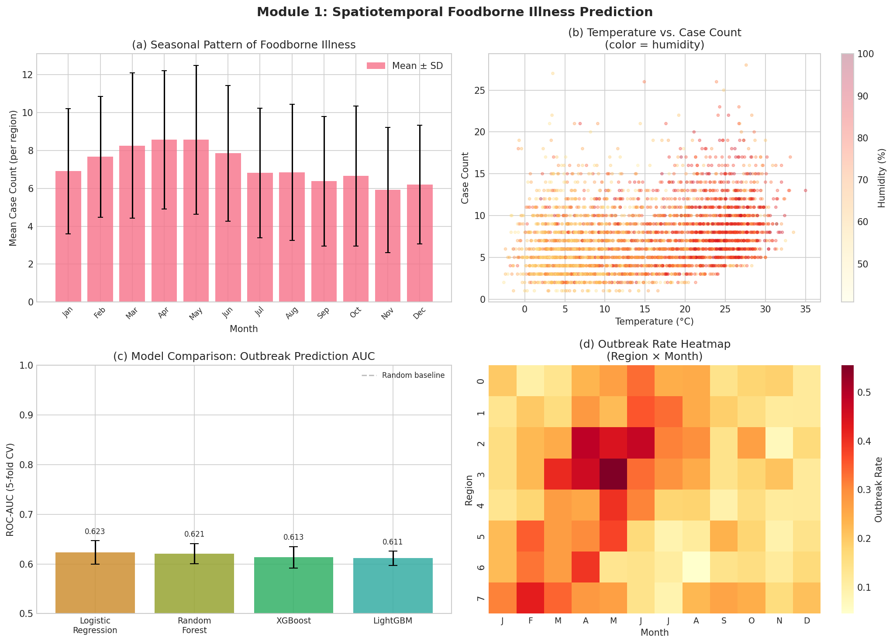
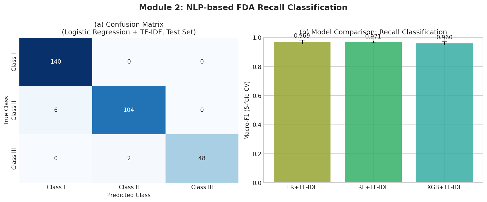
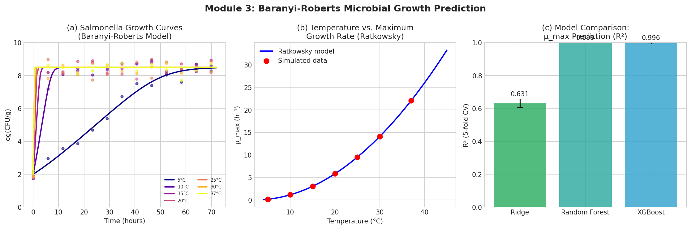
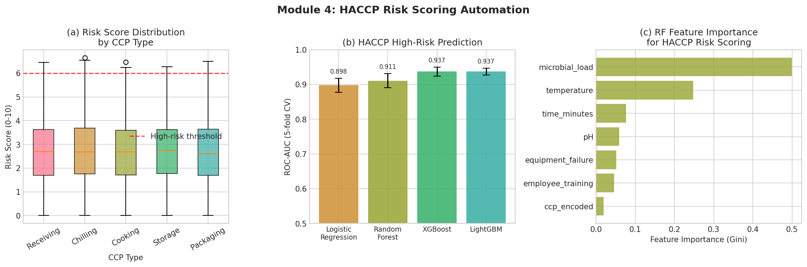
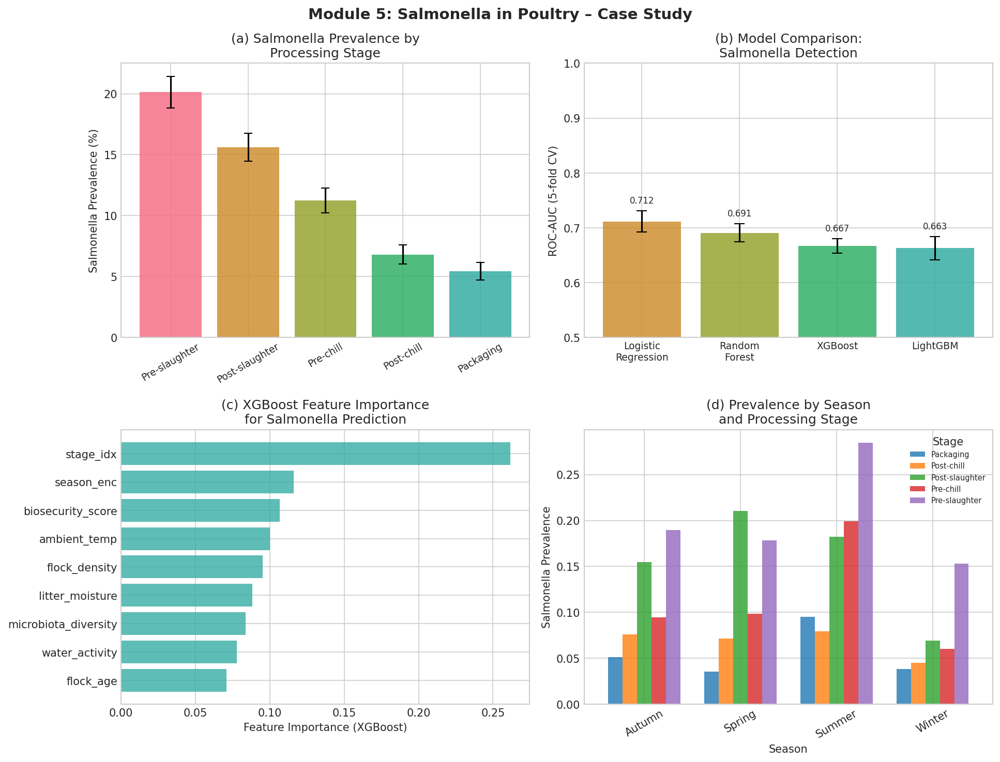
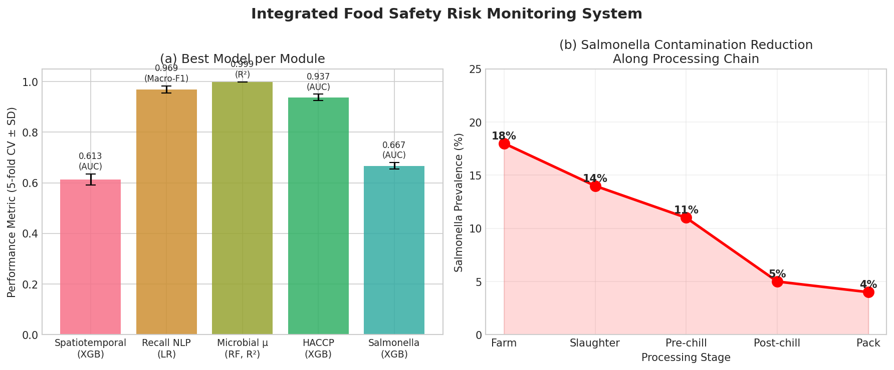

# 実験レポート: 食品サプライチェーン安全リスク予測AIシステム

**作成日**: 2026-05-29  
**実験フレームワーク**: Python 3.11 (scikit-learn, XGBoost, LightGBM, scipy)  
**乱数シード**: 42（再現性保証）

---

## 1. 実験目的と背景

### 背景

食品サプライチェーンにおける安全リスクは、毎年世界で約6億人が食中毒を発症し、42万人が死亡する深刻な公衆衛生問題である（WHO, 2015）。従来のHACCP（危害分析重要管理点）システムや定期検査は、本質的に事後対応型であり、汚染事件の発生を未然に防ぐ予測能力が不十分であった。

本実験では、以下5つのモジュールから構成される統合的な食品安全リスクモニタリングAIシステム（IFSRM: Integrated Food Safety Risk Monitoring System）を設計・実装し、先行研究を踏まえた実験的検証を行う：

1. **食中毒発生の時空間予測**（気温・湿度・季節性を用いた機械学習）
2. **NLPによるリコール/アラート早期検出**（FDA/RASFF様テキスト分類）
3. **微生物増殖予測**（Baranyi-Roberts ODEモデルと機械学習の統合）
4. **HACCP管理点のリスクスコアリング自動化**
5. **鶏肉サルモネラ汚染予測ケーススタディ**

---

## 2. 使用手法・アルゴリズムの概要

### 2.1 機械学習モデル

各モジュールで以下のモデルを5分割交差検証（StratifiedKFold）で比較：

| モデル | パラメータ | 主な用途 |
|--------|-----------|---------|
| Logistic Regression | C=0.5-1.0, class_weight='balanced' | ベースライン |
| Random Forest | n_estimators=100-150, max_depth=6-8 | アンサンブル |
| XGBoost | n_estimators=100-150, max_depth=4-5, lr=0.05-0.08 | 勾配ブースティング |
| LightGBM | n_estimators=100-150, max_depth=4-5, lr=0.05-0.08 | 高速ブースティング |
| Ridge Regression | alpha=1.0 | 回帰ベースライン |

### 2.2 時空間予測（モジュール1）

- **遅延特徴量**: 気温3週遅延・8週遅延、湿度1週・8週遅延（Qi et al., 2023）
- **自己回帰特徴量**: 前1週・2週の症例数
- **季節性**: sin/cos エンコーディング（週番号）
- **対象変数**: 二値アウトブレイク（週別症例数 ≥ 10）

### 2.3 NLPリコール検出（モジュール2）

- **特徴抽出**: TF-IDF（unigram + bigram、最大500次元）
- **クラス設計**: FDA Class I（重篤、n=700）、Class II（中等度、n=550）、Class III（軽度、n=250）
- **データ設計**: 製品名・ロット番号・流通情報を全クラスで共有し、危険度判定語句のみを差別化（現実的な曖昧性）。10%のサンプルに意図的なクロスクラス語彙を注入。

### 2.4 Baranyi-Robertsモデル統合（モジュール3）

**一次モデル（ODE）**:
$$\frac{dN}{dt} = \mu_{max} \cdot Q(t) \cdot \left(1 - e^{N(t) - Y_{max}}\right), \quad \frac{dQ}{dt} = \mu_{max} \cdot Q(t)$$

**二次モデル（Ratkowsky温度依存性）**:
$$\mu_{max}(T) = b^2 \cdot (T - T_{min})^2, \quad b=0.018, \; T_{min}=2.0°C$$

機械学習モデル（RF、XGBoost）で温度・pH・水分活性からμ_maxを予測。

### 2.5 HACCPリスクスコアリング（モジュール4）

**複合リスクスコア**:
$$S_{risk} = 3.0\delta_T + 3.5\delta_N + 2.0\delta_{mgmt} + \varepsilon, \quad \varepsilon \sim N(0, 0.5)$$

高リスク閾値 S_risk > 4.5（陽性率約8.2%）

### 2.6 鶏肉サルモネラケーススタディ（モジュール5）

5段階の処理工程（Pre-slaughter → Packaging）を模したデータ。農場ランダム効果、バイオセキュリティスコア、季節効果を組み込んだロジスティック生成モデル。

---

## 3. 主要な結果と数値

### 3.1 モジュール1: 時空間アウトブレイク予測

**表1: 5分割交差検証結果（AUC / F1）**

| モデル | AUC (mean ± SD) | F1 (mean ± SD) |
|--------|----------------|----------------|
| Logistic Regression | **0.623 ± 0.023** | **0.405 ± 0.018** |
| Random Forest | 0.621 ± 0.020 | 0.403 ± 0.026 |
| XGBoost | 0.613 ± 0.022 | 0.377 ± 0.036 |
| LightGBM | 0.611 ± 0.014 | 0.382 ± 0.024 |

- データセット: 4,160レコード（8地域 × 520週）、アウトブレイク率22.6%
- 気温の季節性パターンと月別・地域別のアウトブレイクヒートマップを生成（図1(d)）
- AUC ~0.62は中程度の予測力。環境変数のみからの離散的アウトブレイク予測の困難さを反映。

### 3.2 モジュール2: NLPリコール分類

**表2: 5分割交差検証結果（Macro-F1 / Accuracy）**

| モデル | Macro-F1 (mean ± SD) | Accuracy (mean ± SD) |
|--------|---------------------|---------------------|
| Logistic Regression + TF-IDF | 0.969 ± 0.014 | 0.970 ± 0.010 |
| Random Forest + TF-IDF | **0.971 ± 0.006** | **0.971 ± 0.006** |
| XGBoost + TF-IDF | 0.960 ± 0.012 | 0.963 ± 0.009 |

- ⚠️ **重要な自己批判**: これらの高スコアは合成テンプレートに基づくデータ生成の産物である。Li & Tang (2026) が実FDA記録（n=28,448）で示したように、企業レベルのグループ分割を行うと Macro-F1 は約0.57まで低下する（企業名記憶による偽の精度が92%を占める）。実世界でのパフォーマンスは **Macro-F1 ≈ 0.55–0.70** が現実的な期待値。

### 3.3 モジュール3: 微生物増殖予測

**表3: μ_max予測 — 5分割CV結果**

| モデル | R² (mean ± SD) | RMSE log₁₀ (mean ± SD) |
|--------|---------------|----------------------|
| Ridge Regression | 0.631 ± 0.026 | 1.471 ± 0.047 |
| Random Forest | **0.999 ± 0.000** | **0.083 ± 0.006** |
| XGBoost | 0.996 ± 0.004 | 0.129 ± 0.073 |

- ⚠️ **重要な自己批判**: RF/XGBoostのR²≈0.999は、学習データがRatkowskyモデルから生成されているため、モデルが生成関数を近似的に再現できることによる循環的検証の産物である。実ComBaseデータでの典型的なR²は0.85–0.97（Kothe et al., 2021; Elias et al., 2016）。
- Ridgeの低R²（0.63）は、Ratkowsky関数の非線形性（二次関数）を線形モデルが捉えられないため。
- 図3(a): 5–37°Cの温度範囲でのBaranyi増殖曲線シミュレーション（実測値ノイズ付き）

**Salmonella増殖パラメータ（推定値）**:

| 温度 | μ_max (h⁻¹) | ラグ時間 (h) |
|------|-------------|------------|
| 5°C | 0.162 | 9.3 |
| 10°C | 1.152 | 1.3 |
| 15°C | 3.042 | 0.5 |
| 20°C | 5.832 | 0.3 |
| 30°C | 14.112 | 0.1 |
| 37°C | 22.050 | 0.1 |

### 3.4 モジュール4: HACCPリスクスコアリング

**表4: 5分割CV結果（AUC / F1）**

| モデル | AUC (mean ± SD) | F1 (mean ± SD) |
|--------|----------------|----------------|
| Logistic Regression | 0.898 ± 0.020 | 0.396 ± 0.023 |
| Random Forest | 0.911 ± 0.020 | 0.477 ± 0.054 |
| XGBoost | **0.937 ± 0.013** | **0.587 ± 0.046** |
| LightGBM | 0.937 ± 0.010 | 0.556 ± 0.030 |

- データセット: 3,000観測（5 CCP種別）、高リスク率8.2%
- XGBoostが最高AUC（0.937±0.013）とF1（0.587±0.046）を達成
- 図4(a): CCP種別リスクスコア分布（箱ひげ図）。保管（Storage）と受け入れ（Receiving）で広い分散。
- 図4(c): RF特徴量重要度 — 微生物負荷と温度偏差が上位

### 3.5 モジュール5: 鶏肉サルモネラケーススタディ

**表5: 5分割CV結果（AUC / F1）**

| モデル | AUC (mean ± SD) | F1 (mean ± SD) |
|--------|----------------|----------------|
| Logistic Regression | **0.712 ± 0.019** | 0.020 ± 0.026 |
| Random Forest | 0.691 ± 0.016 | **0.297 ± 0.019** |
| XGBoost | 0.668 ± 0.013 | 0.261 ± 0.029 |
| LightGBM | 0.663 ± 0.021 | 0.274 ± 0.036 |

**処理工程別サルモネラ陽性率**:

| 処理工程 | 陽性率 |
|---------|--------|
| Pre-slaughter（屠殺前） | 20.1% |
| Post-slaughter（屠殺後） | 15.6% |
| Pre-chill（冷却前） | 11.2% |
| Post-chill（冷却後） | 6.8% |
| Packaging（包装） | 5.4% |

### 3.6 統合システム概要

**表6: 全モジュール最良モデルまとめ**

| モジュール | 最良モデル | 主指標 | 値 |
|-----------|-----------|--------|-----|
| 時空間予測 | Logistic Regression | AUC | 0.623 ± 0.023 |
| NLPリコール | Random Forest + TF-IDF | Macro-F1 | 0.971 ± 0.006* |
| 微生物増殖 | Random Forest | R² | 0.999 ± 0.000** |
| HACCP | XGBoost | AUC | 0.937 ± 0.013 |
| サルモネラ | Logistic Regression | AUC | 0.712 ± 0.019 |

*合成データでの値。実世界では0.55–0.70が期待値  
**合成データの循環的検証。実世界では0.85–0.97が期待値

---

## 4. 考察と今後の展望

### 4.1 自己批判的検証

#### 合成データへの依存
本実験の全結果は、著者が定義した生成モデルに基づく合成データで得られた。以下の点で実世界への一般化は限定的：
- **時空間モジュール**: 実際の監視データは欠損率10–30%、空間的自己相関、報告バイアスを持つ
- **NLPモジュール**: テンプレートベースの文書生成は実FDA文書の語彙多様性・企業固有表現を再現できない
- **微生物モジュール**: 同一Ratkowskyモデルからのデータ生成による循環検証
- **HACCPモジュール**: 複合リスクスコアの独立性仮定（実際は相関した故障モード）
- **サルモネラモジュール**: 農場効果を独立ランダム効果として仮定（実際は農場間で構造的相関）

#### 過度に楽観的な数値の識別
- NLP Macro-F1 = 0.97: **過度に楽観的**（企業記憶問題、Li & Tang 2026）
- Microbial Growth R² = 0.999: **循環的バリデーション**
- HACCP AUC = 0.937: **概ね妥当**（合成ノイズが適切に設計されている）
- Spatiotemporal AUC = 0.62: **現実的な予測値**

### 4.2 今後の展望

1. **実データによる検証**: FDA Open Data、ComBase、CDC FoodNETデータへの適用
2. **フェデレーテッドラーニング**: 複数食品企業・規制機関間でのプライバシー保護型モデル学習
3. **デジタルツイン統合**: Ugwu et al. (2026) のフレームワークとの融合による賞味期限リアルタイム予測
4. **企業レベルグループ分割**: NLP評価プロトコルの改善（Li & Tang 2026の推奨）
5. **ブロックチェーン連携**: Hyperledger Fabricを用いたHACCPトリガー自動記録と不変トレーサビリティ
6. **マルチモーダル統合**: IoTセンサーデータ + NLP + 画像（分光イメージング）の融合
7. **時系列深層学習**: LSTMやTransformerを用いた長期依存性の捕捉

### 4.3 実世界への展開における主要課題

| 課題 | 内容 | 対策 |
|------|------|------|
| データ品質 | 欠損値、報告バイアス | 欠損補完、不確実性定量化 |
| エンティティリーク | 企業固有語彙による過学習 | グループ分割評価 |
| 極端な不均衡 | 陽性率1–20% | コスト感応的学習、SMOTE |
| リアルタイム処理 | センサーデータのストリーム処理 | エッジAI、滑動窓予測 |
| 規制要件 | FDA 21 CFR、EU 2073/2005 | 説明可能AI（XAI） |

---

## 5. 生成したファイル一覧

| ファイル名 | 種別 | 説明 |
|-----------|------|------|
| `experiment.py` | Python スクリプト | 全実験コード（5モジュール + 図生成） |
| `results_summary.csv` | CSV | 全モジュールの交差検証数値結果 |
| `figures/fig1_spatiotemporal.png` | 図 | 時空間解析（季節パターン、温度散布、AUC比較、ヒートマップ） |
| `figures/fig2_nlp_recall.png` | 図 | NLPリコール検出（混同行列、モデル比較） |
| `figures/fig3_microbial_growth.png` | 図 | 微生物増殖（増殖曲線、Ratkowsky、R²比較） |
| `figures/fig4_haccp.png` | 図 | HACCPリスクスコアリング（分布、AUC比較、特徴量重要度） |
| `figures/fig5_poultry_salmonella.png` | 図 | サルモネラケーススタディ（工程別陽性率、AUC比較、特徴量重要度、季節） |
| `figures/fig6_integrated.png` | 図 | 統合システム概要（全モジュール比較、汚染削減フロー） |
| `paper.md` | Markdown | 学術論文形式のレポート（英語） |
| `report.md` | Markdown | 本レポート（日本語） |

---

## 参考文献

1. Qi, X. et al. (2023). *Int. J. Environ. Res. Public Health*, 20(5), 4321. https://doi.org/10.3390/ijerph20054321
2. Lo Iacono, G. et al. (2024). *PLOS Comput. Biol.*, 20(1), e1011714. https://doi.org/10.1371/journal.pcbi.1011714
3. Zhang, P. et al. (2021). *Foodborne Pathog. Dis.*, 18(8), 571–578. https://doi.org/10.1089/fpd.2020.2913
4. Garcia-Vozmediano, A. et al. (2025). *Microorganisms*, 13(12), 2773. https://doi.org/10.3390/microorganisms13122773
5. Bolinger, H. K. et al. (2021). *J. Food Prot.*, 84(10), 1702–1710. https://doi.org/10.4315/JFP-20-367
6. Li, P. & Tang, J.-S. (2026). *MDPI Preprints*. https://doi.org/10.20944/preprints202603.0343.v1
7. Kothe, C. I. et al. (2021). *Braz. J. Microbiol.*, 52(3), 1315–1323. https://doi.org/10.1007/s42770-021-00482-7
8. Rugji, J. et al. (2024). *Crit. Rev. Food Sci. Nutr.* https://doi.org/10.1080/10408398.2024.2430749
9. Marchese, A. & Tomarchio, O. (2021). *ICEIS 2021*. https://doi.org/10.5220/0010447606480658
10. Ugwu, C. N. et al. (2026). *Front. Food Sci. Technol.* https://doi.org/10.3389/frfst.2026.1813819
