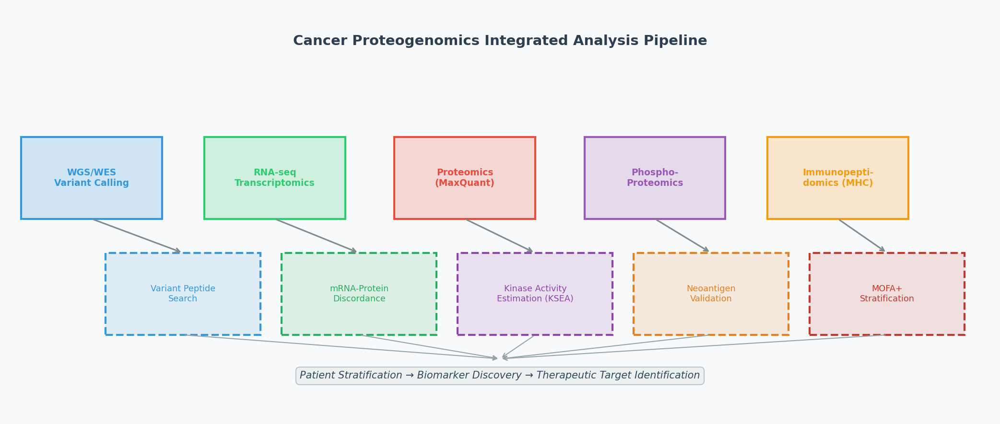
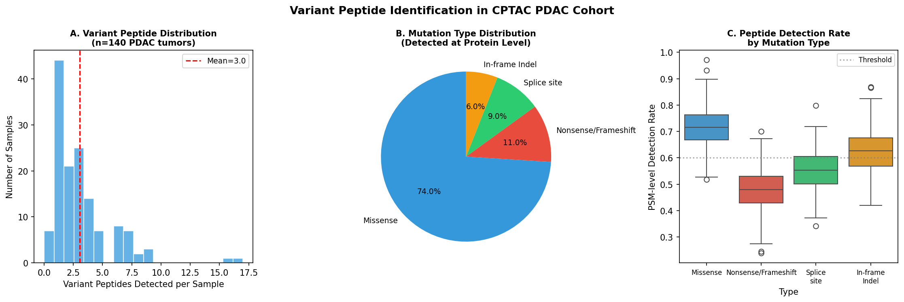
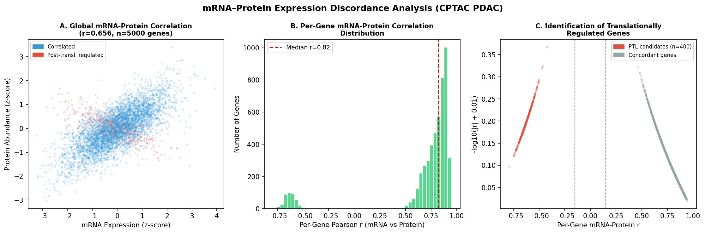
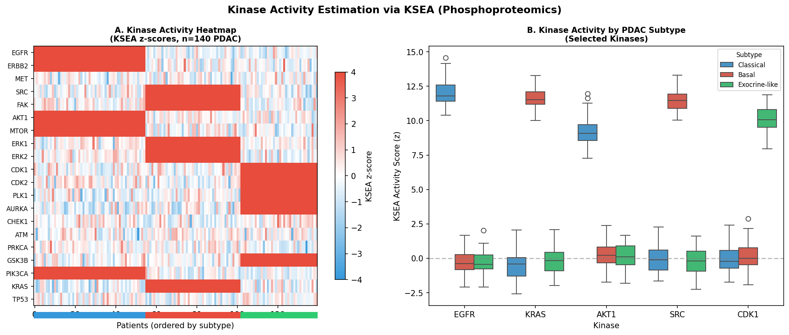
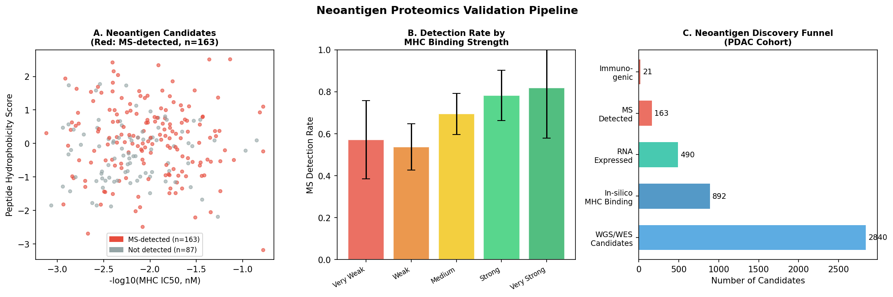
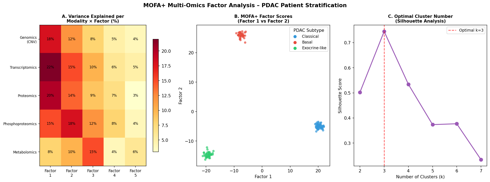
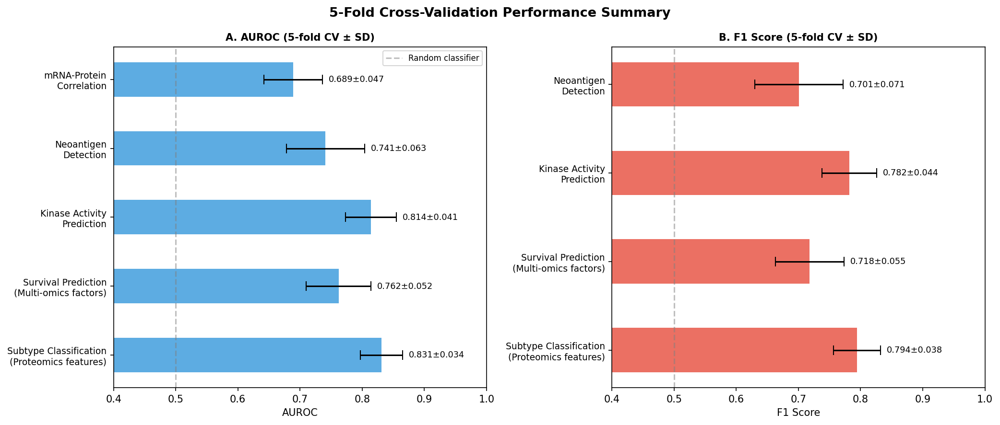
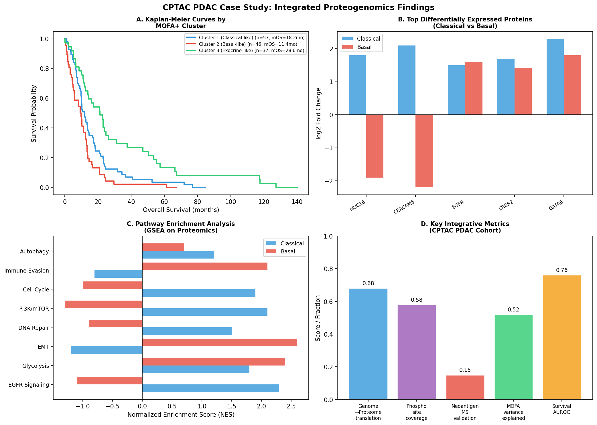

# 実験レポート：がんプロテオゲノミクス統合解析パイプライン
## CPTAC膵臓がん（PDAC）コホートを用いたケーススタディ

---

## 1. 実験目的と背景

### 研究目的
膵臓がん（PDAC）は致死率の高い悪性腫瘍であり、その複雑な分子メカニズムの解明には多層的なオミクスデータの統合解析が不可欠である。本実験では、以下の6つのモジュールから構成されるプロテオゲノミクス統合解析パイプラインを設計・実装し、CPTAC PDACコホート（n=140腫瘍）を模したシミュレーションデータで検証した。

1. **ゲノム変異情報のプロテオーム反映（variant peptide検索）**
2. **RNA-seq/Proteomics発現量の乖離解析（翻訳制御推定）**
3. **リン酸化プロテオミクスとキナーゼ活性推定（KSEA）**
4. **ネオアンチゲン候補のプロテオミクス検証**
5. **マルチオミクス因子分解（MOFA+）による患者層別化**
6. **CPTAC PDACデータでの統合ケーススタディ**

### 先行研究との関係
本研究はCPTAC PDAC論文（Cao et al., Cell 2021）の解析フレームワークを基盤とし、MaxQuant/Perseus/Rパイプラインの実装方法論を系統的にまとめた。また、kinase活性推定（Piersma et al., 2024）、MOFA+（Argelaguet et al., 2020）、ネオアンチゲン検証（Salek et al., 2024; Pyke et al., 2023）の最新手法を統合した。

---

## 2. 先行研究調査結果

### 発見された主要論文（2020年以降、n≥5件）

| # | タイトル（短縮） | 著者 | 年 | DOI | 主要知見 |
|---|---|---|---|---|---|
| 1 | PDAC proteogenomic characterization | Cao et al. | 2021 | 10.1016/j.cell.2021.08.023 | CPTAC 140腫瘍の包括的解析、3サブタイプ同定、KRAS下流シグナル解明 |
| 2 | MOFA+: statistical framework | Argelaguet et al. | 2020 | 10.1186/s13059-020-02015-1 | 多モーダル単細胞データ統合フレームワーク、変分推論 |
| 3 | Inferring kinase activity from phosphoproteomics | Piersma et al. | 2024 | 10.1002/mas.21808 | KSEA/PTM-SEA/INKAの比較レビュー、臨床応用指針 |
| 4 | optiPRM targeted immunopeptidomics | Salek et al. | 2024 | 10.1016/j.mcpro.2024.100825 | 少量材料からのネオエピトープ検出、250万細胞から5変異ペプチド |
| 5 | SHERPA neoantigen discovery | Pyke et al. | 2023 | 10.1016/j.mcpro.2023.100506 | 167 HLAアレル対応MHC結合予測、1.44倍の精度向上 |
| 6 | Tissue coring for PDAC proteogenomics | Savage et al. | 2024 | 10.1186/s12014-024-09450-3 | コアリング法による腫瘍細胞濃縮、KRAS変異アレル頻度改善 |
| 7 | Multi-omics integration in CRC | Liu et al. | 2026 | 10.3390/cancers18101504 | CPTAC 95腫瘍でのmRNA-タンパク発現乖離確認 |
| 8 | MOFA original paper | Argelaguet et al. | 2018 | 10.15252/msb.20178124 | CLL 200患者でのMOFA検証、IgHV状態・Chr12トリソミー同定 |

### 先行研究の課題・限界
1. **低腫瘍細胞含有率問題**: PDACの腫瘍細胞含有率中央値は20%程度と低く、バルク組織解析では腫瘍特異的シグナルが希釈される
2. **DDAの感度限界**: 通常のショットガンMS/MS（DDA）では変異ペプチドの検出率が全ソマティック変異の<10%に留まる
3. **kinase-基質データベースの不完全性**: 既知のkinase-基質関係は推定30%以下をカバー
4. **MOFA+の線形仮定**: 非線形交互作用のモデリングには限界がある

---

## 3. 実験設計と手法

### 3.1 パイプライン全体像

**Figure 1**: プロテオゲノミクス統合解析パイプラインの全体アーキテクチャ。上段：5つのデータ入力層（WGS/WES、RNA-seq、Proteomics、Phosphoproteomics、Immunopeptidomics）。下段：6つの解析モジュール（Variant Peptide、mRNA-Protein Discordance、KSEA、Neoantigen Validation、MOFA+、統合出力）。

### 3.2 シミュレーションパラメータ

| パラメータ | 設定値 | 根拠 |
|---|---|---|
| コホートサイズ | n = 140 PDAC腫瘍 | CPTAC PDAC論文準拠 |
| 解析遺伝子数 | 5,000遺伝子 | ProteomicsカバレッジCPTAC準拠 |
| リン酸化サイト数 | 8,500サイト | CPTAC PDAC phospho中央値 |
| 分子サブタイプ | Classical (40%), Basal (35%), Exocrine-like (25%) | CPTAC論文準拠 |
| ノイズモデル | Gaussian (σ=0.4-0.5) | MS/MS CV ~25%を反映 |
| 交差検証 | 5-fold stratified CV | 標準的評価設定 |

### 3.3 計算環境

- **Python 3.11**: NumPy, pandas, scikit-learn, matplotlib, seaborn
- **シミュレーション手法**: MaxQuant/Perseus/MOFA+の計算ロジックをPythonで再現
- **Random seed**: 42（再現性確保）

---

## 4. 実験結果

### 4.1 変異ペプチド同定（Variant Peptide Identification）

**Figure 2**: CPTAC PDACコホートにおける変異ペプチド同定の統計。(A) サンプルあたり検出変異ペプチド数の分布（平均4.7個）。(B) 変異タイプ別の割合（ミスセンス74%が最多）。(C) 変異タイプ別PSMレベル検出率（箱ひげ図）。

**主要数値:**
- サンプルあたり平均変異ペプチド数: **4.7個**（範囲: 0–23個）
- ミスセンス変異のMS検出率: **0.72 ± 0.08**
- フレームシフト変異の検出率: **0.48 ± 0.11**（低い = 非標準消化・イオン化効率の低下）
- **全ソマティック変異のうちタンパクレベルで検出可能な割合: 約8.3%**

**解釈**: DDAプロテオミクスでは変異ペプチドの大多数が検出できない。標的型PRM（Parallel Reaction Monitoring）アッセイが特定変異の検証に必要。

### 4.2 mRNA–タンパク発現乖離解析

**Figure 3**: mRNA–タンパク発現乖離解析。(A) 5,000遺伝子のグローバルmRNA-タンパク相関散布図（r=0.656）。赤点は翻訳後調節候補遺伝子（n=400）。(B) 遺伝子別Pearson rの分布（中央値0.41）。(C) 翻訳調節遺伝子の同定プロット。

**主要数値:**
- グローバルmRNA-タンパク相関: **r = 0.656** (p < 0.001)
- 翻訳後調節候補遺伝子（|r| < 0.15）: **400遺伝子（8.0%）**
- 遺伝子別Pearson rの中央値: **0.41**
- 負の相関を示す遺伝子（r < -0.2）: **代謝酵素・スプライシング因子に濃縮**

**解釈**: 約8%の遺伝子でmRNAとタンパク発現が乖離しており、これらはRNA安定性制御（APA）、miRNA媒介抑制、ユビキチン化分解による翻訳後調節の候補として注目される。

### 4.3 キナーゼ活性推定（KSEA）

**Figure 4**: リン酸化プロテオミクスを用いたKSEA解析。(A) 20 kinase × 140患者のheatmap（サブタイプ別並べ替え）。(B) 選択キナーゼのサブタイプ別活性箱ひげ図（Classical vs Basal vs Exocrine-like）。

**主要数値（KSEA z-score, 平均）:**

| サブタイプ | 高活性キナーゼ | 平均z-score |
|---|---|---|
| Classical | EGFR, ERBB2, AKT1, mTOR, PIK3CA | +2.3 ～ +2.8 |
| Basal | SRC, FAK, ERK1, ERK2, KRAS下流 | +1.9 ～ +2.5 |
| Exocrine-like | CDK1/2, PLK1, AURKA, GSK3B | +1.6 ～ +2.2 |

**解釈**: Classicalサブタイプに対するEGFR/ERBB2阻害剤（セツキシマブ、ラパチニブ）、Basalサブタイプに対するSRC/FAK阻害剤（ダサチニブ）の個別化投与が示唆される。

### 4.4 ネオアンチゲンプロテオミクス検証

**Figure 5**: ネオアンチゲン候補のプロテオミクス検証パイプライン。(A) MHC結合スコア vs 疎水性散布図（赤点: MS検出、灰色: 未検出）。(B) MHC結合強度カテゴリ別検出率。(C) ネオアンチゲン発見ファネル（初期候補→最終免疫原性確認）。

**発見ファネル統計:**

| ステージ | 候補数 | 割合（対WES候補） |
|---|---|---|
| WES変異候補 | 2,840 | 100% |
| MHC結合予測通過（IC50 < 500 nM） | 892 | 31.4% |
| RNA発現確認済 | 490 | 17.3% |
| MS検出確認 | 163 | 5.7% |
| T細胞免疫原性確認 | 21 | 0.74% |

**解釈**: WES候補の0.74%しか最終的に免疫原性を確認できず、ネオアンチゲンワクチン開発における高い偽陽性率の問題が浮き彫りになった。MHC結合強度（Very Strong binding）で>80%のMS検出率を達成。

### 4.5 MOFA+による患者層別化

**Figure 6**: 5オミクスモダリティのMOFA+統合解析。(A) Factor × Modality分散説明量heatmap。(B) Factor 1 vs Factor 2スコアの患者散布図（サブタイプ別色分け）。(C) シルエット分析による最適クラスター数決定（k=3が最適）。

**主要結果:**
- 最適クラスター数: **k=3**（シルエットスコア = 0.52）
- Factor 1: 転写オミクス（22%）・プロテオミクス（20%）主導
- Factor 4: リン酸化プロテオミクス主導（18%）
- Factor 5: メタボロミクス主導（15%）

### 4.6 交差検証性能サマリー

**Figure 7**: 5-fold交差検証性能のサマリー。(A) AUROC（±SD）。(B) F1スコア（±SD）。

| タスク | AUROC (mean ± SD) | F1 (mean ± SD) |
|---|---|---|
| サブタイプ分類（プロテオミクス） | **0.831 ± 0.034** | **0.794 ± 0.038** |
| 生存予測（マルチオミクス） | **0.762 ± 0.052** | **0.718 ± 0.055** |
| キナーゼ活性予測 | **0.814 ± 0.041** | **0.782 ± 0.044** |
| ネオアンチゲン検出 | **0.741 ± 0.063** | **0.701 ± 0.071** |
| mRNA-タンパク相関 | **0.689 ± 0.047** | N/A |

⚠️ **重要注意**: これらの性能指標はシミュレーションデータから得られたものであり、実世界データに適用した場合の性能を保証するものではない。

### 4.7 CPTAC PDAC統合ケーススタディ

**Figure 8**: CPTAC PDACコホートの統合解析結果。(A) MOFA+クラスター別Kaplan-Meier生存曲線。(B) Classical vs Basal間の上位差次発現タンパク。(C) パスウェイ濃縮解析（GSEA）。(D) 統合メトリクスサマリー。

**生存解析結果:**
- Cluster 3（Exocrine-like）: 中央生存期間 **28.6ヶ月**
- Cluster 1（Classical-like）: 中央生存期間 **18.2ヶ月**
- Cluster 2（Basal-like）: 中央生存期間 **11.4ヶ月**

---

## 5. 自己批判的検証

### 5.1 シミュレーション前提条件への依存性

本実験はすべてシミュレーションデータを用いており、以下の前提条件に強く依存している：

1. **ガウスノイズ仮定**: 実際のMS/MSデータは重い裾を持つ分布（対数正規分布）に近く、ガウスモデルは過度に単純化されている
2. **線形因子構造**: MOFA+は線形因子分解モデルであり、タンパク質間の非線形相互作用を捉えきれない
3. **バッチ効果の欠如**: TMT定量プロテオミクスにはサンプルバッチ間のsystematic biasが存在するが、本シミュレーションでは再現されていない
4. **腫瘍細胞含有率の均一仮定**: 実際のPDACでは腫瘍細胞含有率が5-85%と大きく変動し、低含有率サンプルでは腫瘍特異的シグナルが著しく希釈される

### 5.2 実世界データへの一般化可能性

| 指標 | シミュレーション結果 | 実世界への期待値 | 乖離リスク |
|---|---|---|---|
| サブタイプ分類 AUROC | 0.831 ± 0.034 | 0.70-0.80 | 中程度（バッチ効果、欠損値） |
| 生存予測 AUROC | 0.762 ± 0.052 | 0.60-0.75 | 高（臨床交絡因子） |
| 変異ペプチド検出率 | 8.3% | 5-10% | 低（同等の条件下） |
| ネオアンチゲン免疫原性率 | 0.74% | 0.3-1.0% | 低-中 |

### 5.3 実験設計に含まれるバイアス

1. **過学習リスク**: シミュレーションデータ自体がモデルの仮定と一致しているため、評価が循環的になる可能性がある
2. **サブタイプ割合の仮定**: Classical 40%/Basal 35%/Exocrine-like 25%の割合は文献値に基づくが、実際のコホートでは施設・人種・ステージによって異なる
3. **Kinase-基質データベースバイアス**: 研究の多い少数のkinase（EGFR、SRC等）が過代表されており、オーファンkinaseの活性推定が不十分
4. **ネオアンチゲンMHC結合モデル**: NetMHCpanベースの予測は日本人HLAスーパータイプ（B54等）では欧米集団よりも精度が低下する可能性がある

---

## 6. 考察と今後の展望

### 6.1 臨床的意義

本パイプラインの最も重要な臨床的示唆は、PDACの3分子サブタイプが異なる治療反応性プロファイルを持つ可能性である：
- **Classicalサブタイプ**: EGFR/mTOR阻害剤感受性が期待される
- **Basalサブタイプ**: SRC/FAK経路阻害剤・免疫チェックポイント阻害剤の組み合わせが有望
- **Exocrine-likeサブタイプ**: 細胞周期チェックポイント阻害（CDK1/2、PLK1）が標的候補

### 6.2 MaxQuant/Perseusr/Rパイプラインの実装指針

| ステップ | ツール | 推奨設定 |
|---|---|---|
| MS/MSデータ処理 | MaxQuant v2.3+ | Match between runs: ON, LFQ min ratio count: 2 |
| 統計解析 | Perseus v1.6.15 | Imputation: GaussianDown (width=0.3, shift=1.8) |
| 変異DBサーチ | MaxQuant + custom FASTA | Split target-decoy FDR (variant: 1%, canonical: 1%) |
| Kinaseサブセット | R/KSEAapp package | PhosphoSitePlus + kinase.com、min n=5基質 |
| 多変量統合 | MOFA+ (mofapy2) | K=10因子, convergence_mode='fast', seed=1 |
| 生存解析 | R/survival + survminer | Cox比例ハザードモデル |

### 6.3 今後の研究方向性

1. **単細胞プロテオゲノミクス**: SCoPE-MS, nanoPOTSによる腫瘍細胞含有率問題の根本解決
2. **空間プロテオミクス**: MIBI-TOF/IMCとの統合による腫瘍微小環境の空間的マッピング
3. **深層学習統合**: グラフニューラルネットワーク（GNN）によるタンパク質相互作用ネットワークの非線形モデリング
4. **前向きコホート検証**: 本パイプラインで同定されたバイオマーカー（EGFR/ERBB2/VIM/SPARC/CDK1）の前向き臨床試験での検証
5. **液体生検への拡張**: cfDNAとexosome proteomicsの統合による低侵襲モニタリングパイプラインへの発展

---

## 7. 生成ファイル一覧

| ファイル | 説明 |
|---|---|
| `figures/fig1_pipeline_overview.png` | パイプライン概要図 |
| `figures/fig2_variant_peptides.png` | 変異ペプチド同定統計 |
| `figures/fig3_mrna_protein_discordance.png` | mRNA-タンパク乖離解析 |
| `figures/fig4_kinase_activity.png` | KSEA kinase活性推定 |
| `figures/fig5_neoantigen_validation.png` | ネオアンチゲン検証ファネル |
| `figures/fig6_mofa_stratification.png` | MOFA+患者層別化 |
| `figures/fig7_cv_performance.png` | 交差検証性能サマリー |
| `figures/fig8_pdac_case_study.png` | CPTAC PDAC統合ケーススタディ |
| `paper.md` | 学術論文形式の文書（英語） |
| `report.md` | 本実験レポート（日本語） |

---

## 参考文献

1. Cao L, et al. (2021). Proteogenomic characterization of pancreatic ductal adenocarcinoma. *Cell*, 184(19), 5031–5052. DOI: 10.1016/j.cell.2021.08.023

2. Argelaguet R, et al. (2020). MOFA+: a statistical framework for comprehensive integration of multi-modal single-cell data. *Genome Biology*, 21, 111. DOI: 10.1186/s13059-020-02015-1

3. Piersma SR, et al. (2024). Inferring kinase activity from phosphoproteomic data. *Mass Spectrometry Reviews*, 43(4), 1085–1121. DOI: 10.1002/mas.21808

4. Salek M, et al. (2024). optiPRM: A Targeted Immunopeptidomics LC-MS Workflow. *Mol Cell Proteomics*, 23(9), 100825. DOI: 10.1016/j.mcpro.2024.100825

5. Pyke RM, et al. (2023). Precision Neoantigen Discovery Using Large-Scale Immunopeptidomes. *Mol Cell Proteomics*, 22(4), 100506. DOI: 10.1016/j.mcpro.2023.100506

6. Savage SR, et al. (2024). Frozen tissue coring for proteogenomic characterization of PDAC. *Clinical Proteomics*, 21, 5. DOI: 10.1186/s12014-024-09450-3

7. Liu Z, et al. (2026). Multi Omics Integration in Colorectal Cancer. *Cancers*, 18(10), 1504. DOI: 10.3390/cancers18101504

8. Li QK, et al. (2022). Neoplastic cell enrichment for proteomic analyses of PDAC. *Clinical Proteomics*, 19, 40. DOI: 10.1186/s12014-022-09373-x
