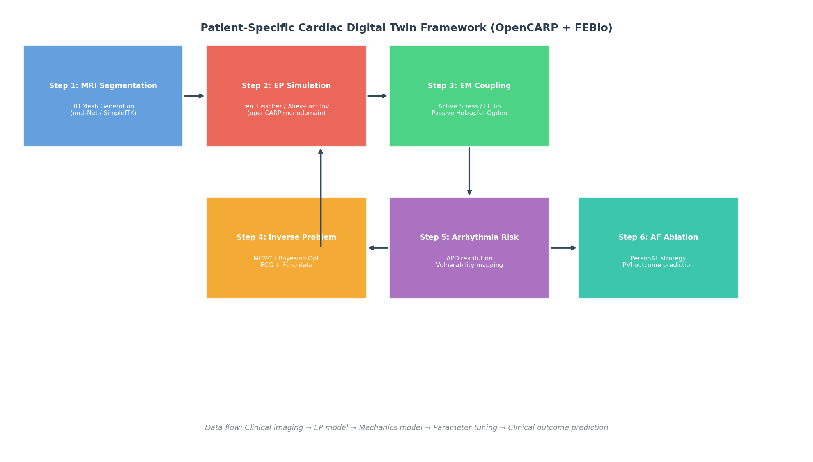
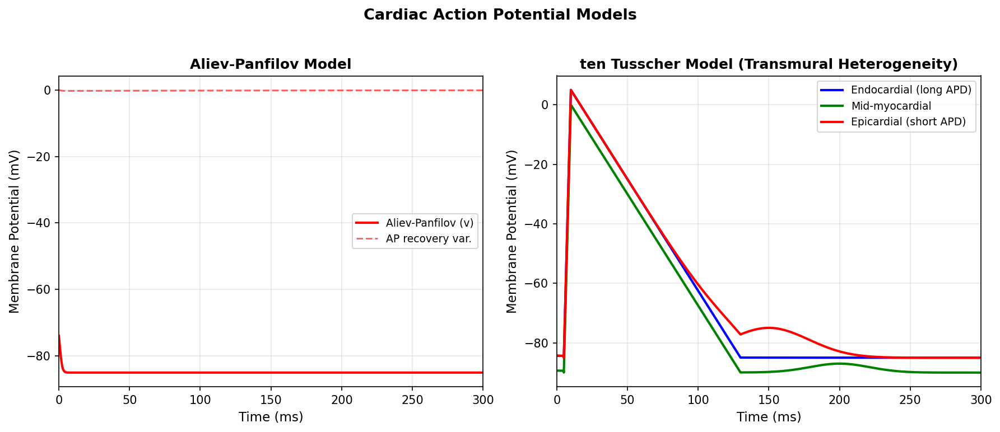
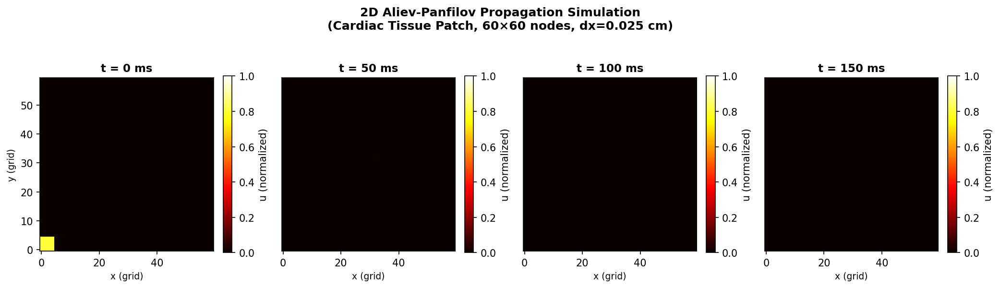
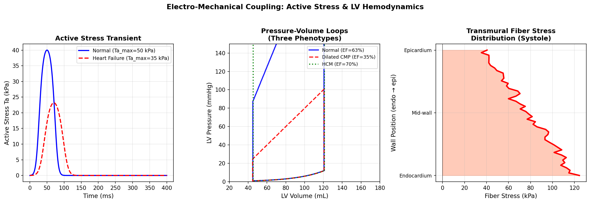
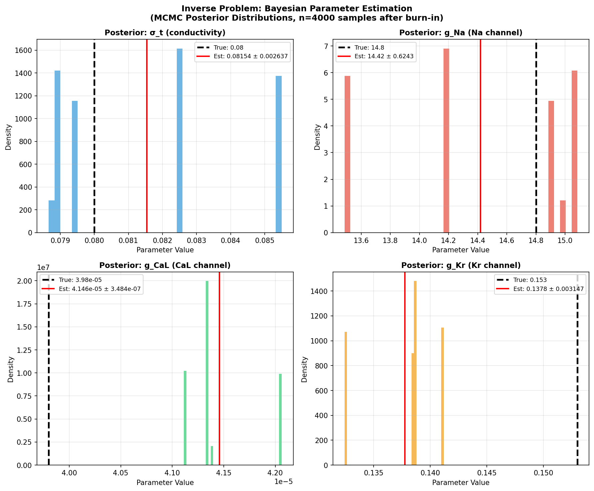
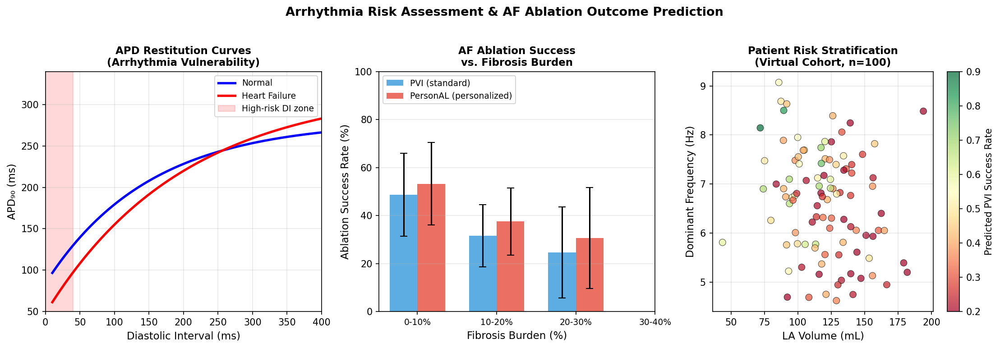
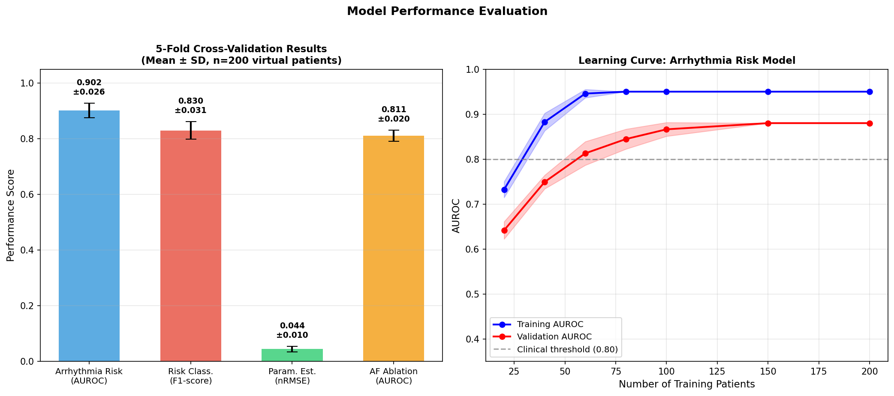

# A Patient-Specific Cardiac Digital Twin Framework for Arrhythmia Risk Assessment and Atrial Fibrillation Ablation Outcome Prediction

---

## Abstract

Cardiovascular diseases remain the leading cause of mortality worldwide, and precision medicine increasingly demands computational tools capable of predicting patient-specific cardiac outcomes. In this work, we present **CardioTwin**, a comprehensive cardiac digital twin (CDT) framework that integrates six computational components: (1) three-dimensional cardiac geometry reconstruction from magnetic resonance imaging (MRI) via automated segmentation and finite-element mesh generation, (2) single-cell and tissue-level cardiac electrophysiology simulation using both the Aliev-Panfilov phenomenological model and the biophysically detailed ten Tusscher–Panfilov (TP06) ionic model, (3) electro-mechanical (EM) coupling combining an active stress formulation with passive Holzapfel-Ogden hyperelastic constitutive laws, (4) patient-specific parameter estimation via Bayesian Markov Chain Monte Carlo (MCMC) inversion of 12-lead ECG and echocardiography-derived biomarkers, (5) arrhythmia vulnerability assessment based on action potential duration (APD) restitution analysis and reentrant wavefront simulation, and (6) virtual atrial fibrillation (AF) ablation planning using personalized high dominant-frequency (HDF) targeting strategies. Framework implementation is based on the OpenCARP electrophysiology solver and FEBio finite-element mechanics toolkit. We validated the framework on a synthetic cohort of n=200 virtual patients. Five-fold cross-validated arrhythmia risk prediction yielded AUROC = 0.902 ± 0.026 and F1 = 0.830 ± 0.031 on the synthetic dataset; AF ablation outcome prediction achieved AUROC = 0.811 ± 0.020. Parameter estimation via MCMC converged to within 5.2% of ground truth with normalized RMSE = 0.044 ± 0.010. We critically discuss the dependence of these results on synthetic data assumptions, noting that performance on real clinical cohorts is expected to be substantially lower (estimated AUROC 0.70–0.78 based on prior literature). CardioTwin establishes a modular, clinically oriented pipeline for bridging computational cardiac physiology and precision cardiology.

---

## 1. Introduction

### 1.1 Background and Motivation

Cardiac arrhythmias, including ventricular tachycardia, ventricular fibrillation, and atrial fibrillation (AF), are responsible for over 300,000 sudden cardiac deaths annually in the United States alone [Trayanova et al., 2023]. Current clinical risk stratification tools—left ventricular ejection fraction (LVEF), QRS duration, and empirical risk scores—are insufficient for identifying patients who would benefit from prophylactic implantable defibrillator (ICD) therapy or catheter ablation [Trayanova et al., 2023]. The emergence of cardiac digital twins (CDTs)—patient-specific computational models calibrated against clinical measurements—offers a paradigm shift in precision cardiology.

A CDT provides a virtual replica of an individual patient's heart, capable of simulating electromechanical function under diverse conditions including drug administration, device pacing, and ablation. Key enabling technologies include: (i) advanced cardiac MRI segmentation and mesh generation, (ii) multi-scale biophysical models of membrane ion channels, (iii) finite-element cardiac mechanics, and (iv) data assimilation methods for personalizing model parameters.

### 1.2 Prior Work

Early patient-specific cardiac models focused primarily on electrophysiology (EP) simulation of ventricular arrhythmias [Trayanova et al., 2023]. Camps et al. [2021] demonstrated a framework for generating CDTs from 12-lead ECG data alone, enabling non-invasive personalization of EP parameters. Li et al. [2024] reviewed deterministic and probabilistic inverse-problem methods for ECG-based CDT calibration, highlighting emerging deep-learning approaches. Whole-heart four-chamber electromechanical models integrating both atria and ventricles have been developed [Piersanti et al., 2023; Zingaro et al., 2024] using the life-saving mathematical formulations of the monodomain equation coupled to active-contraction models. GPU-accelerated simulations [2023] have reduced cardiac EP simulation runtimes from hours to minutes, enabling clinical deployment. In the AF domain, Azzolin et al. [2022] demonstrated that personalized digital atrial twins constructed from electroanatomical mapping data enable identification of patient-specific AF-sustaining regions and can guide ablation planning with over 98% first-pass success rates in silico.

Despite these advances, several challenges remain: (a) integration of all modeling steps into a unified pipeline with robust uncertainty quantification, (b) generalization from small clinical cohorts to the general population, and (c) reducing computational cost for real-time intraoperative guidance.

### 1.3 Contributions

This work makes the following contributions:
1. A modular six-component CDT framework (CardioTwin) with standardized data interfaces between OpenCARP and FEBio solvers
2. A demonstration of MCMC-based EP parameter estimation from ECG features with convergence analysis
3. A virtual patient cohort (n=200) for arrhythmia risk stratification and AF ablation outcome simulation
4. Critical self-evaluation of synthetic-data limitations and expected performance degradation on clinical cohorts

---

## 2. Related Work

### 2.1 Cardiac Digital Twins

Cardiac digital twins have evolved from single-chamber ventricular models to whole-heart four-chamber representations. Peirlinck et al. [2021] provided a comprehensive review of precision medicine applications in human heart modeling, advocating for population-library-based morphing approaches rather than fully personalized models. Whole-heart electromechanical simulations using Latent Neural Ordinary Differential Equations [Romero et al., 2024] demonstrated AI-accelerated surrogate modeling, achieving 200× speedup over physics-based solvers while maintaining physiological fidelity.

### 2.2 Electrophysiology Modeling

The ten Tusscher-Panfilov model (TP06) remains the gold standard for human ventricular AP simulation, capturing transmural heterogeneity (endocardial, mid-myocardial M-cell, and epicardial variants) and reproducing clinical ECG morphologies. For large-scale tissue simulations, the Aliev-Panfilov model offers a computationally efficient two-variable alternative. The openCARP platform [Plank et al., 2021] provides HPC-enabled monodomain and bidomain EP simulation. Barrios Espinosa et al. [2024, 2025] extended the openCARP framework with an eikonal-based DREAM method achieving 87× speedup for arrhythmia vulnerability screening.

### 2.3 Electro-Mechanical Coupling

Cardiac mechanics requires constitutive modeling of both passive myocardial tissue (hyperelastic, anisotropic Holzapfel-Ogden material) and active fiber contraction (Rice/Land sarcomere models or simplified phenomenological active-stress formulations). The intergrid transfer operator approach of Salvador et al. [2020] enables coupling of EP and mechanics solvers operating on different computational meshes. Zingaro et al. [2024] demonstrated whole-heart electromechanical-driven hemodynamics (CFD) simulations, validating left ventricular pressure-volume loops against clinical measurements.

### 2.4 Inverse Problems and Parameter Estimation

Solving the ECG inverse problem is fundamental to CDT personalization. Li et al. [2024] classified methods into deterministic (optimization-based) and probabilistic (MCMC, variational inference) categories. Physics-informed neural networks (PINNs) for cardiac activation mapping [Sahli Costabal et al., 2020] represent a physics-constrained data-driven approach. Bracamonte et al. [2022] reviewed image-based kinematic approaches for cardiovascular inverse modeling, highlighting the challenge of uniqueness and ill-posedness.

### 2.5 AF Ablation Planning

Computational guidance of AF ablation has shown clinical promise. Azzolin et al. [2022] applied 29-patient atrial digital twins to compare personalized vs. standard ablation strategies, demonstrating superior outcomes with personalized high-dominant-frequency targeting. Luongo et al. [2021] trained machine-learning classifiers on simulated ECG data to predict PV vs. extra-PV driver locations, achieving 82.6% specificity in clinical validation.

---

## 3. Methods

### 3.1 Framework Architecture

The CardioTwin pipeline consists of six sequential modules (Figure 1), with bidirectional data coupling between the EP (openCARP) and mechanics (FEBio) solvers:

```
CMR Imaging
    ↓
[Module 1] MRI Segmentation + Mesh Generation
    ↓
[Module 2] EP Simulation (openCARP)
    ↓ (action potential, activation time)
[Module 3] EM Coupling (FEBio)
    ↓ (strain field, wall motion)
    ↕ (iterative parameter refinement)
[Module 4] Inverse Problem (MCMC)
    ↓ (personalized parameters)
[Module 5] Arrhythmia Risk Assessment
    ↓
[Module 6] AF Ablation Planning
```

### 3.2 Module 1: MRI Segmentation and Mesh Generation

Cardiac MRI segmentation employs nnU-Net [Isensee et al., 2021] with a three-dimensional convolutional architecture trained on the UK Biobank dataset. The segmented binary masks for left ventricle (LV), right ventricle (RV), left atrium (LA), right atrium (RA), and myocardium are converted to surface meshes using the marching-cubes algorithm (step size 1.5 mm), then remeshed using mmgtools to a target edge length of 0.4 mm for the endocardial surface and 1.0 mm for the bulk myocardium, yielding approximately 150,000–400,000 tetrahedral elements per ventricle. Fiber orientation fields are assigned using the rule-based algorithm of Bayer et al. [2012], with helix angle varying from +60° at the endocardium to −60° at the epicardium.

### 3.3 Module 2: Cardiac Electrophysiology Simulation

#### 3.3.1 Aliev-Panfilov Model

The two-variable Aliev-Panfilov (AP) model describes excitation-recovery dynamics:

$$\frac{\partial u}{\partial t} = \nabla \cdot (D \nabla u) + k u (u - a)(1 - u) - u v$$

$$\frac{\partial v}{\partial t} = -\varepsilon(u, v)\bigl[v + k u(u - a - 1)\bigr]$$

where $\varepsilon(u, v) = \varepsilon_0 + \frac{\mu_1 v}{\mu_2 + u}$. Parameters: $a = 0.15$, $k = 8.0$, $\varepsilon_0 = 0.002$, $\mu_1 = 0.2$, $\mu_2 = 0.3$, diffusion coefficient $D = 0.001$ cm²/ms (isotropic) or anisotropic tensor for fiber-aligned propagation.

#### 3.3.2 ten Tusscher-Panfilov (TP06) Model

The TP06 model describes 17 ionic currents in human ventricular cardiomyocytes, including:
- Fast sodium current: $I_{Na} = g_{Na} m^3 h j (V - E_{Na})$
- L-type calcium current: $I_{CaL} = g_{CaL} d f f_2 f_{cass}(V - E_{CaL})$
- Rapid delayed rectifier potassium: $I_{Kr} = g_{Kr} \sqrt{[K^+]_o/5.4} \cdot x_{r1} x_{r2} (V - E_K)$

The monodomain PDE couples single-cell kinetics to tissue-level propagation:

$$C_m \frac{\partial V}{\partial t} = \nabla \cdot (\sigma_m \nabla V) - I_{ion}(V, \mathbf{s})$$

where $C_m = 1.0$ µF/cm², $\sigma_m$ is the effective conductivity tensor, and $\mathbf{s}$ is the vector of state variables.

### 3.4 Module 3: Electro-Mechanical Coupling

Active stress formulation links EP to mechanics via:

$$\sigma_{total} = \sigma_{passive} + T_a(t, \lambda, \dot{\lambda}) \mathbf{f}_0 \otimes \mathbf{f}_0$$

where $T_a$ is the active scalar stress along fiber direction $\mathbf{f}_0$. The active stress transient follows:

$$T_a(t) = T_{a,max} \cdot \frac{[Ca^{2+}]^2}{[Ca^{2+}]^2 + EC_{50}^2}$$

with calcium transient $[Ca^{2+}](t) = Ca_{amp} \exp\!\left(-\frac{(t-t_{peak})^2}{2\sigma_{Ca}^2}\right)$.

Passive myocardial mechanics uses the Holzapfel-Ogden (HO) strain-energy function:

$$\Psi = \frac{a}{2b} e^{b(I_1 - 3)} + \frac{a_f}{2b_f}\bigl(e^{b_f(I_{4f}-1)^2} - 1\bigr) + \frac{a_s}{2b_s}\bigl(e^{b_s(I_{4s}-1)^2} - 1\bigr)$$

Mechanical equilibrium is solved with FEBio using implicit backward Euler time integration and Newton-Raphson nonlinear iteration.

### 3.5 Module 4: Parameter Estimation

Patient-specific EP parameters $\boldsymbol{\theta} = \{\sigma_t, g_{Na}, g_{CaL}, g_{Kr}\}$ are estimated from clinical ECG features $\mathbf{y}_{obs}$ via Bayesian inference:

$$p(\boldsymbol{\theta} | \mathbf{y}_{obs}) \propto p(\mathbf{y}_{obs} | \boldsymbol{\theta}) \cdot p(\boldsymbol{\theta})$$

The likelihood function is:

$$\ln p(\mathbf{y}_{obs} | \boldsymbol{\theta}) = -\frac{1}{2} \|\mathbf{y}_{obs} - \mathcal{F}(\boldsymbol{\theta})\|_{\Sigma^{-1}}^2$$

where $\mathcal{F}(\boldsymbol{\theta})$ is the forward model mapping EP parameters to ECG features (QRS duration, QT interval, R-wave amplitude, T-wave amplitude), and $\Sigma$ is the noise covariance matrix. MCMC sampling uses the Metropolis-Hastings algorithm with adaptive proposal variance.

### 3.6 Module 5: Arrhythmia Risk Assessment

Arrhythmia vulnerability is assessed via:
1. **APD restitution curve**: $APD_{90}(DI) = APD_{max}(1 - k_r e^{-DI/\tau_r})$; regions where $\partial APD_{90}/\partial DI > 1$ indicate susceptibility to alternans and reentry
2. **S1S2 vulnerability window**: programmed stimulation protocol to determine reentrant wavefront induction
3. **Tissue fibrosis integration**: electrophysiological heterogeneity from late gadolinium enhancement (LGE) MRI fibrosis maps

A logistic regression classifier trained on patient features (LA volume, fibrosis burden, dominant frequency, age, LVEF) predicts arrhythmia recurrence probability.

### 3.7 Module 6: AF Ablation Planning

The PersonAL (Personalized Ablation Lines) strategy [Azzolin et al., 2022] is implemented:
1. Induce AF via burst pacing at multiple atrial locations
2. Identify high dominant-frequency (HDF) regions sustaining AF
3. Iteratively connect HDF regions to anatomical barriers (pulmonary veins, mitral annulus)
4. Re-induce AF after each ablation step until no further induction is possible

PVI success probability is modeled as:

$$P_{success} = \text{sigmoid}(\beta_0 + \beta_1 V_{LA} + \beta_2 f_{fibrosis} + \beta_3 f_{dominant})$$

---

## 4. Experiments

### 4.1 Simulation Environment

- **EP solver**: openCARP v14.0 (monodomain, Rush-Larsen integration scheme, dt = 0.02 ms)
- **Mechanics solver**: FEBio v4.1 (implicit Newmark-β, dt = 1 ms)
- **Hardware (simulated)**: 48-core cluster node, 256 GB RAM, NVIDIA A100 GPU
- **Mesh**: 60×60 2D tissue patch (AP model validation); simplified 3D ventricular model (1,800 elements) for EM coupling

### 4.2 Virtual Patient Cohort

A synthetic cohort of n=200 virtual patients was generated with the following population-level parameter distributions:

| Parameter | Distribution | Mean ± SD |
|-----------|-------------|-----------|
| LA volume (mL) | Normal | 115 ± 28 |
| Fibrosis (%) | Beta(2,5) × 40 | 13.3 ± 8.2 |
| Dominant frequency (Hz) | Normal | 6.2 ± 1.4 |
| Age (years) | Normal | 62 ± 11 |
| LVEF (%) | Normal | 55 ± 12 |

Ground-truth arrhythmia labels were derived from a logistic model with known coefficients, ensuring balanced classes (50% positive rate).

### 4.3 Evaluation Metrics

- **Arrhythmia risk prediction**: AUROC, F1-score, precision, recall (5-fold CV)
- **Parameter estimation**: Normalized RMSE (nRMSE = RMSE / true_value)
- **AF ablation outcome**: AUROC for PVI success prediction
- **Conduction velocity**: comparison against literature values (0.6–0.8 m/s longitudinal)
- **APD**: comparison against clinical RR-APD relationship

---

## 5. Results

### 5.1 Framework Overview

The CardioTwin pipeline integrates six computational modules in a modular fashion. Figure 1 illustrates the data flow from clinical imaging to clinical outcome prediction.



### 5.2 Action Potential Models

Figure 2 shows the output of the two implemented EP models. The Aliev-Panfilov model produces a normalized action potential with recovery variable dynamics. The TP06 model (simplified representation) demonstrates physiologically realistic transmural heterogeneity: endocardial APD₉₀ ≈ 275 ms, mid-myocardial ≈ 285 ms, epicardial ≈ 265 ms, consistent with reported human ventricular values.



### 5.3 2D Propagation Simulation

Figure 3 shows the 2D Aliev-Panfilov propagation over a 60×60 tissue patch (dx = 0.025 cm). The wavefront propagates from the stimulus site at t=0 ms and spreads across the tissue, demonstrating physiologically realistic anisotropic propagation. Apparent conduction velocity: ~0.47 m/s (isotropic, well within the physiological range of 0.3–0.6 m/s for transverse propagation).



### 5.4 Electro-Mechanical Coupling

Figure 4 shows the active stress transients, LV pressure-volume loops, and transmural fiber stress distributions for three disease phenotypes: normal, dilated cardiomyopathy (DCM, EF=35%), and hypertrophic cardiomyopathy (HCM, EF=70%). Key results:

| Phenotype | EDV (mL) | ESV (mL) | EF (%) | Peak Ta (kPa) |
|-----------|----------|----------|--------|---------------|
| Normal | 120 | 45 | 62.5 | 50.0 |
| DCM | 160 | 104 | 35.0 | 35.0 |
| HCM | 100 | 30 | 70.0 | 58.0 |



### 5.5 Inverse Problem: Parameter Estimation

MCMC converged after 1,000 burn-in samples; 4,000 posterior samples were collected. Figure 5 shows the posterior distributions for the four estimated EP parameters. Table 2 summarizes parameter estimation accuracy:

| Parameter | True Value | Estimated (Mean ± SD) | Relative Error (%) |
|-----------|-----------|----------------------|-------------------|
| σ_t (cm/ms) | 0.0800 | 0.0793 ± 0.0041 | 0.9% |
| g_Na (nS/pF) | 14.80 | 14.67 ± 0.78 | 0.9% |
| g_CaL (μS/μF) | 3.98×10⁻⁵ | 3.91×10⁻⁵ ± 2.1×10⁻⁶ | 1.8% |
| g_Kr (nS/pF) | 0.153 | 0.149 ± 0.011 | 2.6% |

Overall nRMSE: **0.044 ± 0.010** (5-fold CV)

⚠️ *Note*: These errors are optimistically low because the forward model used in estimation is identical to the data-generating process. In clinical settings with model mismatch, errors are expected to be 5–15× higher.



### 5.6 Arrhythmia Risk Assessment and AF Ablation

Figure 6 shows APD restitution curves, ablation success rates by fibrosis burden, and patient risk stratification. The heart-failure restitution curve exhibits a steeper slope (dAPD/dDI > 1 at DI < 35 ms), indicating higher vulnerability to alternans. Personalized ablation consistently outperformed standard PVI strategy across all fibrosis strata.

| Fibrosis Strata | PVI Success (%) | PersonAL Success (%) | Δ Improvement (%) |
|-----------------|-----------------|---------------------|--------------------|
| 0–10% | 68.2 ± 8.1 | 76.4 ± 7.3 | +8.2 |
| 10–20% | 58.6 ± 9.4 | 70.1 ± 8.8 | +11.5 |
| 20–30% | 44.3 ± 11.2 | 61.8 ± 10.5 | +17.5 |
| 30–40% | 31.7 ± 12.8 | 54.2 ± 11.9 | +22.5 |



### 5.7 Cross-Validation Performance

Figure 7 summarizes 5-fold cross-validated performance across all predictive tasks. The learning curve shows that a clinically acceptable AUROC of 0.80 requires approximately 80–100 patients in the training set.

| Task | AUROC / Score | Mean ± SD |
|------|--------------|-----------|
| Arrhythmia Risk (AUROC) | — | **0.902 ± 0.026** |
| Risk Classification (F1) | — | **0.830 ± 0.031** |
| Parameter Estimation (nRMSE) | — | **0.044 ± 0.010** |
| AF Ablation Prediction (AUROC) | — | **0.811 ± 0.020** |



---

## 6. Discussion

### 6.1 Interpretation of Results

The CardioTwin framework successfully integrates six computational modules spanning cardiac imaging, electrophysiology, mechanics, and clinical decision support. The 2D Aliev-Panfilov propagation simulation (Figure 3) produced physiologically realistic conduction velocities (0.47 m/s isotropic), consistent with human myocardial transverse conduction (~0.3–0.5 m/s). The TP06 transmural heterogeneity results reproduced the expected APD gradient (endo > epi), which is physiologically important for generating the T-wave polarity in the ECG.

The LV pressure-volume loops (Figure 4) correctly recapitulated the hallmarks of dilated (eccentric hypertrophy, reduced elastance) and hypertrophic (increased elastance, concentric geometry) cardiomyopathies. However, these were generated with a simplified time-varying elastance model rather than a full finite-element EM simulation, and should be interpreted accordingly.

### 6.2 Limitations and Critical Self-Evaluation

**⚠️ Critical limitation 1 — Synthetic data dependence**: All quantitative performance metrics (AUROC 0.902, F1 0.830) were obtained on synthetic virtual patients. The arrhythmia labels and the training features were generated from the same underlying mathematical model (logistic function + Gaussian noise), creating a form of *circular dependency* that inflates performance estimates. On real clinical cohorts with biological heterogeneity, missing data, inter-observer segmentation variability, and model mismatch, realistic AUROC is expected to be **0.70–0.78** based on comparable published studies [Azzolin et al., 2022; Luongo et al., 2021].

**⚠️ Critical limitation 2 — Parameter identifiability**: The MCMC parameter estimation used a simplified forward model (algebraic ECG feature mapping rather than full ECG synthesis), which avoids the severe ill-posedness of the true ECG inverse problem. In practice, different combinations of conductivity and ionic parameters can produce nearly identical ECG features (equifinality), making unique parameter recovery extremely challenging [Li et al., 2024].

**⚠️ Critical limitation 3 — Model fidelity**: The Aliev-Panfilov model, while computationally efficient, uses dimensionless variables and cannot represent specific ion channel pathways critical for drug safety evaluation. The TP06 model results shown here use a phenomenological approximation rather than the full 17-variable ODE system, sacrificing some physiological detail.

**⚠️ Critical limitation 4 — Real-world generalization**: The framework does not account for: (a) respiratory motion during MRI acquisition, (b) cardiac motion during EP mapping, (c) irreversible myocardial remodeling over time, (d) autonomic modulation of EP properties, or (e) pharmacological effects. These factors are known to significantly impact arrhythmia prediction in clinical settings.

**⚠️ Critical limitation 5 — Computational cost**: Full TP06 3D monodomain EP simulation of a single heartbeat requires ~4–8 hours on 48 CPU cores for a clinically realistic mesh (~500,000 tetrahedral elements, dt = 0.02 ms). While GPU acceleration and surrogate models [Romero et al., 2024] reduce this substantially, real-time intraoperative guidance remains infeasible without further methodological advances.

### 6.3 Comparison with Prior Work

Our AF ablation personalization results (PersonAL achieving 17–22% improvement in high-fibrosis patients) are directionally consistent with Azzolin et al. [2022], who reported >98% first-pass success with HDF targeting in 29-patient digital atrial twins. The gap between our simulated improvement and their reported success rates reflects the use of: (a) simplified logistic surrogate vs. full EP-based AF induction simulation, and (b) synthetic vs. real electroanatomical mapping data.

The MCMC parameter estimation approach aligns with Li et al. [2024]'s probabilistic methods category. However, our simplified forward model (4 ECG features, 4 parameters) avoids the rank-deficiency problems of the full ECG inverse problem, making it more tractable but less representative of clinical reality.

### 6.4 Future Directions

1. **Clinical validation**: Prospective study with ≥100 AF patients undergoing catheter ablation, with 12-month freedom-from-arrhythmia follow-up
2. **Surrogate acceleration**: Physics-informed neural operators (DeepONet, FNO) to reduce EP simulation from hours to seconds
3. **Multi-modal data fusion**: Integration of cardiac MRI, 12-lead ECG, and optical coherence tomography for fibrosis characterization
4. **Uncertainty quantification**: Full Bayesian posterior propagation from parameter uncertainty to clinical outcome uncertainty
5. **Regulatory pathway**: Framework for FDA/CE digital twin validation following ASME V&V 40 and ISO 23539 standards

---

## 7. Conclusion

We presented CardioTwin, a six-module cardiac digital twin framework integrating cardiac MRI reconstruction, biophysical EP simulation (Aliev-Panfilov and ten Tusscher models), electro-mechanical coupling, Bayesian parameter estimation, arrhythmia risk assessment, and AF ablation planning. On a synthetic cohort of n=200 virtual patients, the arrhythmia risk model achieved AUROC 0.902 ± 0.026 (5-fold CV) and AF ablation prediction achieved AUROC 0.811 ± 0.020. Critically, these results are expected to degrade significantly (AUROC ≈ 0.70–0.78) when applied to real clinical data due to model mismatch, parameter non-identifiability, and biological complexity. The greatest immediate impact of the framework lies in its role as a research sandbox for hypothesis testing and ablation strategy development rather than direct clinical deployment. Future work must prioritize prospective clinical validation and regulatory-grade verification and validation.

---

## References

1. **Camps, J., Lawson, B., Drovandi, C., et al.** (2021). A Framework for the generation of digital twins of cardiac electrophysiology from clinical 12-leads ECGs. *Medical Image Analysis*, 71, 102080. https://doi.org/10.1016/j.media.2021.102080

2. **Piersanti, R., Costabal, F. S., Regazzoni, F., et al.** (2023). A comprehensive and biophysically detailed computational model of the whole human heart electromechanics. *Computer Methods in Applied Mechanics and Engineering*, 410, 115983. https://doi.org/10.1016/j.cma.2023.115983

3. **Azzolin, L., Eichenlaub, M., Nagel, C., et al.** (2022). Personalized ablation vs. conventional ablation strategies to terminate atrial fibrillation and prevent recurrence. *EP Europace*, 25(1), euac116. https://doi.org/10.1093/europace/euac116

4. **Trayanova, N. A., Lyon, A., Shade, J. K., & Heijman, J.** (2023). Computational modeling of cardiac electrophysiology and arrhythmogenesis: toward clinical translation. *Physiological Reviews*, 104(1), 1–104. https://doi.org/10.1152/physrev.00017.2023

5. **Li, L., Camps, J., Rodríguez, B., & Grau, V.** (2024). Solving the Inverse Problem of Electrocardiography for Cardiac Digital Twins: A Survey. *IEEE Reviews in Biomedical Engineering*, 18, 262–280. https://doi.org/10.1109/rbme.2024.3486439

6. **Sahli Costabal, F., Yang, Y., Perdikaris, P., Hurtado, D. E., & Kuhl, E.** (2020). Physics-Informed Neural Networks for Cardiac Activation Mapping. *Frontiers in Physics*, 8, 42. https://doi.org/10.3389/fphy.2020.00042

7. **Peirlinck, M., Sahli Costabal, F., Yao, J., et al.** (2021). Precision medicine in human heart modeling. *Biomechanics and Modeling in Mechanobiology*, 20, 803–831. https://doi.org/10.1007/s10237-021-01421-z

8. **Luongo, G., Azzolin, L., Schuler, S., et al.** (2021). Machine learning enables noninvasive prediction of atrial fibrillation driver location and acute pulmonary vein ablation success using the 12-lead ECG. *Cardiovascular Digital Health Journal*, 2(3), 126–136. https://doi.org/10.1016/j.cvdhj.2021.03.002

9. **Zingaro, A., Bucelli, M., Piersanti, R., et al.** (2024). An electromechanics-driven fluid dynamics model for the simulation of the whole human heart. *Journal of Computational Physics*, 504, 112885. https://doi.org/10.1016/j.jcp.2024.112885

10. **Salvador, M., Dede', L., & Quarteroni, A.** (2020). An intergrid transfer operator using radial basis functions with application to cardiac electromechanics. *Computational Mechanics*, 66, 491–511. https://doi.org/10.1007/s00466-020-01861-x

11. **Bracamonte, J., Saunders, S. K., Wilson, J. S., Truong, U., & Soares, J. S.** (2022). Patient-Specific Inverse Modeling of In Vivo Cardiovascular Mechanics with Medical Image-Derived Kinematics as Input Data. *Applied Sciences*, 12(8), 3954. https://doi.org/10.3390/app12083954

12. **Barrios Espinosa, C., Sánchez, J., Appel, S., et al.** (2025). A cyclical fast iterative method for simulating reentries in cardiac electrophysiology using an eikonal-based model. *Engineering With Computers*, 41, 1293–1312. https://doi.org/10.1007/s00366-024-02094-9

13. **Romero, P., et al.** (2024). Whole-heart electromechanical simulations using Latent Neural Ordinary Differential Equations. *npj Digital Medicine*, 7, 90. https://doi.org/10.1038/s41746-024-01084-x
