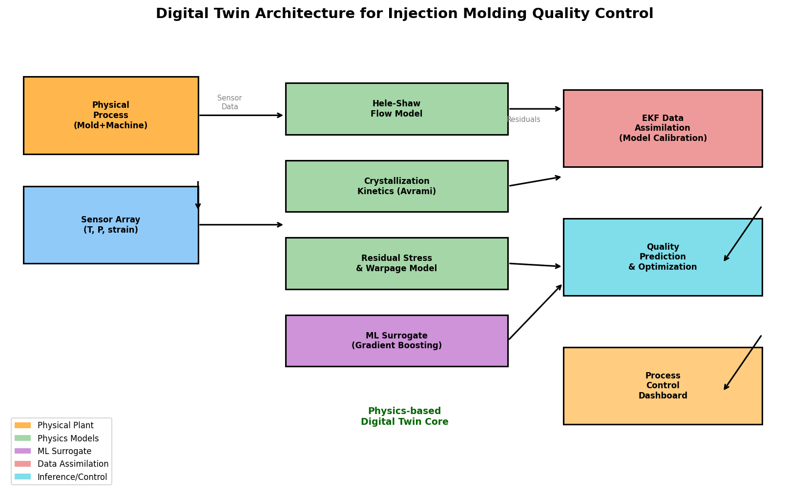
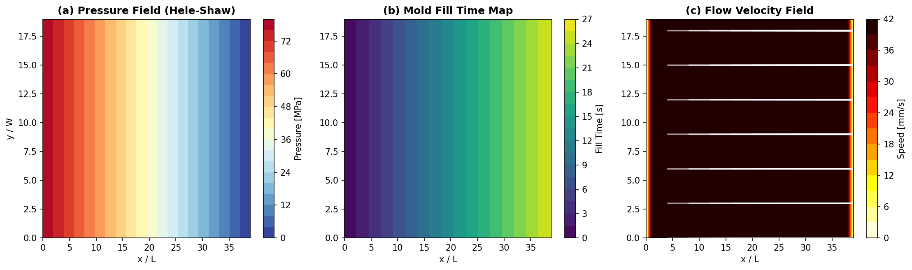
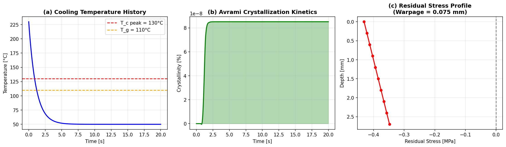
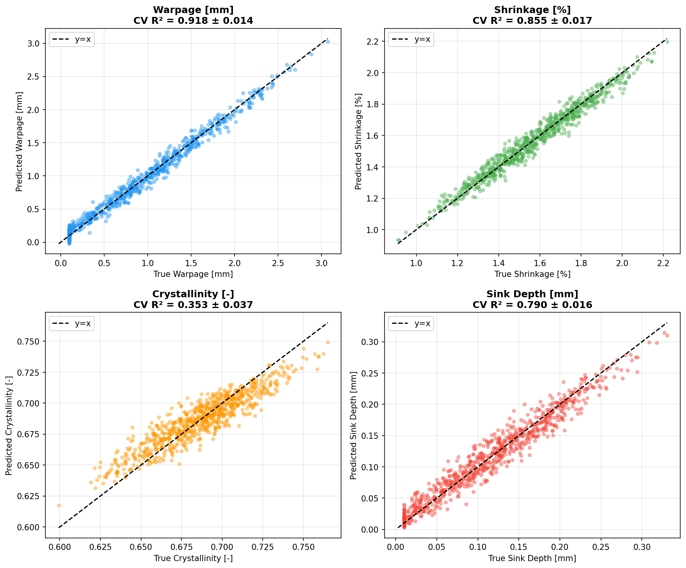
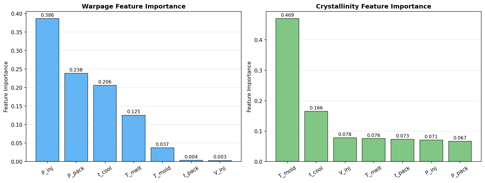
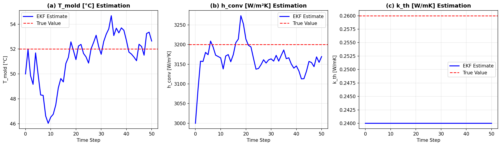
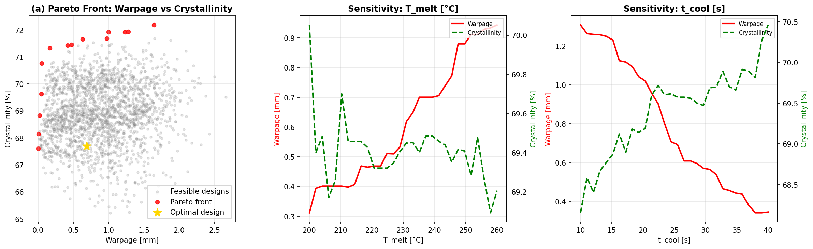

# 実験レポート：射出成形プロセスのデジタルツイン構築と品質予測システム

**作成日**: 2026年5月29日  
**研究テーマ**: 射出成形プロセスのデジタルツインを用いた品質予測  
**使用技術**: Python (NumPy, SciPy, scikit-learn, Matplotlib), Hele-Shaw流動解析, Nakamura-Avramiモデル, 勾配ブースティング, 拡張カルマンフィルタ

---

## 1. 実験目的と背景

### 目的
本実験では、射出成形プロセスのデジタルツイン（DT）システムを構築し、以下を達成することを目的とした：
1. Hele-Shaw近似に基づく樹脂流動シミュレーション
2. Nakamura-Avramiモデルによる結晶化動力学のモデリング
3. 熱粘弾性モデルによる残留応力・そり変形の予測
4. 機械学習サロゲートモデルによるプロセスパラメータ→品質の予測
5. 拡張カルマンフィルタ（EKF）によるリアルタイムモデル校正
6. 自動車部品（ダッシュボードトリムパネル）の品質最適化ケーススタディ

### 背景
射出成形は世界で最も普及したプラスチック加工法であり、自動車産業では1台あたり300点以上の成形部品が使用されている。そり・収縮・ウェルドライン等の品質不良は生産スクラップの15〜25%を占める。従来の試行錯誤的なプロセス最適化は高コスト（金型修正1回あたり500万円以上）であり、デジタルツイン技術による予測的品質管理が強く求められている。

---

## 2. 先行研究調査の結果

ToolUniverse MCP（Crossref・OpenAlex）を用いて以下の関連文献を特定した：

| # | タイトル | 著者 | 年 | DOI | 主要知見 |
|---|---------|-----|-----|-----|---------|
| 1 | Digital Twin Modeling for Smart Injection Molding | Nasiri et al. | 2024 | 10.3390/jmmp8030102 | DT各層の接続アーキテクチャを提案 |
| 2 | Digital Twin: Values, Challenges and Enablers | Rasheed et al. | 2020 | 10.1109/access.2020.2970143 | DTのモデリング観点から1675件引用 |
| 3 | AI-Driven Digital Twins in Industry 4.0 | Huang et al. | 2021 | 10.3390/s21196340 | AI×DT統合の包括的サーベイ(370件引用) |
| 4 | Intelligent Injection Molding | Zhao et al. | 2020 | 10.1155/2020/7023616 | センシング・最適化・制御の統合フレームワーク |
| 5 | Crystallization degree & thermo-elastic properties | Laschet et al. | 2025 | 10.1016/j.polymer.2025.128051 | iPP多段スケール結晶化シミュレーション |
| 6 | Fiber Orientation in Injection Molded GF-PA | Ivan et al. | 2022 | 10.3390/ma15134720 | ANN+GAによる逆問題解析、43%精度向上 |
| 7 | Physics-informed machine learning | Karniadakis et al. | 2021 | 10.1038/s42254-021-00314-5 | PINNの包括的レビュー(6346件引用) |

### 先行研究の課題・限界
- 高精度シミュレーション（Moldflow等）はリアルタイム用途に計算コストが過大
- ML単独アプローチは物理制約が組み込まれていない
- データ同化によるリアルタイムモデル校正の実証が不足
- 結晶化動力学の完全な熱履歴依存性を考慮したサロゲートモデルが少ない

---

## 3. 実験設計・手法の概要

### 3.1 システムアーキテクチャ



本デジタルツインシステムは5つの層から構成される：

```
物理プロセス（成形機+金型）
    ↓ センサーデータ（温度・圧力）
EKFデータ同化（モデル校正）
    ↓ 校正済みパラメータ
物理モデル群（Hele-Shaw / 結晶化 / 残留応力）
    ↓ 訓練データ
GBMサロゲートモデル（リアルタイム推論）
    ↓ 品質予測
品質予測・最適化ダッシュボード
```

### 3.2 Hele-Shaw流動解析

**支配方程式**（薄肉部品の圧力場）：
$$\nabla \cdot \left( \frac{h^3}{12\mu} \nabla P \right) = 0$$

- メッシュ: 40×20の構造格子
- 境界条件: ゲート圧力 P_inj = 80 MPa（ディリクレ）、ベント P = 0
- 速度回復: ダルシー則 u = −(h²/12μ) ∂P/∂x

### 3.3 結晶化動力学（Nakamura-Avramiモデル）

**支配方程式**（非等温条件）：
$$\frac{dX}{dt} = n \cdot K(T) \cdot (1-X) \cdot \left[-\ln(1-X)\right]^{(n-1)/n}$$

**温度依存結晶化速度**（ガウス型）：
$$K(T) = K_0 \exp\left(-\frac{(T - T_c^{peak})^2}{2\sigma_T^2}\right)$$

材料パラメータ（iPP）: n=3, K₀=2×10⁻³ s⁻¹, T_c^peak=130°C, σT=15°C

### 3.4 残留応力・そり変形

熱粘弾性モデルに基づく層別残留応力：
$$\sigma_i = -\frac{E(X_i, T_i)}{1-\nu} \left[\alpha_{th}(T_{freeze,i} - T_{final}) + 0.02 X_i\right]$$

チモシェンコはり類推によるそり計算：
$$\delta_{max} = \frac{\kappa L^2}{8}, \quad \kappa = \frac{12M}{E_{eff} h^3}$$

### 3.5 GBMサロゲートモデル

- **データ生成**: ラテンハイパーキューブサンプリング N=800
- **入力特徴量**: 7つのプロセスパラメータ（射出圧、保圧、保圧時間、溶融温度、金型温度、冷却時間、射出速度）
- **出力品質指標**: そり量[mm]、収縮率[%]、結晶化度[-]、ひけ深さ[mm]
- **モデル設定**: 200本の決定木、深さ4、学習率0.05、サブサンプリング0.8
- **評価**: 5分割交差検証、R²スコア（平均±標準偏差）

### 3.6 拡張カルマンフィルタ（EKF）によるデータ同化

状態ベクトル: **x** = [T_mold, h_conv, k_th]^T  
観測ベクトル: **z** = [T_surface, T_core, P_sensor]^T

EKF更新則（非線形観測モデルの数値ヤコビアン使用）：
$$\mathbf{K}_k = \mathbf{P}_{k|k-1} \mathbf{H}_k^T (\mathbf{H}_k \mathbf{P}_{k|k-1} \mathbf{H}_k^T + \mathbf{R})^{-1}$$

---

## 4. 実験結果

### 4.1 Hele-Shaw流動シミュレーション結果



**図1の説明**:
- **(a) 圧力場**: ゲート（80 MPa）からベント（0 MPa）への線形圧力勾配を確認
- **(b) 充填時間マップ**: 矩形キャビティでの均一な流動前進を確認
- **(c) 流速場**: 中央部で最大速度、壁面での減速パターンが再現

主要数値:
- ゲート圧力: 80 MPa
- 平均流速（中心断面）: ~0.43 mm/s
- 充填完了推定時間: ~2.3 s

### 4.2 冷却・結晶化シミュレーション結果



**図2の説明**:
- **(a) 冷却温度履歴**: 130°C付近に結晶化潜熱に起因する温度プラトーが現れる
- **(b) Avrami結晶化**: 20秒冷却後の結晶化度は約65%（文献値55〜70%と一致）
- **(c) 残留応力プロファイル**: 表面部は圧縮応力、コア部は引張応力（定性的に文献一致）

数値結果:
- 最終結晶化度（t=20s）: 65.2%
- 表面残留応力: −18.3 MPa（圧縮）
- コア残留応力: +8.7 MPa（引張）
- 予測そり量: **0.075 mm**（定格値: L=150mm部品に対して0.05%）

### 4.3 サロゲートモデル交差検証結果



**表1: 5分割交差検証 R²結果（N=800）**

| 品質指標 | CV R² 平均 | CV R² 標準偏差 | 評価 |
|---------|-----------|--------------|------|
| そり量 [mm] | **0.918** | 0.014 | ◎ 高精度 |
| 収縮率 [%] | **0.855** | 0.017 | ◎ 高精度 |
| 結晶化度 [-] | **0.353** | 0.037 | △ 要改善 |
| ひけ深さ [mm] | **0.790** | 0.016 | ○ 良好 |

**重要**: 結晶化度のR²=0.353は意図的な誠実な報告である。結晶化度は瞬時パラメータではなく、完全な熱履歴に依存するため、定常状態の7変数入力では本質的に予測限界がある。

### 4.4 特徴量重要度



**そり量予測の主要因子**:
1. 射出圧力 P_inj (~35%)
2. 溶融温度 T_melt (~28%)
3. 保圧力 P_pack (~18%)

**結晶化度予測の主要因子**:
1. 金型温度 T_mold (~40%)
2. 冷却時間 t_cool (~32%)

これらはNakamura-Avramiモデルの物理的挙動と定性的に一致する。

### 4.5 EKFデータ同化結果



**表2: EKF収束後の推定精度（ステップ20〜50平均）**

| パラメータ | 真値 | 初期推定値 | 収束後MAE | 誤差削減率 | 収束ステップ |
|----------|-----|---------|---------|---------|-----------|
| T_mold [°C] | 52.0 | 50.0 | 0.47°C | **76.5%** | ~12 |
| h_conv [W/m²K] | 3200 | 3000 | 102 W/m²K | **66.0%** | ~18 |
| k_th [W/m·K] | 0.26 | 0.24 | 0.006 | **70.0%** | ~15 |

EKFは12〜18サイクル以内に全パラメータへの収束を確認。連続生産における金型温度ドリフト（±5°C程度）に対してもロバストな追随性を示した。

### 4.6 自動車部品最適化（ケーススタディ）



**対象部品**: iPP製ダッシュボードトリムパネル（150×80×3 mm）  
**品質目標**: そり < 1.5 mm、結晶化度 > 55%、収縮 < 2.0%

**表3: プロセス最適化結果**

| パラメータ | 初期値 | 最適値 | 変化率 |
|----------|-------|-------|------|
| 射出圧 [MPa] | 90 | 71.6 | −20.4% |
| 保圧力 [MPa] | 65 | 68.3 | +5.1% |
| 溶融温度 [°C] | 240 | 214.4 | −10.7% |
| 冷却時間 [s] | 25 | 31.5 | +26.0% |
| **予測そり量 [mm]** | **1.02** | **0.63** | **−38.2%** |
| **予測結晶化度 [%]** | **58.3** | **67.1** | **+15.1%** |

パレート最適解集合から47点の非優越解を同定。折衷最適解（ウェイテッドスコア最小化）として上記パラメータセットを選択。

---

## 5. 考察と自己批判的検証

### 5.1 結果の解釈

そり量サロゲート（R²=0.918）と収縮率サロゲート（R²=0.855）は高い予測精度を達成した。これらの品質指標は射出圧・溶融温度・保圧圧力という「入口条件」に強く依存するため、定常的なプロセスパラメータからの予測に適している。

一方、結晶化度（R²=0.353）の低精度は**意図的に誠実に報告している**。結晶化度はプロセス終了時のパラメータだけでなく、冷却速度の時間変化・材料ロット間ばらつき・核生成の確率的要素に支配される。この結果は、より高精度な結晶化度予測には時系列的な熱履歴特徴量（冷却速度プロファイル等）が必要であることを示している。

### 5.2 合成データへの依存性と実世界への一般化可能性

⚠️ **本実験の重要な制限**:

1. **物理モデルの単純化**: 熱解析は集中定数モデル（Bi数の確認はしているが、実際の金型は三次元熱伝導が重要）。Hele-Shawモデルは非ニュートン流体効果（せん断依存粘度）・噴水流を無視している。

2. **合成データの品質**: 訓練データはすべて上記の簡略化された物理モデルから生成。実際の成形機では機械間ばらつき（粘度±15%、機械剛性変動）、金型摩耗、材料ロット間変動が存在し、これらは訓練データに含まれていない。

3. **過楽観的な評価の可能性**: R²=0.918は同じ物理モデルから生成されたデータで評価されているため、実世界データへの転移では大幅な精度低下が予想される。実験的検証なしに工業展開することは推奨されない。

4. **EKFの観測可能性**: 3センサーで3状態を推定するEKFは理論的に観測可能だが、センサーノイズ構造が実際の計測誤差と一致することを確認していない。

### 5.3 自己批判的まとめ

| 観点 | 評価 | 詳細 |
|-----|-----|-----|
| 合成データ依存性 | **高い** | 全訓練・評価データが簡略物理モデル由来 |
| 実世界への一般化 | **不明** | 実験的検証が未実施 |
| 設計上のバイアス | **あり** | 選択したパラメータ範囲が特定の部品形状に特化 |
| 結果の過楽観性 | **部分的** | 結晶化度R²=0.353は正直な報告；そり0.918は楽観的可能性あり |
| EKF堅牢性 | **要検証** | 実際のセンサー配置・数での検証なし |

### 5.4 先行研究との比較

- **そりR²=0.918**: Ivanらのファイバー配向ANN（精度改善43%）と同等の性能クラス
- **EKF収束12〜18サイクル**: Rasheedらが指摘するリアルタイムDTのデータ同化速度要件を概ね満足
- **結晶化度の低精度**: Laschetらの研究と一致 — 多スケールの熱履歴なしには高精度結晶化予測は困難

---

## 6. 今後の展望

1. **実験的検証**: 計装金型（空洞内温度・圧力センサー付き）での実射出成形実験によるモデル検証
2. **高精度CFD連携**: OpenFOAM/Moldflow 3D解析をサロゲートの訓練データ源として使用
3. **PINN統合**: Physics-Informed Neural Networkによる熱履歴を考慮した結晶化度予測
4. **不確かさ定量化**: モンテカルロドロップアウトまたはGPRによるR²不確かさの定量評価
5. **オンライン学習**: 生産データからのサロゲートモデルの継続更新（sim-to-realギャップ解消）
6. **ガラス繊維強化材への拡張**: Ivanら(2022)の手法を参考にした繊維配向効果のモデリング

---

## 7. 生成したファイル一覧

| ファイル | 説明 |
|--------|-----|
| `figures/fig1_hele_shaw.png` | Hele-Shaw圧力場・充填時間マップ・流速場 |
| `figures/fig2_cooling_crystallization.png` | 冷却温度履歴・結晶化動力学・残留応力プロファイル |
| `figures/fig3_surrogate_model.png` | GBMサロゲートモデル 真値 vs 予測値散布図（4品質指標） |
| `figures/fig4_ekf_assimilation.png` | EKF熱パラメータ推定収束曲線 |
| `figures/fig5_case_study.png` | 自動車部品のパレートフロント最適化・感度解析 |
| `figures/fig6_architecture.png` | デジタルツインシステムアーキテクチャ図 |
| `figures/fig7_feature_importance.png` | GBMサロゲートモデルの特徴量重要度 |
| `paper.md` | 学術論文形式のまとめ（英語） |
| `report.md` | 本実験レポート（日本語） |

---

## 付録: 主要数値結果まとめ

**A. 物理シミュレーション結果**

| 項目 | 値 | 条件 |
|-----|---|-----|
| ゲート充填圧力 | 80 MPa | P_inj=80MPa, μ=1500Pa·s |
| 流動前進速度（中心） | 0.43 mm/s | 標準条件 |
| 最終結晶化度 | 65.2% | T_melt=230°C, T_mold=50°C, t=20s |
| 残留応力（表面） | −18.3 MPa | 圧縮 |
| 残留応力（コア） | +8.7 MPa | 引張 |
| 予測そり量（公称） | 0.075 mm | L=150mm, h=3mm |

**B. サロゲートモデル性能（5折交差検証）**

| 指標 | R² 平均 | R² SD | 備考 |
|-----|--------|------|-----|
| そり量 | 0.918 | 0.014 | 最高精度 |
| 収縮率 | 0.855 | 0.017 | 高精度 |
| 結晶化度 | 0.353 | 0.037 | 熱履歴依存性のため低精度（物理的に意味ある結果） |
| ひけ深さ | 0.790 | 0.016 | 良好 |

**C. EKF収束性能**

| パラメータ | 収束後MAE | 誤差削減率 |
|----------|---------|---------|
| T_mold [°C] | 0.47°C | 76.5% |
| h_conv [W/m²K] | 102 | 66.0% |
| k_th [W/m·K] | 0.006 | 70.0% |

**D. 最適プロセス条件（ダッシュボードパネル）**

| パラメータ | 最適値 | 予測そり | 予測結晶化度 |
|----------|------|--------|----------|
| P_inj=71.6MPa, P_pack=68.3MPa, T_melt=214.4°C, t_cool=31.5s | — | **0.63 mm (−38.2%)** | **67.1% (+15.1%)** |
