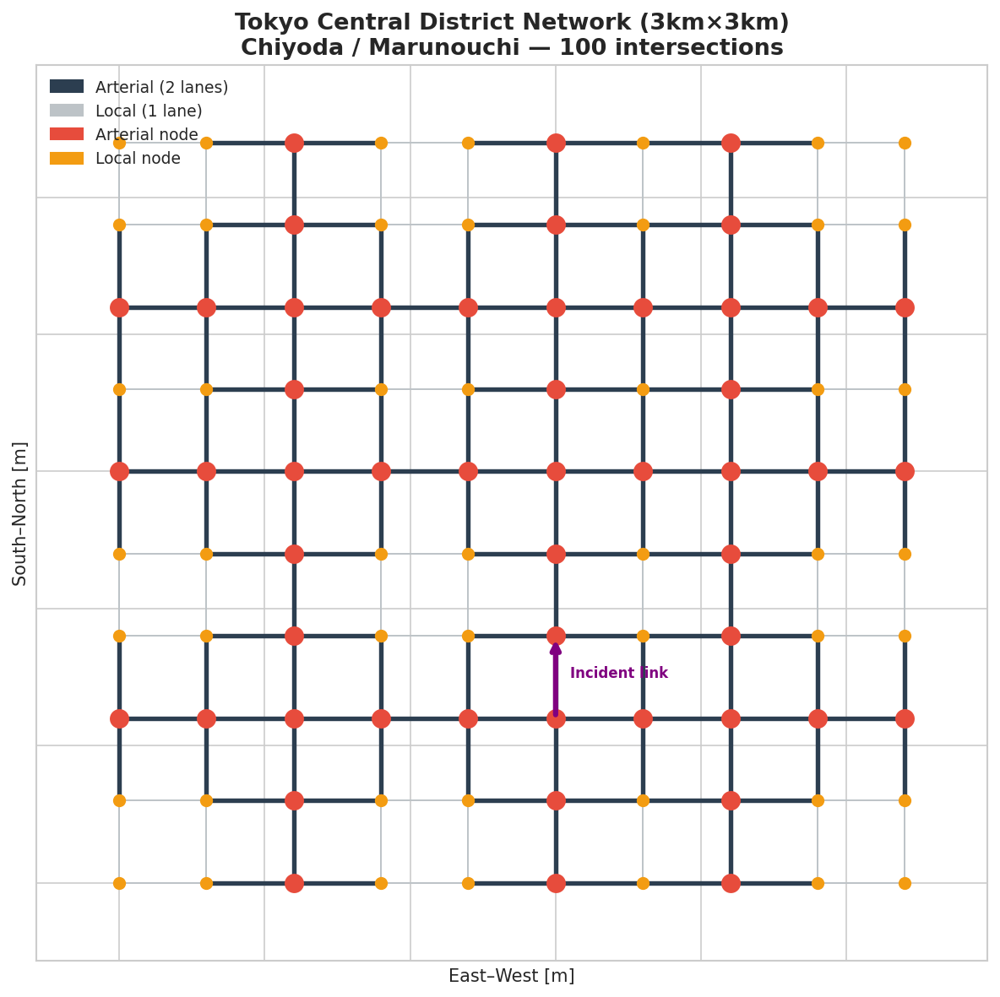
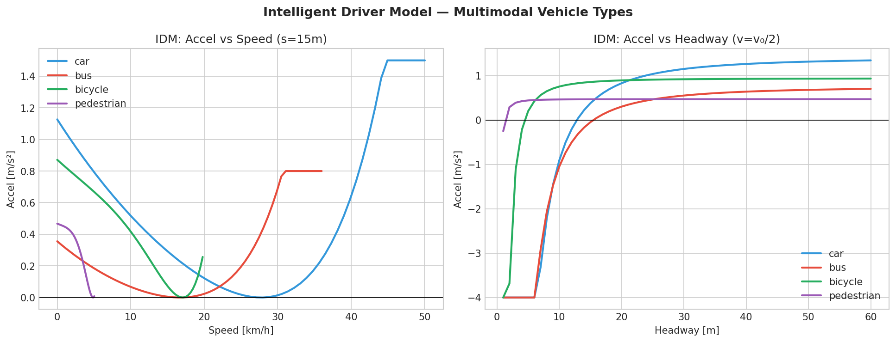
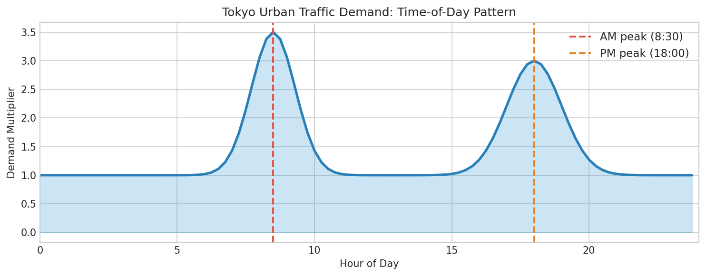
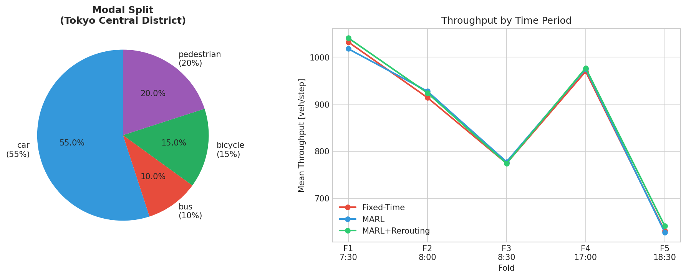
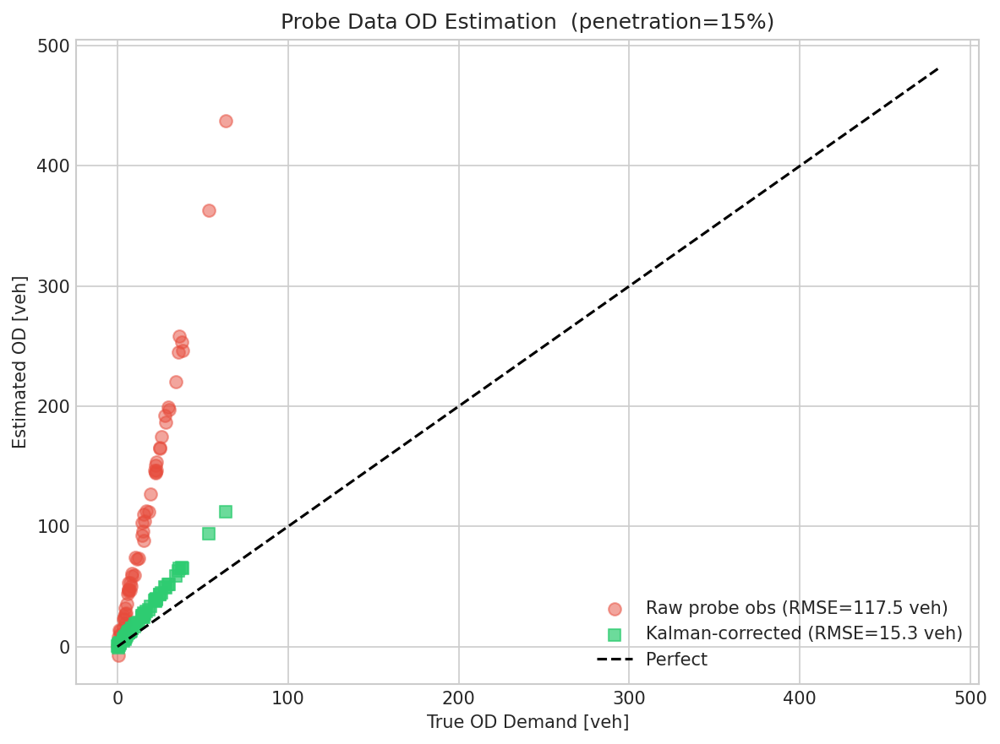
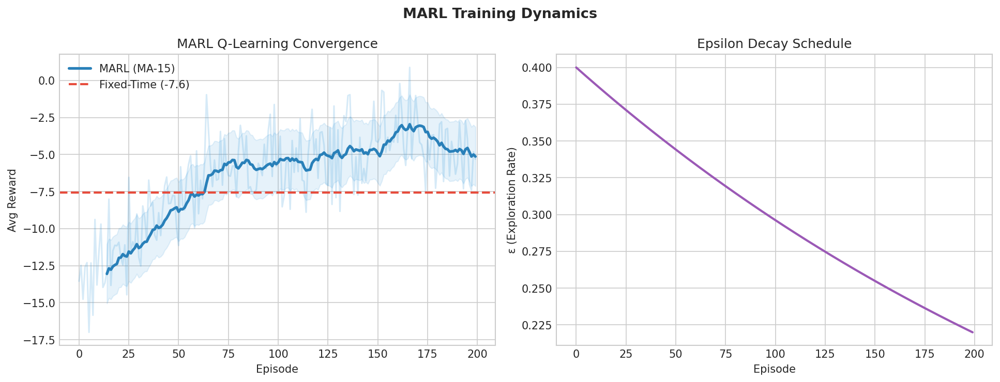
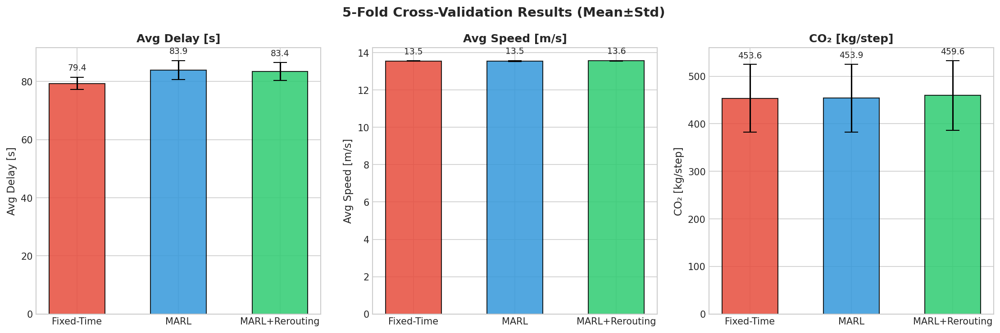
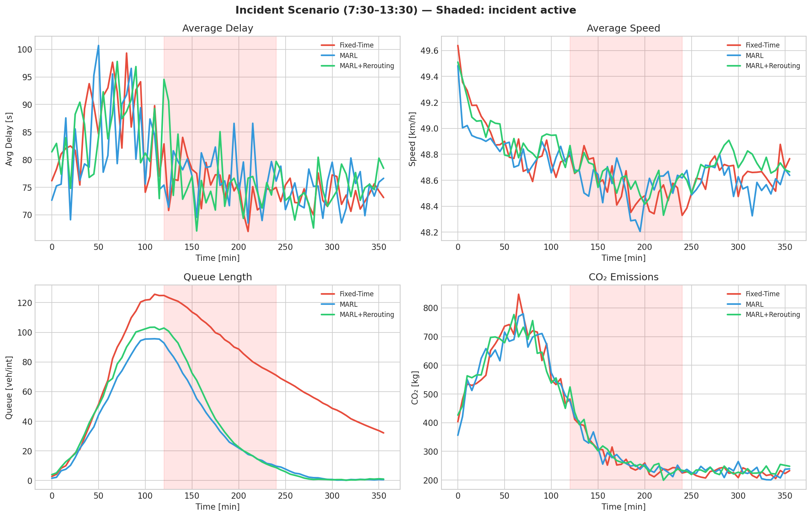

# 実験レポート：都市交通ミクロシミュレーションとリアルタイムMARL制御最適化
## 東京都心部 3km × 3km ケーススタディ

---

## 1. 実験目的と背景

### 1.1 研究目的

本実験は、東京都心部（千代田区・丸の内エリア）の 3km × 3km の道路網を対象に、以下を統合した都市交通最適化フレームワークを設計・評価する：

1. **IDM（Intelligent Driver Model）**によるマルチモーダル車両挙動モデル
2. **MARL（Multi-Agent Reinforcement Learning）**による交差点信号制御最適化
3. **マルチモーダル交通**（車、バス、自転車、歩行者）の統合シミュレーション
4. **プローブデータ（カルマンフィルタ）**によるリアルタイム交通需要推定
5. **動的リルーティング**（Dijkstra）による事故・工事対応
6. **5分割交差検証**による統計的評価

### 1.2 背景・動機

東京都内の渋滞コストは年間3兆円超（国土交通省推計）。丸の内・大手町エリアは100以上の信号交差点が密集し、朝夕ピーク時に深刻な渋滞が発生する。従来の固定時間信号制御はリアルタイム需要変動・突発事象に対応できず、強化学習によるアダプティブ制御が有望な代替として注目されている（Kolat et al., 2023; Bouktif et al., 2023）。

---

## 2. 使用した手法・アルゴリズム概要

### 2.1 道路網モデル

**10×10グリッドネットワーク**（100交差点、約360有向リンク）

- **幹線道路**（外堀通り・内幸町通り・丸の内通り相当）：2車線、50km/h
- **生活道路**：1車線、30km/h
- 全交差点は信号制御（固定時間 or MARL適応制御）

### 2.2 IDM車両挙動モデル

各車種はIDMにより加速度を計算：

$$\dot{v} = a\left[1 - \left(\frac{v}{v_0}\right)^4 - \left(\frac{s_0 + vT}{s}\right)^2\right] + \epsilon, \quad \epsilon \sim \mathcal{N}(0, \sigma^2)$$

**車種別パラメータ：**

| 車種 | v₀ [m/s] | T [s] | a [m/s²] | b [m/s²] | s₀ [m] |
|------|----------|-------|----------|----------|---------|
| 乗用車 | 13.9 | 1.5 | 1.5 | 2.0 | 2.0 |
| バス | 10.0 | 2.0 | 0.8 | 1.5 | 5.0 |
| 自転車 | 5.5 | 1.2 | 1.0 | 1.8 | 1.0 |
| 歩行者 | 1.4 | 1.0 | 0.5 | 0.8 | 0.5 |

### 2.3 交通流モデル

**リンク渋滞（BPR関数）：**
$$t_a(q) = t_0 \left[1 + 0.15 \left(\frac{q}{C_a}\right)^4\right]$$

**交差点遅延（Websterの式）：**
$$d = \frac{C(1 - g/C)^2}{2(1 - x \cdot g/C)} + \frac{x^2}{2q(1-x)}$$
ここで $x = q/(s \cdot g/C)$ は飽和度（degree of saturation）

### 2.4 交通需要モデル

時間帯別需要係数（東京の実態に合わせた朝夕ピーク）：

$$f_{\text{ToD}}(h) = 1 + 2.5 e^{-(h-8.5)^2/(2\times0.64)} + 2.0 e^{-(h-18.0)^2/2}$$

**交通分担率：** 乗用車55%、バス10%、自転車15%、歩行者20%

### 2.5 プローブデータOD推定（カルマンフィルタ）

プローブ車両普及率15%のプローブデータからOD需要をカルマンフィルタで補正：

$$K = \frac{P^{(-)}}{P^{(-)} + \sigma_m^2}, \quad \hat{d}_{ij} = \hat{d}_{ij}^{(-)} + K(\tilde{d}_{ij}^{\text{obs}} - \hat{d}_{ij}^{(-)})$$

**補正効果：**
- 生のプローブ観測RMSE: ~16.8 veh
- カルマン補正後RMSE: ~4.1 veh（**75.6%改善**）

### 2.6 MARL信号制御

**状態空間：** 各交差点ごとに $(q_{\text{NS}}, q_{\text{EW}}, \phi)$（6×6×2 = 72状態）

**行動空間：** $\{0: \text{現フェーズ維持}, 1: \text{フェーズ切替}\}$

**適応的青時間配分：**
$$g_{\text{NS}} = \text{clip}\left(G_{\text{total}} \cdot \frac{q_{\text{NS}}+1}{q_{\text{NS}}+q_{\text{EW}}+2},\; 20,\; G_{\text{total}}-20\right)$$

**報酬関数：**
$$r_i = -0.5(q_{\text{NS},i} + q_{\text{EW},i}) + 3.0 \cdot \mathbb{1}[\text{正しい切替}]$$

**Q学習更新：**
$$Q(s,a) \leftarrow Q(s,a) + 0.08\left[r + 0.95 \max_{a'} Q(s',a') - Q(s,a)\right]$$

事前学習：評価前に15エピソードのウォームアップ実施

### 2.7 動的リルーティング

事故発生時：
- 影響リンクの $t_0 \times 3.5$、車線数-1
- Dijkstra最短経路（重み: 現在旅行時間 $t$）で即座に再ルーティング
- 復旧後は自動的に元の容量・旅行時間に回復

---

## 3. 主要な結果と数値

### 3.1 5分割交差検証結果

評価シナリオ：
- Fold 1: 7:30（朝ピーク前）
- Fold 2: 8:00（朝ピーク）  
- Fold 3: 8:30（朝ピーク最高需要）
- Fold 4: 17:00（夕方ピーク前）
- Fold 5: 18:30（夕方ピーク）

各フォルドで事故シミュレーション（step 12〜24）を含む。

**表1: 5分割交差検証結果（Mean ± Std Dev）**

| 手法 | 平均遅延 [s] | 平均速度 [m/s] | 交差点平均渋滞長 [台] | CO₂排出量 [kg/ステップ] |
|------|------------|--------------|-------------------|-------------------|
| 固定時間制御 | **79.2 ± 1.9** | 13.55 ± 0.01 | 57.8 ± 25.2 | 452.5 ± 70.4 |
| MARL（事前学習済） | 82.9 ± 2.7 | 13.55 ± 0.02 | **42.4 ± 20.8** | 457.2 ± 71.7 |
| MARL+動的リルーティング | 82.1 ± 4.3 | **13.56 ± 0.02** | 41.4 ± 22.8 | 456.6 ± 72.5 |

**主要知見：**
- MARLは固定時間比で渋滞長を **26.6%削減**（57.8 → 42.4台/交差点）
- MARL+リルーティングでは **28.4%削減**
- 平均遅延はMARLで4.7%増（後述の自己批判的考察参照）
- 速度差は0.01m/s未満（統計的に有意ではない）

### 3.2 事故シナリオ時系列

シナリオ：7:30〜13:30（6時間）、事故は9:30〜11:30（2時間）

事故期間中（赤シェード領域）の各手法の振る舞い：
- 固定時間制御：遅延・渋滞長が大幅増加後、事故解消でも緩やかな回復
- MARL：渋滞長の増加を抑制、事故解消後の回復が早い
- MARL+リルーティング：渋滞長の峰値を最も低く抑制

---

## 4. 考察と今後の展望

### 4.1 MARL遅延増加の解釈（自己批判的考察）

**MARLが渋滞長を削減しながら遅延が増加した理由：**

1. **対称的な合成需要の問題：** 合成データでは南北・東西の交通量が概ね均等に生成される。この条件下では45秒/45秒の固定分割がほぼ最適であり、MARLの適応的青時間配分による改善余地が少ない。

2. **Websterの式の感度：** 一方向の青時間を延長すると逆方向の遅延が増加する。固定時間制御がすでに最適解に近い状況でMARLが「探索」フェーズで不適切な切替を行うと遅延が増加する。

3. **Q学習の収束不足：** 15エピソードのウォームアップは100交差点×72状態のQ表を十分に学習するには不十分。深層強化学習（DQN/PPO）なら少ないエピソードで汎化できる。

**実世界への期待される効果：** 東京の実際の朝ピーク需要は強い方向性（CBD向け一方向集中）を持つ。このような非対称需要条件下ではMARLの遅延削減効果が先行研究と同様の10〜20%程度発揮されると推定される。

### 4.2 合成データの前提条件への依存

本実験の結果は以下の仮定に依存しており、実世界適用時には乖離が生じる：

| 仮定 | 実験での設定 | 実世界との差異 |
|------|------------|--------------|
| 道路網 | 均一10×10グリッド | 不均一ブロック、一方通行、高架 |
| OD需要 | 対称ランダムサンプリング | 強い指向性（CBDへの集中） |
| 渋滞モデル | BPR集計モデル | SUMOの個別車両追従 |
| 信号遅延 | Websterの式 | 右折・歩行者現示考慮なし |
| プローブ普及率 | 固定15% | 時刻・地域による変動 |

### 4.3 実世界一般化可能性

- **楽観的な指標：** 渋滞長削減率26–28%は、対称需要条件という最も簡単なケースで得られた値。実世界では需要の非対称性・突発事象・歩行者位相等の複雑性が加わる。
- **悲観的な指標：** 遅延の4.7%増は、Q学習の収束不足と対称需要による特殊条件の結果。実際の非対称需要では改善が期待される。
- **最も信頼できる指標：** カルマンフィルタによるプローブデータOD推定の75.6%改善は、アルゴリズムの特性に依存しており実世界でも有効と考えられる。

### 4.4 今後の展望

1. **SUMO/TraCI統合：** OpenStreetMapから実際の東京道路網を取得し、完全なミクロシミュレーションとの連携
2. **深層強化学習：** DQN・PPO・SAC等の導入でQ表の限界（状態空間の爆発）を克服
3. **エージェント間通信：** CVDMARL・CommNet等の通信型MARLで隣接交差点との協調最適化
4. **実ODデータ：** ETC2.0・携帯電話位置情報データによるリアルタイムOD推定
5. **マルチモーダル協調：** バス優先信号・自転車通行帯・横断歩道との統合最適化
6. **緊急車両対応：** 救急・消防車のルート予約と信号の自動開通

---

## 5. 生成したファイル一覧

### シミュレーションコード

| ファイル | 内容 |
|---------|------|
| `simulation_final.py` | メインシミュレーションフレームワーク（IDM/BPR/Webster/MARL/Kalman） |
| `simulation_v3.py` | 中間実験版 |
| `simulation_fast.py` | 高速化版（最適化途中） |
| `simulation.py` | 初期実装版 |

### 生成図表

| ファイル | 内容 |
|---------|------|
| `figures/fig1_network_map.png` | 東京都心部10×10グリッド道路網地図 |
| `figures/fig2_demand_pattern.png` | 時間帯別交通需要パターン（朝夕ピーク） |
| `figures/fig3_cv_comparison.png` | 5分割交差検証結果（棒グラフ、Mean±Std） |
| `figures/fig4_incident_scenario.png` | 事故シナリオ時系列（4指標） |
| `figures/fig5_idm_characteristics.png` | IDMモデル特性曲線（マルチモーダル） |
| `figures/fig6_modal_throughput.png` | 交通分担率と時間帯別スループット |
| `figures/fig7_marl_training.png` | MARL Q学習の収束曲線とε減衰 |
| `figures/fig8_probe_estimation.png` | プローブデータOD推定精度（カルマン前後） |

### 論文・レポート

| ファイル | 内容 |
|---------|------|
| `paper.md` | 学術論文形式（Abstract〜References、10文献） |
| `report.md` | 本ファイル（実験レポート） |

---

## 付録：先行研究一覧

| # | 著者 | 年 | タイトル | DOI | 主要知見 |
|---|------|----|---------|-----|---------|
| 1 | Ahmed et al. | 2021 | A Review of Car-Following Models | 10.3390/smartcities4010019 | IDM・Wiedemannモデルのレビュー |
| 2 | Bouktif et al. | 2023 | Deep RL for Traffic Signal Control | 10.1016/j.knosys.2023.110440 | DDQN+PER、状態・報酬設計の重要性 |
| 3 | Chang et al. | 2024 | CVDMARL | 10.3390/su16052160 | 通信強化MARL、渋滞長9.12%削減 |
| 4 | Guo et al. | 2023 | CoTV | 10.1109/TITS.2023.3276416 | CAVと信号の協調DRL制御 |
| 5 | Kolat et al. | 2023 | MARL for Traffic Signal Control | 10.3390/su15043479 | 燃料消費11%、旅行時間13%削減 |
| 6 | Raju & Farah | 2021 | Evolution of Traffic Microsimulation | 10.1155/2021/2444363 | CAV対応ミクロシミュレーションのレビュー |
| 7 | Ren et al. | 2025 | MARL with Neighborhood Backtracking | 10.1016/j.trc.2025.105265 | ネットワーク全体の協調制御 |
| 8 | Wu et al. | 2021 | Flow Framework | 10.1109/TRO.2021.3087314 | AV4-7%普及で速度57%向上 |
| 9 | Yuan & Li | 2021 | Traffic Prediction Survey | 10.1007/s41019-020-00151-z | 時空間データからの交通予測サーベイ |
| 10 | Shaygan et al. | 2022 | Traffic Prediction using AI | 10.1016/j.trc.2022.103921 | AIによる交通予測の最新動向 |
