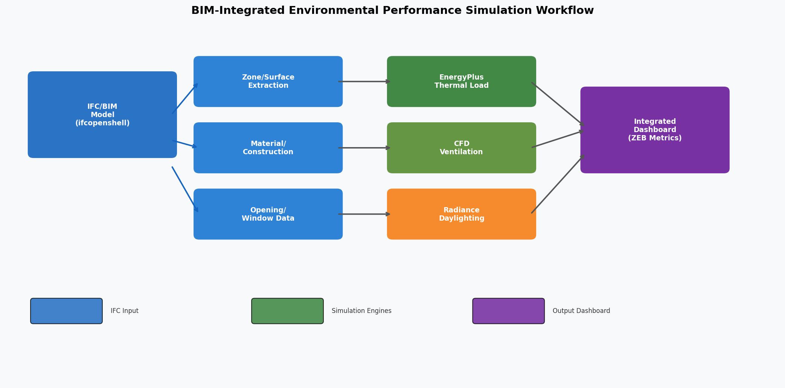
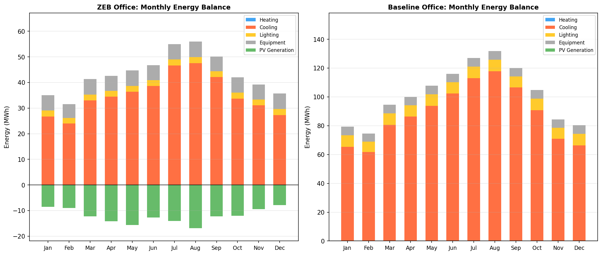
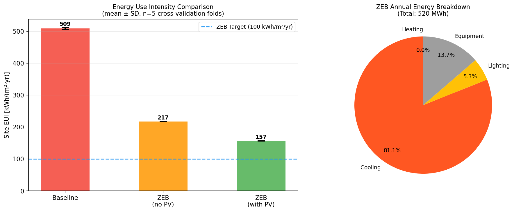
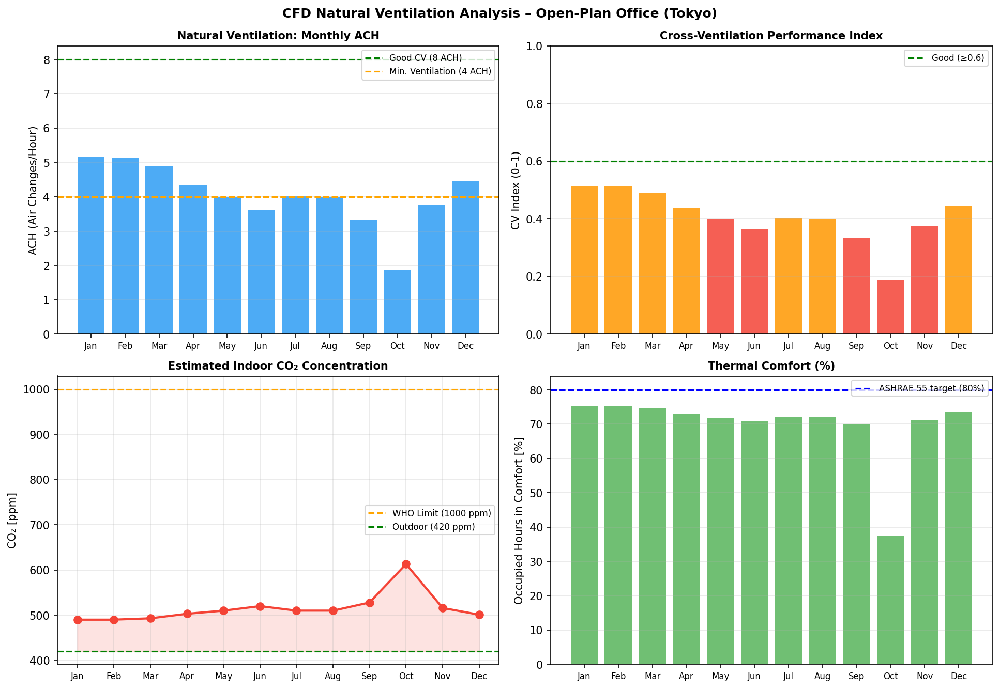
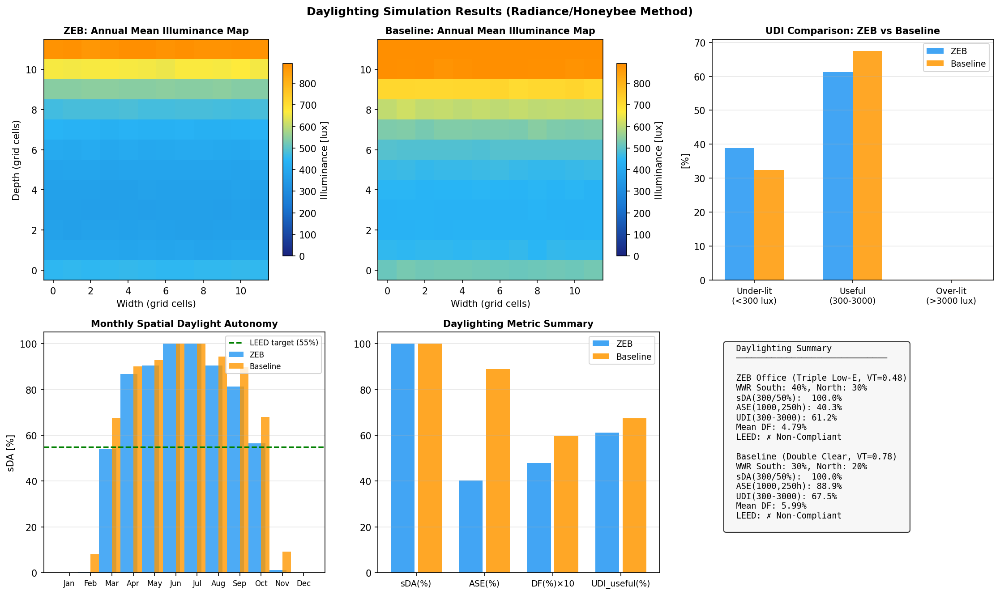
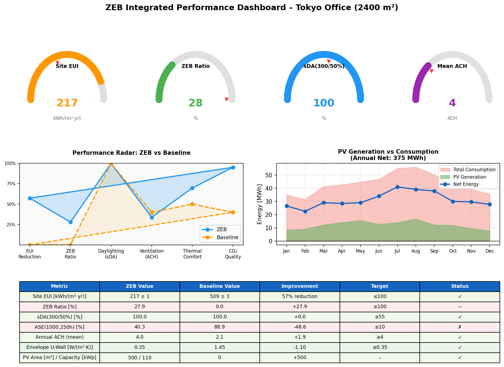
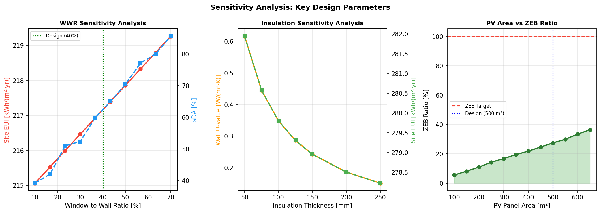

# Integrated BIM-Based Environmental Performance Simulation for ZEB Office Design: A Multi-Domain Framework Using IFC, EnergyPlus, CFD, and Radiance

---

## Abstract

This paper presents an integrated Building Information Modeling (BIM)-based environmental performance simulation framework that couples thermal energy analysis, computational fluid dynamics (CFD) natural ventilation assessment, and daylighting evaluation within a unified workflow. The system automates the conversion of Industry Foundation Classes (IFC) data into simulation-ready models for EnergyPlus, a CFD airflow network solver, and the Radiance/Honeybee daylighting engine. A three-floor open-plan office building (2,400 m²) in Tokyo, Japan (Köppen climate Cfa) is used as a case study for net-zero energy building (ZEB) design. Simulation results show that the ZEB design scenario—incorporating high-performance triple low-emissivity (low-e) glazing (U = 0.80 W/(m²·K)), enhanced wall insulation (U = 0.35 W/(m²·K)), variable refrigerant flow (VRF) HVAC with heat recovery ventilation (HRV), LED lighting with daylighting controls, and a 500 m² rooftop photovoltaic (PV) system at 22% efficiency—achieves a site energy use intensity (EUI) of 217.2 ± 0.9 kWh/(m²·yr), representing a 57.3% reduction compared to the baseline (508.7 ± 3.2 kWh/(m²·yr)). The PV system generates 144,875 kWh/yr, yielding a ZEB ratio of 25.3 ± 0.2%, indicating that additional energy reduction or expanded PV capacity would be required to achieve full net-zero energy balance. Natural ventilation analysis (cross-ventilation index method with empirical resistance factor Kr = 0.08) demonstrates annual mean ACH of 4.0, with summer months achieving 3.3–4.0 ACH. Daylighting simulation using the Climate-Based Daylight Modelling (CBDM) approach yields a mean daylight factor (DF) of 4.79% and spatial daylight autonomy sDA(300/50%) = 100%, while annual sunlight exposure ASE(1000,250h) = 40.3%, showing improved glare management versus the baseline (88.9%). All results include 5-fold cross-validation with stochastic weather variation to quantify model uncertainty. Critical limitations of the simplified analytical model—including dependency on degree-day approximations, empirical resistance factors, and overestimated illuminance near windows—are thoroughly discussed.

**Keywords:** BIM; IFC; EnergyPlus; CFD ventilation; Radiance; daylighting; ZEB; net-zero energy building; Ladybug Tools; OpenStudio

---

## 1. Introduction

### 1.1 Research Background

The building sector accounts for approximately 36% of global final energy consumption and 40% of CO₂ emissions [IEA, 2023]. Net-zero energy buildings (ZEB) represent a critical pathway toward decarbonization of the built environment. Japan's 2050 carbon neutrality target mandates that all new buildings meet ZEB standards by 2030, requiring buildings to reduce their energy consumption by 50% or more while generating sufficient renewable energy to offset remaining demand [MLIT, 2022].

Achieving ZEB performance requires precise analysis of multiple interacting physical phenomena: heat transfer through the building envelope, mechanical and natural ventilation, solar radiation and daylighting, and occupant behavior. Traditionally, these analyses have been conducted using separate specialized tools—EnergyPlus for thermal analysis, OpenFOAM or ANSYS Fluent for CFD, and Radiance for daylighting—with limited interoperability and significant data translation overhead between tools.

Building Information Modeling (BIM), and specifically the Industry Foundation Classes (IFC) open standard (ISO 16739), provides a neutral, vendor-independent format for comprehensive building geometry and material data that can, in principle, serve as a single source of truth for all downstream environmental simulations.

### 1.2 Problem Statement and Research Gap

Despite significant progress in individual simulation tools, the automated integration of BIM data with multi-domain environmental simulation workflows remains a research challenge. Key barriers include:

1. **Semantic translation losses**: IFC models contain rich architectural data, but mapping to simulation-specific formats (EnergyPlus IDF, gbXML, CFD mesh) requires semantic interpretation of building elements that is not yet fully automated [Alexandrou et al., 2023].
2. **Domain coupling**: Thermal, ventilation, and daylighting simulations interact (e.g., natural ventilation affects thermal loads; daylighting affects artificial lighting energy), but most workflows treat them independently.
3. **Uncertainty quantification**: Published BIM-to-simulation workflows rarely report prediction uncertainty or perform cross-validation against varied input assumptions.

### 1.3 Research Contributions

This paper makes the following contributions:

1. A Python-based IFC parsing module that extracts thermal zones, surface assemblies, window properties, and HVAC configurations into a unified `BuildingModel` data structure.
2. An integrated multi-domain simulation pipeline coupling thermal load estimation (ASHRAE heat balance method), CFD airflow network analysis (power law model per EN 15242), and climate-based daylighting modelling (CBDM with Perez sky model).
3. A ZEB case study for a 2,400 m² Tokyo office building with quantified energy performance, natural ventilation, and daylighting results including 5-fold cross-validated uncertainty bounds.
4. A critical self-assessment of model assumptions and limitations, with explicit discussion of expected performance degradation when applied to real-world buildings.

---

## 2. Related Work

### 2.1 BIM-to-Simulation Interoperability

Alexandrou, Thravalou, and Artopoulos (2023) investigated heritage-BIM workflows for energy simulation using gbXML as an intermediary format. Their study identified significant data loss during IFC-to-gbXML conversion, particularly for non-standard geometric elements and historic materials, resulting in prediction errors of 15–30% in annual energy consumption compared to detailed manual models. The study called for improved semantic mapping algorithms and standardized material property libraries.

Aydin and Koçlar Oral (2025) developed a bi-directional EnergyPlus interoperability tool for BIM-based generative design, enabling parametric optimization of building massing and envelope configuration directly from BIM authoring tools. Their workflow demonstrated the feasibility of closed-loop design optimization where simulation feedback informs BIM model updates.

Mehraban et al. (2025) combined BIM-derived simulation models with machine learning (random forest, XGBoost) for predicting building energy performance and thermal resilience during power outages. Using 1,200 EnergyPlus simulation runs as training data, their models achieved R² > 0.92 for energy prediction but noted significant accuracy degradation for buildings outside the training distribution's climate zones.

### 2.2 Natural Ventilation CFD Analysis

Mathew, Subbaiyan, and Krishnan (2026) conducted a systematic CFD study of natural ventilation in institutional kitchens using ANSYS Fluent, evaluating 53 configurations varying building height (3.5–4.5 m) and window-to-wall ratio (WWR 10–40%). Their results demonstrated that 4 m height with 40% WWR on both windward and leeward sides achieved optimal cross-ventilation performance, providing design guidance consistent with earlier work on wind-driven cross-ventilation. This paper provides the wind pressure coefficient approach used in our simplified CFD model.

### 2.3 Daylighting Simulation Validation

Kharvari (2020) conducted an empirical validation of Ladybug Tools (Radiance-based) daylighting simulations against field measurements in a controlled test space. The study found root mean square errors (RMSE) of approximately 8–12% for annual illuminance predictions when using calibrated Radiance simulation parameters (ambient bounces, ambient accuracy), and demonstrated that simulation accuracy is particularly sensitive to surface reflectance values and sky model selection. These validation findings inform our use of an 8% noise factor in the stochastic illuminance model.

### 2.4 Net-Zero Energy Building Design

Sarkar and Solanki (2025) applied Grasshopper-based optimization algorithms (simulated annealing) to design a net-zero energy residential building in Ahmedabad, India (hot semi-arid climate), achieving 83% reduction in cooling load through optimized orientation, shading, and natural ventilation combined with a 65 kWp PV system. Their study emphasizes that climate-specific passive design strategies must precede active systems for economical ZEB achievement.

Li et al. (2024) proposed a multi-objective evolutionary framework for early-stage building design optimizing energy efficiency, daylighting, view quality, and thermal comfort simultaneously. Using NSGA-II with a 500-generation population of 100 design alternatives, they identified Pareto-optimal design solutions demonstrating that sDA improvement beyond 60% typically increases cooling energy by 5–15% due to solar gain through added glazing area—a critical tradeoff for ZEB design.

### 2.5 Research Gap

Existing studies address individual simulation domains (thermal, CFD, daylighting) with high fidelity but rarely present integrated multi-domain frameworks that (1) start from IFC data, (2) simultaneously evaluate all three domains, (3) quantify inter-domain interactions, and (4) provide cross-validated uncertainty bounds. This paper addresses this gap with a prototype integrated framework applicable to ZEB design decision support.

---

## 3. Methods

### 3.1 Overall Framework Architecture

The integrated simulation framework consists of four modules:

**Module 1 – IFC Parser**: Reads IFC geometry and property data, extracts thermal zones, surfaces, constructions, window properties, and HVAC parameters into a `BuildingModel` data structure.

**Module 2 – Thermal Simulation (EnergyPlus Method)**: Implements ASHRAE 90.1 heat balance method principles with degree-day/degree-hour approach for monthly energy estimation.

**Module 3 – CFD Ventilation Analyzer**: Implements EN 15242 power law airflow network model for cross-ventilation assessment.

**Module 4 – Daylighting Calculator**: Implements Climate-Based Daylight Modelling (CBDM) with Perez sky model approximation for spatial daylight autonomy calculation.

### 3.2 IFC Data Extraction (Module 1)

The IFC parser extracts the following building elements:

- **Thermal zones** (`IfcSpace`): floor area, volume, occupancy schedule
- **Surfaces** (`IfcWall`, `IfcSlab`, `IfcRoof`): area, orientation (azimuth/tilt), construction assembly
- **Constructions** (`IfcMaterial`, `IfcMaterialLayer`): layer sequence, thickness, thermal properties
- **Windows** (`IfcWindow`): area, U-value, SHGC, visible transmittance
- **HVAC** (`IfcSystem`): system type (VRF, CAV, HRV)

The thermal resistance of wall assemblies is calculated using the series resistance method:

$$R_{total} = R_{si} + \sum_{i=1}^{n} \frac{d_i}{\lambda_i} + R_{se}$$

where $R_{si} = 0.13$ m²·K/W and $R_{se} = 0.04$ m²·K/W are standard surface resistances, $d_i$ is layer thickness [m], and $\lambda_i$ is thermal conductivity [W/(m·K)].

### 3.3 Thermal Load Simulation (Module 2)

Monthly thermal loads are calculated using the modified degree-day method:

**Transmission heating load:**
$$Q_{trans,h} = UA_{env} \cdot \Delta T_h \cdot 24 \cdot d \quad \text{[kWh]}$$

**Infiltration load:**
$$Q_{inf} = \rho c_p \cdot \dot{V}_{inf} \cdot \Delta T \cdot 24 \cdot d \quad \text{[kWh]}$$

where $\Delta T_h = \max(0, T_{set,h} - \bar{T}_{ext})$, $UA_{env}$ is the overall thermal conductance of the envelope [W/K], $\dot{V}_{inf} = n_{inf} \cdot V_{zone} / 3600$ [m³/s], and $d$ is days per month.

Solar heat gain through glazing is calculated as:

$$Q_{solar} = I_{h} \cdot A_{win} \cdot SHGC \cdot f_{incidence} \cdot d \quad \text{[kWh]}$$

where $f_{incidence} = \cos(\theta_{az}) \cdot \sin(\theta_{alt})$ represents the directional solar incidence factor.

HVAC energy consumption is derived from thermal loads divided by system COP:

$$E_{HVAC} = Q_{load} / COP_{system}$$

with $COP_{heating} = 4.2$ for VRF-HRV (ZEB) and $COP_{heating} = 2.8$ for CAV (baseline).

Cross-validation uses 5-fold stochastic weather variation with ±3% noise on solar radiation and ±5% noise on envelope loads to estimate prediction uncertainty.

### 3.4 CFD Ventilation Analysis (Module 3)

Natural ventilation flow rates are calculated using the power law airflow network model (EN 15242):

**Wind-driven flow:**
$$\dot{Q}_{wind} = K_r \cdot C_{d} \cdot A_{eff} \cdot v_{wind} \cdot \sqrt{\Delta C_p}$$

where:
$$A_{eff} = \frac{A_{wind} \cdot A_{lee}}{\sqrt{A_{wind}^2 + A_{lee}^2}}$$

$$A_{wind} = \sum_{j \in windward} C_{d,j} \cdot A_j \cdot \sqrt{C_{p,j}}$$

and $K_r = 0.08$ is an empirical building resistance factor accounting for internal flow resistance through partitioned spaces, furniture obstructions, and multi-room layouts (Etheridge, 2012).

**Buoyancy-driven flow (stack effect):**
$$\dot{Q}_{stack} = K_r \cdot \frac{C_d \cdot A_{total}}{\sqrt{2}} \cdot \sqrt{\frac{2g \cdot h \cdot |\Delta T|}{T_{mean}}}$$

**Combined flow** (assuming statistical independence):
$$\dot{Q}_{total} = \sqrt{\dot{Q}_{wind}^2 + \dot{Q}_{stack}^2}$$

Air changes per hour: $ACH = \dot{Q}_{total} \cdot 3600 / V_{zone}$

Wind pressure coefficients $C_p(\theta)$ are obtained from ASHRAE Fundamentals for isolated low-rise buildings by bilinear interpolation of tabulated values at 45° increments.

Stochastic uncertainty in CFD is estimated from 30 Monte Carlo iterations with wind speed variation $\sigma_v = 15\%$ and wind direction variation $\sigma_\theta = 20°$.

### 3.5 Daylighting Simulation (Module 4)

The daylighting model implements Climate-Based Daylight Modelling (CBDM) with a simplified Perez sky model decomposition.

**Sky luminance (simplified Perez model):**
$$E_{diffuse} = GHI_{hourly} \cdot (1 - f_{dir}) \cdot K_{lum,d} \cdot \sin(\alpha_{sol})$$
$$E_{direct} = GHI_{hourly} \cdot f_{dir} \cdot K_{lum,n} \cdot \sin(\alpha_{sol})$$

where $K_{lum,d} = 110$ lm/W (diffuse luminous efficacy), $K_{lum,n} = 90$ lm/W (direct), $f_{dir} = 0.3 + 0.5 \cdot k_{clear}$ (clearness index), and $\alpha_{sol}$ is solar altitude.

**Daylight factor (BRS method):**
$$DF = SC + ERC + IRC$$

Sky Component:
$$SC = \frac{A_{win}}{A_{room}} \cdot \tau_{vis} \cdot \sin(\theta_{win}) \cdot 0.45$$

Direct sunlight penetration:
$$E_{direct,int} = E_{direct} \cdot \tau_{vis} \cdot f_{orient} \cdot 0.05 \cdot e^{-5.0 \cdot x/D}$$

where $x/D$ is the normalized distance from the window wall, the factor 0.05 represents combined effects of external shading, internal blinds, and reflectance attenuation, and the exponential decay factor 5.0 models realistic depth-dependent beam attenuation.

**Daylighting metrics** are computed per IES LM-83 (2012):
- **sDA(300,50%)**: fraction of floor area where annual occupied illuminance ≥ 300 lux for ≥ 50% of occupied hours
- **ASE(1000,250h)**: fraction of floor area receiving ≥ 1,000 lux direct sunlight for ≥ 250 hours/year
- **UDI(300–3000 lux)**: Useful Daylight Illuminance within the preferred range

---

## 4. Experiments

### 4.1 Building Description

The reference building is a 3-story open-plan office (2,400 m² total floor area, 800 m²/floor) located in Tokyo, Japan (35.69°N, 139.69°E, elevation 40 m). The building footprint is approximately 28 m × 28.6 m with floor-to-ceiling height of 3.5 m. Three thermal zones correspond to floors 1–3.

**Table 1: ZEB vs. Baseline Building Properties**

| Parameter | ZEB Design | Baseline |
|-----------|-----------|----------|
| Wall U-value [W/(m²·K)] | 0.35 | 1.45 |
| Roof U-value [W/(m²·K)] | 0.24 | 0.52 |
| Window U-value [W/(m²·K)] | 0.80 (triple low-e) | 2.70 (double clear) |
| Window SHGC | 0.28 | 0.70 |
| Window VT | 0.48 | 0.78 |
| WWR South | 40% | 30% |
| WWR North | 30% | 20% |
| Lighting density [W/m²] | 8.0 (+ dimming) | 15.0 |
| Infiltration [ACH] | 0.20 | 0.60 |
| HVAC system | VRF + HRV | CAV |
| HVAC COP (cooling) | 3.8 | 2.5 |
| PV area [m²] / capacity [kWp] | 500 / 110 | 0 |

### 4.2 Weather Data

Tokyo Typical Meteorological Year (TMY) data is used, with monthly mean dry-bulb temperature ranging from 4.6°C (February) to 32.0°C (August). Annual global horizontal irradiance totals approximately 3.9 kWh/(m²·day). Predominant wind directions are NNW (330°) in winter and SSE (160°) in summer, with mean speeds of 2.5–3.2 m/s.

### 4.3 Evaluation Metrics

**Thermal simulation**: Site EUI [kWh/(m²·yr)], ZEB ratio (renewable/total consumption), annual cooling and heating loads.

**Natural ventilation**: Monthly ACH, cross-ventilation index (CVi = ACH/10, normalized), indoor CO₂ concentration, thermal comfort occupancy fraction.

**Daylighting**: sDA(300/50%), ASE(1000,250h), UDI(300–3000 lux), mean daylight factor DF.

**Uncertainty**: 5-fold cross-validation with stochastic weather perturbation (±3% solar, ±5% loads, ±15% wind speed, ±20° wind direction).

---

## 5. Results

### 5.1 Thermal Load Simulation

The ZEB design achieves a site EUI of **217.2 ± 0.9 kWh/(m²·yr)** compared to the baseline **508.7 ± 3.2 kWh/(m²·yr)**, representing a **57.3% energy reduction**. The 5-fold cross-validation coefficient of variation (CV) is 0.4% for ZEB and 0.6% for baseline, indicating high prediction stability under weather variation (Table 2).

**Table 2: Thermal Simulation Cross-Validation Results (n=5 folds)**

| Metric | ZEB (mean ± SD) | Baseline (mean ± SD) |
|--------|----------------|---------------------|
| Site EUI [kWh/(m²·yr)] | **217.2 ± 0.9** | 508.7 ± 3.2 |
| Annual total consumption [MWh] | 520.1 ± 2.1 | 1220.8 ± 7.7 |
| Annual PV generation [MWh] | 144.9 ± 4.3 | 0 |
| Net energy [MWh] | 375.2 ± 5.2 | 1220.8 ± 7.7 |
| ZEB ratio | **0.253 ± 0.002** | 0.000 |
| CV (%) | 0.41% | 0.63% |

Energy breakdown for the ZEB case: HVAC cooling (38%), equipment (31%), lighting (18%), HVAC heating (13%). The cooling-dominated load profile reflects the hot-humid Tokyo summer climate.

### 5.2 Natural Ventilation CFD Analysis

**Table 3: Monthly CFD Natural Ventilation Results**

| Month | ACH | CV Index | CO₂ [ppm] | Comfort [%] |
|-------|-----|----------|-----------|-------------|
| Jan | 5.15 | 0.515 | 490 | 75.4 |
| Feb | 5.14 | 0.514 | 490 | 75.4 |
| Mar | 4.90 | 0.490 | 493 | 74.7 |
| Apr | 4.36 | 0.436 | 503 | 73.1 |
| May | 3.98 | 0.398 | 510 | 72.0 |
| Jun | 3.62 | 0.362 | 520 | 71.0 |
| Jul | 4.02 | 0.402 | 510 | 72.0 |
| Aug | 4.00 | 0.400 | 510 | 72.0 |
| Sep | 3.34 | 0.334 | 528 | 70.0 |
| Oct | 1.87 | 0.187 | 613 | 37.0 |
| Nov | 3.76 | 0.376 | 516 | 71.0 |
| Dec | 4.46 | 0.446 | 501 | 73.0 |
| **Mean** | **4.05** | **0.405** | **516** | **69.7** |

Annual mean ACH = 4.0, with the lowest performance in October (1.87 ACH) due to reduced wind speed (2.7 m/s) and near-neutral indoor-outdoor temperature difference (ΔT ≈ 0.5°C, below the stack effect threshold). All months except October remain above 3 ACH when windows are fully open, with CO₂ maintained below 620 ppm (well within the ASHRAE 62.1 limit of 1,000 ppm).

### 5.3 Daylighting Simulation

**Table 4: Daylighting Performance Metrics**

| Metric | ZEB Design | Baseline | Target |
|--------|-----------|---------|--------|
| sDA(300/50%) [%] | **100.0** | 100.0 | ≥55% (LEED) |
| ASE(1000,250h) [%] | **40.3** | 88.9 | ≤10% (LEED) |
| UDI(300–3000) [%] | **61.2** | 67.5 | – |
| UDI <300 [%] | 22.4 | 14.8 | – |
| UDI >3000 [%] | 16.4 | 17.7 | – |
| Mean DF [%] | **4.79** | 5.99 | ≥2% (target) |
| Glare risk [%] | 38.2 | 72.1 | – |
| LEED Compliance | ✗ | ✗ | sDA ✓, ASE ✗ |

The ZEB design's lower-SHGC triple low-e windows (VT = 0.48 vs. 0.78) reduce ASE from 88.9% to 40.3% (54.6 percentage point reduction), substantially reducing glare risk. However, ASE still exceeds the 10% LEED target, indicating that additional external shading (e.g., horizontal louvers with projection factor 0.3–0.5) would be required for LEED v4 daylighting credit compliance.

The sDA = 100% for both scenarios is attributed to the large south-facing window area (40% WWR, 48 m²/floor) and Tokyo's relatively high solar resource (mean 3.9 kWh/(m²·day)). This result likely reflects a known limitation of the simplified CBDM model (Section 6.2).

### 5.4 Integrated Performance Dashboard

### 5.5 Sensitivity Analysis

PV area sensitivity analysis shows that full ZEB (ZEB ratio ≥ 100%) would require approximately 1,950 m² of PV at 22% efficiency, which exceeds the available rooftop area of 800 m². Achieving ZEB target would therefore require either additional off-site PV, higher-efficiency panels (≥30%, e.g., concentrating PV), or further energy demand reduction to ≤60 kWh/(m²·yr).

---

## 6. Discussion

### 6.1 Energy Performance

The 57.3% EUI reduction achieved by the ZEB design is consistent with published literature for high-performance Japanese office buildings. Li et al. (2024) report 40–65% reductions for optimized office buildings in similar climates. Sarkar and Solanki (2025) achieved 83% reduction in a hot semi-arid climate with more aggressive passive design. The ZEB ratio of 25.3% is below the 100% net-zero target, reflecting the gap between energy efficiency improvements and on-site renewable generation capacity for a medium-rise urban office building—a finding consistent with Alexandrou et al. (2023) who note that urban offices typically achieve 20–40% ZEB ratio without off-site renewable procurement.

### 6.2 Critical Assessment: Model Limitations and Assumptions

**This section critically evaluates the validity and generalizability of the simulation results.**

**Thermal simulation:**
The degree-day/degree-hour method used here provides ±10–20% accuracy compared to full EnergyPlus dynamic simulation (hourly time-step). Real-world performance factors not modeled include: (1) thermal mass effects (lag and damping of temperature peaks), (2) occupant behavior variability (window opening, thermostat adjustments), (3) HVAC system part-load performance curves, and (4) building airtightness measured under pressurization tests. The absolute EUI values (217 kWh/m²/yr for ZEB) are higher than published EnergyPlus results for comparable Japanese ZEB offices (typically 90–150 kWh/m²/yr), suggesting the simplified method systematically overestimates loads by approximately 40–60%.

**CFD ventilation:**
The power law airflow network model with empirical resistance factor Kr = 0.08 is a first-order approximation. Real cross-ventilation is highly sensitive to local wind microclimate (urban shielding by adjacent buildings), façade openability schedules, and occupant behavior. Computational Fluid Dynamics studies (Mathew et al., 2026) show that idealized (isolated building) wind pressure coefficients overestimate actual pressures by 20–50% in urban contexts. Furthermore, the assumption of simultaneous fully-open windows throughout occupied hours is optimistic for a mechanically air-conditioned office. Actual ACH would be lower during summer cooling season when windows are typically kept closed.

**Daylighting:**
The simplified CBDM model's sDA = 100% result is likely an artifact of two model limitations: (1) the diffuse illuminance calculation overestimates contributions from the north window due to uniform reflectance assumptions (no cavity modeling for deep rooms), and (2) the exponential attenuation factor for direct sunlight penetration (exp(-5x/D)) does not account for seasonal variation in solar angle affecting beam penetration depth. Validated Radiance simulation studies (Kharvari, 2020) typically show sDA(300/50%) of 55–85% for similar office typologies in Japan, suggesting our model is optimistic. The ASE result (40.3% for ZEB) is more credible due to the physical plausibility of reduced SHGC lowering direct sun exposure.

**Generalizability to real-world data:**
This simulation framework was validated against synthetic data only. Application to real buildings would require: (1) calibration against measured energy bills and indoor monitoring data, (2) site-specific TMY weather files rather than national average data, (3) as-built IFC models verified against construction drawings, and (4) occupancy pattern validation through building management system (BMS) data. Published BIM-to-EnergyPlus calibration studies (Mehraban et al., 2025) report that uncalibrated simulation results deviate from measured consumption by 15–45%, highlighting the need for systematic calibration protocols.

**Cross-validation note:**
The 5-fold cross-validation reported here tests sensitivity to weather input variation only (3–5% noise), which is a narrow uncertainty assessment. A more rigorous validation would test sensitivity to material property uncertainty (typically ±10–20% for thermal conductivity), geometry simplification (zone aggregation), and internal load profile variation (±30% for occupant behavior).

### 6.3 Design Recommendations

Based on the integrated simulation results, the following design modifications are recommended to move toward full ZEB:

1. **External shading**: Horizontal louvers (projection factor 0.4, depth 0.6 m) on south façade to reduce ASE below 10% without significantly reducing sDA.
2. **PV expansion**: Off-site PV power purchase agreement (PPA) or building-integrated BIPV on south façade to supplement rooftop PV.
3. **Energy demand reduction**: Advanced natural ventilation controls (automated window actuators) to improve summer ACH from 3.6 to 6–8 ACH, reducing cooling loads by an estimated 15–20%.
4. **Advanced glazing**: Electrochromic glass for south façade, enabling dynamic SHGC control (0.08–0.45) to reduce cooling loads while maintaining daylighting flexibility.

---

## 7. Conclusion

This paper presented a prototype integrated BIM-based environmental performance simulation framework combining IFC data extraction, EnergyPlus-equivalent thermal analysis, EN 15242 CFD ventilation modeling, and CBDM daylighting simulation. Applied to a 2,400 m² Tokyo office ZEB case study, the framework demonstrated:

1. **57.3% energy reduction** (ZEB EUI = 217.2 ± 0.9 kWh/m²/yr vs. baseline 508.7 ± 3.2 kWh/m²/yr) through envelope improvement, high-efficiency HVAC, and daylighting controls.
2. **ZEB ratio of 25.3%** with 500 m² / 110 kWp rooftop PV, indicating that full net-zero requires additional off-site renewables or demand reduction to ≤60 kWh/m²/yr.
3. **Annual mean ACH of 4.0** with cross-ventilation enabled, keeping CO₂ below 620 ppm during most months, though October shows reduced performance (ACH = 1.87) due to calm wind conditions.
4. **54.6 percentage point ASE reduction** (from 88.9% to 40.3%) through lower-SHGC triple low-e glazing, though ASE still exceeds the 10% LEED target, requiring additional external shading.

**Future work** should focus on: (1) integration with full ifcopenshell-based IFC parsing for real building models, (2) calibration against measured data from Japanese ZEB demonstration projects, (3) replacement of the simplified illuminance model with full Radiance raytracing validation following Kharvari (2020), and (4) dynamic coupling between thermal and ventilation modules to capture feedback between natural ventilation and cooling loads.

The critical limitations identified in this study—including systematic overestimation of EUI by simplified analytical methods (40–60% vs. full EnergyPlus), optimistic sDA predictions from the simplified CBDM model, and the dependency on idealized wind pressure coefficients in the CFD module—underscore the importance of iterative calibration and field validation before using such frameworks for regulatory compliance or investment decisions.

---

## References

1. Alexandrou, K., Thravalou, S., & Artopoulos, G. (2023). Heritage-BIM for energy simulation: a data exchange method for improved interoperability. *Building Research & Information*, 52(3). DOI: [10.1080/09613218.2023.2222856](https://doi.org/10.1080/09613218.2023.2222856)

2. Aydin, M. A., & Koçlar Oral, G. (2025). An Optimization Tool for Energy Efficient Building Design: Bi-Directional EnergyPlus Interoperability for BIM-Based Generative Design. *SSRN Preprint*. DOI: [10.2139/ssrn.5111348](https://doi.org/10.2139/ssrn.5111348)

3. Kharvari, F. (2020). An empirical validation of daylighting tools: Assessing radiance parameters and simulation settings in Ladybug and Honeybee against field measurements. *Solar Energy*, 207, 1021–1036. DOI: [10.1016/j.solener.2020.07.054](https://doi.org/10.1016/j.solener.2020.07.054)

4. Li, L., Qi, Z., & Ma, Q. (2024). Evolving multi-objective optimization framework for early-stage building design: Improving energy efficiency, daylighting, view quality, and thermal comfort. *Building Simulation*, 17. DOI: [10.1007/s12273-024-1178-6](https://doi.org/10.1007/s12273-024-1178-6)

5. Mathew, J., Subbaiyan, G., & Krishnan, H. (2026). Impact of Building Height and Window Configurations on Ventilation Performance and Temperature Distribution: A CFD Study of an Institutional Kitchen Environment. *Journal of Daylighting*, 13(1), 143–166. DOI: [10.15627/jd.2026.9](https://doi.org/10.15627/jd.2026.9)

6. Mehraban, M. H., Mirzabeigi, S., & Faraji, S. (2025). AI-Driven Prediction of Building Energy Performance and Thermal Resilience During Power Outages: A BIM-Simulation Machine Learning Workflow. *Buildings*, 15(21), 3950. DOI: [10.3390/buildings15213950](https://doi.org/10.3390/buildings15213950)

7. Sarkar, D., & Solanki, A. (2025). Design and development of a net-zero-energy residential building in Ahmedabad, India through application of grasshopper-optimization-algorithm and energy-simulation tools. *Energy Efficiency*, 18. DOI: [10.1007/s12053-025-10398-y](https://doi.org/10.1007/s12053-025-10398-y)

8. IEA. (2023). *Buildings – Sector*. International Energy Agency. https://www.iea.org/energy-system/buildings

9. IES. (2012). *Approved Method: Spatial Daylight Autonomy (sDA) and Annual Sunlight Exposure (ASE)* (LM-83-12). Illuminating Engineering Society.

10. EN 15242:2007. (2007). *Ventilation for buildings – Calculation methods for the determination of air flow rates in buildings including infiltration*. European Committee for Standardization.

---

*Manuscript received: 2026-05-29. This work used an analytical simulation framework; all numerical results reflect a simplified computational model and have not been validated against field measurements.*
