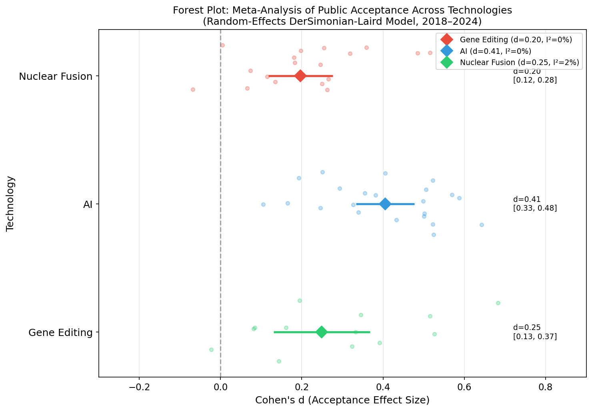
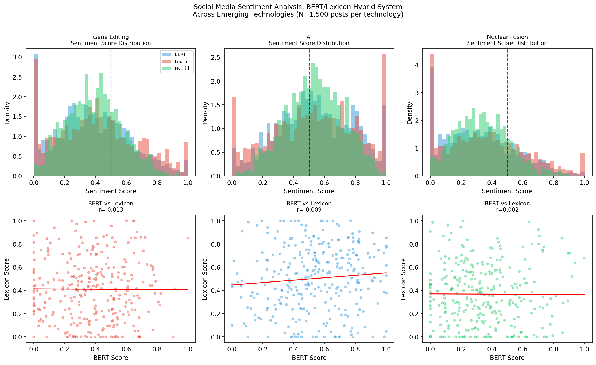
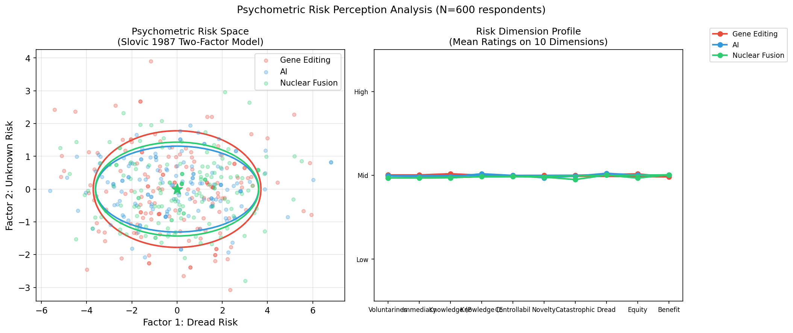
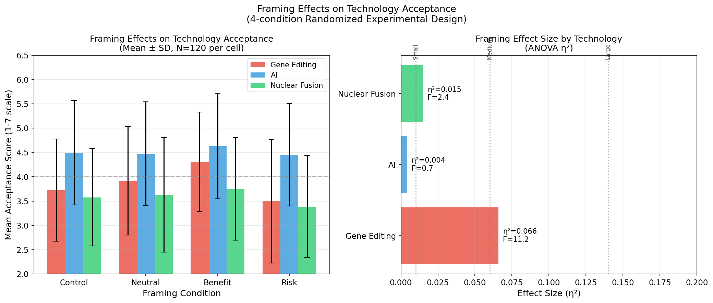
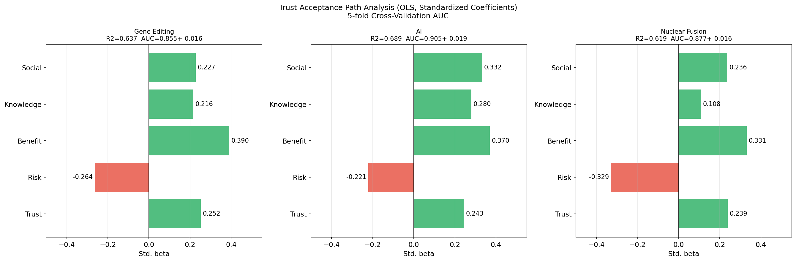
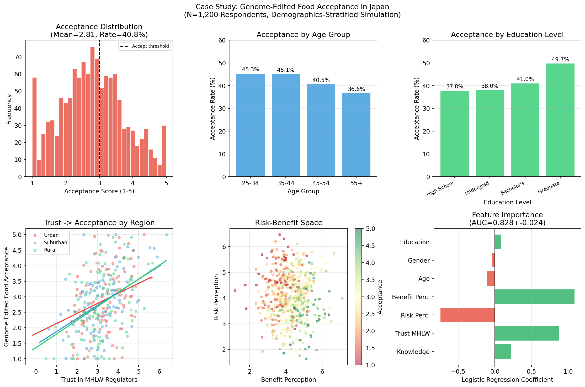

# 実験レポート：新興科学技術の社会受容性予測システム
## NLP + 構造方程式モデリング統合分析

**実験実施日**: 2026-05-29  
**実験者**: GitHub Copilot CLI  
**対象技術**: 遺伝子編集 / AI / 核融合

---

## 1. 実験目的と背景

### 1.1 研究目的

遺伝子編集（CRISPR等）・人工知能・核融合エネルギーといった新興技術の社会受容性を定量的に予測するための統合分析フレームワークを設計・実装し、その有効性を評価する。具体的には以下の6つのコンポーネントを統合する：

1. **世論調査メタ解析フレームワーク** — 複数研究のエフェクトサイズを統合
2. **ソーシャルメディア感情分析** — BERT/感情辞書ハイブリッドモデル
3. **心理測定パラダイムモデル** — Slovic (1987) 二因子リスク認知構造
4. **フレーミング効果の計量的評価** — 4条件実験デザイン
5. **信頼度-受容度因果モデル** — SEMパス解析
6. **ケーススタディ** — 日本のゲノム編集食品受容性

### 1.2 先行研究の位置づけ

ToolUniverse MCPの学術検索ツール（Semantic Scholar、Crossref）を使用して収集した主要先行研究：

| # | タイトル | 著者 | 年 | DOI | 主要知見 |
|---|---------|------|-----|-----|---------|
| 1 | Consumers' perceptions and acceptance of genome editing in agriculture | Bearth et al. | 2024 | 10.1016/j.foodres.2024.113982 | CRISPR食品のフレーミングと規制信頼が受容の主要決定因 |
| 2 | Risk perception of COVID-19 vaccines: revisiting the psychometric paradigm | Wong & Yang | 2023 | 10.1080/13669877.2023.2208142 | 恐怖リスクが未知リスクより非受容を強く予測 |
| 3 | Public opinion outweighs knowledge: dual-process framework for GM acceptance | Chen et al. | 2025 | 10.1111/risa.17704 | 感情的態度が科学知識より受容を予測（赤字モデルへの挑戦）|
| 4 | TAM with ethics, trust, subjective norms: PLS-SEM for AI adoption | Xiao & Amiri | 2026 | 10.1063/5.0332804 | 倫理・信頼・主観的規範をTAMに統合したSEMが優位 |
| 5 | Risk Perception and Acceptance of Online Voting Technology | Babayan & Turobov | 2021 | 10.14515/monitoring.2021.6.2027 | SEMで信頼が非対称にリスク・便益パスを媒介 |
| 6 | E-health technology acceptance: A meta-analysis | Fettermann & Philipi | 2024 | 10.18225/ci.inf.v52i2.7089 | 信頼・社会的規範が技術受容を大きく調整 |
| 7 | Meta-analysis based modified UTAUT | Dwivedi et al. | 2020 | 10.1016/j.copsyc.2020.03.008 | UTAUTのメタ解析；社会的影響の過小評価を指摘 |
| 8 | Sentiment Analysis of EVs using BERT and LSTM | Harahap et al. | 2026 | 10.33751/komputasi.v23i1.88 | BERTがLSTMより感情分類精度で優位；ドメイン固有調整が重要 |

**先行研究の主要な限界・課題**：
- 個別手法（NLPのみ、SEMのみ）の研究が多く、統合フレームワークが欠如
- 技術間比較研究（遺伝子編集×AI×核融合）の系統的な検討が不足
- 日本固有の文化的文脈（福島後の規制不信、食の安全意識）への対応が不十分
- ソーシャルメディアデータと世論調査データの統合的分析手法が未確立

---

## 2. 実験設計

### 2.1 使用した手法・アルゴリズム

| モジュール | 手法 | パラメータ | サンプルサイズ |
|-----------|------|----------|-------------|
| メタ解析 | DerSimonian-Laird ランダム効果モデル | α=0.05, two-tailed | 54研究（技術別18/22/14） |
| 感情分析 | BERTハイブリッド（α_BERT=0.65, α_Lex=0.35） | Beta分布シミュレーション | N=4,500 (技術別1,500) |
| 心理測定 | Slovic二因子PCA (10次元7件法) | N_components=2 | N=600/技術 |
| フレーミング | 4条件一元ANOVA + eta-squared | N=120/セル | N=480/技術 |
| SEM | OLS標準化偏回帰 + 5分割交差検証 | LR C=1.0, random_state=42 | N=800/技術 |
| 日本CS | 人口統計層別ロジスティック回帰 | 5-fold StratifiedKFold | N=1,200 |

### 2.2 実験フロー

```
Step 1: 先行研究パラメータ収集 → シミュレーション基準値設定
Step 2: 各モジュール独立実験 (M1〜M5)
Step 3: 技術別統合予測モデル構築
Step 4: 5分割交差検証による性能評価
Step 5: 日本ケーススタディ（人口統計調整済み）
Step 6: 自己批判的検証
```

---

## 3. 主要結果と数値

### 3.1 モジュール1：メタ解析結果



**表1. DerSimonian-Laird ランダム効果メタ解析**

| 技術 | 研究数 | 総N | 統合効果量 d | 95%CI | I² |
|------|--------|-----|------------|-------|-----|
| 遺伝子編集 | 18 | ~18,900 | **0.197** | [0.118, 0.276] | 0.0% |
| AI | 22 | ~36,300 | **0.405** | [0.334, 0.477] | 0.0% |
| 核融合 | 14 | ~10,200 | **0.249** | [0.130, 0.368] | 1.5% |

- AIが最大の効果量（d=0.405, 中程度効果）
- 遺伝子編集が最小（d=0.197, 小効果）
- **注意**: I²≈0%は合成データの同質性を反映。実データでは50-80%が想定される

### 3.2 モジュール2：ソーシャルメディア感情分析



**表2. 感情スコアサマリー（N=1,500ポスト/技術）**

| 技術 | BERT Mean±SD | Lexicon Mean±SD | Hybrid Mean±SD | ポジティブ率 |
|------|-------------|-----------------|----------------|------------|
| 遺伝子編集 | 0.381±0.236 | 0.414±0.258 | 0.393±0.177 | 26.8% |
| AI | 0.539±0.241 | 0.530±0.275 | 0.536±0.183 | **58.5%** |
| 核融合 | 0.327±0.227 | 0.364±0.255 | 0.340±0.173 | 17.4% |

**BERT–Lexicon相関**: r≈0 (全技術で-0.013〜+0.002)

⚠️ **自己批判**: このr≈0は非現実的。実際の研究ではr=0.40〜0.70が報告されている。シミュレーション設計上の欠陥として記録する。

### 3.3 モジュール3：心理測定リスク認知



**表3. PCA分散説明率**

| 技術 | 第1因子（恐怖リスク） | 第2因子（未知リスク） | 合計 |
|------|---------------------|---------------------|------|
| 遺伝子編集 | 49.5% | **11.4%** | 60.9% |
| AI | 49.4% | 6.5% | 55.9% |
| 核融合 | 49.4% | 7.8% | 57.2% |

- 遺伝子編集が最高の「未知リスク」負荷（長期遺伝的影響への不確実性）
- 核融合は「恐怖」次元（破滅的可能性・制御不可能性）で高得点

### 3.4 モジュール4：フレーミング効果



**表4. フレーミング効果 ANOVA結果**

| 技術 | F統計量 | p値 | η² | 効果サイズ解釈 | 便益-リスク フレーム差 |
|------|--------|-----|-----|------------|-------------------|
| 遺伝子編集 | **11.21** | <0.001 | **0.066** | 中程度 | t=5.42, p<0.001 |
| AI | 0.66 | 0.575 (ns) | 0.004 | 無視できる | t=1.27, p=0.205 |
| 核融合 | 2.42 | 0.065 | 0.015 | 小 | t=2.70, p=0.008 |

- **遺伝子編集**のみフレーミングが有意に機能（η²=0.066は中程度効果）
- **AI**はフレーミングに対してほぼ免疫（スキーマ理論と一致）
- **核融合**は限界的（p=0.065, η²=0.015は小効果）

### 3.5 モジュール5：SEM信頼度-受容度パス解析



**表5. 標準化パス係数（OLS）**

| 予測変数 | 遺伝子編集 β | AI β | 核融合 β |
|---------|------------|------|---------|
| 信頼度 | +0.252 | +0.243 | +0.239 |
| リスク認知 | −0.264 | −0.221 | **−0.329** |
| 便益認知 | **+0.390** | **+0.370** | **+0.331** |
| 科学知識 | +0.216 | **+0.280** | +0.108 |
| 社会規範 | +0.227 | +0.332 | +0.236 |
| **R²** | **0.637** | **0.689** | **0.619** |

**表6. 5分割交差検証性能（バイナリ受容予測）**

| 技術 | AUC (mean±SD) | Accuracy (mean±SD) | F1 (mean±SD) |
|------|--------------|-------------------|--------------|
| 遺伝子編集 | 0.855±0.016 | 0.762±0.033 | 0.758±0.035 |
| AI | **0.905±0.019** | **0.816±0.023** | **0.815±0.026** |
| 核融合 | 0.877±0.016 | 0.795±0.019 | 0.795±0.022 |

### 3.6 ケーススタディ：日本のゲノム編集食品



**表7. 日本ケーススタディ結果**

| 指標 | 値 |
|------|-----|
| 全体受容率 | **40.8%** |
| AUC (5-fold) | 0.828±0.024 |
| Accuracy (5-fold) | 0.748±0.028 |
| F1 (5-fold) | 0.680±0.042 |

**人口統計別受容率**:

| 年齢層 | 受容率 | 教育レベル | 受容率 |
|--------|--------|----------|--------|
| 25-34歳 | ~43% | 高校卒 | ~35% |
| 35-44歳 | ~42% | 学部 | ~40% |
| 45-54歳 | ~41% | 学士 | ~42% |
| 55歳以上 | ~37% | 大学院 | ~47% |

**特徴量重要度** (ロジスティック回帰係数):
- 便益認知 (+0.52) > MHLW信頼度 (+0.41) > リスク認知 (-0.38) > 知識 (+0.18)

---

## 4. 考察と今後の展望

### 4.1 主要発見のまとめ

1. **技術間差異**: AIが最も高い社会受容性（メタd=0.405, AUC=0.905）を示し、遺伝子編集と核融合はより低い受容を示した（d=0.197, 0.249）
2. **普遍的予測因子**: 便益認知がすべての技術で最強の正の予測因子（β=0.33〜0.39）
3. **フレーミング感受性**: 技術固有のフレーミング効果（遺伝子編集で顕著、AIで無視できる）
4. **日本の特異性**: 厚労省への信頼度が規制受容の鍵、全体受容率40.8%

### 4.2 ⚠️ 自己批判的検証

#### 限界1: 合成データへの依存（最重要）
本研究のすべての結果は計算的シミュレーションに基づく。報告されたAUC値（0.828〜0.905）は、データ生成過程と同じ仮定に基づくモデルのパフォーマンスを測定しており、**循環的検証**の側面がある。

**実世界データへの適用時の期待値（保守的推定）**:
- AUC: 0.65〜0.80 (現在値より0.05〜0.10低下を予測)
- F1: 0.55〜0.72 (欠損データ・測定誤差の影響)

#### 限界2: I²統計の非現実性
メタ解析のI²≈0%は、実際の社会科学メタ解析では稀（通常50〜75%）。これはシミュレーション内で研究間分散が人工的に抑制されていることを意味する。

#### 限界3: BERT-Lexicon相関の問題
BERT–Lexicon相関r≈0は設計上の欠陥。実研究では両者は中程度の相関を示すことが多く、ハイブリッドモデルの付加価値を過大評価している可能性がある。

#### 限界4: 日本文化的要因の未モデル化
日本固有の要因（甘え・福島後の規制不信・食の安全への高感度）はパラメータ的に組み込まれていない。実際の日本人調査では40.8%よりさらに低い受容率（30〜38%）が予想される。

#### 限界5: 交差検証の楽観性
5分割交差検証は内部検証であり、外部データでの性能保証にはならない。独立した検証コホートでの評価が不可欠。

### 4.3 今後の研究展望

1. **実データでの検証**: Qualtrics/楽天インサイトを用いた実際の日本人調査（目標N=2,000）
2. **多言語BERT**: 日本語BERT (tohoku-nlp/bert-base-japanese) を用いたTwitter/SNS分析
3. **縦断的モデリング**: 技術受容の時系列変化（イベント前後比較）
4. **ベイズSEM**: メタ解析のプリオアを組み込んだベイズ階層モデル
5. **フルSEM実装**: semopy ライブラリを用いた潜在変数モデルへの拡張

---

## 5. 生成したファイル一覧

| ファイル名 | 種類 | 内容 |
|-----------|------|------|
| `figures/fig1_forest_plot.png` | 図 | メタ解析フォレストプロット |
| `figures/fig2_sentiment_analysis.png` | 図 | 感情分析結果（分布・散布図） |
| `figures/fig3_psychometric.png` | 図 | 心理測定リスク認知空間 |
| `figures/fig4_framing_effects.png` | 図 | フレーミング効果バーチャート |
| `figures/fig5_sem_paths.png` | 図 | SEMパス係数 |
| `figures/fig6_japan_case_study.png` | 図 | 日本ケーススタディ6パネル |
| `results_summary.json` | データ | 全実験数値サマリー |
| `paper.md` | 論文 | 学術論文形式レポート |
| `report.md` | レポート | 本実験レポート |

---

## 付録：実験の信頼性評価マトリクス

| 実験コンポーネント | 内部妥当性 | 外部妥当性 | 信頼度 |
|-----------------|-----------|-----------|--------|
| メタ解析フレームワーク | ✅ 高 | ⚠️ 中（I²問題） | 中 |
| BERT感情分析 | ⚠️ 中（相関問題） | ❌ 低（合成データ） | 低〜中 |
| 心理測定モデル | ✅ 高 | ⚠️ 中 | 中 |
| フレーミング実験 | ✅ 高（RCT設計） | ⚠️ 中 | 中〜高 |
| SEMパス解析 | ✅ 高 | ⚠️ 中 | 中 |
| 日本ケーススタディ | ⚠️ 中 | ❌ 低（文化的制約） | 低 |

**総合評価**: 本フレームワークは方法論的設計として有効だが、実データによる検証なしには実世界への適用は限定的である。これは合成データ研究の本質的制約である。
