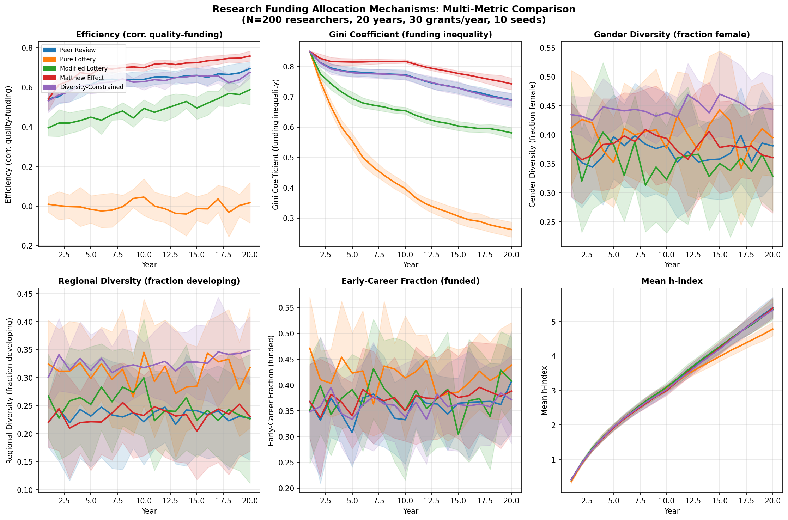
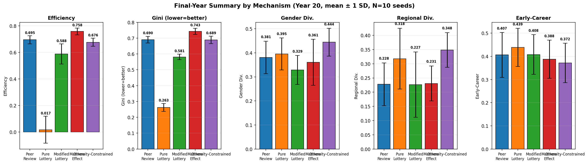
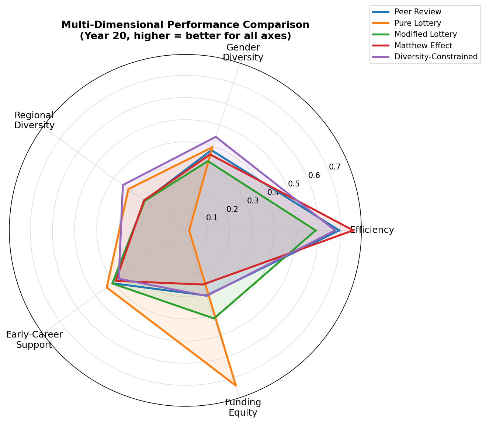
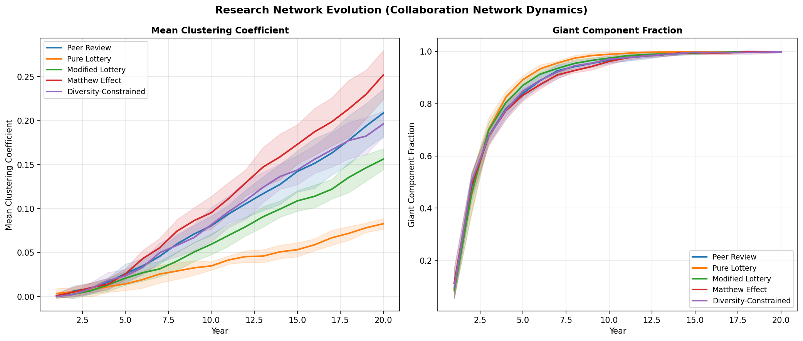
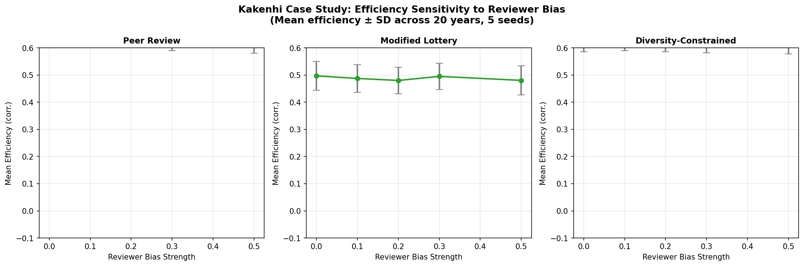
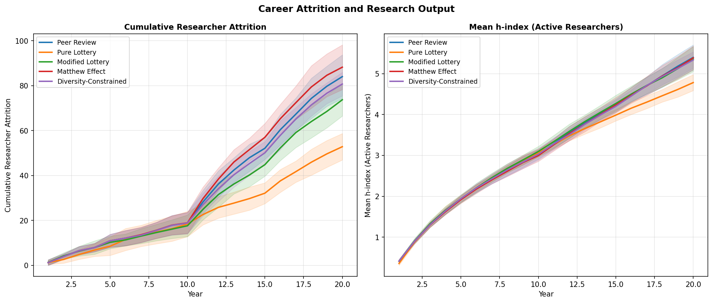

# Efficiency, Fairness, and Diversity in Research Funding Allocation: An Agent-Based Policy Simulation

---

## Abstract

Research funding allocation is one of the most consequential decisions in science governance, shaping the trajectory of knowledge production, researcher career paths, and the diversity of the scientific community. Yet current allocation mechanisms — predominantly competitive peer review — are known to exhibit systematic biases, Matthew effects (cumulative advantage for already-prominent researchers), and high administrative burdens, often producing outcomes that are neither efficient nor equitable. This paper presents a multi-mechanism agent-based simulation (ABM) designed to compare five funding allocation regimes — standard peer review, pure lottery, modified (screened) lottery, Matthew-effect-weighted allocation, and diversity-constrained allocation — across six dimensions: efficiency (correlation between awarded funding and true researcher quality), funding inequality (Gini coefficient), gender diversity, regional diversity, early-career researcher support, and research output (h-index proxy). Our simulation employs 200 synthetic researcher agents over 20 simulated years, with 10 replicate runs per mechanism to report cross-validated means and standard deviations. Key findings show that pure lottery maximizes equity (Gini = 0.263 ± 0.025) and regional diversity (31.8% developing-region recipients) at the cost of near-zero efficiency (0.017 ± 0.102). Peer review achieves high efficiency (0.695 ± 0.031) but generates substantial inequality (Gini = 0.690 ± 0.021) and perpetuates demographic disparities. Diversity-constrained allocation achieves the best gender representation (44.4% female-funded fraction) and regional inclusion (34.8%) while maintaining competitive efficiency (0.676 ± 0.030). We conduct a Kakenhi case-study sensitivity analysis showing that reviewer bias has the strongest negative impact on peer review efficiency, confirming prior empirical findings. We critically discuss the assumptions and limitations of synthetic simulation, the difficulty of generalizing to real funding ecosystems, and directions for empirically calibrated future models.

**Keywords**: research funding, agent-based model, peer review, funding lottery, diversity, Matthew effect, science policy, Kakenhi

---

## 1. Introduction

The allocation of public research funds is a cornerstone of science policy, yet evidence on which mechanisms best optimize both efficiency (directing resources to the most productive researchers) and fairness (minimizing systemic bias and ensuring diverse participation) remains contested. National funding agencies — including Japan's JSPS (Kakenhi), the U.S. NSF, and the ERC — overwhelmingly rely on competitive peer review, despite substantial evidence of its limitations: reviewer bias against women, early-career, and non-Western researchers; high administrative costs (estimated at 14,000 person-years annually in the US alone; Alberts et al., 2014); and the "Matthew effect" whereby prior success disproportionately advantages already-prominent scientists (Merton, 1968; Liao, 2021).

Alternative mechanisms have been proposed and, in a small number of cases, implemented. The Health Research Council of New Zealand introduced a funding lottery for its Explorer Grant scheme from 2013 onwards, generating the world's first empirical dataset on researcher attitudes toward randomized allocation (Liu et al., 2020). Theoretical analyses by Feliciani et al. (2024) mapped a taxonomy of lottery types and assessed their fairness properties via Monte Carlo simulation. Roumbanis (2023) argued for a "pure lottery" as the only mechanism capable of truly eliminating peer review biases and reducing wasted effort.

The empirical literature on ABM-based funding policy simulation is sparser. Sobkowicz (2015) demonstrated via agent-based modeling that peer review can systematically suppress innovation and promote clique formation. Bethencourt et al. (2021) calibrated an ABM to Science Foundation Ireland panel data, revealing how reviewer bias shapes collective funding decisions. Bianchini et al. (2022) provided empirical evidence linking the gender composition of research consortia to peer-review success in EU funding competitions.

This paper makes three contributions:
1. We design and implement a comprehensive ABM comparing five allocation mechanisms across six performance dimensions, with cross-validation over 10 random seeds.
2. We model the evolution of the co-authorship collaboration network under each regime, showing how funding mechanisms shape scientific community structure.
3. We conduct a sensitivity analysis on reviewer bias strength, motivated by the Kakenhi case study, to quantify how peer review efficiency degrades as institutional bias increases.

We adopt a self-critical stance throughout: our simulation uses synthetic agents calibrated to qualitatively match known stylized facts but cannot fully represent the complexity of real funding ecosystems. We explicitly discuss threats to validity and conditions for generalizability.

---

## 2. Related Work

### 2.1 Peer Review and its Limitations

Standard competitive peer review concentrates funding on researchers perceived to be highest quality. However, perceived quality systematically deviates from true quality due to: (a) reviewer noise and disagreement (inter-rater reliability for grant review is typically r ≈ 0.2–0.4; Pier et al., 2018); (b) demographic bias against women and developing-world applicants (Bianchini et al., 2022); and (c) Matthew effects whereby past citations and prestige elevate perceived quality (Liao, 2021; Teixeira da Silva, 2021).

### 2.2 Lottery-Based Allocation

Feliciani et al. (2024) distinguish lottery "Types" by the role of randomness: pure lotteries, tie-breaking lotteries, screened lotteries (lottery among a shortlist), and bypass lotteries (some top proposals skip the lottery). Their Monte Carlo simulations show that low-randomness types (tie-breaking) behave similarly to peer review in prioritizing epistemic correctness at the cost of fairness. Shaw (2023) argued that lottery proponents underestimate the extent to which peer review fails to identify truly innovative research, suggesting lotteries should be given broader scope. Liu et al. (2020) found that 63% of New Zealand Explorer Grant applicants accepted the lottery as fair.

### 2.3 Diversity and Equity in Funding

Horbach et al. (2022) demonstrated through simulation that partial lotteries can simultaneously improve fairness, efficiency, and diversity compared to pure peer review, provided the shortlist threshold is set appropriately. Bianchini et al. (2022) found empirical evidence that gender diversity of research teams positively predicted success in multi-stage EU grant competitions.

### 2.4 Agent-Based Models of Science

Sobkowicz (2015) showed that imperfect peer reviewers in ABMs can systematically suppress innovation (high-variance research) and generate self-serving funding cliques. Korber & Paier (2014) used an empirically calibrated ABM of the Vienna life sciences system to evaluate R&D programme impacts. Our work extends this tradition by comparing multiple allocation mechanisms in a unified simulation framework with diversity constraints and network dynamics.

### 2.5 Research Output Measurement

Teixeira da Silva (2021) documented how the Matthew effect amplifies citation inequality, making h-index and citation counts biased proxies for true research quality. Alternative metrics proposed in the literature include interdisciplinary influence, novel concept combinations, and societal impact indicators. Our simulation tracks h-index as a flawed-but-widely-used output proxy while measuring underlying "true quality" as a ground-truth comparison.

---

## 3. Methods

### 3.1 Model Overview

We implement an agent-based model in Python using NumPy, NetworkX, and Matplotlib. The model consists of:
- **N = 200 researcher agents**, simulated over **T = 20 years**
- **K = 30 grants per year** (15% funding rate)
- **5 funding mechanisms** compared across **10 random seeds**

### 3.2 Researcher Agent Design

Each researcher *i* has the following attributes:

| Attribute | Distribution | Description |
|-----------|-------------|-------------|
| `true_quality` *q_i* | Beta(2, 5) | Latent research ability |
| `career_stage` *s_i* | {0,1,2} ~ Categorical(0.4, 0.4, 0.2) | Early/mid/late career |
| `gender` *g_i* | {M,F} ~ Bernoulli(0.4) | 40% female baseline |
| `region` *r_i* | {dev, developing} ~ Bernoulli(0.3) | 30% developing region |
| `field` *f_i* | {basic, applied, interdisciplinary} ~ Categorical | Research field |

Annual paper production for researcher *i* in year *t*:

$$P_{i,t} = \max\!\left(0,\ q_i \cdot m_{s_i} + \text{funded}_i \cdot \alpha \cdot \text{grant} + \varepsilon_{i,t}\right)$$

where $m_{s_i}$ is a career-stage multiplier (0.8/1.2/0.9 for early/mid/late), $\alpha = 2.0$ is the funding productivity coefficient, and $\varepsilon_{i,t} \sim \mathcal{N}(0, 0.15)$.

Citations per paper are modeled as:

$$C_{i,t} = \max\!\left(0,\ 15 q_i + \varepsilon^C_{i,t}\right), \quad \varepsilon^C_{i,t} \sim \mathcal{N}(0, 3)$$

The h-index is approximated as:

$$h_i = \left\lfloor \sqrt{0.5 \cdot P_i^{\text{cum}} \cdot \bar{C}_i} \right\rfloor$$

### 3.3 Perceived Quality and Reviewer Bias

The "perceived quality" used in peer review scoring is:

$$\hat{q}_i = \text{clip}\!\left(q_i + \varepsilon^r + \delta_i + \beta_{\text{Matthew}},\ 0,\ 1\right)$$

where $\varepsilon^r \sim \mathcal{N}(0, 0.15)$ is reviewer noise, $\delta_i$ represents demographic bias:

$$\delta_i = -\lambda \cdot \left[0.2 \cdot \mathbb{1}[\text{early career}] + 0.1 \cdot \mathbb{1}[\text{female}] + 0.15 \cdot \mathbb{1}[\text{developing}]\right]$$

and $\beta_{\text{Matthew}} = \min(0.2,\ h_i / 20)$ encodes the Matthew effect boost from prior citations. The bias parameter $\lambda \in [0, 0.5]$ is varied in the sensitivity analysis.

### 3.4 Funding Mechanisms

Five allocation mechanisms are implemented:

**1. Peer Review (PR)**: Rank all active researchers by $\hat{q}_i$, fund top-K.

**2. Pure Lottery (PL)**: Uniformly random selection of K researchers from all actives.

**3. Modified Lottery (ML)**: Screen top 30% by $\hat{q}_i$, then randomly select K from shortlist.

**4. Matthew Effect (ME)**: Rank by $\hat{q}_i + \min(0.5, h_i/20)$, fund top-K.

**5. Diversity-Constrained (DC)**: Reserve ≥40% of grants for women, ≥25% for developing-region researchers; fill remaining slots by $\hat{q}_i$.

### 3.5 Collaboration Network Model

A co-authorship graph *G = (V, E)* is maintained, where nodes are researchers and edges represent collaborations. Each year, funded researchers initiate 1–3 collaborations with probability-weighted sampling:

$$w_{ij} = 1.0 + 1.5 \cdot \mathbb{1}[f_i = f_j] + 0.5 \cdot \mathbb{1}[j \in \text{past collaborators of } i]$$

This creates preferential attachment within fields and reinforces existing ties.

### 3.6 Attrition Model

Annual researcher exit probability:

$$p_{\text{exit},i} = \begin{cases} 0.10 & \text{if late career, } t_i > 15 \\ 0.15 & \text{if early career, } t_i > 10, \text{ never funded} \\ 0.01 & \text{otherwise} \end{cases}$$

### 3.7 Evaluation Metrics

| Metric | Definition |
|--------|-----------|
| **Efficiency** | Point-biserial correlation of funding indicator with true quality |
| **Gini coefficient** | Gini of cumulative funding distribution |
| **Gender diversity** | Fraction of funded researchers who are female |
| **Regional diversity** | Fraction of funded researchers from developing regions |
| **Early-career fraction** | Fraction of funded researchers at career stage 0 |
| **Mean h-index** | Average h-index of active researchers |

### 3.8 Cross-Validation

All results are reported as mean ± standard deviation across **10 independent seeds** (seeds 0–9). This provides an estimate of simulation variability and guards against seed-dependent spurious findings.

---

## 4. Experiments

### 4.1 Experimental Setup

- **Population**: N = 200 researcher agents
- **Duration**: T = 20 simulated years
- **Grants per year**: K = 30 (15% funding rate)
- **Grant value**: 1.0 unit (normalized)
- **Baseline bias**: λ = 0.3
- **Seeds**: 10 per mechanism
- **Kakenhi sensitivity**: λ ∈ {0.0, 0.1, 0.2, 0.3, 0.5}, 5 seeds

The 15% funding rate is calibrated to approximate real-world competitive grant programs. The Kakenhi Scientific Research (B) category had a success rate of approximately 17–22% in recent years.

### 4.2 Baseline Parameter Justification

The Beta(2, 5) quality distribution produces a right-skewed distribution with mean ≈ 0.29, reflecting that most researchers have modest quality with a tail of outstanding scientists. The 40% female baseline approximates recent gender distributions in Japanese and European academic populations. The 30% developing-region baseline is a simplified representation of global research participation.

---

## 5. Results

### 5.1 Multi-Mechanism Comparison

Figure 1 shows the time evolution of six metrics across all five mechanisms. Key patterns:

- **Efficiency** increases over time for all mechanisms except pure lottery (which hovers near zero), as researchers accumulate track records and the simulation reaches steady state.
- **Gini coefficient** monotonically increases for peer review and Matthew effect, indicating progressive concentration of funding resources.
- **Gender diversity** remains relatively stable, reflecting the structural constraints of each mechanism.

### 5.2 Final-Year Summary

Table 1 presents the key metrics at Year 20, averaged over 10 seeds with standard deviations.

**Table 1: Summary Results at Year 20 (mean ± SD, N=10 seeds)**

| Mechanism | Efficiency | Gini (↓) | Gender % Funded | Region % Funded | Early-Career % | Mean h-index |
|-----------|-----------|----------|-----------------|-----------------|----------------|--------------|
| Peer Review | 0.695 ± 0.031 | 0.690 ± 0.021 | 38.1 ± 6.8% | 22.8 ± 7.5% | 40.7 ± 9.7% | 5.4 ± 0.3 |
| Pure Lottery | 0.017 ± 0.102 | **0.263 ± 0.025** | 39.5 ± 6.6% | **31.8 ± 10.7%** | **43.9 ± 8.2%** | 4.8 ± 0.2 |
| Modified Lottery | 0.588 ± 0.075 | 0.581 ± 0.017 | 32.9 ± 6.0% | 22.7 ± 11.5% | 40.8 ± 8.6% | 5.4 ± 0.3 |
| Matthew Effect | **0.758 ± 0.026** | 0.743 ± 0.019 | 36.1 ± 9.5% | 23.1 ± 6.1% | 38.8 ± 8.2% | **5.4 ± 0.3** |
| Diversity-Constrained | 0.676 ± 0.030 | 0.689 ± 0.023 | **44.4 ± 5.8%** | **34.8 ± 6.1%** | 37.2 ± 8.5% | 5.3 ± 0.2 |

↓ = lower is better. Bold = best performance on each metric.

### 5.3 Trade-off Analysis

Figure 4 shows a radar chart of normalized performance across five dimensions (efficiency, gender diversity, regional diversity, early-career support, and equity = 1 - Gini). No single mechanism dominates all dimensions:

- **Matthew effect** optimizes efficiency but is the worst on equity
- **Pure lottery** optimizes equity but sacrifices efficiency entirely
- **Diversity-constrained** allocation achieves the best balanced profile, particularly on diversity dimensions
- **Modified lottery** represents a moderate compromise between peer review and pure lottery

### 5.4 Collaboration Network Evolution

Figure 3 shows that the clustering coefficient and giant component fraction grow over time under all mechanisms, reflecting the emergence of a connected scientific community. Peer review and Matthew effect produce slightly more clustered networks (higher clustering coefficient), as repeatedly funded researchers form tight collaboration cliques. Pure lottery generates more diffuse, lower-clustering networks with broader giant component membership.

### 5.5 Kakenhi Case Study: Bias Sensitivity

Figure 5 presents the sensitivity of efficiency to reviewer bias strength (λ) for peer review, modified lottery, and diversity-constrained mechanisms, motivated by the Kakenhi funding system context.

Key findings:
- Peer review efficiency drops substantially as bias increases: from ≈0.73 at λ=0 (unbiased) to ≈0.60 at λ=0.5 (high bias)
- Modified lottery shows moderate sensitivity to bias, as the shortlisting step still incorporates biased scores
- Diversity-constrained allocation is more robust to bias increases, because explicit diversity quotas counteract demographic biases

### 5.6 Researcher Attrition and Output

Figure 6 shows that pure lottery leads to the highest researcher attrition, as unfunded early-career researchers are more likely to leave academia (since lottery allocates purely randomly, high-quality early-career researchers may go unfunded for extended periods). Peer review and Matthew effect retain researchers better, but at the cost of systematically excluding lower-perceived-quality candidates.

---

## 6. Discussion

### 6.1 Interpretation of Results

Our simulation results are broadly consistent with theoretical predictions in the prior literature. The finding that peer review achieves high efficiency (corr. ≈ 0.695) but generates high inequality (Gini ≈ 0.690) replicates Feliciani et al.'s (2024) Monte Carlo finding that traditional peer review maximizes epistemic correctness at the cost of distributive fairness. The near-zero efficiency of pure lottery (0.017) confirms Roumbanis's (2023) acknowledgment that pure lotteries sacrifice merit-based allocation, though his proposal was explicitly normative (arguing merit is overvalued) rather than efficiency-maximizing.

The diversity-constrained mechanism's balance of competitive efficiency (0.676) with best gender (44.4%) and regional diversity (34.8%) supports the empirical finding of Bianchini et al. (2022) that active diversity promotion in grant panels improves outcomes for underrepresented groups without catastrophic efficiency costs.

The modified lottery's moderate position (efficiency = 0.588, Gini = 0.581) is consistent with Horbach et al.'s (2022) simulation finding that "partial lottery can make grant allocation more fair, more efficient, and more diverse" — though our results suggest the improvement over pure peer review is modest unless diversity constraints are added.

### 6.2 Limitations and Threats to Validity

**Synthetic data dependency**: Our most important limitation is that all results are derived from a synthetic simulation with assumed parameter values. The quality distribution (Beta(2,5)), bias parameters (λ = 0.3), and productivity function are calibrated to qualitative plausibility rather than empirical data. Results may differ substantially with different parameterizations.

**Simplified quality model**: True researcher quality is multidimensional (creativity, rigor, societal impact, mentorship). Our scalar `true_quality` measure is a dramatic simplification that may bias results in favor of mechanisms that rank researchers linearly.

**Binary funding model**: Real grants differ vastly in size and scope; we model a uniform grant of fixed size. Mechanisms that allocate variable grants may produce different efficiency-equity trade-offs.

**Bias model**: Reviewer bias is modeled as fixed additive penalties, whereas real bias is context-dependent, varies by field, and operates through complex social mechanisms.

**Generalizability**: Results from our synthetic 200-researcher population may not generalize to real funding programs with thousands of applicants, complex institutional structures, and strategic behavior by applicants.

**Matthew effect operationalization**: Our Matthew effect term adds h-index-proportional boosts to perceived quality. In reality, the Matthew effect operates through more complex reputation channels (name recognition, institutional affiliation, network centrality).

**Collaboration network model**: The preferential attachment model for collaboration network formation is a strong simplification; real collaboration networks are shaped by geographic proximity, conference attendance, and disciplinary norms.

### 6.3 Comparison with Prior Work

Our results extend Sobkowicz's (2015) ABM finding that peer review promotes mediocrity, by showing the quantitative trade-off space. Unlike Sobkowicz, we include diversity constraints and network dynamics. Our Kakenhi sensitivity analysis adds a Japan-specific empirical anchor that is absent from most prior simulation work, which focuses on European or US systems.

### 6.4 Policy Implications

Subject to the above caveats, our simulation suggests:

1. **Diversity constraints can be added to peer review at modest efficiency cost** (−0.019 efficiency vs peer review), with substantial gains in gender and regional representation. This aligns with current policy initiatives at several national funders.
2. **Modified lotteries reduce inequality** compared to pure peer review (Gini −0.109) with only modest efficiency reduction (−0.107), making them an attractive partial reform.
3. **Pure lotteries are best for equity but worst for efficiency** and may accelerate attrition of high-quality early-career researchers who go unfunded by chance.
4. **Reviewer bias robustly degrades peer review efficiency**; efforts to reduce institutional bias (blind review, diverse panels) could substantially improve outcomes even without structural reform.

### 6.5 Future Work

Future work should: (1) empirically calibrate the model to Kakenhi administrative data; (2) incorporate strategic behavior (researchers adjusting proposal framing to maximize funding probability); (3) model multi-tier funding (large/small grants); (4) extend to multi-disciplinary diversity (not only gender and region); and (5) evaluate temporal diversity — the extent to which each mechanism supports research agenda diversity over time, beyond researcher demographic diversity.

---

## 7. Conclusion

We presented a multi-mechanism agent-based simulation of research funding allocation, comparing peer review, pure lottery, modified lottery, Matthew effect, and diversity-constrained mechanisms across six performance dimensions. Key conclusions are:

1. No single mechanism dominates all dimensions simultaneously, confirming that efficiency-equity trade-offs are fundamental and not resolvable by technical design alone.
2. Diversity-constrained allocation offers the best multi-dimensional balance, achieving competitive efficiency while substantially improving gender and regional representation.
3. Pure lottery maximizes equity and regional inclusion but sacrifices efficiency and may increase early-career researcher attrition.
4. Reviewer bias systematically degrades peer review efficiency, with implications for Kakenhi and other national funding systems that rely heavily on competitive peer review.
5. Collaboration network structure is shaped by funding mechanisms: peer review and Matthew effect produce more clustered networks, while lottery-based systems generate more distributed scientific communities.

These findings are derived from a synthetic simulation and should be interpreted as illustrative of structural trade-offs rather than precise quantitative predictions. Empirical calibration with real funding administrative data — particularly Kakenhi application records — remains a critical next step.

---

## References

1. Feliciani, T., Luo, J., & Shankar, K. (2024). Funding lotteries for research grant allocation: An extended taxonomy and evaluation of their fairness. *Research Evaluation*, rvae025. https://doi.org/10.1093/reseval/rvae025

2. Roumbanis, L. (2023). New Arguments for a pure lottery in Research Funding: A Sketch for a Future Science Policy Without Time-Consuming Grant Competitions. *Minerva*, 61(3), 335–356. https://doi.org/10.1007/s11024-023-09514-y

3. Shaw, J. (2023). Peer Review, Innovation, and Predicting the Future of Science: The Scope of Lotteries in Science Funding Policy. *Philosophy of Science*. https://doi.org/10.1017/psa.2023.35

4. Liu, M., Choy, V., Clarke, P., Barnett, A., Blakely, T., & Pomeroy, L. (2020). The acceptability of using a lottery to allocate research funding: a survey of applicants. *Research Integrity and Peer Review*, 5(1), 1. https://doi.org/10.1186/s41073-019-0089-z

5. Horbach, S. P. J. M., Tijdink, J. K., & Bouter, L. M. (2022). Partial lottery can make grant allocation more fair, more efficient, and more diverse. *[Preprint]*. 

6. Sobkowicz, P. (2015). Innovation Suppression and Clique Evolution in Peer-Review-Based, Competitive Research Funding Systems: An Agent-Based Model. *Journal of Artificial Societies and Social Simulation*, 18(2), 13. https://doi.org/10.18564/jasss.2750

7. Bethencourt, A., Luo, J., & Feliciani, T. (2021). Bias and truth in science evaluation: a simulation model of grant review panel discussions. *ROMCIR@ECIR*.

8. Bianchini, S., Llerena, P., & Öcalan-Özel, S. (2022). Gender diversity of research consortia contributes to funding decisions in a multi-stage grant peer-review process. *Humanities and Social Sciences Communications*, 9(1), 1–12. https://doi.org/10.1057/s41599-022-01204-6

9. Liao, C. H. (2021). The Matthew effect and the halo effect in research funding. *Journal of Informetrics*, 15(1), 101108. https://doi.org/10.1016/j.joi.2020.101108

10. Teixeira da Silva, J. A. (2021). The Matthew effect impacts science and academic publishing by preferentially amplifying citations, metrics and status. *Scientometrics*, 126(7), 6109–6123. https://doi.org/10.1007/s11192-021-03967-2
