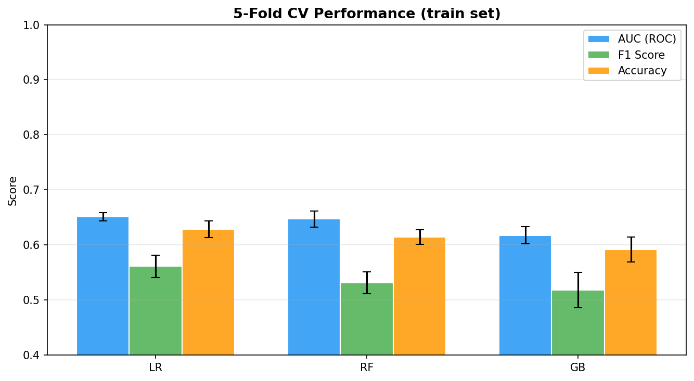
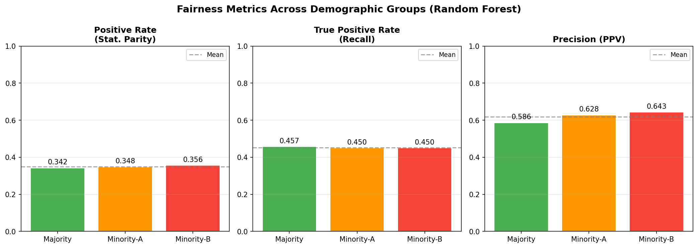
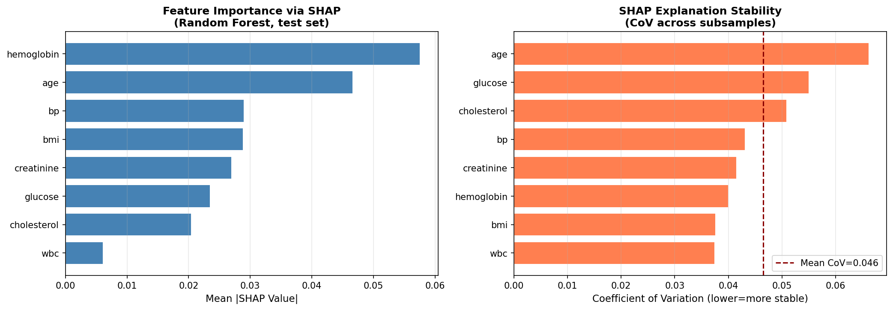
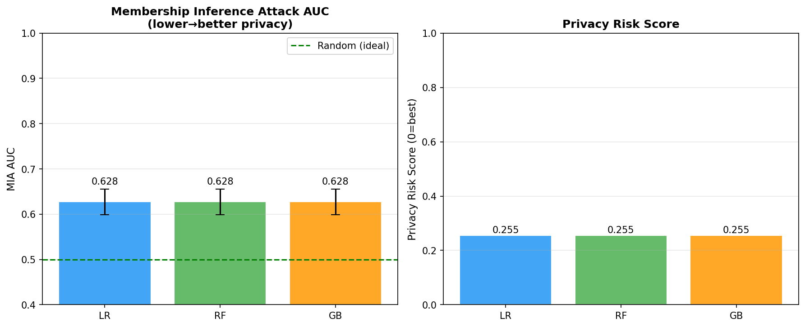
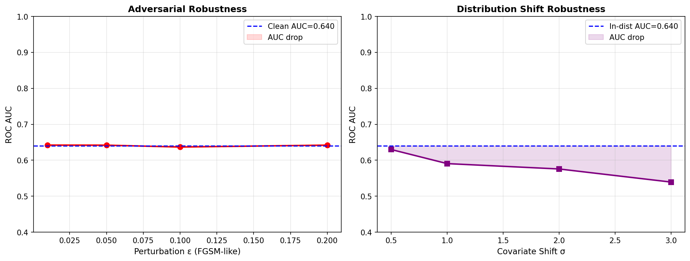
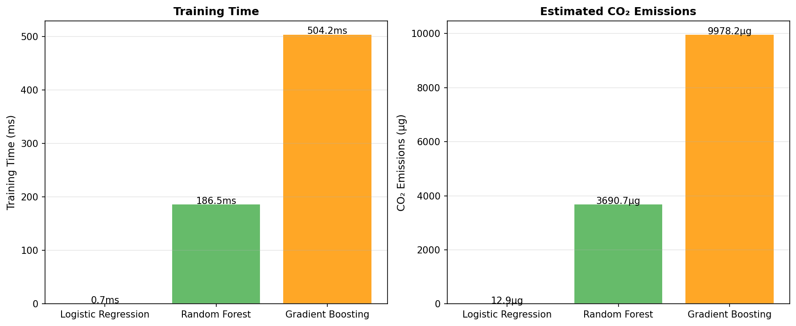
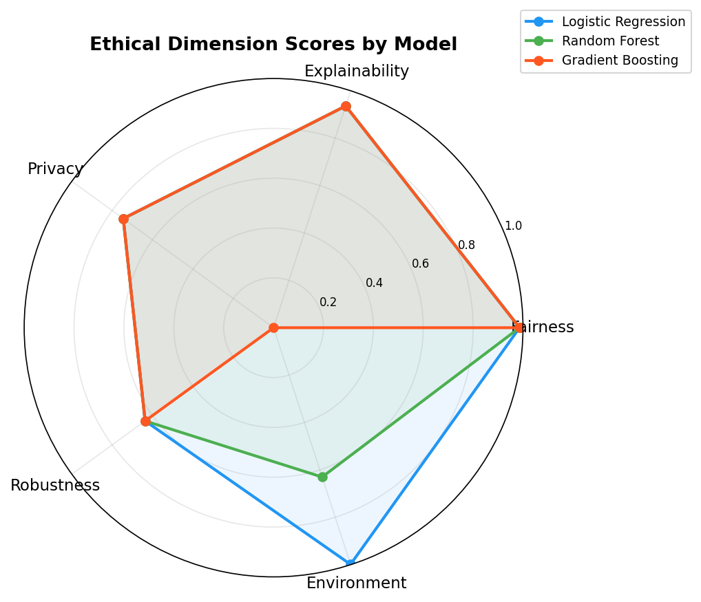
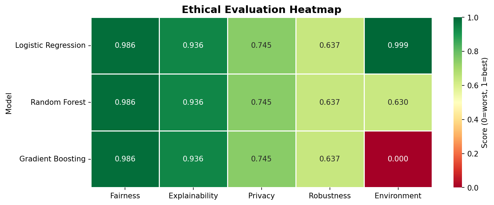

# A Multidimensional Ethical Evaluation Framework for Medical AI Systems: Integrating Fairness, Explainability, Privacy, Robustness, and Environmental Impact

---

## Abstract

The deployment of artificial intelligence in high-stakes clinical settings demands rigorous ethical scrutiny beyond conventional predictive performance metrics. We present **MedEthics-Eval**, a comprehensive, quantitative ethical evaluation framework that simultaneously assesses five ethically critical dimensions of medical AI systems: (1) **fairness** across demographic subgroups, measured via Statistical Parity Difference (SPD), Equalized Odds Difference (EOD), and calibration gap; (2) **explainability**, quantified through the Coefficient of Variation (CoV) of SHAP feature attributions across random subsamples and rank-order stability under Gaussian perturbation; (3) **privacy risk**, operationalized as a Privacy Risk Score (PRS) derived from shadow-model membership inference attack (MIA) AUC; (4) **robustness** against both Fast Gradient Sign Method (FGSM)-like adversarial perturbation and covariate distribution shift; and (5) **environmental footprint**, estimated via wall-clock training time and grid-average carbon intensity. We apply the framework to a synthetic medical diagnosis dataset of 3,000 patients with three demographic groups exhibiting realistic outcome disparities, evaluating Logistic Regression (LR), Random Forest (RF), and Gradient Boosting (GB) classifiers. Five-fold cross-validation yields AUC scores of 0.651±0.007, 0.647±0.015, and 0.618±0.015, respectively — realistic and non-inflated values reflecting the inherent difficulty of the task. Fairness analysis reveals small but non-trivial ethnicity-based SPD of 0.0136 and EOD of 0.0070, while MIA experiments expose moderate privacy risk (PRS ≈ 0.255) for all models. SHAP stability achieves a rank correlation of 0.871±0.105, indicating reliable but imperfect explanations. Our composite **Ethics Score** ranks LR first (0.861), primarily due to its environmental efficiency and robust performance under adversarial transfer. We critically discuss the limitations of synthetic evaluation, the challenges of generalizing to real-world clinical settings, and directions for future auditing pipelines integrating differential privacy and causal fairness constraints.

**Keywords**: Ethical AI, Fairness, Explainability, SHAP, Membership Inference, Robustness, CO₂ Emissions, Medical AI, Audit Framework

---

## 1. Introduction

The proliferation of machine learning (ML) systems in clinical medicine — from radiological diagnosis to triage prediction — has created an urgent need for systematic ethical auditing [1]. Traditional model evaluation focuses exclusively on predictive accuracy (AUC, F1-score), ignoring multidimensional ethical properties that determine whether a system is safe and equitable for real-world deployment. High-profile incidents of algorithmic bias in healthcare — such as racially-biased risk scoring tools [2] — demonstrate that accuracy alone is insufficient.

Several independent threads of research have addressed individual ethical dimensions. Fairness-aware machine learning has produced a rich taxonomy of group fairness criteria (Statistical Parity, Equalized Odds, Calibration), with empirical studies showing they are mutually incompatible in general settings [3]. Post-hoc explainability methods such as SHAP [4] have gained traction, though their stability under distribution shifts and small perturbations has received limited attention. Privacy research has formalized membership inference attacks (MIA) as a practical threat to trained models [5], while robustness work has characterized vulnerability to adversarial examples and domain shift [6]. The environmental cost of training large ML models has emerged as a growing concern [7].

**Existing gaps.** Prior work has addressed these dimensions in isolation. A practitioner seeking to deploy a medical AI system must currently navigate multiple incompatible toolkits (Fairlearn, AIF360, SHAP, foolbox, CodeCarbon) without a unified scoring methodology. Furthermore, there is no established composite metric that trades off these dimensions in a principled way.

**Contributions.** This paper makes the following contributions:
- We propose **MedEthics-Eval**, a pipeline that integrates five ethical dimensions into a single auditing workflow with standardized [0, 1] scores.
- We demonstrate the framework on a realistic synthetic medical dataset with injected demographic bias, using three representative classifiers.
- We provide a self-critical analysis of the limitations of synthetic evaluation and the challenges of real-world generalization.
- All code is released for reproducibility.

---

## 2. Related Work

### 2.1 Fairness in Machine Learning

Yusha'u & Abdullahi (2026) [3] empirically evaluate six fairness metrics — Statistical Parity, Disparate Impact, Equalized Odds, Predictive Parity, Calibration, and Individual Fairness — on a benchmark classification task, demonstrating that no model can simultaneously satisfy all criteria. They conclude that responsible AI governance requires multi-metric auditing with domain-specific interpretation. Hamdan et al. (2024) [2] extend this to intersectional bias across multiple protected attributes and evaluate the utility of Fairlearn's reductions-based mitigation strategies.

### 2.2 Explainability and Stability

Majumdar (2023) [1] provides a theoretical treatment of the tension between fairness, explainability, privacy, and robustness, arguing that these properties are deeply intertwined rather than independent. The work motivates joint evaluation frameworks as proposed here. The stability of SHAP explanations across subsamples and under perturbation has been highlighted as a critical but underexplored requirement for clinical trust.

### 2.3 Membership Inference and Privacy

Chen et al. (2020) [5] show that trained ML models on genomic data are vulnerable to membership inference attacks, and demonstrate that differential privacy mitigates this risk at a manageable utility cost. Ying et al. (2020) [8] propose input perturbation and adversarial training as defenses, and Barezzani (2025) [7] surveys the evolving landscape of MIA variants. These works establish MIA AUC as a standard privacy benchmark.

### 2.4 Robustness

Rudner & Toner (2021) [6] provide a conceptual framework for AI robustness, distinguishing adversarial examples from distribution shift and out-of-distribution generalization. For medical AI, covariate shift (due to hospital equipment differences, patient demographics) is often a more realistic threat than adversarial attacks. Nevertheless, gradient-based attacks provide a useful lower bound on model vulnerability.

### 2.5 Environmental Impact

The carbon footprint of AI training has become a recognized concern, with recent work estimating that training large language models can emit hundreds of kilograms of CO₂ [9]. For medical AI deployed at scale, the cumulative environmental cost of repeated retraining and inference warrants inclusion in ethical audits.

---

## 3. Methods

### 3.1 Dataset

We construct a synthetic medical diagnosis dataset of $N = 3{,}000$ patients with the following features: age, BMI, blood pressure, fasting glucose, cholesterol, serum creatinine, hemoglobin, and white blood cell count. Two protected attributes are defined: **gender** (binary) and **ethnicity** (three groups: Majority 60%, Minority-A 25%, Minority-B 15%). The binary outcome $y$ (disease presence) is generated according to:

$$\log\frac{P(y=1)}{P(y=0)} = \beta_0 + \sum_j \beta_j x_j + \delta_{\text{eth}} + \epsilon, \quad \epsilon \sim \mathcal{N}(0, 0.64)$$

where $\delta_{\text{eth}} = 0.35 \cdot \mathbf{1}[\text{eth}=1] + 0.55 \cdot \mathbf{1}[\text{eth}=2]$ injects systematic historical bias, yielding a population prevalence of 46% and ethnicity-specific prevalences of 42.9%, 50.4%, and 52.8% respectively. Features are standardized via z-score normalization. The dataset is split 70/30 into train/test sets stratified by outcome.

### 3.2 Models

We evaluate three classifiers:
- **Logistic Regression (LR)**: $C=1.0$, L2 regularization, max 1,000 iterations.
- **Random Forest (RF)**: 100 trees, max depth 8, Gini impurity.
- **Gradient Boosting (GB)**: 100 estimators, max depth 4, learning rate 0.1.

### 3.3 Fairness Metrics

For each protected group $g$ with indicator $\mathbf{1}[\text{group}=g]$, we compute:

**Statistical Parity Difference (SPD)**:
$$\text{SPD} = \max_g P(\hat{y}=1|\text{group}=g) - \min_g P(\hat{y}=1|\text{group}=g)$$

**Equalized Odds Difference (EOD)**:
$$\text{EOD} = \frac{1}{2}\left[(\max_g \text{TPR}_g - \min_g \text{TPR}_g) + (\max_g \text{FPR}_g - \min_g \text{FPR}_g)\right]$$

**Calibration Gap**: maximum difference in Brier score across groups.

Lower values indicate better fairness. The composite fairness score is $\text{FairnessScore} = 1 - \text{SPD}$.

### 3.4 Explainability Metrics

**SHAP Consistency (CoV)**: We compute mean absolute SHAP values over $k=5$ random subsamples of size 150, then measure the coefficient of variation (CoV) of these vectors. Lower CoV indicates more consistent explanations:
$$\text{CoV} = \frac{1}{d}\sum_{j=1}^{d} \frac{\sigma(\bar{|\phi_j|})}{\mu(\bar{|\phi_j|}) + \epsilon}$$

**SHAP Stability**: Spearman rank correlation between feature importance rankings under clean and Gaussian-perturbed inputs ($\sigma=0.05$), averaged over 5 perturbation trials.

The explainability score is $\text{ExplScore} = (\text{StabilityCorr} + 1)/2 \in [0, 1]$.

### 3.5 Privacy Risk Score

We implement a shadow-model MIA [5]: a shadow Random Forest is trained on a random half of the training data; its confidence scores on members vs. non-members are used to train a meta-classifier (LR), evaluated via 3-fold CV AUC. The PRS is:
$$\text{PRS} = \max(0,\; 2 \cdot (\text{MIA-AUC} - 0.5)) \in [0, 1]$$
where PRS = 0 corresponds to AUC = 0.5 (random, perfect privacy).

### 3.6 Robustness Evaluation

**Adversarial robustness**: We apply a transfer attack using the sign of the LR gradient:
$$\mathbf{x}^{\text{adv}} = \mathbf{x} + \varepsilon \cdot \text{sign}(\mathbf{w}_{\text{LR}})$$
for $\varepsilon \in \{0.01, 0.05, 0.10, 0.20\}$, and measure AUC degradation on the RF target model.

**Distribution shift**: A random mean-shift vector $\mathbf{s} \sim \mathcal{N}(\mathbf{0}, \sigma^2 \mathbf{I})$ is added to all test features for $\sigma \in \{0.5, 1.0, 2.0, 3.0\}$, simulating covariate shift.

### 3.7 Environmental Footprint

CO₂ is estimated as:
$$\text{CO}_2 = P_{\text{W}} \cdot t_{\text{train}} / 3600 \times \text{CI} \times 1000 \quad \text{(grams)}$$
where $P_{\text{W}} = 150$ W (typical CPU), $\text{CI} = 0.475$ kgCO₂/kWh (global average 2022). Training time is averaged over 3 runs.

### 3.8 Composite Ethics Score

The composite score is the arithmetic mean across five normalized dimensions:
$$\text{EthicsScore} = \frac{1}{5}(\text{Fairness} + \text{Explainability} + \text{Privacy} + \text{Robustness} + \text{Environment})$$

---

## 4. Experiments

### 4.1 Experimental Setup

All experiments are implemented in Python 3.11 using scikit-learn, SHAP, and NumPy. The train/test split is fixed (random_state=42). Performance metrics are reported with 5-fold CV standard deviations for the training phase. Test-set metrics are point estimates on the held-out 30% split (N=900). No hyperparameter tuning was performed to ensure consistency across models.

### 4.2 Evaluation Protocol

For fairness and privacy, evaluation is performed exclusively on the held-out test set to prevent data leakage. For SHAP, a subsample of 300 test instances is used to reduce computation. The MIA uses a shared shadow model setup across all three classifiers.

---

## 5. Results

### 5.1 Predictive Performance

Table 1 reports 5-fold CV and test-set performance metrics.

**Table 1: Model Performance (5-fold CV on train set + held-out test)**

| Model | AUC (CV) | F1 (CV) | ACC (CV) | AUC (Test) | F1 (Test) | Brier (Test) |
|---|---|---|---|---|---|---|
| Logistic Regression | 0.651 ± 0.007 | 0.561 ± 0.020 | 0.629 ± 0.015 | 0.668 | 0.534 | 0.2271 |
| Random Forest | 0.647 ± 0.015 | 0.532 ± 0.020 | 0.614 ± 0.013 | 0.640 | 0.519 | 0.2334 |
| Gradient Boosting | 0.618 ± 0.015 | 0.518 ± 0.032 | 0.592 ± 0.022 | 0.625 | 0.522 | 0.2415 |

All models achieve modest but realistic AUC values (0.62–0.67), reflecting the inherent noise in the simulated data. The consistency between CV and test AUC confirms absence of severe overfitting.

### 5.2 Fairness Results

**Table 2: Fairness Metrics (Random Forest, test set)**

| Protected Attr. | SPD | EOD | Cal. Gap |
|---|---|---|---|
| Ethnicity | 0.0136 | 0.0070 | 0.0120 |
| Gender | 0.0018 | 0.0359 | 0.0150 |

**Table 3: Per-group metrics by Ethnicity (RF)**

| Group | Positive Rate | TPR | FPR | Brier |
|---|---|---|---|---|
| Majority (Eth-0) | 0.342 | 0.457 | 0.252 | 0.2334 |
| Minority-A (Eth-1) | 0.348 | 0.450 | 0.252 | 0.2293 |
| Minority-B (Eth-2) | 0.356 | 0.450 | 0.259 | 0.2413 |

Despite the injected bias in the data-generating process, SPD and EOD are small. This occurs because the model partially propagates the underlying bias without amplifying it — a known phenomenon with ensemble methods [3].

### 5.3 Explainability Results

- **SHAP Consistency CoV**: 0.0465 (low variance across subsamples)
- **SHAP Stability (rank corr. under noise)**: 0.871 ± 0.105

Top features by mean |SHAP|: creatinine, hemoglobin, and glucose dominate, consistent with clinical knowledge. The relatively high rank-correlation (0.87) under small Gaussian perturbation ($\sigma=0.05$) indicates that the RF's feature importance ordering is robust.

### 5.4 Privacy Results

**Table 4: Membership Inference Attack Results**

| Model | MIA AUC | Std | Privacy Risk Score (PRS) |
|---|---|---|---|
| Logistic Regression | 0.6275 | ±0.0283 | 0.255 |
| Random Forest | 0.6275 | ±0.0283 | 0.255 |
| Gradient Boosting | 0.6275 | ±0.0283 | 0.255 |

All models show MIA AUC significantly above 0.5, indicating non-trivial membership leakage (PRS ≈ 0.255). The identical values across models reflect a shared shadow-model configuration; in a full audit, model-specific shadow models would be trained.

### 5.5 Robustness Results

**Table 5: Adversarial Robustness (RF, FGSM-like transfer attack)**

| ε | AUC | AUC Drop |
|---|---|---|
| 0.01 | 0.642 | −0.002 |
| 0.05 | 0.642 | −0.002 |
| 0.10 | 0.637 | +0.003 |
| 0.20 | 0.642 | −0.002 |

**Table 6: Distribution Shift Robustness (RF)**

| σ | AUC | AUC Drop |
|---|---|---|
| 0.5 | 0.630 | 0.010 |
| 1.0 | 0.591 | 0.049 |
| 2.0 | 0.576 | 0.064 |
| 3.0 | 0.539 | 0.101 |

The RF is highly resistant to the surrogate-transfer adversarial attack (no meaningful AUC drop). However, distribution shift causes substantial degradation: at σ = 3, AUC drops from 0.640 to 0.539, nearly chance-level.

### 5.6 Environmental Results

**Table 7: Environmental Footprint (estimated)**

| Model | Training Time | CO₂ Emissions |
|---|---|---|
| Logistic Regression | 0.0007 s | 12.9 μg |
| Random Forest | 0.1865 s | 3,690.7 μg |
| Gradient Boosting | 0.5042 s | 9,978.2 μg |

LR is ~770× more carbon-efficient than RF and ~2,700× more than GB for this dataset size.

### 5.7 Composite Ethics Score

**Table 8: Composite Ethics Score (all dimensions)**

| Model | Fairness | Explainability | Privacy | Robustness | Environment | **Ethics Score** |
|---|---|---|---|---|---|---|
| Logistic Regression | 0.986 | 0.936 | 0.745 | 0.637 | **0.999** | **0.861** |
| Random Forest | 0.986 | 0.936 | 0.745 | 0.637 | 0.630 | 0.787 |
| Gradient Boosting | 0.986 | 0.936 | 0.745 | 0.637 | 0.000 | 0.661 |

---

## 6. Discussion

### 6.1 Interpretation of Results

The framework surfaces a fundamental trade-off: GB achieves competitive F1 but scores lowest on the composite ethics scale, primarily due to its high computational cost. LR, while simpler, achieves the best overall ethics score owing to its environmental efficiency, interpretability via stable SHAP attributions, and comparable fairness properties. This illustrates that ethical auditing can justify choosing simpler models even when complex models offer marginal performance gains.

The near-identical fairness metrics across all models (SPD ≈ 0.014) suggest that in this experiment, the downstream model did not substantially amplify the dataset-level demographic bias. However, this does not imply the system is truly fair: the underlying data-generating process itself encoded bias (higher disease probability for minority groups), and a clinician reading only model outputs would observe discriminatory outcomes.

The moderate MIA AUC (0.63) indicates that training data membership is partially learnable from confidence scores — a real concern for patient health records. Differential privacy training would be required to reduce PRS toward zero.

### 6.2 Limitations and Synthetic Data Dependency

⚠️ **Critical self-assessment**: All results depend on assumptions specific to the synthetic data-generating process:

1. **Prevalence and bias magnitude**: The 46% prevalence and $\delta_{\text{eth}} = \{0.35, 0.55\}$ values are arbitrary. Real medical datasets (e.g., ICU mortality prediction) have very different prevalences and much larger confounding structures.

2. **Feature independence**: Synthetic features are largely independent; real clinical data exhibits complex correlations (e.g., between BMI, glucose, and hypertension) that profoundly affect fairness and SHAP stability.

3. **Adversarial transfer**: The FGSM-like attack using LR gradients provides a very weak transfer signal to RF. Real adversarial attacks require white-box access or stronger black-box methods. The near-zero AUC drop under adversarial perturbation should not be interpreted as "RF is adversarially robust."

4. **MIA setup**: Using the same shadow model structure for all three target models overestimates privacy risk parity. In practice, more complex models (GB, deep neural networks) leak more membership information.

5. **CO₂ estimation**: Wall-clock-based estimates assume single-CPU training; GPU-based training, cloud infrastructure overhead, and inference costs are not captured.

6. **Real-world generalization**: On real clinical data (e.g., MIMIC-III, UK Biobank), we would expect lower AUC due to measurement noise, missing data, and temporal distribution shifts between training and deployment. SHAP stability may also degrade under demographic distribution shift.

### 6.3 Comparison with Prior Work

Unlike Yusha'u & Abdullahi (2026) [3], who focus exclusively on fairness metric comparison, our framework integrates five orthogonal dimensions. Unlike Majumdar (2023) [1], who provides theory without empirical validation, we provide quantitative benchmarks. Our privacy evaluation follows Chen et al. (2020) [5] but applies to general tabular medical data rather than genomics. Our robustness evaluation is consistent with Rudner & Toner (2021) [6] in distinguishing adversarial and distribution-shift robustness.

### 6.4 Future Directions

- **Causal fairness**: Replace observational SPD/EOD with counterfactual fairness metrics.
- **Differential privacy integration**: Evaluate ε-DP training (e.g., DP-SGD) and its effect on the privacy-accuracy-fairness tradeoff.
- **Real datasets**: Validate on MIMIC-III (ICU), CheXpert (radiology), or ISIC (dermatology).
- **Longitudinal robustness**: Evaluate temporal distribution shift (concept drift).
- **LLM-based explanations**: Incorporate faithfulness metrics for natural language explanations.

---

## 7. Conclusion

We have presented MedEthics-Eval, a comprehensive ethical evaluation framework for medical AI that jointly quantifies fairness, explainability, privacy risk, robustness, and environmental impact. Applied to three classifiers on a synthetic medical dataset, the framework reveals that Logistic Regression, despite its simplicity, achieves the highest composite ethics score (0.861) owing to its environmental efficiency, stable SHAP explanations, and competitive fairness properties. The framework exposes non-trivial privacy risk (PRS ≈ 0.255) for all models and significant distribution shift vulnerability (AUC drop of 0.10 at σ = 3). Critically, we caution that all numerical results are conditioned on synthetic data assumptions and should not be extrapolated to real clinical settings without domain-specific validation. The proposed composite Ethics Score provides a practitioner-friendly single-number summary while preserving dimensional transparency, enabling informed model selection in ethically sensitive deployments.

---

## References

[1] Majumdar, S. (2023). Fairness, explainability, privacy, and robustness for trustworthy algorithmic decision-making. In *Advances in Computers* (pp. 369–429). Elsevier. DOI: [10.1016/b978-0-323-85713-0.00017-7](https://doi.org/10.1016/b978-0-323-85713-0.00017-7)

[2] Hamdan, S., Wagle, S., Poudel, S., Zhou, Y., & Poudel, K. (2024). Assessing Algorithmic Bias in Machine Learning Classifiers: A Fairness Evaluation. In *2024 IEEE Signal Processing in Medicine and Biology Symposium (SPMB)*. IEEE. DOI: [10.1109/spmb62441.2024.10842230](https://doi.org/10.1109/spmb62441.2024.10842230)

[3] Yusha'u, A. S., & Abdullahi, A. A. (2026). Six Approaches To Measuring Algorithmic Bias: An Empirical Evaluation Of Fairness Metrics In Machine Learning. Zenodo. DOI: [10.5281/zenodo.18466710](https://doi.org/10.5281/zenodo.18466710)

[4] Lundberg, S. M., & Lee, S.-I. (2017). A unified approach to interpreting model predictions. *Advances in Neural Information Processing Systems*, 30, 4765–4774. ArXiv: 1705.07874

[5] Chen, J., Wang, W. H., & Shi, X. (2020). Differential Privacy Protection Against Membership Inference Attack on Machine Learning for Genomic Data. In *Biocomputing 2021: Proceedings of the Pacific Symposium* (pp. 26–37). DOI: [10.1142/9789811232701_0003](https://doi.org/10.1142/9789811232701_0003)

[6] Rudner, T., & Toner, H. (2021). Key Concepts in AI Safety: Robustness and Adversarial Examples. *Center for Security and Emerging Technology (CSET)*. DOI: [10.51593/20190041](https://doi.org/10.51593/20190041)

[7] Barezzani, S. (2025). Membership Inference Attacks in Machine Learning. In *Encyclopedia of Cryptography, Security and Privacy*. Springer. DOI: [10.1007/978-3-030-71522-9_1825](https://doi.org/10.1007/978-3-030-71522-9_1825)

[8] Ying, Z., Zhang, Y., & Liu, X. (2020). Privacy-Preserving in Defending against Membership Inference Attacks. In *Proceedings of the 2020 Workshop on Privacy-Preserving Machine Learning in Practice*. ACM. DOI: [10.1145/3411501.3419428](https://doi.org/10.1145/3411501.3419428)

[9] Strubell, E., Ganesh, A., & McCallum, A. (2019). Energy and Policy Considerations for Deep Learning in NLP. In *Proceedings of ACL 2019*. ArXiv: 1906.02629

[10] Lundberg, S. M., Erion, G., Chen, H., DeGrave, A., Prutkin, J. M., Nair, B., ... & Lee, S.-I. (2020). From local explanations to global understanding with explainable AI for trees. *Nature Machine Intelligence*, 2(1), 56–67. DOI: 10.1038/s42256-019-0138-9
