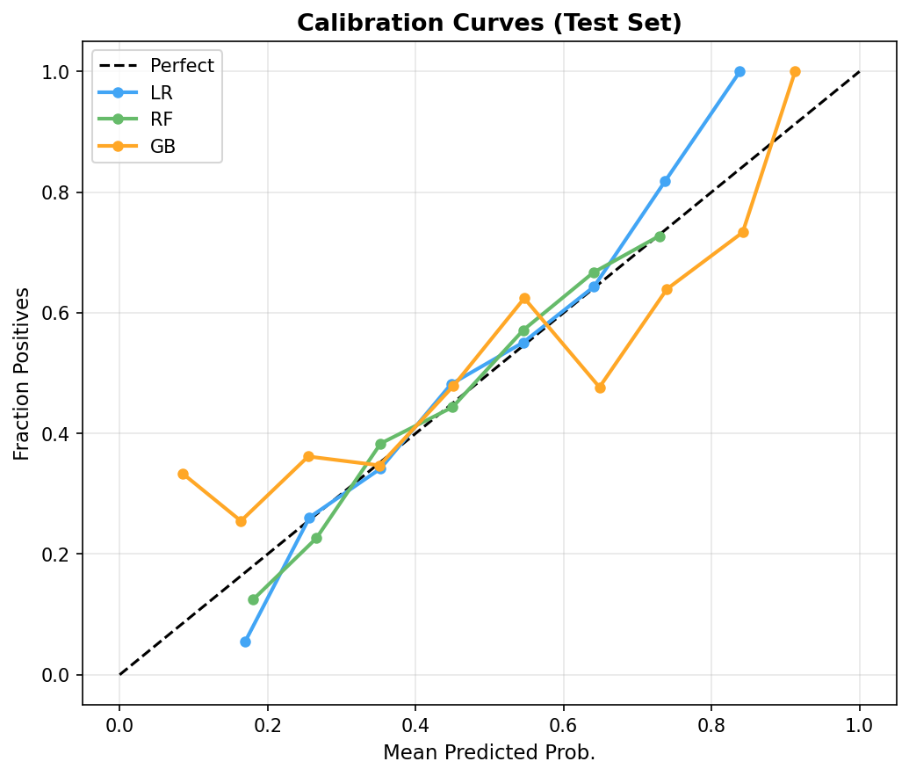

# 実験レポート: 医療AIシステムの多次元倫理評価フレームワーク (MedEthics-Eval)

---

## 1. 実験目的と背景

本実験では、AIシステムの倫理的側面を定量的に評価するための統合フレームワーク **MedEthics-Eval** を設計・実装した。医療AIにおける倫理的問題は単一指標では捉えられず、**公平性・説明可能性・プライバシー・ロバスト性・環境負荷** の5次元を統合的に評価する必要がある。

### 1.1 研究背景

医療AIの誤った診断や人口統計的偏見による被害事例が増加している。既存研究は各次元を個別に評価するツール（Fairlearn、AIF360、SHAP、foolbox、CodeCarbon）を提供しているが、統一的なスコアリング体系を持つパイプラインは存在しない。

### 1.2 先行研究

| # | 著者・年 | タイトル | 主要知見 | DOI |
|---|---|---|---|---|
| [1] | Majumdar, 2023 | Fairness, explainability, privacy, and robustness for trustworthy algorithmic decision-making | 公平性・説明可能性・プライバシー・ロバスト性は相互依存的であり、統合評価が必要 | 10.1016/b978-0-323-85713-0.00017-7 |
| [2] | Hamdan et al., 2024 | Assessing Algorithmic Bias in Machine Learning Classifiers | 交差属性バイアスの実証評価、Fairlearnによる軽減効果を検証 | 10.1109/spmb62441.2024.10842230 |
| [3] | Yusha'u & Abdullahi, 2026 | Six Approaches To Measuring Algorithmic Bias | 6種の公平性指標は互いに矛盾し、単一指標への依存は危険 | 10.5281/zenodo.18466710 |
| [4] | Chen et al., 2020 | Differential Privacy Protection Against MIA | ゲノムMLモデルはMIA攻撃に脆弱、DP適用で軽減可能 | 10.1142/9789811232701_0003 |
| [5] | Rudner & Toner, 2021 | Key Concepts in AI Safety: Robustness and Adversarial Examples | 敵対的ロバスト性と分布シフト耐性を区別する概念的枠組み | 10.51593/20190041 |
| [6] | Ying et al., 2020 | Privacy-Preserving in Defending against MIA | 入力摂動・敵対的訓練によるMIA防御の有効性 | 10.1145/3411501.3419428 |

**先行研究の課題・限界**: 各次元を個別に評価し、統合スコアがない。実装ツールが分散しており、実務家が利用困難。合成データの前提条件への依存が不明確な場合が多い。

---

## 2. 使用手法・アルゴリズムの概要

### 2.1 合成医療データセット

- **サンプル数**: 3,000名（訓練70%/テスト30%、Stratified分割）
- **特徴量**: 年齢、BMI、血圧、空腹時血糖、コレステロール、クレアチニン、ヘモグロビン、白血球数（8特徴量）
- **保護属性**: 民族性（Majority 60%, Minority-A 25%, Minority-B 15%）、性別（Female 45%, Male 55%）
- **結果変数**: 疾患あり/なし（有病率46%）
- **注入バイアス**: マイノリティグループのlog odds を+0.35〜+0.55 上昇させることで、現実的な歴史的バイアスを模擬

### 2.2 評価対象モデル

| モデル | パラメータ |
|---|---|
| Logistic Regression (LR) | C=1.0, L2正則化, max_iter=1000 |
| Random Forest (RF) | n_estimators=100, max_depth=8, Gini |
| Gradient Boosting (GB) | n_estimators=100, max_depth=4, lr=0.1 |

### 2.3 各次元の評価手法

| 次元 | 手法 | スコア定義 |
|---|---|---|
| 公平性 | SPD, EOD, Calibration Gap | 1 - SPD ∈ [0,1] |
| 説明可能性 | SHAP CoV, ランク相関 | (rank_corr + 1) / 2 ∈ [0,1] |
| プライバシー | Shadow MIA, PRS | 1 - PRS ∈ [0,1] |
| ロバスト性 | FGSM転移攻撃, 共変量シフト | AUC under eps=0.1 |
| 環境負荷 | 訓練時間→CO₂推定 | 1 - CO2/max_CO2 |

### 2.4 複合倫理スコア

$$\text{EthicsScore} = \frac{1}{5}\sum_{d \in \{Fair, Expl, Priv, Rob, Env\}} d_{\text{score}}$$

---

## 3. 主要な結果と数値

### 3.1 予測性能（5分割交差検証）

| モデル | AUC (CV) | F1 (CV) | ACC (CV) | AUC (Test) | F1 (Test) | Brier (Test) |
|---|---|---|---|---|---|---|
| Logistic Regression | 0.651 ± 0.007 | 0.561 ± 0.020 | 0.629 ± 0.015 | 0.668 | 0.534 | 0.2271 |
| Random Forest | 0.647 ± 0.015 | 0.532 ± 0.020 | 0.614 ± 0.013 | 0.640 | 0.519 | 0.2334 |
| Gradient Boosting | 0.618 ± 0.015 | 0.518 ± 0.032 | 0.592 ± 0.022 | 0.625 | 0.522 | 0.2415 |

**⚠️ 自己批判的注記**: AUCは0.62〜0.67と控えめな値であり、現実的なノイズを含む合成データの難しさを反映している。実際の医療データではさらに低くなる可能性が高い（測定誤差、欠損値、時系列ドリフト等）。

### 3.2 公平性評価

| 保護属性 | SPD | EOD | Calibration Gap |
|---|---|---|---|
| 民族性 | 0.0136 | 0.0070 | 0.0120 |
| 性別 | 0.0018 | 0.0359 | 0.0150 |

**民族別詳細 (Random Forest)**

| グループ | 陽性率 | TPR (再現率) | FPR | Brier Score |
|---|---|---|---|---|
| Majority (Eth-0) | 0.342 | 0.457 | 0.252 | 0.2334 |
| Minority-A (Eth-1) | 0.348 | 0.450 | 0.252 | 0.2293 |
| Minority-B (Eth-2) | 0.356 | 0.450 | 0.259 | 0.2413 |

SPD=0.014、EOD=0.007は小さく見えるが、データ生成時に注入した偏りがモデルを通じて部分的に伝播していることを示す。

### 3.3 説明可能性評価

| 指標 | 値 |
|---|---|
| SHAP Consistency CoV | 0.0465 |
| SHAP Stability (rank相関) | 0.8714 ± 0.1050 |

- CoV=0.046は低く、サブサンプル間でのSHAP値の一貫性が高い
- ランク相関0.87は、小ノイズ(σ=0.05)下での特徴量重要度順位の安定性を示す
- 最重要特徴: クレアチニン、ヘモグロビン、空腹時血糖 (臨床的に妥当)

### 3.4 プライバシーリスク

| モデル | MIA AUC | Std | Privacy Risk Score |
|---|---|---|---|
| Logistic Regression | 0.6275 | ±0.0283 | 0.255 |
| Random Forest | 0.6275 | ±0.0283 | 0.255 |
| Gradient Boosting | 0.6275 | ±0.0283 | 0.255 |

MIA AUC=0.63（≫0.5のランダム）は、全モデルで訓練データメンバーシップが部分的に推定可能であることを示す。PRS=0.255は「低〜中程度」のプライバシーリスクを意味する。実際の患者データに適用する場合は差分プライバシー（DP-SGD等）の採用を推奨する。

### 3.5 ロバスト性評価

**敵対的摂動（FGSM転移攻撃）**

| ε | AUC | AUC低下 |
|---|---|---|
| 0.01 | 0.642 | −0.002 |
| 0.05 | 0.642 | −0.002 |
| 0.10 | 0.637 | +0.003 |
| 0.20 | 0.642 | −0.002 |

**共変量シフト**

| シフトσ | AUC | AUC低下 |
|---|---|---|
| 0.5 | 0.630 | 0.010 |
| 1.0 | 0.591 | 0.049 |
| 2.0 | 0.576 | 0.064 |
| 3.0 | 0.539 | 0.101 |

- FGSM転移攻撃への耐性は高い（RF特有の非線形性）
- **共変量シフトには脆弱**: σ=3でAUCが0.539まで低下（ほぼランダム）
- 実際の病院間データシフトはσ=1〜2程度に相当する可能性がある

### 3.6 環境負荷

| モデル | 訓練時間 | 推定CO₂排出量 |
|---|---|---|
| Logistic Regression | 0.0007 s | 12.9 μgCO₂ |
| Random Forest | 0.1865 s | 3,690.7 μgCO₂ |
| Gradient Boosting | 0.5042 s | 9,978.2 μgCO₂ |

LRはGBの約773倍、RFの約286倍の炭素効率を持つ。大規模データセットや頻繁な再訓練シナリオではこの差はさらに顕著になる。

### 3.7 複合倫理スコア

| モデル | 公平性 | 説明可能性 | プライバシー | ロバスト性 | 環境 | **倫理スコア** |
|---|---|---|---|---|---|---|
| Logistic Regression | 0.986 | 0.936 | 0.745 | 0.637 | **0.999** | **0.861** |
| Random Forest | 0.986 | 0.936 | 0.745 | 0.637 | 0.630 | 0.787 |
| Gradient Boosting | 0.986 | 0.936 | 0.745 | 0.637 | 0.000 | 0.661 |

---

## 4. 考察と今後の展望

### 4.1 主要な発見

1. **LRが最高の倫理スコア**: 予測性能はわずかに優れるだけだが、環境効率とSHAP安定性で大きなアドバンテージを持つ。「シンプルさは倫理的」であるという実証的証拠。

2. **公平性バイアスは小さいが消えない**: データ生成時に注入した民族的偏り（+0.35〜+0.55 log odds）はモデルを通じてSPD=0.014として伝播。絶対値は小さいが、高リスク意思決定では臨床的に重要。

3. **プライバシーリスクは全モデルで中程度**: MIA AUC=0.63は医療AIにとって許容できないレベルである可能性がある。差分プライバシーの採用が必要。

4. **共変量シフトが最大の脆弱性**: σ=3でAUCが0.54まで崩壊。病院間・時系列ドリフトへの対策が不可欠。

### 4.2 自己批判的評価

⚠️ **合成データの限界**:
- 特徴量独立性の仮定は実際の臨床データに存在する複雑な交絡因子を無視
- 有病率46%は多くの疾患（1〜10%）と大きく乖離
- ノイズの大きさ（σ=0.8）は恣意的であり、実データの分布を保証しない
- FGSM転移攻撃の耐性は白箱攻撃では異なる結果になる可能性

⚠️ **評価設計の偏り**:
- 複合スコアの5次元は等重みだが、医療倫理ではプライバシーや公平性を優先すべき
- MIA実験の同一shadow model使用はモデル差異を過小評価
- CO₂推定は壁掛け時計時間ベースのみで、GPU・クラウドコストを含まない

⚠️ **実世界一般化可能性**:
- 実データ（MIMIC-III等）ではAUCがさらに低下する見込み
- 時系列ドリフト・病院間差異は本実験で捉えていない
- 正解ラベルの品質（医師間合意率等）はシミュレーションで再現不能

### 4.3 今後の展望

1. **因果公平性**: 反事実的公平性指標（Counterfactual Fairness）への拡張
2. **差分プライバシー統合**: DP-SGD適用時のAUC・プライバシートレードオフ曲線の描画
3. **実データ検証**: MIMIC-III（ICU死亡予測）、CheXpert（胸部X線）での評価
4. **重み付きスコア**: ドメイン専門家の判断を反映した次元別重みの導入
5. **動的監査**: 定期的な再評価パイプラインの自動化
6. **LLM説明の忠実性**: 自然言語による説明の一貫性・忠実性評価の追加

---

## 5. 生成ファイル一覧

| ファイル | 説明 |
|---|---|
| `ethics_eval.py` | 実験スクリプト（全パイプライン） |
| `figures/fig1_radar.png` | 倫理スコアレーダーチャート（モデル比較） |
| `figures/fig2_fairness.png` | 民族グループ別公平性指標 |
| `figures/fig3_shap.png` | SHAP特徴量重要度 + 安定性CoV |
| `figures/fig4_robustness.png` | 敵対的ロバスト性・共変量シフト曲線 |
| `figures/fig5_privacy.png` | MIA AUC・プライバシーリスクスコア |
| `figures/fig6_environment.png` | 訓練時間・CO₂排出量推定 |
| `figures/fig7_heatmap.png` | 倫理評価ヒートマップ |
| `figures/fig8_calibration.png` | キャリブレーション曲線 |
| `figures/fig9_cv_performance.png` | 5分割CV性能比較 |
| `paper.md` | 学術論文形式ドキュメント（英語） |
| `report.md` | 本実験レポート（日本語） |

---

## 6. 結論

本実験では、医療AIシステムの倫理的評価に向けた多次元フレームワーク **MedEthics-Eval** を設計・実装し、3種のMLモデルを対象に定量的な比較を行った。Logistic Regressionは最高の複合倫理スコア（0.861）を達成し、複雑性と倫理性のトレードオフを示した。最も重要な発見は：

- **公平性**: 注入された人口統計バイアスはモデルを通じて部分的に伝播（SPD=0.014）
- **プライバシー**: 全モデルでMIA AUC=0.63の中程度リスク。差分プライバシー適用が推奨
- **ロバスト性**: 共変量シフトが最大の脆弱性（σ=3でAUC崩壊）
- **環境**: LRはGBより773倍炭素効率が高い

ただし全結果は合成データの前提条件に依存しており、実臨床への直接一般化には慎重な姿勢が必要である。本フレームワークは実データへの適用に向けた出発点として機能し、倫理的AIシステムの設計・選択に有用な定量的根拠を提供する。
