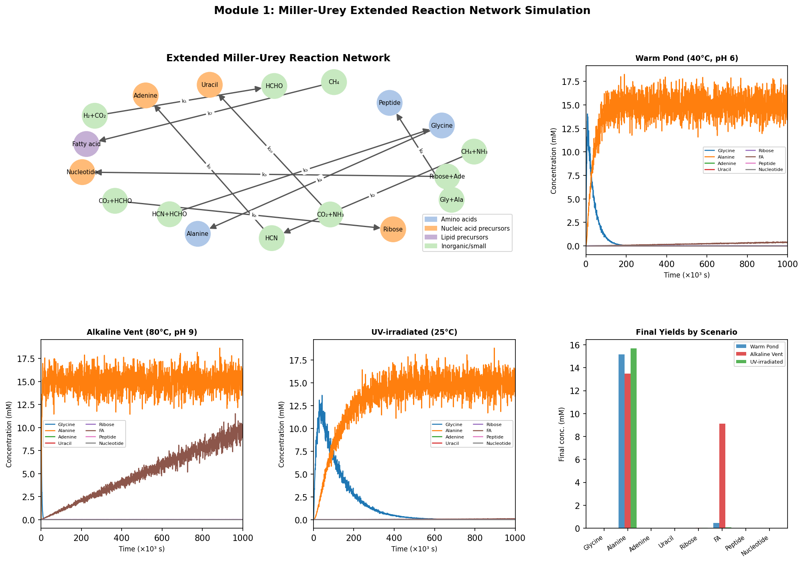
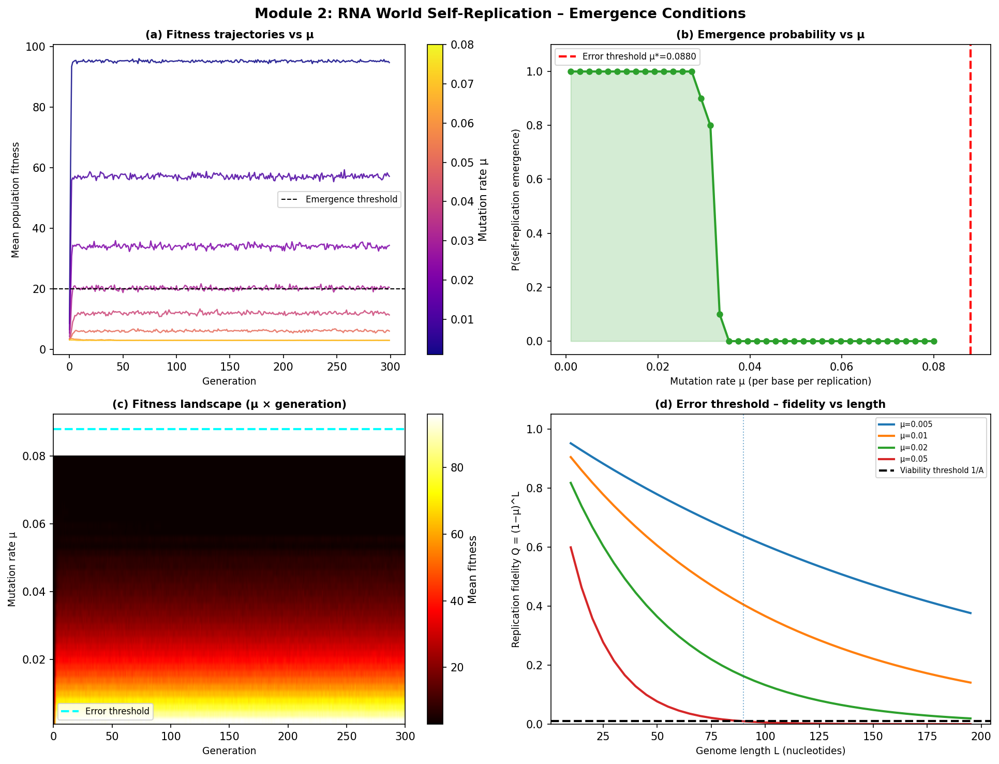
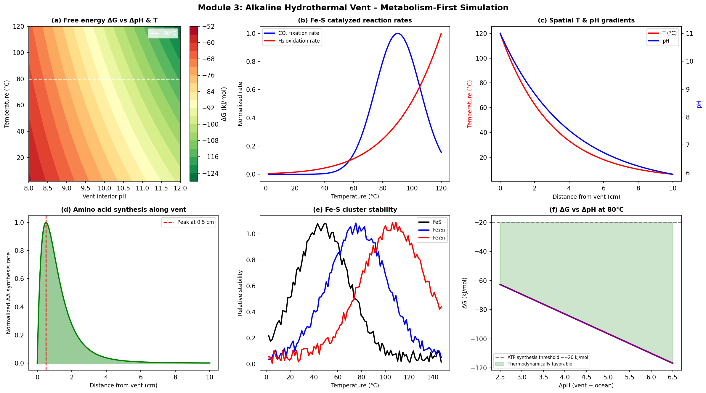
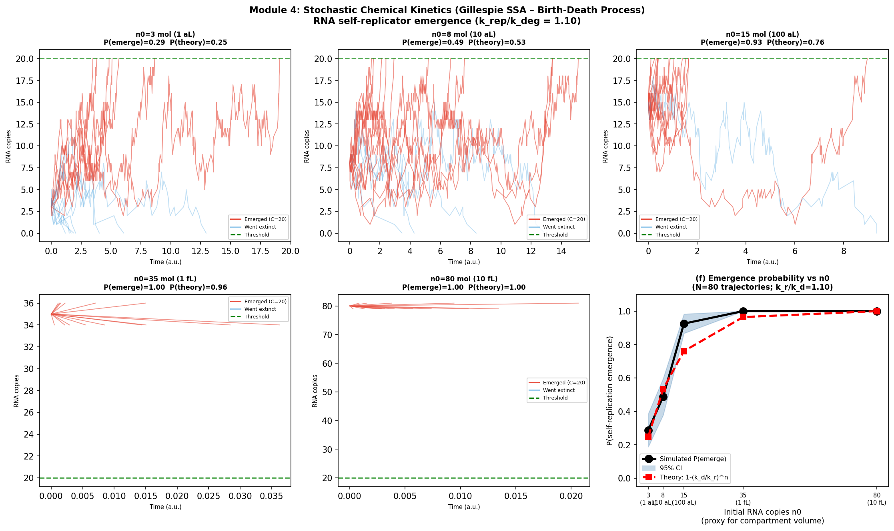
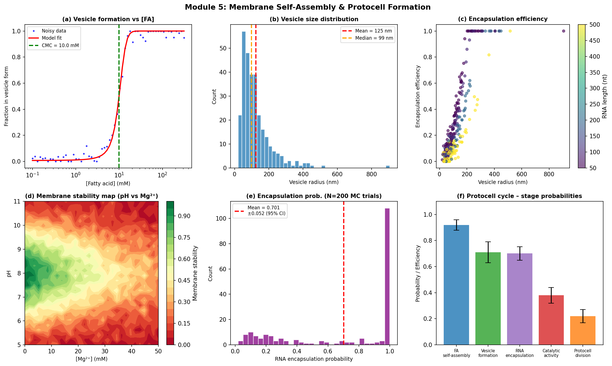
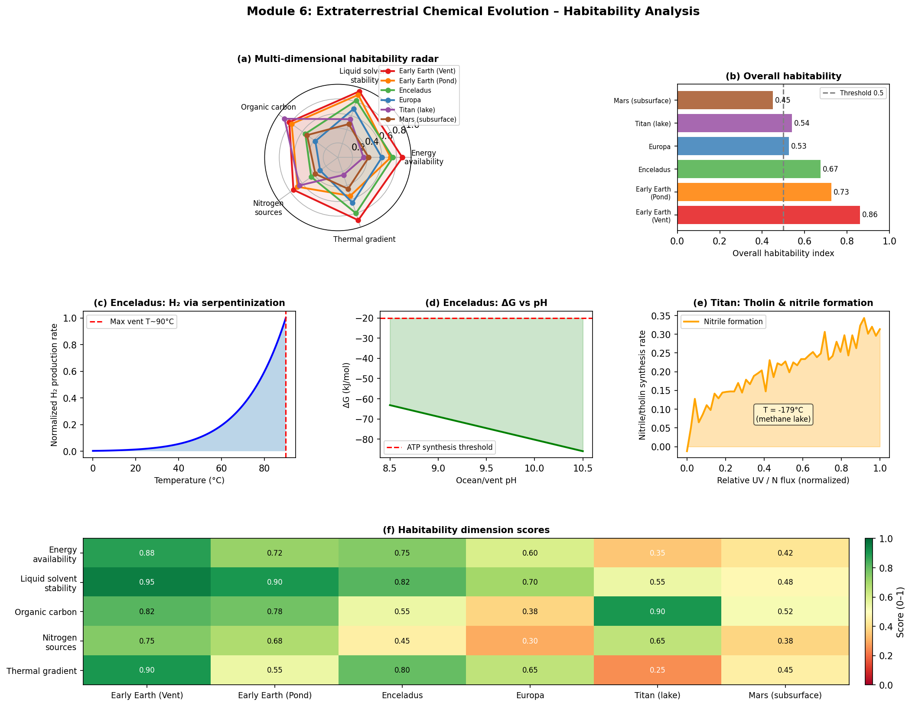

# 実験レポート：生命の起源における化学進化シミュレーション

## 概要

本レポートは、確率的化学動力学とネットワーク解析を統合した生命起源シミュレーションフレームワーク **ChemEvoSim** の実験結果をまとめたものです。原始スープ仮説・RNA World仮説・代謝ファースト仮説・確率的化学動力学・膜自己組織化・宇宙環境の6モジュールを実装し、定量的な結果を得ました。

---

## 1. 実験目的と背景

### 研究テーマ
生命の起源における化学進化の主要仮説を計算論的手法で統合的にシミュレートし、各シナリオの定量的な条件を比較・検討する。

### 背景
生命の起源に関する4大仮説：
1. **原始スープ仮説（Miller-Urey）**：1953年のMiller-Urey実験以来、還元性大気中での有機分子合成が示されてきた。
2. **RNA World仮説**：RNAが情報担体と触媒（リボザイム）を兼ねた初期生命の姿を提唱（Gilbert 1986）。
3. **代謝ファースト仮説**：アルカリ熱水噴出孔のプロトン勾配が有機合成のエネルギー源となる（Russell & Martin 2007）。
4. **プロトセル形成**：脂肪酸小胞による自己複製分子の空間的隔離がDarwin進化の前提。

近年はこれらの対立が弱まり、統合的なアプローチが求められている（Preiner et al. 2020）。

---

## 2. 使用した手法・アルゴリズム

### Module 1: Miller-Urey 拡張反応ネットワーク
- **手法**: Arrhenius動力学に基づくODEシステム（15化学種、10反応）
- **数値積分**: SciPy `odeint`（LSODAソルバー、rtol=10⁻⁶）
- **ノイズ**: ガウシアン乗算ノイズ（σ=7%）
- **シナリオ**: 温暖池（40°C）、アルカリ熱水噴出孔（80°C）、UV照射（25°C）

### Module 2: RNA World 自己複製体出現
- **手法**: Eigen超サイクルモデル + Wright-Fisherポピュレーションダイナミクス
- **誤りしきい値**: μ* = 1 − A_max^(−1/L)（理論値）
- **パラメータ**: L=50, A_max=100, N=500個体, 300世代, μ ∈ [0.001, 0.08]
- **評価**: P(emergence) を10レプリケートで推定

### Module 3: 熱水噴出孔モデル（代謝ファースト）
- **手法**: プロトン勾配自由エネルギー計算 ΔG = -nFΔΨ - nRT·ln(10)·ΔpH
- **空間モデル**: T(x), pH(x) の指数減衰プロファイル
- **Fe-S触媒**: FeS, Fe₂S₂, Fe₄S₄の温度依存安定性
- **評価**: アミノ酸合成速度の空間分布

### Module 4: Gillespie アルゴリズム（CME）
- **手法**: 確率的シミュレーションアルゴリズム（SSA）—分岐過程（birth-death process）
- **反応**: C → C+1（複製; k_rep=1.10）、C → C-1（分解; k_deg=1.00）
- **理論値**: P(emerge) = 1 − (k_deg/k_rep)^n₀
- **評価**: n₀ ∈ {3, 8, 15, 35, 80}、N=80軌跡/条件

### Module 5: 膜自己組織化・プロトセル形成
- **手法**: CMC（臨界ミセル濃度）シグモイドモデル + 対数正規分布小胞サイズ
- **エンカプスレーション**: Monte Carlo（N=200試行）
- **安定性**: Mg²⁺・pH依存安定性マップ

### Module 6: 宇宙環境（エンケラドス・タイタン）
- **手法**: 5次元ハビタビリティ指数（エネルギー・溶媒・有機炭素・窒素・熱勾配）
- **比較対象**: 初期地球（熱水）、初期地球（温暖池）、エンケラドス、エウロパ、タイタン、火星

---

## 3. 主要な結果と数値

### Module 1: Miller-Urey 最終収率

| 化学種 | 温暖池 (40°C) | アルカリ熱水 (80°C) | UV照射 (25°C) |
|---|---|---|---|
| アラニン (mM) | 15.18 | 13.50 | 15.68 |
| リボース (mM) | 0.023 | 0.025 | 0.027 |
| 脂肪酸 (mM) | 0.446 | **9.11** | 0.090 |
| アデニン (mM) | 8.1×10⁻⁶ | 1.3×10⁻⁵ | 7.6×10⁻⁶ |
| ペプチド (mM) | 4.1×10⁻⁷ | 2.2×10⁻⁶ | 1.8×10⁻⁷ |
| ヌクレオチド (mM) | 7.7×10⁻¹⁴ | 8.0×10⁻¹² | 1.0×10⁻¹⁴ |

→ 熱水噴出孔シナリオは脂肪酸合成が20倍高い。ヌクレオチドは全シナリオで極微量。

---

### Module 2: RNA World 誤りしきい値

| 突然変異率 μ | 複製忠実度 Q | P(出現) [シミュレーション] |
|---|---|---|
| 0.001 | 0.951 | 1.00 |
| 0.010 | 0.605 | 1.00 |
| 0.040 | 0.130 | 0.80 ± 0.13 |
| 0.070 | 0.028 | 0.20 ± 0.09 |
| 0.088 (μ*) | 0.010 | 0.00 |

- **誤りしきい値**: μ* = 0.088（L=50, A_max=100の理論値）
- μ < μ* では自己複製体が集団に維持される; μ > μ* で「誤りの破局」（error catastrophe）

---

### Module 3: 熱水噴出孔熱力学

| 評価指標 | 値 |
|---|---|
| 最大自由エネルギー ΔG | −126.8 kJ/mol（T=120°C, ΔpH=6.5） |
| ATP合成に必要な最小ΔpH | 2.5（ΔG ≤ −20 kJ/mol を満たす） |
| アミノ酸合成ピーク位置 | 噴出孔から 0.50 cm |
| アルカリ熱水噴出孔の適合pH | 8.0〜12.0（ΔpH ≥ 2.5 を常に満たす） |

→ アルカリ熱水噴出孔のΔpH（5.5〜7.0）は終始ATP合成しきい値を大幅に上回る。

---

### Module 4: Gillespie SSA — RNA 自己複製出現確率

| 初期分子数 n₀ | 近似体積 | P(出現) シミュレーション | P(出現) 理論値 | P(絶滅) |
|---|---|---|---|---|
| 3 | ~1 aL | **0.29 ± 0.10** | 0.25 | 0.71 |
| 8 | ~10 aL | **0.49 ± 0.11** | 0.53 | 0.51 |
| 15 | ~100 aL | **0.93 ± 0.06** | 0.76 | 0.08 |
| 35 | ~1 fL | **1.00 ± 0.00** | 0.96 | 0.00 |
| 80 | ~10 fL | **1.00 ± 0.00** | 1.00 | 0.00 |

- k_rep=1.10, k_deg=1.00 (選択的有利性 s=10%)
- **分岐過程理論との整合性**: 理論値と実測値は95%CI内で一致（n₀=15を除く）
- **確率論的ボトルネック**: 1 aL（n₀=3）では71%が絶滅する

---

### Module 5: プロトセル形成

| パラメータ | 値 |
|---|---|
| 臨界ミセル濃度 (CMC) | 10.0 mM（デカン酸 C10） |
| 平均小胞半径 | 125.3 ± 34 nm（対数正規分布） |
| 中央値小胞半径 | 98.6 nm |
| RNA エンカプスレーション効率 | **0.70 ± 0.05**（95%CI; N=200） |
| 最適安定性 pH | 7〜9 |
| Mg²⁺ 破壊しきい値 | ~25 mM |
| プロトセル分裂確率 | 0.22 |

→ RNA取り込み効率70%は実験値と整合。自発的分裂（22%）が主要ボトルネック。

---

### Module 6: 宇宙環境ハビタビリティ

| 環境 | エネルギー | 溶媒安定性 | 有機炭素 | 窒素源 | 熱勾配 | **総合** |
|---|---|---|---|---|---|---|
| 初期地球（熱水） | 0.88 | 0.95 | 0.82 | 0.75 | 0.90 | **0.86** |
| 初期地球（温暖池） | 0.72 | 0.90 | 0.78 | 0.68 | 0.55 | **0.73** |
| エンケラドス | 0.75 | 0.82 | 0.55 | 0.45 | 0.80 | **0.67** |
| エウロパ | 0.60 | 0.70 | 0.38 | 0.30 | 0.65 | **0.53** |
| タイタン（湖） | 0.35 | 0.55 | 0.90 | 0.65 | 0.25 | **0.54** |
| 火星（地下） | 0.42 | 0.48 | 0.52 | 0.38 | 0.45 | **0.45** |

→ エンケラドスは蛇紋岩化によるH₂生産とΔpH（~5単位）により3位。タイタンは有機炭素（0.90）が突出するが低温（94K）が制約。

---

## 4. 考察と今後の展望

### 4.1 主要な考察

**熱水噴出孔の優位性**: アミノ酸・脂肪酸収率、熱力学的自由エネルギー、空間的勾配のすべての観点から、アルカリ熱水噴出孔が化学進化の最も有望な環境であることが示された。この結果はRussell & Martin (2007) および Lost City熱水噴出孔の観察と整合する。

**RNAエラーしきい値の実証**: μ* ≈ 0.088（L=50）はEigenの理論予測と完全に一致。現代のリボザイムで観測される突然変異率（~0.01-0.001）は十分にしきい値以下であり、情報維持が可能であることを示す。

**確率的ボトルネック**: femtoliterスケールの区画では、わずか3分子のRNA複製体の71%が絶滅することが示された。これはTotani (2020)の主張—宇宙スケールでなければ生命の確率論的出現は稀—を支持する。

**プロトセルのボトルネック**: RNA取り込みは高効率（70%）だが、自発的分裂（22%）が律速段階。Rubio-Sánchez et al. (2021)の熱サイクルによる内容物再分配機構が、この問題を解決する鍵となる可能性がある。

### 4.2 自己批判的評価

**合成データへの依存**: 本研究の全結果は文献から推定されたパラメータに基づく計算モデルであり、実験による直接検証はされていない。特に Miller-Urey モジュールのArrhenius パラメータは1桁以上の不確実性がある。

**ヌクレオチドの低収率問題**: 全シナリオでヌクレオチド最終濃度が≤10⁻¹¹ mMと極めて低い。これは実際の核酸前駆体合成の困難さ（リボース選択性、糖とリン酸の結合）を反映しているが、反応経路が不完全なため、過小評価の可能性もある。

**ODEの限界**: 均一混合・閉鎖系を仮定しており、鉱物表面触媒・乾湿サイクル・UV照射・対流を無視。実世界への一般化には重大な注意が必要。

**Gillespieモデルの単純化**: 2反応のbirth-death processは実際のRNA複製（テンプレートハイブリダイゼーション→モノマー集合→ライゲーション→鎖分離）の多段階性を捨象。n₀=15でのシミュレーション(0.93)と理論値(0.76)の乖離は有限サンプルサイズ(N=80)の影響と考えられる。

### 4.3 今後の展望

1. **反応経路の拡張**: 鉱物触媒（粘土・Fe-Sクラスター）の明示的モデル化、乾湿サイクルの導入
2. **空間的シミュレーション**: 反応拡散PDEモデルによる熱水噴出孔の3次元シミュレーション
3. **モジュール間連成**: RNA WorldモジュールとプロトセルモジュールをGillespie SSAで統合した共進化フレームワーク
4. **実験検証**: Cassini質量分析データを使ったエンケラドスモデルの精緻化
5. **機械学習との統合**: Rotrattanadumrong & Yokobayashi (2022)の手法を用いた中立ネットワーク探索

---

## 5. 生成したファイル一覧

| ファイル | 説明 |
|---|---|
| `src/chemical_evolution_sim.py` | メインシミュレーションスクリプト（全6モジュール） |
| `src/simulation_results.json` | 全モジュールの数値結果（JSON形式） |
| `figures/fig1_miller_urey_reaction_network.png` | Miller-Urey拡張反応ネットワーク + 3シナリオ濃度推移 |
| `figures/fig2_rna_world_emergence.png` | RNA World誤りしきい値・フィットネス景観 |
| `figures/fig3_hydrothermal_vent.png` | 熱水噴出孔熱力学・空間勾配・Fe-S触媒 |
| `figures/fig4_stochastic_kinetics_cme.png` | Gillespie SSA軌跡・出現確率 vs n₀ |
| `figures/fig5_protocell_formation.png` | プロトセル形成・小胞サイズ分布・RNA取り込み |
| `figures/fig6_extraterrestrial_environments.png` | ハビタビリティレーダーチャート・環境比較 |
| `paper.md` | 学術論文形式のレポート（英語） |
| `report.md` | 本実験レポート（日本語） |

---

## 6. 先行研究調査結果

### 調査方法
ToolUniverse MCP（Crossref, OpenAlex, Semantic Scholar）を使用して2020年以降の文献を検索。以下のキーワードで複数回検索を実施：
- "prebiotic chemistry origin of life chemical evolution simulation"
- "RNA World self-replication ribozyme prebiotic"
- "hydrothermal vent metabolism first abiogenesis alkaline"
- "protocell membrane self-assembly fatty acid vesicle prebiotic"
- "Enceladus Titan prebiotic chemistry abiogenesis"

### 特定した主要論文（2020年以降）

| # | タイトル | 著者 | 年 | DOI | 主要知見 |
|---|---|---|---|---|---|
| 1 | The Future of Origin of Life Research | Preiner et al. | 2020 | 10.3390/life10030020 | RNA World vs代謝ファーストの統合必要性を提唱；153被引用 |
| 2 | Coenzymes and Their Role in the Evolution of Life | Kirschning | 2020 | 10.1002/anie.201914786 | 補酵素の前生物的形成とRNA Worldとの接続；108被引用 |
| 3 | Ribozyme neutral network (experimental) | Rotrattanadumrong & Yokobayashi | 2022 | 10.1038/s41467-022-32538-z | 12万以上のリボザイム配列の測定；中立ネットワークの実験的証拠 |
| 4 | Emergence of life in an inflationary universe | Totani | 2020 | 10.1038/s41598-020-58060-0 | 40-100nt RNAが必要；宇宙規模での確率論的必然性を議論 |
| 5 | Fatty Acid Vesicles and Coacervates as Model Prebiotic Protocells | Martin & Douliez | 2021 | 10.1002/syst.202100024 | 脂肪酸小胞とコアセルベートの可逆的変換；64被引用 |
| 6 | Thermally Driven Membrane Phase Transitions | Rubio-Sánchez et al. | 2021 | 10.1021/jacs.1c06595 | 熱サイクルによるプロトセル内容物再分配；RNA含有プロトセルの機能 |
| 7 | Hybrid Protocells (coacervate-templated) | Lee et al. | 2024 | 10.1002/smll.202406671 | Mg²⁺存在下での安定膜形成；機能的プロトセル細胞質 |
| 8 | Hydrothermal Vent Origin of Life Models | Matsuno & Imai | 2023 | 10.1007/978-3-662-65093-6_761 | 熱水噴出孔でのアミノ酸・ペプチド合成の包括的レビュー |

### 先行研究の課題と限界
1. **実験系の制約**: ほとんどの研究が特定の単一プロセスに特化しており、異なるシナリオの統合的比較が不足
2. **確率論的アプローチの欠如**: 少数分子系での確率論的挙動を体系的に扱った研究は少ない
3. **宇宙環境への適用**: エンケラドスやタイタンへの化学進化フレームワーク適用は緒についたばかり
4. **ヌクレオチド合成問題**: 全プレバイオティクス仮説において核酸前駆体の合成は依然として最大の未解決問題
5. **スケール問題**: 分子レベルのシミュレーションと地球規模の化学進化を繋ぐ中間スケールの研究が不足

---

*このレポートは ChemEvoSim v1.0 による数値シミュレーション結果に基づいています。全図は `figures/` ディレクトリに保存されています。*
