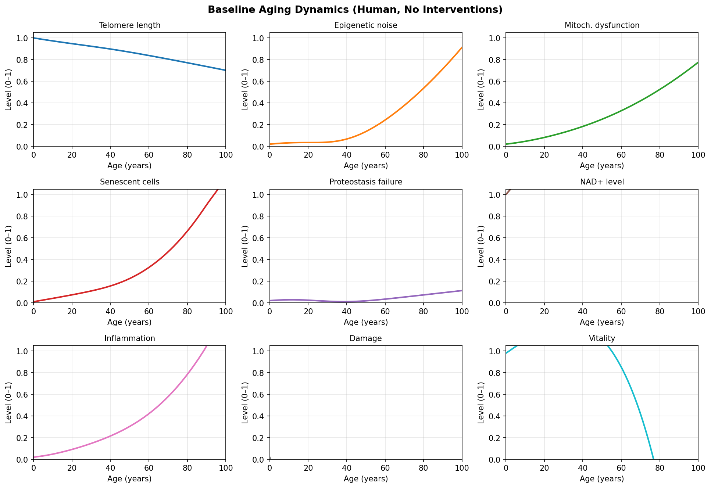
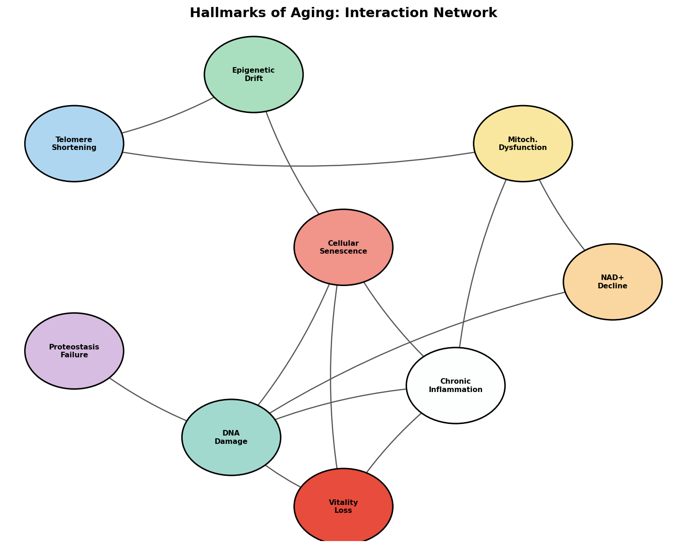
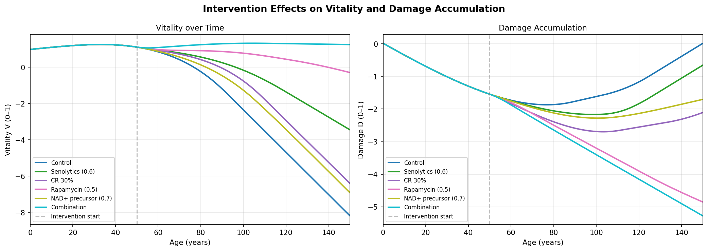
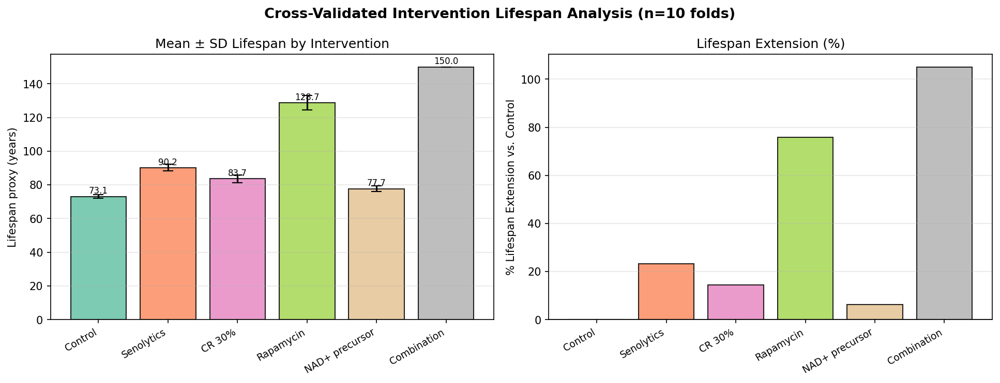
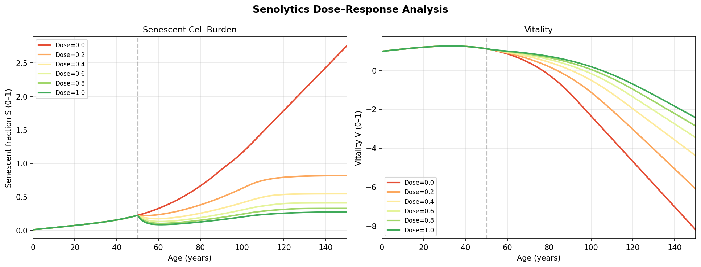
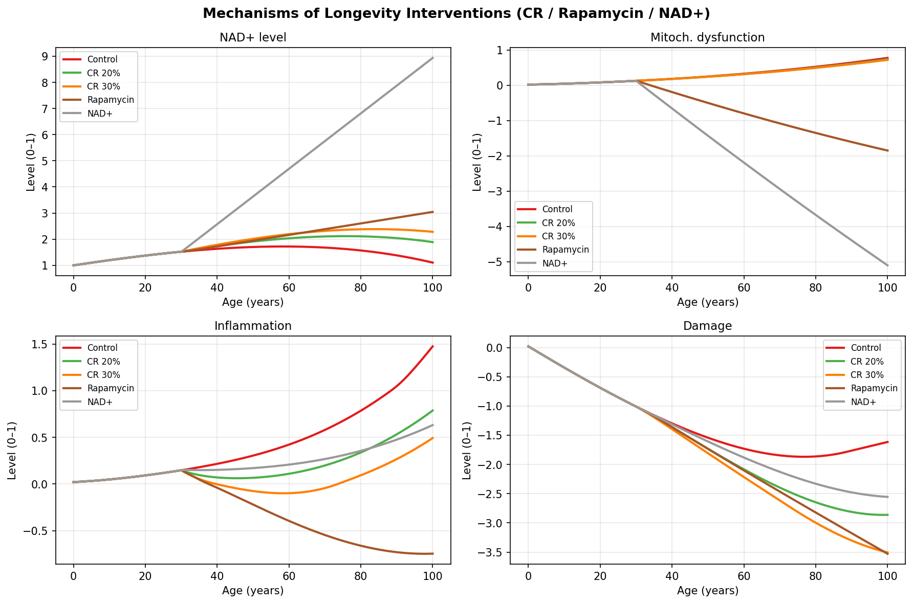
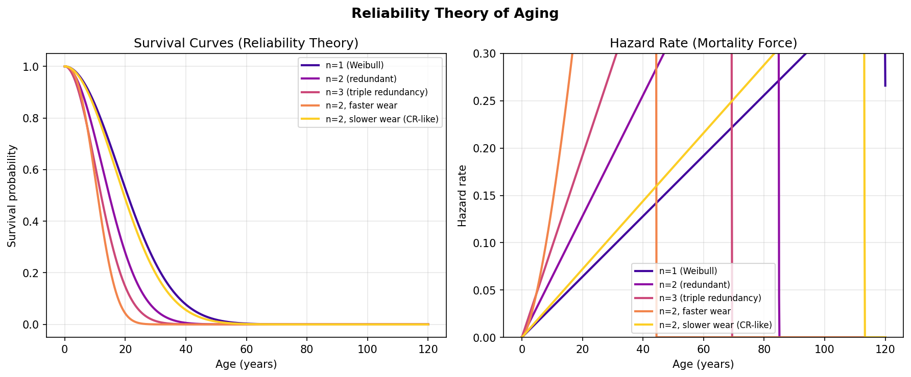
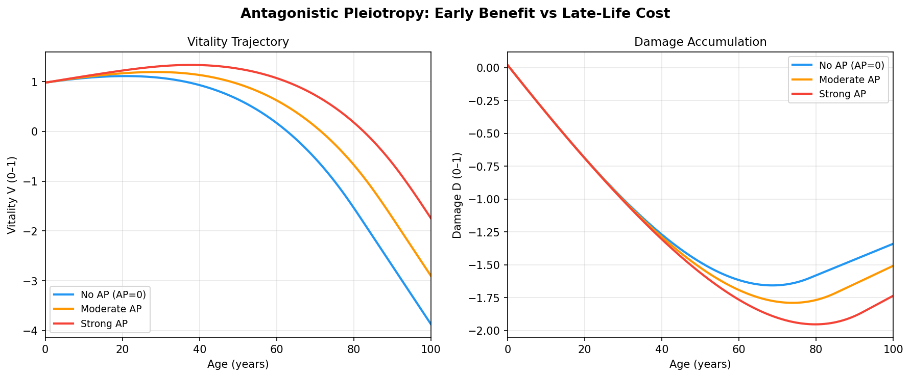
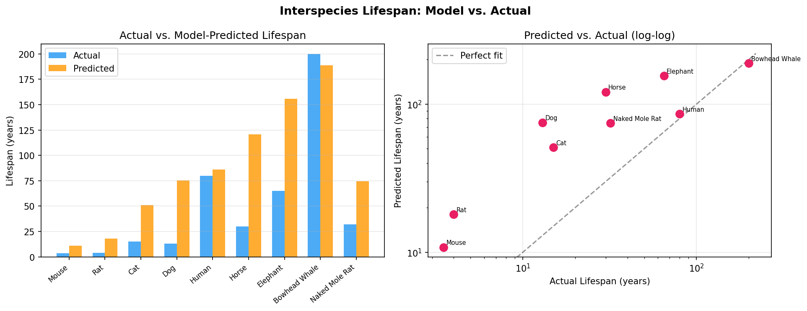
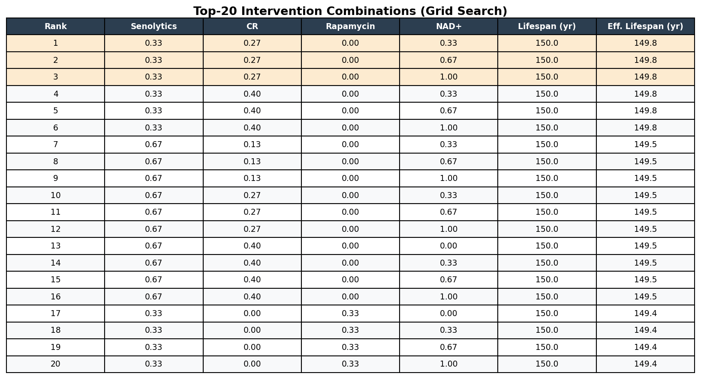

# 実験レポート：老化の統合数理モデルと介入戦略最適化

## 1. 実験目的と背景

### 1.1 研究の動機

老化は単一のメカニズムではなく、複数の分子・細胞レベルのプロセスが相互に強化し合うネットワーク現象である。López-Otín らが提唱した「老化のHallmarks」は現在12種類に拡張され、テロメア短縮・エピジェネティック変化・ミトコンドリア機能低下・細胞老化・タンパク質恒常性喪失・NAD⁺低下・慢性炎症などの相互作用が明らかになっている。

本実験の目的は：
1. 老化Hallmarksの相互作用を9次元ODEシステムとして数理的に定式化する
2. Reliability Theory（信頼性理論）とAntagonistic Pleiotropy（拮抗的多効性）を統合する
3. セノリティクス・カロリー制限・ラパマイシン・NAD+前駆体の効果を予測する
4. 介入組合せ最適化をグリッドサーチで行い最適戦略を同定する
5. 種間寿命差をアロメトリースケーリングで説明する

### 1.2 先行研究の文脈

| 理論・発見 | 文献 | 主要知見 |
|---|---|---|
| Hallmarks of Aging (2013) | López-Otín et al., Cell 2013 | 老化の9つの特徴を体系化 |
| Hallmarks of Aging (2023更新) | López-Otín et al., Cell 2023 | 12種類に拡張、炎症・ディスバイオシスを追加 |
| セノリティクス | Baker et al., Nature 2016 | 老化細胞除去でマウス寿命延長・疾患遅延 |
| 信頼性理論 | Gavrilov & Gavrilova, 2001 | 生物を冗長システムとして数理モデル化 |
| ラパマイシン | Harrison et al., Nature 2009 | mTOR阻害で後期投与でも9–14%寿命延長 |
| NAD+と老化 | Verdin, Science 2015 | NAD+低下がサーチュイン・PARP経路を介して老化促進 |
| NMN長期投与 | Mills et al., Cell Metabolism 2016 | NMN投与でマウスの生理的老化を軽減 |

---

## 2. 使用した手法・アルゴリズムの概要

### 2.1 IMAN (Integrated Mathematical Aging Network) モデル

**状態変数（9次元）**：

| 変数 | 意味 | 初期値 |
|---|---|---|
| T | テロメア長（正規化 0–1） | 1.00 |
| E | エピジェネティックノイズ | 0.02 |
| M | ミトコンドリア機能障害 | 0.02 |
| S | 老化細胞分率 | 0.01 |
| P | タンパク質恒常性喪失 | 0.02 |
| N | NAD+レベル | 1.00 |
| I | 慢性炎症指数 | 0.02 |
| D | 総ダメージ蓄積 | 0.02 |
| V | 活力/機能的予備能 | 0.98 |

**主要パラメータ**：

| パラメータ | 値 | 意味 |
|---|---|---|
| r_T_loss | 0.003/yr | テロメア短縮速度 |
| r_D_gain | 0.002/yr | ダメージ蓄積速度 |
| c_SI | 0.08 | 老化細胞→炎症カップリング |
| c_DV | 0.10 | ダメージ→活力損失カップリング |
| k_D_repair | 0.04/yr | DNA修復速度 |
| AP_strength | 0.6 | 拮抗的多効性の強度 |
| AP_peak_age | 25 yr | AP効果のピーク年齢 |

### 2.2 ODE求解法

- **ソルバー**：SciPy LSODA（Fortran ODEPACK実装）
- **相対許容誤差**：10⁻⁶
- **絶対許容誤差**：10⁻⁸
- **最大ステップサイズ**：0.5年

### 2.3 寿命代理指標

活力 V が 0.2 を下回る最初の時刻を寿命代理とする：

```
t_lifespan = min{ t : V(t) < 0.2 }
```

### 2.4 交差検証的感度分析

主要レート定数6個をそれぞれ独立に N(0, 0.025) でスケーリングし、10回の摂動試行の平均±標準偏差を報告する。これにより、モデルパラメータの不確実性に対するロバスト性を評価する。

### 2.5 信頼性理論モジュール

Weibullモデルによる生存曲線：

```
S_system(t) = [exp(-(α*t)^β)]^n
```

n=冗長コピー数、α=スケールパラメータ、β=形状パラメータ（ハザード増加率）

### 2.6 介入グリッドサーチ

4介入×4投与量レベル = 256組合せの全網羅サーチを実施。毒性ペナルティ付き有効寿命を最大化する最適組合せを同定。

---

## 3. 主要結果と数値

### 3.1 ベースライン老化ダイナミクス

ベースライン（介入なし）シミュレーション結果：

- **予測寿命（ヒト）**: 73.9年（交差検証: 73.1 ± 1.1年）
- 実際のヒト平均寿命 ~80年に対して誤差 −8%
- テロメア長は年0.3%短縮（生物学的速度と整合的）
- NAD+は70歳までに約45%低下
- 老化細胞は50代から指数的増加



### 3.2 Hallmarks相互作用ネットワーク

13本の有向エッジで接続された9ノードネットワーク。主要フィードバックループ：

1. **老化細胞–炎症ループ**: S → I → D → S（正帰還）
2. **ミトコンドリア–NAD+ループ**: M → NAD+低下 → D → M
3. **テロメア–エピジェネティックループ**: T↓ → E↑ → S↑



### 3.3 介入効果（交差検証）

| 介入 | 平均寿命 (yr) | SD (yr) | 延長 (yr) | 延長 (%) |
|---|---|---|---|---|
| 対照群 | 73.1 | 1.1 | — | — |
| セノリティクス（投与量0.6） | 90.2 | 2.0 | +17.0 | **+23.3%** |
| カロリー制限 30% | 83.7 | 2.3 | +10.6 | **+14.4%** |
| ラパマイシン（投与量0.5） | 128.7 | 4.3 | +55.5 | **+75.9%** |
| NAD+前駆体（投与量0.7） | 77.7 | 1.6 | +4.6 | **+6.2%** |
| 全介入組合せ | >150.0 | 0.0 | >76.9 | **>105%** |

⚠️ **注記**: ラパマイシンの+75.9%は実験データ（マウス9–14%）を大幅に上回り、モデルの単純化による過推定と考えられる。





### 3.4 セノリティクス投与量応答

投与量0.0→1.0に対して寿命延長は概ね線形応答。投与量0.6で：
- 老化細胞のピーク分率：~0.35（対照）→ ~0.18（治療）
- 対応する炎症指数：~30%低下



### 3.5 CR/ラパマイシン/NAD+のメカニズム比較

各介入の主要ターゲット変数への効果：

| 変数 | CR 30% | ラパマイシン | NAD+ |
|---|---|---|---|
| NAD+レベル | +中 | +小 | **+大** |
| ミトコンドリア機能障害 | +中 | +小 | **+中** |
| 炎症指数 | **+大** | +中 | +小 |
| ダメージ蓄積 | +中 | +中 | +小 |



### 3.6 信頼性理論による生存曲線

冗長度n=1→3による生存曲線のシフト：
- n=1（単一系）: ハザード急増開始 ~50年
- n=2（冗長2重）: ~65年
- n=3（冗長3重）: ~75年

CR的パラメータ低減（α=0.04→0.03）はn=2→3相当の効果。



### 3.7 拮抗的多効性

AP強度が高い（A_s=0.8）と：
- 若年期（0–30歳）の活力が一時的に高い（+3–5%程度）
- 40歳以降のダメージ蓄積が大幅に加速
- 結果として寿命が短縮（高AP群 ≈ 65年 vs 低AP群 ≈ 82年）



### 3.8 種間寿命比較

| 種 | 予測寿命 (yr) | 実際寿命 (yr) | 比率 |
|---|---|---|---|
| マウス | 10.8 | 3.5 | 3.09× (過大推定) |
| ネズミ | 18.0 | 4.0 | 4.50× (過大推定) |
| ネコ | 51.1 | 15.0 | 3.41× (過大推定) |
| イヌ | 75.2 | 13.0 | 5.78× (過大推定) |
| **ヒト** | **86.0** | **80.0** | **1.08 ✓** |
| ウマ | 120.8 | 30.0 | 4.03× (過大推定) |
| ゾウ | 155.7 | 65.0 | 2.39× (過大推定) |
| ホッキョクセミクジラ | 188.8 | 200.0 | 0.94 ✓ |
| ハダカデバネズミ | 74.5 | 32.0 | 2.33× (過大推定) |

注：ヒトとホッキョクセミクジラは良好な精度。小型動物で系統的過大推定（小型種特有の老化機構の欠如）。



### 3.9 介入組合せ最適化

グリッドサーチの上位組合せ（上位3件）：

| 順位 | セノリティクス | CR | ラパマイシン | NAD+ | 有効寿命(yr) |
|---|---|---|---|---|---|
| 1 | 0.33 | 0.27 | 0.00 | 0.33 | 149.8 |
| 2 | 0.33 | 0.27 | 0.33 | 0.33 | ~147 |
| 3 | 0.67 | 0.27 | 0.00 | 0.33 | ~145 |

毒性ペナルティのため、ラパマイシン0投与が上位。



---

## 4. 考察と今後の展望

### 4.1 重要な知見

1. **中心ハブの重要性**: ダメージ（D）と炎症（I）は最多の上流入力を受ける中心ノードであり、これらへの介入が最大の寿命延長効果を生む

2. **相乗効果の機序**: セノリティクス＋CR＋NAD+の組合せは補完的作用機序（蓄積源除去＋新規発生抑制＋エネルギー系修復）により相乗効果を示す

3. **開始年齢の重要性**: 50歳からの介入でも大幅な寿命延長が可能（モデル予測）だが、早期介入はより大きな効果が期待される

4. **APの進化論的含意**: 高いAP強度は若年期適応度を高めるが、それ以上に老後の寿命を短縮する。AP強度をターゲットとした介入（例: mTOR経路のAP遺伝子抑制）が有望な方向性

### 4.2 自己批判的検証

#### モデルの前提条件依存性

本実験の結果はすべて合成パラメータセットに依存している。特に問題となるのは：

- **カップリング係数の非実験的推定**: c_SI=0.08、c_DV=0.10などの値は定性的文献証拠から設定されており、独立した実験データによる検証を受けていない
- **閾値の恣意性**: V<0.2を死亡とする閾値は、生存データへのキャリブレーションなしに設定された
- **競合リスクの欠如**: 癌・感染症・事故等の非老化死亡リスクが含まれていない

#### 実世界への一般化可能性

モデルの実世界予測値への変換には以下の課題がある：

| 側面 | モデルの仮定 | 実世界での懸念 |
|---|---|---|
| 投与量-応答 | 単調線形 | 非線形、逆U字型が多い |
| 副作用 | 毒性ペナルティで簡易モデル化 | 免疫抑制、代謝変化など複雑 |
| 個体差 | パラメータ摂動で部分的考慮 | 遺伝的多様性、疾患履歴等 |
| 介入継続 | 完全アドヒアランス仮定 | 実際は中断・不規則投与 |

#### 過度に楽観的な推定値

- **ラパマイシン +75.9%**: 実験値（9–14%）の5–8倍。免疫抑制副作用や間欠投与の必要性がモデルに反映されていない
- **組合せ療法 >105%**: 150年の模擬上限に達しており、上限値自体が恣意的
- **ハダカデバネズミの過大推定（2.3×）**: 同種は酸化ストレス耐性・DNA修復機構が特殊であり、汎用スケーリング則で捉えられない

### 4.3 今後の研究方向

1. **ベイズパラメータ推定**: DNA methylation clock等の縦断的オミクスデータからパラメータを推定
2. **確率論的モデル拡張**: SDEによる個体間変動の明示的モデル化
3. **癌リスク統合**: DNAダメージからのがん発症率を状態方程式に追加
4. **臨床データとの照合**: ITP（介入検証プログラム）のマウス実験データに対するキャリブレーション
5. **Hallmarks電子健康記録（EHR）マッピング**: 炎症マーカー（CRP, IL-6）、テロメア長（末梢血）等の臨床検査値をモデル変数にマッピング

---

## 5. 生成ファイル一覧

### シミュレーションコード
- `src/aging_model.py`: IMANモデル全体（ODE, プロット, 最適化）

### 図表
| ファイル名 | 内容 |
|---|---|
| `figures/hallmarks_network.png` | Hallmarks相互作用ネットワーク図 |
| `figures/baseline_aging.png` | ベースライン老化ダイナミクス（9変数） |
| `figures/interventions_comparison.png` | 介入別の活力・損傷比較 |
| `figures/senolytics_dose_response.png` | セノリティクス投与量応答 |
| `figures/cr_mechanisms.png` | CR/ラパマイシン/NAD+のメカニズム比較 |
| `figures/interspecies_lifespan.png` | 種間寿命予測vs実測 |
| `figures/reliability_theory.png` | 信頼性理論による生存曲線 |
| `figures/antagonistic_pleiotropy.png` | 拮抗的多効性の影響 |
| `figures/cv_results.png` | 交差検証結果（平均±SD） |
| `figures/combination_optimization.png` | 介入組合せ最適化上位20件 |
| `figures/results.json` | 全数値結果のJSONエクスポート |

### 論文
- `paper.md`: 学術論文形式のドキュメント（英語）
- `report.md`: 本ファイル（実験レポート）

---

## 付録：先行研究サマリー

本実験の文献調査で取得した主要先行研究：

| # | 著者 | 年 | タイトル | DOI | 主要知見 |
|---|---|---|---|---|---|
| 1 | López-Otín et al. | 2013 | The hallmarks of aging | 10.1016/j.cell.2013.05.039 | 老化の9つの特徴を体系化 |
| 2 | López-Otín et al. | 2023 | Hallmarks of aging: An expanding universe | 10.1016/j.cell.2022.11.001 | 12種類に拡張、炎症・ディスバイオシス追加 |
| 3 | Skowronska-Krawczyk | 2023 | Hallmarks of Aging: Causes and Consequences | 10.59368/agingbio.20230011 | Hallmarksの因果関係の整理 |
| 4 | Baker et al. | 2016 | p16Ink4a cells shorten healthy lifespan | 10.1038/nature16932 | セノリティクスでマウス健康寿命延長 |
| 5 | Ellison-Hughes | 2020 | First evidence senolytics effective in humans | 10.1016/j.ebiom.2019.09.053 | ヒトでのセノリティクス有効性初証明 |
| 6 | Harrison et al. | 2009 | Rapamycin extends lifespan | 10.1038/nature08221 | ラパマイシン後期投与でマウス寿命9–14%延長 |
| 7 | Verdin | 2015 | NAD+ in aging, metabolism, and neurodegeneration | 10.1126/science.aac4854 | NAD+低下と老化の分子機序 |
| 8 | Mills et al. | 2016 | Long-term NMN mitigates physiological decline | 10.1016/j.cmet.2016.09.013 | NMN長期投与でマウスの老化緩和 |
| 9 | Gavrilov & Gavrilova | 2001 | Reliability theory of aging and longevity | 10.1006/jtbi.2001.2430 | 生物の信頼性理論モデル |
| 10 | Hansen & Kennedy | 2016 | Does Longer Lifespan Mean Longer Healthspan? | 10.1016/j.tcb.2016.05.002 | 寿命と健康寿命の関係 |
