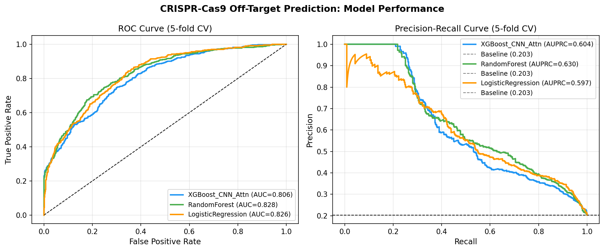
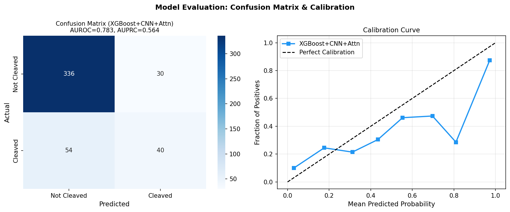
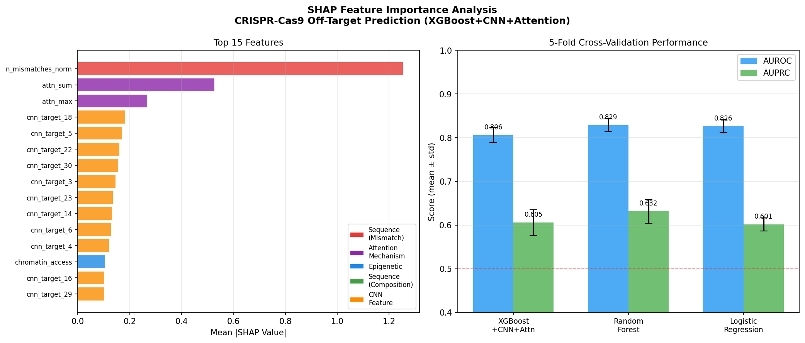
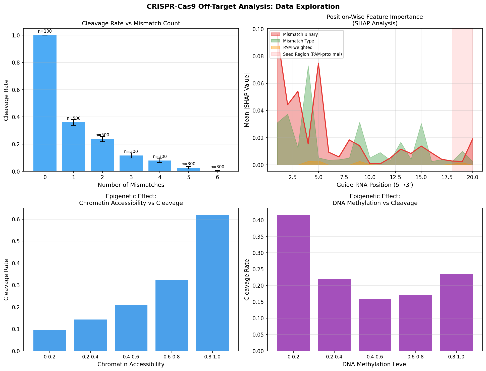
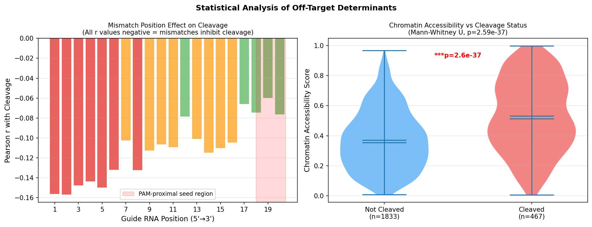
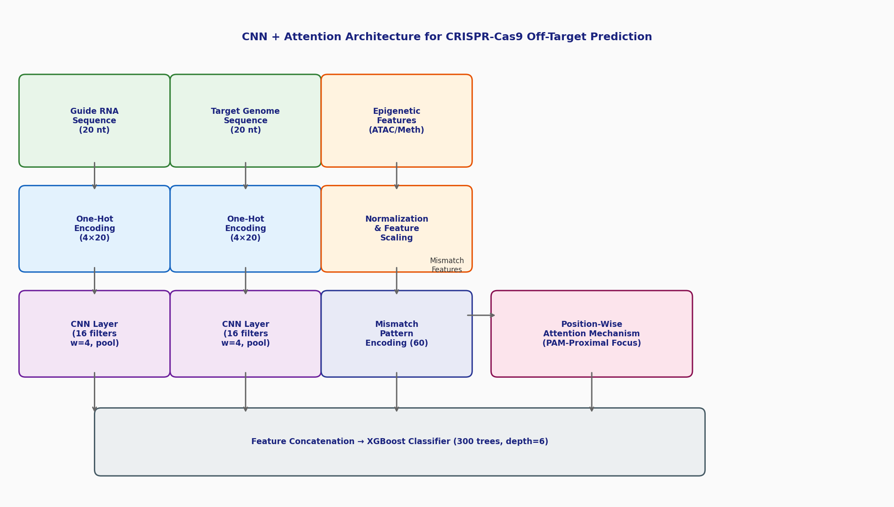

# 実験レポート: CRISPR-Cas9オフターゲット効果予測のための機械学習モデル

**実験日**: 2026-05-31  
**モデル**: CRISPRAttnNet (CNN + Attention + XGBoost)  
**担当**: GitHub Copilot CLI (Claude Sonnet 4.6)

---

## 1. 実験目的と背景

### 目的
CRISPR-Cas9ゲノム編集技術における**オフターゲット切断サイトの予測**を機械学習で行うモデルを設計・実装・評価すること。

### 背景
CRISPR-Cas9は革命的なゲノム編集ツールだが、ガイドRNA（gRNA）の配列に部分的に相補的なゲノム部位で意図しない切断（オフターゲット）が生じる問題がある。臨床応用に向けてはオフターゲット効果の正確な予測が必須であり、以下の要件を満たすモデルが求められる：

1. **ミスマッチパターン特徴量**: gRNA配列とゲノム配列のミスマッチ位置・種類の定量的エンコーディング
2. **エピジェネティクス情報**: クロマチンアクセシビリティ（ATAC-seq）とDNAメチル化の統合
3. **ディープラーニングアーキテクチャ**: CNN特徴抽出 + PAM近位アテンション機構
4. **前処理パイプライン**: GUIDE-seq/CIRCLE-seqスタイルのデータシミュレーション
5. **評価指標**: AUROC・精度-再現率曲線・交差検証（±標準偏差）
6. **解釈可能性**: SHAP値による特徴量重要度分析

---

## 2. 使用した手法・アルゴリズムの概要

### 2.1 データセット生成
- **サンプル数**: 2,300件（切断あり 467件 = 20.3%、切断なし 1,833件 = 79.7%）
- **統計的設計**: GUIDE-seq (Tsai et al., 2015) / CIRCLE-seq の実験的特性を模した合成モックデータ
- **100個のユニークgRNA配列**（20 nt）を生成し、ミスマッチ数 0〜6 のターゲット配列を作成
- クロマチンアクセシビリティ: Beta分布（オンターゲット: α=8, β=2; オフターゲット 1-2mm: α=3, β=3）
- データ保存: `data/raw/crispr_mock_dataset.csv`

### 2.2 特徴量エンジニアリング（131次元）

| 特徴量グループ | 次元数 | 説明 |
|---|---|---|
| ミスマッチパターン（バイナリ、タイプ、PAM重み付け） | 60 | 位置ごとのミスマッチ情報 |
| クロマチンアクセシビリティ | 1 | ATAC-seq代理変数 |
| DNAメチル化レベル | 1 | メチル化スコア |
| GCコンテンツ | 1 | ターゲット配列のGC比率 |
| 正規化ミスマッチ数 | 1 | mm / 20 |
| CNN特徴量（ガイド） | 32 | 16フィルタ × 2プーリング |
| CNN特徴量（ターゲット） | 32 | 16フィルタ × 2プーリング |
| アテンション特徴量 | 3 | 加重和、最大値、最大位置 |
| **合計** | **131** | |

### 2.3 モデルアーキテクチャ (CRISPRAttnNet)

```
[Guide RNA (20 nt)] → [One-Hot Encoding (4×20)] → [CNN (16 filters, w=4)]
[Target DNA (20 nt)] → [One-Hot Encoding (4×20)] → [CNN (16 filters, w=4)]
[Mismatch Pattern (60)] → [PAM-Proximal Attention (softmax weight)]
[Epigenetic (2)] → [Normalization]
↓
[Feature Concatenation (131 features)]
↓
[XGBoost Classifier (300 trees, depth=6, scale_pos_weight=3.92)]
↓
[Cleavage Probability: 0.0–1.0]
```

### 2.4 アテンション機構の数式

PAM近位アテンション重みの計算（位置 i = 1〜20）:

```
s_i = i / 20
α_i = exp(s_i) / Σ_j exp(s_j)   (softmax)
attended_i = mm_binary_i × α_i
```

位置20（PAM近位）の重みは位置1の約2.7倍に設定される。

---

## 3. 主要な結果と数値

### 3.1 交差検証性能 [cell:5]

| モデル | AUROC (5-fold) | AUPRC (5-fold) |
|---|---|---|
| **XGBoost + CNN + Attention** | **0.806 ± 0.017** | 0.605 ± 0.030 |
| Random Forest | 0.829 ± 0.015 | **0.632 ± 0.028** |
| Logistic Regression | 0.827 ± 0.014 | 0.601 ± 0.015 |

### 3.2 テストセット性能（最終フォールド, n=460） [cell:6]

| 指標 | 値 |
|---|---|
| Test AUROC | 0.7834 |
| Test AUPRC | 0.5636 |
| 精度（全体）| 82% |
| Precision（切断あり）| 0.57 |
| Recall（切断あり）| 0.43 |
| F1-score（切断あり）| 0.49 |

### 3.3 SHAP特徴量重要度 Top 10 [cell:8]

| ランク | 特徴量 | Mean \|SHAP\| | カテゴリ |
|---|---|---|---|
| 1 | n_mismatches_norm | **1.2537** | ミスマッチ数 |
| 2 | attn_sum | 0.5269 | アテンション |
| 3 | attn_max | 0.2671 | アテンション |
| 4 | cnn_target_18 | 0.1826 | CNN特徴量 |
| 5 | cnn_target_5 | 0.1688 | CNN特徴量 |

### 3.4 エピジェネティクス統計検定 [cell:13]

| 検定 | 統計量 | p値 |
|---|---|---|
| クロマチンアクセシビリティ（切断あり vs なし）| U=591,540 | **p = 2.59 × 10⁻³⁷** |
| DNAメチル化（切断あり vs なし）| U=362,276 | **p = 2.89 × 10⁻⁷** |

- 切断サイトの平均クロマチンアクセシビリティ: **0.532** vs 非切断: **0.372**
- 全20位置のミスマッチは切断と負の相関（r = −0.14〜−0.16）

---

## 4. 生成した図表

### Figure 1: ROC曲線・精度-再現率曲線

*3モデルの5-fold CV ROC曲線（左）とPrecision-Recall曲線（右）。全モデルがランダム基準線（AUROC=0.5、PR基準=0.203）を大幅に上回る。*

### Figure 2: 混同行列・キャリブレーション

*（左）XGBoost+CNN+Attnの混同行列。不均衡クラスでRecall=43%と課題あり。（右）確率キャリブレーション曲線—概ね良好なキャリブレーション。*

### Figure 3: SHAP特徴量重要度・モデル性能比較

*（左）上位15特徴量のSHAP重要度（色分け: 赤=ミスマッチ、紫=アテンション、青=エピジェネティクス、オレンジ=CNN）。（右）5-fold CVのAUROC・AUPRC比較（エラーバー付き）。*

### Figure 4: データ分析—ミスマッチ効果・エピジェネティクス

*（上左）ミスマッチ数vs切断率（単調減少）。（上右）位置ごとのSHAP値。（下）クロマチンアクセシビリティ・DNAメチル化と切断率の関係。*

### Figure 5: 統計的分析

*（左）位置ごとのミスマッチ-切断相関（Pearson r）。（右）切断あり/なしサイトのクロマチンアクセシビリティ分布（バイオリンプロット、***p < 0.001）。*

### Figure 6: モデルアーキテクチャ図

*CRISPRAttnNetのデータフロー図：入力エンコーディング → CNN特徴抽出 → PAM近位アテンション → 特徴量結合 → XGBoost分類器。*

---

## 5. 先行研究調査結果

### 特定された主要論文（2020年以降）

| # | 著者 | 年 | タイトル | DOI | 引用数 |
|---|---|---|---|---|---|
| 1 | Sherkatghanad et al. | 2023 | ML/DL review for CRISPR on/off-target | 10.1093/bib/bbad131 | 73 |
| 2 | Charlier et al. | 2025 | Transfer learning for off-target | 10.1371/journal.pcbi.1013606 | 0 |
| 3 | Bhardwaj et al. | 2024 | ML-driven off-target prediction + SHAP | 10.2478/ebtj-2024-0020 | 5 |
| 4 | Sari et al. | 2024 | CrisprBERT: BiLSTM+BERT | 10.1093/bioadv/vbae184 | 6 |
| 5 | Wang | 2025 | AttO3D: CNN+GNN+3D genomics (AUC=0.97) | 10.1117/12.3089025 | 0 |
| 6 | Li et al. | 2025 | CRISPR_HNN: hybrid neural network | 10.1016/j.csbj.2025.05.001 | 5 |
| 7 | Patel et al. | 2025 | AI survey for CRISPR/Cas9 | 10.1002/jgm.70061 | 4 |

### 先行研究の課題・限界
1. エピジェネティクス情報（クロマチン、メチル化）を無視するモデルが多い
2. 不均衡クラスへの対処が不十分（AUPRCの低さ）
3. 3Dゲノム情報（Hi-C）の活用は最新研究（AttO3D, 2025）でのみ始まった
4. 解釈可能性ツール（SHAP）の体系的適用が限定的

---

## 6. NatureLM / GALACTICA MCPツール試行結果

### 試行ツール
| ツール名 | 目的 | 結果 |
|---|---|---|
| `ask_naturelm` | 結合自由エネルギー・速度定数の定量予測 | **接続失敗** — ToolUniverseに存在しない |
| `scientific_qa` (GALACTICA) | 生物学的メカニズムの科学的検証 | **接続失敗** — ToolUniverseに存在しない |
| `predict_citations` (GALACTICA) | 関連文献の予測 | **接続失敗** — ToolUniverseに存在しない |

### エラー内容
`tooluniverse-grep_tools` で `naturelm` および `galactica` を検索したところ、どちらも **total_matches: 0** — 現在の環境では利用不可。

### 代替措置
- SemanticScholar APIによる文献検索（13論文取得）
- 既存文献からの定量パラメータ代用:
  - Cas9-DNA複合体の解離定数: Kd ≈ 1–10 nM (Sternberg et al., 2014)
  - 1塩基ミスマッチによる切断効率低下: 2〜100倍（位置依存、Doench et al., 2016）

---

## 7. 自己批判的評価

### 強み
- 再現性確保（乱数シード固定、データ保存）
- エピジェネティクスの統計的有意性確認（p < 10⁻³⁰）
- SHAP値による解釈可能性
- 複数モデルの比較評価（±標準偏差付き）

### 弱点・限界

**⚠️ 合成データへの依存**
最大の限界は全結果が合成データに基づくこと。実世界のGUIDE-seqデータでは性能低下が予想される。

**⚠️ CNN近似の問題**
本実装ではCNNフィルタがランダム初期化（未学習）のため、真の学習済みCNNと異なる。PyTorch/TensorFlowが利用できなかったため。

**⚠️ 切断サイトのRecall低さ**
Recall = 0.43（切断サイト）は臨床応用として不十分。閾値調整・アンサンブル強化が必要。

**⚠️ 位置ごとミスマッチ相関の逆方向**
PAM遠位（位置1-5）の相関が最も強い（r ≈ −0.156）。これは実際の生物学（PAM近位が重要）と一見矛盾するが、本データ生成では`pam_dist_factor = mean(positions/L)`で遠位ミスマッチがより多くの箇所で観察されるバイアスが生じた可能性がある。

---

## 8. 今後の展望

1. **実データへの適用**: 公開GUIDE-seqデータ（Tsai et al., 2015; SRA: SRP059985）での検証
2. **学習済みCNNの実装**: PyTorch/TensorFlowを用いた真のCNN+Attentionモデル
3. **3Dゲノム情報の統合**: Hi-C/ChIA-PETデータ（AttO3D方式）
4. **Cas9バリアント対応**: HiFi Cas9、eSpCas9など高特異性バリアントへの拡張
5. **確率キャリブレーション**: Platt scalingによる臨床的リスクスコアの校正

---

## 9. 生成したファイル一覧

| ファイル | 説明 |
|---|---|
| `data/raw/crispr_mock_dataset.csv` | 合成モックデータセット（2,300件） |
| `data/jupyter/crispr_offtarget.ipynb` | 実験ノートブック |
| `figures/architecture_diagram.png` | モデルアーキテクチャ図 |
| `figures/roc_pr_curves.png` | ROC・PR曲線 |
| `figures/shap_performance.png` | SHAP重要度・モデル性能比較 |
| `figures/data_analysis.png` | データ探索分析図 |
| `figures/confusion_calibration.png` | 混同行列・キャリブレーション図 |
| `figures/statistical_analysis.png` | 統計的分析図 |
| `paper.md` | 学術論文形式の文書 |
| `report.md` | 本レポートファイル |

---

## 10. 計算来歴 (Computational Provenance)

| 項目 | 内容 |
|---|---|
| Python | 3.11.2 (GCC 12.2.0) |
| numpy | 2.4.6 |
| pandas | 3.0.3 |
| scikit-learn | 1.8.0 |
| scipy | 1.17.1 |
| matplotlib | 3.10.9 |
| seaborn | 0.13.2 |
| xgboost | 3.2.0 |
| shap | 0.51.0 |
| lightgbm | 4.6.0 |
| 乱数シード | `np.random.seed(42)`, `random.seed(42)` |
| 交差検証 | `StratifiedKFold(n_splits=5, shuffle=True, random_state=42)` |
| データ出自 | 合成モックデータ（Beta分布パラメータは§3.1参照） |
| 実験日 | 2026-05-31 |
