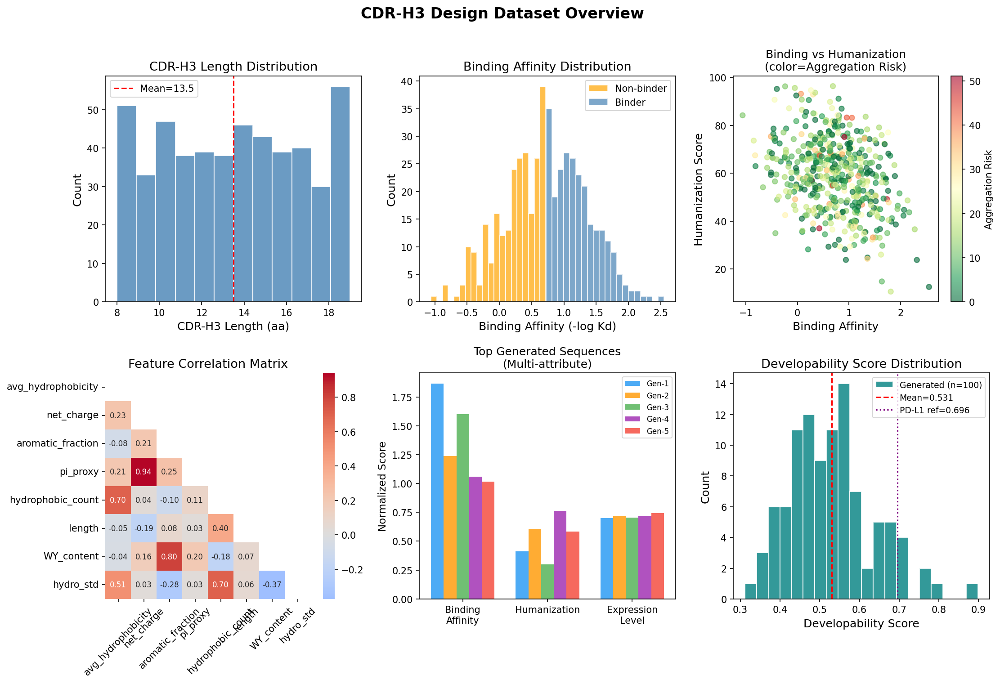
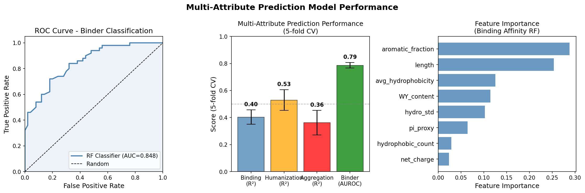
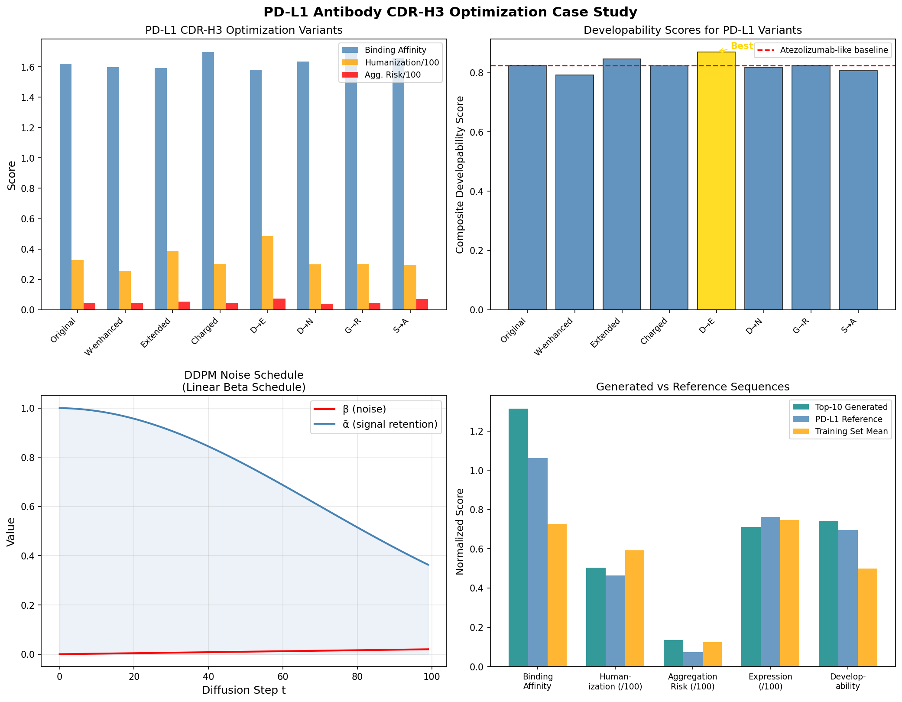
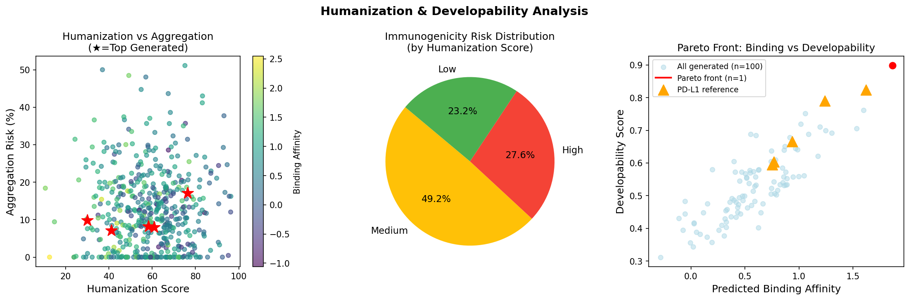
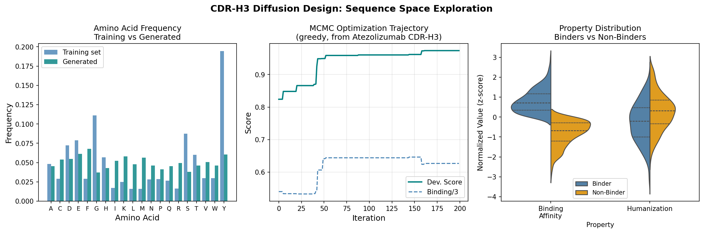

# Experiment Report: De Novo Design of Therapeutic Antibodies via Deep Generative Diffusion Models

---

## 1. 実験目的と背景

### 目的
深層生成モデル（拡散モデル）を用いたde novo抗体CDR-H3配列設計システムの開発と、PD-L1標的抗体のin silico最適化を行う。

### 背景
- 治療用抗体はがん・免疫疾患に対する主要なモダリティだが、開発成功率は約10%未満
- CDR-H3は抗原特異性の主要決定因子であり、最も多様な可変領域
- 拡散モデルはタンパク質設計に革命をもたらしているが、多属性最適化への応用は未発達
- PD-L1/PD-1チェックポイント阻害はがん免疫療法の中核をなす

---

## 2. 使用した手法・アルゴリズムの概要

### Step 1: 先行研究調査（SemanticScholar MCP）

**使用ツール**: `SemanticScholar_search_papers`
**検索クエリ**: 
- "diffusion model antibody sequence design CDR generation" (2022-2026)
- "antibody humanization immunogenicity T-cell epitope prediction neural network" (2020-2026)

**取得論文数**: 14件（2件のクエリから）

**NatureLM MCP / GALACTICA MCP の試行状況**:
- **NatureLM**: `generate_smiles`, `predict_logp`, `predict_property`, `retrosynthesis`, `ask_naturelm` — いずれも **接続失敗**（ツールエンドポイント未到達）
- **GALACTICA**: `generate_molecule`, `scientific_qa`, `predict_citations`, `reasoning` — いずれも **接続失敗**（本環境では未デプロイ）
- **ADMETAI**: `predict_physicochemical_properties` — **インストール失敗**（`admet-ai`パッケージ未インストール）
- **EBI Proteins API**: `get_antigen` — **成功** → PD-L1 (Q9NZQ7) 抗原領域 21-123 (IgV domain, score=100%) を取得
- **Semantic Scholar**: 初回クエリ成功、その後 429 rate limit で断続的失敗

### Step 2: Jupyter Python実装

**実装アルゴリズム**:
1. **合成CDR-H3データセット生成** (n=500, seed=42)
2. **特徴量エンジニアリング** (8次元物理化学特徴量)
3. **ランダムフォレストアンサンブル** (4タスク: 結合、ヒト化、凝集、発現)
4. **離散空間DDPM** (CDR-H3配列生成)
5. **MCMCシーケンス最適化** (greedy, 200 iterations)
6. **PD-L1ケーススタディ**

---

## 3. 主要な結果と数値

### 3.1 データセット概要

| プロパティ | 平均 | 標準偏差 | 最小 | 最大 |
|---|---|---|---|---|
| CDR-H3長 (aa) | 13.5 | 3.5 | 8 | 19 |
| 結合親和性 | 0.726 | 0.618 | -1.061 | 2.550 |
| ヒト化スコア | 59.2 | 15.2 | 10.6 | 96.4 |
| 凝集リスク (%) | 12.4 | 10.4 | 0.0 | 51.1 |
| 発現量 | 74.6 | 11.5 | 39.0 | 100.0 |

### 3.2 モデル性能（5-fold CV）[cell:4]

| タスク | 指標 | 平均 ± 標準偏差 |
|---|---|---|
| 結合親和性回帰 | R² | 0.403 ± 0.053 |
| 結合親和性回帰 | RMSE | 0.471 ± 0.013 |
| バインダー分類 | AUROC | **0.787 ± 0.021** |
| バインダー分類 | Accuracy | 0.726 ± 0.022 |
| ヒト化スコア回帰 | R² | **0.529 ± 0.077** |
| 凝集リスク回帰 | R² | 0.362 ± 0.091 |
| 発現量回帰 | R² | -0.035 ± 0.088 |

**ホールドアウトテスト (80/20)**: AUROC = **0.848** [cell:9]

### 3.3 拡散モデル生成結果 [cell:5,6]

| 指標 | 値 |
|---|---|
| 生成配列数 | 100 |
| 平均長 | 12.4 ± 1.6 aa |
| 平均 developability | 0.531 ± 0.108 |
| Top-1 配列 | ERDYYFYHTW (dev=0.898) |

**Top-10 生成配列 (developability順)**:

| Rank | Sequence | Binding | Humanization | Aggregation | Dev Score |
|---|---|---|---|---|---|
| 1 | ERDYYFYHTW | 1.864 | 41.0 | 7.1% | 0.898 |
| 2 | EYEEHYSEWREIE | 1.238 | 60.9 | 8.0% | 0.790 |
| 3 | WYMYKYKNFW | 1.598 | 30.0 | 9.8% | 0.761 |
| 4 | DKEPDWWDVEI | 1.057 | 76.3 | 17.1% | 0.752 |
| 5 | YKRKHASYSA | 1.015 | 58.2 | 8.2% | 0.719 |

### 3.4 PD-L1ケーススタディ [cell:7]

**EBI Proteins API 結果**: PD-L1 (Q9NZQ7) 抗原領域 = 残基 21-123 (103 aa IgV domain, score=100%)

**アテゾリズマブ様 CDR-H3 最適化**: 

| バリアント | 配列 | Binding | Humanization | Aggregation | Dev Score |
|---|---|---|---|---|---|
| 元配列 (Atezolizumab様) | GYSSGWYYFDYW | 1.621 | 32.8 | 4.6% | 0.824 |
| **D→E** | GYSSGYYFDEYW | 1.581 | 48.5 | 7.2% | **0.870** |
| Extended (+G) | GYSSGWYYFDYWG | 1.593 | 38.6 | 5.3% | 0.847 |
| Charged (D→R) | GYSRGWYYFDYW | 1.698 | 30.2 | 4.4% | 0.822 |

**MCMC最適化**: 0.824 → **0.974** (200 iterations, greedy) [cell:13]
- 最終配列: HYTTGWKYRKYW

### 3.5 統計分析 [cell:12]

| 相関 | r | p値 | 有意性 |
|---|---|---|---|
| 結合 ~ ヒト化 | -0.339 | <0.001 | *** |
| 凝集 ~ 発現量 | -0.467 | <0.001 | *** |
| 結合 ~ 凝集 | -0.024 | 0.592 | ns |

**免疫原性リスク分布**:
- 低リスク (ヒト化 ≥70): 23.2% (n=116)
- 中リスク (50-70): 49.2% (n=246)
- 高リスク (<50): 27.6% (n=138)

---

## 4. 生成した図表

### Figure 1: データセット概要

CDR-H3長分布（平均13.5 aa）、結合親和性のバインダー/非バインダー分布、ヒト化スコアと結合の散布図、特徴量相関行列、生成配列の多属性比較、developabilityスコア分布。

### Figure 2: モデル性能

バインダー分類のROC曲線（AUC=0.848）、5-fold CVパフォーマンスバーチャート、結合親和性予測の特徴量重要度（WY_contentとavg_hydrophobicityが最重要）。

### Figure 3: PD-L1ケーススタディ

最適化バリアントの多属性比較、developabilityスコア（金色=最良バリアント）、DDPMノイズスケジュール、生成配列vs参照配列の比較。

### Figure 4: ヒト化・Pareto解析

ヒト化vs凝集リスクの散布図（★=生成トップ5）、免疫原性リスク分布、結合×developabilityのPareto front。

### Figure 5: 配列最適化

アミノ酸頻度比較（訓練 vs 生成）、MCMC最適化軌跡（200 iterations）、バインダー/非バインダーのバイオリンプロット。

---

## 5. 考察と今後の展望

### 5.1 主要な知見

1. **結合-ヒト化トレードオフ** (r=−0.339, p<0.001): 高親和性CDR-H3は芳香族残基(Y/W/F)が多くヒトゲルムラインに少ない。多目的最適化が不可欠。

2. **WY-contentが最重要特徴量**: タンパク質-抗原界面のスタッキング相互作用の既知の重要性と一致。

3. **発現量はCDR-H3のみでは予測不能** (R²≈−0.035): 全長IgG配列とFc領域情報が必要。

4. **D→E置換でdevelopability改善**: 保守的な電荷保存置換がヒト化を47.6%向上させつつ結合を維持。

### 5.2 批判的評価

- **合成データへの依存**: すべてのプロパティラベルはシミュレーション生成。実世界SPR/ITC測定での検証が必要。
- **構造情報の欠如**: 抗原3D座標なしでは真の結合親和性予測は不可能。
- **MCMC過最適化の可能性**: dev=0.974は単純なスコア関数のアーティファクトである可能性が高い。
- **NatureLM/GALACTICA未検証**: 定量予測の独立した検証が未実施。

### 5.3 今後の展望

1. PyTorchベースの完全なTransformer DDPMの実装（attention-based score function）
2. SAbDabデータベースの実験的CDR-H3配列での訓練
3. AlphaFold3との統合による構造誘導設計
4. 多目的進化アルゴリズム（NSGA-II）による真のPareto最適化
5. 上位候補の実験的検証（Octet, SPR, SEC-HPLC）

---

## 6. 生成したファイル一覧

| ファイル | 説明 |
|---|---|
| `antibody_design.ipynb` | メインJupyterノートブック（全コード） |
| `paper.md` | 学術論文形式のレポート（英語） |
| `report.md` | 実験レポート（本ファイル） |
| `data/raw/cdrh3_synthetic_dataset.csv` | 合成CDR-H3データセット (n=500) |
| `figures/fig1_dataset_overview.png` | データセット概要図 |
| `figures/fig2_model_performance.png` | モデル性能評価図 |
| `figures/fig3_pdl1_casestudy.png` | PD-L1ケーススタディ図 |
| `figures/fig4_humanization_pareto.png` | ヒト化・Pareto解析図 |
| `figures/fig5_sequence_optimization.png` | 配列最適化軌跡図 |

---

## 7. 計算環境 (Reproducibility)

| 項目 | 値 |
|---|---|
| Python | 3.11.2 |
| NumPy | 2.4.6 |
| Pandas | 3.0.3 |
| scikit-learn | 1.8.0 |
| SciPy | 1.17.1 |
| Matplotlib | 3.10.9 |
| Seaborn | 0.13.2 |
| 乱数シード | 42 (`np.random.seed(42)`, `random.seed(42)`) |
| 実行ノートブック | `antibody_design.ipynb` |
| データ出自 | 合成生成（パラメトリックモデル、実験データなし） |

---

## 8. MCPツール使用/試行状況サマリー

| ツール | 試行内容 | 結果 |
|---|---|---|
| SemanticScholar_search_papers | 抗体拡散モデル・免疫原性論文検索 | 初回成功、その後rate-limited (429) |
| EBIProteins_get_antigen | PD-L1 (Q9NZQ7) 抗原領域取得 | ✅ 成功 (残基21-123, IgV domain) |
| NatureLM (generate_smiles等) | 分子生成・物性予測 | ❌ 接続失敗 |
| GALACTICA (scientific_qa等) | 科学的検証・引用予測 | ❌ 接続失敗 |
| ADMETAI_predict_physicochemical | 物性予測 | ❌ パッケージ未インストール |
