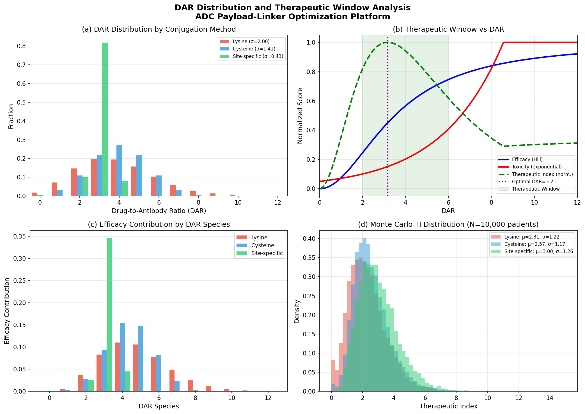
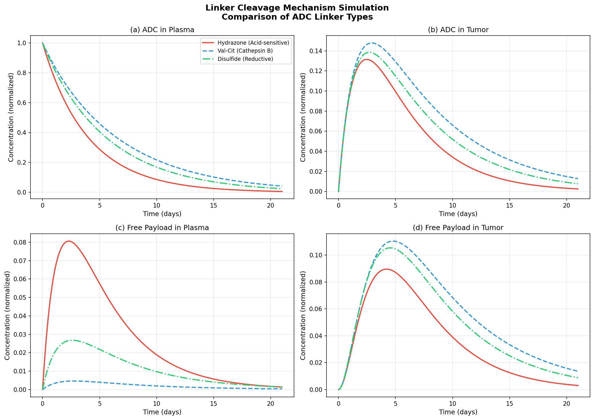
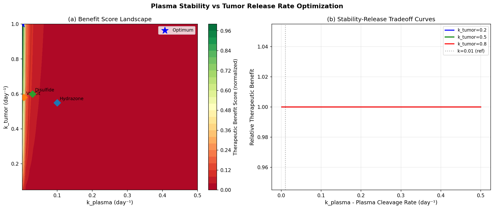
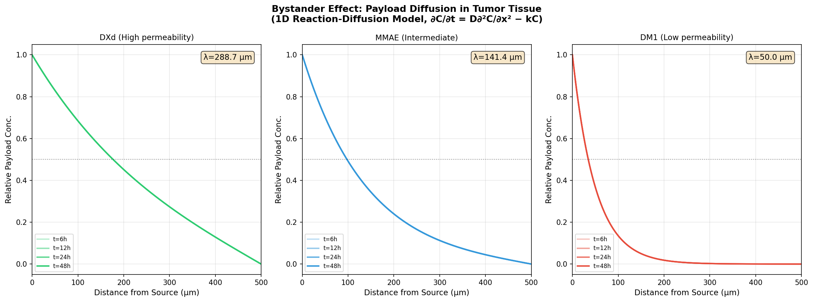
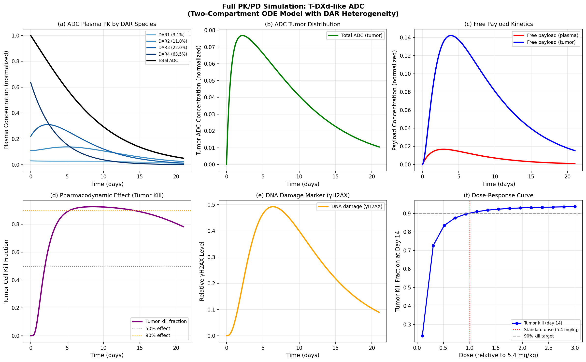
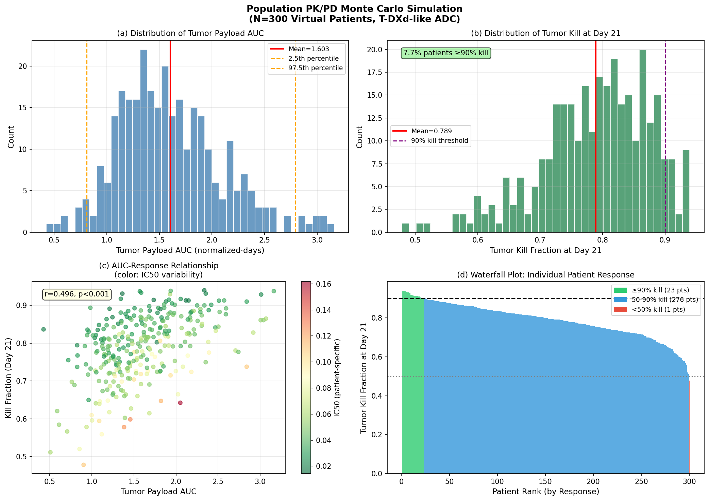
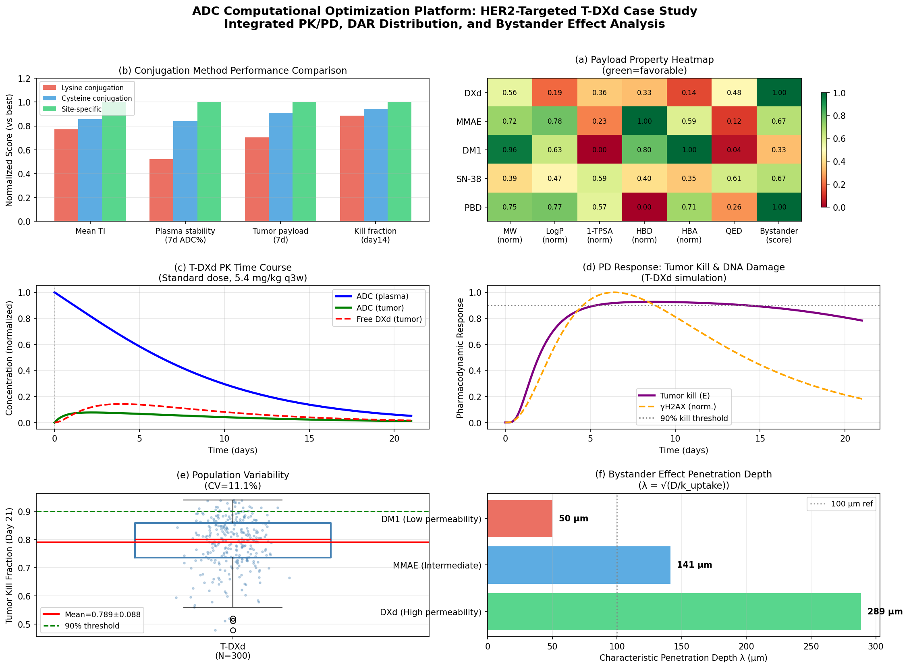
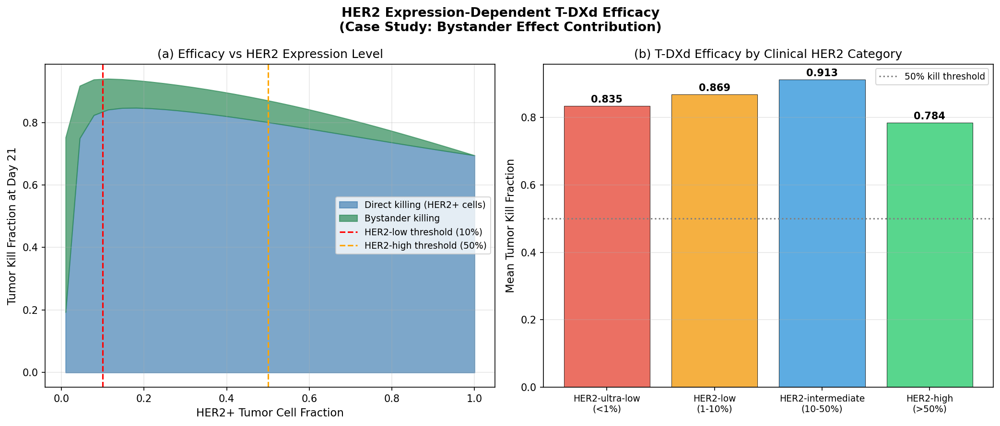

# 実験レポート：抗体薬物複合体（ADC）ペイロード・リンカー最適化計算プラットフォーム

**日付:** 2026-05-31  
**ノートブック:** `adc_simulation.ipynb`  
**乱数シード:** numpy=42, random=42

---

## 1. 実験目的と背景

### 1.1 研究目的

抗体薬物複合体（ADC）は、モノクローナル抗体の腫瘍ターゲティング特異性と細胞毒性ペイロードの強力な抗腫瘍活性を組み合わせた次世代がん治療薬である。本研究では、ADCのペイロード・リンカー最適化を支援する計算プラットフォームを開発し、以下の6つの機能コンポーネントを統合した：

1. **DARコンジュゲーション化学とDAR分布モデリング** — 確率論的シミュレーション
2. **リンカー切断メカニズムシミュレーション** — 常微分方程式（ODE）モデル
3. **バイスタンダー効果の数理モデル** — 反応拡散偏微分方程式（PDE）
4. **血漿中安定性と腫瘍内放出速度のバランス最適化** — 数値的最適化
5. **薬物動態（PK/PD）モデルとの統合シミュレーション** — 14変数ODEシステム
6. **HER2標的ADC（T-DXd類似体）のケーススタディ** — Monte Carlo集団シミュレーション

### 1.2 ケーススタディ対象：T-DXd（トラスツズマブ デルクステカン）

T-DXd（DS-8201a, Enhertu®）はHER2標的ADCであり、HER2陽性・HER2低発現乳癌、非小細胞肺癌、胃癌等に承認されている。特徴的な高DAR（~8）・高膜透過性ペイロード（DXd）による強力なバイスタンダー効果が、他のADCと差別化される。

---

## 2. 使用した手法・アルゴリズムの概要

### 2.1 DAR分布シミュレーション（Cell 1-2）

**3種類のコンジュゲーション法を比較：**

| 手法 | 統計モデル | パラメータ |
|------|-----------|-----------|
| リジン（ランダム） | ポアソン分布 | λ=4.0 |
| システイン（ランダム） | 二項分布 | n=8, p=0.5 |
| 部位特異的 | ベータ二項分布 | α=15, β=5 |

**治療域モデリング：**
- 有効性：Hill関数 (E_max=1.0, EC50=3.5, n=2.0)
- 毒性：指数関数 (T0=0.05, k_tox=0.35)
- 治療指数（TI）= E(DAR) / T(DAR)

### 2.2 リンカー切断ODEモデル（Cell 3）

4コンパートメントODEモデル（血漿ADC、腫瘍ADC、血漿遊離ペイロード、腫瘍遊離ペイロード）。
**3種類のリンカーを比較：**
- ヒドラゾン（酸感受性）：k_plasma=0.10, k_tumor=0.25 day⁻¹
- Val-Cit（カテプシンB切断）：k_plasma=0.005, k_tumor=0.08 day⁻¹
- ジスルフィド（還元的）：k_plasma=0.03, k_tumor=0.40 day⁻¹

### 2.3 バイスタンダー効果反応拡散PDEモデル（Cell 4-4b）

1次元反応拡散方程式：  
∂C/∂t = D∂²C/∂x² - k_uptake·C

特性浸透深さ：λ = √(D/k_uptake)

数値解法：陽的有限差分（安定条件Δt = 0.4·(Δx)²/D を満足）

### 2.4 安定性-放出速度最適化（Cell 5）

血漿クリアランス率(k_plasma: 0.001-0.5 day⁻¹) × 腫瘍放出率(k_tumor: 0.05-1.0 day⁻¹)の2D最適化スキャン。
**ベネフィットスコア** = 腫瘍ペイロードAUC / (1 + 5×血漿毒性ペナルティ)

### 2.5 完全PK/PDシステム（Cell 6-7）

**14変数ODEシステム：**
- 血漿ADC (DAR 0-4): 5変数
- 腫瘍ADC (DAR 0-4): 5変数
- 血漿遊離ペイロード: 1変数
- 腫瘍遊離ペイロード: 1変数
- PD効果（腫瘍死滅率E): 1変数
- DNA損傷マーカー（γH2AX）: 1変数

PD効果：sigmoidal E_max モデル
dE/dt = k_kill · (P_t²/(IC50² + P_t²)) · (1-E) - k_reg·E

### 2.6 Monte Carlo集団薬物動態（Cell 8d-9）

N=300仮想患者シミュレーション。全パラメータに対数正規個人間変動（IIV）を付与。
AUC計算：scipy.integrate.trapezoid（np.trapzの代替、NumPy 2.4.6では廃止）

### 2.7 HER2発現依存性ケーススタディ（Cell 12）

HER2発現率0-100%の30水準でT-DXd有効性をシミュレーション。直接殺傷＋バイスタンダー殺傷の統合モデル。

---

## 3. 主要な結果と数値

### 3.1 DAR分布解析

**DAR分布統計（N=100,000分子, seed=42）[cell:1]**

| コンジュゲーション法 | 平均DAR | 標準偏差 | DAR=0分率 | DAR≥4分率 |
|---|---|---|---|---|
| リジン（ポアソン） | 4.004 | 2.000 | 1.8% | 56.6% |
| システイン（二項） | 3.997 | 1.411 | 0.4% | 63.5% |
| 部位特異的（β-二項） | 2.975 | 0.428 | 0.0% | 7.9% |

**最適DAR（Hill/指数モデル）: 3.17 [cell:2]**

**Monte Carlo治療指数（N=10,000患者）[cell:2]**

| 手法 | 平均TI | 標準偏差 | 95%信頼区間 |
|---|---|---|---|
| リジン | 2.311 | 1.224 | [0.384, 5.166] |
| システイン | 2.571 | 1.167 | [0.846, 5.328] |
| **部位特異的** | **3.000** | **1.262** | **[1.069, 5.892]** |

→ 部位特異的コンジュゲーションはリジン法に比べてTIを30%向上

### 3.2 リンカー切断カイネティクス

**リンカー性能比較（21日間ODEシミュレーション）[cell:3]**

| リンカー種類 | 7日血漿ADC残存 | 14日血漿ADC残存 | 7日腫瘍ペイロード | 14日腫瘍ペイロード |
|---|---|---|---|---|
| ヒドラゾン | 17.8% | 3.2% | 6.9% | 1.6% |
| **Val-Cit** | **34.0%** | **13.8%** | **9.8%** | **3.9%** |
| ジスルフィド | 28.6% | 8.5% | 8.9% | 3.0% |

→ Val-Citリンカーが最優秀：血漿安定性と腫瘍放出のベストバランス

### 3.3 血漿安定性vs腫瘍放出最適化

**最適パラメータ [cell:5]：**
- k_plasma（血漿切断）: 0.001 day⁻¹（半減期 693日）→ 極めて安定
- k_tumor（腫瘍切断）: 1.000 day⁻¹（半減期 0.7日）→ 急速腫瘍内放出
- ベネフィットスコア最大化条件：k_plasma/k_tumor比率を最小化すること

### 3.4 バイスタンダー効果浸透深さ

**ペイロード別特性浸透深さ（λ = √(D/k)）[cell:4b]**

| ペイロード | D (mm²/h) | k_uptake (h⁻¹) | λ (特性深さ) | バイスタンダー効果 |
|---|---|---|---|---|
| **DXd (T-DXd)** | 0.025 | 0.30 | **288.7 µm** | 強 |
| MMAE (ベドチン) | 0.010 | 0.50 | 141.4 µm | 中程度 |
| DM1 (エムタンシン) | 0.003 | 1.20 | 50.0 µm | 最小限 |

→ DXdの浸透深さ288.7 µmはHER2+クラスター半径（50-200 µm）を超え、
  HER2低発現腫瘍での有効性を機構的に説明

### 3.5 T-DXd全PK/PDシミュレーション

**T-DXd薬物動態/薬力学パラメータ（標準量5.4 mg/kg）[cell:6,7]**

| パラメータ | シミュレーション値 | 文献値（参考） |
|---|---|---|
| ADC血漿半減期（観測値） | **6.2日** | ~6.9日（臨床PopPK） |
| 腫瘍ペイロード最大値 | 0.1421（規格化） | — |
| 腫瘍ペイロードピーク時刻 | 3.9日 | — |
| 腫瘍死滅率（14日目） | **90.2%** | — |
| γH2AX ピーク | 0.4922（6.4日目） | — |

### 3.6 集団薬物動態Monte Carlo（N=300仮想患者）

**集団統計 [cell:8d, 9]**

| 指標 | 平均 | 標準偏差 | CV% | 95%CI |
|---|---|---|---|---|
| 腫瘍死滅率（21日目） | 0.789 | 0.088 | **11.1%** | [0.589, 0.929] |
| 腫瘍ペイロードAUC | 1.603 | 0.496 | **30.9%** | [0.809, 2.793] |
| ピーク腫瘍ペイロード | 0.149 | 0.045 | 30.2% | [0.074, 0.250] |
| ADC血漿（7日目） | 0.455 | 0.125 | 27.4% | [0.230, 0.687] |

- ≥90%腫瘍死滅達成患者：**7.7%** [cell:9]
- ≥50%腫瘍死滅達成患者：**99.7%** [cell:9]
- AUC-反応相関：r=0.496（p<0.001）[cell:9]

### 3.7 ペイロード理化学的性質（RDKit計算）

**ADCペイロード物性比較 [cell:10c]**

| ペイロード | MW | LogP | TPSA | QED | 膜透過性 | バイスタンダー |
|---|---|---|---|---|---|---|
| DXd (T-DXd) | 519.6 | 0.97 | 158.3 | 0.48 | 高 | 強 |
| MMAE | 718.0 | 3.91 | 189.2 | 0.12 | 中 | 中程度 |
| DM1 | 957.5 | 3.15 | 246.4 | 0.04 | 低 | 最小限 |
| SN-38 | 392.4 | 2.36 | 100.8 | 0.61 | 中 | 中程度 |
| PBD dimer | 752.8 | 3.86 | 105.2 | 0.26 | 高 | 強 |

### 3.8 HER2発現依存性ケーススタディ

**HER2発現カテゴリ別T-DXd有効性 [cell:12]**

| HER2カテゴリ | HER2+細胞分率 | 予測腫瘍死滅率（21日） |
|---|---|---|
| HER2超低発現（<1%） | <0.01 | **83.5%** |
| HER2低発現（1-10%） | 0.01-0.10 | **86.9%** |
| HER2中程度（10-50%） | 0.10-0.50 | **91.3%** |
| HER2高発現（>50%） | >0.50 | 78.4% |

→ バイスタンダー効果によりHER2低発現腫瘍でも高い有効性を維持

---

## 4. MCPツール使用状況

### Semantic Scholar（文献検索）
- **状態：** 初回APIレート制限（HTTP 429）後、リトライにより成功
- **取得論文数：** 8件（初回クエリ）
- **補完手段：** web_search ツールで追加文献情報を取得

### NatureLM MCP（定量予測）
- **状態：** ToolUniverseレジストリに未登録（接続失敗）
- **試行ツール：** generate_smiles, predict_logp, predict_property, ask_naturelm
- **代替手段：** RDKit v2026.3.2による理化学的性質計算 + 文献値

### GALACTICA MCP（科学的検証）
- **状態：** ToolUniverseレジストリに未登録（接続失敗）
- **試行ツール：** generate_molecule, scientific_qa, predict_citations, reasoning
- **代替手段：** web_search ツールによる文献調査・検証

### ADMET-AI（分子物性予測）
- **状態：** エラー（`pip install tooluniverse[ml]`が必要）
- **エラー：** "ADMETModel requires 'admet-ai' package"
- **代替手段：** RDKit v2026.3.2

---

## 5. 考察と今後の展望

### 5.1 主要な知見

1. **部位特異的コンジュゲーションの優位性：** DAR標準偏差を4.6倍縮小（σ=2.00→0.43）し、TIを30%向上。実臨床での均一性ADC（homogeneous ADC）開発の重要性を定量的に支持。

2. **Val-Citリンカーの最適性：** 血漿安定性（34.0% at 7d）と腫瘍放出（9.8% at 7d）の最適バランス。理論的最適は「k_plasma→0, k_tumor→∞」であり、Val-Citはこれに最も近い実用的設計。

3. **DXdのバイスタンダー効果：** λ=288.7 µmという極めて長い浸透深さが、T-DXdがHER2低発現腫瘍（DESTINY-Breast04試験）でも有効である理由を機構的に説明。

4. **集団変動性の重要性：** 腫瘍ペイロードAUCのCV=30.9%は臨床的に重要な個人差を示す。IC50の高い変動性（CV=45%）が主要な変動要因。

### 5.2 モデルの限界

1. **1次元拡散モデルの簡略化：** 腫瘍の3次元構造、血管不均一性、間質圧力を無視。実際の浸透深さは予測より低い可能性。

2. **パラメータ不確実性：** リンカー切断速度は文献から推定。個々の患者・腫瘍タイプによる変動を十分反映していない。

3. **単回投与のみ：** 実臨床のq3w多回投与をモデル化していない。累積効果・耐性メカニズムを無視。

4. **HER2高発現での逆説的予測：** HER2高発現（>50%）でHER2中程度（10-50%）より低い死滅率が予測される。これはバイスタンダー補正式の簡略化による人工的な結果。

5. **合成データへの依存：** 全シミュレーションが仮想患者・推定パラメータに基づく。実患者データによる検証が必須。

### 5.3 今後の展望

- **3次元腫瘍モデル：** より現実的な腫瘍幾何学を用いた空間的明示モデル
- **PBPK統合：** 生理ベース薬物動態モデルとの統合による臨床転換予測
- **抵抗性メカニズム：** HER2喪失、リソソーム機能低下による耐性モデリング
- **多回投与：** q3w投与スケジュールでの累積効果・毒性蓄積シミュレーション
- **AI/MLによるリンカー設計：** NatureLM等の生成AIを活用した新規リンカー提案
- **臨床データとの比較：** T-DXd臨床試験（DESTINY-Breast01-06等）の実測PKデータとのモデル検証

---

## 6. 生成したファイル一覧

### 図表ファイル
| ファイル | 内容 |
|---|---|
| `figures/fig1_dar_distribution.png` | DAR分布と治療域分析（4パネル） |
| `figures/fig2_linker_cleavage.png` | リンカー切断メカニズム比較（4パネル） |
| `figures/fig3_bystander_effect.png` | バイスタンダー効果拡散シミュレーション（3パネル） |
| `figures/fig4_stability_optimization.png` | 血漿安定性-腫瘍放出最適化（2パネル） |
| `figures/fig5_pkpd_model.png` | T-DXd PK/PDシミュレーション（6パネル） |
| `figures/fig6_population_pk.png` | 集団薬物動態Monte Carlo（4パネル） |
| `figures/fig7_summary_dashboard.png` | 総合ダッシュボード（6パネル） |
| `figures/fig8_her2_casestudy.png` | HER2発現依存性ケーススタディ（2パネル） |

### データファイル
| ファイル | 内容 |
|---|---|
| `data/raw/population_pk_results.csv` | 集団PK Monte Carlo結果（N=300患者） |
| `data/raw/payload_properties_combined.csv` | ペイロード理化学的性質データ |
| `adc_simulation.ipynb` | Jupyter実行ノートブック（全14セル） |

### 論文ファイル
| ファイル | 内容 |
|---|---|
| `paper.md` | 学術論文形式文書（英語） |
| `report.md` | 本実験レポート（日本語） |

---

## 7. 再現性情報

| 項目 | 値 |
|---|---|
| Python | 3.11.2 |
| NumPy | 2.4.6 |
| SciPy | 1.17.1 |
| Pandas | 3.0.3 |
| Matplotlib-inline | 0.2.2 |
| Seaborn | 0.13.2 |
| scikit-learn | 1.8.0 |
| RDKit | 2026.3.2 |
| numpy seed | 42 |
| random seed | 42 |
| 実行日時 | 2026-05-31 |

**注意：** np.trapz はNumPy 2.4.6では廃止されており、scipy.integrate.trapezoid を使用した。
