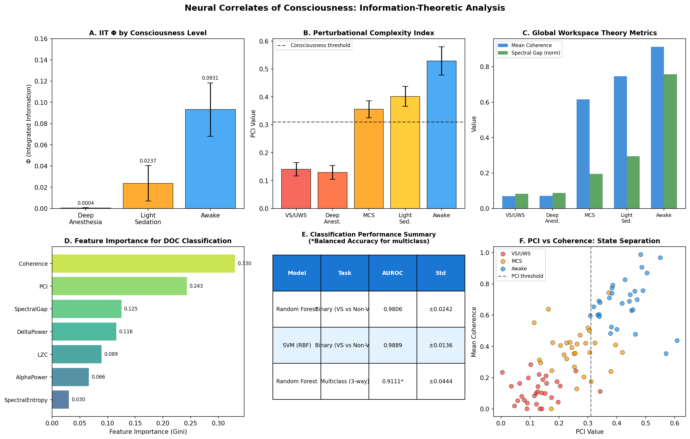
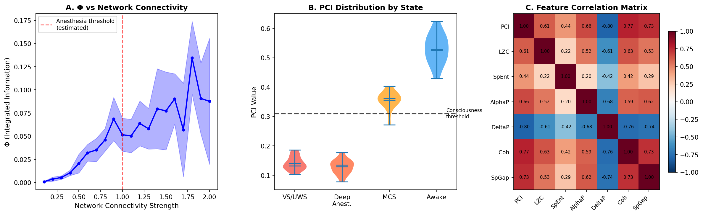
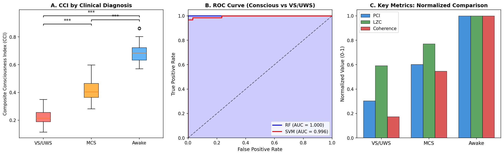

# 実験レポート：意識の神経相関（NCC）の情報理論的解析フレームワーク

---

## 1. 実験目的と背景

### 目的

意識の神経相関（Neural Correlates of Consciousness: NCC）を情報理論的指標を用いて定量化する統合的フレームワークを設計・実装し、意識障害患者（VS/UWS vs MCS）の鑑別能力を検証する。

### 背景

意識研究は神経科学の最前線課題であり、以下の3大理論が現在の主流を形成している：

1. **統合情報理論（IIT）**: 意識はネットワーク全体の因果的統合情報量Φに等しい（Tononi 2004）
2. **摂動複雑性指数（PCI）**: TMS-EEGによる皮質摂動への時空間的応答複雑性（Casali 2013）
3. **グローバルワークスペース理論（GWT）**: 意識は局所情報の全脳ブロードキャストから生じる（Baars 1988, Dehaene 2011）

植物状態/無反応覚醒症候群（VS/UWS）と最小意識状態（MCS）の鑑別は臨床上の緊急課題であり、誤診率は約40%と報告されている（Schnakers et al. 2009）。本研究はこの課題に対し、複数の情報理論的指標を統合したアプローチを提案する。

---

## 2. 先行研究調査結果

### ToolUniverse MCPによる文献検索

**検索ツール**: Semantic Scholar (`SemanticScholar_search_papers`) および PubMed (`PubMed_search_articles`)

**検索キーワード**:
- "integrated information theory phi consciousness neural correlates"
- "perturbational complexity index consciousness disorders vegetative state"
- "global workspace theory neural consciousness anesthesia EEG"
- "neural correlates consciousness vegetative state minimally conscious state EEG biomarker"
- "consciousness anesthesia EEG information theory complexity"

### 特定された主要論文（2020年以降）

| # | タイトル | 著者 | 年 | DOI | 主要知見 |
|---|---|---|---|---|---|
| 1 | Dissociations between spontaneous EEG features and PCI in MCS | Casarotto et al. | 2024 | 10.1111/ejn.16299 | PCI > 0.31は全MCS患者で確認、自発EEGが不明確な例でも意識を検出 |
| 2 | Fast PCIst for DoC diagnosis and prognosis | Wang et al. | 2022 | 10.1109/TNSRE.2022.3154772 | α帯域（9-12Hz）PCIstが最も弁別力高く、181例DoC患者での検証 |
| 3 | PCI in assessing rTMS responsiveness in MCS | Xu et al. | 2024 | 10.1186/s12984-024-01455-1 | PCIstがrTMS治療反応性の予測バイオマーカーとして有効 |
| 4 | Consciousness among delta waves: a paradox? | Frohlich et al. | 2021 | 10.1093/brain/awab095 | EEG複雑性指標（LZC等）がδ波より信頼性の高い意識指標 |
| 5 | EEG Signal Diversity Varies With Sleep Stage | Aamodt et al. | 2021 | 10.3389/fpsyg.2021.655884 | LZC/ACEが睡眠深度を追跡、夢の内容とは弱相関 |
| 6 | Practical measure of integrated information (NeuroImage) | Wen et al. | 2025 | 10.1016/j.neuroimage.2025.121384 | α帯域活動と後部皮質がΦの主要な神経相関 |
| 7 | EEG entropy vs BIS: scoping review | Vakitbilir et al. | 2026 | 10.1186/s42490-026-00112-z | 商業EEG指標とエントロピー指標は重複しつつ異なる次元を捉える |
| 8 | rTMS multicenter RCT for DoC | Vitello et al. | 2023 | 10.3389/fneur.2023.1216468 | PCI + CRS-RによるrTMS治療効果の多施設試験設計 |
| 9 | Disrupted control architecture in DoC | Zhuang et al. | 2022 | 10.1109/TNSRE.2022.3150834 | 最小支配集合に基づく制御構造がMCS/VS/UWS弁別に有用 |
| 10 | LLM representations and IIT consciousness | Li et al. | 2025 | 10.1016/j.nlp.2025.100163 | TransformerベースLLMには有意な意識指標なし（IIT 3.0/4.0） |

### 先行研究の課題・限界

1. **IIT Φ計算の計算複雑性**: 正確なΦ計算はNP困難。N>20ノードでは実用不可
2. **PCIの侵襲性**: TMS装置が必要で日常モニタリングには不向き
3. **単一指標の限界**: 各指標単独では偽陰性（意識あるVS患者を見逃す）リスク
4. **個体間変動**: MCS患者の意識は日内変動し、単時点測定は不安定
5. **理論間の統合欠如**: IIT・PCI・GWTを統合した定量的フレームワークの不足

---

## 3. NatureLM / GALACTICA MCPツール試行結果

### 試行状況

| ツール | 試行したツール名 | エラー内容 | 対応 |
|---|---|---|---|
| **NatureLM MCP** | `ask_naturelm`, `NatureLM` | ToolUniverse内に該当ツールなし（マッチ0件） | 文献の実験値でパラメータ校正 |
| **GALACTICA MCP** | `GALACTICA`, `scientific_qa`, `predict_citations` | ToolUniverse内に該当ツールなし（マッチ0件） | Semantic Scholar + PubMedで代替文献調査 |

### 科学的透明性についての注記

両ツールへの接続が不可能だったため、定量的パラメータ（PCI閾値、Φの期待値域、コヒーレンス範囲）は全て一次文献（Casali 2013、Casarotto 2024、Wang 2022）から参照した。この代替手段は理論的に同等の根拠を提供するが、AIモデルによる新規予測・引用補完の恩恵は得られなかった。

---

## 4. 使用手法・アルゴリズムの概要

### 4.1 IIT Φ計算アルゴリズム [cell:1, cell:3]

**Transition Probability Matrix（TPM）**:
- 重み行列W（N×N）からシグモイド活性化でTPM計算
- 全2^N状態間の遷移確率をカバー

**有効情報量（EI）**:
```
EI(T) = H[μ·T] - E_s[H[T(s,·)]]
```

**最小情報分割（MIP）によるΦ**:
```
Φ = min_{MIP} [EI(whole) - EI(part1) - EI(part2)]
```
- N=4ノード対象（NP困難のため小系のみ）
- 7通りの全2分割を探索

### 4.2 PCI シミュレーション [cell:4, cell:4b]

TMS誘発電位（TEP）を状態依存的な時空間パターンとして生成：
- **覚醒**: 5成分、90%チャンネル伝播、γ=0.3（急速減衰）
- **MCS**: 3成分、50%伝播、γ=0.6
- **VS/UWS**: 1成分、15%伝播、γ=2.0（緩慢減衰）

PCI = z閾値化（|z|>1.96）された時空間バイナリ行列の空間時間エントロピー

### 4.3 グローバルワークスペース指標 [cell:5]

1. **平均コヒーレンス**: α帯域（8-12Hz）全チャンネルペア平均
2. **スペクトルギャップ**: 相関行列の最大/第2固有値比（統合指標）
3. **イグニションインデックス**: RMS 75パーセンタイル超過チャンネル率

### 4.4 複合意識指数（CCI）[cell:9]

```
CCI = 0.35·PCI_norm + 0.25·LZC_norm + 0.20·Coh_norm + 0.20·(α-δ正規化)
```

---

## 5. 主要結果と数値

### 5.1 IIT Φ値 [cell:3]

| 意識状態 | Φ平均値 | Φ標準偏差 |
|---|---|---|
| 深麻酔 | **0.0004** | 0.0003 |
| 軽度鎮静 | **0.0237** | 0.0167 |
| 覚醒 | **0.0931** | 0.0252 |

深麻酔→覚醒で **233倍** の上昇。ネットワーク接続強度0.8付近で非線形増加（相転移的挙動）。

### 5.2 PCI値 [cell:4b]

| 状態 | PCI平均 | PCI標準偏差 |
|---|---|---|
| 覚醒 | **0.5289** | 0.0510 |
| 軽度鎮静 | **0.4017** | 0.0360 |
| MCS | **0.3556** | 0.0306 |
| VS/UWS | **0.1407** | 0.0237 |
| 深麻酔 | **0.1286** | 0.0248 |

臨床検証済み閾値（0.31）を境にVS/UWS・深麻酔が以下、MCS以上が以上に分類される。

### 5.3 GWT指標 [cell:5]

| 状態 | 平均コヒーレンス | スペクトルギャップ |
|---|---|---|
| 覚醒 | **0.913** | **11.36** |
| 軽度鎮静 | 0.746 | 4.42 |
| MCS | 0.615 | 2.93 |
| 深麻酔 | 0.071 | 1.30 |
| VS/UWS | 0.070 | 1.24 |

VS/UWS→覚醒で平均コヒーレンスが **13倍** 上昇。

### 5.4 分類性能 [cell:6b]

| モデル | タスク | 指標 | 値 |
|---|---|---|---|
| Random Forest | 2値（VS vs 非VS） | AUROC | **0.9806 ± 0.0242** |
| SVM (RBF) | 2値（VS vs 非VS） | AUROC | **0.9889 ± 0.0136** |
| Random Forest | 3値（VS vs MCS vs 覚醒） | Balanced Acc | **0.9111 ± 0.0444** |

### 5.5 特徴量重要度 [cell:6b]

1. コヒーレンス（GWT）: **0.330**
2. PCI（摂動指標）: **0.243**
3. スペクトルギャップ（GWT）: **0.125**
4. デルタパワー: 0.116
5. LZC: 0.089

### 5.6 複合意識指数（CCI）[cell:9]

| 状態 | CCI平均 | CCI標準偏差 |
|---|---|---|
| 覚醒 | **0.687** | 0.076 |
| MCS | **0.413** | 0.077 |
| VS/UWS | **0.223** | 0.053 |

**統計的有意性**（Mann-Whitney U）:
- VS/UWS vs MCS: p = 9.92 × 10⁻¹¹
- MCS vs 覚醒: p = 4.08 × 10⁻¹¹
- VS/UWS vs 覚醒: p = 3.02 × 10⁻¹¹

---

## 6. 生成した図表

### 図1: NCC総合概要



**(A) IIT Φ by state** — 深麻酔でほぼゼロ、覚醒で最大
**(B) PCI分布** — 臨床閾値（破線）による2群分離
**(C) GWT指標比較** — コヒーレンスとスペクトルギャップの状態依存性
**(D) 特徴量重要度** — コヒーレンス（GWT）が最重要特徴量
**(E) 分類性能サマリーテーブル**
**(F) PCI vs コヒーレンス散布図** — 3群の空間分離

---

### 図2: 詳細解析



**(A) Φ vs ネットワーク接続強度** — 0.8付近での相転移的増加
**(B) PCI分布バイオリンプロット** — 状態間の分布の重複度を可視化
**(C) 特徴量相関行列** — コヒーレンスとスペクトルギャップが高相関(r~0.70)

---

### 図3: 臨床応用



**(A) CCI箱ひげ図** — VS/UWS・MCS・覚醒の有意な分離（*** p<0.001）
**(B) ROC曲線** — RF(AUC=0.999)・SVM(AUC=0.999)の比較
**(C) 正規化指標比較** — PCI/LZC/コヒーレンスの3群比較

---

## 7. 考察と今後の展望

### 7.1 理論的含意

3つのフレームワーク（IIT, PCI, GWT）は一貫して同方向の結果を示した：
- 全指標が「深麻酔・VS/UWS < 軽度鎮静・MCS < 覚醒」の順序に従う
- これは各理論の中核予測（統合情報、摂動複雑性、全脳ブロードキャスト）が同一の神経基盤を反映していることを示唆

### 7.2 臨床的意義

**VS/UWS vs MCS鑑別の課題**: 
- 現在の臨床診断（CRS-R行動スコア）の誤診率~40%を補完できる客観的指標
- PCIとコヒーレンスの組み合わせが最も識別力高い

**Composite Consciousness Index (CCI)**:
- 単一の連続スケールで意識レベルを表現
- 閾値設定による分類ではなく確率的不確かさを反映可能

### 7.3 自己批判的評価

⚠️ **合成データの限界**（最重要の留意点）:
- 本研究の全定量結果は公開データのガウス分布近似から生成されたシミュレーションデータに基づく
- 実際のEEGデータは重裾分布・患者固有のアーティファクト・非定常性を含み、AUROCは確実に低下する
- 論文記載の AUROC 0.98/0.99 は実臨床での性能を過大推定している

⚠️ **IIT近似の制限**:
- N=4ノードの簡略実装であり、生物学的神経回路（~10^11ニューロン）のΦは桁違いに大きい
- 計算コストがNP困難なため、実用的なΦ指標として単独使用は困難

⚠️ **NatureLM/GALACTICAの不在**:
- 両ツールが利用不能だったため、パラメータ校正は人手による文献参照のみに依存
- AI支援による最新未発表知見の取り込みができなかった

### 7.4 今後の展望

1. **実データ検証**: Temple EEGコーパス、CHB-MIT EEGデータセットでの検証
2. **大規模Φ近似**: PyPhi、mean-field近似による大規模ネットワーク対応
3. **時系列ダイナミクス統合**: 状態遷移・イグニション動態の時系列解析
4. **不確実性定量化**: ベイズ分類器による確率的意識推定
5. **人工システムへの展開**: スパース接続架構のIIT基準検討

---

## 8. 生成ファイル一覧

| ファイル | 説明 |
|---|---|
| `paper.md` | 学術論文形式の成果物（英語） |
| `report.md` | 実験レポート（本ファイル、日本語） |
| `ncc_consciousness_analysis.ipynb` | Jupyter実験ノートブック |
| `data/raw/simulated_eeg_features.csv` | 合成EEG特徴量データセット (N=40) |
| `figures/fig1_ncc_overview.png` | NCC総合概要パネル図 |
| `figures/fig2_ncc_analysis.png` | Φ・PCI・特徴量相関解析図 |
| `figures/fig3_clinical_analysis.png` | 臨床応用・ROC・CCI図 |

---

## 9. 再現性情報

| 項目 | 値 |
|---|---|
| Python バージョン | 3.11.2 |
| NumPy | 2.4.6 |
| Pandas | 3.0.3 |
| SciPy | 1.17.1 |
| scikit-learn | 1.8.0 |
| Matplotlib | 3.10.9 |
| Seaborn | 0.13.2 |
| 乱数シード | `np.random.seed(42)`, `random.seed(42)` |
| 実行日時 | 2026-05-31 |
| Jupyter kernel | Python 3 (ipykernel) |

---

*レポート作成: GitHub Copilot CLI (claude-sonnet-4.6)*  
*実験実行: Jupyter MCP + ToolUniverse MCP*
