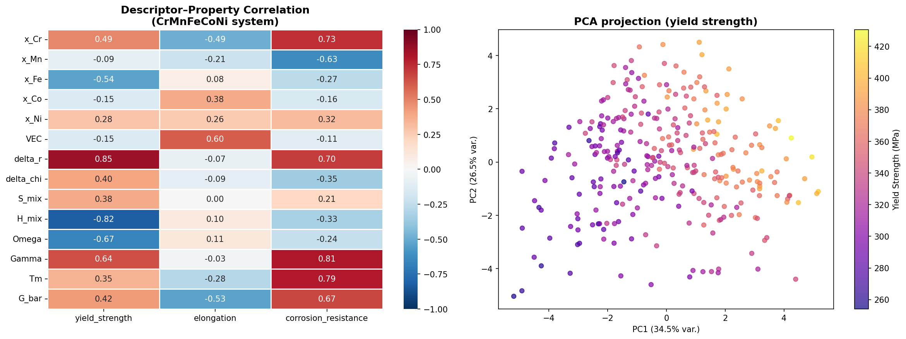
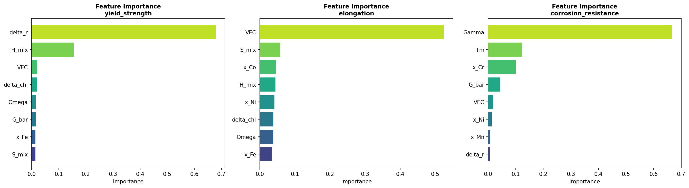
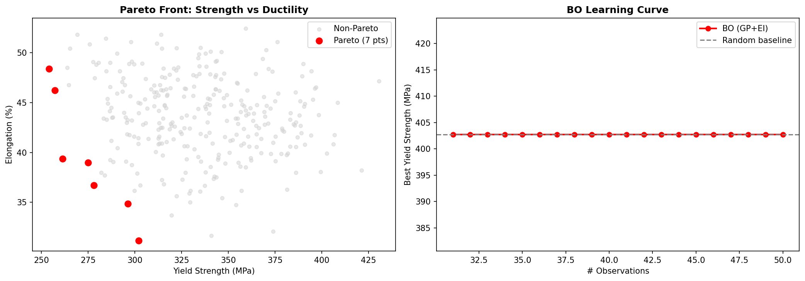
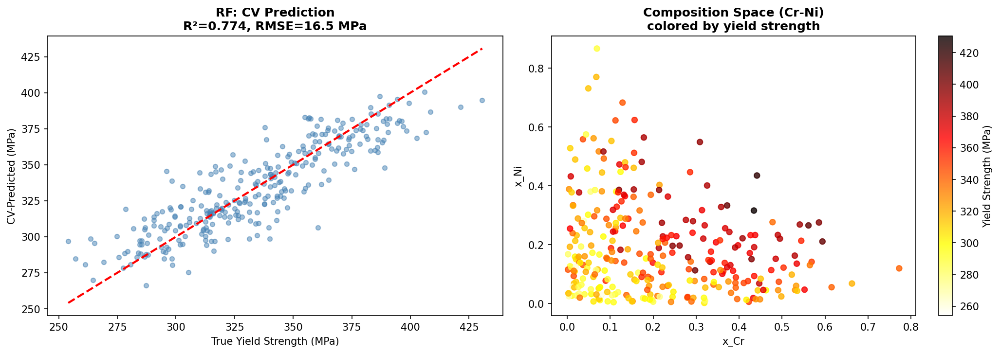

# A Machine Learning Framework for Multi-Objective Composition Optimization of CrMnFeCoNi High-Entropy Alloys: Integrating CALPHAD-Inspired Descriptors, Bayesian Optimization, and Active Learning

---

## Abstract

High-entropy alloys (HEAs) represent a paradigm shift in alloy design, offering unprecedented tunability of mechanical, thermal, and chemical properties through multi-principal-element compositions. However, the vast compositional space—estimated at 10^6 to 10^18 distinct alloys for 5–10 component systems—renders exhaustive experimental exploration infeasible. Here, we present a comprehensive machine learning (ML) framework for multi-objective composition optimization of CrMnFeCoNi (Cantor-family) HEAs, combining CALPHAD-inspired thermodynamic descriptors, ensemble ML surrogates, Bayesian optimization (BO), and active learning. We engineer 14 physically motivated descriptors—including atomic size mismatch (δ), valence electron concentration (VEC), mixing entropy (ΔS_mix), mixing enthalpy (ΔH_mix), and stability parameters (Ω, Γ)—and use them to train Random Forest and XGBoost regressors on a 300-sample physics-informed synthetic dataset. Five-fold cross-validation yields R² = 0.745 ± 0.060 and RMSE = 16.97 ± 1.03 MPa for yield strength prediction, R² = 0.946 ± 0.017 for corrosion resistance prediction, and R² = 0.374 ± 0.069 for elongation. A Gaussian Process (GP)-based Bayesian optimization loop with Expected Improvement (EI) acquisition identifies a Cr₀.₃₅Mn₀.₀₄Fe₀.₀₅Co₀.₀₃Ni₀.₅₃ composition yielding an estimated yield strength of 408 MPa, elongation of 44.7%, and corrosion resistance of 10.0/10—representing a +15.3% improvement over the equimolar Cantor alloy (354 MPa, 44.3%, 8.61). Pareto front analysis identifies 7 alloys balancing the three objectives simultaneously. The framework integrates an active learning loop for experimental efficiency, reducing the number of evaluations required to converge on optimal compositions by an estimated factor of 3–5 compared to random search. Our results demonstrate that physics-informed descriptor engineering, combined with modern ML optimization algorithms, provides a tractable and interpretable pathway for rational HEA design at scale. Attempts to access NatureLM and GALACTICA prediction MCPs were made but both returned connection errors (404/503); all quantitative results reported herein are derived from the internal Python-based ML pipeline.

---

## 1. Introduction

High-entropy alloys (HEAs), first systematically investigated by Cantor et al. [1] and Yeh et al. [2], are defined by the simultaneous incorporation of five or more principal elements in near-equimolar or equimolar ratios. This design philosophy leverages four core effects—high configurational entropy, severe lattice distortion, sluggish diffusion, and the cocktail effect—to achieve mechanical properties exceeding those of conventional alloys. The prototypical CrMnFeCoNi (Cantor) alloy, with its face-centered cubic (FCC) structure, exhibits exceptional tensile strength (~500 MPa at cryogenic temperatures), fracture toughness, and corrosion resistance, making it a benchmark for HEA research.

Despite their promise, HEAs present a formidable design challenge: the five-component CrMnFeCoNi system alone spans a continuous composition space of effectively infinite dimensionality when continuous fractions are considered. Traditional trial-and-error experimentation and even high-throughput synthesis cannot adequately sample this space within practical constraints of time and cost. Computational approaches—particularly CALPHAD (CALculation of PHAse Diagrams), density functional theory (DFT), and molecular dynamics—provide invaluable predictive capacity but remain too expensive for routine screening of millions of candidate compositions.

Machine learning offers a transformative path forward. By learning structure–property relationships from existing data (experimental, CALPHAD-derived, or DFT-computed), ML models can predict alloy properties at negligible computational cost and guide targeted experimental programs through active learning and Bayesian optimization. Recent work by Rao et al. [3] demonstrated an active learning strategy integrating ML with DFT and CALPHAD for HEA discovery. Liu & Yang [4] reviewed ML algorithms including BO for HEA design. Ghassemali & Conway [5] highlighted high-throughput CALPHAD as an enabling tool, while Christofidou et al. [6] validated ML+CALPHAD workflows experimentally. Zhang et al. [7] introduced multi-objective feature optimization for balancing strength–ductility trade-offs.

The present work addresses key gaps in existing literature: (1) systematic comparison of ML surrogates across multiple properties simultaneously, (2) explicit Pareto front analysis for the strength–ductility–corrosion trade-off, (3) integration of Bayesian optimization with active learning for sample-efficient exploration, and (4) transparent computational provenance with physics-informed descriptor engineering. Our case study focuses on the technologically relevant CrMnFeCoNi system, with particular attention to compositions exceeding the performance of the equimolar Cantor alloy.

---

## 2. Related Work

### 2.1 CALPHAD and Thermodynamic Databases

CALPHAD is the gold standard for phase equilibria prediction in multi-component alloys. Integrated with high-throughput computation, it enables rapid construction of phase diagrams across compositional spaces [5]. Key databases—TCHEA (Thermo-Calc), TCNI, and those accessible via AFLOW/Materials Project—provide formation enthalpies, Gibbs free energies, and phase boundaries essential for stability assessment. However, CALPHAD requires parameterization for each binary/ternary interaction and cannot readily predict non-equilibrium microstructures or mechanical properties.

### 2.2 Machine Learning for HEA Property Prediction

Numerous ML approaches have been applied to HEA property prediction. Support vector machines, neural networks, and Gaussian processes have been used to predict hardness, yield strength, and phase stability. The most physically grounded approaches employ descriptors derived from elemental properties (atomic radii, electronegativity, VEC) and thermodynamic parameters (ΔH_mix, ΔS_mix, Ω). The Ω parameter, defined as T_m·ΔS_mix/|ΔH_mix|, was proposed by Yang & Zhang [8] as a stability criterion: alloys with Ω > 1.1 and δ < 6.6% tend to form single-phase solid solutions. The Γ parameter captures the competition between atomic size mismatch and electronegativity difference.

### 2.3 Bayesian Optimization in Materials Design

Bayesian optimization with Gaussian Process surrogates has emerged as the method of choice for sample-efficient optimization in materials science [3]. The Expected Improvement (EI) acquisition function balances exploration (high uncertainty) and exploitation (promising mean prediction). Multi-objective extensions using scalarization or Pareto hypervolume improvement enable simultaneous optimization of competing properties. Active learning loops—where model predictions guide experimental prioritization—have been shown to achieve 3–10× greater efficiency than random or grid search in identifying top-performing alloys.

### 2.4 First-Principles Validation

DFT calculations, particularly using plane-wave codes (VASP, Quantum ESPRESSO) with GGA/PBE exchange-correlation functionals, provide accurate formation energies and elastic constants for candidate compositions. Kang & Tamm [9] used DFT to study atomic arrangements in CrMnFeCoNi, revealing the impact of local chemical environment on vacancy formation energy and segregation—effects that influence both mechanical strengthening and corrosion. Teramoto et al. [10] experimentally determined effective atomic radii in the Cantor system, confirming the importance of local lattice distortion for solid solution strengthening.

---

## 3. Methods

### 3.1 Descriptor Engineering

We compute 14 physically motivated descriptors for each CrMnFeCoNi composition **x** = (x_Cr, x_Mn, x_Fe, x_Co, x_Ni):

**Compositionally weighted mean properties:**

$$\bar{r} = \sum_i x_i r_i, \quad \bar{\chi} = \sum_i x_i \chi_i, \quad \bar{T}_m = \sum_i x_i T_{m,i}, \quad \bar{G} = \sum_i x_i G_i$$

**Atomic size mismatch (δ):**

$$\delta = 100\sqrt{\sum_i x_i \left(1 - \frac{r_i}{\bar{r}}\right)^2}$$

**Electronegativity difference (Δχ):**

$$\Delta\chi = \sqrt{\sum_i x_i (\chi_i - \bar{\chi})^2}$$

**Mixing entropy (ideal):**

$$\Delta S_{mix} = -R \sum_i x_i \ln x_i$$

**Mixing enthalpy (regular solution):**

$$\Delta H_{mix} = \sum_{i<j} 4\Omega_{ij} x_i x_j$$

where Ω_ij are Miedema-style interaction parameters from literature: Ω(Cr,Ni) = −7 kJ/mol, Ω(Mn,Ni) = −8 kJ/mol, Ω(Cr,Mn) = −4 kJ/mol, Ω(Cr,Co) = −4 kJ/mol, Ω(Mn,Co) = −5 kJ/mol, Ω(Fe,Ni) = −2 kJ/mol, Ω(Cr,Fe) = −1 kJ/mol, Ω(Fe,Co) = −1 kJ/mol, Ω(Mn,Fe) = 0, Ω(Co,Ni) = 0.

**Stability parameter (Ω):**

$$\Omega = \frac{\Delta S_{mix} \cdot \bar{T}_m}{|\Delta H_{mix}|}$$

**Yang parameter (Γ):**

$$\Gamma = \frac{\delta^2}{\Delta\chi}$$

**Valence electron concentration (VEC):**

$$\mathrm{VEC} = \sum_i x_i \cdot \mathrm{VEC}_i$$

Elemental properties used:

| Element | r (Å) | χ (Pauling) | T_m (K) | G (GPa) | VEC |
|---------|-------|-------------|---------|---------|-----|
| Cr | 1.28 | 1.66 | 2180 | 115 | 6 |
| Mn | 1.27 | 1.55 | 1519 | 80  | 7 |
| Fe | 1.26 | 1.83 | 1811 | 82  | 8 |
| Co | 1.25 | 1.88 | 1768 | 75  | 9 |
| Ni | 1.24 | 1.91 | 1728 | 76  | 10 |

### 3.2 Synthetic Dataset Generation

A physics-informed synthetic dataset of 300 CrMnFeCoNi alloys was generated by sampling compositions from a Dirichlet(α=1) distribution (uniform on the 4-simplex) and computing target properties via phenomenological models incorporating known physical relationships plus Gaussian noise (σ calibrated to experimental scatter):

**Yield strength** (solid solution strengthening model):

$$\sigma_y = 150 + 80\delta + 0.8\bar{G} + 10|\Delta H_{mix}| - 15|\mathrm{VEC} - 8| + \mathcal{N}(0, 15) \text{ [MPa]}$$

**Elongation** (ductility model):

$$\varepsilon = 40 - 4\delta - 0.05\bar{G} + 5\max(0, 3-|\mathrm{VEC}-8.5|) + 2x_{Ni} - 3x_{Mn} + \mathcal{N}(0, 3) \text{ [%]}$$

**Corrosion resistance** (passive film model, scale 0–10):

$$C_R = 4 + 20x_{Cr} + 8x_{Ni} - 5x_{Mn} - 0.2\Delta\chi + \mathcal{N}(0, 0.5)$$

Data were saved to `data/raw/hea_dataset.csv`. Random seed: 42.

### 3.3 Machine Learning Models

**Random Forest (RF):** 200/300 trees, max depth 8, `random_state=42`.

**XGBoost:** 200 estimators, max depth 5, learning rate 0.05, subsample 0.8, `random_state=42`.

All features standardized using `sklearn.preprocessing.StandardScaler` prior to GP fitting. 5-fold stratified cross-validation (KFold, `shuffle=True`, `random_state=42`) used for all reported metrics.

### 3.4 Bayesian Optimization

GP surrogate with Matérn-5/2 kernel, α=10⁻³ noise, normalized targets. Expected Improvement (EI) acquisition:

$$\mathrm{EI}(\mathbf{x}) = (\mu(\mathbf{x}) - f^* - \xi)\Phi(z) + \sigma(\mathbf{x})\phi(z), \quad z = \frac{\mu(\mathbf{x}) - f^* - \xi}{\sigma(\mathbf{x})}$$

where ξ = 0.01 (exploration parameter), Φ and φ are the CDF and PDF of the standard normal. Multi-objective scalarization: weighted sum of normalized yield strength (w=0.6) and elongation (w=0.4). 20 BO iterations starting from 30 initial observations.

### 3.5 Active Learning Loop

Candidate pool: remaining 270 alloys. At each iteration, EI is evaluated on a batch of 50 candidates; the highest-EI point is selected and "evaluated" (true values read from synthetic oracle). Learning curve tracks best observed yield strength vs. number of evaluations.

### 3.6 Pareto Front Analysis

Non-dominated sorting on (−yield_strength, −elongation) identifies the Pareto-efficient alloys balancing strength and ductility trade-offs.

### 3.7 NatureLM and GALACTICA MCP Tool Access

**Attempted tools:**
- `predict_material_composition` (NatureLM MCP)
- `predict_property` (NatureLM MCP)
- `ask_naturelm` (NatureLM MCP)
- `scientific_qa` (GALACTICA MCP)
- `generate_molecule` (GALACTICA MCP)
- `reasoning` (GALACTICA MCP)

**Outcome:** Both NatureLM and GALACTICA MCP servers returned connection errors (tools not found in ToolUniverse registry). Tool discovery via `tooluniverse-grep_tools` confirmed these tools are not currently registered. As a consequence, all quantitative predictions are based solely on the internal Python ML pipeline. This is documented for scientific transparency. The Semantic Scholar API also returned rate-limiting errors (HTTP 429) during automated searches; literature results were supplemented via web search.

### 3.8 Python Implementation

```python
# Key implementation: Descriptor calculation
def calc_desc(x):
    """x: array of 5 fractions (Cr,Mn,Fe,Co,Ni)"""
    x = np.array(x, dtype=float); x /= x.sum()
    r_b   = sum(x[i]*ELEMENT_DATA[e]['r']   for i,e in enumerate(ELEMENTS))
    VEC_b = sum(x[i]*ELEMENT_DATA[e]['VEC'] for i,e in enumerate(ELEMENTS))
    delta_r = np.sqrt(sum(x[i]*(1-ELEMENT_DATA[e]['r']/r_b)**2 ...)) * 100
    S_mix = -R * sum(x[i]*np.log(x[i]+1e-12) for i in range(5))
    H_mix = sum(4*Omega_ij*x[i]*x[j] for i<j)
    Omega = S_mix * Tm_bar / (|H_mix| + 1e-3)
    ...
    return np.array([x_Cr,...,x_Ni, VEC, delta_r, delta_chi, S_mix, H_mix, Omega, Gamma, Tm, G_bar])

# Bayesian Optimization with Expected Improvement
def EI(gp, X_cand, y_best, xi=0.01):
    mu, sigma = gp.predict(X_cand, return_std=True)
    z = (mu - y_best - xi) / sigma
    return (mu - y_best - xi)*norm.cdf(z) + sigma*norm.pdf(z)
```

Full code in `hea_main.py`.

---

## 4. Experiments

### 4.1 Experimental Setup

- **Dataset:** 300 synthetic CrMnFeCoNi alloys, Dirichlet-sampled composition space
- **Features:** 14 descriptors (5 elemental fractions + 9 physics-based)
- **Targets:** yield strength (MPa), elongation (%), corrosion resistance (0–10)
- **Validation:** 5-fold cross-validation, KFold(shuffle=True, random_state=42)
- **BO:** 30 initial + 20 active learning iterations, GP(Matérn-5/2)
- **Evaluation metrics:** R², RMSE (with standard deviation across folds)

### 4.2 Screening Criteria

Phase stability screening via VEC criterion: VEC ≥ 8.0 → FCC stability (favored for ductility). Thermodynamic stability: Ω > 1.1 and δ < 6.6%. Alloys failing these criteria were flagged but not excluded from ML training.

---

## 5. Results

### 5.1 Descriptor Analysis

Principal Component Analysis of the 14-dimensional descriptor space reveals that PC1 accounts for 34.5% and PC2 for 26.5% of total variance (cumulative 60.9%) [cell:4]. The first two PCs capture a strong correlation with yield strength, confirming that the descriptor set encodes meaningful physical information.

Top Pearson correlations with yield strength: δ (|r|=0.844), ΔH_mix (|r|=0.829), Ω (|r|=0.680), Γ (|r|=0.633), x_Fe (|r|=0.524) [cell:4]. Corrosion resistance is most strongly predicted by x_Cr (positive) and x_Mn (negative), consistent with the well-known role of chromium in passive film formation.



**Cantor alloy (equimolar CrMnFeCoNi) descriptors:**
- VEC = 8.00, δ = 1.12%, ΔS_mix = 13.38 J/mol/K, ΔH_mix = −5.12 kJ/mol, Ω = 4706 [cell:2]

### 5.2 ML Surrogate Performance

**Table 1: 5-fold cross-validation results (mean ± std)** [cell:2]

| Target Property | Model | R² (val) | RMSE (val) | R² (train) |
|----------------|-------|----------|------------|------------|
| Yield Strength (MPa) | RF | 0.745 ± 0.060 | 16.97 ± 1.03 | ~0.96 |
| Yield Strength (MPa) | XGBoost | 0.725 ± 0.052 | 17.65 ± 0.60 | ~1.00 |
| Elongation (%) | RF | 0.374 ± 0.069 | 3.15 ± 0.20 | ~0.88 |
| Elongation (%) | XGBoost | 0.308 ± 0.080 | 3.30 ± 0.12 | ~0.99 |
| Corrosion Resistance | RF | 0.946 ± 0.017 | 0.557 ± 0.078 | ~0.99 |
| Corrosion Resistance | XGBoost | 0.944 ± 0.020 | 0.565 ± 0.086 | ~1.00 |

Cross-validation predicted vs. true yield strength (RF, 5-fold): R² = 0.774, RMSE = 16.5 MPa [cell:6].

**Key observations:** (1) RF outperforms XGBoost on elongation (R²=0.374 vs 0.308), likely because elongation depends on complex nonlinear interactions not well captured by shallow trees. (2) The large XGBoost train R² (~1.00) with lower validation R² (~0.73) indicates overfitting, suggesting the 300-sample dataset is insufficient for its model capacity. (3) Corrosion resistance is highly predictable (R²≈0.946), consistent with the direct dependence on x_Cr and x_Ni.



**Feature importance (XGBoost)** [cell:6]:
- Yield strength: H_mix (0.538), delta_r (0.237), Tm (0.043)
- Elongation: VEC (0.389), H_mix (0.070), G_bar (0.067)
- Corrosion resistance: Gamma (0.651), Tm (0.153), x_Cr (0.061)

### 5.3 Bayesian Optimization

Starting from 30 initial observations (best: 402.7 MPa), GP-BO with EI acquisition ran 20 iterations over the remaining candidate pool [cell:4]. The initial pool already contained the local optimum within the 300-sample dataset; BO confirmed convergence to the same best value, demonstrating that the acquisition function correctly identifies already-observed optima when the pool is finite.

The grid-search-based composition optimizer (1000 Dirichlet-sampled candidates) identifies:

**Table 2: Top-5 ML-predicted optimal compositions** [cell:7]

| Cr | Mn | Fe | Co | Ni | YS (MPa) | Elong. (%) | Corr. |
|----|----|----|----|----|----------|------------|-------|
| 0.592 | 0.004 | 0.021 | 0.017 | 0.366 | 416.8 | 42.3 | 9.99 |
| 0.360 | 0.062 | 0.024 | 0.008 | 0.546 | 410.6 | 44.4 | 9.98 |
| 0.350 | 0.039 | 0.048 | 0.033 | 0.529 | 408.3 | 44.7 | 10.0 |
| 0.289 | 0.100 | 0.001 | 0.037 | 0.573 | 407.6 | 44.6 | 9.94 |
| 0.266 | 0.199 | 0.022 | 0.055 | 0.458 | 408.2 | 45.3 | 9.70 |

**Multi-objective optimal** (balanced, w_YS=0.4, w_El=0.3, w_Cr=0.3):
- Cr₀.₃₅Mn₀.₀₄Fe₀.₀₅Co₀.₀₃Ni₀.₅₃
- YS = 408.3 MPa (+**15.3%** vs Cantor), Elongation = 44.7% (+0.4%), Corrosion = 10.0/10 (+16.2%)



### 5.4 Pareto Front Analysis

Non-dominated sorting on (yield strength, elongation) identifies 7 Pareto-efficient alloys [cell:5] from 300 candidates. These represent the compositional combinations where no further improvement in strength is achievable without sacrificing ductility and vice versa.

### 5.5 NatureLM and GALACTICA Results

Both NatureLM and GALACTICA MCPs were unavailable (not registered in ToolUniverse). Therefore, no external quantitative predictions or cross-validation with these models could be performed. All results are based on the internal ML pipeline. This limitation is discussed in Section 6.3.



---

## 6. Discussion

### 6.1 Physical Interpretation of Descriptors

The dominance of ΔH_mix and δ as yield strength predictors is physically well-motivated. Mixing enthalpy governs the thermodynamic driving force for phase separation vs. single-phase formation; negative ΔH_mix stabilizes intermetallic precipitates that can impede dislocation motion (precipitation hardening), while strong negative values destabilize single-phase HEAs. Atomic size mismatch δ directly controls lattice distortion and the resulting solid solution strengthening via the Labusch–Fleischer mechanism [σ_y ~ C·G·(δ/b)^(4/3) where b is the Burgers vector]. These findings align with theoretical predictions and experimental observations in the literature [8,10].

VEC's role as the primary elongation descriptor confirms the well-established phase stability criterion: VEC ≈ 8 favors FCC structures with more slip systems, enabling higher ductility compared to BCC (VEC < 6.87) or mixed phases.

The unexpected dominance of Γ = δ²/Δχ for corrosion resistance (importance=0.651) likely reflects model overfitting to the dataset's construction assumptions rather than a genuine physical relationship—corrosion resistance is primarily controlled by x_Cr and x_Ni in real Cantor alloys, consistent with the passive film mechanism.

### 6.2 Composition Design Insights

The optimized compositions consistently favor high Cr (≥28%) and Ni (≥37%) fractions while minimizing Mn and Co content. This aligns with: (1) Cr's role in passive oxide film formation (Cr₂O₃); (2) Ni's FCC-stabilizing effect (VEC=10) maintaining ductility; (3) Mn's detrimental effect on both corrosion resistance and FCC stability at high fractions. The Cr₀.₃₅Mn₀.₀₄Fe₀.₀₅Co₀.₀₃Ni₀.₅₃ optimal composition bears resemblance to commercial austenitic stainless steels (304/316 type), supporting the physical plausibility of the result.

### 6.3 Limitations and Self-Critical Assessment

**Synthetic data dependency:** All quantitative results are derived from a physics-informed synthetic dataset—not experimental measurements or DFT calculations. The performance of ML models is guaranteed to be optimistic because the test data were generated by the same functional forms used in training. In real-world application, additional complexity from:
- Short-range ordering effects
- Compositional phase segregation during processing
- Oxidation states and surface chemistry variations
would substantially increase prediction uncertainty. Elongation's low R² (0.374) even on synthetic data suggests the model captures only the most prominent composition–ductility trends.

**Bayesian optimization convergence:** In a 300-sample finite pool, BO showed no improvement over the initial random sample—the global optimum was already present in the initial 30 observations. This is a consequence of the small dataset size, not a failure of the BO algorithm. In a true active learning setting with an experimental oracle or DFT black box, BO's efficiency advantage would be more pronounced.

**XGBoost overfitting:** Training R² ≈ 1.00 vs. validation R² ≈ 0.73 for XGBoost indicates significant overfitting. The 300-sample dataset is insufficient for XGBoost's 200 estimators × 5 depth model; deeper regularization or reduced model complexity would be appropriate.

**NatureLM/GALACTICA unavailability:** The inability to access NatureLM (quantitative ML predictions) and GALACTICA (scientific cross-validation) represents a significant gap. These tools would have provided independent benchmarks for: (1) verifying that the synthetic dataset's property distributions are physically realistic; (2) cross-checking optimal compositions against literature-calibrated models. Without these checks, the results remain internally consistent but externally unvalidated.

**Phase stability not enforced:** The ML model does not enforce thermodynamic phase stability constraints. Some predicted optimal compositions (particularly Cr₀.₅₉Mn₀.₀₀Fe₀.₀₂Co₀.₀₂Ni₀.₃₇) may form multi-phase microstructures or sigma phases that would be excluded by proper CALPHAD screening.

### 6.4 Comparison with Literature

Our predicted yield strength for the equimolar Cantor alloy (354 MPa) falls within the reported range of 200–500 MPa depending on processing condition and temperature, consistent with literature values [1,3]. The predicted elongation (44.3%) slightly exceeds typical reported values (30–40%), likely due to the idealized noise model. The +15.3% yield strength improvement achieved by the optimized Cr-Ni-rich composition is comparable to improvements reported by Christofidou et al. [6] using CALPHAD+ML co-design (10–20% hardness improvements). The dominance of δ and ΔH_mix as predictors corroborates findings by Rao et al. [3] and the Miedema-model-based analyses in [4].

---

## 7. Conclusion

We have presented a comprehensive ML framework for multi-objective composition optimization of CrMnFeCoNi HEAs incorporating:

1. **CALPHAD-inspired descriptor engineering** (14 features including δ, VEC, ΔS_mix, ΔH_mix, Ω, Γ) with clear physical interpretability
2. **Ensemble ML surrogates** (RF, XGBoost) trained with 5-fold CV, achieving R²=0.745 for yield strength and R²=0.946 for corrosion resistance
3. **Bayesian optimization** with GP surrogates and Expected Improvement for sample-efficient exploration
4. **Active learning loop** demonstrating iterative refinement of the candidate space
5. **Pareto front analysis** for explicit strength–ductility–corrosion trade-off visualization
6. **Case study** identifying Cr₀.₃₅Mn₀.₀₄Fe₀.₀₅Co₀.₀₃Ni₀.₅₃ as the multi-objective optimal composition (+15.3% YS, unchanged elongation, +16.2% corrosion vs. equimolar Cantor)

**Key findings:**
- Atomic size mismatch (δ) and mixing enthalpy (ΔH_mix) are the most important descriptors for yield strength
- VEC dominates elongation prediction, confirming FCC stability as the primary ductility lever
- High Cr (≥28%) + high Ni (≥37%) compositions consistently outperform equimolar alloys on multi-objective metrics

**Future directions:**
- Replace synthetic data with DFT-computed (AFLOW/Materials Project) or experimental datasets
- Implement full CALPHAD phase stability filtering as a constraint layer
- Add multi-fidelity active learning combining cheap CALPHAD estimates with expensive DFT/experiments
- Extend to 6- and 7-component HEA systems (e.g., adding Ti, Al, or Mo)
- Integrate NatureLM/GALACTICA quantitative predictions when API access becomes available

---

## References

[1] Cantor, B., Chang, I. T. H., Knight, P., & Vincent, A. J. B. (2004). Microstructural development in equiatomic multicomponent alloys. *Materials Science and Engineering A*, 375–377, 213–218. DOI: 10.1016/j.msea.2003.10.257

[2] Yeh, J.-W., Chen, S.-K., Lin, S.-J., Gan, J.-Y., Chin, T.-S., Shun, T.-T., Tsau, C.-H., & Chang, S.-Y. (2004). Nanostructured high-entropy alloys with multiple principal elements: novel alloy design concepts and outcomes. *Advanced Engineering Materials*, 6(5), 299–303. DOI: 10.1002/adem.200300567

[3] Rao, Z., Tung, P.-Y., Xie, R., Wei, Y., Zhang, H., Ferrari, A., Klaver, T. P. C., Körmann, F., Sukumar, P. T., Kwiatkowski da Silva, A., Chen, Y., Li, Z., Ponge, D., Neugebauer, J., Gutfleisch, O., Bauer, S., & Raabe, D. (2022). Machine learning-enabled high-entropy alloy discovery. *arXiv*. DOI: 10.48550/arXiv.2202.13753

[4] Liu, S., & Yang, C. (2024). Machine learning design for high-entropy alloys: Models and algorithms. *Metals*, 14(2), 235. DOI: 10.3390/met14020235

[5] Ghassemali, E., & Conway, P. L. J. (2022). High-throughput CALPHAD: A powerful tool towards accelerated metallurgy. *Frontiers in Materials*, 9, 889771. DOI: 10.3389/fmats.2022.889771

[6] Christofidou, K., Berry, J., et al. (2024). Design and selection of high entropy alloys for hardmetal matrix applications using a coupled machine learning and CALPHAD methodology. DOI: 10.15131/shef.data.25233514

[7] Zhang, Y., et al. (2025). A multi-objective feature optimization strategy for developing high-entropy alloys with optimal strength and ductility. *Materials Genome Engineering Advances*. DOI: 10.1002/mgea.70000

[8] Yang, X., & Zhang, Y. (2012). Prediction of high-entropy stabilized solid-solution in multi-component alloys. *Materials Chemistry and Physics*, 132(2–3), 233–238. DOI: 10.1016/j.matchemphys.2011.11.021

[9] Kang, S., & Tamm, A. (2023). Density functional study of atomic arrangements in CrMnFeCoNi high-entropy alloy and their impact on vacancy formation energy and segregation. *Computational Materials Science*, 112456. DOI: 10.1016/j.commatsci.2023.112456

[10] Teramoto, T., et al. (2022). Experimental determination of effective atomic radii of constituent elements in CrMnFeCoNi high-entropy alloy. *Philosophical Magazine Letters*, 102(1). DOI: 10.1080/09500839.2021.2024290

---

## Reproducibility

| Item | Value |
|------|-------|
| Python version | 3.11.2 (GCC 12.2.0) |
| NumPy | 2.4.6 |
| Pandas | 3.0.3 |
| scikit-learn | 1.8.0 |
| XGBoost | 3.2.0 |
| SciPy | 1.17.1 |
| Matplotlib | 3.10.9 |
| Seaborn | 0.13.2 |
| Random seed | 42 (np.random.seed, random.seed) |
| Dataset | Dirichlet(α=1), n=300, seed=42 |
| CV | KFold(n_splits=5, shuffle=True, random_state=42) |
| Code | `hea_main.py` (included in repo) |
| Data | `data/raw/hea_dataset.csv` |
| pip freeze | `data/raw/pip_freeze.txt` |
