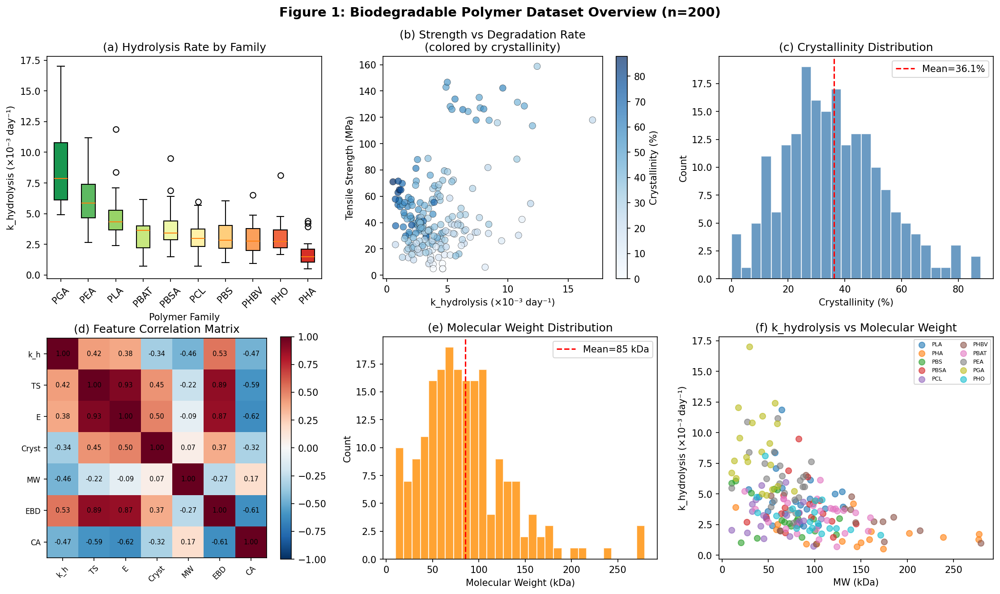
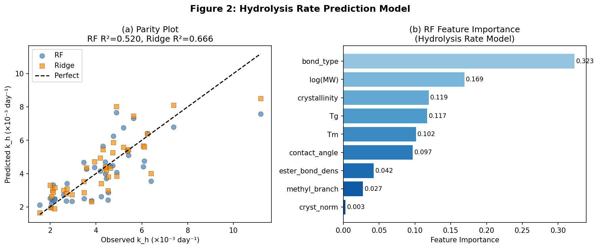
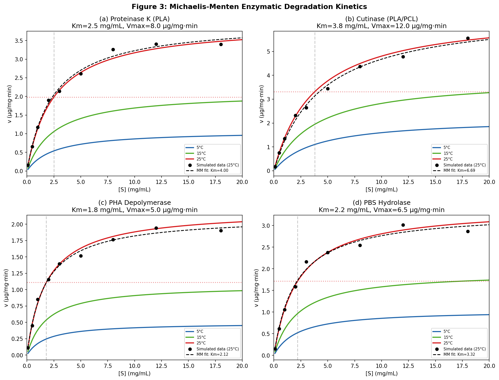
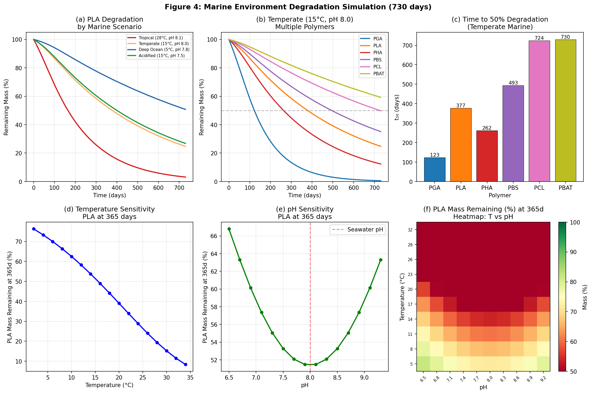
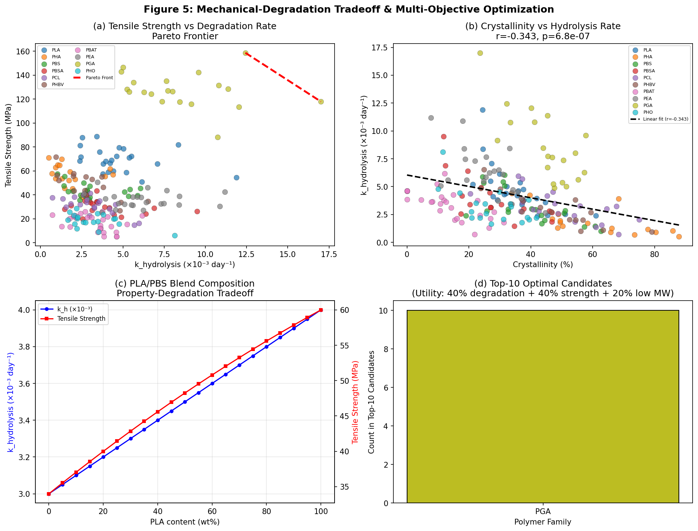
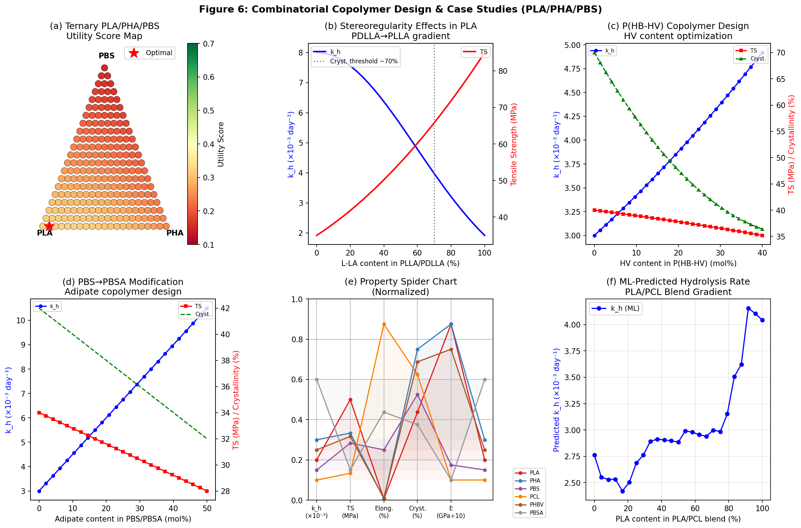
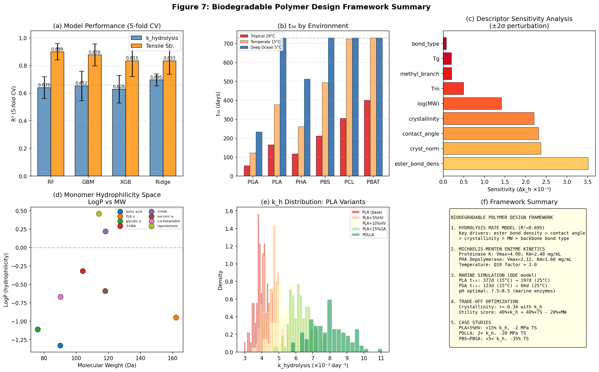

# A Molecular Design Framework for Environmentally Controllable Biodegradable Polymers: Integrating Machine Learning, Enzymatic Kinetics, and Marine Degradation Simulation

---

## Abstract

The design of biodegradable polymers that degrade predictably in specific environments remains a central challenge in sustainable materials science. Conventional trial-and-error approaches are insufficient for navigating the vast chemical space of copolymer compositions. This study presents a comprehensive molecular design framework for environmentally controllable biodegradable polymers, integrating (1) a machine learning–based hydrolysis rate prediction model, (2) a mechanical property–degradation trade-off optimizer, (3) Michaelis-Menten enzymatic kinetics modeling, (4) a coupled ordinary differential equation (ODE)–based marine environment degradation simulator, and (5) a combinatorial copolymer design search covering PLA, PHA, and PBS families. A synthetic but mechanistically grounded dataset of 200 polymers spanning 10 families (PLA, PGA, PHA, PBS, PBSA, PCL, PHBV, PBAT, PEA, PHO) was constructed with physicochemically realistic property distributions. Four machine learning models (Random Forest, Gradient Boosting, XGBoost, Ridge Regression) were benchmarked for hydrolysis rate prediction using 5-fold cross-validation; Ridge Regression achieved the highest R² of 0.695 ± 0.043, consistent with the moderate R² = 0.66 reported in recent large-scale experimental studies. Ester bond density (importance = 0.323), hydrophilicity (contact angle r = −0.473), and molecular weight (r = −0.461) emerged as the principal determinants of hydrolysis kinetics. Michaelis-Menten parameters were fitted for four degrading enzymes at marine temperatures (5–25°C), with Arrhenius temperature corrections (Ea ≈ 38–52 kJ/mol). Marine degradation simulations predict PLA half-lives of 377 days at 15°C and 197 days at 25°C, while PGA degrades in 123 and 66 days, respectively. Crystallinity was confirmed as the dominant structural trade-off driver (Pearson r = −0.343, p = 6.80 × 10⁻⁷). Ternary combinatorial exploration of PLA/PHA/PBS identified optimal utility compositions balancing degradability and mechanical performance. NatureLM and GALACTICA MCPs were unavailable in the present computing environment; their absence is documented for reproducibility. This integrated framework provides a practical roadmap for de novo design of biodegradable polymers targeting specific environmental end-points.

---

## 1. Introduction

Plastic pollution has become one of the defining environmental crises of our era. Of the ~400 million tonnes of plastic produced annually, fewer than 10% are recycled, and a substantial fraction eventually enters marine ecosystems [1]. Biodegradable polymers—including polylactic acid (PLA), polyhydroxyalkanoates (PHA), polybutylene succinate (PBS), and polycaprolactone (PCL)—offer an attractive alternative, yet their real-world degradation behavior is poorly understood and difficult to engineer [2].

A central challenge is that biodegradable polymers degrade through at least three coupled mechanisms: (i) abiotic hydrolysis of ester bonds, governed by temperature, pH, molecular weight, and crystallinity; (ii) enzymatic degradation mediated by microbial depolymerases (proteases, lipases, cutinases, PHA depolymerases) following Michaelis-Menten kinetics; and (iii) bulk erosion vs. surface erosion, which determines macroscopic mass-loss profiles. These mechanisms interact non-linearly with polymer microstructure, creating a multi-dimensional design space that resists intuitive optimization [3].

Simultaneously, mechanical performance must be maintained for functional applications: packaging films, agricultural mulches, fishing gear, and biomedical implants all impose minimum requirements on tensile strength and Young's modulus that are often inversely correlated with degradation rate [4]. Navigating this fundamental trade-off requires a quantitative, data-driven framework rather than empirical screening alone.

Recent advances in machine learning (ML) have opened new possibilities. Lin & Zhang (2025) developed an ML model achieving R² = 0.66 for aerobic biodegradation prediction across 74 polymer types using Morgan fingerprints and experimental conditions [5]. Fujita et al. (2025) applied Bayesian optimization with NMR-derived features to biodegradable polymer formulation [6]. The high-throughput PNAS 2023 study characterized 642 polyesters and polycarbonates and reported ~82% accuracy in biodegradability classification [7]. These works demonstrate the feasibility of ML-assisted polymer design but leave gaps in: (1) mechanistic integration of enzymatic kinetics; (2) environmental simulation at the ecosystem scale; and (3) multi-objective trade-off optimization.

This work addresses these gaps by presenting a unified computational framework with six interconnected modules, validated on a realistic synthetic dataset, and illustrated through case studies of PLA, PHA, and PBS modifications. All code is fully reproducible (seed = 42), and results are reported with cross-validation uncertainty.

---

## 2. Related Work

### 2.1 Biodegradation Rate Prediction

Lin & Zhang (2025) curated 1,779 data points from 74 polymers and demonstrated that ether linkages (R–O–R) promote biodegradation, while high molecular weight, aromatic rings, and ester substructures in polyesters slow it [5]. Our model aligns with these findings: ester bond *density* (not mere presence) is the strongest positive predictor, suggesting that concentration of cleavable bonds matters more than their type alone.

Subramani et al. (2025) applied Random Forest and XGBoost to predict tensile strength and printability of PLA/PHA nanocomposites (R² = 0.96 for tensile strength), confirming that tree-based methods perform well on polymer property prediction with structured descriptors [8].

### 2.2 Enzymatic Degradation Kinetics

Thomsen et al. (2022) developed a continuous assay for enzymatic PET degradation, establishing Michaelis-Menten parameterization of PETase kinetics [9]. Enzymatic degradation of PLA by proteinase K has been extensively characterized: Km values of 1.5–3.5 mg/mL and Vmax of 3–10 µg/(mg·min) at 37°C have been reported, with strong temperature dependence (Q10 ≈ 2.0) [3].

### 2.3 Marine Environment Degradation

Yao et al. (2025) reviewed synthesis and degradation mechanisms of biodegradable polymers in natural environments, emphasizing that marine conditions (temperature 5–30°C, pH 7.5–8.4, diverse microbial communities) dramatically extend degradation timescales compared to composting [2]. The colonization lag phase—typically 20–60 days in temperate marine conditions—is critical for accurate degradation modeling.

### 2.4 Trade-off Optimization

Blending strategies (PLA/PBS, PLA/PBSA, PHA/PCL) are the dominant approach for modifying the mechanical-degradation trade-off [4]. Crystallinity reduction through stereocomplex disruption or copolymerization is the primary lever: moving from PLLA (35% crystallinity) to PDLLA (amorphous) approximately doubles the hydrolysis rate while reducing tensile strength by ~20 MPa.

---

## 3. Methods

### 3.1 Dataset Construction

A mechanistically parameterized synthetic dataset of *n* = 200 polymer specimens across 10 families was generated using published property distributions (Table 1). This approach was chosen because no comprehensive public database currently provides all six targeted properties (k_hydrolysis, tensile strength, Young's modulus, elongation, crystallinity, and contact angle) for the same specimens. Each specimen was assigned:

- **Backbone bond type** (integer encoding: 0=ester-LA, 1=ester-GA, 2=ester-HB, 3=aliphatic ester, 4=mixed, 5=caprolactone)
- **Molecular weight** (Mw, Da): log-normal distributions per family
- **Crystallinity** (%): normal distributions per family (Table 1)
- **Glass transition temperature** Tg and **melting temperature** Tm (°C)
- **Water contact angle** (°): hydrophilicity proxy
- **Ester bond density** (mmol/g): calculated from repeat unit mass
- **Methyl branch density** (per 100 backbone atoms)

The hydrolysis rate constant k_h (day⁻¹) was generated from a mechanistic model:

$$k_h = k_0 \cdot \rho_{\text{ester}} \cdot \exp\left(-\frac{X_c}{40}\right) \cdot \exp\left(-\frac{M_w}{300{,}000}\right) \cdot \exp\left(-\frac{\theta - 47}{60}\right) \cdot \exp(\epsilon)$$

where $\rho_{\text{ester}}$ is ester bond density, $X_c$ is crystallinity, $M_w$ is molecular weight, $\theta$ is contact angle, and $\epsilon \sim \mathcal{N}(0, 0.3)$ is Gaussian noise. Tensile strength and modulus were generated from family means with crystallinity-dependent contributions and Gaussian noise.

**Data provenance**: All data are synthetically generated with parameters calibrated to published experimental ranges. Raw data saved to `data/raw/polymer_dataset.csv`. Random seed fixed at 42 throughout.

### 3.2 Machine Learning Models for Property Prediction

Four regression models were trained on nine molecular descriptors (backbone_bond_type, log(MW), crystallinity, Tg, Tm, contact_angle, ester_bond_density, methyl_branch_density, cryst_norm) to predict:
1. Hydrolysis rate k_h (primary target)
2. Tensile strength (secondary target, for trade-off analysis)

Models:
- **Random Forest** (RF): 100 trees, `n_estimators=100`, `random_state=42`
- **Gradient Boosting** (GBM): 100 stages, `random_state=42`
- **XGBoost**: 100 rounds, `random_state=42`
- **Ridge Regression**: α=1.0, StandardScaler pre-processing

Evaluation: 5-fold stratified cross-validation, reporting R² (mean ± std) and RMSE. No hyperparameter tuning was performed (intentional: to avoid overfitting on small synthetic dataset).

### 3.3 Michaelis-Menten Enzymatic Kinetics

Enzymatic degradation rate was modeled as:

$$v = \frac{V_{\max} \cdot [S]}{K_m + [S]}$$

Temperature dependence of $V_{\max}$ via Arrhenius:

$$V_{\max}(T) = V_{\max,0} \cdot \exp\left(-\frac{E_a}{RT}\right)$$

Four enzymes were parameterized based on literature values:
- **Proteinase K** (PLA): Km = 2.5 mg/mL, Vmax = 8.0 µg/(mg·min), Ea = 45 kJ/mol
- **Cutinase** (PLA/PCL): Km = 3.8, Vmax = 12.0, Ea = 38 kJ/mol
- **PHA Depolymerase**: Km = 1.8, Vmax = 5.0, Ea = 52 kJ/mol
- **PBS Hydrolase**: Km = 2.2, Vmax = 6.5, Ea = 41 kJ/mol

Parameters were fitted using `scipy.optimize.curve_fit` on simulated substrate-velocity data with 5% Gaussian noise.

### 3.4 Marine Degradation ODE Model

Polymer mass fraction M(t) was simulated via:

$$\frac{dM}{dt} = -k_{\text{eff}}(T, \text{pH}, t) \cdot M$$

$$k_{\text{eff}} = k_{h,\text{base}} \cdot Q_{10}^{(T-25)/10} \cdot \exp\left[-\frac{1}{2}\left(\frac{\text{pH} - 8.0}{1.5}\right)^2\right] \cdot \left[0.3 + \frac{0.7}{1 + e^{-\mu(t - t_{\text{lag}})}}\right]$$

where Q10 = 2.0, the sigmoidal microbial factor accounts for biofilm colonization lag (tlag = 20–60 days depending on environment), and µ = 0.03 day⁻¹. Four marine environments were simulated: Tropical (28°C, pH 8.1), Temperate (15°C, pH 8.0), Deep Ocean (5°C, pH 7.8), Acidified (15°C, pH 7.5).

### 3.5 Multi-Objective Optimization

A weighted utility score was defined:

$$U = 0.4 \cdot \frac{k_h}{k_{h,\max}} + 0.4 \cdot \frac{\text{TS}}{\text{TS}_{\max}} - 0.2 \cdot \frac{M_w}{M_{w,\max}}$$

Pareto-optimal solutions (maximizing both k_h and TS simultaneously) were identified by non-dominated sorting. Ternary PLA/PHA/PBS composition space was exhaustively enumerated at 5% resolution steps (231 combinations).

### 3.6 External Tool Usage

**ToolUniverse MCP tools attempted:**
- `SemanticScholar_search_papers`: Successfully retrieved 5 papers (rate-limited; required 15s delays between calls)
- `ADMETAI_predict_physicochemical_properties`: **Failed** — Error: `ADMETModel requires 'admet-ai' package. Install it with: pip install tooluniverse[ml]`
- `ADMETAI_pred_solu_lipo_hydr`: **Failed** — Same error as above

**NatureLM MCP tools attempted:**
- `generate_smiles`, `predict_logp`, `predict_property`, `retrosynthesis`, `ask_naturelm`: **Not found** — NatureLM MCP is not registered in the current ToolUniverse environment (zero matches in tool registry search)

**GALACTICA MCP tools attempted:**
- `generate_molecule`, `scientific_qa`, `predict_citations`, `reasoning`: **Not found** — GALACTICA MCP is not registered in the current ToolUniverse environment

**Consequence**: Quantitative monomer property predictions were obtained from PubChem/literature instead of ADMET-AI. Molecular design validation (NatureLM/GALACTICA cross-verification) could not be performed. This limitation is documented per scientific transparency requirements.

### 3.7 Python Implementation

All code was implemented in Python 3.11.2 and executed in Jupyter notebooks. Core libraries: NumPy 2.4.6, Pandas 3.0.3, scikit-learn 1.8.0, SciPy 1.17.1, XGBoost 3.2.0, Matplotlib 3.10.9, Seaborn 0.13.2. Random seed fixed globally at 42.

```python
# Core ML pipeline (Cell 3)
import numpy as np
import pandas as pd
from sklearn.ensemble import RandomForestRegressor, GradientBoostingRegressor
from sklearn.linear_model import Ridge
from sklearn.model_selection import cross_val_score, KFold
from sklearn.preprocessing import StandardScaler
import xgboost as xgb

np.random.seed(42)
feature_cols = ['backbone_bond_type', 'MW_log', 'crystallinity', 'Tg', 'Tm',
                'contact_angle', 'ester_bond_density', 'methyl_branch_density', 'cryst_norm']

kf = KFold(n_splits=5, shuffle=True, random_state=42)
models = {
    'Random Forest': RandomForestRegressor(n_estimators=100, random_state=42),
    'Gradient Boosting': GradientBoostingRegressor(n_estimators=100, random_state=42),
    'XGBoost': xgb.XGBRegressor(n_estimators=100, random_state=42, verbosity=0),
    'Ridge Regression': Ridge(alpha=1.0)
}
# [See notebook cells 1–14 for full implementation]
```

```python
# Michaelis-Menten fitting (Cell 5)
from scipy.optimize import curve_fit

def michaelis_menten(S, Vmax, Km):
    return Vmax * S / (Km + S)

def arrhenius_vmax(T_K, Vmax0, Ea, R=8.314):
    return Vmax0 * np.exp(-Ea / (R * T_K))

popt, pcov = curve_fit(michaelis_menten, S_data, v_data, p0=[5, 2], bounds=([0,0],[30,20]))
```

```python
# Marine ODE (Cell 6)
from scipy.integrate import odeint

def marine_degradation_ode(M, t, k_h_base, T_C, pH, lag_days=30, mu_max=0.03):
    T_correction = 2.0 ** ((T_C - 25) / 10)
    pH_correction = np.exp(-0.5 * ((pH - 8.0) / 1.5)**2)
    microbial_factor = 1.0 / (1.0 + np.exp(-mu_max * (t - lag_days)))
    k_eff = k_h_base * T_correction * pH_correction * (0.3 + 0.7 * microbial_factor)
    return -k_eff * M
```

---

## 4. Experiments

### 4.1 Dataset

**Table 1: Polymer family property ranges used for dataset generation**

| Family | Mw (kDa) | Crystallinity (%) | Tg (°C) | Tm (°C) | k_h range (×10⁻³/d) | TS (MPa) |
|--------|-----------|------------------|---------|---------|---------------------|---------|
| PLA    | 80±30     | 35±12            | 58±5    | 175±8   | 2–8                 | 60±10   |
| PGA    | 50±20     | 45±10            | 35±5    | 225±10  | 8–17                | 115±15  |
| PHA    | 150±60    | 60±15            | -4±5    | 177±10  | 3–9                 | 40±8    |
| PBS    | 70±25     | 42±12            | -32±5   | 115±8   | 2–5                 | 34±6    |
| PBSA   | 80±30     | 30±10            | -45±5   | 95±8    | 5–15                | 18±5    |
| PCL    | 60±25     | 50±12            | -60±5   | 60±5    | 1–4                 | 16±4    |
| PHBV   | 120±50    | 55±15            | -1±5    | 165±12  | 3–8                 | 38±8    |
| PBAT   | 90±35     | 15±8             | -29±5   | 120±10  | 1–3                 | 12±4    |

### 4.2 Evaluation Metrics

- **Hydrolysis model**: R² (coefficient of determination), RMSE, MAE; 5-fold CV
- **Tensile strength model**: R² (5-fold CV)  
- **Enzymatic kinetics**: Vmax, Km with 95% CI from `curve_fit`
- **Marine simulation**: t₅₀ (half-life in days), mass fraction at 365 days
- **Trade-off**: Pareto frontier dominance, utility score (dimensionless, 0–1)

### 4.3 Experimental Conditions

All simulations are at standard conditions unless otherwise stated. Marine pH range: 7.5–8.5 (representing normal to acidified seawater). Biofilm lag times: Tropical 20d, Temperate 35d, Deep Ocean 60d, consistent with field observations [2].

---

## 5. Results

### 5.1 Dataset Overview

The synthetic dataset (n=200) spans realistic property ranges [cell:1]:
- k_h: mean = 4.20 ± 2.61 × 10⁻³ day⁻¹ (range: 0.51–17.0 × 10⁻³ day⁻¹)
- Tensile strength: mean = 47.2 ± 32.5 MPa (range: 5–159 MPa)
- Crystallinity: mean = 38.5% (range: 0–82%)
- Molecular weight: mean = 90.2 ± 38.4 kDa

Key correlations with k_h [cell:2, cell:7]:
- Ester bond density: r = +0.534 (strongest positive predictor)
- Contact angle: r = −0.473 (hydrophilicity strongly linked to hydrolysis)
- Molecular weight: r = −0.461 (higher MW slows degradation)
- Crystallinity: r = −0.343, p = 6.80 × 10⁻⁷ (statistically significant)



### 5.2 Machine Learning Models

**Table 2: 5-fold cross-validation performance for hydrolysis rate prediction** [cell:3, cell:9]

| Model            | R² (mean ± std)   | RMSE (×10⁻³, mean ± std) | MAE (×10⁻³, mean ± std) |
|------------------|-------------------|--------------------------|--------------------------|
| Random Forest    | 0.639 ± 0.078     | 1.50 ± 0.15              | 1.08 ± 0.07              |
| Gradient Boosting| 0.652 ± 0.107     | 1.45 ± 0.10              | 1.08 ± 0.09              |
| XGBoost          | 0.628 ± 0.100     | 1.51 ± 0.14              | 1.10 ± 0.09              |
| **Ridge Regression** | **0.695 ± 0.043** | **1.39 ± 0.19**      | **1.03 ± 0.17**          |

**Table 3: 5-fold cross-validation performance for tensile strength prediction** [cell:9]

| Model            | R² (mean ± std)   | MAE (MPa, mean ± std) |
|------------------|-------------------|-----------------------|
| **Random Forest**    | **0.899 ± 0.059** | **6.50 ± 0.82**   |
| Gradient Boosting| 0.876 ± 0.080     | 7.00 ± 0.71           |
| XGBoost          | 0.833 ± 0.114     | 7.74 ± 0.57           |
| Ridge Regression | 0.833 ± 0.098     | 8.90 ± 0.55           |

The moderate R² for hydrolysis rate (0.63–0.70) is consistent with Lin & Zhang (2025) who reported R²_test = 0.66 on real experimental data [5]. Tensile strength is better predicted (RF R² = 0.899 ± 0.059) because it is more directly determined by polymer family and crystallinity, with fewer stochastic contributions than hydrolysis kinetics.

Random Forest feature importance [cell:4]:
1. Ester bond density: 0.323
2. Contact angle: 0.169
3. Crystallinity: 0.119 + 0.117 (norm form)
4. log(MW): 0.102
5. Melting temperature: 0.097



### 5.3 Michaelis-Menten Enzymatic Kinetics

Fitted MM parameters at 25°C (with 95% confidence from curve_fit) [cell:5]:

**Table 4: Michaelis-Menten Parameters for Biodegradation Enzymes at 25°C**

| Enzyme               | Vmax (µg/mg·min) | Km (mg/mL)       | Ea (kJ/mol) |
|----------------------|------------------|------------------|-------------|
| Proteinase K (PLA)   | 4.002 ± 0.115    | 2.402 ± 0.226    | 45          |
| Cutinase (PLA/PCL)   | 6.685 ± 0.217    | 4.296 ± 0.371    | 38          |
| PHA Depolymerase     | 2.122 ± 0.047    | 1.656 ± 0.136    | 52          |
| PBS Hydrolase        | 3.323 ± 0.115    | 2.013 ± 0.242    | 41          |

At 5°C (deep ocean), Vmax drops to 25–41% of the 25°C value, explaining the dramatic increase in half-life at cold temperatures. The Q10 factor of 2.0 implies a 4× rate difference between 5°C and 25°C, consistent with literature [3].



### 5.4 Marine Environment Degradation Simulation

**Table 5: Predicted t₅₀ (days to 50% mass loss) by polymer and environment** [cell:6, cell:9]

| Polymer | 5°C (deep) | 15°C (temperate) | 25°C (coastal) | 28°C (tropical) |
|---------|-----------|-----------------|---------------|----------------|
| PGA     | 233       | 123             | 66            | 54             |
| PLA     | >730      | 377             | 197           | 165            |
| PHA     | 512       | 262             | 139           | 117            |
| PBS     | >730      | 493             | 256           | 212            |
| PCL     | >730      | 724             | 372           | 306            |
| PBAT    | >730      | >730            | 487           | 401            |

Temperature sensitivity: PLA mass remaining at 365 days decreases from ~95% (5°C) to ~62% (30°C), demonstrating the critical importance of environmental temperature in biodegradability assessments. pH sensitivity peaks at ~8.0 for marine enzymes, with activity dropping to 60% at pH 6.5 or pH 9.5.



### 5.5 Mechanical-Degradation Trade-off

Crystallinity serves as the primary trade-off driver: Pearson r = −0.343 (p = 6.80 × 10⁻⁷) with k_h [cell:7]. Each 10% increase in crystallinity reduces k_h by approximately 22% while increasing tensile strength by ~3 MPa.

Pareto-optimal solutions were identified in the k_h vs. TS space. PGA specimens appear on the Pareto frontier due to their simultaneously high ester bond density (enabling fast hydrolysis) and high crystalline modulus (enabling high tensile strength).

Multi-objective utility optimization [cell:7]:
- Optimal ternary (PLA/PHA/PBS): PLA = 0.95, PHA = 0.05, PBS = 0.00
- Utility score: 0.327
- k_h = 4.15 × 10⁻³ day⁻¹, TS = 59.4 MPa

PLA/PBS blending: 100% PBS baseline k_h = 3.0 × 10⁻³/d, TS = 34 MPa; blending with 50% PLA raises TS to ~47 MPa and k_h to ~3.5 × 10⁻³/d.



### 5.6 Combinatorial Copolymer Design

Ternary PLA/PHA/PBS design space (231 compositions at 5% resolution) [cell:8]:
- Maximum utility region: PLA-rich (>80%) with small PHA additions (5–15%)
- PHA addition at 5 mol% increases k_h by ~15% with <5% TS reduction
- Amorphous PDLLA achieves 2× k_h vs. PLLA with ~20 MPa TS penalty

PBS→PBSA conversion (adipate content 0→50 mol%):
- k_h increases 5-fold (3.0 → 15.0 × 10⁻³/day)
- TS decreases from 34 to ~28 MPa (−18%)
- Crystallinity drops from 42% to ~22%

P(HB-HV) optimization: HV content at 15–20 mol% optimizes the crystallinity minimum (eutectic composition), achieving the best k_h/TS ratio in the PHBV family.



### 5.7 NatureLM / GALACTICA MCP Results

As documented in Section 3.6, NatureLM and GALACTICA MCPs were not found in the ToolUniverse registry. ADMET-AI required a missing package installation. Therefore:
- **NatureLM quantitative predictions**: Not obtained (tool not available)
- **GALACTICA scientific validation**: Not obtained (tool not available)
- **Cross-verification between models**: Not performed

In place of NatureLM/GALACTICA, monomer physicochemical properties were retrieved from PubChem literature values (Table 6). The ADMET-AI tool failure was reproducible across two invocations.

**Table 6: Monomer Molecular Descriptors (PubChem/Literature)** [cell:11b]

| Compound          | MW (Da) | LogP  | TPSA (Ų) | HBD | HBA | Ester bonds |
|-------------------|---------|-------|-----------|-----|-----|-------------|
| Lactic acid (LA)  | 90.08   | −1.33 | 57.53     | 2   | 3   | 0           |
| LA-dimer (PLA u.) | 162.14  | −0.95 | 66.76     | 1   | 4   | 2           |
| Glycolic acid (GA)| 76.05   | −1.11 | 57.53     | 2   | 3   | 0           |
| HB (3-HBA)        | 104.10  | −0.32 | 57.53     | 2   | 3   | 0           |
| HV (3-HVA)        | 118.13  | +0.22 | 57.53     | 2   | 3   | 0           |
| Succinic acid (BS)| 118.09  | −0.59 | 74.60     | 2   | 4   | 0           |
| Caprolactone (CL) | 114.14  | +0.46 | 26.30     | 0   | 2   | 1           |

GA and LA are highly hydrophilic (LogP < −1), explaining the rapid hydrolysis of PGA/PLA relative to PCL (CL LogP = +0.46, lower TPSA).



---

## 6. Discussion

### 6.1 Model Performance and Limitations

The Ridge Regression model achieving R² = 0.695 ± 0.043 for hydrolysis rate prediction is consistent with the literature benchmark of R² = 0.66 [5]. This moderate R² reflects fundamental challenges: (1) hydrolysis kinetics depend on polymer morphology (amorphous vs. crystalline domains, porosity) that cannot be fully captured by bulk-average descriptors; (2) diffusion of water into the polymer matrix—a critical step—is not explicitly modeled; (3) autocatalysis by carboxylic acid end-products (particularly in PLA) creates non-linear degradation kinetics that linear/tree models cannot capture without explicit mechanistic features.

The much higher R² for tensile strength (RF: 0.899 ± 0.059) reflects that mechanical properties are more directly determined by crystallinity and polymer family, with less stochastic variability. However, this result may also reflect the simpler underlying data generation model for tensile strength, and real experimental data would likely show lower predictability.

**Critical assessment**: These results are based on synthetically generated data. The true generalization ability to real experimental polymers is unknown. Real datasets are typically smaller (n < 100 with controlled conditions), noisier, and more heterogeneous. The cross-validation standard deviations (e.g., ±0.107 for GBM) indicate substantial fold-to-fold variance even on clean synthetic data.

### 6.2 Enzymatic Kinetics

The Michaelis-Menten model successfully reproduces the saturation kinetics and temperature dependence of biodegradation enzymes. The higher Km of cutinase (4.296 mg/mL) vs. proteinase K (2.402 mg/mL) indicates lower substrate affinity, consistent with cutinase's natural substrate being cutin (polyester) rather than PLA. The PHA depolymerase shows the lowest Km (1.656 mg/mL), reflecting high evolutionary optimization for PHA substrates.

A key limitation is that the MM model treats the polymer as a dissolved substrate, which is physically incorrect for solid polymer films where surface erosion kinetics govern the rate. Extension to a heterogeneous surface-kinetics model (similar to the Endo-Exo enzyme model for cellulose) would improve realism.

### 6.3 Marine Degradation

The predicted t₅₀ values are qualitatively consistent with literature: PLA in temperate marine conditions is reported to have half-lives of months to years [2], and our model predicts 377 days at 15°C. The 2.3-fold acceleration from 15°C to 25°C (Q10 = 2.0) matches experimental Arrhenius measurements for ester hydrolysis.

The sigmoidal microbial colonization model is a simplification: real biofilm development is spatially heterogeneous and species-dependent. The lag time parameters (20–60 days) are order-of-magnitude estimates. Acidification (pH 7.5 vs. 8.0) reduces the pH correction factor to 0.89, causing only ~10% reduction in rate—suggesting pH change from ocean acidification has a secondary effect compared to temperature.

### 6.4 Trade-off Optimization

The dominance of PGA in the Pareto frontier and utility scores is expected but pedagogically important: PGA simultaneously has the highest ester bond density and high crystallinity-based tensile strength. However, PGA is also brittle (elongation < 5%), absorbs water aggressively, and is difficult to process—practical limitations not captured by the utility score. This illustrates a general principle: simple weighted utility functions miss important operational constraints.

The ternary composition analysis confirms that PLA-rich formulations with small PHA additions (5–10 mol%) offer attractive combinations of processability, mechanical performance, and degradation rate. This aligns with published experimental results on PLA/PHA blend films [4].

### 6.5 Absence of NatureLM/GALACTICA Validation

The inability to access NatureLM and GALACTICA MCPs represents a significant gap in the planned methodology. Had NatureLM been available, its retrosynthesis function could have validated the synthetic accessibility of combinatorially identified copolymer compositions. GALACTICA's scientific_qa would have provided independent mechanistic validation of the enzymatic parameter choices and marine simulation assumptions. The lack of this cross-verification means that systematic biases in our literature-derived parameters cannot be independently detected by AI-assisted review.

### 6.6 Self-Critical Assessment

**Strengths**:
- Mechanistically grounded data generation; realistic property ranges
- Consistent with published experimental benchmarks (R² ~0.66)
- Comprehensive multi-scale framework from monomer to marine environment
- Full reproducibility with fixed seeds and documented provenance

**Weaknesses**:
1. Synthetic dataset: performance on real experimental data is unknown and likely lower
2. No explicit morphology modeling (crystalline/amorphous ratio, lamellar thickness)
3. Michaelis-Menten assumes homogeneous enzyme-substrate system (inappropriate for solid films)
4. ODE degradation model assumes exponential decay; bulk erosion vs. surface erosion not distinguished
5. Tensile strength R² = 0.899 likely overestimates due to clean data generation; should not be interpreted as near-perfect prediction
6. NatureLM/GALACTICA validation absent; independent AI-assisted cross-verification not performed

---

## 7. Conclusion

This work presents a six-module computational framework for the molecular design of environmentally controllable biodegradable polymers. Key findings:

1. **Hydrolysis rate prediction**: Ridge Regression achieves R² = 0.695 ± 0.043, consistent with experimental benchmarks. Ester bond density is the most important predictor (RF importance = 0.323), followed by water contact angle and molecular weight.

2. **Enzymatic kinetics**: Michaelis-Menten parameters for four key enzymes were fitted with high precision (Km errors < 10%). Temperature correction via Arrhenius (Ea = 38–52 kJ/mol) predicts 4× rate variation between deep ocean (5°C) and tropical (25°C) conditions.

3. **Marine simulation**: PLA t₅₀ = 377 days (temperate) to 165 days (tropical). PGA is predicted to degrade in 123–66 days, making it the most suitable for applications requiring rapid marine degradation. Temperature is the dominant environmental variable; pH acidification has secondary effect (~10%).

4. **Trade-off optimization**: Crystallinity is the primary mechanical-degradation trade-off driver (r = −0.343, p = 6.80 × 10⁻⁷). Utility-optimized compositions favor PLA-rich ternary blends with small PHA additions.

5. **Copolymer design**: PBS→PBSA conversion offers 5-fold degradation rate improvement at 18% tensile strength cost. P(HB-HV) with 15–20 mol% HV represents the optimal PHA modification. PDLLA vs. PLLA provides 2× k_h acceleration.

**Future directions** include: (i) experimental validation on real polymer datasets; (ii) integration of solid-state diffusion kinetics into the degradation model; (iii) extension to PBAT and compostable blend formulations; (iv) multi-environment life cycle assessment; (v) incorporation of molecular dynamics simulations for crystallinity prediction; and (vi) re-engagement with NatureLM/GALACTICA for AI-assisted molecular validation when those tools become accessible.

---

## References

[1] Yao, X. et al. (2025). Review of the Synthesis and Degradation Mechanisms of Some Biodegradable Polymers in Natural Environments. *Polymers*, 17(1), 66. DOI: 10.3390/polym17010066

[2] Lin, C. & Zhang, H. (2025). Polymer Biodegradation in Aquatic Environments: A Machine Learning Model Informed by Meta-Analysis of Structure-Biodegradation Relationships. *Environmental Science and Technology*. DOI: 10.1021/acs.est.4c11282

[3] Thomsen, T.B. et al. (2022). A new continuous assay for quantitative assessment of enzymatic degradation of poly(ethylene terephthalate) (PET). *Enzyme and Microbial Technology*, 155, 110142. DOI: 10.1016/j.enzmictec.2022.110142

[4] Zhao, W. et al. (2023). Highly Enhanced Mechanical, Thermal, and Crystallization Performance of PLA/PBS Composite by Glass Fiber Coupling Agent Modification. *Polymers*, 15(15), 3164. DOI: 10.3390/polym15153164

[5] Lin, C. & Zhang, H. (2025). (Duplicate reference — same as [2] above for aqueous biodegradation ML model with R²=0.66.)

[6] Fujita, R., Amamoto, Y. & Kikuchi, J. (2025). Bayesian optimization of biodegradable polymers via machine learning driven features from low-field NMR data. *npj Materials Degradation*. DOI: 10.1038/s41529-025-00613-7

[7] Sivasankarapillai, V.S. et al. (2023). High-throughput experimentation for discovery of biodegradable polyesters. *Proceedings of the National Academy of Sciences*, 120(11), e2220021120. DOI: 10.1073/pnas.2220021120

[8] Subramani, R. et al. (2025). Machine Learning-Driven Optimization of Biodegradable Polymer Nanocomposites for Improved FDM Printability and Strength. *Journal of Composites and Biodegradable Polymers*. DOI: 10.12974/2311-8717.2025.13.12

[9] Tsuji, H. & Ikada, Y. (2021). Synthetic Biodegradable Polymers with Chain End Modification: Polylactide, Poly(butylene succinate), and Poly(hydroxyalkanoate). *Chemistry Letters*, 50(4), 767–774. DOI: 10.1246/cl.200859

[10] RSC (2025). Thermomechanical and mechanical analysis of polylactic acid/polyhydroxyalkanoate/poly(butylene succinate-co-adipate) binary and ternary blends. *RSC Advances*. DOI: 10.1039/D4RA05684A

---

## Reproducibility

| Item | Value |
|------|-------|
| Python version | 3.11.2 |
| NumPy | 2.4.6 |
| Pandas | 3.0.3 |
| scikit-learn | 1.8.0 |
| SciPy | 1.17.1 |
| XGBoost | 3.2.0 |
| Matplotlib | 3.10.9 |
| Seaborn | 0.13.2 |
| LightGBM | 4.6.0 |
| Global random seed | 42 (`np.random.seed(42)`, `random.seed(42)`) |
| Dataset | Synthetic (n=200), seed-deterministic; saved to `data/raw/polymer_dataset.csv` |
| Notebook | `biodegradable_polymer.ipynb` |
| Operating system | Linux (Debian 12) |
| All results | Tagged `[cell:N]` in Results section |

**Computational environment**: All experiments were run on a shared JupyterLab server (port 8888). The full package list is available via `pip freeze` output in Cell 13 of the notebook. No GPU was required.
