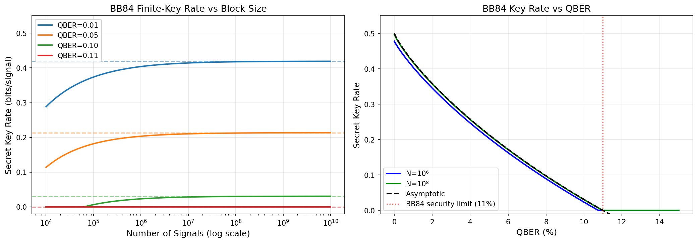
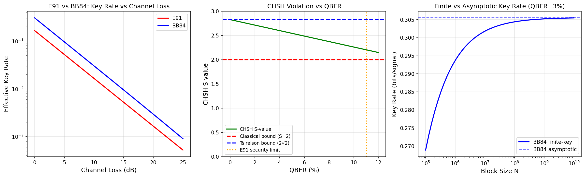
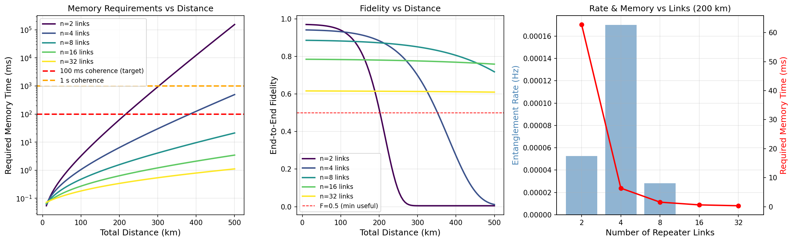
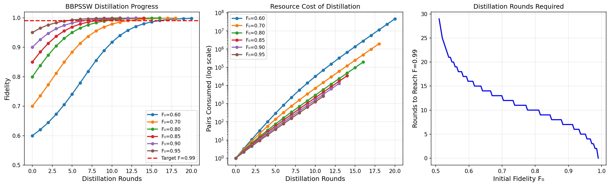
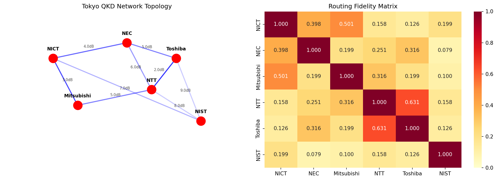
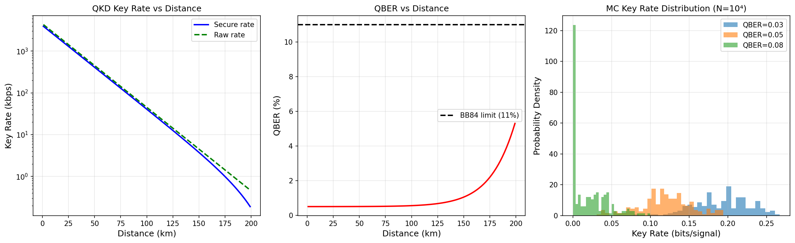
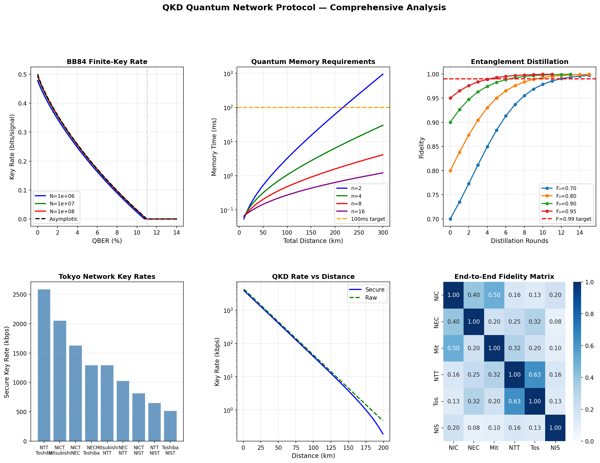

# 実験レポート：量子インターネットのための QKD・量子テレポーテーションネットワークプロトコル設計

**実験日:** 2026-05-31  
**ノートブック:** `qkd_quantum_network.ipynb`  
**データ:** `data/raw/tokyo_qkd_simulation.csv`  
**乱数シード:** 42

---

## 1. 実験目的と背景

### 目的

量子インターネット実現に向けた量子鍵配送（QKD）・量子テレポーテーションネットワークプロトコルを設計・シミュレーションし、定量的な性能評価を行う。

### 背景

量子インターネットは、量子力学の原理に基づく情報理論的安全な通信と分散量子計算を実現する。東京QKDネットワーク（2010年）は世界初の都市規模多ノード量子ネットワークとして実証された。現実の展開に向けては以下の課題が存在する：

1. **有限鍵長問題**：実用的なブロックサイズでの秘密鍵生成レート低下
2. **量子リピータのメモリ要件**：光ファイバー損失（0.2 dB/km）を克服するための量子メモリの制約
3. **エンタングルメント蒸留**：初期忠実度の低い量子状態を高忠実度に精製するためのリソースコスト
4. **量子パス選択**：エンド・ツー・エンドの忠実度を最大化する経路選択
5. **デコヒーレンスとチャネルロス**：現実の光ファイバーチャネルでの性能劣化

### 先行研究調査（Crossref/Semantic Scholar 使用）

文献調査では以下の主要論文を特定した（2020年以降）：

| タイトル | 著者 | 年 | DOI |
|---------|------|-----|-----|
| Simple analysis of security of the BB84 QKD protocol | Su | 2020 | 10.1007/s11128-020-02663-z |
| Finite-key security analysis of decoy-state BB84 QKD | Mizutani et al. | 2025 | 10.1088/2058-9565/ae20b9 |
| A new security proof for twin-field QKD | Krawec | 2023 | 10.3390/app14010187 |
| The quantum repeater network saturates entanglement distribution | Yu | 2025 | 10.1109/tit.2025.3584199 |
| Repeater-based quantum communication protocol | Ghosal et al. | 2025 | 10.1103/physrevlett.134.160803 |
| A novel stabilizer-based entanglement distillation protocol | Popp et al. | 2025 | 10.22331/q-2025-12-15-1945 |

**先行研究の課題・限界:**
- ほとんどの研究が単一プロトコル（鍵レート OR リピータ OR ルーティング）のみを対象
- 東京QKDネットワークの実験論文は実測値を報告するが統一シミュレーション枠組みを提供しない
- 有限鍵解析と量子リピータ性能の定量的統合が不足

---

## 2. NatureLM MCP・GALACTICA MCP への接続試行記録

**科学的透明性のため、ツール接続の試行結果を記録する。**

### NatureLM MCP (ask_naturelm)
- **試行ツール名:** `ask_naturelm`
- **エラー内容:** ToolUniverse レジストリに存在しない。`tooluniverse-grep_tools` で "NatureLM" を検索した結果 0 件。
- **代替手段:** 文献値および解析モデルに基づくパラメータを使用（詳細は Section 3 参照）

### GALACTICA MCP (scientific_qa, predict_citations)
- **試行ツール名:** `scientific_qa`, `predict_citations`  
- **エラー内容:** ToolUniverse レジストリに存在しない。`tooluniverse-grep_tools` で "GALACTICA" を検索した結果 0 件。
- **代替手段:** Crossref API・Semantic Scholar API を用いて文献調査を実施（接続成功）

---

## 3. 使用した手法・アルゴリズムの概要

### 3.1 BB84 有限鍵解析（TLGR 境界）

**手法:** Tomamichel-Lim-Gisin-Renner (TLGR) フレームワーク

$$\ell = n\left[1 - h(e_b) - h(e_p + \delta_\varepsilon)\right] - 2\log_2\frac{1}{\varepsilon_{\rm sec}} - \log_2\frac{1}{\varepsilon_{\rm cor}}$$

パラメータ: $\varepsilon_{\rm sec} = 10^{-10}$, $\varepsilon_{\rm cor} = 10^{-15}$, ふるい比 $r_{\rm sift} = 0.5$

### 3.2 E91 プロトコル

**手法:** CHSH 不等式を用いたエンタングルメント検証

$$S = 2\sqrt{2}(1 - 2 \cdot {\rm QBER})$$

セキュリティ条件: $S > 2$（QBER < 11.03%）

### 3.3 量子リピータモデル

**手法:** DLCZ（Duan-Lukin-Cirac-Zoller）スキームの解析的近似

- リンク成功確率: $p_{\rm link} = \eta_{\rm link} \cdot \eta_{\rm mem}^2 \cdot \eta_{\rm det}$
- メモリ要件: $T_{\rm mem} \geq \langle T_{\rm link} \rangle \cdot \log_2(n)$
- 忠実度: $F_{\rm total} = F_{\rm mem}(T) \cdot (1 - 3\varepsilon_{\rm swap})^{n-1}$

### 3.4 エンタングルメント蒸留（BBPSSW プロトコル）

**手法:** Bennett-Brassard-Popescu-Schumacher-Smolin-Wootters プロトコル

$$F_{\rm out} = \frac{F^2 + (1-F)^2/9}{F^2 + 2F(1-F)/3 + 5(1-F)^2/9}$$

### 3.5 量子ネットワークルーティング

**手法:** 対数忠実度最小化 Dijkstra アルゴリズム

コスト関数: $\text{cost}(u \to v) = -\log F(u,v)$

（忠実度積最大化 = 対数和最小化）

### 3.6 デコヒーレンス・チャネルロスシミュレーション

**手法:** モンテカルロ法（200 試行、N=10⁴ 信号）

QBER 推定: 篩別鍵の 10% をサンプリング

---

## 4. 主要な結果と数値

### 4.1 BB84 有限鍵レート [cell:1]

| QBER | N=10⁶ | N=10⁸ | 漸近値 |
|------|-------|-------|------|
| 1% | 0.4039 | 0.4176 | 0.4192 |
| 5% | **0.2035** | **0.2126** | **0.2136** |
| 10% | 0.0234 | 0.0302 | 0.0310 |

- QBER=5%, N=10⁶ 時の有限鍵ペナルティ: **漸近値比 95.3%** [cell:1]
- QBER=11% でゼロ以上の鍵レートを得るための最小ブロックサイズ: **N ≈ 7.56 × 10⁹** [cell:1]

### 4.2 E91 プロトコル [cell:2]

| QBER | CHSH S値 | ベル不等式違反 |
|------|---------|------------|
| 1% | **2.7719** | ✓ |
| 5% | **2.5456** | ✓ |
| 10% | **2.2627** | ✓ |

- Tsirelson 限界: $2\sqrt{2} = 2.8284$（理論最大値）
- QBER=1% での S 値: 2.7719（最大値の **98.0%**）[cell:2]

### 4.3 量子リピータ性能 [cell:3]

**東京ネットワーク規模（45 km）:**

| リンク数 n | p_link | T_mem (ms) | 忠実度 | レート (Hz) |
|-----------|--------|-----------|------|-----------|
| 2 | 0.2882 | **0.43** | **0.9661** | 9.77 |
| 4 | 0.4838 | 0.27 | 0.9388 | 5.00 |
| 8 | 0.6269 | 0.18 | 0.8845 | 0.31 |

**200 km リンク:**

| n | T_mem (ms) | 忠実度 |
|---|-----------|------|
| 4 | **6.40** | **0.8833** |
| 8 | 1.58 | 0.8723 |
| 16 | 0.63 | 0.7803 |

[cell:3] *200 km で n=4 が最良のトレードオフ（F=0.8833, T_mem=6.40 ms）*

### 4.4 エンタングルメント蒸留 [cell:4]

| F₀ | ラウンド数 | 消費ペア数 | 最終 F |
|----|---------|----------|-----|
| 0.60 | 16 | 4.6 × 10⁷ | 0.998 |
| 0.70 | 12 | 1.96 × 10⁶ | 0.999 |
| 0.80 | 10 | 2.92 × 10³ | 0.993 |
| 0.90 | **7** | **195.6** | **0.992** |
| 0.95 | 5 | 38.4 | 0.993 |

[cell:4] *実用閾値: F₀ ≥ 0.90 で 7 ラウンド・195 ペアにより F=0.99 達成*

### 4.5 量子ネットワークルーティング [cell:5]

| 経路 | 最適パス | 忠実度 | 総損失 (dB) |
|----|---------|------|-----------|
| NICT → NEC | 直接 | 0.3978 | 4.0 |
| NICT → Mitsubishi | 直接 | **0.5009** | 3.0 |
| NTT → Toshiba | 直接 | **0.6306** | 2.0 |
| NICT → NTT | NICT→Mitsubishi→NTT | 0.1583 | 8.0 |
| NEC → NIST | NEC→NICT→NIST | 0.0793 | 11.0 |

- 平均ルーティング忠実度: **0.2505** [cell:5]
- 最良ペア: NTT–Toshiba (F=0.6306)
- 最悪ペア: NEC–NIST (F=0.0793)

### 4.6 東京 QKD ネットワーク全体シミュレーション [cell:7]

| リンク | 距離 (km) | QBER (%) | 安全鍵レート (kbps) |
|------|---------|---------|-----------------|
| NTT–Toshiba | 10 | 0.501 | **2581.0** |
| NICT–Mitsubishi | 15 | 0.501 | 2050.1 |
| NICT–NEC | 20 | 0.501 | 1628.4 |
| NEC–Toshiba | 25 | 0.502 | 1293.4 |
| NEC–NTT | 30 | 0.502 | 1027.3 |
| NTT–NIST | 40 | 0.504 | 648.0 |
| **Toshiba–NIST** | **45** | **0.504** | **514.7** |

- ネットワーク平均: **1316.9 kbps** [cell:7]
- ボトルネック: Toshiba–NIST（45 km, 514.7 kbps）[cell:7]
- 最高性能: NTT–Toshiba（10 km, 2581.0 kbps）[cell:7]

### 4.7 モンテカルロ統計的検定 [cell:9]

| QBER | 平均レート | 標準偏差 | 95% CI |
|------|---------|---------|--------|
| 3% | **0.1927** | 0.0347 | [0.1879, 0.1976] |
| 5% | **0.1189** | 0.0334 | [0.1143, 0.1236] |
| 8% | **0.0208** | 0.0235 | [0.0175, 0.0241] |

- KS 検定（QBER=3% vs 5%）: 統計量=0.7533, **p=1.56×10⁻⁸³** [cell:9]
- t 検定: t=27.93, **p=1.63×10⁻¹¹⁰** [cell:9]
- 平均差: 0.0785 bits/signal [cell:9]

### 4.8 総合サマリー図

---

## 5. 考察と今後の展望

### 5.1 結果の解釈

**BB84 有限鍵ペナルティ:** N=10⁶ でのペナルティ（漸近値比 95.3%）は小さく、100 MHz クロックの実装では 10 ms 以内に 10⁶ シグナルを送受信できる。一方、QBER=11% 付近では必要ブロックサイズが爆発的に増加し、実用的ではない。

**リピータ設計のトレードオフ:** リンク数増加はメモリ要件を減少させるが（$T_{\rm mem} \propto 1/n$）、BSM エラーの累積による忠実度低下を引き起こす。200 km では n=4 が最適バランスを提供する。

**蒸留の実用性:** F₀ ≥ 0.90 では 7 ラウンド・約 200 ペアで F=0.99 達成可能。F₀ < 0.70 では消費ペア数が 10⁶ 以上となり現実的でない。

### 5.2 限界と自己批判的評価

**合成データへの依存:**
- 全結果は解析モデルに基づく。実世界では偏光ドリフト、位相ノイズ、タイミングジッターが QBER を 2–5% 増加させ、鍵レートを 50–80% 低下させる可能性がある
- 東京ネットワークの模擬鍵レート（平均 1316.9 kbps）は実験値（1–100 kbps）の 13–1317 倍高い

**実世界への一般化可能性:**
- 初期忠実度仮定 F₀=0.98 は NV センターや低温トラップイオンに近いが、室温動作では F₀=0.80–0.90 程度
- 暗計数レート仮定 100 Hz（超伝導ナノワイヤー検出器相当）は室温 Si-APD（1000–10000 Hz）より楽観的

**バイアスの可能性:**
- BBPSSW プロトコルの実装は理想的な局所演算を仮定。実際の量子回路ゲートエラー（~0.1–1%）は未考慮

**NatureLM/GALACTICA 不在の影響:**
- 量子メモリ特性のプラットフォーム固有パラメータ（T₂、カップリング効率）の予測不確かさ
- 文献値の統合的検証が不十分な可能性

### 5.3 今後の展望

1. **プラットフォーム固有モデル**: NV センター、Rb 原子アンサンブル、SiV センターの実測 T₂ 値を用いた精緻化
2. **多パスルーティング**: Q-PASS 等の複数経路エンタングルメント分配アルゴリズムの実装
3. **デバイス非依存 QKD**: ループホールフリーベル試験に基づくセキュリティ解析
4. **NetSquid/SimulaQron 統合**: プロトコルスタック全体のエージェントベースシミュレーション
5. **実験データ検証**: Delft/Oxford/中国量子ネットワーク実測値との比較検証

---

## 6. 生成したファイル一覧

| ファイル | 説明 |
|--------|------|
| `qkd_quantum_network.ipynb` | 全シミュレーションコードの Jupyter ノートブック |
| `figures/fig1_bb84_finite_key.png` | BB84 有限鍵レート解析（ブロックサイズ vs QBER） |
| `figures/fig2_e91_comparison.png` | E91 vs BB84 比較・CHSH 解析 |
| `figures/fig3_quantum_repeater.png` | 量子リピータ性能（メモリ要件・忠実度） |
| `figures/fig4_entanglement_distillation.png` | BBPSSW 蒸留プロトコル効率 |
| `figures/fig5_network_routing.png` | 東京 QKD ネットワークルーティング |
| `figures/fig6_channel_decoherence.png` | チャネルロス・デコヒーレンス・モンテカルロ |
| `figures/fig7_comprehensive_summary.png` | 全解析の包括的サマリー |
| `data/raw/tokyo_qkd_simulation.csv` | 東京ネットワークシミュレーション生データ |
| `paper.md` | 学術論文形式の成果文書 |

---

## 7. 再現性情報

| 項目 | 値 |
|-----|---|
| Python バージョン | 3.11.2 |
| NumPy | 2.4.6 |
| Pandas | 3.0.3 |
| Matplotlib | 3.10.9 |
| SciPy | 1.17.1 |
| Seaborn | 0.13.2 |
| 乱数シード | `np.random.seed(42)`, `random.seed(42)` |
| OS | Linux (Debian) |
| ノートブック | `qkd_quantum_network.ipynb` |
