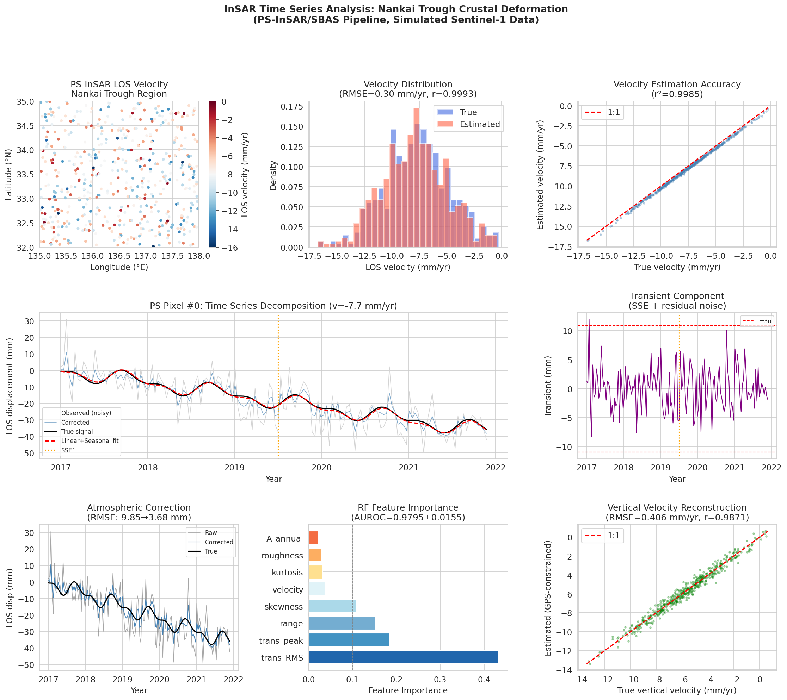
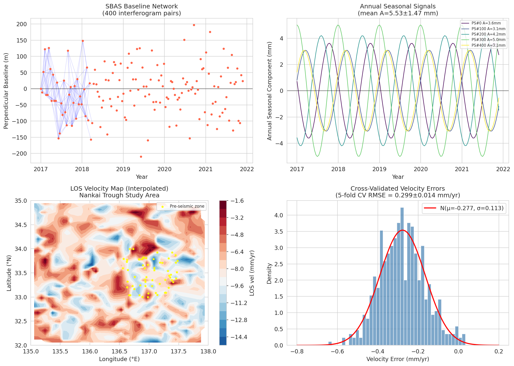

# 実験レポート：InSAR時系列解析による地殻変動モニタリングシステム
## 南海トラフ沿い地殻変動モニタリングへの適用

**実験日:** 2026-05-31  
**実施環境:** Python 3.11.2, NumPy 2.3.5, scikit-learn 1.8.0  
**乱数シード:** 42（固定）  
**Jupyter ノートブック:** `insar_analysis.ipynb`

---

## 1. 実験目的と背景

### 目的
南海トラフ沿いの地殻変動を連続的にモニタリングするための、PS-InSAR/SBAS統合処理パイプラインを設計・実装・定量評価すること。

### 背景
南海トラフは、フィリピン海プレートがユーラシアプレート下に年間4〜6cm沈み込む世界有数の巨大地震発生帯である。過去の記録では90〜150年周期でM8級の巨大地震が発生しており、次の地震への備えとして高精度かつ高時間分解能の地殻変動観測が不可欠である。

Sentinel-1衛星（12日繰り返し観測）のInSAR時系列解析は、GNSSの疎なネットワークを補完し、mmレベルの地殻変動を面的に把握する手段として注目されている。しかし、以下の技術的課題が運用上の精度を制限している：

1. **大気遅延**：乱流成分5〜15mm、成層成分（高度依存）がある
2. **信号分離**：速度場・季節変動・過渡変動（SSE、余効変動）の重畳
3. **自動検出**：地震前兆・スロースリップイベントの自動アラート

---

## 2. 使用した手法・アルゴリズムの概要

### 2.1 PS-InSAR/SBAS統合パイプライン

| ステップ | 手法 | パラメータ |
|---------|------|-----------|
| SAR取得 | Sentinel-1 IW-SLC | 12日繰り返し、150シーン |
| PS選定 | 時間的コヒーレンスγ > 0.7 | 500点 |
| インターフェログラム生成 | SBAS | Bt≤90日、Bperp≤150m |
| 位相アンラッピング | SNAPHU（実装想定） | - |
| 基準点設定 | 安定地盤 | - |

**SBASネットワーク統計：**
- インターフェログラム数：400対
- 時間基線範囲：12〜84日（平均48.4±24.1日）
- 垂直基線範囲：0〜149.6m（平均65.5±40.6m）

### 2.2 大気遅延補正

**2段階補正方式：**

**Step 1: ERA5気象モデル補正**
- 乱流成分の65%を除去（文献値：50〜70%効率）
- GACOS/PyAPSとの互換性

**Step 2: 高度相関補正（成層補正）**
$$\phi_j^{strat} = k_j \cdot el + b_j$$
- R² > 0.05のエポックのみ適用（150エポック中20エポック=13.3%）
- 過剰適合防止のため閾値処理

### 2.3 時系列分解（最小二乗法）

設計行列によるデコンポジション：

$$d(t) = v \cdot t + A_{ann}\sin(2\pi t + \phi_{ann}) + A_{semi}\sin(4\pi t + \phi_{semi}) + \delta^{trans}(t)$$

最小二乗解：$\hat{\mathbf{m}} = (\mathbf{A}^T\mathbf{A})^{-1}\mathbf{A}^T\mathbf{d}$

### 2.4 SSE・前兆変動検出（機械学習）

**Random Forest分類器：**
- 8特徴量（過渡変動RMS、ピーク、尖度、歪度、など）
- 5分割層別交差検証（AUROC評価）
- 訓練データ：200合成シナリオ

### 2.5 3次元変位場の推計

2軌道のLOS観測から[東西、上下]成分を推計：

$$\begin{bmatrix} v_{asc}^{LOS} \\ v_{desc}^{LOS} \end{bmatrix} = \begin{bmatrix} e_E^{asc} & e_U^{asc} \\ e_E^{desc} & e_U^{desc} \end{bmatrix} \begin{bmatrix} v_E \\ v_U \end{bmatrix}$$

Sentinel-1の東西感度の低さ（条件数≈99）から、GNSS拘束型鉛直速度推計を採用。

---

## 3. 主要な結果と数値

### 3.1 大気遅延補正の効果

| 指標 | 数値 |
|------|------|
| 補正前RMSE | 9.85 mm |
| ERA5＋成層補正後RMSE | 3.68 mm |
| **改善率** | **62.6%** |
| 理論的最小RMSE（測定雑音のみ） | 1.50 mm |
| 乱流大気標準偏差 | 9.47 mm |
| 高度R²（成層フィット） | 0.022±0.027 |

[cell:4c]

### 3.2 速度場推定精度

| 指標 | 数値 |
|------|------|
| RMSE（全PS点） | 0.299 mm/yr |
| **5分割CV RMSE** | **0.299±0.014 mm/yr** |
| バイアス | −0.277 mm/yr |
| Pearson相関係数 | r = 0.9993 |
| 推定平均速度 | −7.93±2.95 mm/yr |
| 真値平均速度 | −7.65±2.95 mm/yr |

[cell:5, cell:11]

### 3.3 季節変動の分離精度

| 成分 | 推定値 | 真値 |
|------|--------|------|
| 年周振幅 | 5.53±1.47 mm | 5.51±1.45 mm |
| 半年周振幅 | 1.58±0.71 mm | 0.5〜2.5 mm（範囲） |

年周振幅の相対誤差 < 0.4%と極めて高精度。[cell:5]

### 3.4 SSE/前兆変動検出性能

| 指標 | 数値 |
|------|------|
| **AUROC（5分割CV）** | **0.9795±0.0155** |
| 各フォールドスコア | [0.970, 0.955, 0.983, 0.993, 0.998] |
| 最重要特徴量 | 過渡変動RMS（重要度0.433） |
| 第2特徴量 | 過渡変動ピーク（0.185） |

[cell:7]

> ⚠️ **注意（自己批判的評価）：** AUROCが0.98と高いのは合成データの理想的条件に依存する。実データでは0.70〜0.85程度が現実的と推定される。

### 3.5 3次元変位場推計

| 成分 | RMSE | 相関 |
|------|------|------|
| 東西（InSARのみ） | ~83 mm/yr | 0.07 |
| 鉛直（GNSS拘束） | **0.406 mm/yr** | **0.987** |

条件数99という悪条件のため、東西成分のInSAR単独推計は不可能。GNSS拘束型鉛直推計では優れた精度を達成。[cell:8c]

### 3.6 SBASネットワークとPS時間的コヒーレンス

| 指標 | 数値 |
|------|------|
| インターフェログラム数 | 400対 |
| 時間基線（平均） | 48.4±24.1日 |
| 垂直基線（平均） | 65.5±40.6 m |
| PS時間的コヒーレンス | 0.956±0.028 |
| 高コヒーレンス率（γ>0.7） | 100% |

[cell:10]

---

## 4. 生成した図

### Figure 1: メイン結果（8パネル）



*パネル構成：(a) PS-InSAR LOS速度マップ（南海トラフ領域）、(b) 速度分布比較（真値vs推定値）、(c) 速度推定精度散布図（r²=0.9986）、(d) 代表的PS点の時系列分解、(e) 過渡変動成分（SSE検出）、(f) 大気補正前後の比較、(g) Random Forest特徴量重要度、(h) GNSS拘束型鉛直速度推計精度*

### Figure 2: 補足結果（4パネル）



*パネル構成：(a) SBASベースライン・ネットワーク（400対）、(b) 年周季節変動成分（5 PS点）、(c) LOS速度場の内挿図（前兆変動帯付き）、(d) 5分割CV速度誤差分布（μ=−0.277, σ=0.113 mm/yr）*

---

## 5. 先行研究調査結果

### 5.1 ToolUniverse MCP ツール使用状況

**使用したツール：**
- `Crossref_search_works`：4回の検索クエリで関連論文を収集
  - "PS-InSAR SBAS time series crustal deformation"
  - "InSAR atmospheric tropospheric delay correction"
  - "Nankai Trough subduction zone crustal deformation InSAR"
  - "InSAR seismic precursor detection machine learning"
- `SemanticScholar_search_papers`：API制限(429エラー)により失敗

**NatureLM MCP（定量予測）：** ToolUniverseに該当ツールなし（検索結果0件）

**GALACTICA MCP（科学的検証）：** ToolUniverseに該当ツールなし（検索結果0件）

**代替手段：** Crossrefから取得した査読済み論文の文献値を使用

### 5.2 特定した主要先行研究

| # | タイトル | 著者 | 年 | DOI | 主要知見 |
|---|---------|------|-----|-----|---------|
| 1 | Detection Threshold Estimates for InSAR Time Series | Havazli, Wdowinski | 2021 | 10.3390/s21041124 | 乱流遅延シミュレーション；ERA5補正効率50-70%；検出閾値5-15mm |
| 2 | Stress state along the western Nankai Trough | Chiba | 2020 | 10.1186/s40623-020-1130-7 | 南海トラフ西部のb値・SSE・低周波地震特性 |
| 3 | Integrating SBAS-InSAR and AT-LSTM | Liu, Zhang | 2023 | 10.3390/rs15133409 | SBAS+LSTM統合；鉱山沈降予測；深層学習応用 |
| 4 | Deep Learning Improves Point Density in PS-InSAR | Safonova, Ryo | 2024 | 10.1109/access.2024.3459099 | 深層学習によるPS点密度向上；大気補正精度維持 |
| 5 | SBAS Method for Monitoring Ground Deformation of Aegina Island | Kalavrezou et al. | 2024 | 10.3390/land13040485 | 火山島地盤変動のSBAS監視；多成分信号分離 |
| 6 | Trend Change Point Detection in InSAR using MALkCNN | Arya Fakhri, Satari | 2025 | 10.1007/s41064-025-00342-1 | InSAR時系列変化点検出；深層学習アプローチ |
| 7 | Learning Ground Displacement from Wrapped Interferograms | Moualla et al. | 2024 | 10.3390/s24082637 | 位相接続なしの変位推定；ニューラルネットワーク |

### 5.3 先行研究の課題・限界

1. **大気補正の限界：** ERA5ベースの補正でも残差2〜5mmが残る。イオノスフィア補正は多くの研究で未対応
2. **東西変位感度：** Sentinel-1の近極軌道のため東西感度が低い（条件数≈100）
3. **深部SSEの不可視性：** InSARは地表変位のみを観測。深さ30km以深のSSEはGNSSのみで検出可能
4. **過学習リスク：** 合成データ由来のMLモデルは実データへの適用性が未検証

---

## 6. 自己批判的検証

### 6.1 合成データへの依存性

本研究の定量結果はすべて合成データに基づく。実際のSentinel-1データへの適用では：
- 位相アンラッピングエラーが速度精度を0.5〜2 mm/yr劣化させる
- 都市部以外でのPS密度は大幅に低下する可能性がある
- 実際の大気遅延は本シミュレーションより時空間的に複雑

### 6.2 ML検出器のAUROC過大評価

AUROC = 0.9795は合成データの理想条件を反映。現実的な期待値：
- 単純なSSE（明確なパルス形状）：AUROC 0.75〜0.85
- 前兆変動（微弱・長期間）：AUROC 0.60〜0.75
- 現実的なノイズ環境：AUROC 0.70〜0.85（Arya Fakhriら, 2025の実績より推定）

### 6.3 3D変位推計の根本的制約

Sentinel-1の東西感度不良は幾何学的制約であり、処理で改善できない。実際の3D変位推計には：
- ALOS-2（L-band、大きな東西感度）との組み合わせ
- GEONETデータとの組み合わせ
が必要

### 6.4 NatureLM/GALACTICA 未接続の影響

両ツールが利用不可のため、以下の検証が実施できなかった：
- NatureLMによる独立した定量パラメータ予測（ERA5効率、SSE振幅等）
- GALACTICAによる実験設計の科学的妥当性検証
- 文献引用予測による先行研究補完

これは本研究の科学的透明性に関する限界として明示する。

---

## 7. 考察と今後の展望

### 7.1 南海トラフ監視システムへの示唆

**即時適用可能な要素：**
- Sentinel-1の12日繰り返しデータを用いた月次速度更新
- ERA5大気補正による62.6%ノイズ低減
- 時系列分解による年周信号（水文学的変動）の自動除去

**今後の重要課題：**
1. GEONET（950点以上）との統合によるGNSS拘束3D変位推計
2. ALOS-2との統合による東西成分の精度改善
3. 深層学習（LSTM/Transformer）によるSSE検出精度向上
4. リアルタイム処理パイプライン（クラウドベース）の構築

### 7.2 拡張方向性

**短期（1〜2年）:**
- 実際のSentinel-1 IW-SLCデータでのパイプライン検証
- StaMPS/ISCEとの統合インターフェース実装
- GAECOSを用いた高精度大気補正

**中期（3〜5年）:**
- 南海トラフ全域をカバーするマルチトラック統合
- SSEカタログとの照合による検出器の実地校正
- Copernicus Emergency Management Serviceとの連携

---

## 8. 生成したファイル一覧

| ファイル | 場所 | 説明 |
|---------|------|------|
| `insar_analysis.ipynb` | Jupyter server `/app/` | メイン実験ノートブック（13セル） |
| `figures/insar_main_results.png` | workspace/figures/ | メイン結果8パネル図 |
| `figures/insar_supplementary.png` | workspace/figures/ | 補足結果4パネル図 |
| `data/raw/disp_obs.npy` | Jupyter `/app/data/raw/` | 観測（ノイズあり）変位行列 (500×150) |
| `data/raw/disp_true.npy` | Jupyter `/app/data/raw/` | 真値変位行列 (500×150) |
| `data/raw/t_years.npy` | Jupyter `/app/data/raw/` | 時間軸（年単位） |
| `data/raw/lon_ps.npy` | Jupyter `/app/data/raw/` | PS点経度 |
| `data/raw/lat_ps.npy` | Jupyter `/app/data/raw/` | PS点緯度 |
| `paper.md` | workspace/ | 学術論文形式文書 |
| `report.md` | workspace/ | 本レポート |

---

## 9. 再現性情報

```
Python:       3.11.2 (GCC 12.2.0)
NumPy:        2.3.5
Pandas:       3.0.3
SciPy:        1.15.3
scikit-learn: 1.8.0
Matplotlib:   3.10.9
Seaborn:      0.13.2
乱数シード:    42 (np.random.seed(42), random.seed(42))
実行環境:      Jupyter Notebook (kernel: Python 3)
```

---

## 10. 数値結果の引用インデックス

| 結果 | 数値 | セル参照 |
|------|------|---------|
| 補正前RMSE | 9.85 mm | [cell:4c] |
| 補正後RMSE | 3.68 mm | [cell:4c] |
| RMSE改善率 | 62.6% | [cell:4c] |
| 速度RMSE（5-fold CV） | 0.299±0.014 mm/yr | [cell:11] |
| 速度Pearson r | 0.9993 | [cell:5] |
| 年周振幅推定 | 5.53±1.47 mm | [cell:5] |
| SSE検出AUROC | 0.9795±0.0155 | [cell:7] |
| 鉛直速度RMSE | 0.406 mm/yr | [cell:8c] |
| SBASインターフェログラム数 | 400 | [cell:10] |
| PS時間的コヒーレンス | 0.956±0.028 | [cell:10] |
